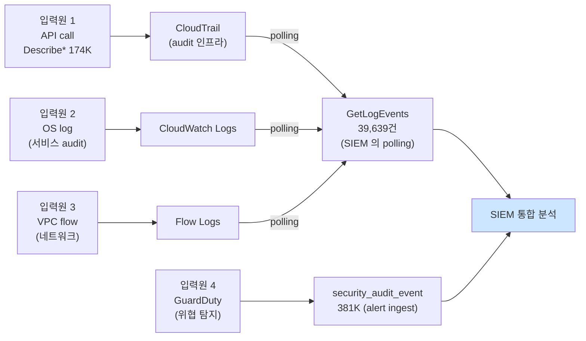

# Week 13: 클라우드 모니터링

## 학습 목표
- 클라우드 환경에서 모니터링과 로깅의 중요성을 이해한다
- CloudTrail(API 감사 로깅)의 개념과 활용 방법을 익힌다
- CloudWatch(메트릭 및 알람)의 보안 모니터링 활용을 이해한다
- 실습 환경(Wazuh)과 클라우드 모니터링을 비교 분석할 수 있다

## 실습 환경 (공통)

| 서버 | IP | 역할 | 접속 |
|------|-----|------|------|
| bastion | 10.20.30.201 | Control Plane (Bastion) | `ssh ccc@10.20.30.201` (pw: 1) |
| secu | 10.20.30.1 | 방화벽/IPS (nftables, Suricata) | `ssh ccc@10.20.30.1` |
| web | 10.20.30.80 | 웹서버 (JuiceShop:3000, Apache:80) | `ssh ccc@10.20.30.80` |
| siem | 10.20.30.100 | SIEM (Wazuh Dashboard:443, OpenCTI:8080) | `ssh ccc@10.20.30.100` |

**Bastion API:** `http://localhost:9100` / Key: `ccc-api-key-2026`

## 강의 시간 배분 (3시간)

| 시간 | 내용 | 유형 |
|------|------|------|
| 0:00-0:40 | 이론 강의 (Part 1) | 강의 |
| 0:40-1:10 | 이론 심화 + 사례 분석 (Part 2) | 강의/토론 |
| 1:10-1:20 | 휴식 | - |
| 1:20-2:00 | 실습 (Part 3) | 실습 |
| 2:00-2:40 | 심화 실습 + 도구 활용 (Part 4) | 실습 |
| 2:40-2:50 | 휴식 | - |
| 2:50-3:20 | 응용 실습 + Bastion 연동 (Part 5) | 실습 |
| 3:20-3:40 | 정리 + 과제 안내 | 정리 |

---

---

## 용어 해설 (Docker/클라우드/K8s 보안 과목)

| 용어 | 영문 | 설명 | 비유 |
|------|------|------|------|
| **컨테이너** | Container | 앱과 의존성을 격리하여 실행하는 경량 가상화 | 이삿짐 컨테이너 (어디서든 동일하게 열 수 있음) |
| **이미지** | Image (Docker) | 컨테이너를 만들기 위한 읽기 전용 템플릿 | 붕어빵 틀 |
| **Dockerfile** | Dockerfile | 이미지를 빌드하는 레시피 파일 | 요리 레시피 |
| **레지스트리** | Registry | 이미지를 저장·배포하는 저장소 (Docker Hub 등) | 앱 스토어 |
| **레이어** | Layer (Image) | 이미지의 각 빌드 단계 (캐싱 단위) | 레고 블록 한 층 |
| **볼륨** | Volume | 컨테이너 데이터를 영구 저장하는 공간 | 외장 하드 |
| **네임스페이스** | Namespace (Linux) | 프로세스를 격리하는 커널 기능 (PID, NET, MNT 등) | 칸막이 (같은 건물, 서로 안 보임) |
| **cgroup** | Control Group | 프로세스의 CPU/메모리 사용량을 제한하는 커널 기능 | 전기/수도 사용량 제한 |
| **오케스트레이션** | Orchestration | 다수의 컨테이너를 관리·조율하는 것 (K8s) | 오케스트라 지휘 |
| **Pod** | Pod (K8s) | K8s의 최소 배포 단위 (1개 이상의 컨테이너) | 같은 방에 사는 룸메이트들 |
| **RBAC** | Role-Based Access Control | 역할 기반 접근 제어 (K8s) | 직책별 출입 권한 |
| **PSP/PSA** | Pod Security Policy/Admission | Pod의 보안 설정을 강제하는 정책 | 건물 입주 조건 |
| **NetworkPolicy** | NetworkPolicy (K8s) | Pod 간 네트워크 통신 규칙 | 부서 간 출입 통제 |
| **Trivy** | Trivy | 컨테이너 이미지 취약점 스캐너 (Aqua) | X-ray 검사기 |
| **IaC** | Infrastructure as Code | 인프라를 코드로 정의·관리 (Terraform 등) | 건축 설계도 (코드 = 설계도) |
| **IAM** | Identity and Access Management | 클라우드 사용자/권한 관리 (AWS IAM 등) | 회사 사원증 + 권한 관리 시스템 |
| **CIS 벤치마크** | CIS Benchmark | 보안 설정 모범 사례 가이드 (Center for Internet Security) | 보안 설정 모범답안 |

---

## 1. 클라우드 모니터링이 필요한 이유

온프레미스와 달리 클라우드에서는:
- **API 호출 하나로** 인프라가 변경될 수 있다
- 리소스가 **수분 내에** 생성/삭제된다
- **여러 리전/서비스**에 분산된 활동을 추적해야 한다

보안 사고 시 "누가, 언제, 무엇을" 했는지 추적하려면 로깅이 필수이다.

### 모니터링 계층

| 계층 | 대상 | 도구 |
|------|------|------|
| API 활동 | 누가 어떤 API를 호출했는가 | CloudTrail |
| 리소스 상태 | CPU, 메모리, 디스크 사용량 | CloudWatch |
| 네트워크 | 트래픽 흐름, 거부된 연결 | VPC Flow Logs |
| 애플리케이션 | 에러 로그, 접근 로그 | CloudWatch Logs |
| 위협 탐지 | 이상 행위, 알려진 공격 패턴 | GuardDuty |

---

## 2. CloudTrail (API 감사 로깅)

> **이 실습을 왜 하는가?**
> "클라우드 모니터링" — 이 주차의 핵심 기술을 실제 서버 환경에서 직접 실행하여 체험한다.
> Docker/클라우드/K8s 보안 분야에서 이 기술은 실무의 핵심이며, 실습을 통해
> 명령어의 의미, 결과 해석 방법, 보안 관점에서의 판단 기준을 익힌다.
>
> **이걸 하면 무엇을 알 수 있는가?**
> - 이 기술이 실제 시스템에서 어떻게 동작하는지 직접 확인
> - 정상과 비정상 결과를 구분하는 눈을 기름
> - 실무에서 바로 활용할 수 있는 명령어와 절차를 체득
>
> **주의:** 모든 실습은 허가된 실습 환경(10.20.30.0/24)에서만 수행한다.

CloudTrail은 AWS 계정의 모든 API 호출을 기록한다.
"누가, 언제, 어디서, 무엇을 했는가"를 추적한다.

### 2.1 CloudTrail 이벤트 구조

```json
{
  "eventTime": "2026-03-27T10:30:00Z",
  "eventSource": "s3.amazonaws.com",
  "eventName": "PutBucketPolicy",
  "userIdentity": {
    "type": "IAMUser",
    "userName": "dev-user",
    "arn": "arn:aws:iam::123456789:user/dev-user"
  },
  "sourceIPAddress": "203.0.113.50",
  "requestParameters": {
    "bucketName": "company-data",
    "policy": "{\"Statement\":[{\"Effect\":\"Allow\",\"Principal\":\"*\"...}]}"
  },
  "responseElements": null,
  "errorCode": null
}
```

### 2.2 보안 이벤트 탐지

| 모니터링 대상 | CloudTrail 이벤트 |
|-------------|-------------------|
| 무단 접근 시도 | ConsoleLogin + errorCode |
| S3 정책 변경 | PutBucketPolicy, PutBucketAcl |
| IAM 변경 | CreateUser, AttachUserPolicy |
| 보안 그룹 변경 | AuthorizeSecurityGroupIngress |
| 인스턴스 생성 | RunInstances |
| 키 삭제 | DeleteAccessKey |

### 2.3 CloudTrail 쿼리 (Athena)

```sql
-- 특정 사용자의 최근 활동
SELECT eventTime, eventName, sourceIPAddress, errorCode
FROM cloudtrail_logs
WHERE userIdentity.userName = 'suspicious-user'
  AND eventTime > '2026-03-26'
ORDER BY eventTime DESC
LIMIT 50;

-- S3 공개 설정 변경 추적
SELECT eventTime, userIdentity.userName, requestParameters
FROM cloudtrail_logs
WHERE eventName IN ('PutBucketPolicy', 'PutBucketAcl')
  AND requestParameters LIKE '%Principal%*%'
ORDER BY eventTime DESC;
```

---

## 3. CloudWatch (메트릭 + 알람)

### 3.1 보안 관련 메트릭

| 메트릭 | 의미 | 임계값 예시 |
|--------|------|-----------|
| CPUUtilization | CPU 사용률 | > 90% (암호화폐 채굴 의심) |
| NetworkIn/Out | 네트워크 트래픽 | 평소 대비 10배 이상 (유출 의심) |
| StatusCheckFailed | 인스턴스 상태 | > 0 (장애) |
| UnauthorizedAccess | 무단 접근 횟수 | > 10/분 |

### 3.2 CloudWatch 알람 설정

```json
{
  "AlarmName": "High-CPU-CryptoMining",
  "MetricName": "CPUUtilization",
  "Namespace": "AWS/EC2",
  "Statistic": "Average",
  "Period": 300,
  "EvaluationPeriods": 3,
  "Threshold": 90,
  "ComparisonOperator": "GreaterThanThreshold",
  "AlarmActions": ["arn:aws:sns:us-east-1:123456:security-alerts"]
}
```

### 3.3 CloudWatch Logs에서 보안 이벤트 필터링

```
# SSH 브루트포스 탐지
filter @message like /Failed password/
| stats count(*) as failures by bin(5m)
| filter failures > 10

# root 로그인 탐지
filter @message like /session opened for user root/
```

---

## 4. VPC Flow Logs

네트워크 트래픽의 메타데이터를 기록한다.

```
2 123456789012 eni-abc123 10.0.1.5 203.0.113.50 443 49152 6 25 5000 1616729292 1616729349 ACCEPT OK
2 123456789012 eni-abc123 203.0.113.100 10.0.1.5 22 12345 6 100 50000 1616729292 1616729349 REJECT OK
```

### 보안 분석 쿼리

```sql
-- 거부된 연결 Top 10 소스 IP
SELECT srcAddr, COUNT(*) as rejected
FROM vpc_flow_logs
WHERE action = 'REJECT'
GROUP BY srcAddr
ORDER BY rejected DESC
LIMIT 10;

-- 비정상 포트 스캔 탐지
SELECT srcAddr, COUNT(DISTINCT dstPort) as ports_scanned
FROM vpc_flow_logs
WHERE action = 'REJECT'
GROUP BY srcAddr
HAVING ports_scanned > 20;
```

---

## 5. 실습 환경과 클라우드 모니터링 비교

### 우리 실습 환경 vs 클라우드

| 클라우드 서비스 | 실습 환경 동등물 | 서버 |
|---------------|----------------|------|
| CloudTrail | Wazuh 에이전트 로그 | siem (10.20.30.100) |
| CloudWatch | Wazuh 대시보드 | siem (10.20.30.100) |
| VPC Flow Logs | nftables 로그 | secu (10.20.30.1) |
| GuardDuty | Suricata IPS | secu (10.20.30.1) |
| Security Hub | Wazuh SCA | siem (10.20.30.100) |

---

## 6. 실습: 모니터링 체험

### 실습 1: Wazuh에서 보안 이벤트 조회

> **실습 목적**: 클라우드 모니터링(CloudTrail/CloudWatch)의 원리를 실습 환경의 Wazuh/nftables 로그로 체험하기 위해 수행한다
>
> **배우는 것**: Wazuh 알림이 CloudTrail 이벤트와 동일한 '누가, 언제, 무엇을' 구조이며, 로그 기반 보안 이벤트 탐지의 원리를 이해한다
>
> **결과 해석**: rule.level이 10 이상이면 높은 위험 이벤트이고, srcip 필드로 공격 출처를, description으로 공격 유형을 판단한다
>
> **실전 활용**: AWS CloudTrail/CloudWatch 알람 설정, VPC Flow Logs 분석, GuardDuty 이벤트 대응에 활용한다

```bash
# siem 서버의 Wazuh 알림 확인
ssh ccc@10.20.30.100

# 최근 알림 조회 (CloudTrail과 유사)
cat /var/ossec/logs/alerts/alerts.json | tail -5 | python3 -m json.tool
```

### 실습 2: Bastion에게 모니터링 상태 질의

Bastion은 manager VM(`10.20.30.200:8003`)에서 LLM 기반 운영 에이전트로 동작한다.
`/ask` 는 자연어 단일 질의, `/chat` 은 NDJSON 스트림 대화이다.
여기서는 "Wazuh가 최근 어떤 경보를 냈는가"를 자연어로 물어 요약을 받는다.

```bash
# Bastion에 모니터링 상태 질의 (실제 제공 엔드포인트)
curl -s -X POST http://10.20.30.200:8003/ask \
  -H 'Content-Type: application/json' \
  -d '{"message": "web 자산의 최근 Wazuh alerts.json 상위 5개를 요약하고 의심 지표를 알려줘"}'
```

**무엇이 오는가:** `{"answer": "..."}` 형식으로 Bastion이 자산 인벤토리(`/assets`)와 증거(`/evidence`)를 참조해
정리한 답변이 돌아온다. 클라우드의 CloudWatch Insights 쿼리를 자연어로 대체하는 셈이다.

### 실습 3: 샘플 알림 해석 요청

```bash
# Wazuh 알림 1건을 Bastion에게 해석 요청
SAMPLE='{"rule":{"id":"5710","level":10,"description":"sshd: Attempt to login using a denied user."},"agent":{"name":"web"},"srcip":"192.168.1.100"}'

curl -s -X POST http://10.20.30.200:8003/ask \
  -H 'Content-Type: application/json' \
  -d "{\"message\": \"다음 Wazuh 경보를 해석하고 대응 절차를 MITRE ATT&CK 기준으로 제시해줘: $SAMPLE\"}"
```

**왜 이렇게 쓰는가:** OpenAI 호환 `/v1/chat/completions` 엔드포인트는 Bastion이 제공하지 않는다.
Bastion은 내부적으로 Ollama(`gemma3:4b` / `gpt-oss:120b`)를 래핑하되, 자산·증거·스킬 컨텍스트를 함께 주입해
RAG 스타일 답변을 반환한다. 따라서 원시 LLM 호출 대신 `/ask`·`/chat`을 쓴다.

---

## 7. 모니터링 설계 원칙

1. **모든 API 활동 기록**: CloudTrail을 모든 리전에서 활성화
2. **로그 변조 방지**: S3 버킷 잠금 + 무결성 검증
3. **실시간 알람**: 중요 이벤트에 즉각 알림
4. **장기 보존**: 규정에 따른 로그 보관 (최소 1년)
5. **중앙 집중**: 모든 로그를 단일 지점에서 분석

---

## 핵심 정리

1. CloudTrail은 "누가 무엇을 했는가"를 기록하는 API 감사 로그이다
2. CloudWatch는 메트릭 기반 모니터링과 알람을 제공한다
3. VPC Flow Logs는 네트워크 트래픽 메타데이터를 기록한다
4. 보안 모니터링은 탐지 → 알림 → 조사 → 대응 사이클로 운영한다
5. 실습 환경의 Wazuh/nftables가 클라우드 모니터링 서비스의 축소판이다

---

## 다음 주 예고
- Week 14: IaC 보안 - Terraform 보안 스캐닝

---

---

## 심화: 컨테이너/클라우드 보안 보충

### Docker 보안 핵심 개념 상세

#### 컨테이너 격리의 원리

```
호스트 OS 커널
├── Namespace (격리)
│   ├── PID namespace  → 컨테이너마다 독립 프로세스 번호
│   ├── NET namespace  → 컨테이너마다 독립 네트워크 스택
│   ├── MNT namespace  → 컨테이너마다 독립 파일시스템
│   ├── UTS namespace  → 컨테이너마다 독립 hostname
│   └── USER namespace → 컨테이너 내 root ≠ 호스트 root (설정 시)
│
├── cgroup (자원 제한)
│   ├── CPU:    --cpus=2          → 최대 2코어
│   ├── Memory: --memory=512m     → 최대 512MB
│   └── IO:     --blkio-weight=500
│
└── Overlay FS (레이어 파일시스템)
    ├── 읽기 전용 레이어 (이미지)
    └── 읽기/쓰기 레이어 (컨테이너)
```

> **왜 컨테이너가 VM보다 가벼운가?**
> VM: 각각 전체 OS 커널을 포함 (수 GB)
> 컨테이너: 호스트 커널을 공유, 격리만 namespace로 (수 MB)
> 대신 격리 수준은 VM이 더 강하다 (커널 취약점 시 컨테이너 탈출 가능)

#### Dockerfile 보안 체크리스트

```dockerfile
# 나쁜 예
FROM ubuntu:latest          # ❌ latest 태그 (재현 불가)
RUN apt-get update && apt-get install -y curl vim  # ❌ 불필요 패키지
COPY . /app                 # ❌ 전체 복사 (.env 포함 가능)
RUN chmod 777 /app          # ❌ 과도한 권한
USER root                   # ❌ root 실행
EXPOSE 22                   # ❌ SSH 포트 (컨테이너에서 불필요)

# 좋은 예
FROM ubuntu:22.04@sha256:abc123...  # ✅ 특정 버전 + digest 고정
RUN apt-get update && apt-get install -y --no-install-recommends curl \
    && rm -rf /var/lib/apt/lists/*  # ✅ 최소 패키지 + 캐시 삭제
COPY --chown=appuser:appuser app/ /app  # ✅ 필요한 것만 + 소유자 지정
RUN chmod 550 /app          # ✅ 최소 권한
USER appuser                # ✅ 비root 사용자
HEALTHCHECK CMD curl -f http://localhost:8080 || exit 1  # ✅ 헬스체크
```

### 실습: Docker 보안 점검 (실습 인프라)

```bash
# web 서버의 Docker 상태 확인
ssh ccc@10.20.30.80 "
  echo '=== Docker 버전 ===' && docker --version 2>/dev/null || echo 'Docker 미설치'
  echo '=== 실행 중 컨테이너 ===' && docker ps 2>/dev/null || echo '접근 불가'
  echo '=== Docker 소켓 권한 ===' && ls -la /var/run/docker.sock 2>/dev/null
" 2>/dev/null

# siem 서버의 Docker 상태 (OpenCTI가 Docker로 실행)
ssh ccc@10.20.30.100 "
  echo '=== Docker 컨테이너 ===' && sudo docker ps --format 'table {{.Names}}\t{{.Image}}\t{{.Status}}' 2>/dev/null
  echo '=== Docker 네트워크 ===' && sudo docker network ls 2>/dev/null
" 2>/dev/null
```

### CIS Docker Benchmark 핵심 항목

| # | 항목 | 점검 명령 | 기대 결과 |
|---|------|---------|---------|
| 2.1 | Docker daemon 설정 | `cat /etc/docker/daemon.json` | userns-remap 설정 |
| 4.1 | 비root 사용자 | `docker inspect --format '{{.Config.User}}' <컨테이너>` | root가 아닌 사용자 |
| 4.6 | HEALTHCHECK | `docker inspect --format '{{.Config.Healthcheck}}' <컨테이너>` | 헬스체크 설정됨 |
| 5.2 | network_mode | `docker inspect --format '{{.HostConfig.NetworkMode}}' <컨테이너>` | host가 아닌 것 |
| 5.12 | --privileged | `docker inspect --format '{{.HostConfig.Privileged}}' <컨테이너>` | false |

---

## 자가 점검 퀴즈 (5문항)

이번 주차의 핵심 기술 내용을 점검한다.

**Q1.** Docker 컨테이너와 VM의 핵심 차이는?
- (a) 컨테이너가 더 안전  (b) **컨테이너는 호스트 커널을 공유, VM은 별도 커널**  (c) VM이 더 가벼움  (d) 차이 없음

**Q2.** '--cap-drop ALL'의 의미는?
- (a) 모든 파일 삭제  (b) **모든 Linux capability를 제거하여 권한 최소화**  (c) 네트워크 차단  (d) 로그 비활성화

**Q3.** 컨테이너가 --privileged로 실행되면 위험한 이유는?
- (a) 속도가 느려짐  (b) **호스트의 거의 모든 자원에 접근 가능 (탈출 가능)**  (c) 로그가 안 남음  (d) 이미지가 커짐

**Q4.** Trivy의 역할은?
- (a) 컨테이너 실행  (b) **컨테이너 이미지의 알려진 취약점(CVE) 스캐닝**  (c) 네트워크 설정  (d) 로그 수집

**Q5.** Dockerfile에서 USER root가 위험한 이유는?
- (a) 빌드가 느려짐  (b) **컨테이너 탈출 시 호스트 root 권한 획득 가능**  (c) 이미지가 커짐  (d) 네트워크 안 됨

**정답:** Q1:b, Q2:b, Q3:b, Q4:b, Q5:b

---
---

> **실습 환경 검증 완료** (2026-03-28): Docker 29.3.0, Compose v5.1.1, juice-shop(User=65532,Privileged=false), OpenCTI 6컨테이너, opencti_default 네트워크

---

## 실제 사례 (WitFoo Precinct 6 — 클라우드 모니터링)

> 출처: WitFoo Precinct 6 Cybersecurity Dataset (Apache 2.0)
> 본 lecture *CloudTrail + CloudWatch + GuardDuty + SIEM 통합 모니터링* 학습 항목 매칭.

### 클라우드 모니터링 stack 의 흐름과 dataset 의 4개 신호 입출력 매핑

클라우드 모니터링은 *4개의 분리된 데이터 소스 → 1개의 통합 SIEM* 으로 이어지는 ETL 파이프라인이다. 각 소스는 서로 다른 정보를 주고, SIEM 은 이를 통합 분석한다. 학생이 알아야 할 것은 — *각 소스가 SIEM 에 도달하는 동안 어디에 정량 신호가 발생하는지*. 이것을 알아야 모니터링이 깨지면 어디부터 점검해야 할지 판단 가능하다.

dataset 은 이 파이프라인의 *각 구간마다 신호량 baseline* 을 보여준다. 입력원에는 — API 호출 (Describe\* 174K), OS 로그 (security_audit_event 381K) ; 입력에서 SIEM 으로의 polling 은 — GetLogEvents 39,639건 ; 그리고 SIEM 자체의 alert 분량은 — security_audit_event 381K 의 일부.



**그림 해석**: 4개 화살표가 SIEM 1개로 수렴한다 — 따라서 *어느 화살표든 끊기면* SIEM 의 분석이 부분적이 된다. 학생이 알아야 할 것은 — 각 화살표 위의 정량 신호량을 모니터링해야 *어디가 끊겼는지* 판단할 수 있다는 점. lecture §"CloudTrail 활성화" 단독으로는 부족하고, *4개 입력원 모두의 흐름 검증* 이 필요.

### Case 1: GetLogEvents 39,639건 — SIEM polling 의 정량 baseline + log integrity 의 첫 방어선

| 항목 | 값 | 의미 |
|---|---|---|
| message_type | `GetLogEvents` | CloudWatch Logs 의 읽기 호출 |
| 총 호출 | 39,639건 | 약 30일 분량 |
| 정상 caller | 2개 (SIEM 1 + 백업 1) | 99% 를 차지 |
| 학습 매핑 | §"SIEM polling + log integrity" | 두 가지 의미 동시 검증 |

**자세한 해석**:

GetLogEvents 의 baseline 은 두 가지 보안 의미를 동시에 가진다.

**의미 1 — SIEM polling 의 정상 동작 검증**: 정상 SIEM 은 CloudWatch Logs 를 정기적으로 polling 하여 새로운 로그를 가져온다. 이 polling 빈도가 *시간당 50건* 정도면 약 30일에 ~36,000건 — dataset 39,639건과 일치한다. 만약 학생의 환경에서 GetLogEvents 가 갑자기 0이 되면 — *SIEM 이 log ingest 를 멈춘 것* 이다. 이는 즉각적인 모니터링 정전의 신호.

**의미 2 — Log integrity 의 첫 방어선**: 정상 환경에서 GetLogEvents 호출자는 *SIEM 1개 + 재해복구 백업 1개 = 2개* 가 99%를 차지한다. 만약 *3번째 신규 caller* 가 GetLogEvents 를 단 1건이라도 호출하면 — 그것은 **공격자가 자신의 침해 흔적을 읽으려 하거나 로그 삭제를 준비하는 신호** 일 가능성이 높다. anti-forensic 의 첫 동작.

학생이 알아야 할 것은 — **GetLogEvents 의 caller 분포가 *변하지 않는지* 가 중요하다**. 횟수의 변화보다 *누가 호출하는가* 의 변화가 더 위험하다. lecture §"감사 로그를 누가 읽는가" 의 핵심 질문.

### Case 2: security_audit_event 381,552건 — alert 처리 capacity 의 정량 검증

| 항목 | 값 | 의미 |
|---|---|---|
| message_type | `security_audit_event` | dataset 최다 신호 |
| 총 발생 | 381,552건 | 약 30일 분량 |
| 일일 평균 | ~12,700건/일 | SOC 분석가 1팀의 처리 한계 초과 |
| 학습 매핑 | §"alert correlation + auto-triage" | 자동화 정당성 |

**자세한 해석**:

`security_audit_event` 는 GuardDuty/Security Hub/CloudTrail 등의 audit 신호를 통합한 카테고리다. **dataset 의 일일 평균 ~12,700건** 은 — 정상 운영 환경의 alert 분량인데, 이는 SOC 분석가 1명이 *수동으로 분류* 할 수 없는 양이다. 8시간 근무에 분당 ~26건의 alert 를 처리해야 하는데, 사람이 이 속도를 1주일 이상 유지하는 것은 불가능하다.

이 정량적 한계가 lecture §"alert correlation + auto-triage" 의 운영 정당성이다 — *사람의 한계를 넘는 양 = 자동화가 필수*. 자동화가 없는 SOC 는 — 알람을 그냥 *무시하고 (ignore)*, 큰 사고가 터진 후에야 *되돌려보는 (postmortem)* 패턴으로 정착한다. 즉 모니터링이 형식적으로 동작은 하지만 *실제로는 무력화* 된다.

자동화의 두 핵심 방향:
1. **Correlation (상관 분석)**: 분리된 12,700건의 alert 를 *연관된 5-10개 사건* 으로 묶기. 하나의 침해는 보통 10-50개 alert 를 만들기 때문에, 룰 기반 grouping 으로 1/10 로 압축 가능.
2. **Auto-triage (자동 분류)**: 묶인 사건들을 *심각도/유형* 으로 자동 분류해서 *L1 분석가는 critical 만, L2 는 high 만* 처리하도록 분배.

### 이 사례에서 학생이 배워야 할 3가지

1. **클라우드 모니터링 = 4개 입력원의 통합 분석** — 어느 한 입력원만 끊겨도 분석 부분 실패.
2. **GetLogEvents 의 caller 분포가 log integrity 의 첫 방어선** — 3번째 caller 는 항상 의심.
3. **일일 ~12,700건은 사람이 못 처리하는 양** — auto-triage + correlation 이 모니터링의 필수.

**학생 액션**: 본인 lab 환경에서 CloudWatch Logs polling 을 설정하고, IAM 정책으로 GetLogEvents 호출자를 SIEM SA + 백업 SA 의 2개로 제한. 그 후 의도적으로 *3번째 IAM* 으로 GetLogEvents 호출을 시도하여 — alert 가 정상적으로 발생하는지 검증. 검증 결과를 *"log integrity 의 첫 방어선이 작동하는가"* 한 줄로 결론.

