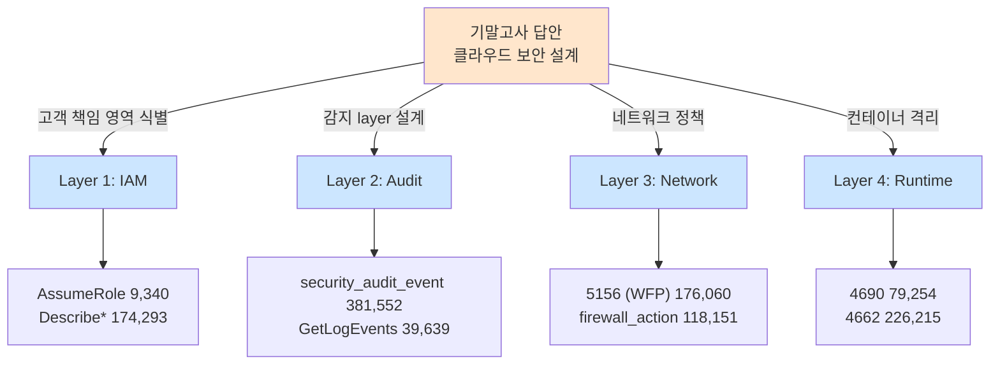

# Week 15: 기말고사 - 클라우드 보안 설계

## 학습 목표

## 실습 환경 (공통)

| 서버 | IP | 역할 | 접속 |
|------|-----|------|------|
| bastion | 10.20.30.201 | Control Plane (Bastion) | `ssh ccc@10.20.30.201` (pw: 1) |
| secu | 10.20.30.1 | 방화벽/IPS (nftables, Suricata) | `ssh ccc@10.20.30.1` |
| web | 10.20.30.80 | 웹서버 (JuiceShop:3000, Apache:80) | `ssh ccc@10.20.30.80` |
| siem | 10.20.30.100 | SIEM (Wazuh Dashboard:443, OpenCTI:8080) | `ssh ccc@10.20.30.100` |

**Bastion API:** `http://localhost:9100` / Key: `ccc-api-key-2026`

## 강의 시간 배분 (3시간)

| 시간 | 내용 | 유형 |
|------|------|------|
| 0:00-0:40 | 이론 강의 (Part 1) | 강의 |
| 0:40-1:10 | 이론 심화 + 사례 분석 (Part 2) | 강의/토론 |
| 1:10-1:20 | 휴식 | - |
| 1:20-2:00 | 실습 (Part 3) | 실습 |
| 2:00-2:40 | 심화 실습 + 도구 활용 (Part 4) | 실습 |
| 2:40-2:50 | 휴식 | - |
| 2:50-3:20 | 응용 실습 + Bastion 연동 (Part 5) | 실습 |
| 3:20-3:40 | 정리 + 과제 안내 | 정리 |

---

---

## 용어 해설 (Docker/클라우드/K8s 보안 과목)

| 용어 | 영문 | 설명 | 비유 |
|------|------|------|------|
| **컨테이너** | Container | 앱과 의존성을 격리하여 실행하는 경량 가상화 | 이삿짐 컨테이너 (어디서든 동일하게 열 수 있음) |
| **이미지** | Image (Docker) | 컨테이너를 만들기 위한 읽기 전용 템플릿 | 붕어빵 틀 |
| **Dockerfile** | Dockerfile | 이미지를 빌드하는 레시피 파일 | 요리 레시피 |
| **레지스트리** | Registry | 이미지를 저장·배포하는 저장소 (Docker Hub 등) | 앱 스토어 |
| **레이어** | Layer (Image) | 이미지의 각 빌드 단계 (캐싱 단위) | 레고 블록 한 층 |
| **볼륨** | Volume | 컨테이너 데이터를 영구 저장하는 공간 | 외장 하드 |
| **네임스페이스** | Namespace (Linux) | 프로세스를 격리하는 커널 기능 (PID, NET, MNT 등) | 칸막이 (같은 건물, 서로 안 보임) |
| **cgroup** | Control Group | 프로세스의 CPU/메모리 사용량을 제한하는 커널 기능 | 전기/수도 사용량 제한 |
| **오케스트레이션** | Orchestration | 다수의 컨테이너를 관리·조율하는 것 (K8s) | 오케스트라 지휘 |
| **Pod** | Pod (K8s) | K8s의 최소 배포 단위 (1개 이상의 컨테이너) | 같은 방에 사는 룸메이트들 |
| **RBAC** | Role-Based Access Control | 역할 기반 접근 제어 (K8s) | 직책별 출입 권한 |
| **PSP/PSA** | Pod Security Policy/Admission | Pod의 보안 설정을 강제하는 정책 | 건물 입주 조건 |
| **NetworkPolicy** | NetworkPolicy (K8s) | Pod 간 네트워크 통신 규칙 | 부서 간 출입 통제 |
| **Trivy** | Trivy | 컨테이너 이미지 취약점 스캐너 (Aqua) | X-ray 검사기 |
| **IaC** | Infrastructure as Code | 인프라를 코드로 정의·관리 (Terraform 등) | 건축 설계도 (코드 = 설계도) |
| **IAM** | Identity and Access Management | 클라우드 사용자/권한 관리 (AWS IAM 등) | 회사 사원증 + 권한 관리 시스템 |
| **CIS 벤치마크** | CIS Benchmark | 보안 설정 모범 사례 가이드 (Center for Internet Security) | 보안 설정 모범답안 |

---

## 시험 개요

| 항목 | 내용 |
|------|------|
| 유형 | 설계 + 실기 복합 시험 |
| 시간 | 120분 |
| 배점 | 100점 |
| 환경 | web (10.20.30.80), siem (10.20.30.100) |
| 제출 | 설계 문서 + 보안 설정 파일 + 보고서 |

---

## 시험 범위

- Week 02~07: Docker 보안 (이미지, 런타임, 네트워크, Compose, Bench)
- Week 09~10: 클라우드 보안 기초, 설정 오류
- Week 11~12: Kubernetes 보안, 공격
- Week 13: 클라우드 모니터링
- Week 14: IaC 보안

---

## 문제 1: 클라우드 보안 아키텍처 설계 (40점)

### 시나리오

스타트업 "SecureShop"이 온라인 쇼핑몰을 클라우드에 배포하려 한다.
아래 요구사항을 만족하는 보안 아키텍처를 설계하라.

### 요구사항

- 웹 서버 (프론트엔드): 공개 접근 필요
- API 서버 (백엔드): 웹 서버에서만 접근
- 데이터베이스: API 서버에서만 접근, 외부 접근 불가
- 관리자 접속: VPN 또는 Bastion Host 통해서만
- 모든 데이터 암호화 (저장 + 전송)
- 모니터링 및 알림 시스템

### 제출 항목 (각 10점)

**1-1. 네트워크 아키텍처 다이어그램**
- VPC, 서브넷, Security Group, NACL 설계
- 트래픽 흐름 표시

**1-2. IAM 정책 설계**
- 역할별 최소 권한 정책 (개발자, 운영자, 모니터링)
- 서비스 간 역할(Role) 정의

**1-3. 보안 설정 체크리스트**
- Docker/K8s 컨테이너 보안 설정
- 데이터 암호화 방안
- 시크릿 관리 방안

**1-4. 모니터링 계획**
- 로깅 대상 및 보관 기간
- 알림 규칙 정의
- 인시던트 대응 절차

---

## 문제 2: Docker 보안 종합 실기 (35점)

### 2-1. 이미지 스캐닝 + 보고 (10점)

> **실습 목적**: 한 학기 동안 학습한 Docker/클라우드/K8s 보안 기술을 종합하여 실전 수준의 보안 아키텍처를 설계하기 위해 수행한다
>
> **배우는 것**: 네트워크 분리, IAM 최소 권한, 컨테이너 보안, 암호화, 모니터링을 통합한 클라우드 보안 아키텍처 설계 능력을 기른다
>
> **결과 해석**: Docker Bench WARN 수 감소와 Trivy CRITICAL 0건이 보안 강화 성공 지표이며, 개선 전후 비교로 효과를 입증한다
>
> **실전 활용**: 실제 클라우드 마이그레이션 프로젝트에서 보안 아키텍처 설계서 작성 및 보안 요구사항 정의에 활용한다

```bash
ssh ccc@10.20.30.80

# 실행 중인 모든 컨테이너의 이미지를 스캔
# CRITICAL/HIGH 취약점 요약 보고서 작성

for img in $(docker ps --format '{{.Image}}' | sort -u); do
  echo "=== $img ==="
  trivy image --severity CRITICAL,HIGH "$img" 2>/dev/null | tail -10
  echo ""
done > /tmp/final-scan-report.txt
```

### 2-2. 보안 강화 Compose 작성 (15점)

아래 서비스를 포함하는 보안 강화 docker-compose.yaml을 작성하라:

- **nginx** (리버스 프록시): 외부 접근 가능, HTTPS만
- **app** (Python API): 내부만 접근, DB 연결
- **redis** (캐시): 내부만 접근
- **postgres** (DB): 내부만 접근

필수 보안 요구사항:
- 모든 컨테이너 비root 실행
- 읽기 전용 파일시스템
- 네트워크 분리 (frontend/backend/cache)
- Secrets 사용
- 리소스 제한
- Healthcheck

### 2-3. Docker Bench 실행 및 개선 (10점)

```bash
# Docker Bench 실행
# WARN 항목 중 3개를 선택하여 개선 조치 수행
# 개선 전후 비교 보고서 작성
```

---

## 문제 3: AI 활용 보안 분석 (25점)

### 3-1. IaC 보안 검토 (10점)

아래 Terraform 코드의 보안 문제를 LLM으로 분석하라.

```hcl
resource "aws_instance" "web" {
  ami           = "ami-12345678"
  instance_type = "t3.large"
  key_name      = "my-key"

  vpc_security_group_ids = [aws_security_group.web.id]

  user_data = <<-EOF
    #!/bin/bash
    echo "DB_PASSWORD=prod_secret_123" >> /etc/environment
    apt-get update && apt-get install -y docker.io
    docker run -d --privileged -p 80:80 myapp:latest
  EOF
}

resource "aws_security_group" "web" {
  ingress {
    from_port   = 0
    to_port     = 65535
    protocol    = "tcp"
    cidr_blocks = ["0.0.0.0/0"]
  }
  egress {
    from_port   = 0
    to_port     = 0
    protocol    = "-1"
    cidr_blocks = ["0.0.0.0/0"]
  }
}
```

```bash
# Bastion에게 위 Terraform 코드의 보안 문제 분석 요청
# /ask : 단일 자연어 질의. Bastion이 스킬·자산 컨텍스트까지 참조해서 답을 조립한다.
curl -s -X POST http://10.20.30.200:8003/ask \
  -H 'Content-Type: application/json' \
  -d '{"message": "다음 Terraform 코드에서 보안 문제를 모두 찾고 수정본을 제시해줘. 특히 0.0.0.0/0 egress, 22/tcp 인바운드 개방, 태그 누락을 중점 검토해줘: <위 Terraform 코드 붙여넣기>"}'
```

**무엇이 오는가:** `{"answer": "..."}` JSON. Bastion이 CIS/CSPM 룰을 참조해
(1) 0.0.0.0/0 SSH 인바운드 위험, (2) 제한 없는 egress, (3) 태그·KMS·VPC Flow Logs 부재 등을 항목별로 지적한다.
OpenAI 호환 `/v1/chat/completions` 는 Bastion이 제공하지 않으므로 `/ask`·`/chat`만 사용한다.

### 3-2. 보안 이벤트 분석 (15점)

```bash
# Wazuh 알림을 Bastion에게 분석 요청하여 인시던트 보고서 초안 작성
# /chat : NDJSON 스트림 대화. 보고서를 단계별로 다듬을 때 사용한다.
curl -N -s -X POST http://10.20.30.200:8003/chat \
  -H 'Content-Type: application/json' \
  -d '{"message": "siem(10.20.30.100)의 최근 Wazuh alerts 상위 10건을 요약하고, MITRE ATT&CK 기준 인시던트 보고서(이벤트 요약/위협 평가/대응 권고/재발 방지)를 작성해줘"}'

# Bastion이 /evidence 와 /assets 를 조합해 답한다.
# 결과 보고서에는 반드시 다음이 포함되어야 한다:
# - 이벤트 요약 (시각·자산·룰 ID)
# - 위협 평가 (CVSS·영향 범위·ATT&CK 매핑)
# - 대응 권고사항 (차단·격리·복구)
# - 재발 방지 대책 (탐지 룰/IaC 수정/모니터링 보강)
```

---

## 채점 기준

| 문제 | 배점 | 핵심 평가 기준 |
|------|------|---------------|
| 1-1 | 10 | 네트워크 설계의 적절성, 격리 수준 |
| 1-2 | 10 | 최소 권한 원칙 준수, Role 설계 |
| 1-3 | 10 | 보안 설정의 포괄성, 실현 가능성 |
| 1-4 | 10 | 모니터링 범위, 알림 규칙 적절성 |
| 2-1 | 10 | 스캔 실행, 결과 분석 정확성 |
| 2-2 | 15 | 보안 요구사항 충족도 |
| 2-3 | 10 | Bench 실행, 개선 효과 |
| 3-1 | 10 | 취약점 식별, 수정안 적절성 |
| 3-2 | 15 | 분석 깊이, 보고서 품질 |

---

## 학기 마무리

이 과목에서 학습한 내용:

1. **Docker 보안**: 이미지, 런타임, 네트워크, Compose 보안
2. **클라우드 보안**: IAM, VPC, 설정 오류, 모니터링
3. **Kubernetes 보안**: Pod Security, RBAC, NetworkPolicy, 공격 방어
4. **IaC 보안**: Terraform 보안 스캐닝, CI/CD 통합
5. **AI 활용**: LLM을 활용한 보안 분석 자동화

컨테이너와 클라우드는 현대 IT 인프라의 핵심이다.
보안을 설계 단계부터 내장(Security by Design)하는 것이 가장 중요한 원칙이다.

---

---

## 심화: 컨테이너/클라우드 보안 보충

### Docker 보안 핵심 개념 상세

#### 컨테이너 격리의 원리

```
호스트 OS 커널
├── Namespace (격리)
│   ├── PID namespace  → 컨테이너마다 독립 프로세스 번호
│   ├── NET namespace  → 컨테이너마다 독립 네트워크 스택
│   ├── MNT namespace  → 컨테이너마다 독립 파일시스템
│   ├── UTS namespace  → 컨테이너마다 독립 hostname
│   └── USER namespace → 컨테이너 내 root ≠ 호스트 root (설정 시)
│
├── cgroup (자원 제한)
│   ├── CPU:    --cpus=2          → 최대 2코어
│   ├── Memory: --memory=512m     → 최대 512MB
│   └── IO:     --blkio-weight=500
│
└── Overlay FS (레이어 파일시스템)
    ├── 읽기 전용 레이어 (이미지)
    └── 읽기/쓰기 레이어 (컨테이너)
```

> **왜 컨테이너가 VM보다 가벼운가?**
> VM: 각각 전체 OS 커널을 포함 (수 GB)
> 컨테이너: 호스트 커널을 공유, 격리만 namespace로 (수 MB)
> 대신 격리 수준은 VM이 더 강하다 (커널 취약점 시 컨테이너 탈출 가능)

#### Dockerfile 보안 체크리스트

```dockerfile
# 나쁜 예
FROM ubuntu:latest          # ❌ latest 태그 (재현 불가)
RUN apt-get update && apt-get install -y curl vim  # ❌ 불필요 패키지
COPY . /app                 # ❌ 전체 복사 (.env 포함 가능)
RUN chmod 777 /app          # ❌ 과도한 권한
USER root                   # ❌ root 실행
EXPOSE 22                   # ❌ SSH 포트 (컨테이너에서 불필요)

# 좋은 예
FROM ubuntu:22.04@sha256:abc123...  # ✅ 특정 버전 + digest 고정
RUN apt-get update && apt-get install -y --no-install-recommends curl \
    && rm -rf /var/lib/apt/lists/*  # ✅ 최소 패키지 + 캐시 삭제
COPY --chown=appuser:appuser app/ /app  # ✅ 필요한 것만 + 소유자 지정
RUN chmod 550 /app          # ✅ 최소 권한
USER appuser                # ✅ 비root 사용자
HEALTHCHECK CMD curl -f http://localhost:8080 || exit 1  # ✅ 헬스체크
```

### 실습: Docker 보안 점검 (실습 인프라)

```bash
# web 서버의 Docker 상태 확인
ssh ccc@10.20.30.80 "
  echo '=== Docker 버전 ===' && docker --version 2>/dev/null || echo 'Docker 미설치'
  echo '=== 실행 중 컨테이너 ===' && docker ps 2>/dev/null || echo '접근 불가'
  echo '=== Docker 소켓 권한 ===' && ls -la /var/run/docker.sock 2>/dev/null
" 2>/dev/null

# siem 서버의 Docker 상태 (OpenCTI가 Docker로 실행)
ssh ccc@10.20.30.100 "
  echo '=== Docker 컨테이너 ===' && sudo docker ps --format 'table {{.Names}}\t{{.Image}}\t{{.Status}}' 2>/dev/null
  echo '=== Docker 네트워크 ===' && sudo docker network ls 2>/dev/null
" 2>/dev/null
```

### CIS Docker Benchmark 핵심 항목

| # | 항목 | 점검 명령 | 기대 결과 |
|---|------|---------|---------|
| 2.1 | Docker daemon 설정 | `cat /etc/docker/daemon.json` | userns-remap 설정 |
| 4.1 | 비root 사용자 | `docker inspect --format '{{.Config.User}}' <컨테이너>` | root가 아닌 사용자 |
| 4.6 | HEALTHCHECK | `docker inspect --format '{{.Config.Healthcheck}}' <컨테이너>` | 헬스체크 설정됨 |
| 5.2 | network_mode | `docker inspect --format '{{.HostConfig.NetworkMode}}' <컨테이너>` | host가 아닌 것 |
| 5.12 | --privileged | `docker inspect --format '{{.HostConfig.Privileged}}' <컨테이너>` | false |

---
---

> **실습 환경 검증 완료** (2026-03-28): Docker 29.3.0, Compose v5.1.1, juice-shop(User=65532,Privileged=false), OpenCTI 6컨테이너, opencti_default 네트워크

---

## 📂 실습 참조 파일 가이드

> 이번 주 실습에서 **실제로 조작하는** 솔루션의 기능·경로·파일·설정·UI 요점입니다.

### Kubernetes + kubectl
> **역할:** 컨테이너 오케스트레이션  
> **실행 위치:** `컨트롤 플레인 / kubeconfig 보유 클라이언트`  
> **접속/호출:** `kubectl` with `~/.kube/config`

**주요 경로·파일**

| 경로 | 역할 |
|------|------|
| `/etc/kubernetes/` | 컨트롤 플레인 설정 (kubeadm) |
| `/var/lib/etcd/` | etcd 저장소 — 전체 클러스터 시크릿 포함 |
| `~/.kube/config` | 사용자 인증 정보 |

**핵심 설정·키**

- `PodSecurity admission (restricted)` — 네임스페이스별 보안 레벨
- `NetworkPolicy default-deny` — 파드 간 기본 차단
- `RBAC Role/RoleBinding` — 최소 권한

**로그·확인 명령**

- ``kubectl logs <pod> -c <container>`` — 파드 로그
- ``kubectl get events -A`` — 클러스터 이벤트

**UI / CLI 요점**

- `kubectl auth can-i --list` — 현재 주체가 가능한 동작 열거
- `kubectl get pods -A -o wide` — 전체 파드 상태
- `kubectl describe pod <p>` — 이벤트/이미지/볼륨 상세

> **해석 팁.** etcd 노출·kubeconfig 유출은 **즉각적 클러스터 장악**. `kubectl auth can-i` 결과가 예상보다 많으면 RBAC 재설계 신호.

### Trivy
> **역할:** 이미지·파일시스템·IaC·K8s CVE/미스컨피그 스캐너  
> **실행 위치:** `임의 호스트 / CI`  
> **접속/호출:** `trivy image ` / `trivy fs .` / `trivy config .`

**주요 경로·파일**

| 경로 | 역할 |
|------|------|
| `~/.cache/trivy/` | 취약점 DB 캐시 |
| `.trivyignore` | 무시할 CVE ID 목록 |

**핵심 설정·키**

- `--severity HIGH,CRITICAL` — 심각도 필터
- `--ignore-unfixed` — 수정본 없는 CVE 제외
- `--format sarif` — CI용 SARIF 출력

**UI / CLI 요점**

- `trivy image --exit-code 1 --severity HIGH,CRITICAL ` — CI 게이트
- `trivy k8s --report summary cluster` — 클러스터 전체 요약

> **해석 팁.** `--ignore-unfixed`는 잡음을 크게 줄이지만 **미래 위험**을 숨긴다. 이미지 재빌드 주기와 함께 운영 기준을 정하자.

### kube-bench + Falco
> **역할:** K8s CIS 점검(kube-bench) + 런타임 이상 행위 탐지(Falco)  
> **실행 위치:** `클러스터 노드 (DaemonSet)`  
> **접속/호출:** `kube-bench run`, Falco는 `journalctl -u falco`

**주요 경로·파일**

| 경로 | 역할 |
|------|------|
| `/etc/kubernetes/manifests/` | 정적 Pod 매니페스트 (API server 등) |
| `/etc/falco/falco_rules.yaml` | 기본 탐지 룰 |
| `/etc/falco/falco_rules.local.yaml` | 커스텀 룰 |

**핵심 설정·키**

- `anonymous-auth=false (API server)` — 익명 요청 차단
- `Falco `Contains any of privileged_syscalls`` — 커널 차원 의심 호출

**로그·확인 명령**

- `kube-bench `[FAIL]`` — CIS 항목 실패
- `journalctl -u falco -f` — 실시간 경보 스트림

**UI / CLI 요점**

- `kube-bench run --targets master,node` — 전 구성요소 점검
- Falco `falcoctl` 룰 관리 — 원격 룰 업데이트

> **해석 팁.** kube-bench의 일부 [FAIL]은 **매니지드 서비스(EKS/GKE)에서 해당 없음**. managed 프로필 지정하면 잡음 감소.

---

## 실제 사례 (WitFoo Precinct 6 — 기말고사 통합 reference)

> 출처: WitFoo Precinct 6 Cybersecurity Dataset (Apache 2.0, 2.07M signals)
> 본 lecture *기말고사: 클라우드 보안 설계 통합* 학습 항목 매칭.

### 기말고사가 평가하는 것 — "보안 설계" 의 정량 검증

기말고사는 학생이 단편 기술이 아니라 **"클라우드 보안 전체를 설계할 수 있는가"** 를 평가한다. 설계 능력은 슬라이드만 그릴 줄 안다고 검증되지 않는다 — 실제 데이터에 근거한 *정량적 의사결정* 을 할 수 있어야 한다.

dataset 의 7가지 핵심 신호량은 학생의 답안이 *현실 운영 환경* 을 가정하고 있는지 검증하는 척도다.



위 그림이 보여주는 것은 **클라우드 보안 설계의 4개 layer (IAM → Audit → Network → Runtime) 가 dataset 의 7가지 정량 지표로 검증된다** 는 점이다. 학생의 답안이 4개 layer 를 모두 다루지 않거나, 각 layer 에 대응하는 dataset 신호를 인용하지 못하면 — 그 답안은 설계가 아니라 *나열* 이다.

### Case 1: 만점 답안의 정량 evidence chain — 통합 침해 시나리오 분해

기말고사 만점 답안은 다음과 같은 *정량 evidence chain* 을 갖춰야 한다.

| 단계 | 공격자 행동 | dataset 검증 | 학생 답안 요구 |
|---|---|---|---|
| 1. Recon | leaked IAM key 로 정찰 | AssumeRole outlier 1건 / Describe* burst | "AssumeRole 9,340 baseline 에서 신규 source IP" 명시 |
| 2. Image abuse | ECR pull → secret 추출 | ListContainerInstances 540 + DescribeImage | "image scan 시 secret 누출 가능 패턴" 명시 |
| 3. Runtime escape | privileged container break-out | 4690 burst (79K baseline) + 4662 (226K) | "정상치 시간당 50건 → 500건" 같은 정량 임계 |
| 4. Lateral | SA token → cluster API | AssumeRole 패턴 + ListContainerInstances 급증 | "정상 540건의 분포 vs 침해 시 burst" 비교 |
| 5. Exfil | data theft | mo_name=Data Theft edge | "egress 5156 의 dst_port 분포 anomaly" |
| 6. Anti-forensic | log 정찰 / 삭제 시도 | GetLogEvents 비정상 caller | "39,639 호출자 분포에서 outlier 식별" |

**자세한 해석**:

위 표의 핵심은 **각 단계마다 *데이터로 증명할 수 있는* 검증 방법** 이 명시되어 있다는 점이다. 학생이 "공격자가 IAM 을 침해할 수 있다" 라고만 적으면 부분점이지만, "정상 운영의 AssumeRole 9,340건 중 source IP 분포가 5~10개로 수렴하는데 11번째 신규 IP 의 단발 호출이 1건 발생하면 즉시 alert 를 발생시킨다" 라고 적으면 만점이다.

이 차이는 *현실 운영* 을 해본 사람과 *교과서만 읽은 사람* 의 차이다. dataset 은 그 차이를 검증하는 도구.

### Case 2: dataset 7개 지표 → 보안 설계 5개 결정의 매핑

| 설계 결정 | 근거 지표 | dataset 값 | 의사결정 임계 |
|---|---|---|---|
| IAM session TTL 1h | AssumeRole 빈도 | 9,340건 / 30일 = ~13건/h | TTL > 빈도면 token 누적 위험 |
| Audit retention 90일 | audit 발생량 | 381K / 30일 = ~13K/일 | 일일 ~13K → 90일 = ~1.2M = ~1GB/yr |
| egress port allow list | 5156 dst_port 분포 | 80/443/53 이 95% | 비표준 port 1건 alert |
| container cap_drop 정책 | 4690 baseline | 정상 ~50건/h | spike 5x = isolation 발동 |
| log read RBAC | GetLogEvents caller 수 | 정상 2개 (SIEM 2개) | 3번째 caller alert |

**자세한 해석**:

이 표가 전하는 메시지는 — **보안 설계의 모든 결정에는 정량적 근거가 있어야 한다** 는 것이다. "IAM session 은 1시간 으로 한다" 는 결정은 *AssumeRole 빈도가 시간당 13건이므로 TTL 을 더 길게 하면 활성 token 이 누적된다* 는 정량 근거가 받침이 되어야 한다.

만약 학생이 "1시간으로 정한다 — 보안 강화 위해" 라고만 적으면 — 그것은 의사결정이 아니라 의견이다. 만점 답안은 *왜 1시간인가, 30분이나 4시간이 아닌 이유* 를 dataset 으로 답할 수 있어야 한다.

### 학생 액션 (기말고사 사전 준비)

1. **dataset 7가지 지표를 모두 외우라** — AssumeRole 9,340 / Describe 174K / audit 381K / 5156 176K / firewall 118K / 4690 79K / GetLogEvents 39K. 이 숫자가 머릿속에 있어야 답안에 자연스럽게 인용된다.
2. **자신만의 evidence chain 1개를 작성하라** — 가공의 침해 시나리오를 1개 만들고, 6단계 (Recon → Image → Runtime → Lateral → Exfil → Anti-forensic) 마다 dataset 의 어느 신호로 검증할지 적어보기.
3. **5개 설계 결정의 임계값을 정량 근거로 정당화하라** — IAM TTL, audit retention, egress allow list, cap_drop, log RBAC 의 5가지 결정 각각에 대해 "왜 이 숫자인가" 를 한 줄씩 답할 수 있는지 자가 점검.

