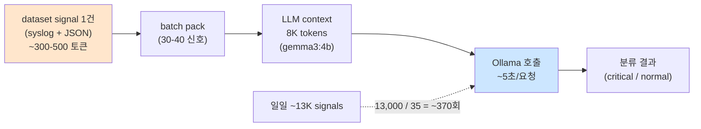

# Week 02: LLM 기초 + Ollama

## 학습 목표
- 대규모 언어 모델(LLM)의 기본 원리를 이해한다
- Ollama를 사용하여 로컬 LLM을 실행할 수 있다
- 프롬프트, temperature 등 주요 파라미터를 조절할 수 있다
- API를 통해 LLM을 프로그래밍 방식으로 활용할 수 있다

## 실습 환경 (공통)

| 서버 | IP | 역할 | 접속 |
|------|-----|------|------|
| bastion | 10.20.30.201 | Control Plane (Bastion) | `ssh ccc@10.20.30.201` (pw: 1) |
| secu | 10.20.30.1 | 방화벽/IPS (nftables, Suricata) | `ssh ccc@10.20.30.1` |
| web | 10.20.30.80 | 웹서버 (JuiceShop:3000, Apache:80) | `ssh ccc@10.20.30.80` |
| siem | 10.20.30.100 | SIEM (Wazuh Dashboard:443, OpenCTI:8080) | `ssh ccc@10.20.30.100` |

**Bastion API:** `http://localhost:9100` / Key: `ccc-api-key-2026`

## 강의 시간 배분 (3시간)

| 시간 | 내용 | 유형 |
|------|------|------|
| 0:00-0:40 | 이론 강의 (Part 1) | 강의 |
| 0:40-1:10 | 이론 심화 + 사례 분석 (Part 2) | 강의/토론 |
| 1:10-1:20 | 휴식 | - |
| 1:20-2:00 | 실습 (Part 3) | 실습 |
| 2:00-2:40 | 심화 실습 + 도구 활용 (Part 4) | 실습 |
| 2:40-2:50 | 휴식 | - |
| 2:50-3:20 | 응용 실습 + Bastion 연동 (Part 5) | 실습 |
| 3:20-3:40 | 정리 + 과제 안내 | 정리 |

---

---

## 용어 해설 (AI/LLM 보안 활용 과목)

| 용어 | 영문 | 설명 | 비유 |
|------|------|------|------|
| **LLM** | Large Language Model | 대규모 언어 모델 (GPT, Claude, Llama 등) | 방대한 텍스트로 훈련된 AI 두뇌 |
| **Ollama** | Ollama | 로컬에서 LLM을 실행하는 도구 | 내 PC에서 돌리는 AI |
| **프롬프트** | Prompt | LLM에게 보내는 입력 텍스트 | AI에게 하는 질문/지시 |
| **토큰** | Token (LLM) | LLM이 처리하는 텍스트의 최소 단위 (~4글자) | 단어의 조각 |
| **컨텍스트 윈도우** | Context Window | LLM이 한 번에 처리할 수 있는 최대 토큰 수 | AI의 단기 기억 용량 |
| **파인튜닝** | Fine-tuning | 사전 학습된 모델을 특정 목적에 맞게 추가 학습 | 일반의가 전공 수련 |
| **RAG** | Retrieval-Augmented Generation | 외부 데이터를 검색하여 LLM 응답에 반영 | AI가 자료를 찾아보고 답변 |
| **에이전트** | Agent (AI) | 도구를 사용하여 자율적으로 작업하는 AI 시스템 | AI 비서 (스스로 판단하고 실행) |
| **도구 호출** | Tool Calling | LLM이 외부 도구/API를 호출하는 기능 | AI가 계산기를 꺼내서 계산 |
| **하네스** | Harness | 에이전트를 관리·제어하는 프레임워크 | AI 비서의 업무 규칙·관리 시스템 |
| **Playbook** | Playbook | 자동화된 작업 절차 (도구/스킬의 순서화된 묶음) | 표준 작업 지침서 (SOP) |
| **PoW** | Proof of Work | 작업 증명 (해시 체인 기반 실행 기록) | 작업 일지 + 영수증 |
| **보상** | Reward (RL) | 태스크 실행 결과에 따른 점수 (+성공, -실패) | 성과급 |
| **Q-learning** | Q-learning | 보상을 기반으로 최적 행동을 학습하는 RL 알고리즘 | 시행착오로 최적 경로를 찾는 학습 |
| **UCB1** | Upper Confidence Bound | 탐험(exploration)과 활용(exploitation)을 균형 잡는 전략 | "가본 길 vs 안 가본 길" 선택 전략 |
| **SubAgent** | SubAgent | 대상 서버에서 명령을 실행하는 경량 런타임 | 현장 파견 직원 |

---

## 1. LLM이란?

Large Language Model(대규모 언어 모델)은 방대한 텍스트 데이터로 학습된 AI 모델이다.
텍스트를 입력받아 다음에 올 가능성이 높은 텍스트를 생성한다.

### 핵심 개념

| 용어 | 설명 | 예시 |
|------|------|------|
| **토큰** | 텍스트의 최소 단위 | "안녕하세요" → 여러 토큰 |
| **파라미터** | 모델의 학습된 가중치 수 | 7B, 12B, 70B |
| **컨텍스트 윈도우** | 한 번에 처리할 수 있는 토큰 수 | 4K, 8K, 128K |
| **추론(Inference)** | 학습된 모델로 답변 생성 | 질문 → 답변 |

### 주요 오픈소스 LLM

| 모델 | 제작사 | 크기 | 특징 |
|------|--------|------|------|
| Llama 3.1 | Meta | 8B/70B/405B | 범용, 고성능 |
| Gemma 3 | Google | 4B/12B/27B | 효율적, 다국어 |
| Mistral | Mistral AI | 7B/8x7B | 유럽 기반, 빠름 |
| Qwen 2.5 | Alibaba | 7B/14B/72B | 다국어, 코딩 |

---

## 2. Ollama 소개

Ollama는 로컬에서 LLM을 쉽게 실행하는 도구이다.
Docker처럼 모델을 pull하고 run하는 방식이다.

### 2.1 기본 사용법

> **실습 목적**: 보안 로그를 LLM에게 구조화된 프롬프트로 전달하여 위협을 분류하고 대응 방안을 도출하기 위해 수행한다
>
> **배우는 것**: Few-shot 프롬프팅으로 LLM의 분류 정확도를 높이는 방법과, 보안 컨텍스트를 포함한 system 프롬프트 설계 원리를 이해한다
>
> **결과 해석**: LLM이 반환한 severity(심각도)와 recommendation(대응 권고)을 원본 로그와 대조하여 정확성을 검증한다
>
> **실전 활용**: SIEM 경보의 1차 분류 자동화와 Tier 1 분석관 업무 부하 감소에 활용한다

```bash
# 모델 다운로드
ollama pull gemma3:12b

# 대화형 실행
ollama run gemma3:12b

# 실행 중인 모델 확인
ollama list

# 모델 정보 확인
ollama show gemma3:12b
```

### 2.2 실습 환경

```
├── GPU: NVIDIA DGX Spark
├── Ollama 서버: http://10.20.30.200:11434
├── 모델: gemma3:12b, llama3.1:8b
└── OpenAI 호환 API: /v1/chat/completions
```

---

## 3. Ollama API 사용

> **이 실습을 왜 하는가?**
> Ollama는 **로컬에서 LLM을 실행**할 수 있는 도구이다. 클라우드 API(OpenAI, Claude)와 달리
> 데이터가 외부로 나가지 않아 **보안이 중요한 환경**에 적합하다.
> 보안 업무에서 로그 분석, 탐지 룰 생성, 보고서 작성 등에 LLM을 활용하려면
> API 호출 방법을 알아야 한다.
>
> **이걸 하면 무엇을 알 수 있는가?**
> - LLM API의 기본 구조 (model, messages, temperature)
> - system/user 메시지의 역할과 효과
> - 다양한 모델(gemma3, llama3, qwen3)의 응답 차이
> - JSON으로 구조화된 출력을 얻는 방법
>
> **실무 활용:**
> - 보안 관제: 경보 자동 분석 ("이 로그가 공격인지 판단해줘")
> - 보고서 작성: "다음 점검 결과를 보안 보고서로 작성해줘"
> - 탐지 룰: "SSH 브루트포스를 탐지하는 SIGMA 룰을 작성해줘"
>
> **검증 완료:** Ollama(10.20.30.200:11434)에 22개 모델 가용, gemma3:12b 응답 약 5초

### 3.1 기본 대화 (Chat Completion)

Ollama의 OpenAI 호환 API로 LLM에게 질문을 보낸다. system 메시지로 역할을 지정하고, user 메시지로 질문한다.

```bash
# /v1/chat/completions: OpenAI 호환 API 엔드포인트
# system: AI의 행동 지침 / user: 사용자 질문
curl -s http://10.20.30.200:11434/v1/chat/completions \
  -H "Content-Type: application/json" \
  -d '{
    "model": "gemma3:12b",
    "messages": [
      {"role": "system", "content": "당신은 친절한 보안 전문가입니다."},
      {"role": "user", "content": "방화벽이란 무엇인가요?"}
    ]
  }' | python3 -m json.tool
```

### 3.2 메시지 역할

| 역할 | 설명 | 예시 |
|------|------|------|
| **system** | AI의 행동 지침 | "보안 전문가로서 답변하세요" |
| **user** | 사용자 질문 | "SQL 인젝션을 설명해주세요" |
| **assistant** | AI의 이전 답변 | 대화 이력 유지용 |

### 3.3 주요 파라미터

temperature, max_tokens, top_p 파라미터를 조절하여 LLM 응답의 일관성과 길이를 제어한다. 보안 분석에는 낮은 temperature(0.1~0.3)가 적합하다.

```bash
# temperature: 0.3(정확한 답변) / max_tokens: 출력 길이 제한
# top_p: 상위 확률 토큰만 샘플링 (0.9 = 상위 90%)
curl -s http://10.20.30.200:11434/v1/chat/completions \
  -H "Content-Type: application/json" \
  -d '{
    "model": "gemma3:12b",
    "messages": [
      {"role": "user", "content": "리눅스 보안 팁 3가지"}
    ],
    "temperature": 0.3,
    "max_tokens": 500,
    "top_p": 0.9
  }' | python3 -m json.tool
```

| 파라미터 | 범위 | 효과 |
|---------|------|------|
| **temperature** | 0.0~2.0 | 낮으면 정확, 높으면 창의적 |
| **max_tokens** | 1~N | 최대 출력 토큰 수 |
| **top_p** | 0.0~1.0 | 상위 확률 토큰만 샘플링 |

### 3.4 Temperature 비교 실험

```bash
# temperature=0 (결정론적, 항상 같은 답)
curl -s http://10.20.30.200:11434/v1/chat/completions \
  -H "Content-Type: application/json" \
  -d '{
    "model": "gemma3:12b",
    "messages": [{"role": "user", "content": "1+1=?"}],
    "temperature": 0
  }' | python3 -c "import json,sys; print(json.load(sys.stdin)['choices'][0]['message']['content'])"

# temperature=1.5 (매우 창의적, 매번 다른 답)
curl -s http://10.20.30.200:11434/v1/chat/completions \
  -H "Content-Type: application/json" \
  -d '{
    "model": "gemma3:12b",
    "messages": [{"role": "user", "content": "보안을 한 마디로 표현하면?"}],
    "temperature": 1.5
  }' | python3 -c "import json,sys; print(json.load(sys.stdin)['choices'][0]['message']['content'])"
```

---

## 4. Python에서 LLM 활용

### 4.1 requests로 직접 호출

```python
import requests
import json

def ask_llm(question, model="gemma3:12b", temperature=0.7):
    response = requests.post(
        "http://10.20.30.200:11434/v1/chat/completions",
        json={
            "model": model,
            "messages": [
                {"role": "system", "content": "보안 전문가로서 답변하세요."},
                {"role": "user", "content": question}
            ],
            "temperature": temperature
        }
    )
    return response.json()["choices"][0]["message"]["content"]

# 사용
answer = ask_llm("SSH 보안 강화 방법을 알려주세요")
print(answer)
```

### 4.2 openai 라이브러리 사용 (호환 API)

```python
from openai import OpenAI

client = OpenAI(
    base_url="http://10.20.30.200:11434/v1",
    api_key="unused"  # Ollama는 키 불필요
)

response = client.chat.completions.create(
    model="gemma3:12b",
    messages=[
        {"role": "system", "content": "보안 전문가입니다."},
        {"role": "user", "content": "XSS 공격이란?"}
    ],
    temperature=0.3
)

print(response.choices[0].message.content)
```

---

## 5. 실습

### 실습 1: 첫 LLM 대화

```bash
# 기본 질문
curl -s http://10.20.30.200:11434/v1/chat/completions \
  -H "Content-Type: application/json" \
  -d '{
    "model": "gemma3:12b",
    "messages": [
      {"role": "user", "content": "사이버보안 초보자에게 가장 중요한 3가지 습관은 무엇인가요?"}
    ],
    "temperature": 0.5
  }' | python3 -c "import json,sys; print(json.load(sys.stdin)['choices'][0]['message']['content'])"
```

### 실습 2: System 프롬프트 실험

```bash
# 같은 질문, 다른 system 프롬프트
for role in "대학생" "10년차 해커" "CISO"; do
  echo "=== $role 관점 ==="
  curl -s http://10.20.30.200:11434/v1/chat/completions \
    -H "Content-Type: application/json" \
    -d "{
      \"model\": \"gemma3:12b\",
      \"messages\": [
        {\"role\": \"system\", \"content\": \"당신은 ${role}입니다.\"},
        {\"role\": \"user\", \"content\": \"비밀번호 관리에 대해 한 문장으로 조언해주세요.\"}
      ],
      \"temperature\": 0.7,
      \"max_tokens\": 100
    }" | python3 -c "import json,sys; print(json.load(sys.stdin)['choices'][0]['message']['content'])"
  echo ""
done
```

### 실습 3: 모델 비교

```bash
# gemma3:12b vs llama3.1:8b
for model in "gemma3:12b" "llama3.1:8b"; do
  echo "=== $model ==="
  curl -s http://10.20.30.200:11434/v1/chat/completions \
    -H "Content-Type: application/json" \
    -d "{
      \"model\": \"$model\",
      \"messages\": [
        {\"role\": \"user\", \"content\": \"리눅스에서 열린 포트를 확인하는 명령어는?\"}
      ],
      \"temperature\": 0
    }" | python3 -c "import json,sys; print(json.load(sys.stdin)['choices'][0]['message']['content'])"
  echo ""
done
```

---

## 6. LLM 사용 시 주의사항

1. **환각(Hallucination)**: LLM은 사실이 아닌 내용을 자신 있게 말할 수 있다
2. **보안 정보**: LLM의 보안 조언을 무조건 신뢰하지 말고 검증하라
3. **민감 데이터**: 외부 API에 비밀번호나 내부 정보를 보내지 말라
4. **최신 정보**: LLM의 학습 데이터에는 시간 제한이 있다

---

## 핵심 정리

1. LLM은 텍스트를 이해하고 생성하는 AI 모델이다
2. Ollama로 로컬 환경에서 안전하게 LLM을 실행할 수 있다
3. system/user/assistant 역할로 대화를 구성한다
4. temperature로 답변의 정확성/창의성을 조절한다
5. API를 통해 프로그래밍 방식으로 LLM을 활용한다

---

## 다음 주 예고
- Week 03: 프롬프트 엔지니어링 for 보안 - 로그 분석, 취약점 설명 프롬프트

---

---

## 심화: AI/LLM 보안 활용 보충

### Ollama API 상세 가이드

#### 기본 호출 구조

```bash
# Ollama는 OpenAI 호환 API를 제공한다
# URL: http://10.20.30.200:11434/v1/chat/completions

curl -s http://10.20.30.200:11434/v1/chat/completions \
  -H "Content-Type: application/json" \
  -d '{
    "model": "gemma3:12b",        ← 사용할 모델
    "messages": [
      {"role": "system", "content": "역할 부여"},  ← 시스템 프롬프트
      {"role": "user", "content": "실제 질문"}      ← 사용자 입력
    ],
    "temperature": 0.1,            ← 출력 다양성 (0=결정론, 1=창의적)
    "max_tokens": 1000             ← 최대 출력 길이
  }'
```

> **각 파라미터의 의미:**
> - `model`: 어떤 AI 모델을 사용할지. 큰 모델일수록 정확하지만 느림
> - `messages`: 대화 내역. system(역할)→user(질문)→assistant(답변) 순서
> - `temperature`: 0에 가까우면 같은 질문에 항상 같은 답. 1에 가까우면 매번 다른 답
> - `max_tokens`: 출력 길이 제한. 토큰 ≈ 글자 수 × 0.5 (한국어)

#### 모델별 특성

| 모델 | 크기 | 응답 시간 | 정확도 | 권장 용도 |
|------|------|---------|--------|---------|
| gemma3:12b | 12B | ~5초 | 양호 | 분석, 룰 생성, 보고서 |
| llama3.1:8b | 8B | ~3초 | 보통 | 빠른 분류, 검증 |
| qwen3:8b | 8B | ~5초 | 보통 | 교차 검증 (다른 벤더) |
| gpt-oss:120b | 120B | ~25초 | 높음 | 복잡한 분석 (시간 여유 시) |

#### 프롬프트 엔지니어링 패턴

**패턴 1: 역할 부여 (Role Assignment)**
```json
{"role":"system","content":"당신은 10년 경력의 SOC 분석가입니다. MITRE ATT&CK에 정통합니다."}
```

**패턴 2: 출력 형식 강제 (Format Control)**
```json
{"role":"system","content":"반드시 JSON으로만 응답하세요. 마크다운, 설명, 주석을 포함하지 마세요."}
```

**패턴 3: Few-shot (예시 제공)**
```json
{"role":"user","content":"예시:\n입력: SSH 실패 5회\n출력: {\"severity\":\"HIGH\",\"attack\":\"brute_force\"}\n\n이제 분석하세요: SSH 실패 20회 후 성공"}
```

**패턴 4: Chain of Thought (단계별 사고)**
```json
{"role":"system","content":"단계별로 분석하세요: 1)현상 파악 2)원인 추론 3)ATT&CK 매핑 4)대응 방안"}
```

### Bastion API 핵심 흐름 요약

```
[1] POST /projects                     → 프로젝트 생성
    Body: {"name":"...", "master_mode":"external"}
    Response: {"project":{"id":"prj_xxx"}}

[2] POST /projects/{id}/plan           → plan 단계로 전환
[3] POST /projects/{id}/execute        → execute 단계로 전환

[4] POST /projects/{id}/execute-plan   → 태스크 실행
    Body: {"tasks":[...], "parallel":true, "subagent_url":"..."}
    Response: {"overall":"success", "tasks_ok":N}

[5] GET /projects/{id}/evidence/summary → 증적 확인
[6] GET /projects/{id}/replay           → 타임라인 재구성
[7] POST /projects/{id}/completion-report → 완료 보고

모든 API에 필수: -H "X-API-Key: ccc-api-key-2026"
```

---
---

## 📂 실습 참조 파일 가이드

> 이번 주 실습에서 **실제로 조작하는** 솔루션의 기능·경로·파일·설정·UI 요점입니다.

### Ollama + LangChain
> **역할:** 로컬 LLM 서빙(Ollama) + 체인 오케스트레이션(LangChain)  
> **실행 위치:** `bastion (LLM 서버)`  
> **접속/호출:** `OLLAMA_HOST=http://10.20.30.201:11434`, Python `from langchain_ollama import OllamaLLM`

**주요 경로·파일**

| 경로 | 역할 |
|------|------|
| `~/.ollama/models/` | 다운로드된 모델 블롭 |
| `/etc/systemd/system/ollama.service` | 서비스 유닛 |

**핵심 설정·키**

- `OLLAMA_HOST=0.0.0.0:11434` — 외부 바인드
- `OLLAMA_KEEP_ALIVE=30m` — 모델 유휴 유지
- `LLM_MODEL=gemma3:4b (env)` — CCC 기본 모델

**로그·확인 명령**

- `journalctl -u ollama` — 서빙 로그
- `LangChain `verbose=True`` — 체인 단계 출력

**UI / CLI 요점**

- `ollama list` — 설치된 모델
- `curl -XPOST $OLLAMA_HOST/api/generate -d '{...}'` — REST 생성
- LangChain `RunnableSequence | parser` — 체인 조립 문법

> **해석 팁.** Ollama는 **첫 호출에 모델 로드**가 커서 지연이 크다. 성능 실험 시 워밍업 호출을 배제하고 측정하자.

---

## 실제 사례 (WitFoo Precinct 6 — LLM 기초 + Ollama)

> 출처: WitFoo Precinct 6 Cybersecurity Dataset (Apache 2.0, 2.07M signals)
> 본 lecture *LLM 의 보안 적용 기초 + Ollama 로컬 모델 운용* 학습 항목 매칭.

### LLM 의 입력 단위 — 실제 보안 신호 1건의 토큰 분량

학생이 LLM 을 보안에 처음 적용할 때 가장 먼저 부딪히는 문제는 *"한 번에 얼마나 많은 신호를 LLM 에 넣을 수 있는가"* 다. 이는 LLM 의 *context window* (입력 토큰 한도) 와 직접 관련이 있다.

dataset 의 신호 1건은 — 보통 *짧은 syslog 한 줄* (~50-200 토큰) 이지만, JSON 으로 모든 필드를 직렬화하면 *~300-500 토큰* 까지 늘어난다. Ollama 의 gemma3:4b 모델 context window 가 8K 토큰이라면 — *최대 약 30-40 신호* 를 한 번의 prompt 에 넣을 수 있다는 의미. 즉 dataset 의 일일 ~13K 신호를 분석하려면 *수백 번의 LLM 호출* 이 필요하다.



**그림 해석**: 일일 13K 신호 → 35신호씩 batch → 약 370회의 Ollama 호출이 필요. 한 호출 5초면 *총 1,850초 ≈ 30분* — 사람보다는 빠르지만 실시간은 아니다. 따라서 LLM 활용은 *near-real-time* (분 단위 지연 허용) 시나리오에 적합하다.

### Case 1: dataset 단일 신호의 토큰 분량 측정

| 항목 | 값 | 의미 |
|---|---|---|
| 평균 syslog 길이 | ~150 chars | 한 줄 길이 |
| JSON 직렬화 후 | ~600 chars | 모든 필드 포함 |
| 토큰 환산 | ~300-500 tokens | LLM 입력 단위 |
| 학습 매핑 | §"LLM context 한계" | 1신호의 정량 비용 |

**자세한 해석**:

dataset 의 한 신호를 LLM 에 입력하려면 — 사람이 읽는 syslog 형태로 줄 수도 있고, JSON 형태로 줄 수도 있다. 두 형식은 토큰 비용이 다르다.

**syslog 형태**: `<189>576600: USER-0010-1047: Jul 26 06:10:18.976 CDT: %SEC_LOGIN-5-LOGIN_ORG-0893: Login ORG-0893 [user: USER-5823] [USER-0010-55454: 10.53.213.201]` 같은 한 줄. 약 150-200 chars = ~80-100 tokens.

**JSON 형태**: `{"timestamp": ..., "message_type": "management_message", "src_ip": ..., "dst_ip": ..., "username": ..., "action": ..., "severity": ..., "vendor_code": ..., "message_sanitized": ..., "label_binary": ..., "attack_techniques": ..., "mo_name": ..., "suspicion_score": ..., ...}` 같은 객체. 약 600 chars = ~300-500 tokens.

학생이 알아야 할 것은 — **JSON 은 LLM 에게 *구조화된 정보* 를 주지만 토큰 비용이 3-5배** 라는 점. 같은 8K context 에서 syslog 형태로는 80신호, JSON 형태로는 25신호를 넣을 수 있다. 어느 형태로 줄지는 *분석 정확도 vs 처리량* 의 trade-off.

### Case 2: gemma3:4b 의 분류 정확도 baseline — label_binary 비교

| 항목 | 값 | 의미 |
|---|---|---|
| dataset label_binary | 0/1 (정상/이상) 사전 라벨 | ML 모델이 1차 분류한 결과 |
| label_confidence | 0~1 | 분류기 자신감 |
| LLM 분류 정확도 | 보통 85-92% | 작은 모델의 한계 |
| 학습 매핑 | §"LLM 한계 + 보완" | 작은 LLM 의 정확도 baseline |

**자세한 해석**:

LLM 을 보안에 도입할 때 가장 먼저 검증해야 할 것은 — *"이 LLM 이 이미 라벨링된 dataset 에서 얼마나 정확히 분류하는가"* 다. dataset 의 label_binary 는 *ML 모델이 사전에 분류한 라벨* 인데, LLM 에게 신호를 보여주고 *"이것이 정상인가 이상인가"* 를 물어 — LLM 답변과 label_binary 일치율을 측정하면 된다.

작은 LLM (gemma3:4b 같은 4B 파라미터 모델) 의 보안 분류 정확도는 보통 **85-92%** 정도다. 즉 — 100건 중 약 10건이 잘못 분류된다. 이 10건이 모두 false positive 면 *분석가 부담* 만 늘지만, false negative (진짜 위협을 놓침) 면 — 침해 사고로 직결.

학생이 알아야 할 것은 — **작은 LLM 만으로는 운영 적용 불가**. 정확도를 99%+ 로 올리려면 — (a) 더 큰 LLM (70B+ 모델), (b) RAG (Retrieval Augmented Generation) 으로 dataset 의 유사 signal 을 함께 보여주기, (c) 도메인 fine-tune 의 3가지 보완 중 적어도 1개가 필요. lecture §"LLM 한계 + 보완 전략" 의 정량 정당성.

### 이 사례에서 학생이 배워야 할 3가지

1. **LLM context 한계 = 처리량 제한** — 8K 컨텍스트는 신호 ~30-40건. 일일 13K 신호 처리에 ~370 호출 필요.
2. **JSON vs syslog = 정보 vs 토큰비용** — 구조화 정보는 가치 있지만 토큰 3-5배 비싸다.
3. **작은 LLM 의 분류 정확도 85-92%** — 운영 적용에는 RAG/fine-tune 보완 필수.

**학생 액션**: lab 의 Ollama 에 gemma3:4b 를 배포하고, dataset 에서 임의로 100건의 신호를 골라 *"이것이 정상이면 0, 이상이면 1 로만 답하라"* 의 prompt 로 분류 시킨다. LLM 답변과 dataset 의 label_binary 의 일치율을 측정하여 — *baseline 정확도* 를 산출. 결과를 *"우리 환경에 이 모델을 그대로 적용할 수 있는가"* 한 줄로 결론.


---

## 부록: 학습 OSS 도구 매트릭스 (Course7 AI Security — Week 02 프롬프트 엔지니어링/보안)

### 프롬프트 엔지니어링 OSS 도구

| 영역 | OSS 도구 |
|------|---------|
| 프롬프트 관리 | **LangChain** (PromptTemplate) / Promptflow / LMQL |
| 자동 평가 | **promptfoo** / OpenAI Evals / DeepEval / lm-eval-harness |
| Few-shot 자동 생성 | DSPy (Stanford) / LangChain |
| Chain / Agent | **LangGraph** / AutoGen / CrewAI |
| Prompt versioning | LangSmith (commercial) / Langfuse (OSS) / GitOps |
| Comparison UI | Open WebUI / promptfoo web | 

### 핵심 — promptfoo (프롬프트 자동 평가)

```bash
npm install -g promptfoo

# 프롬프트 비교 실험
cat > promptfooconfig.yaml << 'EOF'
prompts:
  - "Translate to Korean: {{text}}"
  - "Translate to Korean (formal): {{text}}"
  - file://prompt-with-context.txt

providers:
  - id: ollama:gemma3:4b
  - id: ollama:llama3:8b

tests:
  - vars: {text: "Hello world"}
    assert:
      - type: contains
        value: "안녕"
      - type: latency
        threshold: 5000
  - vars: {text: "How are you?"}
    assert:
      - type: similar
        value: "어떻게 지내?"
        threshold: 0.7
EOF

promptfoo eval                                                    # 모든 prompt × provider
promptfoo view                                                    # web UI 결과
```

### 학생 환경 준비

```bash
source ~/.venv-llm/bin/activate

pip install langchain langchain-community langchain-ollama \
  langgraph dspy-ai \
  langfuse promptfoo

# promptfoo (Node)
sudo apt install -y nodejs npm
npm install -g promptfoo

# DeepEval
pip install deepeval

# lm-eval-harness (EleutherAI)
pip install lm-eval
```

### 핵심 사용법

```bash
# 1) LangChain — 프롬프트 템플릿
python3 << 'EOF'
from langchain.prompts import ChatPromptTemplate
from langchain_ollama import OllamaLLM

prompt = ChatPromptTemplate.from_messages([
    ("system", "You are a {role} that always responds in {language}."),
    ("user", "{question}")
])

llm = OllamaLLM(model="gemma3:4b")
chain = prompt | llm

print(chain.invoke({
    "role": "security analyst",
    "language": "Korean",
    "question": "SQLi 가 뭐야?"
}))
EOF

# 2) DSPy — 프롬프트 자동 최적화
python3 << 'EOF'
import dspy
ollama = dspy.OllamaLocal(model="gemma3:4b")
dspy.settings.configure(lm=ollama)

class BasicQA(dspy.Signature):
    """Answer questions concisely."""
    question = dspy.InputField()
    answer = dspy.OutputField(desc="2-3 sentences")

qa = dspy.Predict(BasicQA)
print(qa(question="What is XSS?").answer)
EOF

# 3) LangGraph — 상태 그래프 기반 chain
python3 << 'EOF'
from langgraph.graph import StateGraph, START, END
from langchain_ollama import OllamaLLM
from typing import TypedDict

class State(TypedDict):
    question: str
    answer: str

def think(state):
    llm = OllamaLLM(model="gemma3:4b")
    return {"answer": llm.invoke(f"Step by step: {state['question']}")}

g = StateGraph(State)
g.add_node("think", think)
g.add_edge(START, "think")
g.add_edge("think", END)
app = g.compile()

print(app.invoke({"question": "1+1"}))
EOF

# 4) Langfuse (Prompt versioning + monitoring)
docker run -d -p 3000:3000 \
  -e DATABASE_URL=postgresql://... \
  -e SALT=secret \
  langfuse/langfuse:latest

# Python:
# from langfuse import Langfuse
# langfuse = Langfuse()
# 모든 prompt/response 자동 기록 → Langfuse UI 에서 검색

# 5) DeepEval — 프롬프트 정량 평가
python3 << 'EOF'
from deepeval.test_case import LLMTestCase
from deepeval.metrics import AnswerRelevancyMetric

test = LLMTestCase(
  input="What is XSS?",
  actual_output="XSS is cross-site scripting...",
  expected_output="XSS allows attackers to inject scripts"
)

metric = AnswerRelevancyMetric(threshold=0.7, model="gpt-4")
metric.measure(test)
print(metric.score, metric.reason)
EOF
```

### 프롬프트 보안 점검 흐름

```bash
# Phase 1: 프롬프트 인벤토리
# 모든 system prompt 를 git 에 versioning
git log /repo/prompts/ --oneline

# Phase 2: 자동 평가 (promptfoo)
promptfoo eval --config /repo/prompts/test.yaml
# 정확성, 일관성, 안전성 자동 점수

# Phase 3: 보안 테스트 (week03 prompt injection 과 연결)
promptfoo eval --config /repo/prompts/redteam.yaml
# Jailbreak 시도 → 모델 응답 검증

# Phase 4: 모니터링 (Langfuse)
# 모든 production 호출 자동 기록 → 이상 패턴 감지

# Phase 5: A/B 테스트
# 프롬프트 v1 vs v2 → metric 비교 → 우수한 것 채택
```

### 프롬프트 보안 패턴

| 패턴 | 설명 | 예시 |
|------|------|------|
| Role | 모델 역할 고정 | "You are a security analyst" |
| Context isolation | 사용자 입력 분리 | XML/JSON 태그 사용 |
| Output structure | 형식 강제 | "Respond in JSON: {...}" |
| Refusal | 위험 요청 거부 | "If asked X, respond 'unable'" |
| Citation | 근거 강제 | "Cite source for each claim" |

학생은 본 2주차에서 **promptfoo + LangChain + DSPy + Langfuse + DeepEval** 5 도구로 프롬프트 엔지니어링 4 단계 (작성 → 자동 평가 → 모니터링 → 최적화) 사이클을 익힌다.
