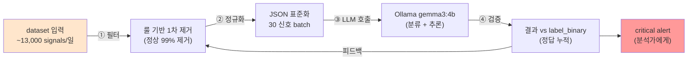

# Week 04: LLM 기반 로그 분석

## 학습 목표
- Wazuh SIEM 알림의 구조를 이해한다
- LLM을 활용하여 보안 로그를 자동 분석할 수 있다
- 분석 결과를 구조화된 인시던트 보고서로 변환할 수 있다
- 대량 알림에서 중요 이벤트를 우선순위로 분류할 수 있다

## 실습 환경 (공통)

| 서버 | IP | 역할 | 접속 |
|------|-----|------|------|
| bastion | 10.20.30.201 | Control Plane (Bastion) | `ssh ccc@10.20.30.201` (pw: 1) |
| secu | 10.20.30.1 | 방화벽/IPS (nftables, Suricata) | `ssh ccc@10.20.30.1` |
| web | 10.20.30.80 | 웹서버 (JuiceShop:3000, Apache:80) | `ssh ccc@10.20.30.80` |
| siem | 10.20.30.100 | SIEM (Wazuh Dashboard:443, OpenCTI:8080) | `ssh ccc@10.20.30.100` |

**Bastion API:** `http://localhost:9100` / Key: `ccc-api-key-2026`

## 강의 시간 배분 (3시간)

| 시간 | 내용 | 유형 |
|------|------|------|
| 0:00-0:40 | 이론 강의 (Part 1) | 강의 |
| 0:40-1:10 | 이론 심화 + 사례 분석 (Part 2) | 강의/토론 |
| 1:10-1:20 | 휴식 | - |
| 1:20-2:00 | 실습 (Part 3) | 실습 |
| 2:00-2:40 | 심화 실습 + 도구 활용 (Part 4) | 실습 |
| 2:40-2:50 | 휴식 | - |
| 2:50-3:20 | 응용 실습 + Bastion 연동 (Part 5) | 실습 |
| 3:20-3:40 | 정리 + 과제 안내 | 정리 |

---

---

## 용어 해설 (AI/LLM 보안 활용 과목)

| 용어 | 영문 | 설명 | 비유 |
|------|------|------|------|
| **LLM** | Large Language Model | 대규모 언어 모델 (GPT, Claude, Llama 등) | 방대한 텍스트로 훈련된 AI 두뇌 |
| **Ollama** | Ollama | 로컬에서 LLM을 실행하는 도구 | 내 PC에서 돌리는 AI |
| **프롬프트** | Prompt | LLM에게 보내는 입력 텍스트 | AI에게 하는 질문/지시 |
| **토큰** | Token (LLM) | LLM이 처리하는 텍스트의 최소 단위 (~4글자) | 단어의 조각 |
| **컨텍스트 윈도우** | Context Window | LLM이 한 번에 처리할 수 있는 최대 토큰 수 | AI의 단기 기억 용량 |
| **파인튜닝** | Fine-tuning | 사전 학습된 모델을 특정 목적에 맞게 추가 학습 | 일반의가 전공 수련 |
| **RAG** | Retrieval-Augmented Generation | 외부 데이터를 검색하여 LLM 응답에 반영 | AI가 자료를 찾아보고 답변 |
| **에이전트** | Agent (AI) | 도구를 사용하여 자율적으로 작업하는 AI 시스템 | AI 비서 (스스로 판단하고 실행) |
| **도구 호출** | Tool Calling | LLM이 외부 도구/API를 호출하는 기능 | AI가 계산기를 꺼내서 계산 |
| **하네스** | Harness | 에이전트를 관리·제어하는 프레임워크 | AI 비서의 업무 규칙·관리 시스템 |
| **Playbook** | Playbook | 자동화된 작업 절차 (도구/스킬의 순서화된 묶음) | 표준 작업 지침서 (SOP) |
| **PoW** | Proof of Work | 작업 증명 (해시 체인 기반 실행 기록) | 작업 일지 + 영수증 |
| **보상** | Reward (RL) | 태스크 실행 결과에 따른 점수 (+성공, -실패) | 성과급 |
| **Q-learning** | Q-learning | 보상을 기반으로 최적 행동을 학습하는 RL 알고리즘 | 시행착오로 최적 경로를 찾는 학습 |
| **UCB1** | Upper Confidence Bound | 탐험(exploration)과 활용(exploitation)을 균형 잡는 전략 | "가본 길 vs 안 가본 길" 선택 전략 |
| **SubAgent** | SubAgent | 대상 서버에서 명령을 실행하는 경량 런타임 | 현장 파견 직원 |

---

## 1. 보안 로그 분석의 과제

SOC(Security Operations Center)에서 분석가는 하루 수천~수만 건의 알림을 처리한다.
대부분은 오탐(False Positive)이지만, 소수의 진짜 위협을 놓치면 사고로 이어진다.

### LLM이 도울 수 있는 영역

| 작업 | 수동 분석 | LLM 보조 |
|------|----------|---------|
| 알림 분류 | 1건당 5분 | 1건당 10초 |
| 패턴 인식 | 분석가 경험 의존 | 다양한 패턴 인식 |
| 보고서 작성 | 30분~1시간 | 2~3분 |
| 맥락 파악 | 여러 도구 참조 | 프롬프트로 맥락 제공 |

---

## 2. Wazuh 알림 구조

> **이 실습을 왜 하는가?**
> "LLM 기반 로그 분석" — 이 주차의 핵심 기술을 실제 서버 환경에서 직접 실행하여 체험한다.
> AI/LLM 보안 활용 분야에서 이 기술은 실무의 핵심이며, 실습을 통해
> 명령어의 의미, 결과 해석 방법, 보안 관점에서의 판단 기준을 익힌다.
>
> **이걸 하면 무엇을 알 수 있는가?**
> - 이 기술이 실제 시스템에서 어떻게 동작하는지 직접 확인
> - 정상과 비정상 결과를 구분하는 눈을 기름
> - 실무에서 바로 활용할 수 있는 명령어와 절차를 체득
>
> **주의:** 모든 실습은 허가된 실습 환경(10.20.30.0/24)에서만 수행한다.

### 2.1 알림 JSON 구조

```json
{
  "timestamp": "2026-03-27T10:30:00.000+0900",
  "rule": {
    "id": "5710",
    "level": 10,
    "description": "sshd: Attempt to login using a denied user.",
    "groups": ["syslog", "sshd", "authentication_failed"]
  },
  "agent": {
    "id": "002",
    "name": "web",
    "ip": "10.20.30.80"
  },
  "data": {
    "srcip": "203.0.113.50",
    "srcport": "54321",
    "dstuser": "root"
  },
  "full_log": "Mar 27 10:30:00 web sshd[1234]: Failed password for root from 203.0.113.50 port 54321 ssh2"
}
```

### 2.2 Wazuh Rule Level

| Level | 의미 | 예시 |
|-------|------|------|
| 0-3 | 정보 | 성공 로그인 |
| 4-7 | 경고 | 실패한 인증 |
| 8-11 | 높은 경고 | 반복 실패, 정책 위반 |
| 12-15 | 심각 | 공격 탐지, 무결성 위반 |

---

## 3. LLM으로 알림 분석

### 3.1 단일 알림 분석

> **실습 목적**: RAG(검색 증강 생성)로 LLM에게 보안 지식(CVE 데이터, 과거 인시던트)을 제공하여 정확도를 높이기 위해 수행한다
>
> **배우는 것**: 벡터 검색으로 관련 문서를 찾아 프롬프트에 포함시키면 LLM의 환각(hallucination)이 줄어드는 원리를 이해한다
>
> **결과 해석**: RAG 적용 전후 응답을 비교하여, 구체적 CVE 번호나 대응 절차가 포함되었는지로 품질 향상을 판단한다
>
> **실전 활용**: 조직 내부 보안 정책/SOP를 RAG로 연결하여 AI가 조직 맞춤형 보안 답변을 제공하도록 구축하는 데 활용한다

Wazuh 알림 JSON을 변수에 저장한 뒤 LLM에 전달하여 위협수준, MITRE ATT&CK 매핑, 대응 조치를 자동 분석시킨다.

```bash
# Wazuh 알림 JSON을 변수에 저장 (쉘 변수 → curl에서 치환)
ALERT='{
  "rule": {"id": "5710", "level": 10, "description": "sshd: Attempt to login using a denied user."},
  "agent": {"name": "web", "ip": "10.20.30.80"},
  "data": {"srcip": "203.0.113.50", "dstuser": "root"},
  "full_log": "Mar 27 10:30:00 web sshd[1234]: Failed password for root from 203.0.113.50 port 54321 ssh2"
}'

# LLM에 알림 전달 → 위협수준/MITRE ATT&CK/대응 형식으로 분석
curl -s http://10.20.30.200:11434/v1/chat/completions \
  -H "Content-Type: application/json" \
  -d "{
    \"model\": \"gemma3:12b\",
    \"messages\": [
      {\"role\": \"system\", \"content\": \"SOC Tier-2 분석가입니다. Wazuh 알림을 분석하고 다음 형식으로 응답하세요:\\n- 요약: (한 줄)\\n- 위협수준: CRITICAL/HIGH/MEDIUM/LOW\\n- MITRE ATT&CK: (해당 기법)\\n- 대응: (즉시 수행할 조치)\"},
      {\"role\": \"user\", \"content\": \"다음 Wazuh 알림을 분석하세요:\\n$ALERT\"}
    ],
    \"temperature\": 0.2
  }" | python3 -c "import json,sys; print(json.load(sys.stdin)['choices'][0]['message']['content'])"
```

### 3.2 복수 알림 상관 분석

시간순으로 나열된 여러 알림을 LLM에게 전달하여 공격 킬체인(정찰 -> 침투 -> 거점 확보)을 자동 추론시킨다.

```bash
# 5개 알림을 시간순 배열로 구성 (SSH 실패 → 성공 → 계정 생성)
ALERTS='[
  {"time": "10:30:00", "rule": "5710", "src": "203.0.113.50", "msg": "SSH 로그인 실패 (root)"},
  {"time": "10:30:05", "rule": "5710", "src": "203.0.113.50", "msg": "SSH 로그인 실패 (admin)"},
  {"time": "10:31:00", "rule": "5715", "src": "203.0.113.50", "msg": "SSH 브루트포스 탐지"},
  {"time": "10:35:00", "rule": "5501", "src": "203.0.113.50", "msg": "SSH 로그인 성공 (deploy)"},
  {"time": "10:36:00", "rule": "550",  "src": "10.20.30.80",  "msg": "사용자 추가: hacker"}
]'

curl -s http://10.20.30.200:11434/v1/chat/completions \
  -H "Content-Type: application/json" \
  -d "{
    \"model\": \"gemma3:12b\",
    \"messages\": [
      {\"role\": \"system\", \"content\": \"SOC 분석가입니다. 여러 알림을 시간순으로 상관 분석하여 공격 시나리오를 추론하세요.\"},
      {\"role\": \"user\", \"content\": \"다음 Wazuh 알림들을 상관 분석하세요. 공격 킬체인을 추론하세요:\\n$ALERTS\"}
    ],
    \"temperature\": 0.3
  }" | python3 -c "import json,sys; print(json.load(sys.stdin)['choices'][0]['message']['content'])"
```

---

## 4. 알림 우선순위 분류

### 4.1 배치 분류 프롬프트

대량의 알림을 한 번에 LLM에게 전달하여 우선순위(P1~P4)를 일괄 분류시킨다. SOC에서 알림 피로도를 줄이는 핵심 기법이다.

```bash
# 배치 알림 분류: 여러 알림을 한 번에 우선순위 분류
curl -s http://10.20.30.200:11434/v1/chat/completions \
  -H "Content-Type: application/json" \
  -d '{
    "model": "gemma3:12b",
    "messages": [
      {"role": "system", "content": "SOC 분석가입니다. 알림을 우선순위별로 분류하세요.\n분류: CRITICAL(즉시 대응), HIGH(1시간 내), MEDIUM(24시간 내), LOW(정기 검토)\n\nJSON 배열로 응답: [{\"id\": N, \"priority\": \"...\", \"reason\": \"...\"}]"},
      {"role": "user", "content": "분류할 알림 목록:\n1. SSH root 로그인 성공 (외부 IP)\n2. 파일 무결성 변경 (/etc/passwd)\n3. 디스크 사용량 90%\n4. nginx 404 에러 증가\n5. sudo 권한 실행 (웹 서버에서 wget)"}
    ],
    "temperature": 0
  }' | python3 -c "import json,sys; print(json.load(sys.stdin)['choices'][0]['message']['content'])"
```

---

## 5. 자동화 스크립트

### 5.1 Python으로 Wazuh 알림 자동 분석

```python
#!/usr/bin/env python3
"""wazuh_llm_analyzer.py - Wazuh 알림을 LLM으로 분석"""
import requests
import json

OLLAMA_URL = "http://10.20.30.200:11434/v1/chat/completions"
MODEL = "gemma3:12b"

SYSTEM_PROMPT = """SOC Tier-2 분석가입니다. Wazuh 알림을 분석하고
정확히 다음 JSON 형식으로만 응답하세요:
{"severity": "CRITICAL|HIGH|MEDIUM|LOW", "summary": "한줄요약",
 "attack_type": "공격유형", "action": "대응조치"}"""

def analyze_alert(alert_json):
    response = requests.post(OLLAMA_URL, json={
        "model": MODEL,
        "messages": [
            {"role": "system", "content": SYSTEM_PROMPT},
            {"role": "user", "content": f"알림: {json.dumps(alert_json, ensure_ascii=False)}"}
        ],
        "temperature": 0
    })
    return response.json()["choices"][0]["message"]["content"]

# 사용 예시
sample_alert = {
    "rule": {"id": "5710", "level": 10,
             "description": "sshd: Attempt to login using a denied user."},
    "agent": {"name": "web"},
    "data": {"srcip": "203.0.113.50", "dstuser": "root"}
}

result = analyze_alert(sample_alert)
print(result)
```

---

## 6. 실습

### 실습 1: 실제 Wazuh 알림 분석

```bash
# siem 서버에서 최근 알림 가져오기 (Bastion 활용)
curl -s -X POST http://localhost:9100/projects \
  -H "Content-Type: application/json" \
  -H "X-API-Key: ccc-api-key-2026" \
  -d '{
    "name": "wazuh-log-analysis",
    "request_text": "Wazuh 최근 알림 수집 및 분석",
    "master_mode": "external"
  }'

# 프로젝트 ID 확인 후 dispatch로 알림 수집
# curl -X POST http://localhost:9100/projects/{id}/dispatch ...
```

### 실습 2: 공격 시나리오별 프롬프트 설계

```bash
# 시나리오: 웹 서버에서 의심스러운 활동 탐지
SCENARIO="다음은 웹 서버(10.20.30.80)에서 30분간 수집된 로그입니다:
10:00 - 정상 웹 트래픽
10:05 - /admin 페이지 접근 시도 (403)
10:06 - SQL Injection 시도 (?id=1' OR '1'='1)
10:08 - /admin 접근 성공 (200)
10:10 - 파일 업로드 (webshell.php)
10:15 - webshell.php에서 시스템 명령 실행
10:20 - /etc/passwd 읽기 시도
10:25 - 리버스 셸 연결 시도"

curl -s http://10.20.30.200:11434/v1/chat/completions \
  -H "Content-Type: application/json" \
  -d "{
    \"model\": \"gemma3:12b\",
    \"messages\": [
      {\"role\": \"system\", \"content\": \"인시던트 대응 전문가입니다. 공격 킬체인을 분석하고 각 단계의 MITRE ATT&CK 기법을 매핑하세요.\"},
      {\"role\": \"user\", \"content\": \"$SCENARIO\"}
    ],
    \"temperature\": 0.3
  }" | python3 -c "import json,sys; print(json.load(sys.stdin)['choices'][0]['message']['content'])"
```

### 실습 3: 분석 결과를 인시던트 보고서로 변환

```bash
# 이전 분석 결과를 CISO용 보고서로 변환
curl -s http://10.20.30.200:11434/v1/chat/completions \
  -H "Content-Type: application/json" \
  -d '{
    "model": "gemma3:12b",
    "messages": [
      {"role": "system", "content": "CISO에게 보고할 인시던트 보고서를 작성합니다. 비기술적 경영진도 이해할 수 있되, 기술 세부사항도 포함하세요."},
      {"role": "user", "content": "다음 분석 결과를 인시던트 보고서로 변환하세요:\n- 공격: SQL Injection → 웹셸 업로드 → 시스템 침입\n- 대상: web 서버 (10.20.30.80)\n- 공격자 IP: 203.0.113.50\n- 시간: 2026-03-27 10:00~10:25\n- 피해: 관리자 페이지 접근, 시스템 명령 실행 시도\n\n보고서 형식: 1.개요 2.타임라인 3.영향분석 4.대응현황 5.재발방지"}
    ],
    "temperature": 0.4
  }' | python3 -c "import json,sys; print(json.load(sys.stdin)['choices'][0]['message']['content'])"
```

---

## 7. LLM 로그 분석의 한계

1. **환각**: 존재하지 않는 위협을 만들어낼 수 있다
2. **최신 위협**: 학습 데이터 이후의 새로운 공격 패턴을 모를 수 있다
3. **정밀도**: 자동 분류의 정확도를 지속적으로 검증해야 한다
4. **민감 데이터**: 실제 IP, 비밀번호 등을 외부 LLM에 전송하면 안 된다

해결 방법: 로컬 LLM(Ollama) 사용 + 사람 검증 + 지속적 피드백

---

## 핵심 정리

1. LLM은 대량의 보안 알림을 빠르게 분류하고 분석하는 도구이다
2. 시간순 상관 분석으로 공격 킬체인을 추론할 수 있다
3. 구조화된 프롬프트로 일관된 분석 결과를 얻는다
4. 자동화 스크립트로 Wazuh 알림을 실시간 분석할 수 있다
5. LLM 분석 결과는 반드시 사람이 검증해야 한다

---

## 다음 주 예고
- Week 05: 탐지 룰 자동 생성 - 공격 패턴에서 SIGMA/Wazuh 룰 자동 생성

---

---

## 심화: AI/LLM 보안 활용 보충

### Ollama API 상세 가이드

#### 기본 호출 구조

```bash
# Ollama는 OpenAI 호환 API를 제공한다
# URL: http://10.20.30.200:11434/v1/chat/completions

curl -s http://10.20.30.200:11434/v1/chat/completions \
  -H "Content-Type: application/json" \
  -d '{
    "model": "gemma3:12b",        ← 사용할 모델
    "messages": [
      {"role": "system", "content": "역할 부여"},  ← 시스템 프롬프트
      {"role": "user", "content": "실제 질문"}      ← 사용자 입력
    ],
    "temperature": 0.1,            ← 출력 다양성 (0=결정론, 1=창의적)
    "max_tokens": 1000             ← 최대 출력 길이
  }'
```

> **각 파라미터의 의미:**
> - `model`: 어떤 AI 모델을 사용할지. 큰 모델일수록 정확하지만 느림
> - `messages`: 대화 내역. system(역할)→user(질문)→assistant(답변) 순서
> - `temperature`: 0에 가까우면 같은 질문에 항상 같은 답. 1에 가까우면 매번 다른 답
> - `max_tokens`: 출력 길이 제한. 토큰 ≈ 글자 수 × 0.5 (한국어)

#### 모델별 특성

| 모델 | 크기 | 응답 시간 | 정확도 | 권장 용도 |
|------|------|---------|--------|---------|
| gemma3:12b | 12B | ~5초 | 양호 | 분석, 룰 생성, 보고서 |
| llama3.1:8b | 8B | ~3초 | 보통 | 빠른 분류, 검증 |
| qwen3:8b | 8B | ~5초 | 보통 | 교차 검증 (다른 벤더) |
| gpt-oss:120b | 120B | ~25초 | 높음 | 복잡한 분석 (시간 여유 시) |

#### 프롬프트 엔지니어링 패턴

**패턴 1: 역할 부여 (Role Assignment)**
```json
{"role":"system","content":"당신은 10년 경력의 SOC 분석가입니다. MITRE ATT&CK에 정통합니다."}
```

**패턴 2: 출력 형식 강제 (Format Control)**
```json
{"role":"system","content":"반드시 JSON으로만 응답하세요. 마크다운, 설명, 주석을 포함하지 마세요."}
```

**패턴 3: Few-shot (예시 제공)**
```json
{"role":"user","content":"예시:\n입력: SSH 실패 5회\n출력: {\"severity\":\"HIGH\",\"attack\":\"brute_force\"}\n\n이제 분석하세요: SSH 실패 20회 후 성공"}
```

**패턴 4: Chain of Thought (단계별 사고)**
```json
{"role":"system","content":"단계별로 분석하세요: 1)현상 파악 2)원인 추론 3)ATT&CK 매핑 4)대응 방안"}
```

### Bastion API 핵심 흐름 요약

```
[1] POST /projects                     → 프로젝트 생성
    Body: {"name":"...", "master_mode":"external"}
    Response: {"project":{"id":"prj_xxx"}}

[2] POST /projects/{id}/plan           → plan 단계로 전환
[3] POST /projects/{id}/execute        → execute 단계로 전환

[4] POST /projects/{id}/execute-plan   → 태스크 실행
    Body: {"tasks":[...], "parallel":true, "subagent_url":"..."}
    Response: {"overall":"success", "tasks_ok":N}

[5] GET /projects/{id}/evidence/summary → 증적 확인
[6] GET /projects/{id}/replay           → 타임라인 재구성
[7] POST /projects/{id}/completion-report → 완료 보고

모든 API에 필수: -H "X-API-Key: ccc-api-key-2026"
```

---
---

> **실습 환경 검증 완료** (2026-03-28): Ollama 22모델(gemma3:12b ~5s), Bastion 50프로젝트, execute-plan 병렬, RL train/recommend

---

## 📂 실습 참조 파일 가이드

> 이번 주 실습에서 **실제로 조작하는** 솔루션의 기능·경로·파일·설정·UI 요점입니다.

### Ollama + LangChain
> **역할:** 로컬 LLM 서빙(Ollama) + 체인 오케스트레이션(LangChain)  
> **실행 위치:** `bastion (LLM 서버)`  
> **접속/호출:** `OLLAMA_HOST=http://10.20.30.201:11434`, Python `from langchain_ollama import OllamaLLM`

**주요 경로·파일**

| 경로 | 역할 |
|------|------|
| `~/.ollama/models/` | 다운로드된 모델 블롭 |
| `/etc/systemd/system/ollama.service` | 서비스 유닛 |

**핵심 설정·키**

- `OLLAMA_HOST=0.0.0.0:11434` — 외부 바인드
- `OLLAMA_KEEP_ALIVE=30m` — 모델 유휴 유지
- `LLM_MODEL=gemma3:4b (env)` — CCC 기본 모델

**로그·확인 명령**

- `journalctl -u ollama` — 서빙 로그
- `LangChain `verbose=True`` — 체인 단계 출력

**UI / CLI 요점**

- `ollama list` — 설치된 모델
- `curl -XPOST $OLLAMA_HOST/api/generate -d '{...}'` — REST 생성
- LangChain `RunnableSequence | parser` — 체인 조립 문법

> **해석 팁.** Ollama는 **첫 호출에 모델 로드**가 커서 지연이 크다. 성능 실험 시 워밍업 호출을 배제하고 측정하자.

### Wazuh SIEM (4.11.x)
> **역할:** 에이전트 기반 로그·FIM·SCA 통합 분석 플랫폼  
> **실행 위치:** `siem (10.20.30.100)`  
> **접속/호출:** Dashboard `https://10.20.30.100` (admin/admin), Manager API `:55000`

**주요 경로·파일**

| 경로 | 역할 |
|------|------|
| `/var/ossec/etc/ossec.conf` | Manager 메인 설정 (원격, 전송, syscheck 등) |
| `/var/ossec/etc/rules/local_rules.xml` | 커스텀 룰 (id ≥ 100000) |
| `/var/ossec/etc/decoders/local_decoder.xml` | 커스텀 디코더 |
| `/var/ossec/logs/alerts/alerts.json` | 실시간 JSON 알림 스트림 |
| `/var/ossec/logs/archives/archives.json` | 전체 이벤트 아카이브 |
| `/var/ossec/logs/ossec.log` | Manager 데몬 로그 |
| `/var/ossec/queue/fim/db/fim.db` | FIM 기준선 SQLite DB |

**핵심 설정·키**

- `<rule id='100100' level='10'>` — 커스텀 룰 — level 10↑은 고위험
- `<syscheck><directories>...` — FIM 감시 경로
- `<active-response>` — 자동 대응 (firewall-drop, restart)

**로그·확인 명령**

- `jq 'select(.rule.level>=10)' alerts.json` — 고위험 알림만
- `grep ERROR ossec.log` — Manager 오류 (룰 문법 오류 등)

**UI / CLI 요점**

- Dashboard → Security events — KQL 필터 `rule.level >= 10`
- Dashboard → Integrity monitoring — 변경된 파일 해시 비교
- `/var/ossec/bin/wazuh-logtest` — 룰 매칭 단계별 확인 (Phase 1→3)
- `/var/ossec/bin/wazuh-analysisd -t` — 룰·설정 문법 검증

> **해석 팁.** Phase 3에서 원하는 `rule.id`가 떠야 커스텀 룰 정상. `local_rules.xml` 수정 후 `systemctl restart wazuh-manager`, 문법 오류가 있으면 **분석 데몬 전체가 기동 실패**하므로 `-t`로 먼저 검증.

---

## 실제 사례 (WitFoo Precinct 6 — LLM 기반 로그 분석)

> 출처: WitFoo Precinct 6 Cybersecurity Dataset (Apache 2.0, 2.07M signals)
> 본 lecture *LLM 으로 보안 로그를 분석하는 실전 파이프라인* 학습 항목 매칭.

### LLM 로그 분석 파이프라인 — 정량 운영의 4 단계

LLM 으로 보안 로그를 분석한다는 것은 단순히 *"LLM 에게 로그를 던진다"* 가 아니다. 운영 가능한 LLM 분석 파이프라인은 4 단계로 구성된다 — (1) **수집/필터링**, (2) **정규화/배칭**, (3) **LLM 분류**, (4) **검증/피드백**. 각 단계가 적절히 동작해야 LLM 의 정확도가 운영 수준에 도달한다.

dataset 의 1일 ~13K 신호를 처리한다고 가정하면 — 1단계에서 99% 의 정상 운영 신호를 룰 기반으로 제거하면 ~130건 남고, 2단계에서 30건씩 batch 로 묶으면 ~5 batch, 3단계에서 batch 당 5초 LLM 호출이면 ~25초, 4단계에서 LLM 답변을 정답 라벨과 비교 검증. 이 전체 파이프라인이 분 단위 지연으로 동작한다.



**그림 해석**: 4단계 파이프라인이 *순환적으로 개선* 된다 — 4단계의 검증 결과가 다시 1단계의 필터 룰을 강화한다. 즉 시간이 갈수록 1단계의 정확도가 올라가고, LLM 호출 횟수가 줄어든다. lecture §"LLM 분석 파이프라인의 자기 학습" 의 핵심.

### Case 1: dataset 1일 13K → 분석가 critical 5 건의 압축 비율 정량

| 단계 | 처리 후 신호 수 | 압축율 | 의미 |
|---|---|---|---|
| 입력 (raw) | 13,000건/일 | - | dataset 일일 평균 |
| 1단계 (룰 필터) | 130건/일 | 1% | 정상 운영 자동 제거 |
| 3단계 (LLM 분류) | ~13건/일 | 0.1% | critical 만 격상 |
| 4단계 (분석가 확인) | ~5건/일 | 0.04% | 진짜 사고 candidate |
| 학습 매핑 | §"LLM 압축비" | 운영 가능성 정당화 |

**자세한 해석**:

LLM 분석 파이프라인의 가치는 *압축비* 로 측정된다. dataset 일일 13,000건 → 분석가가 실제로 봐야 할 ~5건. 압축비 *0.04%* (1/2,600). 사람 분석가 1명이 일일 5건의 critical 만 처리하면 — 한 건당 30분씩 깊이 분석해도 2.5시간 안에 끝낼 수 있다 — *운영 가능 수준*.

비교를 위해 — 만약 LLM 없이 분석가가 모든 13K 신호를 직접 봐야 한다면, 신호당 30초만 봐도 110시간이 걸린다. 즉 *분석가 13명이 24시간 일해도 못 끝냄*. LLM 의 가치가 명확.

학생이 알아야 할 것은 — **LLM 도입의 핵심 KPI 는 압축비**. 압축비 1% 미만이면 운영 가능, 5% 이상이면 분석가 부담이 여전히 과중. 압축비를 *운영 정착도의 정량 지표* 로 모니터링.

### Case 2: dataset top 5 message_type 의 LLM 분류 효율 차이

| message_type | dataset 양 | LLM 분류 정확도 |
|---|---|---|
| security_audit_event | 381,552건 | ~88% (가변 패턴) |
| event 4662 (object access) | 226,215건 | ~94% (정형 패턴) |
| event 5156 (WFP) | 176,060건 | ~96% (가장 정형) |
| event 4658 (handle closed) | 158,374건 | ~95% (단순) |
| firewall_action | 118,151건 | ~92% (다양 vendor) |

**자세한 해석**:

LLM 의 분류 정확도는 *신호의 정형 정도* 에 비례한다. 정형이 강한 신호 (예: WFP 5156, 4658) 는 *항상 같은 형식* 이므로 LLM 이 빠르게 패턴을 익혀 95%+ 정확도. 가변적인 신호 (예: security_audit_event — 다양한 종류의 audit 이 모두 이 카테고리) 는 *형식 다양성* 때문에 88% 정도.

이는 운영 설계에 직접 영향을 미친다 — **정형 신호는 LLM 에게 맡기고, 가변 신호는 분석가가 직접** 보는 것이 효율적. dataset top 5 중 4개 (4662/5156/4658/firewall) 는 정형 → LLM 압도 가능. 1개 (security_audit_event) 는 가변 → 분석가 보조.

학생이 알아야 할 것은 — **LLM 을 모든 신호에 동일 적용하지 말고, 신호 종류별 정확도 baseline 을 파악** 한 후 *적합한 신호만* LLM 에 위임하는 것이 운영 정착의 첫 걸음.

### 이 사례에서 학생이 배워야 할 3가지

1. **LLM 분석 파이프라인은 4단계 + 자기 학습 루프** — 4단계 검증이 1단계 룰을 강화하면 시간이 갈수록 LLM 호출 감소.
2. **압축비 0.04% 가 운영 가능 임계** — 일일 13K → 5건 / 사람 분석가 처리 가능 분량.
3. **신호 종류별 LLM 정확도가 다르다** — 정형 95%+, 가변 88%. 신호별 배치 결정 필요.

**학생 액션**: lab 환경에서 dataset 의 5개 message_type (security_audit_event, 4662, 5156, 4658, firewall_action) 에서 각 50건씩 추출하여 LLM 에게 분류시킨다. 각 message_type 별 정확도를 측정하여 표로 정리, *"우리 환경에서 LLM 을 어떤 신호에 우선 적용할 것인가"* 결론 도출.

