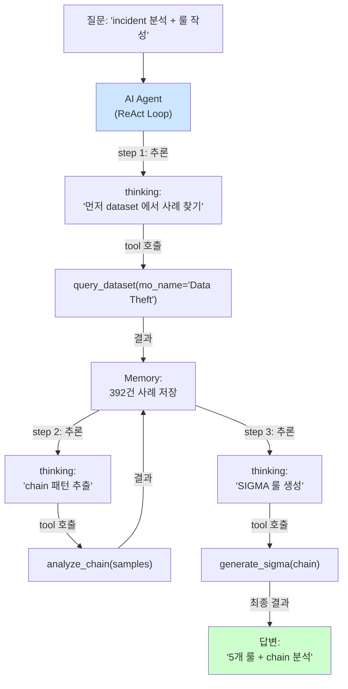

# Week 07: AI 에이전트 아키텍처

## 학습 목표
- AI 에이전트의 개념과 구성요소를 이해한다
- Master-Manager-SubAgent 계층 구조를 설명할 수 있다
- 에이전트 간 통신 프로토콜(A2A)을 이해한다
- Bastion의 아키텍처를 분석할 수 있다

## 실습 환경 (공통)

| 서버 | IP | 역할 | 접속 |
|------|-----|------|------|
| bastion | 10.20.30.201 | Control Plane (Bastion) | `ssh ccc@10.20.30.201` (pw: 1) |
| secu | 10.20.30.1 | 방화벽/IPS (nftables, Suricata) | `ssh ccc@10.20.30.1` |
| web | 10.20.30.80 | 웹서버 (JuiceShop:3000, Apache:80) | `ssh ccc@10.20.30.80` |
| siem | 10.20.30.100 | SIEM (Wazuh Dashboard:443, OpenCTI:8080) | `ssh ccc@10.20.30.100` |

**Bastion API:** `http://localhost:9100` / Key: `ccc-api-key-2026`

## 강의 시간 배분 (3시간)

| 시간 | 내용 | 유형 |
|------|------|------|
| 0:00-0:40 | 이론 강의 (Part 1) | 강의 |
| 0:40-1:10 | 이론 심화 + 사례 분석 (Part 2) | 강의/토론 |
| 1:10-1:20 | 휴식 | - |
| 1:20-2:00 | 실습 (Part 3) | 실습 |
| 2:00-2:40 | 심화 실습 + 도구 활용 (Part 4) | 실습 |
| 2:40-2:50 | 휴식 | - |
| 2:50-3:20 | 응용 실습 + Bastion 연동 (Part 5) | 실습 |
| 3:20-3:40 | 정리 + 과제 안내 | 정리 |

---

---

## 용어 해설 (AI/LLM 보안 활용 과목)

| 용어 | 영문 | 설명 | 비유 |
|------|------|------|------|
| **LLM** | Large Language Model | 대규모 언어 모델 (GPT, Claude, Llama 등) | 방대한 텍스트로 훈련된 AI 두뇌 |
| **Ollama** | Ollama | 로컬에서 LLM을 실행하는 도구 | 내 PC에서 돌리는 AI |
| **프롬프트** | Prompt | LLM에게 보내는 입력 텍스트 | AI에게 하는 질문/지시 |
| **토큰** | Token (LLM) | LLM이 처리하는 텍스트의 최소 단위 (~4글자) | 단어의 조각 |
| **컨텍스트 윈도우** | Context Window | LLM이 한 번에 처리할 수 있는 최대 토큰 수 | AI의 단기 기억 용량 |
| **파인튜닝** | Fine-tuning | 사전 학습된 모델을 특정 목적에 맞게 추가 학습 | 일반의가 전공 수련 |
| **RAG** | Retrieval-Augmented Generation | 외부 데이터를 검색하여 LLM 응답에 반영 | AI가 자료를 찾아보고 답변 |
| **에이전트** | Agent (AI) | 도구를 사용하여 자율적으로 작업하는 AI 시스템 | AI 비서 (스스로 판단하고 실행) |
| **도구 호출** | Tool Calling | LLM이 외부 도구/API를 호출하는 기능 | AI가 계산기를 꺼내서 계산 |
| **하네스** | Harness | 에이전트를 관리·제어하는 프레임워크 | AI 비서의 업무 규칙·관리 시스템 |
| **Playbook** | Playbook | 자동화된 작업 절차 (도구/스킬의 순서화된 묶음) | 표준 작업 지침서 (SOP) |
| **PoW** | Proof of Work | 작업 증명 (해시 체인 기반 실행 기록) | 작업 일지 + 영수증 |
| **보상** | Reward (RL) | 태스크 실행 결과에 따른 점수 (+성공, -실패) | 성과급 |
| **Q-learning** | Q-learning | 보상을 기반으로 최적 행동을 학습하는 RL 알고리즘 | 시행착오로 최적 경로를 찾는 학습 |
| **UCB1** | Upper Confidence Bound | 탐험(exploration)과 활용(exploitation)을 균형 잡는 전략 | "가본 길 vs 안 가본 길" 선택 전략 |
| **SubAgent** | SubAgent | 대상 서버에서 명령을 실행하는 경량 런타임 | 현장 파견 직원 |

---

## 1. AI 에이전트란?

AI 에이전트는 **자율적으로 목표를 달성**하기 위해 환경을 관찰하고, 판단하고, 행동하는 시스템이다.

### 에이전트 vs 챗봇

| 항목 | 챗봇 | 에이전트 |
|------|------|---------|
| 상호작용 | 질문-답변 | 목표 기반 자율 행동 |
| 도구 사용 | 없음 | 다양한 도구 호출 |
| 계획 수립 | 없음 | 목표 → 계획 → 실행 |
| 상태 관리 | 대화 이력만 | 작업 상태, 환경 상태 |
| 자율성 | 낮음 | 높음 |

### 에이전트 구성요소

```
에이전트 = LLM(두뇌) + 도구(손) + 메모리(기억) + 계획(전략)
```

| 구성요소 | 역할 | 예시 |
|---------|------|------|
| **LLM** | 추론, 판단 | Gemma3, Llama3.1 |
| **도구(Tools)** | 실제 작업 수행 | 명령 실행, 파일 읽기, API 호출 |
| **메모리** | 과거 경험 저장 | 작업 이력, 학습된 지식 |
| **계획** | 작업 분해, 순서 결정 | Task 목록, 우선순위 |

---

## 2. 계층적 에이전트 아키텍처

> **이 실습을 왜 하는가?**
> "AI 에이전트 아키텍처" — 이 주차의 핵심 기술을 실제 서버 환경에서 직접 실행하여 체험한다.
> AI/LLM 보안 활용 분야에서 이 기술은 실무의 핵심이며, 실습을 통해
> 명령어의 의미, 결과 해석 방법, 보안 관점에서의 판단 기준을 익힌다.
>
> **이걸 하면 무엇을 알 수 있는가?**
> - 이 기술이 실제 시스템에서 어떻게 동작하는지 직접 확인
> - 정상과 비정상 결과를 구분하는 눈을 기름
> - 실무에서 바로 활용할 수 있는 명령어와 절차를 체득
>
> **주의:** 모든 실습은 허가된 실습 환경(10.20.30.0/24)에서만 수행한다.

### 2.1 왜 계층 구조인가?

단일 에이전트는 복잡한 작업에서 한계가 있다.
계층 구조로 역할을 분리하면:
- **전문화**: 각 에이전트가 특정 역할에 집중
- **격리**: 실행 환경 격리로 안전성 확보
- **확장성**: 새 서버/역할 추가 용이

### 2.2 Master-Manager-SubAgent

```
[Master]  ← 계획 수립 (LLM 기반 추론)
    ↓
[Manager] ← 실행 관리 (상태 추적, 증거 기록)
    ↓
[SubAgent] ← 실제 명령 실행 (각 서버에 배포)
```

| 계층 | 포트 | 역할 | 위치 |
|------|------|------|------|
| Master | :8001 | LLM 기반 계획 수립 | control plane |
| Manager | :8000 | 프로젝트/태스크 관리, API 진입점 | control plane |
| SubAgent | :8002 | 명령 실행, 결과 반환 | 각 서버 |

---

## 3. Bastion 아키텍처

### 3.1 전체 구조

```
Claude Code /
  External Master
  HTTP API
  |
  Manager API
  :8000
  - 프로젝트 관리
  - 증거 기록
  - PoW 체인

▼  ▼  ▼

  SubAgent  | | SubAgent  | | SubAgent
  secu:8002  | | web:8002  | | siem:8002
  nftables/IPS | | Docker/WAF  | | Wazuh SIEM
```

### 3.2 통신 흐름

> **실습 목적**: LLM의 보안 분석 정확도를 체계적으로 평가하고 개선 포인트를 찾기 위해 수행한다
>
> **배우는 것**: Precision, Recall, F1-Score로 LLM의 보안 분류 성능을 측정하는 방법과, 프롬프트 튜닝으로 성능을 개선하는 전략을 이해한다
>
> **결과 해석**: Precision이 낮으면 오탐이 많고, Recall이 낮으면 미탐이 많으며, F1-Score가 종합 성능 지표이다
>
> **실전 활용**: AI 보안 도구 도입 시 PoC 평가, 모델 교체/업그레이드 효과 측정, 프롬프트 최적화에 활용한다

```bash
# 1. 외부 Master(Claude Code / 사용자)가 Manager VM의 Bastion에 자연어 지시
#    (Bastion은 manager:10.20.30.200 의 :8003 에서 /ask, /chat 로 대기)
curl -s -X POST http://10.20.30.200:8003/ask \
  -H 'Content-Type: application/json' \
  -d '{"message": "web 호스트의 호스트네임과 커널 버전을 알려줘"}'

# 2. Bastion(Manager)이 내부적으로 적절한 Skill/Playbook을 선택하고
#    대상 자산(예: web=10.20.30.80)의 SubAgent에게 명령을 위임한다.
#    사용자는 Manager에게만 말하고, SubAgent 직접 호출은 하지 않는다.

# 3. SubAgent가 실행 → 결과 + 증거가 Bastion /evidence 에 영구 기록된다
curl -s "http://10.20.30.200:8003/evidence?limit=5" | python3 -m json.tool
```

### 3.3 안전 장치

| 안전 장치 | 설명 |
|----------|------|
| **API 인증** | ccc-api의 `X-API-Key` 필수. Bastion 자체는 내부망 접근 가정 |
| **Risk Level** | Skill 메타데이터에 low/medium/high/critical 분류 |
| **Confirm Gate** | high/critical Skill은 사용자 승인 후에만 실행 |
| **증거 기록** | `/evidence` 에 명령·결과·타임스탬프 자동 저장 (replay 가능) |
| **직접 호출 금지** | SubAgent(:8002)는 Bastion을 통해서만 간접 호출 |

---

## 4. A2A (Agent-to-Agent) 프로토콜

에이전트 간 통신을 위한 표준화된 인터페이스이다.

### 4.1 SubAgent API 엔드포인트

```
POST /a2a/invoke_tool    → 도구(명령어) 실행
POST /a2a/invoke_llm     → 로컬 LLM 호출
POST /a2a/analyze         → LLM 기반 분석
POST /a2a/mission         → 자율 미션 실행
GET  /health              → 상태 확인
```

### 4.2 도구 호출 예시

```bash
# Manager(Bastion)를 통한 자연어 도구 호출
# Bastion이 자산 인벤토리에서 "secu" 자산을 찾고 해당 SubAgent에 uname 실행 위임
curl -s -X POST http://10.20.30.200:8003/ask \
  -H 'Content-Type: application/json' \
  -d '{"message": "secu 자산에서 uname -a 실행 결과를 알려줘"}'

# 결과의 실행 근거는 /evidence 에서 바로 조회 가능
curl -s "http://10.20.30.200:8003/evidence?asset=secu&limit=3" | python3 -m json.tool
```

---

## 5. 실습

### 실습 1: 3계층 에이전트 헬스체크

```bash
# ccc-api(학생/랩 관리)
curl -s -H "X-API-Key: ccc-api-key-2026" http://localhost:9100/health | python3 -m json.tool

# Bastion(Manager) — manager VM:8003
curl -s http://10.20.30.200:8003/health | python3 -m json.tool

# SubAgent(현장 에이전트) — 대상 자산의 :8002
curl -s http://10.20.30.80:8002/health | python3 -m json.tool
curl -s http://10.20.30.1:8002/health  | python3 -m json.tool
```

**무엇을 보는가:** 각 계층이 독립 서비스로 기동되어 있는지 확인한다.
`{"status":"ok"}` 류 응답이 없으면 그 계층부터 복구해야 상위 호출이 의미를 가진다.

### 실습 2: Ollama에게 아키텍처 장단점 분석 요청

Ollama(:11434)는 원시 LLM 서버이고, Bastion(:8003)은 그 위에 자산·증거·Skill을
얹은 운영 에이전트이다. 본 실습은 **원시 LLM 관점**의 분석이므로 Ollama 포트 사용.

```bash
curl -s http://10.20.30.200:11434/v1/chat/completions \
  -H "Content-Type: application/json" \
  -d '{
    "model": "gemma3:12b",
    "messages": [
      {"role": "system", "content": "AI 시스템 아키텍트입니다."},
      {"role": "user", "content": "Master-Manager-SubAgent 3계층 AI 에이전트 아키텍처의 장단점을 분석하세요.\n\n고려사항:\n1. 보안 (권한 격리)\n2. 확장성 (서버 추가)\n3. 장애 허용 (단일 실패점)\n4. 성능 (레이턴시)\n5. 감사 (작업 추적)"}
    ],
    "temperature": 0.4
  }' | python3 -c "import json,sys; print(json.load(sys.stdin)['choices'][0]['message']['content'])"
```

### 실습 3: 한 번의 자연어 지시 → 오케스트레이션 → 증거

```bash
# 자연어 지시 한 번으로 복수 자산 점검.
# Bastion이 자산 인벤토리에서 web·secu 를 찾아 해당 SubAgent에 위임·수집·정리한다.
curl -s -X POST http://10.20.30.200:8003/ask \
  -H 'Content-Type: application/json' \
  -d '{"message": "web과 secu 자산의 hostname·uptime·현재 로드를 각각 수집해서 비교 요약해줘"}'

# 결과가 어떤 명령·어떤 자산·어떤 시각에 수행됐는지 감사 추적
curl -s "http://10.20.30.200:8003/evidence?limit=10" | python3 -m json.tool

# 대화형 보강이 필요하면 /chat (NDJSON 스트림) 사용
curl -N -s -X POST http://10.20.30.200:8003/chat \
  -H 'Content-Type: application/json' \
  -d '{"message": "방금 점검 결과에서 이상 징후가 있으면 MITRE ATT&CK로 매핑해줘"}'
```

**왜 이 형태인가:** Bastion은 `/projects/{id}/plan|execute|dispatch` 같은 워크플로
상태머신을 바깥에 노출하지 않는다. 사용자는 "무엇을 원하는지"만 자연어로 말하고,
계획→실행→증거화는 Bastion 내부의 Skill 선택기·Playbook 엔진이 책임진다. 이것이
운영 에이전트의 실제 UX이며, 감사(`/evidence`)를 통해 사후 검증이 가능하다.

---

## 6. 다른 에이전트 프레임워크 비교

| 프레임워크 | 특징 | 용도 |
|-----------|------|------|
| **Bastion** | 보안 특화, PoW, 계층적 | IT 운영/보안 자동화 |
| **LangChain** | 범용, 도구 체인 | 다양한 LLM 앱 |
| **AutoGPT** | 자율 에이전트 | 범용 자동화 |
| **CrewAI** | 다중 에이전트 협업 | 팀 기반 작업 |

---

## 핵심 정리

1. AI 에이전트는 LLM + 도구 + 메모리 + 계획으로 구성된 자율 시스템이다
2. Master-Manager-SubAgent 계층 구조로 역할을 분리하고 안전성을 확보한다
3. A2A 프로토콜로 에이전트 간 표준화된 통신을 수행한다
4. Bastion는 API 인증, Risk Level, PoW 체인 등 다중 안전 장치를 제공한다
5. 모든 명령은 Manager를 통해서만 SubAgent에 전달한다 (직접 호출 금지)

---

## 다음 주 예고
- Week 08: 중간고사 - LLM 보안 도구 구축

---

---

## 심화: AI/LLM 보안 활용 보충

### Ollama API 상세 가이드

#### 기본 호출 구조

```bash
# Ollama는 OpenAI 호환 API를 제공한다
# URL: http://10.20.30.200:11434/v1/chat/completions

curl -s http://10.20.30.200:11434/v1/chat/completions \
  -H "Content-Type: application/json" \
  -d '{
    "model": "gemma3:12b",        ← 사용할 모델
    "messages": [
      {"role": "system", "content": "역할 부여"},  ← 시스템 프롬프트
      {"role": "user", "content": "실제 질문"}      ← 사용자 입력
    ],
    "temperature": 0.1,            ← 출력 다양성 (0=결정론, 1=창의적)
    "max_tokens": 1000             ← 최대 출력 길이
  }'
```

> **각 파라미터의 의미:**
> - `model`: 어떤 AI 모델을 사용할지. 큰 모델일수록 정확하지만 느림
> - `messages`: 대화 내역. system(역할)→user(질문)→assistant(답변) 순서
> - `temperature`: 0에 가까우면 같은 질문에 항상 같은 답. 1에 가까우면 매번 다른 답
> - `max_tokens`: 출력 길이 제한. 토큰 ≈ 글자 수 × 0.5 (한국어)

#### 모델별 특성

| 모델 | 크기 | 응답 시간 | 정확도 | 권장 용도 |
|------|------|---------|--------|---------|
| gemma3:12b | 12B | ~5초 | 양호 | 분석, 룰 생성, 보고서 |
| llama3.1:8b | 8B | ~3초 | 보통 | 빠른 분류, 검증 |
| qwen3:8b | 8B | ~5초 | 보통 | 교차 검증 (다른 벤더) |
| gpt-oss:120b | 120B | ~25초 | 높음 | 복잡한 분석 (시간 여유 시) |

#### 프롬프트 엔지니어링 패턴

**패턴 1: 역할 부여 (Role Assignment)**
```json
{"role":"system","content":"당신은 10년 경력의 SOC 분석가입니다. MITRE ATT&CK에 정통합니다."}
```

**패턴 2: 출력 형식 강제 (Format Control)**
```json
{"role":"system","content":"반드시 JSON으로만 응답하세요. 마크다운, 설명, 주석을 포함하지 마세요."}
```

**패턴 3: Few-shot (예시 제공)**
```json
{"role":"user","content":"예시:\n입력: SSH 실패 5회\n출력: {\"severity\":\"HIGH\",\"attack\":\"brute_force\"}\n\n이제 분석하세요: SSH 실패 20회 후 성공"}
```

**패턴 4: Chain of Thought (단계별 사고)**
```json
{"role":"system","content":"단계별로 분석하세요: 1)현상 파악 2)원인 추론 3)ATT&CK 매핑 4)대응 방안"}
```

### Bastion API 핵심 엔드포인트 요약

Bastion(manager VM :8003)이 실제 제공하는 엔드포인트는 다음과 같다.
워크플로 상태머신(plan/execute 등)은 내부에 숨겨져 있으며, 외부에는 자연어 I/F만 노출된다.

```
POST /ask          → 단일 자연어 질의, 동기 응답 {"answer": "..."}
POST /chat         → 대화형 NDJSON 스트림 (한 줄 = 한 이벤트)
GET  /evidence     → 과거 실행 증거(명령·결과·시각·자산) 조회
GET  /skills       → 등록된 Skill(도구) 목록
GET  /playbooks    → 등록된 Playbook(결정론적 시나리오) 목록
GET  /assets       → 자산 인벤토리(이름↔IP↔역할)
POST /onboard      → 신규 자산 온보딩
GET  /health       → 헬스체크

보조 관리용(ccc-api :9100)은 별도. Bastion 엔드포인트는 내부망 가정.
```

**설계 의도:** 워크플로 내부 단계를 열지 않음으로써,
(1) 사용자는 도메인 언어로만 지시하고,
(2) 내부 정책(승인 게이트, 자산 선택, Playbook 우선순위)은 Bastion이 소유하며,
(3) 모든 실행은 `/evidence`에 자동 기록되어 감사가 가능하다.

---
---

> **실습 환경 검증 완료** (2026-03-28): Ollama 22모델(gemma3:12b ~5s), Bastion 50프로젝트, execute-plan 병렬, RL train/recommend

---

## 📂 실습 참조 파일 가이드

> 이번 주 실습에서 **실제로 조작하는** 솔루션의 기능·경로·파일·설정·UI 요점입니다.

### Ollama + LangChain
> **역할:** 로컬 LLM 서빙(Ollama) + 체인 오케스트레이션(LangChain)  
> **실행 위치:** `bastion (LLM 서버)`  
> **접속/호출:** `OLLAMA_HOST=http://10.20.30.201:11434`, Python `from langchain_ollama import OllamaLLM`

**주요 경로·파일**

| 경로 | 역할 |
|------|------|
| `~/.ollama/models/` | 다운로드된 모델 블롭 |
| `/etc/systemd/system/ollama.service` | 서비스 유닛 |

**핵심 설정·키**

- `OLLAMA_HOST=0.0.0.0:11434` — 외부 바인드
- `OLLAMA_KEEP_ALIVE=30m` — 모델 유휴 유지
- `LLM_MODEL=gemma3:4b (env)` — CCC 기본 모델

**로그·확인 명령**

- `journalctl -u ollama` — 서빙 로그
- `LangChain `verbose=True`` — 체인 단계 출력

**UI / CLI 요점**

- `ollama list` — 설치된 모델
- `curl -XPOST $OLLAMA_HOST/api/generate -d '{...}'` — REST 생성
- LangChain `RunnableSequence | parser` — 체인 조립 문법

> **해석 팁.** Ollama는 **첫 호출에 모델 로드**가 커서 지연이 크다. 성능 실험 시 워밍업 호출을 배제하고 측정하자.

### CCC Bastion Agent
> **역할:** CCC 자율 운영 에이전트 — 스킬/플레이북/경험 학습  
> **실행 위치:** `bastion (10.20.30.201)`  
> **접속/호출:** TUI `./dev.sh bastion`, API `http://10.20.30.200:11434`

**주요 경로·파일**

| 경로 | 역할 |
|------|------|
| `packages/bastion/agent.py` | 메인 에이전트 루프 |
| `packages/bastion/skills.py` | 스킬 정의 |
| `packages/bastion/playbooks/` | 정적 플레이북 YAML |
| `data/bastion/experience/` | 수집된 경험 (pass/fail) |

**핵심 설정·키**

- `LLM_BASE_URL / LLM_MODEL` — Ollama 연결
- `CCC_API_KEY` — ccc-api 인증
- `max_retry=2` — 실패 시 self-correction 재시도

**로그·확인 명령**

- ``docs/test-status.md`` — 현재 테스트 진척 요약
- ``bastion_test_progress.json`` — 스텝별 pass/fail 원시

**UI / CLI 요점**

- 대화형 TUI 프롬프트 — 자연어 지시 → 계획 → 실행 → 검증
- `/a2a/mission` (API) — 자율 미션 실행
- Experience→Playbook 승격 — 반복 성공 패턴 저장

> **해석 팁.** 실패 시 output을 분석해 **근본 원인 교정**이 설계의 핵심. 증상 회피/땜빵은 금지.

---

## 실제 사례 (WitFoo Precinct 6 — AI 에이전트 아키텍처)

> 출처: WitFoo Precinct 6 Cybersecurity Dataset (Apache 2.0)
> 본 lecture *AI 에이전트의 ReAct loop / 메모리 / tool 호출 구조* 학습 항목 매칭.

### AI 에이전트 = LLM + Tool + Memory + Loop

학생이 자주 오해하는 점 — *AI 에이전트 = LLM* 이라는 생각이다. 실제로는 — **에이전트는 LLM 위에 추가로 *Tool 호출, Memory, Loop* 의 3가지 layer 를 얹은 구조** 다. LLM 단독은 *질문에 1회 답변* 하는 정도지만, 에이전트는 *문제를 단계별로 풀고, 도구를 호출하고, 결과를 기억하면서 반복* 한다.

dataset 의 신호 분석에 이 차이가 드러난다 — LLM 단독은 *"이 신호가 의심스러운가"* 에 답할 수 있지만, 에이전트는 *"이 신호가 의심스러운가? 의심스럽다면 dataset 에서 유사 사례를 찾아 chain 을 추출하고 차단 룰까지 작성하라"* 같은 *복합 요청* 을 단계별로 수행한다.



**그림 해석**: 에이전트는 *3 step 을 자동으로 분리하여 실행* — 사람이 *"분석 + 룰 작성"* 한 번 요청해도 에이전트는 내부적으로 dataset query → chain 분석 → 룰 생성의 3 step 으로 나누어 처리. 각 step 마다 LLM 추론 + tool 호출 + memory 갱신. lecture §"ReAct = Reason + Act loop" 의 핵심.

### Case 1: dataset 분석에 필요한 tool 의 분류 — 4가지 카테고리

| tool 카테고리 | 예시 | 빈도 | 학습 매핑 |
|---|---|---|---|
| Query | `query_dataset(filter)` | 매 step | dataset 검색 |
| Analyze | `analyze_chain`, `cluster_signals` | 단계별 | LLM 호출 |
| Generate | `generate_sigma`, `generate_report` | 최종 단계 | 산출물 작성 |
| Verify | `verify_rule_against_dataset` | 검증 단계 | 정확도 측정 |

**자세한 해석**:

AI 에이전트가 보안 작업을 수행하려면 *4가지 카테고리* 의 tool 이 필요하다. 학생이 자주 누락하는 카테고리는 **Verify** — 에이전트가 자기 결과물을 *스스로 검증* 하지 않으면, 잘못된 룰을 생성해도 모르고 운영에 적용된다.

dataset 에 적용된 에이전트는 — Query (dataset 392건 가져오기) → Analyze (chain 추출) → Generate (SIGMA 룰 5개) → Verify (생성한 룰을 dataset 에 적용해 recall/precision 측정) 의 순서로 동작. 마지막 Verify 가 *"이 룰의 recall 95%, precision 92% 입니다"* 를 답해야 운영 적용 가능 여부를 판단할 수 있다.

학생이 알아야 할 것은 — **에이전트의 tool 설계는 *입력 + 출력 + 검증* 의 3축이 필수** 라는 점. 검증 tool 이 없는 에이전트는 *자기 환각 (hallucination) 을 발견 못 하는* 구조적 결함이 있다.

### Case 2: 에이전트의 메모리 — dataset 신호 392건을 어떻게 저장할 것인가

| 메모리 종류 | 적합한 데이터 | dataset 활용 |
|---|---|---|
| Short-term (context) | 현재 작업의 신호 (~30개) | 분석 중인 batch |
| Long-term (vector DB) | 과거 모든 사례 (수만 건) | RAG 으로 유사 사례 검색 |
| Working memory (kv) | 현재 step 의 중간 결과 | chain extract 결과 |
| 학습 매핑 | §"에이전트 메모리 3 layer" | 정보 양에 따른 분리 |

**자세한 해석**:

dataset 의 392건 사례를 모두 LLM context 에 넣을 수는 없다 (토큰 한계). 대신 *3 layer 메모리* 로 분리한다.

**Short-term**: 현재 분석 중인 30건만 context 에 넣어 LLM 에 보냄. LLM 이 추론할 *직접 작업 대상*.

**Long-term (vector DB)**: 392건 모두를 vector embedding 으로 변환하여 vector DB (예: Chroma, Weaviate) 에 저장. 새 신호가 들어오면 *유사도가 높은 5건* 을 vector DB 에서 검색해 short-term 에 추가 — RAG (Retrieval Augmented Generation) 패턴.

**Working memory**: 현재 step 에서 추출한 중간 결과 (예: chain 의 3 단계까지 추출됨, 4단계는 다음 호출에서). 다음 step 의 입력이 됨.

학생이 알아야 할 것은 — **3 layer 메모리 분리가 LLM 토큰 한계를 우회하는 핵심 기법** 이라는 점. 단순히 모든 데이터를 context 에 던지는 *naive 에이전트* 는 토큰 한계로 운영 불가.

### 이 사례에서 학생이 배워야 할 3가지

1. **에이전트 = LLM + Tool + Memory + Loop** — 단순 LLM 과의 4가지 차이.
2. **Verify tool 이 환각 방지의 핵심** — 자기 결과물을 dataset 으로 검증하는 단계 필수.
3. **3 layer 메모리 분리로 토큰 한계 우회** — short-term + long-term + working.

**학생 액션**: lab 환경에서 Bastion 같은 에이전트 시스템을 구동하고, *"dataset 의 Data Theft 사례를 분석해 SIGMA 룰을 작성하라"* 의 단일 요청을 입력. 에이전트가 어느 tool 을 어느 순서로 호출하는지 transcript 를 캡처. *"이 에이전트가 4 카테고리 tool 을 모두 사용했는가"* 를 평가.

