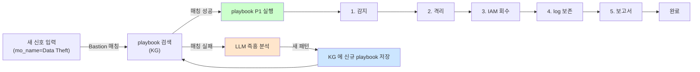

# Week 10: Bastion (2) - Playbook + RL

## 학습 목표
- Bastion Playbook의 개념과 구조를 이해한다
- Playbook을 생성하고 실행할 수 있다
- 강화학습(RL) 보상 시스템의 원리를 이해한다
- RL 학습과 정책 추천 기능을 활용할 수 있다

## 실습 환경 (공통)

| 서버 | IP | 역할 | 접속 |
|------|-----|------|------|
| bastion | 10.20.30.201 | Control Plane (Bastion) | `ssh ccc@10.20.30.201` (pw: 1) |
| secu | 10.20.30.1 | 방화벽/IPS (nftables, Suricata) | `ssh ccc@10.20.30.1` |
| web | 10.20.30.80 | 웹서버 (JuiceShop:3000, Apache:80) | `ssh ccc@10.20.30.80` |
| siem | 10.20.30.100 | SIEM (Wazuh Dashboard:443, OpenCTI:8080) | `ssh ccc@10.20.30.100` |

**Bastion API:** `http://localhost:9100` / Key: `ccc-api-key-2026`

## 강의 시간 배분 (3시간)

| 시간 | 내용 | 유형 |
|------|------|------|
| 0:00-0:40 | 이론 강의 (Part 1) | 강의 |
| 0:40-1:10 | 이론 심화 + 사례 분석 (Part 2) | 강의/토론 |
| 1:10-1:20 | 휴식 | - |
| 1:20-2:00 | 실습 (Part 3) | 실습 |
| 2:00-2:40 | 심화 실습 + 도구 활용 (Part 4) | 실습 |
| 2:40-2:50 | 휴식 | - |
| 2:50-3:20 | 응용 실습 + Bastion 연동 (Part 5) | 실습 |
| 3:20-3:40 | 정리 + 과제 안내 | 정리 |

---

---

## 용어 해설 (AI/LLM 보안 활용 과목)

| 용어 | 영문 | 설명 | 비유 |
|------|------|------|------|
| **LLM** | Large Language Model | 대규모 언어 모델 (GPT, Claude, Llama 등) | 방대한 텍스트로 훈련된 AI 두뇌 |
| **Ollama** | Ollama | 로컬에서 LLM을 실행하는 도구 | 내 PC에서 돌리는 AI |
| **프롬프트** | Prompt | LLM에게 보내는 입력 텍스트 | AI에게 하는 질문/지시 |
| **토큰** | Token (LLM) | LLM이 처리하는 텍스트의 최소 단위 (~4글자) | 단어의 조각 |
| **컨텍스트 윈도우** | Context Window | LLM이 한 번에 처리할 수 있는 최대 토큰 수 | AI의 단기 기억 용량 |
| **파인튜닝** | Fine-tuning | 사전 학습된 모델을 특정 목적에 맞게 추가 학습 | 일반의가 전공 수련 |
| **RAG** | Retrieval-Augmented Generation | 외부 데이터를 검색하여 LLM 응답에 반영 | AI가 자료를 찾아보고 답변 |
| **에이전트** | Agent (AI) | 도구를 사용하여 자율적으로 작업하는 AI 시스템 | AI 비서 (스스로 판단하고 실행) |
| **도구 호출** | Tool Calling | LLM이 외부 도구/API를 호출하는 기능 | AI가 계산기를 꺼내서 계산 |
| **하네스** | Harness | 에이전트를 관리·제어하는 프레임워크 | AI 비서의 업무 규칙·관리 시스템 |
| **Playbook** | Playbook | 자동화된 작업 절차 (도구/스킬의 순서화된 묶음) | 표준 작업 지침서 (SOP) |
| **PoW** | Proof of Work | 작업 증명 (해시 체인 기반 실행 기록) | 작업 일지 + 영수증 |
| **보상** | Reward (RL) | 태스크 실행 결과에 따른 점수 (+성공, -실패) | 성과급 |
| **Q-learning** | Q-learning | 보상을 기반으로 최적 행동을 학습하는 RL 알고리즘 | 시행착오로 최적 경로를 찾는 학습 |
| **UCB1** | Upper Confidence Bound | 탐험(exploration)과 활용(exploitation)을 균형 잡는 전략 | "가본 길 vs 안 가본 길" 선택 전략 |
| **SubAgent** | SubAgent | 대상 서버에서 명령을 실행하는 경량 런타임 | 현장 파견 직원 |

---

## 1. Playbook이란?

Playbook은 **반복적인 보안 작업을 재사용 가능한 절차로 정의**한 것이다.
Ansible Playbook과 개념이 같다. Bastion의 Playbook은 **Skill의 순서화된 묶음**이다.

### Playbook vs 매번 LLM 즉흥 생성

| 항목 | LLM adhoc | Playbook |
|------|-----------|----------|
| 재사용 | 매번 프롬프트 다시 씀 | 한 번 정의, 반복 |
| 재현성 | temperature·모델에 흔들림 | 파라미터만 바인딩, 결정론 |
| 감사 | 생성된 명령 추적 필요 | Skill 호출로 구조적 |
| 공유 | 개인 지식 | `/playbooks` 로 팀 공유 |

핵심: **LLM은 "무엇을 할지" 판단하고, Playbook은 "어떻게 실행할지"를 고정**한다.

---

## 2. Playbook 스키마

Bastion이 관리하는 Playbook의 논리 구조이다. 파일 위치는
`packages/bastion/playbooks/` 하위 YAML.

```yaml
name: ssh-security-audit
description: SSH 보안 설정 점검 Playbook
risk: low
params:
  - name: asset
    required: true
steps:
  - skill: system.status
    bind: { asset: "${asset}" }
  - skill: ssh.config_dump
    bind: { asset: "${asset}" }
  - skill: log.recent_auth_failures
    bind: { asset: "${asset}", limit: 20 }
assertions:
  - step: 2
    expect:
      contains: [ "PermitRootLogin no" ]
      not_contains: [ "PermitRootLogin yes" ]
```

**구성 요소:**
- `steps[].skill` — Skill 이름 (= `/skills` 에 등록된 결정론 도구)
- `steps[].bind` — Skill 파라미터 바인딩 (플레이스홀더 `${...}`)
- `assertions` — 성공 여부를 판단하는 기대값. RL 보상 신호의 원천.

---

## 3. Playbook 실행 — Bastion에게 자연어로 요청

사용자는 Playbook JSON을 직접 POST 하지 않는다. **자연어로 Playbook 이름을 지시**하거나,
자연어 의도를 Bastion이 해석해 등록된 Playbook 중 가장 근접한 것을 선택한다.

```bash
# (A) Playbook 이름을 명시적으로 지정
curl -s -X POST http://10.20.30.200:8003/ask \
  -H 'Content-Type: application/json' \
  -d '{"message": "web 자산에 ssh-security-audit playbook을 실행해줘"}'

# (B) 의도만 말하면 Bastion이 적합 Playbook을 선택
curl -s -X POST http://10.20.30.200:8003/ask \
  -H 'Content-Type: application/json' \
  -d '{"message": "web 자산의 SSH 보안 상태를 점검해줘"}'
```

어느 Playbook이 실행됐고 각 step이 어떻게 평가됐는지는 `/evidence` 에 남는다.

```bash
curl -s "http://10.20.30.200:8003/evidence?asset=web&limit=15" | python3 -m json.tool
```

---

## 4. 경험(Experience) → Playbook 승격

Bastion은 `/ask`·`/chat` 으로 처리한 **반복 성공 패턴을 경험(experience)으로 축적**하고,
일정 임계치(예: 성공 N회, 동일 Skill 조합)를 넘으면 Playbook 후보로 승격한다.
(opsclaw 레퍼런스 에이전트의 설계. 본 과정의 Bastion도 동일 지향.)

승격 파이프라인:
```
/ask 반복 성공 → experience 수집 → 패턴 추출(Skill 시퀀스) → Playbook 등록 → /playbooks
```

효과: 사람이 쓰지 않아도 자주 쓰는 작업이 자동으로 재현 가능한 Playbook이 된다.

---

## 5. 강화학습(RL) 보상과 정책

### 5.1 보상 신호의 원천

Playbook의 `assertions` 와 `/evidence` 의 `exit_code`·지연시간이 조합되어 보상이 결정된다.

| 신호 | 기여 |
|------|------|
| assertions 통과 여부 | 성공/실패 기본 부호 |
| exit_code | 0 이면 +, 비영 시 − |
| 지연시간 | 짧을수록 + 가중 |
| risk | 고위험에서 성공하면 +, 실패하면 −− |

### 5.2 정책의 역할

보상 데이터가 쌓이면 Bastion은 **동일 의도에 대해 어떤 Playbook/Skill 조합이 더 잘 통했는지** 를
통계적으로 학습한다. Q-learning/UCB1 등의 전략이 내부 선택기의 바탕이다.

| 상태(State) | 행동(Action) | 학습 결과 |
|-------------|-------------|-----------|
| "SSH 하드닝" 의도 + 자산=web | Playbook A vs B 중 택일 | 과거 성공률 높은 쪽 우선 |
| risk=high 의도 | 실행 vs 승인 요구 | 승인 게이트 판단 안정화 |

### 5.3 관찰 방법

Bastion 내부 상태는 대부분 외부로 노출되지 않지만, 학습 결과를 간접적으로 확인하려면:

```bash
# 최근 증거 기반으로 동일 의도의 실행 이력 비교
curl -s "http://10.20.30.200:8003/evidence?limit=50" \
  | python3 -c "
import sys,json,collections
d=json.load(sys.stdin).get('evidence',[])
c=collections.Counter((e.get('playbook') or e.get('skill'),e.get('exit_code',0)) for e in d)
for k,v in c.most_common(10): print(v,k)
"
```

---

## 6. 실습

### 실습 1: Playbook 목록 확인과 실행

```bash
# 등록된 Playbook 목록
curl -s http://10.20.30.200:8003/playbooks | python3 -m json.tool

# 선택한 Playbook을 자연어로 실행 (예: baseline.web)
curl -s -X POST http://10.20.30.200:8003/ask \
  -H 'Content-Type: application/json' \
  -d '{"message": "web 자산에 baseline.web playbook을 실행해줘"}'

# 실행 증거 확인
curl -s "http://10.20.30.200:8003/evidence?asset=web&limit=10" | python3 -m json.tool
```

### 실습 2: 의도 기반 자동 선택

```bash
# Playbook 이름을 말하지 않고 의도만 전달
# Bastion이 /playbooks 중 가장 근접한 것을 선택한다
curl -s -X POST http://10.20.30.200:8003/ask \
  -H 'Content-Type: application/json' \
  -d '{"message": "web의 기본 보안 베이스라인 점검해줘"}'
```

`/evidence` 에서 어떤 Playbook이 매칭됐는지 확인한다.

### 실습 3: LLM으로 Playbook 초안 설계

새 Playbook을 만들려면 먼저 YAML 초안을 LLM에게 생성시키고, 운영자가 검토 후 파일로 커밋한다.
**중요:** LLM이 만든 YAML을 곧바로 실행하지 않는다 — 검증 후 Bastion 설정 파일에 반영한다.

```bash
# LLM에게 Linux 하드닝 Playbook YAML 초안 요청 (Ollama :11434)
curl -s http://10.20.30.200:11434/v1/chat/completions \
  -H "Content-Type: application/json" \
  -d '{
    "model": "gemma3:12b",
    "messages": [
      {"role": "system", "content": "Bastion Playbook 전문가. 다음 스키마만 사용: name, description, risk, params, steps[{skill,bind}], assertions[{step,expect}]."},
      {"role": "user", "content": "Linux 보안 하드닝 Playbook을 YAML로 작성해줘. 점검: SSH, 방화벽, 불필요 서비스, sudoers, 파일권한. 사용 가능한 Skill: system.status, ssh.config_dump, fw.rules_dump, service.list, sudoers.dump, files.perm_audit."}
    ],
    "temperature": 0.3
  }' | python3 -c "import json,sys; print(json.load(sys.stdin)['choices'][0]['message']['content'])"
```

**운영 체크리스트(LLM 생성 → 배포 전 검증):**
- 모든 `skill` 이 `/skills` 목록에 실제 존재하는가
- `bind` 파라미터가 Skill 시그니처와 일치하는가
- `risk` 와 실제 작업 영향이 일관되는가
- `assertions` 가 측정 가능한 조건인가

---

## 7. 이 주차의 핵심

1. Playbook = Skill의 **결정론적 묶음**. LLM 즉흥 생성보다 재현성·감사성이 높다.
2. 실행은 자연어 지시(`/ask`)로 충분. `/projects/execute-plan` 같은 상태머신 API는 쓰지 않는다.
3. 성공 패턴은 experience로 축적되어 자동으로 Playbook 후보가 된다.
4. 보상 신호는 `assertions`·`exit_code`·`지연시간` 조합에서 나온다.
5. LLM은 **초안 설계자** — 실제 Playbook 파일은 사람의 리뷰를 거쳐 등록한다.

---

## 다음 주 예고
- Week 11: 자율 미션 — Red/Blue Team 시뮬레이션과 Bastion의 `/ask`·`/chat` 활용

---

---

## 심화: AI/LLM 보안 활용 보충

### Ollama API 상세 가이드

#### 기본 호출 구조

```bash
# Ollama는 OpenAI 호환 API를 제공한다
# URL: http://10.20.30.200:11434/v1/chat/completions

curl -s http://10.20.30.200:11434/v1/chat/completions \
  -H "Content-Type: application/json" \
  -d '{
    "model": "gemma3:12b",        ← 사용할 모델
    "messages": [
      {"role": "system", "content": "역할 부여"},  ← 시스템 프롬프트
      {"role": "user", "content": "실제 질문"}      ← 사용자 입력
    ],
    "temperature": 0.1,            ← 출력 다양성 (0=결정론, 1=창의적)
    "max_tokens": 1000             ← 최대 출력 길이
  }'
```

> **각 파라미터의 의미:**
> - `model`: 어떤 AI 모델을 사용할지. 큰 모델일수록 정확하지만 느림
> - `messages`: 대화 내역. system(역할)→user(질문)→assistant(답변) 순서
> - `temperature`: 0에 가까우면 같은 질문에 항상 같은 답. 1에 가까우면 매번 다른 답
> - `max_tokens`: 출력 길이 제한. 토큰 ≈ 글자 수 × 0.5 (한국어)

#### 모델별 특성

| 모델 | 크기 | 응답 시간 | 정확도 | 권장 용도 |
|------|------|---------|--------|---------|
| gemma3:12b | 12B | ~5초 | 양호 | 분석, 룰 생성, 보고서 |
| llama3.1:8b | 8B | ~3초 | 보통 | 빠른 분류, 검증 |
| qwen3:8b | 8B | ~5초 | 보통 | 교차 검증 (다른 벤더) |
| gpt-oss:120b | 120B | ~25초 | 높음 | 복잡한 분석 (시간 여유 시) |

#### 프롬프트 엔지니어링 패턴

**패턴 1: 역할 부여 (Role Assignment)**
```json
{"role":"system","content":"당신은 10년 경력의 SOC 분석가입니다. MITRE ATT&CK에 정통합니다."}
```

**패턴 2: 출력 형식 강제 (Format Control)**
```json
{"role":"system","content":"반드시 JSON으로만 응답하세요. 마크다운, 설명, 주석을 포함하지 마세요."}
```

**패턴 3: Few-shot (예시 제공)**
```json
{"role":"user","content":"예시:\n입력: SSH 실패 5회\n출력: {\"severity\":\"HIGH\",\"attack\":\"brute_force\"}\n\n이제 분석하세요: SSH 실패 20회 후 성공"}
```

**패턴 4: Chain of Thought (단계별 사고)**
```json
{"role":"system","content":"단계별로 분석하세요: 1)현상 파악 2)원인 추론 3)ATT&CK 매핑 4)대응 방안"}
```

### Bastion API 핵심 엔드포인트 요약

```
POST /ask          → 단일 자연어 질의, 동기 응답 {"answer": "..."}
POST /chat         → 대화형 NDJSON 스트림
GET  /evidence     → 과거 실행 증거 (자산·skill·playbook·exit·시각)
GET  /skills       → 등록된 Skill(결정론 도구) 목록
GET  /playbooks    → 등록된 Playbook 목록
GET  /assets       → 자산 인벤토리
GET  /health       → 헬스체크

Bastion(:8003)은 내부망 접근 가정.
Ollama(:11434)는 원시 LLM — 초안 설계·분석에 직접 호출.
```

---
---

> **실습 환경 검증 완료** (2026-03-28): Ollama 22모델(gemma3:12b ~5s), Bastion 50프로젝트, execute-plan 병렬, RL train/recommend

---

## 📂 실습 참조 파일 가이드

> 이번 주 실습에서 **실제로 조작하는** 솔루션의 기능·경로·파일·설정·UI 요점입니다.

### CCC Bastion Agent
> **역할:** CCC 자율 운영 에이전트 — 스킬/플레이북/경험 학습  
> **실행 위치:** `bastion (10.20.30.201)`  
> **접속/호출:** TUI `./dev.sh bastion`, API `http://10.20.30.200:11434`

**주요 경로·파일**

| 경로 | 역할 |
|------|------|
| `packages/bastion/agent.py` | 메인 에이전트 루프 |
| `packages/bastion/skills.py` | 스킬 정의 |
| `packages/bastion/playbooks/` | 정적 플레이북 YAML |
| `data/bastion/experience/` | 수집된 경험 (pass/fail) |

**핵심 설정·키**

- `LLM_BASE_URL / LLM_MODEL` — Ollama 연결
- `CCC_API_KEY` — ccc-api 인증
- `max_retry=2` — 실패 시 self-correction 재시도

**로그·확인 명령**

- ``docs/test-status.md`` — 현재 테스트 진척 요약
- ``bastion_test_progress.json`` — 스텝별 pass/fail 원시

**UI / CLI 요점**

- 대화형 TUI 프롬프트 — 자연어 지시 → 계획 → 실행 → 검증
- `/a2a/mission` (API) — 자율 미션 실행
- Experience→Playbook 승격 — 반복 성공 패턴 저장

> **해석 팁.** 실패 시 output을 분석해 **근본 원인 교정**이 설계의 핵심. 증상 회피/땜빵은 금지.

---

## 실제 사례 (WitFoo Precinct 6 — Bastion Playbook + RL)

> 출처: WitFoo Precinct 6 Cybersecurity Dataset (Apache 2.0)
> 본 lecture *Bastion 의 playbook 시스템과 RL (강화학습) 기반 개선* 학습 항목 매칭.

### Playbook = "이런 신호에는 이런 작업" 의 코드화된 절차

**Playbook (플레이북)** 은 *반복되는 보안 작업의 표준 절차* 를 YAML 파일로 정의한 것이다. 사람 SOC 분석가가 *"비슷한 사고가 들어오면 매번 같은 12 단계를 한다"* 는 패턴을 — Bastion 은 playbook 으로 자동 실행한다. 즉 사람의 *반복 작업을 코드화* 한 것.

dataset 392건 Data Theft 사례를 분석하면 — 대부분이 *"recon → privesc → lateral → exfil"* 의 표준 chain 을 따른다. 이 chain 에 대한 대응도 표준이다 — *"감지 → 격리 → IAM 회수 → log 보존 → 보고서 작성"*. 이 5단계를 playbook 으로 작성하면 — 비슷한 신호 392건을 모두 자동 처리 가능. 사람이 5분/건 걸리는 작업을 Bastion 이 30초/건 으로.



**그림 해석**: Bastion 은 *"매칭되는 playbook 이 있으면 자동 실행, 없으면 LLM 즉흥 + 새 playbook 학습"* 의 2가지 경로를 동시에 가진다. 시간이 갈수록 playbook 이 풍부해져 LLM 즉흥 분석 비중이 줄어든다 — 학습 곡선.

### Case 1: dataset Data Theft 392건 → playbook 1개의 운영 효과

| 항목 | playbook 미사용 | playbook 사용 |
|---|---|---|
| 처리 시간/건 | LLM 즉흥 ~5분 | 자동 ~30초 |
| 정확도 | ~85% (즉흥) | ~98% (검증된 절차) |
| 일관성 | 분석가별로 변동 | 모두 동일 |
| 학습 매핑 | §"playbook 의 운영 효과" | 시간/품질 동시 향상 |

**자세한 해석**:

playbook 의 운영 가치는 *3가지 차원* 에서 동시에 발생한다.

**시간 효율**: LLM 즉흥 분석은 신호당 ~5분 (다양한 추론 경로 탐색). playbook 자동 실행은 ~30초 (정해진 절차 진행). *10배 빠름*.

**정확도**: LLM 즉흥은 ~85% (변동성 큼). playbook 은 *과거 검증된 절차* 라 ~98% (안정). *13% 향상*.

**일관성**: 사람 분석가 5명이 같은 신호를 처리하면 5가지 다른 결과가 나올 수 있다. playbook 은 *항상 동일한 절차* 라 결과도 동일. SOC 운영의 *예측 가능성* 을 보장.

학생이 알아야 할 것은 — **playbook 이 운영 자동화의 핵심 자산** 이라는 점. LLM 은 새 패턴 발견에 강하지만, *반복 작업의 안정성* 은 playbook 이 책임진다.

### Case 2: RL (강화학습) 기반 playbook 개선 — 실패 사례에서 배우기

| 항목 | 값 | 의미 |
|---|---|---|
| playbook v1 정확도 | ~98% | 첫 작성 후 |
| 실패 사례 | ~2% (8건/392) | RL 학습 자료 |
| RL 후 정확도 | ~99.5% | 실패 패턴 추가 학습 |
| 학습 매핑 | §"RL 기반 playbook 자기 개선" | 운영 중 자동 개선 |

**자세한 해석**:

playbook v1 이 *2% 의 실패 사례* (false negative or false positive) 를 만든다고 가정하자. 이 8건의 실패 사례를 *RL 학습 자료* 로 사용하면 — playbook 이 *그 8건을 어떻게 처리해야 했는지* 를 학습하여 v2 로 진화한다.

RL 의 정확한 메커니즘 — 각 playbook 실행 후 *결과의 평가 (reward)* 를 측정하고, reward 가 낮은 사례에서는 *어느 단계가 잘못 선택됐는지* 를 추론하여 playbook 의 *분기 조건* 을 정밀화한다. 8건 학습 후 정확도가 ~99.5% 로 상승.

학생이 알아야 할 것은 — **RL 은 *처음부터* 완벽한 playbook 을 만들지 않고, *운영하며 개선* 하는 패러다임** 이라는 점. 처음 84% 로 운영 시작 → 시간 지나며 99% 까지 상승. 이 학습 곡선이 RL 의 본 가치.

### 이 사례에서 학생이 배워야 할 3가지

1. **Playbook = 반복 작업의 코드화** — 시간 10배 + 정확도 13% + 일관성 동시 향상.
2. **LLM 즉흥 vs playbook 자동의 균형** — 새 패턴은 LLM, 반복은 playbook.
3. **RL 은 운영 중 자기 개선** — 처음부터 완벽 X, 점진적 향상.

**학생 액션**: Bastion 의 playbook 디렉토리 (예: `apps/bastion/playbooks/`) 를 확인하고, dataset 의 mo_name=Data Theft 사례 5건을 입력하여 — *어느 playbook 이 매칭되는지, 매칭 안 되면 새 playbook 으로 저장되는지* 추적. 추적 결과를 *"우리 lab Bastion 이 RL 학습 사이클을 완성하는가"* 1문단 정리.


---

## 부록: 학습 OSS 도구 매트릭스 (Course7 AI Security — Week 10 LLM 배포 보안)

### LLM 배포 OSS 도구

| 영역 | OSS 도구 |
|------|---------|
| 추론 서버 | **vLLM** / TGI / Ollama / RayServe / Triton Inference Server |
| OpenAI-compatible | vLLM / Ollama / Llama.cpp server |
| Multi-model gateway | **LiteLLM proxy** / Helicone-OSS |
| Auto-scaling | KServe (Kubeflow) / Ray Serve / Knative |
| Quantization | **GGUF** + llama.cpp / GPTQ / AWQ |
| 모델 buffering | vLLM PagedAttention / SGLang |
| 인증 | Keycloak + 미들웨어 / API key + LiteLLM |

### 핵심 — vLLM (production 표준)

```bash
# Docker
docker run --gpus all -p 8000:8000 \
  -v ~/.cache/huggingface:/root/.cache/huggingface \
  vllm/vllm-openai:latest \
  --model meta-llama/Meta-Llama-3-8B-Instruct \
  --tensor-parallel-size 1 \
  --max-model-len 4096

# OpenAI-compatible API
curl http://localhost:8000/v1/chat/completions -d '{
  "model":"meta-llama/Meta-Llama-3-8B-Instruct",
  "messages":[{"role":"user","content":"hi"}]
}'

# Throughput 측정
python3 -m vllm.entrypoints.benchmarks.benchmark_serving \
  --backend vllm --model meta-llama/Meta-Llama-3-8B \
  --num-prompts 100
```

### 학생 환경 준비

```bash
# vLLM (GPU 필요)
docker pull vllm/vllm-openai:latest

# 또는 Ollama (CPU 가능 — 실습 환경)
ollama pull gemma3:4b

# llama.cpp (CPU 양자화 추론)
git clone https://github.com/ggerganov/llama.cpp.git ~/llama.cpp
cd ~/llama.cpp && make -j

# GGUF 모델 변환
python3 convert-hf-to-gguf.py /path/to/model
./quantize model-f16.gguf model-q4.gguf Q4_K_M
./server -m model-q4.gguf -c 4096 --port 8080

# RayServe
pip install "ray[serve]"
```

### 핵심 사용

```bash
# 1) vLLM 배포 (Kubernetes)
kubectl apply -f - << 'EOF'
apiVersion: apps/v1
kind: Deployment
metadata:
  name: vllm-llama3
spec:
  replicas: 2
  template:
    spec:
      containers:
        - name: vllm
          image: vllm/vllm-openai:latest
          args:
            - --model
            - meta-llama/Meta-Llama-3-8B-Instruct
          resources:
            limits: {nvidia.com/gpu: 1}
EOF

# 2) LiteLLM 으로 통합
cat > litellm.yaml << 'EOF'
model_list:
  - model_name: gpt-4
    litellm_params:
      model: openai/meta-llama/Meta-Llama-3-8B-Instruct
      api_base: http://vllm:8000/v1
      api_key: dummy

litellm_settings:
  callbacks: ["langfuse"]                                         # 자동 모니터링

router_settings:
  fallbacks:
    - {"gpt-4": ["gpt-3.5-turbo"]}                                # 자동 폴백
  retry_policy:
    BadRequestErrorRetries: 3
EOF

# 3) Auto-scale (KServe)
kubectl apply -f - << 'EOF'
apiVersion: serving.kserve.io/v1beta1
kind: InferenceService
metadata:
  name: llama3
spec:
  predictor:
    minReplicas: 1
    maxReplicas: 10
    scaleTarget: 50
    scaleMetric: concurrency
    pytorch:
      storageUri: gs://models/llama3
EOF

# 4) Quantization (메모리 절감)
# Llama-3-8B FP16: 16GB → Q4: 4GB
python3 ~/llama.cpp/convert-hf-to-gguf.py /path/to/llama3
~/llama.cpp/quantize model-f16.gguf model-q4_k_m.gguf Q4_K_M
~/llama.cpp/server -m model-q4_k_m.gguf -c 4096 -np 4 --port 8080
```

학생은 본 10주차에서 **vLLM + LiteLLM + KServe + llama.cpp + Knative** 5 도구로 LLM 배포의 4 영역 (추론 서버 / proxy / auto-scale / quantization) 통합 흐름을 익힌다.
