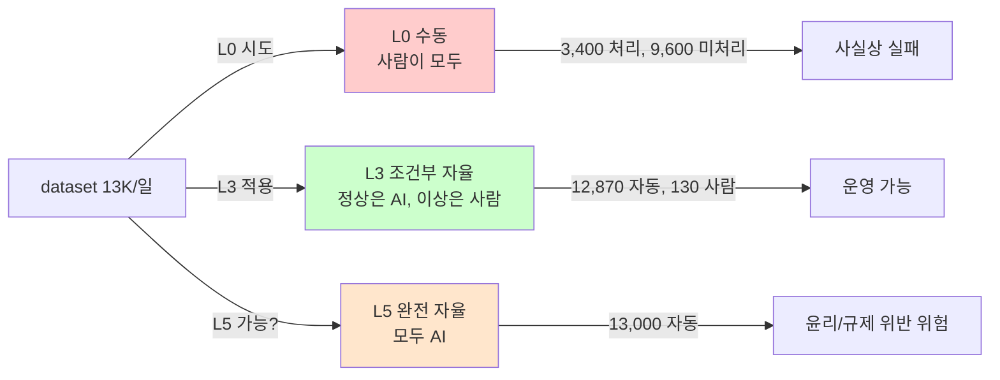

# Week 01: 자율보안시스템 개론

## 학습 목표
- 자율보안시스템의 개념과 필요성을 이해한다
- OODA Loop(관찰-판단-결정-실행)의 보안 적용 원리를 설명할 수 있다
- 자동화(Automation)와 자율(Autonomy)의 차이를 구분할 수 있다
- Bastion 플랫폼의 전체 아키텍처와 역할 분담을 파악한다
- 자율보안 성숙도 레벨(Level 0~5)을 분류하고 현재 조직 수준을 평가할 수 있다

## 실습 환경 (공통)

| 서버 | IP | 역할 | 접속 |
|------|-----|------|------|
| bastion | 10.20.30.201 | Control Plane (Bastion) | `ssh ccc@10.20.30.201` (pw: 1) |
| secu | 10.20.30.1 | 방화벽/IPS (nftables, Suricata) | `ssh ccc@10.20.30.1` |
| web | 10.20.30.80 | 웹서버 (JuiceShop:3000, Apache:80) | `ssh ccc@10.20.30.80` |
| siem | 10.20.30.100 | SIEM (Wazuh Dashboard:443, OpenCTI:8080) | `ssh ccc@10.20.30.100` |

**Bastion API:** `http://localhost:9100` / Key: `ccc-api-key-2026`

## 강의 시간 배분 (3시간)

| 시간 | 내용 | 유형 |
|------|------|------|
| 0:00-0:40 | 이론 강의 (Part 1) | 강의 |
| 0:40-1:10 | 이론 심화 + 사례 분석 (Part 2) | 강의/토론 |
| 1:10-1:20 | 휴식 | - |
| 1:20-2:00 | 실습 (Part 3) | 실습 |
| 2:00-2:40 | 심화 실습 + 도구 활용 (Part 4) | 실습 |
| 2:40-2:50 | 휴식 | - |
| 2:50-3:20 | 응용 실습 + Bastion 연동 (Part 5) | 실습 |
| 3:20-3:40 | 정리 + 과제 안내 | 정리 |

---

---

## 용어 해설 (자율보안시스템 과목)

| 용어 | 영문 | 설명 | 비유 |
|------|------|------|------|
| **자율보안시스템** | Autonomous Security System | 인간 개입 없이 스스로 위협을 탐지·대응하는 보안 체계 | 자율주행차의 보안 버전 |
| **OODA Loop** | Observe-Orient-Decide-Act | 관찰→판단→결정→실행의 의사결정 순환 | 전투기 조종사의 판단 사이클 |
| **SOAR** | Security Orchestration, Automation and Response | 보안 오케스트레이션·자동화·대응 플랫폼 | 보안팀의 자동 비서 |
| **Control Plane** | Control Plane | 시스템 전체를 관리·제어하는 중앙 계층 | 항공교통관제센터 |
| **Data Plane** | Data Plane | 실제 데이터 처리·실행이 이루어지는 계층 | 실제 비행하는 항공기 |
| **오케스트레이션** | Orchestration | 여러 서비스를 조율하여 하나의 흐름으로 실행 | 오케스트라 지휘자 |
| **에이전트** | Agent | 자율적으로 작업을 수행하는 소프트웨어 단위 | 현장에 파견된 요원 |
| **SubAgent** | SubAgent | 원격 서버에서 명령을 실행하는 하위 에이전트 | 본부 지시를 받는 현장 요원 |
| **LLM** | Large Language Model | 대규모 언어 모델 (GPT, Llama 등) | 방대한 지식을 가진 AI 두뇌 |
| **자동화** | Automation | 정해진 규칙에 따라 반복 작업을 수행 | 공장 컨베이어 벨트 |
| **자율** | Autonomy | 상황을 판단하여 스스로 결정·실행 | 자율주행차 |
| **Playbook** | Playbook | 사전 정의된 대응 절차 | 미식축구 작전판 |
| **PoW** | Proof of Work | 작업 수행을 암호학적으로 증명하는 메커니즘 | 공사 완료 확인서 |
| **강화학습** | Reinforcement Learning | 보상/벌점으로 최적 행동을 학습하는 AI 기법 | 시행착오로 배우는 아기 |
| **A2A** | Agent-to-Agent | 에이전트 간 통신 프로토콜 | 요원 간 무전기 |
| **성숙도 모델** | Maturity Model | 조직의 역량 수준을 단계별로 평가하는 프레임워크 | 게임 캐릭터 레벨 |
| **Mean Time To Respond** | MTTR | 보안 사고 탐지 후 대응 완료까지 걸리는 평균 시간 | 119 신고 후 출동 시간 |

---

## 전제 조건
- 기본적인 리눅스 명령어 사용 능력
- 네트워크 보안 기초 이해 (방화벽, IDS/IPS 개념)
- curl 명령어 사용 능력
- REST API 기본 개념

---

## 1. 자율보안시스템이란 무엇인가 (40분)

### 1.1 왜 자율보안이 필요한가

현대 IT 환경에서 보안팀이 직면하는 현실이다:

| 지표 | 수치 | 출처 |
|------|------|------|
| 하루 평균 보안 경보 수 | 11,000+ 건 | Ponemon Institute 2024 |
| 보안 인력 부족 | 전 세계 340만 명 | (ISC)2 2024 |
| 사고 평균 탐지 시간 | 204일 | IBM Cost of Data Breach 2024 |
| 사고 평균 대응 시간 | 73일 | IBM Cost of Data Breach 2024 |

**핵심 문제**: 공격은 자동화되어 초 단위로 발생하지만, 방어는 인간이 수동으로 분석·대응한다. 이 비대칭이 보안의 가장 큰 약점이다.

```
공격자 타임라인:
[스캔 0.1초] → [취약점 발견 0.5초] → [익스플로잇 2초] → [내부 확산 5분]

방어자 타임라인:
[경보 발생] → [분석관 확인 30분~24시간] → [조사 2~48시간] → [대응 1~7일]
```

### 1.2 자동화 vs 자율의 차이

이 구분이 이 과목의 핵심 개념이다:

| 구분 | 자동화 (Automation) | 자율 (Autonomy) |
|------|---------------------|-----------------|
| **의사결정** | 사람이 미리 정한 규칙 | 시스템이 상황 판단 |
| **유연성** | 정해진 시나리오만 처리 | 미지의 상황도 대응 |
| **예시** | SIEM 룰 기반 경보 | LLM이 로그 분석 후 대응 결정 |
| **비유** | 자동 문 (센서 감지→열림) | 자율주행차 (도로 상황 판단→주행) |
| **한계** | 새로운 패턴 대응 불가 | 오판 위험, 통제 필요 |

```
자동화 수준 스펙트럼:

Level 0: 수동         ─ 모든 것을 사람이 수행
Level 1: 보조         ─ 도구가 정보를 제공하고 사람이 결정
Level 2: 부분 자동화   ─ 반복 작업을 자동화, 판단은 사람
Level 3: 조건부 자율   ─ 정해진 조건에서 자율 대응, 예외는 사람
Level 4: 고도 자율     ─ 대부분 자율, 사람은 감독
Level 5: 완전 자율     ─ 사람 개입 없이 완전 자율 운영
```

**Bastion의 현재 위치**: Level 3 (조건부 자율) — risk_level에 따라 자율 실행 범위를 제한하고, critical 작업은 인간 승인을 요구한다.

### 1.3 OODA Loop와 보안

OODA Loop는 미 공군 전략가 존 보이드(John Boyd)가 만든 의사결정 프레임워크이다.

```
  Observe  | ← 로그/경보 수집
  (관찰)
↓
  Orient  | ← 위협 분석/분류
  (판단)
↓
  Decide  | ← 대응 방안 선택
  (결정)
↓
  Act  | ← 차단/격리/복구 실행
  (실행)
→ (피드백) → Observe로 돌아감
```

**보안에서의 OODA Loop 매핑**:

| OODA | 보안 활동 | Bastion 매핑 |
|------|----------|--------------|
| Observe | Wazuh 경보, Suricata 로그, 접근 로그 수집 | fetch_log, query_metric |
| Orient | 위협 유형 분류, 심각도 판단, 컨텍스트 분석 | LLM 분석 (analyze) |
| Decide | 차단/격리/패치 중 최적 대응 선택 | Master의 plan 단계 |
| Act | 방화벽 룰 추가, 서비스 재시작, 패치 적용 | execute-plan, dispatch |

**핵심 원리**: OODA Loop를 빠르게 순환하는 쪽이 이긴다. 자율보안시스템은 이 순환을 기계 속도로 실행한다.

### 1.4 자율보안 성숙도 모델

조직의 자율보안 역량을 5단계로 평가한다:

| 레벨 | 이름 | 특징 | MTTR |
|------|------|------|------|
| L0 | 수동 대응 | Excel로 사고 관리, 수동 분석 | 수일~수주 |
| L1 | 도구 기반 | SIEM 도입, 경보 대시보드 | 수시간~수일 |
| L2 | 규칙 자동화 | Playbook 자동 실행, 알려진 패턴 자동 차단 | 분~시간 |
| L3 | 조건부 자율 | AI가 분석·제안, 사람이 승인 후 실행 | 분 단위 |
| L4 | 고도 자율 | AI가 대부분 자율 대응, 사후 감사 | 초~분 |
| L5 | 완전 자율 | 인간 개입 없이 탐지-대응-학습 순환 | 초 단위 |

---

## 2. Bastion 아키텍처 이해 (30분)

### 2.1 계층 구조

Bastion는 3계층(Master → Manager → SubAgent) 아키텍처를 사용한다.

```
External Master (Claude Code)
  또는 Native Master (Ollama LLM)
  역할: 계획 수립, API 호출, 결과 해석, 완료보고
  REST API (:8000)
↓
  Manager API (:8000)
  역할: 상태 관리, evidence 기록, 실행 제어
  DB: PostgreSQL (프로젝트, Playbook, PoW, RL)
  A2A Protocol (:8002)
↓

  secu  |  |web  |  |siem  |  |dgx
  :8002 |  |:8002 |  |:8002 |  |:8002
각 서버에 SubAgent가 배치되어 명령을 실행
```

### 2.2 주요 구성 요소

| 구성 요소 | 포트 | 역할 |
|----------|------|------|
| Manager API | 8000 | 프로젝트 관리, Playbook, PoW, RL, 인증 |
| Master Service | 8001 | Native LLM 기반 자율 계획 수립 |
| SubAgent Runtime | 8002 | 각 서버에서 명령 실행, 결과 반환 |
| PostgreSQL | 5432 | 프로젝트, evidence, PoW 블록 저장 |
| Ollama | 11434 | LLM 추론 (gemma3, llama3) |

### 2.3 두 가지 운용 모드

| 모드 | Master | 특징 |
|------|--------|------|
| Mode A (Native) | Ollama LLM이 자율 계획 | 완전 자동, 비용 절약 |
| Mode B (External) | Claude Code가 오케스트레이션 | 높은 정확도, 인간 감독 가능 |

### 2.4 핵심 흐름: 프로젝트 생명주기

```
created → planning → executing → validating → reporting → closed
   │         │          │           │            │          │
   └─ 생성   └─ 계획    └─ 실행     └─ 검증      └─ 보고    └─ 종료
```

---

## 3. Bastion 환경 탐색 실습 (40분)

### 3.1 환경 접속 및 확인

```bash
# bastion 서버에 접속
ssh ccc@10.20.30.201
```

> **실습 목적**: 자율보안시스템의 핵심인 Bastion API가 정상 동작하는지 확인하는 것은, 자율 보안 운영의 첫 단계이다.
>
> **배우는 것**: REST API 헬스체크 패턴을 이해하고, Bastion의 Manager-SubAgent 계층 구조가 실제로 어떻게 동작하는지 확인한다.
>
> **결과 해석**: `{"status":"ok"}`가 반환되면 Manager API 정상이다. 연결 거부(Connection refused)는 서비스 미기동, 401은 인증키 오류를 의미한다.
>
> **실전 활용**: 자율보안 플랫폼 운영 시 API 헬스체크는 모니터링의 기본이며, 장애 시 자동 대응이 중단되므로 최우선 점검 대상이다.

```bash
# Bastion API 상태 확인
curl -s http://localhost:9100/health | python3 -m json.tool
# 예상: {"status":"ok"} 또는 서비스 상태 정보 출력
```

```bash
# API 인증 키 설정 (이후 모든 명령에서 사용)
export BASTION_API_KEY=ccc-api-key-2026
# 환경변수 확인
echo $BASTION_API_KEY
```

### 3.2 Manager API 기본 조회

```bash
# 기존 프로젝트 목록 조회
curl -s -H "X-API-Key: $BASTION_API_KEY" \
  http://localhost:9100/projects | python3 -m json.tool
# 프로젝트 ID, 이름, 상태, 생성일 등이 출력된다
```

```bash
# SubAgent 상태 확인 (secu 서버)
curl -s http://10.20.30.1:8002/health
# 예상: SubAgent의 상태 정보 반환
```

```bash
# SubAgent 상태 확인 (web 서버)
curl -s http://10.20.30.80:8002/health
# 예상: SubAgent의 상태 정보 반환
```

```bash
# SubAgent 상태 확인 (siem 서버)
curl -s http://10.20.30.100:8002/health
# 예상: SubAgent의 상태 정보 반환
```

### 3.3 첫 번째 프로젝트 생성

```bash
# 프로젝트 생성 (external 모드: Claude Code가 오케스트레이션)
curl -s -X POST http://localhost:9100/projects \
  -H "Content-Type: application/json" \
  -H "X-API-Key: $BASTION_API_KEY" \
  -d '{
    "name": "week01-hello-bastion",
    "request_text": "자율보안시스템 첫 실습: 전체 서버 상태 확인",
    "master_mode": "external"
  }' | python3 -m json.tool
# 반환된 JSON에서 "id" 값을 메모한다 (이후 PROJECT_ID로 사용)
```

```bash
# 반환된 프로젝트 ID를 변수에 저장 (예: 실제 ID로 교체)
export PROJECT_ID="반환된-프로젝트-ID"
```

### 3.4 Stage 전환

```bash
# plan 단계로 전환
curl -s -X POST http://localhost:9100/projects/$PROJECT_ID/plan \
  -H "X-API-Key: $BASTION_API_KEY" | python3 -m json.tool
# stage가 "planning"으로 변경됨을 확인
```

```bash
# execute 단계로 전환
curl -s -X POST http://localhost:9100/projects/$PROJECT_ID/execute \
  -H "X-API-Key: $BASTION_API_KEY" | python3 -m json.tool
# stage가 "executing"으로 변경됨을 확인
```

---

## 4. 첫 번째 자율 실행: 서버 상태 점검 (40분)

### 4.1 execute-plan으로 병렬 명령 실행

execute-plan은 여러 서버에 동시에 명령을 보내는 Bastion의 핵심 기능이다.

```bash
# 4대 서버에 동시에 hostname + uptime 확인 명령 실행
curl -s -X POST http://localhost:9100/projects/$PROJECT_ID/execute-plan \
  -H "Content-Type: application/json" \
  -H "X-API-Key: $BASTION_API_KEY" \
  -d '{
    "tasks": [
      {
        "order": 1,
        "instruction_prompt": "hostname && uptime && cat /etc/os-release | head -3",
        "risk_level": "low",
        "subagent_url": "http://10.20.30.201:8002"
      },
      {
        "order": 2,
        "instruction_prompt": "hostname && uptime && cat /etc/os-release | head -3",
        "risk_level": "low",
        "subagent_url": "http://10.20.30.1:8002"
      },
      {
        "order": 3,
        "instruction_prompt": "hostname && uptime && cat /etc/os-release | head -3",
        "risk_level": "low",
        "subagent_url": "http://10.20.30.80:8002"
      },
      {
        "order": 4,
        "instruction_prompt": "hostname && uptime && cat /etc/os-release | head -3",
        "risk_level": "low",
        "subagent_url": "http://10.20.30.100:8002"
      }
    ],
    "subagent_url": "http://localhost:8002"
  }' | python3 -m json.tool
# 4개 서버의 hostname, uptime, OS 정보가 한 번에 반환된다
```

### 4.2 Evidence 확인

```bash
# 실행 결과 evidence 요약 조회
curl -s -H "X-API-Key: $BASTION_API_KEY" \
  http://localhost:9100/projects/$PROJECT_ID/evidence/summary \
  | python3 -m json.tool
# 각 task의 실행 결과(stdout, exit_code)가 기록되어 있다
```

### 4.3 dispatch로 단일 명령 실행

```bash
# secu 서버에 단일 명령 전송: 방화벽 규칙 확인
curl -s -X POST http://localhost:9100/projects/$PROJECT_ID/dispatch \
  -H "Content-Type: application/json" \
  -H "X-API-Key: $BASTION_API_KEY" \
  -d '{
    "command": "sudo nft list ruleset | head -30",
    "subagent_url": "http://10.20.30.1:8002"
  }' | python3 -m json.tool
# secu 서버의 nftables 방화벽 규칙 상위 30줄이 출력된다
```

```bash
# web 서버에 단일 명령 전송: 웹 서비스 상태 확인
curl -s -X POST http://localhost:9100/projects/$PROJECT_ID/dispatch \
  -H "Content-Type: application/json" \
  -H "X-API-Key: $BASTION_API_KEY" \
  -d '{
    "command": "curl -s -o /dev/null -w \"%{http_code}\" http://localhost:3000",
    "subagent_url": "http://10.20.30.80:8002"
  }' | python3 -m json.tool
# JuiceShop 웹서버의 HTTP 응답 코드가 반환된다 (200이면 정상)
```

### 4.4 사람 vs Bastion 비교

**수동 점검 (전통적 방법)**:
```bash
# 서버 1번 접속하여 확인
ssh ccc@10.20.30.1 "hostname && uptime"
# 서버 2번 접속하여 확인
ssh ccc@10.20.30.80 "hostname && uptime"
# 서버 3번 접속하여 확인
ssh ccc@10.20.30.100 "hostname && uptime"
# 각 서버에 개별 접속 → 순차 실행 → 결과 수동 취합
```

**Bastion 자율 점검**: API 한 번 호출로 4대 서버 동시 점검, evidence 자동 기록, PoW 블록 자동 생성.

| 비교 항목 | 수동 | Bastion |
|----------|------|---------|
| 소요 시간 | 5~10분 | 3초 |
| 결과 기록 | 수동 복사 | 자동 evidence |
| 병렬 실행 | 불가 (터미널 여러 개) | 자동 병렬 |
| 감사 추적 | 없음 | PoW 블록체인 |
| 재현성 | 명령어 기억에 의존 | API 호출 그대로 재실행 |

---

## 5. 완료 보고서와 PoW 확인 (30분)

### 5.1 프로젝트 완료 보고서 생성

```bash
# 완료 보고서 작성
curl -s -X POST http://localhost:9100/projects/$PROJECT_ID/completion-report \
  -H "Content-Type: application/json" \
  -H "X-API-Key: $BASTION_API_KEY" \
  -d '{
    "summary": "Week01 자율보안 실습: 전체 서버 상태 점검 완료",
    "outcome": "success",
    "work_details": [
      "4대 서버 hostname/uptime 병렬 확인",
      "secu 방화벽 규칙 조회",
      "web JuiceShop 서비스 상태 확인",
      "evidence 기록 및 PoW 블록 생성 확인"
    ]
  }' | python3 -m json.tool
# 프로젝트가 closed 상태로 전환되고 보고서가 저장된다
```

### 5.2 PoW 블록 확인

```bash
# 생성된 PoW 블록 조회
curl -s -H "X-API-Key: $BASTION_API_KEY" \
  "http://localhost:9100/pow/blocks?project_id=$PROJECT_ID" \
  | python3 -m json.tool
# block_hash, prev_hash, nonce, task 정보 등이 포함된 블록 목록 출력
```

```bash
# PoW 체인 무결성 검증
curl -s -H "X-API-Key: $BASTION_API_KEY" \
  "http://localhost:9100/pow/verify" \
  | python3 -m json.tool
# 정상: {"valid": true, "blocks": N, "orphans": 0, "tampered": []}
```

### 5.3 프로젝트 Replay

```bash
# 전체 작업 이력을 시간순으로 재생
curl -s -H "X-API-Key: $BASTION_API_KEY" \
  http://localhost:9100/projects/$PROJECT_ID/replay \
  | python3 -m json.tool
# 프로젝트의 전체 생명주기(생성→계획→실행→검증→보고)가 기록되어 있다
```

---

## 6. 복습 퀴즈 + 과제 안내 (20분)

### 토론 주제

1. **자율보안의 윤리**: AI가 방화벽 룰을 자동으로 추가하여 정상 트래픽을 차단했다면, 책임은 누구에게 있는가?
2. **비용 대비 효과**: 자율보안 도입 시 초기 투자 대비 장기적 ROI를 어떻게 정당화할 수 있는가?
3. **인간의 역할 변화**: 자율보안 환경에서 보안 분석관의 역할은 어떻게 바뀌는가?

---

## 과제

### 과제 1: OODA Loop 매핑 (필수)
자신이 경험하거나 알고 있는 보안 사고 1건을 선정하여 OODA Loop 4단계에 매핑하고, 각 단계에서 자율보안시스템이 어떻게 시간을 단축할 수 있는지 분석하라.

### 과제 2: 성숙도 평가 (필수)
가상의 기업(직원 200명, 보안팀 3명, SIEM 도입 완료, Playbook 미도입)의 자율보안 성숙도 레벨을 평가하고, 다음 레벨로 올리기 위한 3가지 방안을 제시하라.

### 과제 3: Bastion 프로젝트 생성 (선택)
본인이 원하는 점검 시나리오(디스크 사용량 확인, 서비스 상태 확인 등)를 설계하고, Bastion API를 사용하여 프로젝트 생성→실행→보고까지 완료하라. evidence 요약 결과를 제출한다.

---

## 검증 체크리스트

실습 완료 후 다음 항목을 스스로 확인한다:

- [ ] 자율보안시스템의 정의를 한 문장으로 설명할 수 있는가?
- [ ] OODA Loop의 4단계와 보안 활동 매핑을 말할 수 있는가?
- [ ] 자동화와 자율의 차이를 3가지 이상 구분할 수 있는가?
- [ ] Bastion의 3계층(Master-Manager-SubAgent) 역할을 설명할 수 있는가?
- [ ] Bastion API에 인증 키를 포함하여 호출할 수 있는가?
- [ ] execute-plan으로 여러 서버에 동시 명령을 보낼 수 있는가?
- [ ] evidence 요약과 PoW 블록을 조회할 수 있는가?
- [ ] 자율보안 성숙도 레벨 5단계를 설명할 수 있는가?

---

## 다음 주 예고

**Week 02: LLM 에이전트 기초**
- Ollama 환경에서 LLM 직접 호출
- 보안 분석용 프롬프트 엔지니어링
- Tool Calling 개념과 Bastion 연동
- 보안 로그를 LLM에게 분석시키는 실습

---
---

---

## 📂 실습 참조 파일 가이드

> 이번 주 실습에서 **실제로 조작하는** 솔루션의 기능·경로·파일·설정·UI 요점입니다.

### CCC Bastion Agent
> **역할:** CCC 자율 운영 에이전트 — 스킬/플레이북/경험 학습  
> **실행 위치:** `bastion (10.20.30.201)`  
> **접속/호출:** TUI `./dev.sh bastion`, API `http://10.20.30.200:11434`

**주요 경로·파일**

| 경로 | 역할 |
|------|------|
| `packages/bastion/agent.py` | 메인 에이전트 루프 |
| `packages/bastion/skills.py` | 스킬 정의 |
| `packages/bastion/playbooks/` | 정적 플레이북 YAML |
| `data/bastion/experience/` | 수집된 경험 (pass/fail) |

**핵심 설정·키**

- `LLM_BASE_URL / LLM_MODEL` — Ollama 연결
- `CCC_API_KEY` — ccc-api 인증
- `max_retry=2` — 실패 시 self-correction 재시도

**로그·확인 명령**

- ``docs/test-status.md`` — 현재 테스트 진척 요약
- ``bastion_test_progress.json`` — 스텝별 pass/fail 원시

**UI / CLI 요점**

- 대화형 TUI 프롬프트 — 자연어 지시 → 계획 → 실행 → 검증
- `/a2a/mission` (API) — 자율 미션 실행
- Experience→Playbook 승격 — 반복 성공 패턴 저장

> **해석 팁.** 실패 시 output을 분석해 **근본 원인 교정**이 설계의 핵심. 증상 회피/땜빵은 금지.

---

## 실제 사례 (WitFoo Precinct 6 — 자율보안시스템 개론)

> 출처: WitFoo Precinct 6 Cybersecurity Dataset (Apache 2.0, 2.07M signals)
> 본 lecture *자율보안 시스템의 정의와 인간 운영자와의 관계* 학습 항목 매칭.

### "자율" 의 의미 — 사람의 어디까지가 줄어드는가

자율보안시스템은 *AI 가 사람을 대체* 하는 시스템이 아니다. dataset 의 일일 13K 신호를 가지고 보면 — 사람 분석가 1명이 일일 *3,400건* 처리한다 가정해도 매일 *9,600건이 미처리* 된다. 즉 사람만으로는 *원래부터 불가능* 했던 작업을 자율 시스템이 메우는 것.

자율의 5단계 — (Level 0) 완전 수동, (Level 1) 도구 보조, (Level 2) 부분 자동화, (Level 3) 조건부 자율, (Level 4) 고도 자율, (Level 5) 완전 자율. dataset 환경에서 운영 가능한 수준은 *Level 3-4* — 정상 패턴은 자동 처리, 이상 패턴은 사람 검토.



**그림 해석**: dataset 양에서 *L0 은 실패, L5 는 위험, L3 가 균형*. 자율은 *모든 작업의 자동화* 가 아니라 *처리 가능한 양으로의 압축*.

### Case 1: dataset 일일 처리량 vs 자율 수준 매핑

| 자율 수준 | 처리 자동화율 | 일일 사람 검토 | 운영 적합성 |
|---|---|---|---|
| L0 (수동) | 0% | 13,000건 (불가능) | 실패 |
| L1 (도구 보조) | 30% | 9,100건 | 실패 |
| L2 (부분 자동) | 80% | 2,600건 | 부분 가능 |
| L3 (조건부) | 99% | 130건 | 운영 가능 |
| L4 (고도) | 99.5% | 65건 | 최적 |
| L5 (완전) | 100% | 0건 | 위험 |

**자세한 해석**:

L3 와 L4 의 차이는 — *0.5% 의 차이가 사람 부담을 절반으로* 줄인다. 130건 vs 65건. 그런데 0.5% 의 정확도 향상은 *기술적으로 매우 어렵다* — 모델 크기 2배, 비용 2배 등이 필요할 수 있다.

학생이 알아야 할 것은 — **자율 수준의 선택은 *기술 가능성 + 비용 + 리스크* 의 trade-off**. L4 가 좋아 보이지만 *비용이 L3 의 3배* 면 — L3 가 ROI 측면에서 더 합리.

### Case 2: dataset 의 실제 운영 자율 수준 측정 — KPI

| KPI | 측정 방법 | 자율 L3 임계 |
|---|---|---|
| 자동 처리율 | 13K 중 자동 분류된 비율 | ≥99% |
| 사람 검토율 | 사람이 봐야 하는 비율 | ≤1% |
| 잘못된 자동 결정 | 사람 검토에서 뒤집어진 비율 | ≤2% |
| 응답 시간 | 신호 → 결정의 평균 | ≤5분 |

**자세한 해석**:

L3 운영의 KPI 는 *4가지 동시 만족* 이 필요. 자동 처리율만 높으면 잘못된 결정도 많을 수 있고, 응답 시간만 빠르면 정확도 떨어질 수 있다. 4 KPI 의 균형이 *운영 안정성*.

### 이 사례에서 학생이 배워야 할 3가지

1. **자율 = 사람 대체 X, 처리량 압축 O** — dataset 양이 자율의 동기.
2. **L3 가 운영 균형점** — L0 실패, L5 위험.
3. **4 KPI 동시 만족** — 자동률 + 사람 검토율 + 정확도 + 속도.

**학생 액션**: dataset 의 일일 13K 신호 환경에서, 본인이 만든 시스템의 자율 수준 (L0~L5) 을 측정. 4 KPI 모두 표로 정리.


---

## 부록: 학습 OSS 도구 매트릭스 (Course9 Autonomous Security — Week 01 강화학습 기초)

### lab step → 도구 매핑

| step | 학습 항목 | OSS 도구 | 도구 출력 예 |
|------|----------|---------|--------------|
| s1 | RL 환경 정의 (보안 시나리오) | **Gymnasium** (구 OpenAI Gym) | env.observation_space, env.action_space |
| s2 | DQN baseline | **stable-baselines3** | training rewards 곡선 |
| s3 | PPO 학습 | stable-baselines3 PPO | mean reward / episode length |
| s4 | Reward shaping | 자체 step function | 보안 metric 기반 reward |
| s5 | 다중 환경 vec | sb3 SubprocVecEnv | parallel rollout |
| s6 | TensorBoard 추적 | tensorboard | learning curves |
| s7 | 모델 저장/로드 | sb3 save/load | model.zip |
| s8 | RLlib (Ray) 비교 | **Ray RLlib** | distributed training |

### 학생 환경 준비

```bash
ssh ccc@192.168.0.112
python3 -m venv ~/.venv-autosec && source ~/.venv-autosec/bin/activate
pip install --upgrade pip

# 1) Gymnasium (RL 환경 표준)
pip install gymnasium[classic-control,box2d,atari]

# 2) stable-baselines3 (가장 표준)
pip install stable-baselines3[extra]

# 3) Ray RLlib (distributed RL)
pip install "ray[rllib]"

# 4) CleanRL (single-file 구현, 학습용)
git clone https://github.com/vwxyzjn/cleanrl ~/cleanrl

# 5) PettingZoo (multi-agent RL)
pip install pettingzoo[classic]

# 6) TensorBoard
pip install tensorboard
```

### 핵심 — 보안 RL 환경 자체 구현

```python
import gymnasium as gym
from gymnasium import spaces
import numpy as np

class SecurityEnv(gym.Env):
    """
    보안 운영 RL 환경:
    - State: 현재 alert 수, 활성 connection, CPU, ...
    - Action: [no-op, block-IP, escalate, allow]
    - Reward: blocked attack +10 / FP -5 / missed attack -20
    """
    def __init__(self):
        super().__init__()
        # 8-dim observation
        self.observation_space = spaces.Box(low=0, high=1, shape=(8,), dtype=np.float32)
        # 4 discrete actions
        self.action_space = spaces.Discrete(4)
        
    def reset(self, seed=None):
        super().reset(seed=seed)
        self.state = self._get_state_from_wazuh()
        return self.state, {}
    
    def step(self, action):
        # Action 실행
        if action == 1:    # block-IP
            self._call_wazuh_ar("block")
        elif action == 2:  # escalate
            self._call_thehive_create_case()
        elif action == 3:  # allow
            pass
        
        # 다음 state 가져오기
        self.state = self._get_state_from_wazuh()
        
        # Reward 계산
        reward = self._compute_reward(action)
        
        # 종료 조건
        terminated = self._is_attack_blocked()
        truncated = False
        info = {}
        return self.state, reward, terminated, truncated, info
    
    def _get_state_from_wazuh(self):
        import requests
        r = requests.get("http://wazuh-api/alerts/recent", auth=("user", "pass"))
        # 8 features 정규화
        return np.array([...], dtype=np.float32)
    
    def _compute_reward(self, action):
        # blocked attack +10, FP -5, missed -20
        return ...
```

### Stable-Baselines3 학습

```python
from stable_baselines3 import PPO, DQN
from stable_baselines3.common.vec_env import SubprocVecEnv
from stable_baselines3.common.callbacks import EvalCallback

# 1) 환경 (병렬 8개)
def make_env(rank):
    def _init():
        return SecurityEnv()
    return _init

vec_env = SubprocVecEnv([make_env(i) for i in range(8)])

# 2) PPO 모델
model = PPO(
    "MlpPolicy",
    vec_env,
    learning_rate=3e-4,
    n_steps=2048,
    batch_size=64,
    n_epochs=10,
    gamma=0.99,
    verbose=1,
    tensorboard_log="/tmp/ppo_security_tb/"
)

# 3) Eval callback (주기적 평가)
eval_env = SecurityEnv()
eval_callback = EvalCallback(
    eval_env,
    best_model_save_path="/tmp/best_model/",
    log_path="/tmp/eval_logs/",
    eval_freq=1000,
    deterministic=True
)

# 4) 학습
model.learn(total_timesteps=100_000, callback=eval_callback)

# 5) 저장
model.save("/tmp/security_ppo")

# 6) TensorBoard 시각화
# tensorboard --logdir /tmp/ppo_security_tb/
```

### Ray RLlib (distributed)

```python
import ray
from ray.rllib.algorithms.ppo import PPOConfig

ray.init()

config = (
    PPOConfig()
    .environment(SecurityEnv)
    .framework("torch")
    .resources(num_gpus=0)
    .rollouts(num_rollout_workers=4)
    .training(
        gamma=0.99,
        lr=3e-4,
        num_sgd_iter=10
    )
)

algo = config.build()
for i in range(100):
    result = algo.train()
    print(f"Iter {i}: reward={result['episode_reward_mean']:.2f}")
```

### CleanRL (single-file 학습용 — 교육 목적)

```bash
# CleanRL 의 PPO single-file 구현
python3 ~/cleanrl/cleanrl/ppo.py \
    --env-id SecurityEnv-v0 \
    --total-timesteps 100000 \
    --learning-rate 3e-4

# Wandb 통합 (실험 추적)
python3 ~/cleanrl/cleanrl/ppo.py --track --wandb-project-name autosec
```

### 보안 RL 시나리오 카탈로그

| 시나리오 | State | Action | Reward |
|---------|-------|--------|--------|
| 자동 차단 | alert/conn 패턴 | block/allow | TP+10, FP-5, FN-20 |
| 룰 자동 생성 | log pattern | new rule / no-op | detected attacks - FP |
| Patch 우선순위 | CVE list + criticality | patch order | exploit prevented |
| Honeypot 동적 | 공격자 행동 | 페이지 변경 / 차단 | 시간 지연 + 정보 수집 |
| Phishing detection | URL + email features | block / quarantine / allow | TP - FP cost |

학생은 본 1주차에서 **Gymnasium + stable-baselines3 + Ray RLlib + CleanRL + TensorBoard** 5 도구로 보안 운영의 4 단계 RL 사이클 (환경 정의 → 학습 → 추적 → 배포) 을 OSS 만으로 익힌다.
