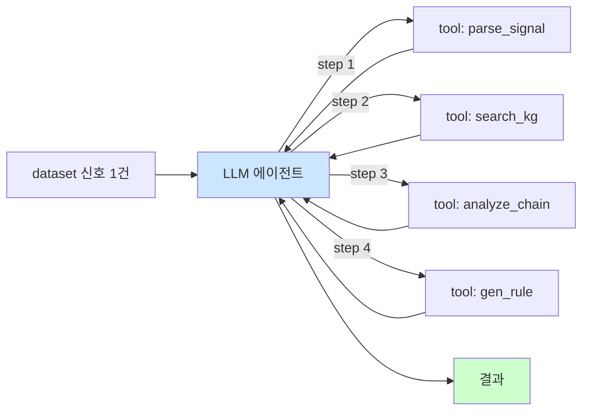

# Week 02: LLM 에이전트 기초

## 학습 목표
- Ollama를 활용하여 로컬 LLM을 직접 호출할 수 있다
- 보안 분석에 효과적인 프롬프트 엔지니어링 기법을 적용할 수 있다
- Tool Calling의 개념과 보안 자동화에서의 역할을 이해한다
- LLM에게 보안 로그를 분석시키고 결과를 해석할 수 있다
- Bastion의 A2A 프로토콜을 통한 LLM 연동 방식을 파악한다

## 실습 환경 (공통)

| 서버 | IP | 역할 | 접속 |
|------|-----|------|------|
| bastion | 10.20.30.201 | Control Plane (Bastion) | `ssh ccc@10.20.30.201` (pw: 1) |
| secu | 10.20.30.1 | 방화벽/IPS (nftables, Suricata) | `ssh ccc@10.20.30.1` |
| web | 10.20.30.80 | 웹서버 (JuiceShop:3000, Apache:80) | `ssh ccc@10.20.30.80` |
| siem | 10.20.30.100 | SIEM (Wazuh Dashboard:443, OpenCTI:8080) | `ssh ccc@10.20.30.100` |

**Bastion API:** `http://localhost:9100` / Key: `ccc-api-key-2026`

## 강의 시간 배분 (3시간)

| 시간 | 내용 | 유형 |
|------|------|------|
| 0:00-0:40 | 이론 강의 (Part 1) | 강의 |
| 0:40-1:10 | 이론 심화 + 사례 분석 (Part 2) | 강의/토론 |
| 1:10-1:20 | 휴식 | - |
| 1:20-2:00 | 실습 (Part 3) | 실습 |
| 2:00-2:40 | 심화 실습 + 도구 활용 (Part 4) | 실습 |
| 2:40-2:50 | 휴식 | - |
| 2:50-3:20 | 응용 실습 + Bastion 연동 (Part 5) | 실습 |
| 3:20-3:40 | 정리 + 과제 안내 | 정리 |

---

---

## 용어 해설 (자율보안시스템 과목)

| 용어 | 영문 | 설명 | 비유 |
|------|------|------|------|
| **LLM** | Large Language Model | 대규모 언어 모델 (GPT, Llama, Gemma 등) | 방대한 지식을 가진 AI 두뇌 |
| **Ollama** | Ollama | 로컬 환경에서 LLM을 쉽게 실행하는 런타임 | LLM 전용 Docker |
| **프롬프트** | Prompt | LLM에게 전달하는 입력 텍스트 | AI에게 주는 질문지 |
| **시스템 프롬프트** | System Prompt | LLM의 역할·규칙을 설정하는 초기 지시 | AI의 직무 기술서 |
| **프롬프트 엔지니어링** | Prompt Engineering | 최적의 결과를 얻기 위해 프롬프트를 설계하는 기법 | AI를 잘 다루는 질문 기술 |
| **Few-shot** | Few-shot Learning | 몇 가지 예시를 제시하여 패턴을 학습시키는 기법 | 예제를 보여주고 따라하게 하기 |
| **Zero-shot** | Zero-shot | 예시 없이 지시만으로 작업을 수행 | 설명만 듣고 바로 해보기 |
| **Chain-of-Thought** | Chain-of-Thought (CoT) | 단계별 추론 과정을 명시하는 프롬프트 기법 | "풀이 과정을 보여줘" |
| **Tool Calling** | Tool Calling / Function Calling | LLM이 외부 도구·함수를 호출하는 기능 | AI가 계산기나 검색엔진을 직접 사용 |
| **A2A** | Agent-to-Agent Protocol | 에이전트 간 표준 통신 프로토콜 | 무전기 프로토콜 |
| **Temperature** | Temperature | LLM 출력의 무작위성을 제어하는 파라미터 | 창의성 다이얼 (낮으면 정확, 높으면 창의적) |
| **토큰** | Token | LLM이 처리하는 텍스트의 최소 단위 | 단어 조각 |
| **컨텍스트 윈도우** | Context Window | LLM이 한 번에 처리할 수 있는 토큰 수 | AI의 단기 기억 용량 |
| **환각** | Hallucination | LLM이 사실이 아닌 내용을 생성하는 현상 | AI의 거짓말 (본인은 진실이라 믿음) |
| **RAG** | Retrieval-Augmented Generation | 외부 문서를 검색하여 LLM 답변에 반영하는 기법 | 오픈북 시험 |
| **invoke_llm** | invoke_llm | Bastion SubAgent의 LLM 호출 엔드포인트 | AI에게 질문 보내기 |

---

## 전제 조건
- Week 01 완료 (Bastion API 호출 경험)
- curl 명령어 능숙
- JSON 포맷 기본 이해

---

## 1. LLM의 보안 활용 개요 (40분)

### 1.1 LLM이 보안에서 할 수 있는 일

| 영역 | 활용 | 예시 |
|------|------|------|
| 로그 분석 | 대량 로그에서 이상 패턴 탐지 | "이 auth.log에서 brute force 패턴을 찾아줘" |
| 위협 분류 | 경보를 심각도별로 분류 | "이 Suricata 경보는 진짜 공격인가, 오탐인가?" |
| 대응 제안 | 탐지된 위협에 대한 대응 방안 제시 | "SQL Injection 공격 탐지 시 권장 대응은?" |
| 보고서 생성 | 사고 대응 보고서 자동 작성 | evidence 데이터 기반 보고서 생성 |
| 코드 리뷰 | 보안 취약점이 있는 코드 식별 | "이 PHP 코드에 SQL Injection 취약점이 있는가?" |

### 1.2 Ollama 개요

Ollama는 로컬 환경에서 오픈소스 LLM을 실행하는 런타임이다.

```
  192.168.0.105
  |  Ollama (:11434)  |
  |  | gemma3  |  | llama3.1  |  |
  |  |  :12b  |  |  :8b  |  |
  GPU: NVIDIA DGX Spark
```

**왜 로컬 LLM인가?**
- 민감한 보안 데이터(로그, 경보)를 외부 클라우드로 전송하지 않는다
- 인터넷 연결 없이도 동작한다 (에어갭 환경)
- 비용이 들지 않는다 (API 호출 비용 없음)
- 응답 지연이 낮다 (네트워크 왕복 없음)

### 1.3 프롬프트 엔지니어링 기법

보안 분석에 효과적인 프롬프트 패턴:

| 기법 | 설명 | 보안 적용 예 |
|------|------|-------------|
| **역할 부여** | LLM에게 전문가 역할을 지정 | "당신은 SOC Tier-2 분석관입니다" |
| **구조화 출력** | JSON, 표 등 형식을 지정 | "결과를 JSON으로 출력하라: {severity, description, action}" |
| **Chain-of-Thought** | 단계별 추론 요구 | "단계별로 분석하라: 1.공격유형 2.심각도 3.대응" |
| **Few-shot** | 분석 예시를 먼저 제시 | 정상 로그와 공격 로그의 분석 예시 제공 |
| **제약 조건** | 출력 범위를 제한 | "답변은 한국어로, 200자 이내로" |

### 1.4 Tool Calling 개념

Tool Calling은 LLM이 자체적으로 답할 수 없는 질문에 대해 외부 도구를 호출하는 메커니즘이다.

```
사용자: "secu 서버의 방화벽 규칙을 보여줘"
↓
  LLM
  "방화벽 규칙을 확인하려면
  run_command 도구를 호출해야
  합니다"
  → Tool Call:
  run_command({
  "command": "nft list",
  "server": "secu"
  })
↓ (Bastion가 실행)
  SubAgent (secu:8002)
  $ nft list ruleset
  → 결과 반환
↓ (결과를 LLM에게 전달)
  LLM
  "현재 방화벽 규칙은 ...
  SSH(22), HTTP(80), HTTPS
  (443)이 허용되어 있습니다"
```

**Bastion에 등록된 Tool 목록**:
- `run_command`: 서버에서 셸 명령 실행
- `fetch_log`: 로그 파일 내용 가져오기
- `query_metric`: 시스템 메트릭 조회
- `read_file`: 파일 내용 읽기
- `write_file`: 파일 작성
- `restart_service`: 서비스 재시작

---

## 2. Ollama API 직접 호출 (30분)

### 2.1 모델 목록 확인

> **실습 목적**: OODA Loop의 각 단계(관찰-판단-결정-실행)를 실제 보안 시나리오에 적용하기 위해 수행한다
>
> **배우는 것**: Wazuh 알림 수집(Observe), LLM 분석(Orient), 대응 결정(Decide), 명령 실행(Act)의 자동화 순환 구조를 이해한다
>
> **결과 해석**: 각 OODA 단계의 소요 시간과 정확도를 측정하여 자동화의 효과를 정량적으로 평가한다
>
> **실전 활용**: 보안 운영센터(SOC)의 대응 시간(MTTR) 단축, 보안 자동화 성숙도 향상 전략 수립에 활용한다

```bash
# bastion 서버에 접속
ssh ccc@10.20.30.201
```

```bash
# Ollama에 설치된 모델 목록 확인
curl -s http://10.20.30.200:11434/api/tags \
  | python3 -c "
import sys, json
# JSON 파싱 후 모델 목록 출력
data = json.load(sys.stdin)
for m in data.get('models', []):
    print(f\"{m['name']:30s} {m['size']//1024//1024:>6d} MB\")
"
# 설치된 모델 이름과 크기가 출력된다
```

### 2.2 기본 대화 호출

```bash
# gemma3:12b 모델에 간단한 질문
curl -s -X POST http://10.20.30.200:11434/api/chat \
  -H "Content-Type: application/json" \
  -d '{
    "model": "gemma3:12b",
    "messages": [
      {"role": "user", "content": "SQL Injection이란 무엇인가? 한국어로 3줄로 요약해줘."}
    ],
    "stream": false,
    "options": {"temperature": 0.1}
  }' | python3 -c "import sys,json; print(json.load(sys.stdin)['message']['content'])"
# 간결한 SQL Injection 설명이 출력된다
```

### 2.3 Temperature 비교 실험

```bash
# Temperature 0.0 (결정론적, 매번 같은 답)
curl -s -X POST http://10.20.30.200:11434/api/chat \
  -H "Content-Type: application/json" \
  -d '{
    "model": "gemma3:12b",
    "messages": [
      {"role": "user", "content": "보안 사고 대응 3단계를 나열하라"}
    ],
    "stream": false,
    "options": {"temperature": 0.0}
  }' | python3 -c "import sys,json; print('=== temp=0.0 ==='); print(json.load(sys.stdin)['message']['content'])"
# 동일 질문에 항상 같은 답이 나온다
```

```bash
# Temperature 1.5 (높은 무작위성, 매번 다른 답)
curl -s -X POST http://10.20.30.200:11434/api/chat \
  -H "Content-Type: application/json" \
  -d '{
    "model": "gemma3:12b",
    "messages": [
      {"role": "user", "content": "보안 사고 대응 3단계를 나열하라"}
    ],
    "stream": false,
    "options": {"temperature": 1.5}
  }' | python3 -c "import sys,json; print('=== temp=1.5 ==='); print(json.load(sys.stdin)['message']['content'])"
# 매번 다른 답이 나오고, 때로 엉뚱한 내용이 섞일 수 있다
```

**보안 분석에서의 Temperature 가이드**:

| 용도 | 권장 Temperature | 이유 |
|------|-----------------|------|
| 로그 분류/탐지 | 0.0~0.1 | 일관된 판단 필요 |
| 대응 방안 제안 | 0.3~0.5 | 약간의 다양성 허용 |
| 공격 시나리오 브레인스토밍 | 0.7~1.0 | 창의적 발상 필요 |

---

## 3. 보안 분석 프롬프트 실습 (40분)

### 3.1 역할 부여 + 구조화 출력

```bash
# SOC 분석관 역할을 부여하고 JSON 형식으로 분석 결과를 받는다
curl -s -X POST http://10.20.30.200:11434/api/chat \
  -H "Content-Type: application/json" \
  -d '{
    "model": "gemma3:12b",
    "messages": [
      {
        "role": "system",
        "content": "당신은 SOC Tier-2 보안 분석관입니다. 로그를 분석하고 결과를 반드시 다음 JSON 형식으로만 출력하세요: {\"attack_type\": \"...\", \"severity\": \"low|medium|high|critical\", \"source_ip\": \"...\", \"description\": \"...\", \"recommended_action\": \"...\"}"
      },
      {
        "role": "user",
        "content": "다음 로그를 분석하세요:\nMar 25 14:23:15 web sshd[12345]: Failed password for root from 203.0.113.42 port 54321 ssh2\nMar 25 14:23:16 web sshd[12346]: Failed password for root from 203.0.113.42 port 54322 ssh2\nMar 25 14:23:17 web sshd[12347]: Failed password for root from 203.0.113.42 port 54323 ssh2\nMar 25 14:23:18 web sshd[12348]: Failed password for root from 203.0.113.42 port 54324 ssh2\nMar 25 14:23:19 web sshd[12349]: Failed password for root from 203.0.113.42 port 54325 ssh2"
      }
    ],
    "stream": false,
    "options": {"temperature": 0.1}
  }' | python3 -c "import sys,json; print(json.load(sys.stdin)['message']['content'])"
# JSON 형식으로 SSH brute force 분석 결과가 출력된다
```

### 3.2 Chain-of-Thought 프롬프트

```bash
# 단계별 추론을 요구하는 프롬프트
curl -s -X POST http://10.20.30.200:11434/api/chat \
  -H "Content-Type: application/json" \
  -d '{
    "model": "gemma3:12b",
    "messages": [
      {
        "role": "system",
        "content": "당신은 보안 전문가입니다. 분석 시 반드시 다음 단계를 따르세요:\n1단계: 로그에서 관찰되는 사실을 나열\n2단계: 공격 유형을 추론\n3단계: 심각도를 판단하고 근거를 제시\n4단계: 즉시 대응 조치를 제안\n각 단계를 명확히 구분하여 출력하세요."
      },
      {
        "role": "user",
        "content": "분석할 로그:\n[2026-03-25 10:15:32] GET /api/users?id=1 OR 1=1-- HTTP/1.1 200\n[2026-03-25 10:15:33] GET /api/users?id=1 UNION SELECT username,password FROM users-- HTTP/1.1 200\n[2026-03-25 10:15:35] GET /api/users?id=1; DROP TABLE users-- HTTP/1.1 500"
      }
    ],
    "stream": false,
    "options": {"temperature": 0.1}
  }' | python3 -c "import sys,json; print(json.load(sys.stdin)['message']['content'])"
# 4단계로 구분된 체계적 분석 결과가 출력된다
```

### 3.3 Few-shot 프롬프트

```bash
# 분석 예시를 먼저 제시하여 출력 형식을 학습시킨다
curl -s -X POST http://10.20.30.200:11434/api/chat \
  -H "Content-Type: application/json" \
  -d '{
    "model": "gemma3:12b",
    "messages": [
      {
        "role": "system",
        "content": "보안 로그를 분석하여 위험도를 판정하세요."
      },
      {
        "role": "user",
        "content": "로그: Mar 25 09:00:01 web CRON[1234]: (root) CMD (/usr/bin/apt update)"
      },
      {
        "role": "assistant",
        "content": "판정: 정상 | 이유: 예약된 cron 작업의 정상 실행. apt 패키지 업데이트는 루틴 관리 작업."
      },
      {
        "role": "user",
        "content": "로그: Mar 25 14:23:15 web sshd[5678]: Accepted publickey for admin from 10.20.30.201 port 22"
      },
      {
        "role": "assistant",
        "content": "판정: 정상 | 이유: 내부 IP(10.20.30.201)에서 공개키 인증으로 접속. 관리 서버의 정상 접근."
      },
      {
        "role": "user",
        "content": "로그: Mar 25 22:45:03 web sshd[9999]: Failed password for invalid user postgres from 185.220.101.42 port 43210 ssh2"
      }
    ],
    "stream": false,
    "options": {"temperature": 0.1}
  }' | python3 -c "import sys,json; print(json.load(sys.stdin)['message']['content'])"
# few-shot 패턴을 학습하여 동일 형식(판정: / 이유:)으로 답변한다
```

---

## 4. Bastion A2A를 통한 LLM 호출 (40분)

### 4.1 A2A invoke_llm

Bastion의 SubAgent에는 LLM 호출 엔드포인트가 내장되어 있다.

```bash
# 환경변수 설정
export BASTION_API_KEY=ccc-api-key-2026
```

```bash
# Bastion 프로젝트 생성 (LLM 분석 실습용)
curl -s -X POST http://localhost:9100/projects \
  -H "Content-Type: application/json" \
  -H "X-API-Key: $BASTION_API_KEY" \
  -d '{
    "name": "week02-llm-analysis",
    "request_text": "LLM을 활용한 보안 로그 분석 실습",
    "master_mode": "external"
  }' | python3 -m json.tool
# 프로젝트 ID를 기록한다
```

```bash
# 프로젝트 ID 설정 (실제 반환값으로 교체)
export PROJECT_ID="반환된-프로젝트-ID"
# stage 전환: plan → execute
curl -s -X POST http://localhost:9100/projects/$PROJECT_ID/plan \
  -H "X-API-Key: $BASTION_API_KEY" > /dev/null
curl -s -X POST http://localhost:9100/projects/$PROJECT_ID/execute \
  -H "X-API-Key: $BASTION_API_KEY" > /dev/null
```

### 4.2 실제 로그 수집 후 LLM 분석

```bash
# Step 1: web 서버에서 실제 접근 로그 수집
curl -s -X POST http://localhost:9100/projects/$PROJECT_ID/dispatch \
  -H "Content-Type: application/json" \
  -H "X-API-Key: $BASTION_API_KEY" \
  -d '{
    "command": "tail -20 /var/log/auth.log 2>/dev/null || tail -20 /var/log/secure 2>/dev/null || echo no-log-found",
    "subagent_url": "http://10.20.30.80:8002"
  }' | python3 -m json.tool
# web 서버의 최근 인증 로그 20줄이 반환된다
```

```bash
# Step 2: 수집된 로그를 LLM에게 분석 요청 (execute-plan 활용)
curl -s -X POST http://localhost:9100/projects/$PROJECT_ID/execute-plan \
  -H "Content-Type: application/json" \
  -H "X-API-Key: $BASTION_API_KEY" \
  -d '{
    "tasks": [
      {
        "order": 1,
        "instruction_prompt": "tail -20 /var/log/auth.log 2>/dev/null || echo no-auth-log",
        "risk_level": "low",
        "subagent_url": "http://10.20.30.80:8002"
      },
      {
        "order": 2,
        "instruction_prompt": "tail -20 /var/log/auth.log 2>/dev/null || echo no-auth-log",
        "risk_level": "low",
        "subagent_url": "http://10.20.30.1:8002"
      },
      {
        "order": 3,
        "instruction_prompt": "tail -20 /var/log/auth.log 2>/dev/null || echo no-auth-log",
        "risk_level": "low",
        "subagent_url": "http://10.20.30.100:8002"
      }
    ],
    "subagent_url": "http://localhost:8002"
  }' | python3 -m json.tool
# 3대 서버의 인증 로그가 동시에 수집된다
```

### 4.3 모델 비교 실험

같은 로그를 서로 다른 모델에게 분석시켜 결과를 비교한다.

```bash
# gemma3:12b로 분석
curl -s -X POST http://10.20.30.200:11434/api/chat \
  -H "Content-Type: application/json" \
  -d '{
    "model": "gemma3:12b",
    "messages": [
      {"role": "system", "content": "보안 로그를 분석하고 위협 여부를 판정하라. JSON으로 출력: {\"is_threat\": true/false, \"confidence\": 0-100, \"type\": \"...\", \"action\": \"...\"}"},
      {"role": "user", "content": "Mar 25 03:14:15 secu kernel: [UFW BLOCK] IN=eth0 OUT= MAC=... SRC=45.33.32.156 DST=10.20.30.1 LEN=44 TOS=0x00 PREC=0x00 TTL=45 ID=54321 PROTO=TCP SPT=12345 DPT=445 WINDOW=1024 RES=0x00 SYN URGP=0"}
    ],
    "stream": false,
    "options": {"temperature": 0.1}
  }' | python3 -c "import sys,json; print('=== gemma3:12b ==='); print(json.load(sys.stdin)['message']['content'])"
# gemma3의 분석 결과
```

```bash
# llama3.1:8b로 같은 로그 분석
curl -s -X POST http://10.20.30.200:11434/api/chat \
  -H "Content-Type: application/json" \
  -d '{
    "model": "llama3.1:8b",
    "messages": [
      {"role": "system", "content": "보안 로그를 분석하고 위협 여부를 판정하라. JSON으로 출력: {\"is_threat\": true/false, \"confidence\": 0-100, \"type\": \"...\", \"action\": \"...\"}"},
      {"role": "user", "content": "Mar 25 03:14:15 secu kernel: [UFW BLOCK] IN=eth0 OUT= MAC=... SRC=45.33.32.156 DST=10.20.30.1 LEN=44 TOS=0x00 PREC=0x00 TTL=45 ID=54321 PROTO=TCP SPT=12345 DPT=445 WINDOW=1024 RES=0x00 SYN URGP=0"}
    ],
    "stream": false,
    "options": {"temperature": 0.1}
  }' | python3 -c "import sys,json; print('=== llama3.1:8b ==='); print(json.load(sys.stdin)['message']['content'])"
# llama3의 분석 결과 — gemma3과 비교한다
```

**비교 관점**:
| 항목 | gemma3:12b | llama3.1:8b |
|------|-----------|-------------|
| 정확도 | 모델 크기가 커서 분석이 세밀 | 빠르지만 단순한 판단 |
| 속도 | 약간 느림 | 빠름 |
| JSON 준수 | 형식을 잘 따름 | 때로 형식 이탈 |

---

## 5. Bastion에서 LLM 기반 보안 분석 워크플로우 (30분)

### 5.1 수집-분석-대응 파이프라인

```bash
# 전체 파이프라인: 로그 수집 → LLM 분석 → 결과 기록
# Step 1: siem 서버에서 Wazuh 경보 수집
curl -s -X POST http://localhost:9100/projects/$PROJECT_ID/dispatch \
  -H "Content-Type: application/json" \
  -H "X-API-Key: $BASTION_API_KEY" \
  -d '{
    "command": "cat /var/ossec/logs/alerts/alerts.json 2>/dev/null | tail -5 || echo no-wazuh-alerts",
    "subagent_url": "http://10.20.30.100:8002"
  }' | python3 -m json.tool
# Wazuh의 최근 경보 5건이 반환된다
```

### 5.2 프롬프트 템플릿 설계

보안 분석용 프롬프트 템플릿을 만들어 재사용한다:

```bash
# 보안 분석 프롬프트 템플릿 파일 생성 (bastion 서버에서)
cat << 'TEMPLATE'
당신은 Bastion SOC 분석 에이전트입니다.

## 역할
- 보안 로그와 경보를 분석합니다
- 위협 여부를 판정하고 심각도를 분류합니다
- 대응 조치를 제안합니다

## 출력 형식 (반드시 준수)
{
  "findings": [
    {
      "event": "이벤트 요약",
      "is_threat": true/false,
      "severity": "info|low|medium|high|critical",
      "attack_type": "공격 유형 또는 null",
      "confidence": 0-100,
      "evidence": "판단 근거",
      "recommended_action": "권장 조치"
    }
  ],
  "summary": "전체 요약 (1-2문장)"
}

## 분석 지침
1. IP 주소가 내부(10.x, 192.168.x)인지 외부인지 구분
2. 반복 패턴(brute force, scan)을 탐지
3. 비정상 시간대(새벽 2-5시) 접근에 주의
4. root/admin 계정 접근 시도에 높은 가중치
TEMPLATE
# 이 템플릿을 시스템 프롬프트로 사용하여 일관된 분석 결과를 얻는다
```

### 5.3 evidence 기반 분석 확인

```bash
# evidence 요약 조회 — 모든 분석 결과가 기록되어 있다
curl -s -H "X-API-Key: $BASTION_API_KEY" \
  http://localhost:9100/projects/$PROJECT_ID/evidence/summary \
  | python3 -m json.tool
# 수집된 로그와 분석 결과가 evidence로 기록되어 있다
```

```bash
# 프로젝트 완료 보고서
curl -s -X POST http://localhost:9100/projects/$PROJECT_ID/completion-report \
  -H "Content-Type: application/json" \
  -H "X-API-Key: $BASTION_API_KEY" \
  -d '{
    "summary": "Week02 LLM 보안 분석 실습 완료",
    "outcome": "success",
    "work_details": [
      "Ollama API 직접 호출로 gemma3/llama3 모델 비교",
      "프롬프트 엔지니어링 3기법(역할부여, CoT, Few-shot) 실습",
      "3대 서버 인증 로그 수집 및 LLM 분석",
      "보안 분석 프롬프트 템플릿 설계"
    ]
  }' | python3 -m json.tool
```

---

## 6. 복습 퀴즈 + 과제 안내 (20분)

### 토론 주제

1. **LLM의 신뢰성**: LLM이 "critical" 위협이라고 판정했지만 실제로는 오탐이었다면, 자동 차단을 해야 하는가?
2. **모델 선택**: 보안 분석에서 큰 모델(정확하지만 느림)과 작은 모델(빠르지만 부정확)의 적절한 사용 시나리오는?
3. **환각 문제**: LLM이 존재하지 않는 CVE를 만들어 보고서에 포함시켰다면 어떻게 검증하는가?

---

## 과제

### 과제 1: 프롬프트 비교 실험 (필수)
동일한 보안 로그(SSH brute force)를 3가지 프롬프트 기법(Zero-shot, Few-shot, Chain-of-Thought)으로 분석시키고, 결과의 정확도·형식 준수도·유용성을 비교 평가하라.

### 과제 2: 보안 분석 프롬프트 템플릿 설계 (필수)
특정 보안 시나리오(웹 공격 탐지, 내부자 위협 탐지, 악성코드 분석 중 택 1)에 최적화된 시스템 프롬프트를 설계하라. 역할 부여, 출력 형식, 분석 절차를 포함해야 한다.

### 과제 3: 모델 벤치마크 (선택)
gemma3:12b와 llama3.1:8b에 동일한 보안 로그 5건을 분석시켜 정확도, 응답 시간, JSON 형식 준수율을 비교하는 벤치마크 표를 작성하라.

---

## 검증 체크리스트

- [ ] Ollama API로 LLM을 직접 호출할 수 있는가?
- [ ] Temperature가 분석 결과에 미치는 영향을 설명할 수 있는가?
- [ ] 역할 부여, CoT, Few-shot 프롬프트 기법의 차이를 구분하는가?
- [ ] 구조화 출력(JSON)을 요구하는 프롬프트를 작성할 수 있는가?
- [ ] Tool Calling 개념과 Bastion에서의 역할을 설명할 수 있는가?
- [ ] Bastion dispatch로 로그를 수집하고 LLM에게 분석을 요청할 수 있는가?
- [ ] 서로 다른 LLM 모델의 보안 분석 결과를 비교 평가할 수 있는가?

---

## 다음 주 예고

**Week 03: Bastion 프로젝트 생명주기**
- 프로젝트 6단계(create→plan→execute→validate→report→close) 완전 실습
- Evidence 기록 체계와 감사 추적
- Stage 전환 규칙과 제약 조건
- 완료 보고서와 프로젝트 Replay

---
---

---

## 📂 실습 참조 파일 가이드

> 이번 주 실습에서 **실제로 조작하는** 솔루션의 기능·경로·파일·설정·UI 요점입니다.

### Ollama + LangChain
> **역할:** 로컬 LLM 서빙(Ollama) + 체인 오케스트레이션(LangChain)  
> **실행 위치:** `bastion (LLM 서버)`  
> **접속/호출:** `OLLAMA_HOST=http://10.20.30.201:11434`, Python `from langchain_ollama import OllamaLLM`

**주요 경로·파일**

| 경로 | 역할 |
|------|------|
| `~/.ollama/models/` | 다운로드된 모델 블롭 |
| `/etc/systemd/system/ollama.service` | 서비스 유닛 |

**핵심 설정·키**

- `OLLAMA_HOST=0.0.0.0:11434` — 외부 바인드
- `OLLAMA_KEEP_ALIVE=30m` — 모델 유휴 유지
- `LLM_MODEL=gemma3:4b (env)` — CCC 기본 모델

**로그·확인 명령**

- `journalctl -u ollama` — 서빙 로그
- `LangChain `verbose=True`` — 체인 단계 출력

**UI / CLI 요점**

- `ollama list` — 설치된 모델
- `curl -XPOST $OLLAMA_HOST/api/generate -d '{...}'` — REST 생성
- LangChain `RunnableSequence | parser` — 체인 조립 문법

> **해석 팁.** Ollama는 **첫 호출에 모델 로드**가 커서 지연이 크다. 성능 실험 시 워밍업 호출을 배제하고 측정하자.

### CCC Bastion Agent
> **역할:** CCC 자율 운영 에이전트 — 스킬/플레이북/경험 학습  
> **실행 위치:** `bastion (10.20.30.201)`  
> **접속/호출:** TUI `./dev.sh bastion`, API `http://10.20.30.200:11434`

**주요 경로·파일**

| 경로 | 역할 |
|------|------|
| `packages/bastion/agent.py` | 메인 에이전트 루프 |
| `packages/bastion/skills.py` | 스킬 정의 |
| `packages/bastion/playbooks/` | 정적 플레이북 YAML |
| `data/bastion/experience/` | 수집된 경험 (pass/fail) |

**핵심 설정·키**

- `LLM_BASE_URL / LLM_MODEL` — Ollama 연결
- `CCC_API_KEY` — ccc-api 인증
- `max_retry=2` — 실패 시 self-correction 재시도

**로그·확인 명령**

- ``docs/test-status.md`` — 현재 테스트 진척 요약
- ``bastion_test_progress.json`` — 스텝별 pass/fail 원시

**UI / CLI 요점**

- 대화형 TUI 프롬프트 — 자연어 지시 → 계획 → 실행 → 검증
- `/a2a/mission` (API) — 자율 미션 실행
- Experience→Playbook 승격 — 반복 성공 패턴 저장

> **해석 팁.** 실패 시 output을 분석해 **근본 원인 교정**이 설계의 핵심. 증상 회피/땜빵은 금지.

---

## 실제 사례 (WitFoo Precinct 6 — LLM 에이전트 기초)

> 출처: WitFoo Precinct 6 Cybersecurity Dataset (Apache 2.0)
> 본 lecture *LLM 에이전트의 기본 구조 (ReAct loop, tool use)* 학습 항목 매칭.

### LLM 에이전트가 dataset 을 어떻게 처리하는가

LLM 단독은 *질문에 1회 답변* 만 하지만, 에이전트는 *추론 → 도구 호출 → 관찰 → 다시 추론* 의 ReAct loop 를 반복한다. dataset 신호 1건 분석에 필요한 단계 — *(1) signal parse, (2) KG 에서 유사 사례 검색, (3) chain 추출, (4) 차단 룰 생성, (5) 결과 반환* — 이 5 단계를 에이전트가 *자동* 수행.



**그림 해석**: 에이전트가 *자기 스스로 단계 분해*. 사람이 5번 명령을 안 줘도 됨.

### Case 1: dataset 신호 1건의 ReAct 처리 — 정량 측정

| 단계 | LLM 호출 시간 | tool 실행 시간 |
|---|---|---|
| 1. parse_signal | 1초 | 0.1초 |
| 2. search_kg | 1초 | 0.5초 (RAG 검색) |
| 3. analyze_chain | 2초 | 0.3초 |
| 4. gen_rule | 1.5초 | 0.2초 |
| 5. 종합 응답 | 1초 | - |
| 총합 | 6.5초 | 1.1초 |

**자세한 해석**:

dataset 신호 1건 처리에 *총 ~7.6초*. 일일 13K 신호를 처리하면 — *13,000 × 7.6초 = 99K 초 = 27시간*. 단일 에이전트로는 24h 내 처리 불가능 → *병렬 에이전트 multi-instance* 필요. 4 인스턴스 병렬이면 *6.7시간* 안에 완료.

학생이 알아야 할 것은 — **에이전트의 스루풋은 *단일 인스턴스* 기준이 아닌 *병렬 가능한 만큼* 으로 측정**. 단일 인스턴스 7.6초/건이라도 *병렬 4 인스턴스 = 1.9초/건 effective* 가 된다.

### Case 2: ReAct 의 한계 — turn 수 폭증

| 시나리오 | 정상 turn 수 | 비정상 turn 수 |
|---|---|---|
| 단순 신호 분류 | ~3 turns | - |
| chain 분석 | ~5 turns | - |
| 모호한 신호 | ~5 turns | 10+ (LLM 헤맴) |
| 무한 루프 | - | 50+ (가드 필요) |

**자세한 해석**:

ReAct loop 의 위험은 *turn 수 폭증* 이다. LLM 이 모호한 신호 앞에서 *결론 못 내고 반복 호출* 하면 — 비용/시간이 폭증. 운영 가드는 *MAX_TURNS 제한 (예: 6)* 으로 강제 종료 후 사람 escalation.

### 이 사례에서 학생이 배워야 할 3가지

1. **에이전트 = ReAct loop + tool 호출** — LLM 단독과 본질 차이.
2. **단일 처리량은 병렬화로 극복** — 4 인스턴스 = 4배 스루풋.
3. **MAX_TURNS 가드 필수** — 무한 루프 방어.

**학생 액션**: lab Bastion 으로 dataset 신호 10건 처리 시 평균 turn 수 + 평균 처리 시간 측정. MAX_TURNS=6 적용 vs 미적용 비교.


---

## 부록: 학습 OSS 도구 매트릭스 (Course9 — Week 02 경험 메모리)

### lab step → 도구 매핑

| step | 학습 항목 | OSS 도구 |
|------|----------|---------|
| s1 | Vector embedding | **sentence-transformers** (HuggingFace) |
| s2 | Local vector DB | **ChromaDB** |
| s3 | 분산 vector DB | **Qdrant** / Weaviate / Milvus |
| s4 | Postgres 통합 | **pgvector** |
| s5 | Similarity search | ChromaDB query |
| s6 | Redis 통합 (캐싱) | Redis Stack vector search |
| s7 | RAG 통합 | LangChain RetrievalQA |
| s8 | Memory compaction | 자체 (cluster + summarize) |

### 학생 환경 준비

```bash
source ~/.venv-autosec/bin/activate
pip install sentence-transformers chromadb qdrant-client weaviate-client \
            pgvector psycopg redis langchain langchain-community

# Postgres + pgvector
docker run -d --name pgvector \
    -e POSTGRES_PASSWORD=secret \
    -p 5432:5432 \
    pgvector/pgvector:pg16

# Qdrant
docker run -d -p 6333:6333 qdrant/qdrant

# Redis Stack (vector search)
docker run -d -p 6379:6379 redis/redis-stack:latest

# Weaviate
docker run -d -p 8080:8080 -e DEFAULT_VECTORIZER_MODULE=none cr.weaviate.io/semitechnologies/weaviate:latest
```

### 핵심 — ChromaDB (단순/로컬)

```python
import chromadb
from sentence_transformers import SentenceTransformer

# 1) Embedding 모델 (CPU 가능)
embedder = SentenceTransformer("all-MiniLM-L6-v2")        # 384-dim, 작음
# 또는 "all-mpnet-base-v2" (768-dim, 더 정확)

# 2) Persistent ChromaDB
client = chromadb.PersistentClient(path="/var/lib/security_memory")

# 3) Collection (보안 사고 메모리)
collection = client.get_or_create_collection(
    name="security_incidents",
    metadata={"hnsw:space": "cosine"}
)

# 4) 사고 기록 (incident → embedding → 저장)
incidents = [
    {"id": "i1", "text": "SQL injection on /login.php from 1.2.3.4. Blocked by ModSec.", 
     "metadata": {"severity": "high", "category": "web", "timestamp": "2026-04-15"}},
    {"id": "i2", "text": "SSH brute force from 5.6.7.8. fail2ban triggered.", 
     "metadata": {"severity": "medium", "category": "auth", "timestamp": "2026-04-20"}},
    {"id": "i3", "text": "Phishing email with malicious .docx attachment.", 
     "metadata": {"severity": "high", "category": "phishing", "timestamp": "2026-04-25"}},
]

embeds = embedder.encode([i["text"] for i in incidents]).tolist()

collection.add(
    ids=[i["id"] for i in incidents],
    documents=[i["text"] for i in incidents],
    embeddings=embeds,
    metadatas=[i["metadata"] for i in incidents],
)

# 5) 새 사고 발생 시 유사 과거 사고 검색
new_alert = "SQLi attempt on /api/user from 9.10.11.12"
new_embed = embedder.encode([new_alert]).tolist()

results = collection.query(
    query_embeddings=new_embed,
    n_results=3,
    where={"severity": "high"}                                 # 필터 가능
)
print(results['documents'])
print(results['distances'])
# 출력: 가장 유사한 i1 (SQLi) 자동 매칭 → playbook 추천
```

### Qdrant (production grade)

```python
from qdrant_client import QdrantClient
from qdrant_client.models import VectorParams, Distance, PointStruct

client = QdrantClient(host="localhost", port=6333)

# 1) Collection 생성
client.create_collection(
    collection_name="incidents",
    vectors_config=VectorParams(size=384, distance=Distance.COSINE)
)

# 2) Upsert
points = [
    PointStruct(id=1, vector=embed, payload={"text": text, "severity": "high"})
    for embed, text in zip(embeds, texts)
]
client.upsert(collection_name="incidents", points=points)

# 3) 검색
results = client.search(
    collection_name="incidents",
    query_vector=new_embed,
    limit=5,
    query_filter={"must": [{"key": "severity", "match": {"value": "high"}}]}
)
```

### pgvector (SQL + vector)

```sql
-- 1) Extension 설치
CREATE EXTENSION vector;

-- 2) Schema
CREATE TABLE incidents (
    id SERIAL PRIMARY KEY,
    text TEXT,
    severity VARCHAR(20),
    timestamp TIMESTAMP,
    embedding vector(384)
);

-- 3) Index (HNSW for fast similarity)
CREATE INDEX ON incidents USING hnsw (embedding vector_cosine_ops);

-- 4) 검색 (SQL 표준 + vector)
SELECT id, text, severity, embedding <=> '[0.1, 0.2, ...]'::vector AS distance
FROM incidents
WHERE severity = 'high'
ORDER BY distance
LIMIT 5;
```

### Memory Compaction (오래된 사고 → 요약 insight)

```python
from langchain_ollama import OllamaLLM
from sklearn.cluster import KMeans
import numpy as np

# 1) 오래된 incident (> 30일) cluster
old_incidents = collection.get(
    where={"timestamp": {"$lt": "2026-04-01"}},
    include=["embeddings", "documents"]
)

# 2) K-means clustering
kmeans = KMeans(n_clusters=5)
clusters = kmeans.fit_predict(np.array(old_incidents['embeddings']))

# 3) 각 cluster 별 요약 (LLM)
llm = OllamaLLM(model="gemma3:4b")
for cluster_id in range(5):
    cluster_docs = [d for d, c in zip(old_incidents['documents'], clusters) if c == cluster_id]
    summary = llm.invoke(f"다음 보안 사고들의 공통 패턴을 1-2 문장으로 요약: {cluster_docs}")
    
    # Insight 노드 저장
    collection.add(
        ids=[f"insight-{cluster_id}-{datetime.now()}"],
        documents=[summary],
        metadatas=[{"type": "insight", "cluster": cluster_id, "incidents_count": len(cluster_docs)}]
    )
    
    # 원본 incident 삭제 (compaction)
    collection.delete(ids=[d["id"] for d in cluster_docs])
```

학생은 본 2주차에서 **ChromaDB + sentence-transformers + Qdrant + pgvector + LangChain RetrievalQA** 5 도구로 보안 메모리의 4 단계 (저장 → 검색 → RAG → 압축) 통합 운영을 익힌다.
