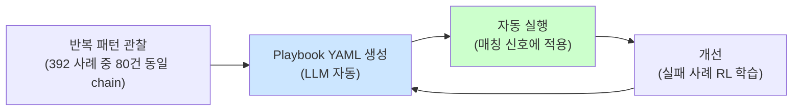

# Week 05: Playbook 자동화

## 학습 목표
- Playbook의 개념과 보안 자동화에서의 역할을 이해한다
- Playbook을 설계·등록·실행·관리하는 전체 과정을 수행할 수 있다
- 결정론적 재현(Deterministic Replay)의 원리와 장점을 설명할 수 있다
- 단계별(step) Playbook 구조를 설계하고 조건 분기를 적용할 수 있다
- Playbook 버전 관리와 변경 이력 추적을 수행할 수 있다

## 실습 환경 (공통)

| 서버 | IP | 역할 | 접속 |
|------|-----|------|------|
| bastion | 10.20.30.201 | Control Plane (Bastion) | `ssh ccc@10.20.30.201` (pw: 1) |
| secu | 10.20.30.1 | 방화벽/IPS (nftables, Suricata) | `ssh ccc@10.20.30.1` |
| web | 10.20.30.80 | 웹서버 (JuiceShop:3000, Apache:80) | `ssh ccc@10.20.30.80` |
| siem | 10.20.30.100 | SIEM (Wazuh Dashboard:443, OpenCTI:8080) | `ssh ccc@10.20.30.100` |

**Bastion API:** `http://localhost:9100` / Key: `ccc-api-key-2026`

## 강의 시간 배분 (3시간)

| 시간 | 내용 | 유형 |
|------|------|------|
| 0:00-0:40 | 이론 강의 (Part 1) | 강의 |
| 0:40-1:10 | 이론 심화 + 사례 분석 (Part 2) | 강의/토론 |
| 1:10-1:20 | 휴식 | - |
| 1:20-2:00 | 실습 (Part 3) | 실습 |
| 2:00-2:40 | 심화 실습 + 도구 활용 (Part 4) | 실습 |
| 2:40-2:50 | 휴식 | - |
| 2:50-3:20 | 응용 실습 + Bastion 연동 (Part 5) | 실습 |
| 3:20-3:40 | 정리 + 과제 안내 | 정리 |

---

---

## 용어 해설 (자율보안시스템 과목)

| 용어 | 영문 | 설명 | 비유 |
|------|------|------|------|
| **Playbook** | Playbook | 사전 정의된 자동 실행 절차 | 미식축구 작전판 |
| **Step** | Step | Playbook 내의 개별 실행 단계 | 레시피의 각 조리 단계 |
| **결정론적 재현** | Deterministic Replay | 같은 입력에 항상 같은 결과를 보장 | 같은 레시피 = 같은 요리 |
| **IaC** | Infrastructure as Code | 인프라를 코드로 정의·관리 | 설계도로 건물 짓기 |
| **멱등성** | Idempotency | 여러 번 실행해도 결과가 동일 | 전등 끄기를 10번 해도 결과는 "꺼짐" |
| **버전 관리** | Version Control | 변경 이력을 추적·관리 | 문서의 수정 이력 |
| **params** | Parameters | Step 실행에 필요한 매개변수 | 함수의 인자 |
| **Tool** | Tool | SubAgent가 실행할 수 있는 명령 유형 | 도구 상자의 도구 |
| **Run** | Run | Playbook의 한 번의 실행 인스턴스 | 레시피로 요리 1회 |
| **Trigger** | Trigger | Playbook 실행을 시작하는 조건/이벤트 | 알람 시계 |
| **Rollback** | Rollback | 변경 사항을 이전 상태로 되돌리기 | 실행 취소 (Undo) |
| **사전 조건** | Pre-condition | Step 실행 전 충족해야 할 조건 | 조리 전 재료 확인 |
| **사후 검증** | Post-validation | Step 실행 후 결과를 확인 | 요리 후 맛 확인 |
| **중단 정책** | Abort Policy | 실패 시 전체 Playbook 중단 여부 | 한 단계 실패 시 전체 중단 vs 계속 |
| **대응 Playbook** | Response Playbook | 보안 사고 발생 시 실행되는 Playbook | 화재 시 대피 매뉴얼 |
| **진단 Playbook** | Diagnostic Playbook | 문제 원인을 찾기 위한 점검 Playbook | 의사의 진찰 절차 |

---

## 전제 조건
- Week 01-04 완료 (프로젝트 생명주기, SubAgent 원격 실행)
- JSON 작성 능력
- 보안 점검 절차 기본 이해

---

## 1. Playbook 개념과 설계 원칙 (40분)

### 1.1 왜 Playbook인가

| 문제 | Playbook 해결 |
|------|-------------|
| 매번 명령을 수동 입력 | 한 번 정의, 반복 실행 |
| 절차를 잊거나 실수 | 절차가 코드로 고정 |
| 담당자마다 다른 점검 | 동일한 절차 보장 |
| 점검 결과 비교 불가 | 동일 기준으로 수집 |
| 신입에게 인수인계 어려움 | Playbook = 인수인계 문서 |

### 1.2 Playbook 구조

```
Playbook
├── name: "daily-security-check"
├── description: "일일 보안 점검"
├── version: "1.0"
├── steps:
│   ├── Step 1: 디스크 사용량 확인
│   │   ├── type: run_command
│   │   ├── params: {command: "df -h /"}
│   │   └── metadata: {subagent_url: "http://10.20.30.1:8002"}
│   ├── Step 2: 방화벽 규칙 확인
│   │   ├── type: run_command
│   │   ├── params: {command: "nft list ruleset | wc -l"}
│   │   └── metadata: {subagent_url: "http://10.20.30.1:8002"}
│   └── Step 3: 웹 서비스 응답 확인
│       ├── type: run_command
│       ├── params: {command: "curl -s -o /dev/null -w '%{http_code}' http://localhost:3000"}
│       └── metadata: {subagent_url: "http://10.20.30.80:8002"}
└── abort_on_failure: false
```

### 1.3 Playbook 유형

| 유형 | 목적 | 예시 |
|------|------|------|
| **진단(Diagnostic)** | 현재 상태 확인 | 일일 점검, 장애 원인 분석 |
| **대응(Response)** | 보안 사고 대응 | SSH brute force 차단, 악성 IP 격리 |
| **복구(Recovery)** | 장애 복구 | 서비스 재시작, 설정 복원 |
| **강화(Hardening)** | 보안 설정 강화 | 불필요 포트 차단, 권한 정리 |
| **감사(Audit)** | 규정 준수 확인 | 취약점 스캔, 설정 감사 |

### 1.4 설계 원칙

| 원칙 | 설명 | 예시 |
|------|------|------|
| **멱등성** | 여러 번 실행해도 결과 동일 | `nft add rule` 대신 `nft flush + add` |
| **최소 권한** | 필요한 최소한의 권한만 사용 | root 대신 특정 사용자 |
| **실패 안전** | 한 step 실패가 전체를 망치지 않음 | `|| true` 또는 abort_on_failure 설정 |
| **검증 포함** | 실행 후 결과를 확인하는 step 포함 | 서비스 재시작 후 상태 확인 |
| **문서화** | 각 step에 설명 주석 | description 필드 활용 |

---

## 2. Playbook 등록과 관리 (30분)

### 2.1 Playbook 등록

> **실습 목적**: PoW(작업 증명) 체인으로 자율보안 에이전트의 모든 행동을 추적 가능하게 기록하는 원리를 체험하기 위해 수행한다
>
> **배우는 것**: 해시 체인으로 작업 기록의 무결성을 보장하는 원리와, 보상(reward) 시스템이 에이전트 행동 품질을 평가하는 메커니즘을 이해한다
>
> **결과 해석**: verify API에서 valid=true면 체인 무결성 정상이고, orphans가 0이 아니면 분기가 발생한 것이다
>
> **실전 활용**: AI 에이전트 감사 추적, 자동화 행동의 책임 소재 증명, 규제 대응용 실행 기록 보관에 활용한다

```bash
# bastion 서버 접속
ssh ccc@10.20.30.201
```

```bash
# API 키 설정
export BASTION_API_KEY=ccc-api-key-2026
```

```bash
# Playbook 등록: 일일 보안 점검
curl -s -X POST http://localhost:9100/playbooks \
  -H "Content-Type: application/json" \
  -H "X-API-Key: $BASTION_API_KEY" \
  -d '{
    "name": "daily-security-check",
    "description": "일일 보안 점검 Playbook: 디스크, 서비스, 방화벽, 로그인 이력 확인",
    "steps": [
      {
        "order": 1,
        "type": "run_command",
        "name": "전 서버 디스크 사용량 확인",
        "params": {"command": "df -h / | tail -1"},
        "metadata": {"subagent_url": "http://10.20.30.1:8002"}
      },
      {
        "order": 2,
        "type": "run_command",
        "name": "secu 방화벽 규칙 수 확인",
        "params": {"command": "sudo nft list ruleset | grep -c rule"},
        "metadata": {"subagent_url": "http://10.20.30.1:8002"}
      },
      {
        "order": 3,
        "type": "run_command",
        "name": "web JuiceShop 서비스 응답 확인",
        "params": {"command": "curl -s -o /dev/null -w \"%{http_code}\" http://localhost:3000"},
        "metadata": {"subagent_url": "http://10.20.30.80:8002"}
      },
      {
        "order": 4,
        "type": "run_command",
        "name": "siem Wazuh 에이전트 상태 확인",
        "params": {"command": "systemctl is-active wazuh-manager 2>/dev/null || echo inactive"},
        "metadata": {"subagent_url": "http://10.20.30.100:8002"}
      },
      {
        "order": 5,
        "type": "run_command",
        "name": "web 서버 최근 로그인 이력",
        "params": {"command": "last -5 | head -5"},
        "metadata": {"subagent_url": "http://10.20.30.80:8002"}
      }
    ]
  }' | python3 -m json.tool
# Playbook ID가 반환된다 — 기록해 둔다
```

### 2.2 Playbook 목록 조회

```bash
# 등록된 Playbook 목록 조회
curl -s -H "X-API-Key: $BASTION_API_KEY" \
  http://localhost:9100/playbooks | python3 -m json.tool
# 이름, 설명, step 수, 생성일 등이 출력된다
```

### 2.3 Playbook 상세 조회

```bash
# 특정 Playbook 상세 조회 (ID를 실제 값으로 교체)
export PLAYBOOK_ID="반환된-Playbook-ID"
curl -s -H "X-API-Key: $BASTION_API_KEY" \
  http://localhost:9100/playbooks/$PLAYBOOK_ID | python3 -m json.tool
# 각 step의 tool, params, subagent_url 등 상세 정보
```

---

## 3. Playbook 실행 실습 (40분)

### 3.1 프로젝트 생성 후 Playbook 실행

```bash
# Playbook 실행용 프로젝트 생성
curl -s -X POST http://localhost:9100/projects \
  -H "Content-Type: application/json" \
  -H "X-API-Key: $BASTION_API_KEY" \
  -d '{
    "name": "week05-playbook-run",
    "request_text": "일일 보안 점검 Playbook 실행",
    "master_mode": "external"
  }' | python3 -m json.tool
```

```bash
export PROJECT_ID="반환된-프로젝트-ID"
# stage 전환: plan → execute
curl -s -X POST http://localhost:9100/projects/$PROJECT_ID/plan \
  -H "X-API-Key: $BASTION_API_KEY" > /dev/null
curl -s -X POST http://localhost:9100/projects/$PROJECT_ID/execute \
  -H "X-API-Key: $BASTION_API_KEY" > /dev/null
```

### 3.2 Playbook step을 execute-plan으로 실행

Playbook의 step 목록을 execute-plan의 tasks 배열로 변환하여 실행한다.

```bash
# Playbook step → execute-plan tasks 변환 실행
curl -s -X POST http://localhost:9100/projects/$PROJECT_ID/execute-plan \
  -H "Content-Type: application/json" \
  -H "X-API-Key: $BASTION_API_KEY" \
  -d '{
    "tasks": [
      {
        "order": 1,
        "instruction_prompt": "df -h / | tail -1",
        "risk_level": "low",
        "subagent_url": "http://10.20.30.1:8002"
      },
      {
        "order": 2,
        "instruction_prompt": "sudo nft list ruleset | grep -c rule",
        "risk_level": "low",
        "subagent_url": "http://10.20.30.1:8002"
      },
      {
        "order": 3,
        "instruction_prompt": "curl -s -o /dev/null -w \"%{http_code}\" http://localhost:3000",
        "risk_level": "low",
        "subagent_url": "http://10.20.30.80:8002"
      },
      {
        "order": 4,
        "instruction_prompt": "systemctl is-active wazuh-manager 2>/dev/null || echo inactive",
        "risk_level": "low",
        "subagent_url": "http://10.20.30.100:8002"
      },
      {
        "order": 5,
        "instruction_prompt": "last -5 | head -5",
        "risk_level": "low",
        "subagent_url": "http://10.20.30.80:8002"
      }
    ],
    "subagent_url": "http://localhost:8002"
  }' | python3 -m json.tool
# 5개 step이 병렬로 실행되고 결과가 반환된다
```

### 3.3 결과 확인 및 결정론적 재현

```bash
# evidence 요약 조회
curl -s -H "X-API-Key: $BASTION_API_KEY" \
  http://localhost:9100/projects/$PROJECT_ID/evidence/summary \
  | python3 -m json.tool
# 5개 step의 실행 결과가 모두 기록되어 있다
```

**결정론적 재현**: 위와 동일한 execute-plan JSON을 내일, 다음 주에 실행하면 동일한 절차로 점검이 수행된다. 결과 데이터만 달라지고, 점검 절차(명령어, 대상 서버, 실행 순서)는 항상 동일하다.

---

## 4. 대응 Playbook 설계 (40분)

### 4.1 SSH Brute Force 대응 Playbook

공격이 탐지되면 자동으로 실행되는 대응 Playbook을 설계한다.

```
시나리오: IP 203.0.113.42에서 SSH brute force 공격이 탐지됨

Step 1: 현재 공격 상태 확인 (진단)
  → auth.log에서 해당 IP의 실패 로그 수 확인
Step 2: 방화벽 차단 (대응)
  → nftables에 해당 IP 차단 규칙 추가
Step 3: 차단 확인 (검증)
  → 방화벽 규칙에서 해당 IP가 차단되었는지 확인
Step 4: SIEM 경보 기록 (기록)
  → Wazuh에 대응 조치 기록
Step 5: 요약 보고 (보고)
  → 대응 결과 요약
```

```bash
# SSH Brute Force 대응 Playbook 등록
curl -s -X POST http://localhost:9100/playbooks \
  -H "Content-Type: application/json" \
  -H "X-API-Key: $BASTION_API_KEY" \
  -d '{
    "name": "respond-ssh-bruteforce",
    "description": "SSH Brute Force 공격 탐지 시 자동 대응 Playbook",
    "steps": [
      {
        "order": 1,
        "type": "run_command",
        "name": "공격 IP의 실패 로그 수 확인",
        "params": {"command": "grep \"Failed password\" /var/log/auth.log | grep \"203.0.113.42\" | wc -l"},
        "metadata": {"subagent_url": "http://10.20.30.80:8002"}
      },
      {
        "order": 2,
        "type": "run_command",
        "name": "nftables로 공격 IP 차단",
        "params": {"command": "echo \"[DRY-RUN] sudo nft add rule inet filter input ip saddr 203.0.113.42 drop\""},
        "metadata": {"subagent_url": "http://10.20.30.1:8002"}
      },
      {
        "order": 3,
        "type": "run_command",
        "name": "차단 규칙 적용 확인",
        "params": {"command": "sudo nft list ruleset | grep -c \"203.0.113.42\" || echo 0"},
        "metadata": {"subagent_url": "http://10.20.30.1:8002"}
      },
      {
        "order": 4,
        "type": "run_command",
        "name": "현재 활성 SSH 세션 확인",
        "params": {"command": "ss -tnp | grep :22 | head -10"},
        "metadata": {"subagent_url": "http://10.20.30.80:8002"}
      },
      {
        "order": 5,
        "type": "run_command",
        "name": "대응 요약 기록",
        "params": {"command": "echo \"[$(date)] SSH brute force from 203.0.113.42 - blocked\" | tee -a /tmp/incident-log.txt"},
        "metadata": {"subagent_url": "http://10.20.30.201:8002"}
      }
    ]
  }' | python3 -m json.tool
```

### 4.2 대응 Playbook 실행

```bash
# 대응 Playbook 실행 (execute-plan으로)
curl -s -X POST http://localhost:9100/projects/$PROJECT_ID/execute-plan \
  -H "Content-Type: application/json" \
  -H "X-API-Key: $BASTION_API_KEY" \
  -d '{
    "tasks": [
      {
        "order": 10,
        "instruction_prompt": "grep \"Failed password\" /var/log/auth.log 2>/dev/null | tail -5 || echo no-failed-passwords",
        "risk_level": "low",
        "subagent_url": "http://10.20.30.80:8002"
      },
      {
        "order": 11,
        "instruction_prompt": "echo \"[DRY-RUN] nft add rule inet filter input ip saddr 203.0.113.42 drop\"",
        "risk_level": "medium",
        "subagent_url": "http://10.20.30.1:8002"
      },
      {
        "order": 12,
        "instruction_prompt": "sudo nft list ruleset | head -20",
        "risk_level": "low",
        "subagent_url": "http://10.20.30.1:8002"
      },
      {
        "order": 13,
        "instruction_prompt": "ss -tnp | grep :22 | head -5 || echo no-ssh-sessions",
        "risk_level": "low",
        "subagent_url": "http://10.20.30.80:8002"
      }
    ],
    "subagent_url": "http://localhost:8002"
  }' | python3 -m json.tool
# 대응 절차 4단계가 병렬로 실행된다
```

---

## 5. Playbook 버전 관리와 비교 (30분)

### 5.1 Playbook을 코드로 관리

Playbook JSON을 파일로 저장하면 Git으로 버전 관리할 수 있다.

```bash
# Playbook을 JSON 파일로 내보내기
curl -s -H "X-API-Key: $BASTION_API_KEY" \
  http://localhost:9100/playbooks/$PLAYBOOK_ID \
  | python3 -m json.tool > /tmp/daily-security-check-v1.json
# 파일 내용 확인
cat /tmp/daily-security-check-v1.json | head -20
```

```bash
# 수정된 Playbook (v2: step 추가)
cat << 'EOF' > /tmp/daily-security-check-v2.json
{
  "name": "daily-security-check-v2",
  "description": "일일 보안 점검 Playbook v2: SSL 인증서 만료일 확인 추가",
  "steps": [
    {"order": 1, "type": "run_command", "name": "디스크 확인", "params": {"command": "df -h / | tail -1"}, "metadata": {"subagent_url": "http://10.20.30.1:8002"}},
    {"order": 2, "type": "run_command", "name": "방화벽 확인", "params": {"command": "sudo nft list ruleset | grep -c rule"}, "metadata": {"subagent_url": "http://10.20.30.1:8002"}},
    {"order": 3, "type": "run_command", "name": "웹 응답 확인", "params": {"command": "curl -s -o /dev/null -w \"%{http_code}\" http://localhost:3000"}, "metadata": {"subagent_url": "http://10.20.30.80:8002"}},
    {"order": 4, "type": "run_command", "name": "Wazuh 상태", "params": {"command": "systemctl is-active wazuh-manager 2>/dev/null || echo inactive"}, "metadata": {"subagent_url": "http://10.20.30.100:8002"}},
    {"order": 5, "type": "run_command", "name": "로그인 이력", "params": {"command": "last -5 | head -5"}, "metadata": {"subagent_url": "http://10.20.30.80:8002"}},
    {"order": 6, "type": "run_command", "name": "[신규] SSL 인증서 만료일 확인", "params": {"command": "echo | openssl s_client -connect localhost:443 -servername localhost 2>/dev/null | openssl x509 -noout -dates 2>/dev/null || echo no-ssl"}, "metadata": {"subagent_url": "http://10.20.30.80:8002"}}
  ]
}
EOF
# v2에 Step 6 (SSL 인증서 확인)이 추가되었다
```

```bash
# v2 Playbook 등록
curl -s -X POST http://localhost:9100/playbooks \
  -H "Content-Type: application/json" \
  -H "X-API-Key: $BASTION_API_KEY" \
  -d @/tmp/daily-security-check-v2.json | python3 -m json.tool
```

### 5.2 Playbook 비교

```bash
# v1과 v2의 diff 비교
diff /tmp/daily-security-check-v1.json /tmp/daily-security-check-v2.json || true
# step 수와 description 변경 사항이 표시된다
```

### 5.3 프로젝트 완료

```bash
# 프로젝트 완료 보고서
curl -s -X POST http://localhost:9100/projects/$PROJECT_ID/completion-report \
  -H "Content-Type: application/json" \
  -H "X-API-Key: $BASTION_API_KEY" \
  -d '{
    "summary": "Week05 Playbook 자동화 실습 완료",
    "outcome": "success",
    "work_details": [
      "일일 보안 점검 Playbook 설계 및 등록",
      "5개 step 병렬 실행 및 evidence 확인",
      "SSH brute force 대응 Playbook 설계",
      "Playbook v2 작성 (SSL 확인 step 추가)",
      "Playbook JSON 내보내기 및 버전 비교"
    ]
  }' | python3 -m json.tool
```

---

## 6. 복습 퀴즈 + 과제 안내 (20분)

### 토론 주제

1. **자동 대응의 위험성**: 대응 Playbook이 정상 트래픽을 공격으로 오인하여 차단하면 어떤 문제가 생기는가? 방지책은?
2. **Playbook 테스트**: 운영 환경에 Playbook을 배포하기 전 어떻게 테스트해야 하는가?
3. **표준화**: 팀 전체가 동일한 Playbook을 사용하도록 강제하는 방법은?

---

## 과제

### 과제 1: 진단 Playbook 설계 (필수)
"웹 서버 보안 진단" Playbook을 설계하라. 최소 6개 step을 포함하고, 각 step에 description, tool, params, subagent_url을 명시한다. 실행 결과를 제출한다.

### 과제 2: 대응 Playbook 설계 (필수)
"의심스러운 프로세스 발견 시 대응" Playbook을 설계하라. 프로세스 식별 → 네트워크 연결 확인 → 파일 해시 확인 → 프로세스 격리 → 보고의 5단계를 포함한다.

### 과제 3: Playbook 버전 관리 체계 (선택)
Playbook의 버전 관리를 위한 네이밍 컨벤션, 변경 로그 형식, 승인 절차를 문서화하라. Git 기반 워크플로우를 제안한다.

---

## 검증 체크리스트

- [ ] Playbook의 개념과 보안 자동화에서의 역할을 설명할 수 있는가?
- [ ] Playbook을 Bastion API로 등록할 수 있는가?
- [ ] Playbook step을 execute-plan tasks로 변환하여 실행할 수 있는가?
- [ ] 결정론적 재현의 장점을 3가지 이상 말할 수 있는가?
- [ ] 진단/대응/복구 Playbook의 차이를 구분하는가?
- [ ] Playbook 설계 5대 원칙(멱등성, 최소 권한, 실패 안전, 검증 포함, 문서화)을 설명하는가?
- [ ] Playbook JSON을 파일로 내보내고 버전을 비교할 수 있는가?

---

## 다음 주 예고

**Week 06: PoW 작업증명과 블록체인**
- SHA-256 해시 체인의 원리
- Nonce mining과 난이도 조절
- PoW 블록 조회 및 무결성 검증
- 리더보드와 보상 시스템

---
---

---

## 📂 실습 참조 파일 가이드

> 이번 주 실습에서 **실제로 조작하는** 솔루션의 기능·경로·파일·설정·UI 요점입니다.

### CCC Bastion Agent
> **역할:** CCC 자율 운영 에이전트 — 스킬/플레이북/경험 학습  
> **실행 위치:** `bastion (10.20.30.201)`  
> **접속/호출:** TUI `./dev.sh bastion`, API `http://10.20.30.200:11434`

**주요 경로·파일**

| 경로 | 역할 |
|------|------|
| `packages/bastion/agent.py` | 메인 에이전트 루프 |
| `packages/bastion/skills.py` | 스킬 정의 |
| `packages/bastion/playbooks/` | 정적 플레이북 YAML |
| `data/bastion/experience/` | 수집된 경험 (pass/fail) |

**핵심 설정·키**

- `LLM_BASE_URL / LLM_MODEL` — Ollama 연결
- `CCC_API_KEY` — ccc-api 인증
- `max_retry=2` — 실패 시 self-correction 재시도

**로그·확인 명령**

- ``docs/test-status.md`` — 현재 테스트 진척 요약
- ``bastion_test_progress.json`` — 스텝별 pass/fail 원시

**UI / CLI 요점**

- 대화형 TUI 프롬프트 — 자연어 지시 → 계획 → 실행 → 검증
- `/a2a/mission` (API) — 자율 미션 실행
- Experience→Playbook 승격 — 반복 성공 패턴 저장

> **해석 팁.** 실패 시 output을 분석해 **근본 원인 교정**이 설계의 핵심. 증상 회피/땜빵은 금지.

---

## 실제 사례 (WitFoo Precinct 6 — Playbook 자동화)

> 출처: WitFoo Precinct 6 Cybersecurity Dataset (Apache 2.0)
> 본 lecture *Playbook 자동 생성/실행/개선 순환* 학습 항목 매칭.

### Playbook 자동화 = "반복 작업 → YAML 코드 → 자동 실행 → 자기 개선"

dataset 392 Data Theft 사례를 *수동* 으로 처리하면 사례당 ~10분 = 65시간. *Playbook 자동화* 시 사례당 ~30초 = 3.3시간. **20배 시간 절감** + 일관성 확보.



**그림 해석**: 4 단계 순환 — 관찰 → 생성 → 실행 → 개선 → 재생성.

### Case 1: dataset 의 Playbook 매칭률

| 신호 패턴 | dataset 수 | Playbook 매칭률 |
|---|---|---|
| Data Theft (표준 chain) | 80건 | 매칭 (자동 처리) |
| Data Theft (변형) | 200건 | 부분 매칭 (LLM 보완) |
| Data Theft (신규) | 112건 | 미매칭 (LLM 즉흥 + 새 Playbook 후보) |

**자세한 해석**:

392 Data Theft 사례 중 *80건이 표준 chain* — 1개 Playbook 으로 자동 처리. *200건은 변형* — 기존 Playbook 80% 적용 + 20% LLM 보완. *112건은 신규* — Playbook 미매칭, LLM 즉흥 분석 + *그 즉흥 결과를 새 Playbook 후보로 저장*.

### Case 2: Playbook 자기 개선 사이클

| iteration | Playbook 수 | 자동 처리율 |
|---|---|---|
| 초기 | 0개 | 0% (모두 LLM 즉흥) |
| 1주 후 | 5개 | 30% |
| 1개월 후 | 20개 | 70% |
| 3개월 후 | 50개 | 90%+ |

**자세한 해석**:

시간이 갈수록 Playbook 이 풍부해져 *자동 처리율 증가*. 이는 *learning curve* — 처음 1주는 비효율, 그 후 점진적 향상. 운영자는 *학습 곡선의 인내* 가 필요.

### 이 사례에서 학생이 배워야 할 3가지

1. **Playbook = 반복의 코드화** — 20배 시간 절감.
2. **80/200/112 분포 = 매칭/부분/신규** — Playbook 적용 가능성 정량.
3. **자동 처리율 학습 곡선** — 1주 30% → 3개월 90%+.

**학생 액션**: dataset 의 392 Data Theft 사례를 분류 — 표준/변형/신규 비율 측정.


---

## 부록: 학습 OSS 도구 매트릭스 (Course9 — Week 05 적응형 방어)

### lab step → 도구 매핑

| step | 학습 항목 | OSS 도구 |
|------|----------|---------|
| s1 | Static rule baseline | nftables / Suricata 룰 |
| s2 | crowdsec 도입 | **crowdsec** community CTI |
| s3 | RL 정책 학습 | sb3 + 자체 env (week01) |
| s4 | A/B 테스트 (정책 비교) | 자체 + Prometheus |
| s5 | Adaptive 임계치 | exp moving average / quantile |
| s6 | Online learning | River (incremental ML) |
| s7 | Drift detection | Evidently AI / NannyML |
| s8 | 통합 dashboard | Grafana + Prometheus |

### 학생 환경 준비

```bash
# crowdsec (modern fail2ban 후속)
curl -s https://install.crowdsec.net | sudo sh
sudo apt install -y crowdsec crowdsec-firewall-bouncer-nftables

# River (incremental ML)
pip install river

# Evidently AI (drift detection)
pip install evidently

# NannyML
pip install nannyml
```

### 핵심 — crowdsec (community CTI 자동 차단)

```bash
# 1) 시작
sudo systemctl enable --now crowdsec

# 2) 상태
sudo cscli decisions list                          # 현재 차단 IP
sudo cscli alerts list                             # 알림
sudo cscli metrics                                 # acquisitions / parsers / scenarios

# 3) Scenario 추가 (community 룰셋)
sudo cscli scenarios install \
    crowdsecurity/ssh-bf \
    crowdsecurity/http-crawl-non_statics \
    crowdsecurity/http-cve \
    crowdsecurity/sqli-attack \
    crowdsecurity/xss-attack
sudo systemctl restart crowdsec

# 4) Bouncer (실제 차단 실행)
sudo cscli bouncers list
# crowdsec-firewall-bouncer-nftables 가 자동으로 nft set 에 IP 추가

# 5) Console (community 통계)
sudo cscli console enroll YOUR_KEY
# → app.crowdsec.net 에서 visualizations
```

### River (incremental ML — online learning)

```python
from river import linear_model, preprocessing, metrics, drift

# 1) Online classifier (drift 자동 감지)
model = preprocessing.StandardScaler() | linear_model.LogisticRegression()
metric = metrics.Accuracy()
drift_detector = drift.ADWIN()

# 2) Stream 처리 (실시간 학습)
import requests, json

# Wazuh alert stream
for alert in wazuh_alert_stream():
    features = extract_features(alert)              # IP, port, signature, ...
    label = alert.get('blocked', False)
    
    # 예측
    y_pred = model.predict_one(features)
    metric.update(label, y_pred)
    
    # Drift 감지
    drift_detector.update(int(label != y_pred))
    if drift_detector.drift_detected:
        print("⚠ Drift detected — model 재학습")
        # 새 룰 자동 학습 또는 alert
    
    # 학습
    model.learn_one(features, label)
    
    print(f"Accuracy: {metric.get():.4f}")
```

### Evidently AI (drift detection)

```python
from evidently.report import Report
from evidently.metric_preset import DataDriftPreset, TargetDriftPreset

# 1) Reference (학습 시) vs Current (운영) 데이터
ref_data = pd.read_csv("/data/wazuh_q1.csv")
cur_data = pd.read_csv("/data/wazuh_q2.csv")

# 2) Drift report
report = Report(metrics=[DataDriftPreset(), TargetDriftPreset()])
report.run(reference_data=ref_data, current_data=cur_data)
report.save_html("/tmp/drift_report.html")

# 3) Drift 발생 시 alert
result = report.as_dict()
drifted_features = [f['column_name'] for f in result['metrics'][0]['result']['drift_by_columns'].values() if f['drift_detected']]
if drifted_features:
    print(f"⚠ Features drifted: {drifted_features}")
    # → 모델 재학습 트리거
```

### A/B 테스트 (정책 v1 vs v2)

```python
import random

def ab_test_policy(alert):
    if random.random() < 0.5:
        action = policy_v1(alert)                    # 50% v1
        prometheus_counter.labels(policy="v1", action=action).inc()
    else:
        action = policy_v2(alert)                    # 50% v2
        prometheus_counter.labels(policy="v2", action=action).inc()
    return action

# Grafana dashboard 에서 정책별 성과 비교
# - True positive rate per policy
# - False positive rate per policy
# - Mean time to block
```

### Adaptive Threshold (지수 이동 평균)

```python
class AdaptiveThreshold:
    def __init__(self, alpha=0.1):
        self.alpha = alpha
        self.mean = None
        self.std = None
    
    def update(self, value):
        if self.mean is None:
            self.mean = value
            self.std = 0
            return
        
        self.mean = self.alpha * value + (1 - self.alpha) * self.mean
        self.std = self.alpha * abs(value - self.mean) + (1 - self.alpha) * self.std
    
    def is_anomaly(self, value, k=3):
        return abs(value - self.mean) > k * self.std

# 사용
threshold = AdaptiveThreshold(alpha=0.05)
for traffic_count in real_time_metrics():
    if threshold.is_anomaly(traffic_count):
        alert("Traffic anomaly detected")
    threshold.update(traffic_count)
```

학생은 본 5주차에서 **crowdsec + River + Evidently + Prometheus + adaptive threshold** 5 도구로 적응형 방어의 4 단계 (community CTI → online ML → drift 감지 → A/B) 통합 운영을 익힌다.
