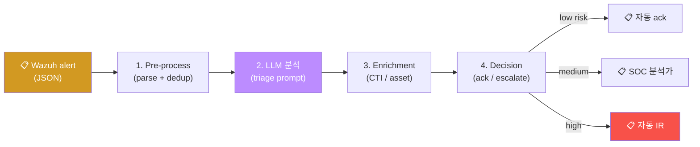
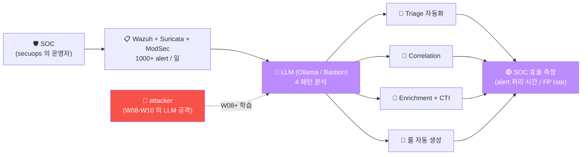

# Week 04 — AI Powered Cyber Security (2) — LLM 활용 보안로그 / 탐지룰 / 취약점·모의해킹

> W03 의 ML/DL 보안 활용 위에, **LLM 의 본격 보안 작업** 학습. SOC 분석가 의 일상
> 작업 (로그 분석 / 탐지룰 작성 / 취약점 분석 / 모의해킹 보조) 를 LLM 으로 자동화·
> 가속. 본 과목 W05+ (AI 에이전트) 의 직접 선수.

## 학습 목표

학생은 본 주차 종료 시 다음을 수행할 수 있어야 한다.

1. **LLM 의 보안 로그 분석 패턴** — Triage / Correlation / Enrichment / Reporting
2. **alert 의 LLM 처리 흐름** — Wazuh alert → LLM → 의사결정 (acknowledge / escalate)
3. **탐지룰 생성 의 LLM 활용** — Sigma / Suricata / Wazuh / ModSec 룰 자동 생성
4. **CVE 의 LLM 분석** — CVE description → 영향 분석 + 권장 패치
5. **모의해킹 보조** — Penetration testing 의 step 별 LLM 조언 + Burp Suite 통합
6. **운영 권장** — token 비용 / hallucination 방지 / 인간 검토
7. **LLM as Judge** — LLM 이 다른 LLM 의 응답 / 보안 분석 평가
8. W04 R/B/P 1 사이클

## 강의 시간 배분 (3시간 — 3 차시)

| 차시 | 시간 | 내용 | 유형 |
|------|------|------|------|
| 1차시 | 0:00–1:00 | **LLM 활용 보안로그 분석** — 4 패턴 + Wazuh alert + Bastion 시뮬 | 강의 |
| 휴식 | 1:00–1:10 | | |
| 2차시 | 1:10–2:10 | **LLM 활용 탐지룰 생성** — Sigma / Suricata / Wazuh / ModSec 룰 자동 | 강의 |
| 휴식 | 2:10–2:20 | | |
| 3차시 | 2:20–3:00 | **LLM 활용 취약점 분석 + 모의해킹** — CVE / Burp / sqlmap 통합 | 실습 |

---

## 1차시 — LLM 활용 보안 로그 분석

### 1.0 비서가 1000통 메일을 분류하는 상황에 비유하기

본 차시 학습을 시작하면서 직관을 일상의 풍경에 빗대어 본다.

회사 부장을 떠올려 보자. 부장은 매일 1000통 이상의 이메일을 받는다. 한 사람이 모든 이메일을 직접 확인하는 것은 불가능하다. 부장이 선택할 수 있는 방식은 두 가지다.

**방식 A (LLM 없이 부장이 직접 처리).** 8시간 동안 1000통을 전부 직접 본다. 진짜 중요한 이메일이 noise 속에 묻히고, 부장은 빠르게 피로해진다.

**방식 B (LLM 활용 — 비서가 사전 분류).**

- 비서가 1000통을 분류한다. 즉시 응답이 필요 없는 광고, spam, 자동 알림 90%는 자동 ack로 처리한다.
- 부장의 review가 필요한 직원 휴가 신청, 보고서 검토 요청 등 8%는 부장이 직접 본다.
- 즉시 응답이 필요한 긴급 고객 문의, 사고 보고 등 2%는 즉시 escalation한다.

이 비서 비유는 LLM 기반 SOC와 그대로 대응된다. SOC 분석가가 매일 1000건 이상의 alert를 처리해야 하지만 인간의 8시간으로는 한계가 있다. LLM이 자동 분류하고, 인간이 review하고, 위험한 건은 자동 escalation하는 흐름을 결합하면 SOC 효율이 크게 증가한다.

본 차시에서 다루는 4가지 패턴 (Triage, Correlation, Enrichment, Reporting) 이 비서가 1000통을 처리하는 4가지 task에 그대로 대응된다.

### 1.1 SOC 분석가의 일상 task

```
1. Triage — alert 의 우선순위 (false-positive vs real)
2. Correlation — 여러 alert 의 연관 사고 식별
3. Enrichment — alert 의 context 보강 (IOC / 사용자 / 자산)
4. Reporting — IR 보고서 작성
5. Hunting — proactive hunt (W14 secuops 참조)
6. Tool 운영 — Wazuh / Suricata / ModSec 의 룰 관리
```

LLM 이 1-4 모두 가속 가능 + 5-6 보조.

### 1.2 LLM 의 alert 처리 흐름



### 1.3 LLM 의 alert 분석 prompt 패턴

```python
system_prompt = """
당신은 SOC Tier 2 분석가 입니다.

다음 Wazuh alert 를 분석:
1. alert 의 핵심 사실 (5 W: when / who / where / what / why)
2. 위험도 평가 (low / medium / high / critical)
3. false-positive 가능성 (high / medium / low / very low)
4. 권장 조치 (자동 ack / SOC 검토 / 즉시 IR)
5. 관련 ATT&CK Technique

응답 형식: JSON
"""

user_message = f"""
[alert]
{wazuh_alert_json}

[자산 정보]
{asset_info}

[CTI]
{cti_match}
"""

# LLM 호출
response = ollama.chat(
    model="gemma3:4b",
    messages=[
        {"role": "system", "content": system_prompt},
        {"role": "user", "content": user_message}
    ],
    format="json"
)
```

### 1.4 응답 예 (LLM 의 분석 결과)

```json
{
  "facts": {
    "when": "2026-05-12T14:32:18Z",
    "who": "ccc",
    "where": "10.20.30.201 (bastion)",
    "what": "SSH failed login from 1.2.3.4",
    "why": "5 회 반복 — brute force 의심"
  },
  "risk": "high",
  "false_positive_probability": "low",
  "recommendation": "즉시 IR — 1.2.3.4 의 fw drop + 분석가 검토",
  "attack_pattern": ["T1110.001 Password Guessing"]
}
```

### 1.5 alert 의 correlation (다중 alert 분석)

```python
# 1 hour 안의 모든 alert 의 LLM 분석
recent_alerts = get_wazuh_alerts(since="1 hour ago")  # 100+ alert

prompt = f"""
다음 100 alert 가 모두 같은 사고 의 일부 인가?
또는 별 사고 인가?
사고 그룹 화 + 우선순위.

[alerts]
{json.dumps(recent_alerts)}
"""

# LLM 응답:
# {
#   "incidents": [
#     {"id": "INC-001", "alerts": ["alert-1", "alert-3", ...], "tactic": "TA0001"},
#     {"id": "INC-002", "alerts": ["alert-5"], "tactic": "TA0007"}
#   ]
# }
```

### 1.6 enrichment — CTI / 자산 통합

```python
# alert 의 srcip → CTI 검색 + asset 검색
def enrich_alert(alert):
    srcip = alert['data']['srcip']

    # CTI lookup
    cti = opencti_search(srcip)

    # asset lookup
    asset = cmdb_search(alert['agent']['name'])

    # LLM 의 통합 분석
    enriched = llm_analyze({
        "alert": alert,
        "cti": cti,
        "asset": asset
    })

    return enriched
```

### 1.7 비용 + 속도

```
LLM 의 token 비용 / 응답 시간:

클라우드:
  GPT-4o: $5 / 1M input token, $15 / output
  Claude 3.5 Sonnet: $3 / 1M input, $15 / output
  Gemini 1.5: $3.5 / 1M input

로컬:
  gemma3:4b: 자유 (전기만)
  qwen2.5:7b: 자유
  Bastion gpt-oss:120b: 자유 + 단일 GPU

운영 시:
  1000 alert / 일 × 1K token / alert = 1M token / 일
  GPT-4o = $20 / 일 = $600 / 월 → 운영 부담
  로컬 = 0 (전기만)
```

본 lab 의 권장: 로컬 (Ollama 또는 Bastion).

---

## 2차시 — LLM 활용 탐지룰 생성

### 2.1 탐지룰 생성 의 표준 도구

| 도구 | 룰 형식 | 용도 |
|------|---------|------|
| **Sigma** | YAML (generic) | SIEM 의 통합 표준 |
| **Suricata** | Sigma syntax | 네트워크 IDS |
| **Wazuh** | XML | SIEM (log analysis) |
| **ModSecurity** | SecRule (Apache config) | WAF |
| **YARA** | YARA syntax | malware 탐지 |
| **Sentinel** | KQL (Microsoft) | Azure SIEM |
| **Splunk** | SPL | Splunk SIEM |

### 2.2 Sigma 룰 (가장 표준)

```yaml
title: SSH Brute Force from Single IP
id: 12345678-1234-1234-1234-123456789012
status: stable
description: SSH 의 5+ failed login from same IP in 60 seconds
references:
  - https://attack.mitre.org/techniques/T1110/
tags:
  - attack.credential_access
  - attack.t1110.001
logsource:
  product: linux
  service: sshd
detection:
  selection:
    failure_msg: 'Failed password for'
  timeframe: 60s
  condition: selection | count() by src_ip > 5
falsepositives:
  - 직원 의 비밀번호 잊음
level: high
```

### 2.3 LLM 으로 Sigma 룰 자동 생성

```python
system = """
당신은 SOC Detection Engineer.
주어진 침해 시나리오 의 Sigma 룰 YAML 형식 으로 작성.
필수 field: title / id / description / tags / logsource / detection / falsepositives / level
ATT&CK Technique ID 매핑.
"""

user = """
시나리오: web 의 ModSec audit log 에 941xxx (XSS) 룰 매치가
60 초에 3 건 이상 같은 src_ip 에서 발생.

해당 시나리오의 Sigma 룰 작성.
"""

# LLM 응답: 완성된 Sigma YAML
```

### 2.4 Wazuh 룰 의 LLM 생성

```python
system = """
당신은 Wazuh Detection Engineer.
주어진 시나리오 의 Wazuh XML 룰 작성.
형식:
<rule id="..." level="...">
  <if_sid>...</if_sid>
  <field name="...">...</field>
  <description>...</description>
</rule>
ID 범위: 100000+ (사용자 정의)
"""

user = """
ModSec 의 941100 (XSS via libinjection) 매치가
60 초에 3 건 + 같은 src_ip → level 12 alert + AR (firewall-drop 30분)
"""

# LLM 응답
```

### 2.5 Suricata 룰

```python
system = """
당신은 Suricata 룰 작성자.
주어진 페이로드 의 Suricata 룰 작성.
sid 범위: 9000000+
classtype 명시.
"""

user = """
페이로드: User-Agent 가 "sqlmap" 인 HTTP 요청
60 초에 1 회만 alert (threshold)
"""

# LLM 응답 (W04 attack 의 9000042 와 비슷)
```

### 2.6 룰 작성 후 검증

```python
# LLM 응답 의 자동 검증 절차
def validate_rule(rule_text, rule_type):
    if rule_type == "sigma":
        # sigma 의 schema 검증
        return sigma_lint(rule_text)
    elif rule_type == "wazuh":
        # XML syntax + wazuh-logtest
        return subprocess.run(["wazuh-logtest", "-r", rule_text])
    elif rule_type == "suricata":
        # suricata -T -S
        return subprocess.run(["suricata", "-T", "-S", rule_path])
```

LLM 응답 → 자동 검증 → 실 환경 적용 (after human review).

### 2.7 ModSec custom rule

```python
system = """
당신은 ModSec / OWASP CRS rule 작성자.
SecRule + chain + transformation + actions.
"""

user = """
다음 차단 조건:
- POST request body 에 한국 주민번호 패턴 (6digit-7digit)
- 응답: 403 + log
- audit 의 message: "RRN exposure attempt"
"""

# LLM 응답
# SecRule REQUEST_BODY "@rx \\d{6}-[1-4]\\d{6}" \
#     "id:9000001, ..."
```

### 2.8 룰 생성 의 hallucination 위험

LLM 가 잘못된 룰 생성 가능 — 사용자 검증 + 자동 검증 + dry-run 필수.

```python
# 안전한 룰 적용 절차
1. LLM 의 룰 생성
2. syntax 검증 (lint)
3. 별 test 환경 적용
4. 사람의 review
5. production 적용 (DetectionOnly 먼저)
6. 1주일 baseline 후 활성
```

---

## 3차시 — LLM 활용 취약점 분석 + 모의해킹

### 3.1 CVE 의 LLM 분석

```python
system = """
당신은 보안 컨설턴트.
CVE 의 description + CVSS + 영향 분석 + 권장 패치 작성.
응답:
  1. CVE 핵심 (어떤 vuln)
  2. CVSS 3.1 점수 의 의미
  3. 영향 범위 (어떤 시스템 / 어떤 행위)
  4. 익스플로잇 가용성 (PoC 공개 / 실 사용)
  5. 권장 패치 + 우선순위
"""

user = """
CVE: CVE-2024-XXXX
description: Apache HTTP Server 2.4.x 의 mod_rewrite 의 ...
CVSS: 9.8 (Critical)
"""
```

### 3.2 LLM 의 SAST (Static Analysis)

```python
# 코드 분석 의 LLM
def analyze_code(code, language):
    return llm.complete(
        system="당신은 코드 보안 분석가. CWE 기반 vuln 찾기.",
        user=f"""
        다음 {language} 코드 의 보안 약점:
        {code}

        분석:
        1. 발견 vuln 의 CWE 매핑
        2. 익스플로잇 가능성
        3. 수정 권장 (diff 형식)
        """
    )
```

### 3.3 LLM 의 DAST (Dynamic Analysis)

```python
# Burp Suite + LLM 통합
def analyze_request_response(burp_req, burp_resp):
    return llm.complete(
        system="당신은 web 침투 테스터. Burp 의 request/response 분석.",
        user=f"""
        Request:
        {burp_req}

        Response:
        {burp_resp}

        분석:
        1. 가능한 vuln (SQLi / XSS / IDOR / 등)
        2. 다음 시도 페이로드 (3+)
        3. ATT&CK Technique 매핑
        """
    )
```

### 3.4 LLM 의 모의해킹 보조

```
시나리오:
  1. 학생 (또는 침투 테스터) 가 정찰 시작
  2. nmap 결과 → LLM 분석 → 다음 시도 추천
  3. 발견 vuln → LLM 의 exploit 가설 + 안전 페이로드
  4. PTES 의 각 단계 LLM 조언

본 lab 의 6v6 환경 + LLM 의 보조 운영:
  W05+ 의 AI 에이전트 (Claude Code / Bastion) 의 기반
```

### 3.5 sqlmap + LLM 통합

```python
# sqlmap 실행 후 LLM 의 결과 분석
sqlmap_output = subprocess.run(["sqlmap", "-u", target_url, "--batch"], capture_output=True)

llm.analyze(
    system="sqlmap 결과 분석",
    user=f"sqlmap 출력:\n{sqlmap_output.stdout}\n\n분석 + 다음 시도 추천."
)
```

### 3.6 본 lab 의 W05+ 의 직접 선수

본 주차 의 LLM 활용 = AI 에이전트 (W05) 의 기반:
- Claude Code 가 자동 코드 분석 + vuln fix
- Bastion 가 자동 침투 시도 + 결과 분석
- W08 의 AI Agent Hijacking (악의적 활용)

### 3.6a 모의해킹 보조 의 실 trace — JuiceShop SQLi 의 1 cycle

학생 의 학습 환경 의 LLM 의 모의해킹 보조 의 실 trace 의 직관.

**상황.** 학생 의 attacker VM (192.168.0.112) 의 6v6 의 web target (192.168.0.100, OWASP Juice Shop) 의 SQLi 의 학습.

**Stage 1: 정찰 (5 분).**

- 학생 의 nmap 의 자동 정찰.
- 결과 — port 3000 (Juice Shop) 의 open.
- LLM 의 응답 — "REST API + Angular SPA 의 추정. /api/users, /api/products 의 endpoint 의 시도 의 권장."

**Stage 2: vuln 의 발견 (10 분).**

- 학생 의 /api/users 의 query 의 시도.
- 응답 — JSON 의 user list.
- LLM 의 응답 — "SQLi 의 가능성 의 의심. /api/users?username=admin' OR '1'='1 의 시도 의 권장."

**Stage 3: exploit 의 시도 (5 분).**

- 학생 의 sqlmap 의 자동 시도.
- 결과 — SQLi 의 confirm.
- LLM 의 응답 — "MySQL 의 의심. --dump 의 시도 의 user table 의 추출 의 가능."

**Stage 4: 결과 의 분석 (5 분).**

- 학생 의 user table 의 추출 의 성공.
- LLM 의 응답 — "ATT&CK Technique T1190 (Exploit Public-Facing Application) + T1003 (OS Credential Dumping) 의 매핑. 보고서 의 작성 의 권장."

이 1 cycle 의 25 분 의 완료 의 학생 의 인간 의 직접 의 시도 (1-2 시간) 의 대비 의 4 배 의 시간 절약. 그러나 의 모든 결정 의 학생 의 직접 review 의 의무.

### 3.7 윤리적 한계

```
✅ 허용:
  - 6v6 환경 + 본인 환경의 vuln 분석
  - 학습 목적 의 exploit 가설
  - Penetration testing 의 보조 (RoE 내)

❌ 금지:
  - 외부 시스템 의 무허가 vuln 분석
  - 실 exploit 코드 의 외부 공개
  - 0-day 의 무책임한 공유 (Responsible Disclosure 위반)
```

---

## 4. ATT&CK + 표준 매핑

### 4.1 SOC 의 LLM 활용 표준

```
- Microsoft Security Copilot (2023) — Microsoft 의 SOC AI
- IBM watsonx.ai for Cybersecurity
- Anthropic 의 Claude for Government (2024)
- 한국 안랩 / 이글루시큐리티 의 AI SOC (2024-2025)
```

### 4.2 MITRE ATLAS 의 본 주차 매핑

- **AML.T0024**: Exfiltration via ML Inference API (LLM 의 token 비용)
- **AML.T0048**: Backdoor ML Model (W08 학습)

### 4.3 OWASP Top 10 for LLM 본 주차 매핑

- **LLM02**: Insecure Output Handling — LLM 의 룰 생성 시 검증 부족
- **LLM03**: Training Data Poisoning — W08 학습
- **LLM06**: Sensitive Information Disclosure — alert 의 PII 의 LLM 노출
- **LLM09**: Overreliance — LLM 의 hallucination 신뢰

---

## 5. R/B/P 시나리오 — LLM 활용 SOC



---

## 6. 실습 1~5

### 실습 1 — LLM 의 alert triage (zero-shot)

```bash
ssh 6v6-bastion '
# 실 Wazuh alert 의 LLM 분석
ALERT=$(sudo tail -1 /var/ossec/logs/alerts/alerts.json | head -1)
echo "Alert: $ALERT" | head -c 200

curl -s -X POST -H "X-API-Key: ccc-api-key-2026" \
    -H "Content-Type: application/json" \
    -d "{\"message\":\"다음 Wazuh alert 를 한국어로 5W + 위험도 + 권장으로 분석: $ALERT\", \"agent\":\"master\"}" \
    http://localhost:9100/chat 2>&1 | head -50
'
```

### 실습 2 — LLM 의 Sigma 룰 자동 생성

```bash
curl -s http://localhost:11434/api/generate -d '{
  "model": "gemma3:4b",
  "prompt": "다음 시나리오의 Sigma rule YAML 작성:\n\n시나리오: SSH 의 5+ failed login from same IP in 60 seconds.\n\n형식 (YAML):\n  title: ...\n  id: ...\n  description: ...\n  tags:\n    - attack.credential_access\n    - attack.t1110.001\n  logsource:\n    product: linux\n    service: sshd\n  detection:\n    selection:\n      ...\n    timeframe: 60s\n    condition: ...\n  falsepositives:\n    - ...\n  level: high",
  "stream": false
}' | jq -r .response | head -30
```

### 실습 3 — LLM 의 Wazuh 룰 자동 생성

```bash
curl -s http://localhost:11434/api/generate -d '{
  "model": "gemma3:4b",
  "prompt": "다음 시나리오의 Wazuh XML rule 작성 (id 100400 / level 12):\n\n시나리오: ModSec 의 941100 (XSS) 매치가 60 초에 3 건 이상 같은 src_ip → level 12 alert.\n\n형식:\n<group name=...>\n  <rule id=... level=...>\n    <if_sid>...</if_sid>\n    <field name=...>...</field>\n    <description>...</description>\n  </rule>\n</group>",
  "stream": false
}' | jq -r .response | head -30
```

### 실습 4 — LLM 의 CVE 분석

```bash
curl -s http://localhost:11434/api/generate -d '{
  "model": "gemma3:4b",
  "prompt": "다음 CVE 를 한국어로 분석. 응답 5 항목 (핵심 / CVSS 의미 / 영향 / 익스플로잇 가용성 / 권장 패치):\n\nCVE: CVE-2024-XXXX (가상)\ndescription: Apache HTTP Server 2.4.x 의 mod_rewrite 의 buffer overflow → RCE\nCVSS: 9.8 (Critical)\nattack_vector: Network",
  "stream": false
}' | jq -r .response | head -30
```

### 실습 5 — LLM 의 모의해킹 보조

```bash
curl -s http://localhost:11434/api/generate -d '{
  "model": "gemma3:4b",
  "prompt": "당신은 학습 환경의 침투 테스트 보조 AI.\n\n현재 상황:\n- target: juice.6v6.lab (학습 환경의 OWASP Juice Shop)\n- 정찰 결과: REST API + JWT 인증 + ModSec WAF 가동\n- 발견 endpoint: /api/Users (200 응답)\n\n다음 시도 권장 3 + 각 시도의 ATT&CK Technique 매핑.",
  "stream": false
}' | jq -r .response | head -30
```

---

## 7. 한국 사례 + 표준

### 7.1 KISA 의 AI SOC

```
2024-2025 한국 의 AI SOC 도입 가속:
  - 안랩 V3 AI
  - 이글루시큐리티 의 AI 분석
  - SK인포섹 의 LLM 통합
  - 국가정보원 의 AI 사이버 위협 분석
```

### 7.2 ISMS-P 2.10.7 + AI

```
2.10.7 보안위협 대응 의 AI 자동화:
  - LLM 의 alert triage
  - 자동 IR 의 일부
  - 분기 review 의 AAR (W14 secuops 참조)
```

---

## 8. 과제

### A. LLM 의 alert 분석 매트릭스 (필수, 40점)

본인 환경의 10+ Wazuh alert × 4 패턴 (Triage / Correlation / Enrichment /
Reporting) 의 LLM 응답 quality 표.

### B. LLM 의 룰 생성 + 검증 (심화, 30점)

본인 작성 3 시나리오 의 Sigma / Wazuh / Suricata 룰 LLM 생성 + syntax 검증 +
실 환경 적용 (after human review).

### C. 모의해킹 보조 시뮬 (정성, 30점)

본 6v6 환경 의 1 vuln (예: SQLi on dvwa.6v6.lab) 의 침투 시도 + 각 step 의 LLM
조언 + 결과 보고.

---

## 8.5. 본 주차 hands-on (lab yaml 매핑)

본 주차 lab (`contents/standalone/lab/aisec/week04.yaml`) 의 5 step을 다음과 같이 안내한다.

1. **실 Wazuh alert의 LLM 분석** — `ssh 6v6-bastion` 으로 `sudo tail /var/ossec/logs/alerts/alerts.json` 을 가져와 Bastion `/chat` 으로 보낸 뒤 5W, 위험도, 권장 응답을 받는다. (평가 기준 A의 base)

2. **LLM의 Sigma rule 자동 생성** — `curl http://ollama-host:11434/api/generate` 로 gemma3:4b 를 호출해 SSH 5회 이상 failed login 시나리오의 Sigma YAML (title, id, tags, logsource, detection, level) 을 생성한다.

3. **LLM의 Wazuh XML rule 생성** — 가상 시나리오 (rule 100400, level 12, frequency 3, timeframe 60) 의 Wazuh XML 을 자동 생성한다.

4. **CVE의 LLM 분석 (5항목)** — 가상 CVE를 대상으로 핵심 vuln, CVSS 의미, 영향 범위, 익스플로잇 가용성, 권장 패치 5가지 항목의 응답을 받는다. (평가 기준 B의 base)

5. **모의해킹 보조 — JuiceShop의 LLM 조언** — JuiceShop 정찰 결과 (REST API, JWT, ModSec) 를 LLM에 넘겨 다음 시도 권장 사항과 ATT&CK Technique 매핑을 받는다. (평가 기준 C의 base)

---

## 9. 평가 기준

| 항목 | 비중 |
|------|------|
| alert 분석 (A) | 40% |
| 룰 생성 (B) | 30% |
| 모의해킹 보조 (C) | 30% |

---

## 10. 핵심 정리 (10 줄)

1. **SOC 의 LLM 활용 4 패턴** — Triage / Correlation / Enrichment / Reporting
2. **alert → LLM → 의사결정** flow (자동 ack / SOC / 자동 IR)
3. **token 비용** — 클라우드 vs 로컬 의 큰 차이 → 로컬 권장
4. **룰 자동 생성** — Sigma (표준) / Wazuh XML / Suricata / ModSec / YARA
5. **룰 검증 필수** — LLM hallucination → 자동 lint + 사람 review + dry-run
6. **CVE 의 LLM 분석** — CVSS / 영향 / 익스플로잇 가용성 / 권장 패치
7. **SAST / DAST** 의 LLM 통합 — Burp + sqlmap + LLM
8. **모의해킹 보조** — PTES 의 각 단계 LLM 조언 (W05+ 의 AI 에이전트 기반)
9. **OWASP Top 10 for LLM** — LLM02 / LLM03 / LLM06 / LLM09 매핑
10. **W05 (AI 에이전트 1)** 다음 주차 — 에이전트 + Claude Code + 하네스
