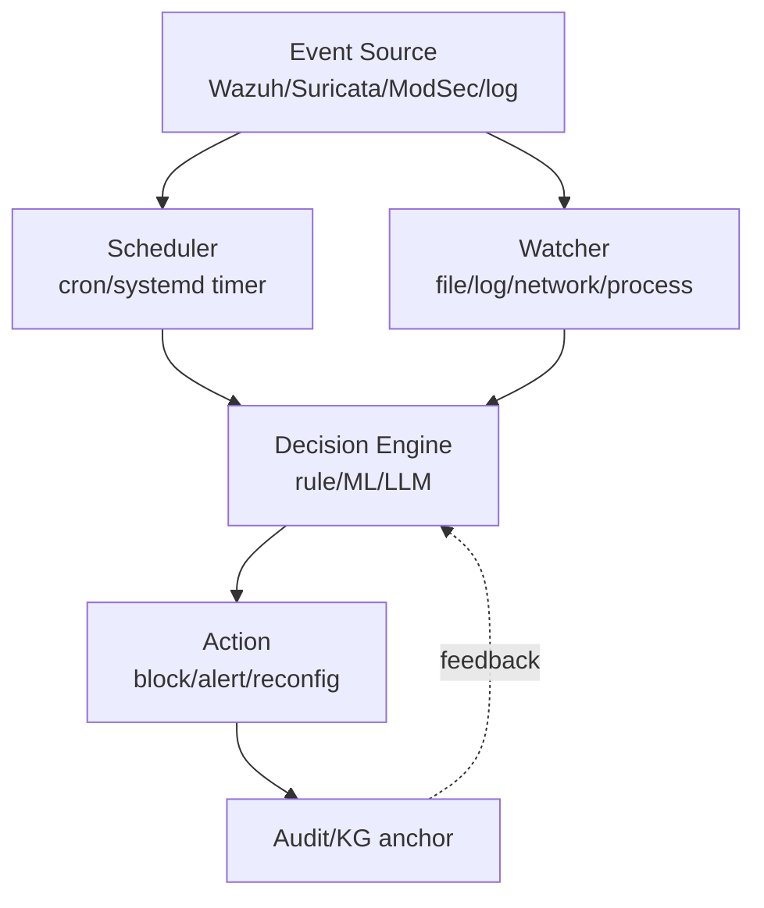
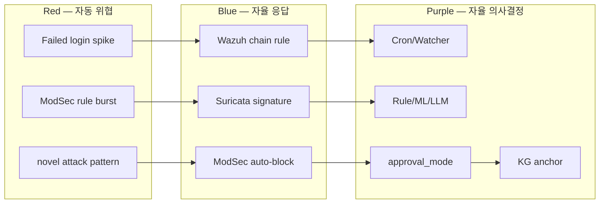

# W11 — 자율보안 (1): 개요 + 강화학습 + 스케줄러·왓처

> 본 주차는 **인공지능보안 (입문)** 의 11주차이며 자율보안 시리즈 (W11-W12) 의 첫 주차다.
> W08-W10에서는 AI 모델의 안전 평가에 집중했다면, 본 주차부터는 학생이 **24/7 자율 보안 시스템**의
> 운영을 학습한다. 학생 본인의 환경에서 cron, systemd timer, Bastion watchdog, Q-learning이
> 실제로 어떻게 동작하는지 손으로 직접 확인하는 실습 중심 주차다.

---

## 본 주차 개요

지금까지 학생은 AI 에이전트 (W05-W07) 와 그 안전 (W08-W10) 을 학습했다. 그런데 이 모든 학습에서 학생이 에이전트를 사용하는 방식은 항상 **"운영자가 명시적으로 chat을 호출하면 그때 에이전트가 응답한다"** 는 패턴이었다. 이걸 영어로 **on-demand** (요청 시점 응답) 라 부른다.

그런데 실제 운영의 보안 시스템은 24시간 365일 끊임없이 동작해야 한다. 한 가지 질문을 던져보자. 학생이 자고 있는 새벽 3시에 본인의 학습 환경에서 alert가 발생하면 누가 응답하는가? 운영자가 매번 호출하지 않아도 시스템이 어떻게 자율적으로 모니터링하고, 결정하고, 대응하는가?

이 질문의 대답이 본 주차의 학습 주제다.

본 주차의 학습 목표는 다음 네 가지다.

**첫째, 자율 보안의 5단계 이해.** 자동차 산업의 자율 주행 5단계 (L0-L5) 와 같은 분류가 보안에도 존재한다. 본인 환경에서 사용 중인 CCC Bastion이 어느 단계 (L2-L3) 에 위치하는지 파악한다.

**둘째, 강화학습 (Reinforcement Learning, RL) 의 기초 이해.** RL은 W03에서 학습한 ML 3분류 중 세 번째 카테고리다. 강아지를 훈련하듯 보상 (reward) 으로 학습하는 방식이다. 본 주차에서 학생이 Q-learning의 가장 간단한 형태를 본인 노트북의 Python으로 직접 실행한다.

**셋째, 자율 보안 운영의 10원칙 학습.** 권한 최소화, 명시적 확인, 감사 기록 같은 자율 시스템 운영의 안전 원칙이다. W10에서 학습한 6가지 에이전트 위협의 자연스러운 확장이다.

**넷째, 스케줄러와 왓처 패턴의 직접 가시화.** cron, systemd timer, file system watcher, log watcher 같은 자율 동작 trigger를 직접 학습한다. CCC의 nvd_cron, report_cron, bastion_watchdog이 실제로 어떻게 동작하는지 본인 host에서 직접 본다.

본 주차 종료 시점에 학생은 다음 네 가지를 할 수 있어야 한다. (1) 본인 host에서 cron 작업을 직접 작성하고 등록한다. (2) systemd timer의 의의와 cron 대비 장점을 설명할 수 있다. (3) Q-learning 5×5 미로 학습을 Python으로 직접 실행하고 결과를 해석한다. (4) CCC의 nvd_cron, report_cron, bastion_watchdog의 실제 동작을 본인 host에서 직접 가시화하고 분석한다.

이 모든 학습이 다음 주차 (W12) 의 자율 Blue, 자율 Red, RL Steering 본격 학습의 직접 전 단계다.

---

## 1차시 — 자율 보안의 직관 + 5단계 + 10원칙

### 1-1. 일상의 자율 — 자동 가습기 비유

학생이 보안 시스템의 자율을 이해하기 전에 일상의 친근한 자율 사례를 먼저 보자.

학생 방에 자동 가습기가 있다고 하자. 이 가습기는 다음처럼 동작한다.

- 가습기가 매 분마다 현재 습도를 측정한다.
- 측정한 습도가 40% 보다 낮으면 가습기가 자동으로 켜진다.
- 측정한 습도가 60% 보다 높으면 가습기가 자동으로 꺼진다.
- 학생은 가습기 버튼을 누르지 않는다.

이 가습기는 자율 (autonomous) 이다. 학생이 매번 의사결정을 내리지 않아도 가습기 스스로 측정 → 판단 → 행동을 반복한다. 학생은 자고 있는 동안에도 가습기가 잘 동작하는지 신경 쓰지 않는다.

또 다른 예가 학생 핸드폰의 알람 시계다. 매일 아침 6시 30분에 알람이 울리도록 한 번 설정해두면, 학생은 매일 밤 다시 확인할 필요가 없다. 핸드폰이 매일 정해진 시간에 자동으로 울리기 때문이다. 이것도 자율의 한 형태다.

자율의 핵심 정의는 다음과 같다.

> **자율 (Autonomous)** = 사람이 매번 의사결정에 개입하지 않아도, 시스템이 스스로 모니터링 → 분석 → 결정 → 행동의 사이클을 반복하는 것.

이 정의를 보안 세계로 옮겨보자.

### 1-2. 보안의 자율 — Wazuh 비유

학생이 보안 운영자라고 하자. 본인 학습 환경에 Wazuh가 설치되어 있고 매 초마다 alert가 발생한다. 만약 학생이 모든 alert를 직접 확인하려 한다면 다음 문제가 발생한다.

- 학생은 8시간 근무한 뒤 휴식이 필요하다. 야간, 주말, 공휴일의 보안 공백이 생긴다.
- 학생이 alert를 확인하고 대응하기까지 평균 30초~5분이 걸린다. ransomware 같은 빠른 공격은 그 사이에 모든 파일을 암호화한다.
- 학생 한 명이 1000대의 시스템을 동시에 모니터링하기는 불가능하다.

그래서 자동 가습기 패턴을 보안 시스템에 적용한다.

- 매 초마다 alert를 자동으로 측정한다.
- alert의 위험도를 자동으로 분류한다 (low / medium / high / critical).
- low면 자동으로 무시한다 (log만 기록).
- medium이면 자동으로 응답한다 (rule 자동 활성).
- high 또는 critical이면 운영자에게 즉시 알리고, 사람이 확인한 뒤 차단한다.

이것이 자율 보안 (Autonomous Security) 시스템의 기본 패턴이다. CCC Bastion이 본인 학습 환경에서 이 패턴을 직접 구현한 예다.

### 1-3. 자율의 5단계 — 자동차 비유

자율의 정도는 한 번에 100%가 되는 것이 아니다. 자동차 산업에는 자율 주행을 5단계 (L0-L5) 로 분류하는 SAE Level 표준이 있다.

| Level | 자동차에서의 의미 | 보안 시스템에서의 의미 | 보안 실제 사례 |
|-------|------------------|----------------------|----------------|
| L0 | 사람이 모든 운전 수행 | 사람이 모든 alert를 직접 의사결정 | 매뉴얼 운영자 |
| L1 | 차선 유지 보조 | LLM이 alert 분석을 보조, 사람이 결정 | ChatGPT의 알람 분석 보조 |
| L2 | 부분 자동 (어댑티브 크루즈) | rule 자동 배포는 자동, 위험한 mitigation은 사람이 확인 | AWS GuardDuty + Security Hub |
| L3 | 조건부 자율 (특정 도로만) | 정상 alert는 자동 처리, 비정상은 운영자에게 escalation | Microsoft Sentinel SOAR |
| L4 | 고도 자율 (대부분 자동) | 대부분 자동, 운영자는 drill만 검토 | CrowdStrike Falcon (2024+) |
| L5 | 완전 자율 (운전자 부재) | 운영자 없이 완전 자율 동작 | 현재 미달성 |

현재 산업의 보안 시스템은 대부분 L1-L2 수준이다. CCC Bastion은 L2-L3 학습 단계에 있다. 정상 alert의 자동 triage는 자동으로 수행하지만, 위험한 mitigation (iptables drop, container 격리 등) 은 사용자의 명시적 확인 (`auto_approve: False`) 을 강제한다.

본인 학습 환경에서 이 단계 차이를 직접 확인할 수 있다. `/chat` 호출 후 위험한 action이 필요한 경우 Bastion이 "이 action을 실행할까요? (yes/no)" 라고 다시 물어보고, 학생이 yes로 응답한 뒤에만 실제로 실행한다.

### 1-4. 자율 보안의 4가지 장점

자율 보안 시스템을 도입했을 때의 4가지 장점을 일상 비유와 함께 설명한다.

**장점 1: 24/7 운영.** 자동 가습기가 학생이 자는 동안에도 계속 동작하듯, 자율 보안 시스템은 야간·주말·공휴일에 생기는 보안 공백을 해소한다. 운영자는 8시간마다 휴식이 필요하지만, 시스템은 24시간 가동된다.

**장점 2: 빠른 응답 속도.** 사람 운영자가 alert를 확인하고 대응하기까지 보통 30초~5분이 걸린다. 자율 시스템은 같은 작업을 100ms~1초 이내에 끝낸다. ransomware 같은 빠른 공격에서는 100ms 차이가 전체 디스크 암호화 여부를 결정한다.

**장점 3: 일관된 정확도.** 사람은 야간 근무, 연속된 alert 처리, 단조로운 작업에서 정확도가 떨어진다. 자율 시스템은 시간이나 피로와 무관하게 일관된 정확도를 유지한다.

**장점 4: 확장성.** 운영자 한 명이 1000대의 시스템을 동시에 모니터링하는 것은 불가능하다. 자율 시스템은 100,000대 이상도 동시에 처리할 수 있다.

### 1-5. 자율 보안의 4가지 위험

장점만 있는 것은 아니다. 자율의 4가지 위험을 일상 비유와 함께 살펴본다.

**위험 1: 잘못된 자율 결정.** 자동 가습기가 욕실의 습한 공기를 잘못 측정해서 더 가습하면 곰팡이가 생긴다. 보안에서는 자율 시스템이 정상 사용자의 행위를 공격으로 오인해 차단하면 운영 가용성이 손실된다. AWS에서 정상 사용자가 자동 차단된 사례가 실제로 보고된 바 있다.

**위험 2: 공격자의 표적이 됨.** W08-W10에서 학습한 prompt injection, jailbreak, RAG poisoning 같은 위협이 자율 시스템의 자동 의사결정에 그대로 적용된다. 사람이 매번 확인하지 않는 자동 행동 자체가 공격자에게 매력적인 표적이 된다.

**위험 3: 책임 소재 모호.** 자율 시스템이 잘못된 결정을 내려 사고가 났을 때, 누가 책임을 지는지 불분명하다. AI 모델의 판단, 운영자의 설계, 벤더의 모델 자체, 운영 환경 변화 등 여러 요인이 얽혀 있어 책임 추적이 어렵다.

**위험 4: 편향 증폭.** 학습 데이터에 편향이 있으면 자율 의사결정에서 그 편향이 증폭된다. 예를 들어 특정 국가 IP만 자동 차단하는 식의 편향이나, 학습 데이터에 자주 등장한 특정 공격 패턴에는 과적합하면서 새로운 공격은 못 알아채는 일이 발생한다.

이 4가지 위험에 대응하는 것이 본 주차에서 학습할 10가지 운영 원칙의 목적이다.

### 1-6. 자율 보안의 architecture 패턴

자율 보안 시스템의 표준 architecture는 6개 구성 요소의 결합이다.



각 구성 요소의 역할을 학생 학습 환경의 예시로 설명한다.

- **Event Source.** 학습 환경의 Wazuh agent, Suricata, ModSec이 alert를 생성하는 출발점이다. `/var/ossec/logs/alerts/alerts.json` 같은 파일이 그 위치다.
- **Scheduler.** host의 cron 또는 systemd timer가 정기적으로 (예: 매일 03:00) 작업을 trigger한다.
- **Watcher.** host의 inotify, log tail 같은 실시간 모니터링 도구가 변화를 감지한다.
- **Decision Engine.** rule, ML, LLM 기반의 의사결정 로직이다. CCC Bastion의 `/chat`이 이 단계의 구현이다.
- **Action.** 차단, 알림, 재설정 같은 실제 시스템 변경을 수행한다. 단, Bastion의 default가 `auto_approve: False` 이므로 학생이 확인한 뒤에만 실제 동작이 일어난다.
- **Audit.** 모든 행동을 KG anchor와 log로 기록한다. 학생은 `/kg/audit` 으로 조회할 수 있다.

CCC Bastion의 architecture는 이 모델을 직접 구현한 것이다. `/chat` (Decision Engine), skill catalog (Action), KG anchor (Audit) 의 세 구성이 명확히 분리되어 있다.

### 1-7. 자율 보안 운영의 10원칙

W10 lecture에서 5개 원칙을 미리 소개했다. 본 주차에서 전체 10개를 학습한다. 앞 5개는 깊이 있는 예시와 함께, 뒤 5개는 한 줄 요약 형태로 다룬다.

**원칙 1: Principle of Least Privilege (최소 권한).** 에이전트에 task 수행에 꼭 필요한 최소 권한만 부여한다. 예를 들어 log 읽기 task에 root 권한을 주면 안 된다. 학습 환경의 Bastion이 가진 SAFE_TARGETS 정의가 이 원칙의 직접 구현이다. attacker VM (192.168.0.112), bastion VM, web server (192.168.0.100) 만 접근을 허용한다.

**원칙 2: Explicit Confirm (명시적 확인).** 고위험 작업은 사람의 명시적 확인을 강제한다. 학생이 Bastion `/chat`을 호출했을 때 일부 응답에서 "이 action을 실행할까요? (yes/no)" 를 묻는 것이 이 원칙이다. `auto_approve: False`가 그 구현이며, 4가지 위험 중 위험 1 (잘못된 자율 결정) 에 직접 대응한다.

**원칙 3: Audit Trail (감사 기록).** 모든 자율 행위를 영구 기록한다. 학습 환경의 Bastion은 `/chat` 호출마다 KG anchor를 기록한다. `/kg/audit?limit=20` 으로 직접 조회할 수 있다. 4가지 위험 중 위험 3 (책임 모호) 에 직접 대응한다.

**원칙 4: Timeout / Budget (제한).** step 수, token 수, 시간, 비용 같은 모든 자원에 절대 상한을 둔다. 예를 들어 Bastion의 ReAct cycle은 최대 5 turn으로 제한한다. 무한 loop를 방지한다.

**원칙 5: Kill Switch (긴급 중단).** 운영자가 비상시 자율 시스템을 즉시 정지시킬 수 있어야 한다. `systemctl stop bastion`, `kill -9 $(pidof python)`, `Ctrl-C` 같은 명령이 바로 사용 가능해야 한다. 학생도 자기 host에서 Bastion을 직접 정지시킬 수 있다. 4가지 위험 모두에 대한 마지막 안전 장치다.

남은 5개 원칙은 한 줄 요약만 한다. 본격 학습은 W12에서 자율 Blue/Red를 다룰 때 다시 만난다.

**원칙 6: Safe Defaults.** 의심스러운 입력이 들어오면 기본적으로 거부한다.
**원칙 7: Separation of Concerns.** 한 모듈이 너무 많은 권한을 갖지 않게 분리한다. CCC의 Master / Manager / SubAgent 3-layer가 이 원칙의 구현이다.
**원칙 8: Reversibility.** 자율 결정의 영향을 원복할 수 있어야 한다. 예: iptables drop은 600초 timeout으로 자동 해제된다.
**원칙 9: Transparency.** 의사결정의 이유를 가시화한다. Bastion의 ReAct trace (Thought / Action / Observation) 가 그 예다.
**원칙 10: Gradual Rollout.** 새 자율 기능은 작은 범위에서 점진적으로 확대한다. 한 번에 전체 환경에 적용하지 않는다.

### 1-8. 산업의 자율 보안 5사례

학생이 졸업 후 입사할 만한 보안 회사들이 운영하는 자율 시스템의 실제 사례를 알아둔다. 깊이 있는 설명은 1개만 하고, 나머지는 한 줄로 요약한다.

**사례 1 (깊이): AWS GuardDuty + Security Hub.** AWS 클라우드 환경의 자율 위협 탐지·응답 통합 platform이다. ML 기반 anomaly detection으로 비정상 API 호출, EC2의 비정상 통신, S3의 비정상 접근을 자동으로 탐지한다. Security Hub 통합 dashboard는 모든 alert를 한 화면에 보여준다. AWS Config가 규정 준수를 자동 점검한다. CCC Bastion의 architecture와 직접 닮아 있다 — Event (CloudTrail) + Scheduler (GuardDuty의 ML pipeline) + Decision (rule + ML) + Action (Security Hub의 자동 ticket) + Audit (CloudTrail의 영구 기록).

**사례 2 ~ 5 (한 줄):**
- **Microsoft Sentinel + Defender XDR** — Microsoft의 cloud SIEM + SOAR.
- **Palo Alto Cortex XSOAR** — 산업 표준 SOAR. 수백 개의 통합 playbook 제공.
- **CrowdStrike Falcon Charlotte AI** (2024) — GenAI 기반 endpoint 보안 자동 triage.
- **Splunk SOAR** — drag-and-drop 방식의 visual workflow.

**CCC Bastion의 위치.** 학생 학습 환경의 자율 보안 입문 platform이다. 본 강의 W11-W15에서 학생이 직접 경험한다.

---

## 2차시 — 강화학습 (RL) 입문

### 2-1. 강아지 훈련 — RL의 일상 비유

학생이 강아지를 훈련시키는 상황을 상상해보자. 학생은 강아지에게 "앉아" 명령을 가르치고 싶다.

- 학생이 "앉아"라고 말한다. 강아지가 처음에는 의자 위로 뛰어오른다. 학생은 간식을 주지 않는다.
- 다시 "앉아"라고 말한다. 강아지가 누워버린다. 학생은 간식을 주지 않는다.
- 다시 "앉아"라고 말한다. 강아지가 우연히 잠깐 앉는다. 학생이 그 순간 즉시 간식을 준다.
- 이 패턴을 100번 반복한다. 강아지는 "앉아"라는 명령에 "앉기" 행동으로 응답하는 법을 배운다.

이 학습 과정의 5가지 구성 요소를 정리해보자.

| 일상 비유 | RL 용어 | 의미 |
|-----------|---------|------|
| 강아지 | **Agent (에이전트)** | 학습의 주체 |
| 거실 | **Environment (환경)** | 에이전트가 동작하는 환경 |
| 강아지의 자세 | **State (상태, s)** | 환경의 현재 모습 |
| 앉기 / 뛰기 / 눕기 | **Action (행동, a)** | 에이전트의 선택 |
| 간식 | **Reward (보상, r)** | 행동에 대한 평가 |

이 다섯 가지가 강화학습 (Reinforcement Learning, RL) 의 핵심 구성이다. W03에서 학습한 ML 3분류 중 세 번째 카테고리다.

| ML 분류 | 학습 방식 | 일상 비유 |
|---------|----------|-----------|
| Supervised | (X, y) label로 학습 | 부모가 "이건 사과"라고 가르치는 학습 |
| Unsupervised | label 없이 패턴 학습 | 학생이 책을 스스로 분류하는 학습 |
| Reinforcement | reward로 학습 | 강아지가 간식으로 배우는 학습 |

### 2-2. 미로 — RL의 보안 비유

강아지 비유를 보안에 적용하면 다음처럼 매핑된다.

학습 환경의 WAF (Web Application Firewall) 가 자율적으로 학습한다고 하자.

| 강아지 비유 | WAF 보안 |
|-------------|----------|
| 강아지 (Agent) | WAF |
| 거실 (Environment) | 학습 환경의 web 트래픽 |
| 강아지 자세 (State) | 현재 트래픽 패턴 (분당 요청 수, 비정상 비율 등) |
| 앉기 (Action) | rule sensitivity 조정 (낮게/높게) |
| 간식 (Reward) | false positive 감소 + false negative 감소의 합 |

WAF가 처음에는 sensitivity를 무작위로 조정한다. 우연히 좋은 조정 (false positive 감소 + false negative 감소) 이 나오면 reward를 받는다. 이걸 100,000번 반복하면 WAF가 자기 운영 환경에 맞는 best sensitivity를 자동으로 찾아낸다.

이 보안 RL 응용은 본 주차 마지막 차시에서 학생이 직접 다룬다.

이제 RL의 가장 단순한 알고리즘인 Q-learning으로 들어가자.

### 2-3. 미로 시각화 — 5×5 grid world

Q-learning 학습의 가장 친근한 환경은 5×5 미로 (grid world) 다. 다음 미로를 상상해보자.

```
S . . . .
. . . . .
. . . . .
. . . . .
. . . . G
```

여기서 S는 시작 (Start), G는 목표 (Goal), `.`은 빈 칸이다. 에이전트 (강아지에 해당하는 게임 캐릭터) 가 S에서 출발해 G에 도달하는 것이 목표다.

에이전트가 할 수 있는 행동 (action) 은 4가지다 — 위 (Up), 아래 (Down), 왼쪽 (Left), 오른쪽 (Right). 한 step에 한 칸씩 움직인다.

reward (간식) 는 다음 규칙으로 부여된다.

- G에 도달하면 reward = +10 (아주 큰 간식).
- 일반 이동은 reward = -1 (빨리 도달하라는 작은 페널티).
- 벽 (미로 밖) 으로 이동하려 하면 위치는 그대로이고 reward = -1.

학생이 직관적으로 생각하면 최적 경로는 다음과 같다 — 오른쪽 4번 + 아래 4번 = 8 step, 또는 아래 4번 + 오른쪽 4번 = 8 step, 또는 그 중간의 어떤 8 step 조합. 8 step으로 도달했을 때 총 reward는 앞 7 step의 -1과 마지막 +10을 더해서 +3이다.

만약 에이전트가 무작위로만 움직인다면 평균 50~100 step 만에 G에 도달하고, 총 reward는 -40 ~ -90 정도로 형편없다. RL의 목표는 처음에는 무작위로 시작하지만 학습을 거치면서 에이전트가 자율적으로 8 step짜리 optimal path를 찾아내게 하는 것이다.

### 2-4. Q-table의 직관

학습의 핵심은 에이전트가 **각 위치 (state) 에서 각 행동 (action) 을 했을 때 얼마나 좋은지 기억하는 표** 다. 이 표를 Q-table 이라고 부른다.

| state (위치) | Up | Down | Left | Right |
|--------------|-----|------|------|-------|
| 0 (S) | 0 | 0 | 0 | 0 |
| 1 | 0 | 0 | 0 | 0 |
| 2 | 0 | 0 | 0 | 0 |
| ... | 0 | 0 | 0 | 0 |
| 24 (G) | 0 | 0 | 0 | 0 |

학습이 시작되는 시점에는 Q-table의 모든 값이 0이다. 에이전트는 아직 아무것도 모른다. 학습이 진행되면서 각 칸의 값이 갱신된다. 학습이 끝나면 Q-table은 다음처럼 보일 수 있다.

| state (위치) | Up | Down | Left | Right |
|--------------|-----|------|------|-------|
| 0 (S) | -10 | 3.2 | -10 | 4.5 |
| 1 | -3.5 | 4.0 | 2.8 | 5.1 |
| ... | ... | ... | ... | ... |
| 23 | -2 | 9.0 | 4.0 | 10.0 |

이 표를 어떻게 읽는지 보자. state 0 (S) 의 4가지 행동 점수를 비교한다. Right (4.5) > Down (3.2) > Up (-10, 벽) > Left (-10, 벽). 따라서 state 0에서 best action은 Right다.

학습이 끝난 뒤 에이전트의 의사결정은 단순하다 — 매 state에서 max(Q[s]) 가 가리키는 action을 선택한다. 이 방식을 **greedy policy** 라고 부른다.

### 2-5. Q-learning update — 손으로 1 step 계산해보기

학습의 매 step마다 다음 정보가 발생한다.

- 현재 state s — 예: state 0.
- 선택한 action a — 예: Right.
- 행동 결과로 받은 reward r — 예: -1 (벽이 아니라 정상 이동).
- 다음 state s' — 예: state 1.

이 네 가지 정보 (s, a, r, s') 의 묶음을 **transition** 이라 부른다. 학습의 한 step은 transition 하나를 처리하는 것이다.

Q-learning 공식을 보기 전에 먼저 손으로 한 번 계산해보자.

**상황 가정.** 학습이 어느 정도 진행된 시점이라고 하고, 현재 Q-table의 값이 다음과 같다고 하자.

- Q[0, Right] = 2.0 (현재 추정 값)
- Q[1, Up] = 1.5
- Q[1, Down] = 3.0
- Q[1, Left] = 0.5
- Q[1, Right] = 2.8

**관측한 transition.** (s=0, a=Right, r=-1, s'=1).

**update의 의미.** "Q[0, Right] 의 현재 추정값 (2.0) 을 진짜 값에 더 가깝게 옮긴다." 그렇다면 진짜 값이 무엇일까? "이 action으로 즉시 받은 reward (-1) 더하기, 다음 state에서 best action으로 받을 수 있는 점수 (max(Q[1]) = 3.0) 의 일부 (할인을 적용)" 이다.

**손계산.**

learning rate α = 0.1 (의견을 얼마나 빨리 바꿀지 — 한 번의 transition으로 의견의 10%만 갱신).
discount factor γ = 0.9 (미래 reward를 현재 가치로 얼마나 인정할지 — 즉시 받는 것 대비 90% 가치).

target (진짜 값의 추정) = r + γ × max(Q[s', a']) = -1 + 0.9 × 3.0 = -1 + 2.7 = 1.7.

error (현재 추정과 진짜 값의 차이) = target - Q[s, a] = 1.7 - 2.0 = -0.3.

update = α × error = 0.1 × (-0.3) = -0.03.

새 Q[0, Right] = 2.0 + (-0.03) = 1.97.

이 한 step의 의미는 "현재 (s, a) 의 Q 값을 새 정보 (실제 reward + 미래의 best Q) 쪽으로 작게 (10%) 옮겨라" 다. transition 한 번에 일어나는 변화는 작지만, 500 episode × 약 100 step = 50,000 step이 쌓이면 학습은 크게 진행된다.

### 2-6. Q-learning 공식 첫 등장

위에서 손계산한 내용을 일반 공식으로 처음 적어본다.

```
Q[s, a] ← Q[s, a] + α × (r + γ × max(Q[s', a']) - Q[s, a])
```

각 부분의 의미를 손계산 결과에 매핑해서 다시 보자.

- `Q[s, a] ← Q[s, a] + ...` — 현재 추정값을 갱신한다.
- `α × (...)` — 학습 속도 (예: 10%) 만큼만 반영한다.
- `r + γ × max(Q[s', a'])` — target (진짜 값의 추정).
- `... - Q[s, a]` — error (현재 추정과 진짜 값의 차이).

공식이 처음에 직관적으로 와닿지 않는다면 위 손계산을 한 번 더 따라가 본다. 5×5 미로의 한 step을 직접 손으로 계산해보면 공식이 자연스럽게 이해된다.

### 2-7. α / γ / ε — 3가지 hyperparameter 직관

위 손계산에서 α = 0.1과 γ = 0.9라는 두 숫자를 사용했다. 이 숫자는 학생이 학습 전에 직접 정하는 hyperparameter (학습 전 설정값) 다. 추가로 ε (epsilon) 이라는 값도 곧 등장한다.

**α (alpha) — learning rate.** 한 번의 transition으로 의견을 얼마나 바꿀지를 정한다. 일상 비유로는 "친구의 한마디를 얼마나 신뢰할지" 다. α = 0.1이면 친구 의견을 10%만 반영하고, α = 0.9면 90%까지 반영한다. α가 너무 크면 의견이 너무 빨리 바뀌어 학습이 불안정해진다. α가 너무 작으면 학습이 너무 느리다. 일반적으로 0.1 ~ 0.3을 권장한다.

**γ (gamma) — discount factor.** 미래 reward를 현재 가치로 얼마나 인정할지의 비율이다. 일상 비유로는 "오늘 받는 100원 vs 내년에 받는 100원의 가치" 다. γ = 0.9면 다음 step의 reward를 현재 가치의 90%로 인정한다. γ = 0.5면 50% (미래를 거의 무시), γ = 0.99면 99% (미래와 현재를 거의 동등하게 평가). γ가 작으면 에이전트는 단기적 best만 선택하고, γ가 크면 장기적 best까지 본다. 일반적으로 0.9 ~ 0.99를 권장한다.

**ε (epsilon) — exploration rate.** "지금까지 학습한 best를 그대로 쓸 것인가 (exploitation), 아니면 새 행동을 시도해볼 것인가 (exploration)" 의 균형을 정한다. 일상 비유로는 "단골 식당의 단골 메뉴를 시킬지 (exploitation), 새 메뉴를 시도할지 (exploration)" 다. ε = 0.1이면 90%는 단골, 10%는 무작위 시도다. ε = 0.5면 반반이다. ε가 너무 크면 학습이 불안정하고, 너무 작으면 local optimum (지역 최적해) 에 갇힌다. 일반적으로 0.1 ~ 0.3을 권장하거나, 학습이 진행될수록 점점 줄여가는 epsilon decay 방식을 쓴다.

이 3가지 hyperparameter가 5×5 grid world 학습에 실제로 어떤 영향을 주는지는 본 주차 lab의 step 3에서 학생이 직접 측정한다.

### 2-8. epsilon-greedy — exploration 패턴

매 step에서 action을 선택하는 표준 방식이 epsilon-greedy 다.

```
0과 1 사이의 난수를 뽑는다.
  if 난수 < ε:
      action = 무작위 선택 (exploration).
  else:
      action = argmax(Q[s]) — 현재 best 선택 (exploitation).
```

학습 초반에는 무작위 시도 비율이 높고, 학습이 진행될수록 무작위 비율이 줄어들면서 exploitation이 늘어나는 방식이 epsilon decay다.

### 2-9. RL 흐름 전체 정리

이제 강아지 훈련 비유, 5×5 미로, Q-table, update 손계산, hyperparameter 직관을 모두 합쳐서 RL 흐름을 전체적으로 정리한다.

```
초기 단계 — Q-table을 모두 0으로 초기화한다.

매 episode마다 반복:
  state = START.
  episode가 끝날 때까지 반복:
    1. action을 선택한다 (epsilon-greedy 방식).
    2. environment에서 action을 실행하고, reward와 next state를 받는다.
    3. Q-table을 update한다 (위 공식 적용).
    4. state = next state로 갱신한다.
    5. done이면 episode를 종료한다.

500 episode 학습 후 Q-table이 수렴한다.
```

이 흐름을 본인 host의 Python에서 직접 실행하는 것이 본 주차 lab step 3의 핵심 hands-on이다.

### 2-10. RL의 보안 응용 — Adaptive WAF (깊이 있는 예시)

5×5 미로 학습을 보안에 직접 응용한 깊이 있는 예시 한 가지를 본다.

**Adaptive WAF.** WAF (Web Application Firewall, 예: ModSec) 의 rule sensitivity를 자동 조정하는 응용이다.

- state — 현재 트래픽 패턴의 5가지 feature: (req_rate, anomaly_rate, fp_rate, fn_rate, time_of_day).
- action — rule sensitivity의 5단계 (OWASP CRS의 paranoia level 1~5).
- reward — `+1 × (사람이 confirm한 정확도)` `- 5 × (false positive로 정상 사용자가 차단된 수)` `- 10 × (false negative로 공격을 놓친 수)`.
- 학습 — 매일 24시간 트래픽을 모아 약 100,000 step의 학습을 누적한다.
- 결과 — WAF가 자기 운영 환경에 맞는 best sensitivity를 자동으로 찾아낸다.

**학생 학습 환경 적용 예시.** 6v6의 web target인 Juice Shop의 WAF paranoia level을 자동 학습시킨다. 초반에는 무작위로 시도하다가 정상 사용자를 차단하면 reward = -5를 받는다. 학습이 진행되면서 false positive와 false negative 둘 다 줄이는 best paranoia level을 자동으로 찾아낸다.

이 깊은 예시가 다른 5가지 보안 응용을 이해하는 기반이다. 나머지 5가지는 한 줄로 요약한다.

- **Autonomous Pentest** — 침투 테스트에서 다음 step을 자동 선택하도록 학습한다.
- **Honeypot Adaptation** — honeypot이 공격자에 맞춰 응답을 진화시킨다.
- **IDS Rule Optimization** — Suricata/Snort rule의 우선순위를 자동 조정한다.
- **Phishing Detection** — 새로운 phishing 패턴을 자율 학습한다.
- **CCC Bastion의 R5 learning loop** — 매 chat의 task_outcome (success/fail/score) 이 reward 역할을 한다.

### 2-11. RL의 4가지 한계

Q-learning 입문 학생이 알아둬야 할 한계 4가지다.

**한계 1: Sample Efficiency (샘플 효율).** RL 학습에는 수십만 ~ 수백만 sample이 필요하다. 작은 dataset만으로는 학습이 어렵다.

**한계 2: Distribution Shift (분포 변화).** 학습 환경과 실 운영 환경이 다르면 성능이 급격히 떨어진다. 학습 환경에서 best였던 정책이 새 환경에서는 best가 아닐 수 있다.

**한계 3: Reward Hacking (보상 해킹).** 에이전트가 의도와 다른 방식으로 reward를 최대화한다. 에이전트가 reward function의 허점을 찾아 의도와 다른 행동을 한다. 예를 들어 "alert 응답 시간 단축" 을 reward로 줬는데, 에이전트가 "모든 alert를 자동으로 dismiss" 하는 식으로 변질될 수 있다.

**한계 4: Safety Guarantee (안전 보장).** 학습 도중 위험한 action이 발생할 수 있다. 학습 과정 자체에서 안전을 강제하기가 어렵다.

이 4가지 한계에 대응하는 분야가 Safe RL이다. 학습 환경에서 안전을 강제하는 변형 4가지 — Constrained RL, Safe Exploration, Shielding, Human-in-the-loop RL — 가 있다. 본 강의 입문 학생은 이 4가지 변형이 존재한다는 것만 알아두면 충분하다.

### 2-12. Q-learning 후속 학습 예고

본 주차에서 학습한 Q-learning 다음에 이어지는 4가지 방향을 한 줄씩 예고한다.

- **DQN (2015) — deep Q-network.** Q-table을 신경망으로 대체한 방법. 큰 state space에서도 학습이 가능해진다.
- **Policy Gradient (PPO 등) — policy를 직접 학습.** Q-table을 거치지 않고 정책 자체를 학습한다.
- **Actor-Critic (A3C 등) — value와 policy 학습을 결합.**
- **AlphaGo / AlphaZero (2016) — Monte Carlo Tree Search와 RL의 결합.**

이 4가지의 본격 학습은 W12의 RL Steering 입문과, 졸업 후 AI 전공 과목에서 다룬다. 본 강의 입문 학생은 이 4가지가 존재한다는 것만 알아두면 충분하다.

또 한 가지 — LLM 학습 단계의 RLHF (Reinforcement Learning from Human Feedback) 도 본 주차에서 배운 Q-learning과 같은 RL 원리를 응용한 것이다. RLHF 본격 학습은 다음 주차 W12에서 이어진다.

---

## 3차시 — 스케줄러와 왓처 패턴

### 3-1. 자명종과 화재 경보기 — 일상 비유

자율 시스템에서 행동을 시작시키는 trigger는 두 종류다. 일상 비유로 먼저 설명한다.

**자명종 시계 — scheduled trigger.** 학생이 매일 아침 6시 30분에 알람을 맞춰두면, 시계가 매일 정확한 시간에 자동으로 울린다. 외부 사건과 무관하게 정기적인 시간만으로 작동한다. 보안에서 cron 작업이 바로 이 방식이다.

**화재 경보기 — event-driven trigger.** 화재 경보기는 매 시간마다 울리지 않는다. 대신 연기를 감지하는 순간 즉시 울린다. 정기적인 시간이 아니라 외부 사건에 응답해서 작동한다. 보안에서 watcher가 이 방식이다.

대부분의 자율 보안 시스템은 두 trigger를 함께 사용한다. 학습 환경에서 CCC의 cron 작업 (nvd_cron, report_cron) 과 bastion watchdog (event-driven) 의 결합이 그 예다.

### 3-2. Scheduled Trigger의 보안 적용

학습 환경에서 보안 정기 trigger를 사용하는 실제 사례 5가지다.

- 매일 03:00에 백업을 자동 수행한다.
- 매 5분마다 시스템 health check를 돌린다.
- 매일 NVD (National Vulnerability Database) 에서 새 CVE를 자동 sync한다.
- 매일 진행 보고서를 자동 작성하고 git commit한다.
- 매주 보안 점검을 자동 수행한다.

이 중 앞 두 가지는 학생이 자기 host에 cron으로 직접 등록해본다. 뒤 3가지는 CCC가 이미 운영 중인 cron 작업으로, 학생이 직접 가시화한다.

### 3-3. cron — Linux 표준 scheduler

cron의 한 줄 형식을 단어별로 풀어본다.

```bash
0 3 * * * /usr/local/bin/backup.sh
```

이 한 줄을 위치별로 분해하면 다음과 같다.

| 위치 | 값 | 의미 |
|------|-----|------|
| 1 (분) | 0 | 매 시 0분 |
| 2 (시) | 3 | 오전 3시 |
| 3 (일) | * | 매일 |
| 4 (월) | * | 매월 |
| 5 (요일) | * | 모든 요일 |
| 6 (명령) | /usr/local/bin/backup.sh | 실행할 명령 |

따라서 이 한 줄은 "매일 오전 3시 정각에 backup.sh를 자동 실행" 이라는 뜻이다.

다른 예시도 단어별로 본다.

```bash
*/5 * * * * /usr/local/bin/health-check.sh
```

| 위치 | 값 | 의미 |
|------|-----|------|
| 1 (분) | */5 | 매 5분마다 (0, 5, 10, …) |
| 2 (시) | * | 매 시 |
| 3~5 | * * * | 매일, 매월, 모든 요일 |
| 6 | health-check.sh | health check |

해석: 매 5분마다 health-check.sh를 자동 실행한다.

또 다른 예.

```bash
0 0 * * 0 /usr/local/bin/weekly-report.sh
```

매주 일요일 (요일 = 0) 자정 (시 = 0, 분 = 0) 에 weekly-report.sh를 실행한다.

### 3-4. cron 직접 등록 — 학생 hands-on

학생이 자기 host에서 cron을 직접 등록하는 명령을 학습한다.

```bash
# 현재 cron 목록 확인
crontab -l

# 새 cron 등록 (편집기 열림)
crontab -e

# 편집기를 거치지 않고 한 줄 추가
(crontab -l 2>/dev/null; echo "*/5 * * * * /home/student/health.sh") | crontab -

# 특정 cron 줄만 제거 (crontab -e로 편집하지 않고 직접 명령으로)
crontab -l | grep -v 'health.sh' | crontab -
```

학생은 위 명령을 본 주차 lab의 step 1에서 자기 host에 직접 실행해본다.

### 3-5. systemd timer — cron의 modern 대안

cron의 단점 4가지와, systemd timer가 어떻게 그것을 보완하는지 정리한다.

| cron의 단점 | systemd timer의 장점 |
|-------------|---------------------|
| 의존성 관리 없음 | service 의존성 명시 가능 (After, Requires) |
| 실패 시 알림 없음 | journalctl 로그 + email 통합 |
| 환경 변수 부족 | service environment 명시 가능 |
| 동시 실행 방지 없음 | RemainAfterExit, ExecStart 등으로 제어 |

systemd timer 예시 — 매 10분마다 backup 실행.

```ini
# /etc/systemd/system/backup.timer
[Unit]
Description=Run backup every 10 minutes

[Timer]
OnBootSec=5min
OnUnitActiveSec=10min

[Install]
WantedBy=timers.target
```

```ini
# /etc/systemd/system/backup.service
[Unit]
Description=Backup job

[Service]
Type=oneshot
ExecStart=/usr/local/bin/backup.sh
```

활성화 명령.

```bash
sudo systemctl daemon-reload
sudo systemctl enable backup.timer
sudo systemctl start backup.timer
systemctl list-timers
```

학생은 본 주차 lab step 1 후반에서 자기 host에서 `systemctl list-timers`를 직접 실행해본다.

### 3-6. CCC nvd_cron의 실제 trace

학습 환경의 CCC가 운영 중인 nvd_cron의 실제 동작을 학생이 직접 가시화한다.

**nvd_cron이 하는 일.** 매일 NVD에서 새 CVE를 자동으로 sync한다. NVD API를 호출해 새 CVE를 JSON으로 받아오고, CCC의 KG에 anchor로 자동 기록한다.

**하루 동안 일어나는 실제 흐름.**

- 03:00:00 — cron이 trigger된다.
- 03:00:01 — nvd_cron.sh 실행이 시작된다.
- 03:00:02 — NVD API를 호출한다 (예: `https://services.nvd.nist.gov/rest/json/cves/2.0`).
- 03:00:15 — JSON 응답 수신이 완료된다.
- 03:00:16 — JSON을 parsing해 새 CVE를 추출한다 (예: 50건).
- 03:00:18 — Bastion의 `/kg/anchor`를 호출해 50개의 CVE anchor를 기록한다.
- 03:00:20 — `results/nvd_cron.log`에 결과를 기록한다.

학생은 자기 host에서 `tail -20 /home/opsclaw/ccc/results/nvd_cron.log`로 직접 가시화한다. 이것이 본 주차 lab step 1의 hands-on 중 하나다.

또 다른 CCC cron 작업으로 **report_cron** 이 있다. 정기적으로 진행 보고서를 자동 작성하고 git commit + push까지 한다. 로그는 `results/retest/report_cron.log` 에 남는다.

### 3-7. Watcher — 화재 경보기 방식의 보안

watcher의 5가지 패턴과 그 보안 적용을 정리한다.

| 패턴 | 일상 비유 | 보안에서의 의미 |
|------|----------|----------------|
| **File System Watcher** | 도둑 발자국 즉시 감지 | 파일의 modify/create/delete 즉시 감지 |
| **Log Watcher** | 알람 메시지 즉시 읽기 | 로그 파일의 새 줄에 즉시 응답 |
| **Network Watcher** | 모든 출입구 모니터링 | 네트워크 traffic을 packet 수준에서 분석 |
| **Process Watcher** | 새 사람 출입 즉시 감지 | 새 프로세스 생성 즉시 감지 |
| **Database Watcher** | 금고 변화 즉시 감지 | DB row 변경을 실시간으로 감지 |

이 5가지 중 깊이 있게 보는 것은 1개 (File System Watcher) 만 다루고, 나머지 4가지는 한 줄로 요약한다.

### 3-8. File System Watcher 깊이 — inotify

Linux의 inotify 도구로 파일의 modify/create/delete를 실시간 감지한다.

```bash
# inotify-tools 설치
sudo apt install inotify-tools

# 디렉터리 모니터링 — modify/create/delete 감지
inotifywait -m -e modify,create,delete /etc/
```

이 명령은 `/etc/` 아래의 모든 변경을 실시간으로 stdout에 출력한다. 보안에서는 `/etc/passwd`, `/etc/shadow`, `/etc/ssh/sshd_config` 같은 중요 파일이 무단으로 변경되는 순간을 잡아낸다.

학습 환경에서는 Wazuh의 FIM (File Integrity Monitoring) 이 이 패턴을 직접 구현하고 있다. Wazuh의 ossec.conf에서 `<syscheck>` 설정으로 활성화한다.

```xml
<syscheck>
  <directories check_all="yes" report_changes="yes">/etc</directories>
  <directories check_all="yes" report_changes="yes">/usr/bin</directories>
  <frequency>3600</frequency>
</syscheck>
```

이 설정은 `/etc`와 `/usr/bin`을 매 1시간마다 무결성 검사하고, 변경이 감지되면 즉시 alert를 발생시킨다.

### 3-9. 나머지 4가지 watcher 한 줄 요약

**Log Watcher.** `tail -f` 와 grep의 결합으로 동작한다. Fluentd, Vector, Promtail 등이 산업 표준 도구다.

**Network Watcher.** tcpdump, Suricata로 packet을 실시간 분석한다. netflow, sflow는 traffic 통계를 수집한다.

**Process Watcher.** `/proc` 디렉터리와 systemd의 process state를 모니터링한다. 새 프로세스 생성을 즉시 감지한다.

**Database Watcher.** DB의 trigger, WAL (Write-Ahead Log), replication을 활용한다.

### 3-10. CCC Bastion watchdog의 실제 trace

학습 환경의 bastion_watchdog 동작을 학생이 직접 가시화한다.

**bastion_watchdog이 하는 일.** Bastion의 health를 주기적으로 자동 검증한다.

**1분 동안 일어나는 실제 흐름.**

- 00:00 — watchdog이 trigger된다 (cron 매분 또는 systemd timer OnUnitActiveSec=60s).
- 00:01 — `curl -s http://192.168.0.103:8003/health` 를 호출한다.
- 00:02 — JSON 응답을 받는다.
- 00:03 — `kg.all_modules_loaded == true` 인지 확인한다.
- 00:03 — `graph_nodes` 와 `history_anchors` 값을 기록한다.
- 00:04 — 이전 호출의 값과 비교해 증가 추세를 확인한다.
- 00:05 — 이상이 있으면 stderr에 `[KG-WARN]` 을 출력하고, 옵션으로 email alert를 발송한다.
- 00:06 — `results/retest/bastion_watchdog.log` 에 결과를 기록한다.

학생은 자기 host에서 `tail -20 /home/opsclaw/ccc/results/retest/bastion_watchdog.log` 로 직접 가시화한다. 이것이 본 주차 lab step 2의 hands-on이다.

### 3-11. 의사결정의 4가지 패턴

자율 시스템이 의사결정을 내리는 방식 4가지를 정리한다.

**Rule-based.** 명시적인 IF-THEN 규칙을 사용한다. 일상 비유로는 식당의 정해진 메뉴다. 장점은 가시성과 디버깅이 쉽다는 것이고, 단점은 새 상황에 대응하기 어렵다는 것이다.

**ML-based.** 학습된 패턴으로 응답한다. 일상 비유로는 경험 많은 직원의 직감이다. 장점은 새 패턴에도 일반화가 가능하다는 것이고, 단점은 hallucination과 편향이 발생한다는 것이다.

**LLM-based.** 자연어 context를 보고 의사결정한다. 일상 비유로는 친구와 대화하면서 결정하는 방식이다. 장점은 다양한 입력에 응답할 수 있다는 것이고, 단점은 token 비용, 환각, 속도 문제다.

**Hybrid.** 위 3가지를 결합한 방식이다. 일상 비유로는 메뉴(rule) + 직원 추천(ML) + 친구 의견(LLM) 을 함께 보는 것과 같다. CCC Bastion의 default가 이 hybrid다 — rule + LLM + KG의 결합. 명확한 alert는 rule로 즉시 처리하고, 모호한 alert는 LLM을 호출하며, 학습 결과는 KG에 누적한다.

### 3-12. 자율 action의 6분류와 권한 위계

자율 시스템이 수행할 수 있는 action을 위험도별로 6가지로 분류한다. W10 lecture에서 미리 본 분류를 다시 학습한다.

| 분류 | 위험도 | 일상 비유 | 보안 예시 |
|------|--------|-----------|-----------|
| observe | 매우 낮음 | 창문 밖을 보기 | 로그 읽기, alert 보기 |
| notify | 낮음 | 친구에게 메시지 보내기 | Slack, 이메일 통보 |
| prepare | 낮음 | 가스 잠금 준비 확인 | playbook 가시화 (실제 적용은 안 함) |
| mitigate | 중간 | 현관문 잠그기 | iptables drop, 격리 |
| reconfigure | 높음 | 집 구조 변경 | nginx config 변경 |
| destroy | 매우 높음 | 집 파괴 | DB row 삭제, 컨테이너 삭제 |

이 분류에 권한 위계를 적용한 것이 CCC Bastion의 approval_mode 3단계다.

- **normal (default).** max_level = mitigate. observe, notify, prepare, mitigate까지만 허용한다. reconfigure와 destroy는 거부된다.
- **danger_danger.** max_level = reconfigure. 위 4가지에 더해 reconfigure까지 허용한다. destroy는 여전히 거부된다.
- **danger_danger_danger.** max_level = destroy. 모든 action을 허용한다. 매우 신중하게 사용해야 한다.

학생은 자기 학습 환경의 Bastion `/chat` 호출에 `approval_mode`를 명시해보는 것을 lab step 5에서 직접 hands-on으로 한다.

### 3-13. R/B/P 본 주차 시나리오



#### 3-13.1 R/B/P 상세 — 자율보안 의 cron + watcher + RL 통합

본 주차 의 R/B/P 의 핵심 = **Purple 의 자동화 정도 가 W05-W10 보다 한 단계 증가**.
W05-W10 = 운영자 의 chat 호출 → Bastion 응답. W11 = cron / watcher 의 자동 trigger →
Bastion 의 자율 의사결정 (rule/ML/LLM/hybrid).

**Coverage Matrix — 3 자동 위협 × 3 자율 응답 × 4 의사결정 패턴**

| 자동 위협 | trigger 의 source | Bastion 의 자율 응답 | 의사결정 패턴 | approval_mode |
|----------|-----------------|---------------------|------------|---------------|
| **① Failed login spike** | watcher (Wazuh agent ship) | 1) rule 의 sshd_failed > 10/min → 즉시 차단 | rule-based (즉시) | "allow" (자동 적용) |
| **② ModSec rule burst** | watcher (audit log realtime) | 2) Bastion LLM 의 alert triage → 정확도 분석 → 차단 | hybrid (rule + LLM) | "review" (사람 검토 후 적용) |
| **③ novel attack pattern** | cron 주기 (5분) | 3) Bastion LLM 의 unknown pattern 의 자연어 분석 + KG 사전 검색 | LLM-based | "deny" (사람 승인 필수) |

**시간선 — Failed login spike 의 자율 응답 의 1 cycle**

```
T+0      Red attacker 의 SSH brute (hydra) 시작
         └→ web (10.20.32.80) 의 sshd 의 실패 100+ 매 분

T+10s    Watcher (Wazuh agent ship) 의 트리거
         └→ Wazuh agent 의 sshd_failed event 의 manager 전송
         └→ alerts.json 의 rule 5710 의 burst 매치

T+15s    Bastion 의 cron (1분 주기) + watcher (rule 5710 의 burst) 의 결합
         └→ /var/log/wazuh/alerts.json 의 monitor 의 trigger
         └→ Bastion 의 자율 처리 시작 (운영자 의 chat 호출 X)

T+15s+1s 의사결정 — rule-based (즉시)
         └→ rule = "sshd_failed > 10/min in last 5min by same src" → match
         └→ approval_mode = "allow" (사전 등록 의 자동 처리)
         └→ Bastion 의 자동 action = nft_block(src=10.20.30.202, duration=1h)

T+15s+5s nft 룰 적용 (Bastion → fw 의 nft 명령)
         └→ ssh 6v6-fw "nft add element ip filter blacklist { 10.20.30.202 }"
         └→ 효과 확인 = Wazuh alert 의 신규 발생 의 정지

T+1m     KG anchor 기록 (자율 task_outcome)
         └→ task_outcome = "auto_block_ssh_brute_2026-05-16_1430"
         └→ skills_used = [wazuh_alert_recent, nft_block, kg_anchor_record]
         └→ approval_mode = "allow"
         └→ human_review = false

T+5m     운영자 의 사후 검토 (정기, 5분 주기 의 review dashboard)
         └→ 자동 처리 의 5개 task 의 검토
         └→ 4개 = 정상 / 1개 = 의심 (false positive) → manual rollback

T+1d     RL Steering (W12 예고)
         └→ false positive 의 1개 사건 의 dataset 추가
         └→ rule 의 threshold 의 RL 의 자동 조정 (현재 10/min → 15/min)
         └→ 다음 주기 = false positive 의 감소
```

**R/B/P 의 핵심 인사이트 (5 항)**

1. **자율 의 의사결정 의 4 패턴 의 사용** — rule (즉시) + ML (학습 패턴) + LLM (자연어
   context) + hybrid (조합). 운영 환경 = hybrid 의 default. rule = 명확 한 case 의
   즉시 처리, LLM = 모호 한 case 의 분석.

2. **approval_mode 의 3 등급** — allow (자동 적용) / review (사람 검토 후 적용) / deny
   (사람 승인 필수). action 의 risk score 에 따른 default = 운영 의 안전 조절.

3. **watcher 의 source 의 다양성** — file system (inotify) + log (tail -f) + process
   (/proc) + DB (trigger/WAL) + API (polling). 각 source 의 trade-off + 통합 의 KG
   anchor 의 base.

4. **cron + watcher 의 결합 의 이중 안전망** — cron 의 주기 (1분/5분/1시간) + watcher
   의 event-driven 의 결합 = 한 source 의 fail 시 의 다른 source 의 보강. zero
   downtime 의 detection.

5. **사후 검토 의 sampling** — 자율 처리 의 100% 검토 = 운영자 의 burden. 5% sampling
   + false-positive 사건 의 100% 검토 = 효율 + 안전 의 trade-off.

### 3-14. 본 주차 hands-on — lab 5 step

본 주차 lab yaml과 lecture를 직접 매핑한다.

| step | 매핑되는 lecture 절 |
|------|---------------------|
| 1 | 3-3 ~ 3-5 의 cron, systemd timer 직접 가시화 + 3-6 의 nvd_cron trace |
| 2 | 3-10 의 bastion_watchdog 직접 모니터링 |
| 3 | 2-3 ~ 2-9 의 Q-learning 5×5 미로를 Python으로 직접 실행 |
| 4 | 3-11 의 Hybrid 의사결정 Python demo |
| 5 | 3-12 의 action 6분류 + approval_mode 직접 가시화 |

각 step의 평가 기준은 학생이 lecture의 해당 절 내용을 본인 말로 응답할 수 있는지 여부다.

---

## 본 주차 정리

본 주차는 학생이 자율 보안 시스템 운영의 첫 단계를 학습하는 실습 중심 주차였다. 핵심 8가지는 다음과 같다.

1. **자율 보안의 5단계 (L0-L5).** 자동차 SAE Level 비유 + CCC Bastion의 L2-L3 위치.
2. **자율 보안의 4장점과 4위험.** 24/7, 속도, 일관성, 확장성 4장점과 잘못된 결정, 공격 표적, 책임 모호, 편향 증폭 4위험.
3. **자율 보안 architecture.** Event / Scheduler / Watcher / Decision / Action / Audit 6구성.
4. **10가지 운영 원칙.** Least Privilege, Explicit Confirm, Audit Trail, Timeout, Kill Switch 5가지를 깊이 있게 + 나머지 5가지를 한 줄씩.
5. **RL의 5구성.** Agent / Environment / State / Action / Reward를 강아지 훈련 비유로.
6. **Q-learning update.** 5×5 미로의 한 step 손계산 + α / γ / ε 일상 비유.
7. **Scheduler + Watcher.** cron / systemd timer + file / log / network / process / DB 5가지 watcher 패턴.
8. **의사결정 4패턴과 action 6분류.** rule / ML / LLM / hybrid + observe ~ destroy + approval_mode 3단계.

---

## 자기 점검

학생이 본 주차 학습 후 답할 수 있어야 하는 8가지 질문이다.

- 자율의 5단계 (L0-L5) 를 일상 예시와 보안 예시로 설명할 수 있는가?
- 자율의 4장점과 4위험을 설명할 수 있는가?
- 자율 architecture의 6구성과 CCC Bastion의 매핑을 설명할 수 있는가?
- 10원칙 중 5가지를 깊이 있게 설명할 수 있는가?
- RL의 5구성 (Agent / Environment / State / Action / Reward) 을 강아지 비유로 설명할 수 있는가?
- Q-learning update를 손계산으로 한 step 해볼 수 있는가?
- α / γ / ε 3가지 hyperparameter를 일상 비유로 설명할 수 있는가?
- action 6분류와 approval_mode 3단계를 설명할 수 있는가?

---

## 다음 주차

**W12 — 자율보안 (2): 자율 Blue + 자율 Red + RL Steering**

본 주차의 자율 architecture, RL, scheduler/watcher 학습 위에서, W12는 다음 3가지 주제를 본격적으로 다룬다.

- **자율 Blue (방어 자동화).** Wazuh active-response 직접 구현 + 자율 Blue 6단계 워크플로우 (Observe / Enrich / Triage / Prepare / Mitigate / Learn).
- **자율 Red (공격 자동화).** 학습 환경에 한정된 자율 pentest의 윤리적 경계 + AutoPentest-DRL, PentestGPT, MITRE Caldera 같은 도구.
- **RL Steering.** LLM의 inference 시점 응답 조정에 관한 최신 연구. 본 주차에서 배운 Q-learning RL이 LLM 학습 (RLHF) 과 응답 조정 (ACT) 에 어떻게 응용되는지 학습한다.
