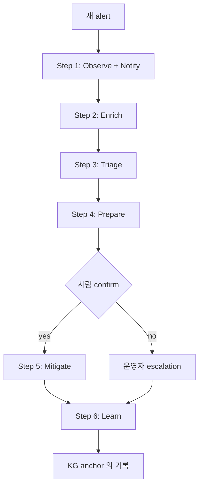
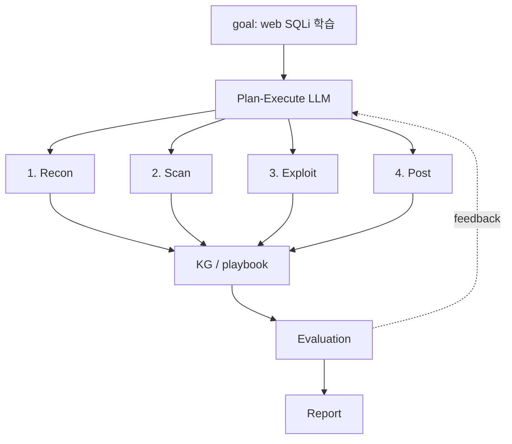
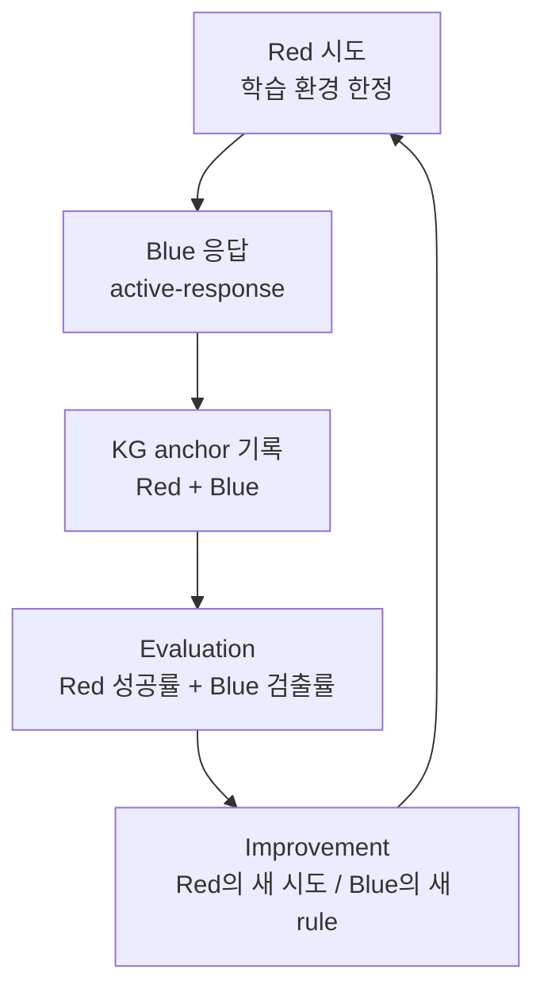
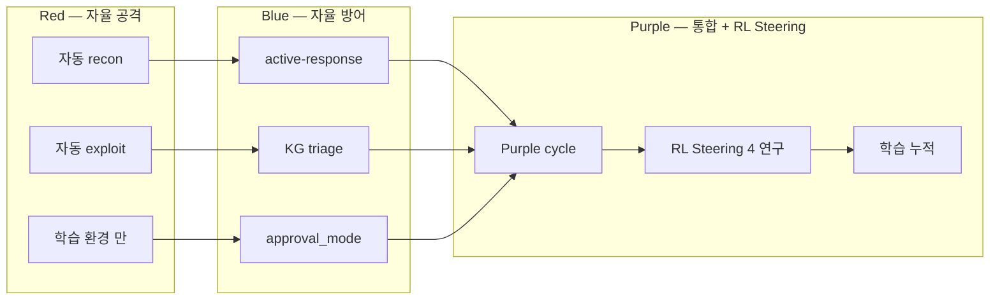

# W12 — 자율보안 (2): 자율 Blue + 자율 Red + RL Steering

> 본 주차는 **인공지능보안 (입문)** 의 12주차이며 자율보안 시리즈 (W11-W12) 의 마지막 주차다.
> W11에서 학습한 자율 architecture, Q-learning RL, scheduler/watcher 위에서, 본 주차는
> **자율 방어 (Blue), 자율 공격 (Red), RL Steering의 LLM 응용** 을 학생이 구체적으로 직접
> 경험한다. W13의 IR 학습으로 가는 직접 전 단계다.

---

## 본 주차 개요

W11 학습이 끝난 시점에 학생은 다음 4가지 능력을 갖췄다.

- 자율 architecture 6구성 (Event / Scheduler / Watcher / Decision / Action / Audit) 이해.
- Q-learning 5×5 미로 손계산 + Python 실행.
- cron, systemd timer 직접 등록 + CCC nvd_cron의 실제 trace 가시화.
- 의사결정 4패턴 (rule / ML / LLM / hybrid) + action 6분류 + approval_mode 3단계.

그런데 학생은 학습 환경에서 다음 4가지 질문을 던지게 된다.

- 자율 architecture 6구성이 실제 운영의 Blue (방어) 에서는 어떻게 작동하는가?
- 자율 공격 (Red) 을 학습 환경에서 해도 되는가? 윤리적 경계는 어디까지인가?
- W11에서 배운 Q-learning RL이 ChatGPT나 Claude 같은 LLM 학습에는 어떻게 응용되는가?
- LLM 학습은 비용이 매우 큰데, 학습을 거치지 않고 inference 시점에 응답을 조정할 수는 없는가?

이 4가지 질문에 답하는 것이 본 주차의 학습 주제다.

본 주차의 학습 목표는 다음 네 가지다.

**첫째, 자율 Blue (방어 자동화) 의 6단계 워크플로우.** 응급실의 환자 처리를 일상 비유로 보고, Observe → Enrich → Triage → Prepare → Mitigate → Learn 6단계를 정리한 뒤, Wazuh active-response를 학습 환경에서 직접 가시화한다.

**둘째, 자율 Red (공격 자동화) 의 윤리적 경계.** 합법적인 자물쇠 점검 대 무단 침입을 일상 비유로 보고, 6가지 윤리 필수 항목을 학습한 뒤, 학생 활동을 학습 환경 (6v6, Juice Shop, attacker VM 192.168.0.112) 안으로 한정한다.

**셋째, RL Steering의 LLM 응용.** W11의 Q-learning RL을 LLM 학습 (RLHF) 과 응답 조정 (Activation Steering) 에 응용하는 방법을 학습한다. 학습 비용을 들이지 않고 inference 시점의 응답 방향을 dial로 조정한다는 발상이다.

**넷째, 자율 Purple cycle.** Blue + Red + KG 학습을 통합한 자율 학습 한 cycle을 학생이 자기 환경에서 시뮬레이션한다.

본 주차 종료 시점에 학생은 (1) 자율 Blue 6단계를 직접 설계하고, (2) Wazuh active-response를 직접 가시화하며, (3) 자율 Red의 mini demo (학습 환경 dry-run) 를 돌려보고, (4) RL Steering 4가지 연구를 일상 비유로 설명할 수 있어야 한다.

---

## 1차시 — 자율 Blue (방어 자동화)

### 1-1. 응급실의 환자 처리 — 일상 비유

자율 Blue 6단계를 가장 친근하게 이해할 수 있는 비유가 병원 응급실 (Emergency Room, ER) 의 환자 처리 흐름이다.

학생이 응급실에 환자로 갔다고 하자. 의료진의 처리 흐름은 다음 6단계다.

| 단계 | 응급실의 처리 | 의미 |
|------|--------------|------|
| 1 | 접수 + 호명 | 환자 발견 + 등록 |
| 2 | 활력 측정 (혈압 / 맥박 / 체온) | 환자에 대한 추가 정보 수집 |
| 3 | 삼분류 (triage, 응급/긴급/일반) | 위험도 분류 |
| 4 | 처방전 준비 (의사 확인 전) | 권장 처치 준비 |
| 5 | 의사 확인 후 처치 | 실제 의료 행위 |
| 6 | 차트 기록 + 후속 환자에 활용 | 사후 학습 |

핵심은 다음과 같다. 응급실 의료진은 환자 한 명의 처리가 다른 환자의 처리와 연결된다 — 같은 증상의 환자를 처리한 경험이 쌓이면 다음 환자 처리가 빨라진다.

이 응급실 6단계를 보안에 그대로 옮긴 것이 자율 Blue 6단계 워크플로우다.

### 1-2. Wazuh의 alert 자율 처리 — 보안 비유

학습 환경의 Wazuh가 매 초마다 alert를 발생시킬 때, 자율 Blue 6단계가 어떻게 작동하는지 응급실과 매핑한다.

| 단계 | 자율 Blue의 처리 | 응급실과의 매핑 |
|------|----------------|----------------|
| 1 (Observe) | Wazuh alert를 SIEM에 통합 + Slack 자동 알림 | 환자 접수 |
| 2 (Enrich) | srcip의 GeoIP, asset DB, CTI 정보를 자동 결합 | 활력 측정 |
| 3 (Triage) | LLM이 5W를 자동 응답 + 위험도 분류 + KG에서 과거 처리 검색 | 삼분류 |
| 4 (Prepare) | playbook 자동 가시화 (실제 적용은 안 함) | 처방전 준비 |
| 5 (Mitigate) | 사람이 confirm한 뒤 자동 차단 (iptables drop 등) | 의사 확인 후 처치 |
| 6 (Learn) | task_outcome anchor를 KG에 자동 기록 | 차트 기록 + 후속 학습 |

핵심은 **Step 5 mitigate의 사람 confirm 강제** 다. 이것이 W11에서 학습한 10원칙 중 원칙 2 (Explicit Confirm) 의 직접 구현이다. 응급실에서 의사 확인 없이 환자를 처치하면 안 되는 것과 같은 논리다.

### 1-3. 자율 Blue 6단계 상세

각 단계의 의미와 학습 환경 매핑을 자세히 본다.

**Step 1: Observe + Notify (제약 없이 적용 가능).**

- 의미: Wazuh, Suricata, ModSec의 alert를 SIEM에 통합하고, Slack, 이메일, SMS로 자동 알림한다. 운영자가 즉시 인지하게 한다.
- 학습 환경: `/var/ossec/logs/alerts/alerts.json` 의 각 alert를 watcher가 즉시 감지한다 (W11 lecture 3-7의 file system watcher 응용).
- 위험: 낮음. 의사결정을 하지 않고 단지 관찰과 알림만 한다.
- 운영 원칙: 모든 alert에 자유롭게 적용 가능하다.



**Step 2: Enrich (제약 없이 적용 가능).**

- 의미: alert의 srcip를 GeoIP, asset DB, CTI (Cyber Threat Intelligence) 와 자동으로 결합한다. 추가 context가 다음 단계 판단에 유리하다.
- 학습 환경: GeoIP database (MaxMind의 무료 GeoLite2) + 학습 환경 asset list (192.168.0.0/24) + 사전 sync된 CTI mirror를 사용한다.
- 외부 API 호출이 필요한 경우 (CTI feed) 는 폐쇄망인 학습 환경에서 사전 sync된 mirror를 쓴다.
- 위험: 낮음. context를 수집만 하고 실제 행동은 하지 않는다.

**Step 3: Triage (제약 없이 적용 가능).**

- 의미: LLM이 5W (When / Where / Who / What / How) 를 자동 응답하고 위험도를 분류한다 (low / medium / high / critical). KG에서 과거 유사 alert 처리 이력을 검색한다 (PE — Past Experience 재사용).
- 학습 환경: CCC Bastion의 master agent가 이 단계를 구현한다. `/chat` 호출로 5W 응답과 KG search가 자동으로 수행된다.
- 위험: 낮음. 분류 결과만 산출하고 실제 행동은 하지 않는다.
- 운영 원칙: Audit Trail (원칙 3) 을 엄격히 적용한다. 모든 분류 결과를 KG anchor로 기록한다.

**Step 4: Prepare (가시화만 한다).**

- 의미: playbook을 자동 가시화한다. 권장하는 다음 단계를 사람에게 확인받는다. dry-run 결과를 사전에 보여주고 실제 적용은 하지 않는다.
- 학습 환경: Bastion의 `/chat` 응답이 "권장 mitigation — iptables -A INPUT -s X.X.X.X -j DROP" 식으로 가시화된다. 학생의 yes/no 응답을 대기한다.
- 위험: 낮음. 시뮬레이션만 하고 실제 시스템 변경은 하지 않는다.
- 운영 원칙: Reversibility (원칙 8) 를 강조한다. 모든 권장에 rollback 방법을 명시한다.

**Step 5: Mitigate (사람 confirm 필요).**

- 의미: 사람의 confirm 후에 실제 차단을 수행한다. iptables drop, ModSec block, Wazuh active-response, 컨테이너 격리 등을 직접 실행한다. timeout을 명시해 자동 rollback이 일어나게 한다.
- 학습 환경: Bastion의 `auto_approve: False` 가 default다. 학생이 명시적으로 yes를 응답한 뒤에만 실제 행동이 일어난다.
- 위험: 중간. 잘못 차단하면 정상 사용자의 가용성이 손실될 수 있다.
- 운영 원칙: Explicit Confirm (원칙 2) 를 강제한다. Timeout (원칙 4) 으로 600초 후 자동 해제한다.

**Step 6: Learn (자동).**

- 의미: task_outcome anchor를 KG에 자동 기록한다. 각 alert 처리 결과 (성공/실패/score) 가 누적되어 다음 chat의 context를 강화한다.
- 학습 환경: Bastion의 ReAct cycle이 끝날 때 `kg_recorder.py` 가 자동 호출되어 anchor를 기록한다.
- 위험: 매우 낮음. 기록만 한다.
- 운영 원칙: Audit Trail (원칙 3) 의 직접 구현이다.

### 1-4. Wazuh active-response 깊이 있는 실제 trace

자율 Blue의 step 5를 가장 친근하게 구현한 사례가 Wazuh의 active-response다. 학습 환경에서 학생이 직접 가시화하는 것이 본 주차 lab의 step 1이다.

**ossec.conf 설정 예시.**

```xml
<active-response>
  <command>firewall-drop</command>
  <location>local</location>
  <rules_id>5712</rules_id>
  <timeout>600</timeout>
</active-response>

<command>
  <name>firewall-drop</name>
  <executable>firewall-drop</executable>
  <timeout_allowed>yes</timeout_allowed>
</command>
```

**위 설정을 줄별로 풀어본다.**

- `<command>firewall-drop</command>` — 실행할 명령 이름.
- `<location>local</location>` — 실행 위치 (local은 Wazuh agent host).
- `<rules_id>5712</rules_id>` — trigger 조건이 되는 rule (5712 = sshd brute force, level 10+).
- `<timeout>600</timeout>` — 600초 후 자동 rollback.
- `<executable>firewall-drop</executable>` — 실제 실행되는 binary 경로 (`/var/ossec/active-response/bin/firewall-drop`).
- `<timeout_allowed>yes</timeout_allowed>` — timeout 적용을 허용한다.

**alert 한 건의 실제 trace.**

- 00:00 — sshd brute force 시도 (10번의 잘못된 password).
- 00:01 — Wazuh agent의 `/var/log/auth.log` watcher가 감지.
- 00:02 — Wazuh server에서 rule 5712 매치 (level 10).
- 00:03 — active-response trigger.
- 00:03 — `firewall-drop` 이 `iptables -A INPUT -s SRC_IP -j DROP` 을 실행.
- 00:03 — alert가 SIEM에 기록됨.
- 10:03 — 600초 timeout 도달, `iptables -D INPUT -s SRC_IP -j DROP` 으로 자동 rollback.

이 alert 처리를 자율 Blue 6단계와 매핑한다.

| 단계 | 실제 trace에서의 매핑 |
|------|----------------------|
| 1 (Observe) | 00:01 agent 감지 + 00:03 SIEM 기록 |
| 2 (Enrich) | (생략하거나 GeoIP 자동 결합) |
| 3 (Triage) | 00:02 rule 5712 level 10 매치 |
| 4 (Prepare) | (자동 active-response의 경우 생략) |
| 5 (Mitigate) | 00:03 iptables drop 실행 |
| 6 (Learn) | 00:03 SIEM 기록 |

학생은 본 주차 lab step 1에서 학습 환경의 Wazuh `ossec.conf` 의 `<active-response>` 설정을 직접 가시화하고 6단계와 매핑하는 분석을 수행한다.

### 1-5. 자율 Blue의 다른 도구 — 한 줄 요약

Wazuh active-response 외에 산업에서 사용되는 자율 Blue 도구들을 한 줄씩 정리한다.

- **Suricata IPS Mode.** `drop` action으로 자동 패킷 차단. inline mode IPS 구현.
- **ModSec CRS (Core Rule Set).** OWASP CRS의 anomaly score 기반 자동 차단.
- **Falco Response Engine.** Kubernetes runtime 보안에서의 자동 응답.
- **CrowdStrike Falcon Insight.** endpoint 자동 격리.
- **Microsoft Defender for Endpoint.** Windows 자동 차단과 격리.
- **CCC Bastion.** 학습 환경의 자율 Blue 입문 platform.

### 1-6. 자율 Blue의 4가지 위험 회피

W11에서 학습한 자율의 4가지 위험에 자율 Blue가 어떻게 대응하는지 본다.

**위험 1: False Positive 차단.**
- 의미: 정상 사용자의 행위를 공격으로 오인해서 차단하는 것.
- 일상 비유: 응급실 의사가 정상 환자를 오진해서 부적절한 처치를 하는 것과 같다.
- 대응: 차단 전 threshold 명시 (level 10 이상만), 사람 confirm 강제, allowlist 정확히 정의.

**위험 2: Kill Switch 부재.**
- 의미: 비상시 즉시 중단할 수 없는 상태.
- 일상 비유: 응급실 자동 처치가 시작된 후 중단할 방법이 없는 상황.
- 대응: `systemctl stop bastion`, `kill -9 $(pidof python)`, `Ctrl-C` 가 즉시 사용 가능해야 한다.

**위험 3: Rollback 부재.**
- 의미: 한 번 차단되면 영구화되는 문제.
- 일상 비유: 응급실에서 잘못된 처치 후 원상복구가 불가능한 상황.
- 대응: `<timeout>600</timeout>` 명시, 자동 해제 로직, 수동 rollback 명령 준비.

**위험 4: Observability 부재.**
- 의미: 자율 action 자체가 가시화되지 않는 문제.
- 일상 비유: 응급실 의사가 차트 기록을 부실하게 남겨서 후속 진료가 어려운 상황.
- 대응: 모든 action을 audit log와 KG anchor에 기록한다.

---

## 2차시 — 자율 Red (공격 자동화)

### 2-1. 자물쇠 점검 vs 무단 침입 — 윤리의 일상 비유

자율 Red 학습에서 가장 먼저 짚어야 하는 것은 윤리적 경계의 명확한 이해다. 일상 비유로 시작한다.

**Case A: 합법적인 자물쇠 점검.** 학생이 본인 집 자물쇠의 안전을 점검하기 위해 다음 행위를 한다.

- 본인 집 자물쇠에 다양한 도구 (picking, bumping, raking 등) 를 시도한다.
- 본인 집에서만 시도하고, 다른 사람 집은 건드리지 않는다.
- 점검 후 발견한 취약점을 바탕으로 자물쇠를 교체하거나 보강한다.
- 모든 시도를 기록으로 남겨둔다.

이 행위는 합법이다. (1) 본인 자산의 안전 점검이 목적이고, (2) 본인 자산으로 한정되어 있으며, (3) 기록이 보관되어 있다는 3가지 조건이 충족된다.

**Case B: 무단 침입.** 학생이 다른 사람 집에 다음 행위를 한다.

- 다른 사람 집 자물쇠에 picking을 시도한다.
- 동의 없이 시도한다.
- 침입한 뒤 자산을 절도하거나 변경한다.
- 흔적을 은폐한다.

이 행위는 범죄다. (1) 동의 없이 시도하고, (2) 본인 자산에 한정되지 않으며, (3) 침입 후 추가 가해가 있고, (4) 은폐까지 한다는 4가지 조건이 동시에 충족된다.

자율 Red의 보안 응용도 똑같은 윤리적 경계를 따른다. **합법적 pentest = 자물쇠 점검**, **범죄 해킹 = 무단 침입** 이다.

### 2-2. pentest 직업 vs 해킹 범죄 — 보안 비유

학생이 보안 진로를 선택할 때 만나게 될 직업들을 비유로 본다.

| 직업/행위 | 합법 조건 | 보안에서의 행위 |
|-----------|----------|----------------|
| Penetration Tester | 인가 + RoE + 기록 | 합법적 pentest |
| Bug Bounty Hunter | 플랫폼 동의 + scope + 보고 | 합법적 취약점 발견 |
| Red Team 운영자 | 회사 인가 + 사전 합의 | 합법적 평가 |
| Security Researcher | CVE 책임 공개 + 벤더 협력 | 합법적 연구 |
| 무단 해커 | 위 조건이 하나도 없음 | 범죄 (정보통신망법 위반) |

학생이 보안 진로를 선택한다면 위 4가지 합법 직업 중 하나를 고르게 된다. 본 강의에서 자율 Red 도구를 학습하는 것은 이 4가지 직업으로 직접 이어진다.

### 2-3. 자율 Red의 6가지 윤리 필수 사항

자율 Red는 강력한 도구이므로 그만큼 강력한 윤리적 경계가 필요하다. 6가지 윤리 항목을 학습한다.

**필수 1: 인가된 환경에 한정.**
- 학습 환경, CTF, 합의된 인가 환경에서만 시도한다.
- 본 강의에서 학생의 활동은 6v6, Juice Shop, attacker VM (192.168.0.112) 안으로 한정된다.
- 위반 결과: 정보통신망법 위반 — 형사 처벌 대상이다.

**필수 2: Scope 명시 — RoE (Rules of Engagement).**
- 어떤 target에, 어떤 도구로, 어떤 시간 범위에 활동할지 사전에 정의한다.
- 학습 환경의 RoE: target IP (192.168.0.112, 192.168.0.100, 6v6 IP 범위), 도구 (nmap, sqlmap, Burp Community), 시간 (학생의 학습 시간 내).

**필수 3: 재현 가능한 기록 보관.**
- 모든 시도를 logging해서 사후 audit이 가능해야 한다.
- 학습 환경에서는 KG anchor가 모든 시도를 기록한다.

**필수 4: Safe Target 한정.**
- 학습/CTF 환경에 한정한다. 운영 시스템, 외부 시스템, 실 기업 자산을 대상으로 한 시도는 절대 금지다.
- 학습 환경에서는 attacker VM이 사전에 정의된 safe target이다.

**필수 5: 외부 시도 거부 — 본인 책임으로 검증.**
- 모든 명령의 target을 확인해서 외부 시스템에 대한 의도 외 시도를 방지한다.
- Bastion의 SAFE_TARGETS가 자동 검증한다 (W07에서 학습). 학습 환경 IP 외 명령은 자동으로 거부된다.

**필수 6: 법적 검토.**
- 사전에 변호사나 compliance 부서의 검토를 받는다. 정보통신망법, 개인정보보호법, 부정경쟁방지법을 준수해야 한다.
- 학생의 경우 학습 환경 안에서만 시도하면 안전하다.

### 2-4. 자율 Red의 6가지 task — Reconnaissance를 깊이

자율 Red의 6가지 task 중 Reconnaissance 하나만 깊이 있게 보고, 나머지 5가지는 한 줄로 요약한다.

**깊이 있는 예시 — Reconnaissance.**

- 의미: target을 정찰한다. 어떤 port가 열려 있고, 어떤 service가 동작하며, 어떤 web 응용이 쓰이는지 파악한다.
- 도구: nmap (port scan), whatweb (web fingerprint), nikto (web vuln scan), gobuster (path discovery), AutoRecon (자동 통합).
- 학습 환경 예시: attacker VM (192.168.0.112) 에서 6v6의 target (예: web server 192.168.0.100) 을 nmap으로 자동 scan한다.

```bash
# nmap 자동 정찰
nmap -sV -sC -p- 192.168.0.100

# whatweb으로 web fingerprint
whatweb http://192.168.0.100

# nikto로 web vuln scan
nikto -h http://192.168.0.100
```

- 자율 정도: AutoRecon 같은 자동화 도구를 쓰면 사람의 의사결정 없이 모든 정찰을 자동으로 결합할 수 있다.

**나머지 5가지 task 한 줄 요약.**

- **Scanning.** OWASP ZAP, sqlmap으로 자동 vuln scan.
- **Exploitation.** Metasploit, PentestGPT로 학습 환경에서 자동 익스플로잇.
- **Post-Exploitation.** Empire, Cobalt Strike (학습 환경 한정) 로 lateral movement와 persistence를 시뮬레이션.
- **Reporting.** Dradis, Faraday로 findings를 자동 정리.
- **Adaptation.** AutoPentest-DRL, MITRE Caldera로 다음 시도를 학습.

### 2-5. 자율 Red architecture — Plan-Execute 응용

W05에서 학습한 Plan-Execute 패턴을 자율 Red에 그대로 응용한다.



각 구성 요소의 의미는 다음과 같다.

- **Goal.** 학습 목표를 명시한다. 예: "web의 SQLi 학습". 학생은 lab step 2에서 직접 goal을 명시한다.
- **Plan-Execute LLM.** W05에서 배운 패턴을 그대로 응용한다. 전체 plan을 세우고, 각 step을 실제로 실행하며, 결과를 다음 step의 plan에 반영한다.
- **S1-S4.** 정찰, 스캔, 익스플로잇, post-exploitation의 4단계.
- **KG / playbook.** 각 step의 결과를 누적하고 다음 학습에 재사용한다 (W11의 PE — Past Experience 재사용 패턴 응용).
- **Evaluation.** 성공/실패/score를 측정한다.
- **Report.** 학생, 강사, 운영자에게 결과를 가시화한다.

### 2-6. 자율 Red의 4가지 KPI

자율 Red를 평가하는 4가지 KPI다.

**KPI 1: Coverage.** ATT&CK Technique 중 몇 %를 시도했는지의 비율. 예: MITRE ATT&CK 200개 Technique 중 자율 Red가 50개를 시도했다면 coverage = 25%.

**KPI 2: Success Rate.** 시도한 것 중 성공한 비율. 예: sqlmap 시도 100번 중 30번이 SQLi 성공이면 success rate = 30%.

**KPI 3: Mean Time to Exploit.** recon에서 exploit까지 걸린 시간. 빠른 exploit 효율을 측정한다. 예: 평균 8분.

**KPI 4: Stealth.** Blue 측의 검출을 얼마나 회피했는지. 예: 자율 Red 시도 100건 중 80건이 Wazuh 알람을 trigger했다면 stealth = 20% (낮은 stealth).

학생은 본 주차 lab step 2에서 자기 학습 환경의 자율 Red mini demo로 이 4가지 KPI를 측정해본다.

---

## 3차시 — RL Steering: LLM 응답 조정

### 3-1. TV 음량 조절 — 일상 비유

거실에 있는 TV의 음량 조절 버튼을 떠올려보자. TV 안에 저장된 영상 자체를 다시 만들 필요 없이, 음량 dial만 돌려서 더 크게 듣거나 더 작게 들을 수 있다.

LLM의 응답에도 비슷한 dial 개념을 적용할 수 있다. ChatGPT, Claude, gpt-oss 같은 모델의 weight를 다시 학습시키지 않고, inference 시점에 응답이 나가는 방향만 조정한다.

이 기술의 이름이 **RL Steering** 이다.

**정의.**

> **RL Steering** = 학습된 LLM weight를 변경하지 않은 채, inference 시점에 응답 방향을 조정하는 기술.

### 3-2. 전통 RLHF vs Steering — 학습 시점 vs inference 시점

LLM 응답을 바꾸는 두 가지 방법을 비교한다.

| 측면 | RLHF (전통) | Steering (신규) |
|------|-------------|----------------|
| 변경 시점 | 학습 단계 | inference 단계 |
| weight 변경 | yes | no |
| 비용 | 학습 비용 큼 (수천만 ~ 수억 원) | 추가 비용 작음 (ms ~ 초 단위) |
| 적응 | 정적 (학습 후 영구) | 동적 (매 호출마다 조정) |
| 효과 | 영구 | 일시적 |
| 일상 비유 | TV 영상 자체를 다시 제작 | TV 음량 dial 조정 |

본 강의 입문 학생은 RLHF 하나를 깊이 이해하고, Steering 관련 4가지 연구는 한 줄씩만 알아두면 충분하다.

### 3-3. RLHF 직관 — 강아지 훈련의 LLM 응용

W11 lecture에서 본 강아지 훈련 5구성 (Agent / Environment / State / Action / Reward) 을 LLM 학습에 그대로 응용한 것이 **RLHF** (Reinforcement Learning from Human Feedback) 다.

**OpenAI InstructGPT (2022).** ChatGPT의 직접 전 단계 연구이며, ChatGPT 성공의 핵심 기술이다.

RLHF는 3단계 학습으로 구성된다.

**단계 1: Supervised Fine-Tuning (SFT).**

- 강아지 비유: 기본 명령 학습 ("앉아", "기다려", "이리와").
- LLM 응용: 사람이 작성한 좋은 응답 dataset으로 학습한다. 모델이 기본 instruction을 따르도록 만든다.

**단계 2: Reward Model (RM) 학습.**

- 강아지 비유: 강아지 행동을 평가하는 기준을 학습한다 (간식을 줄지 말지의 기준).
- LLM 응용: 사람의 평가 dataset으로 reward model을 학습한다.
- 사람 annotator가 모델 응답 2개를 비교하고 더 좋은 쪽을 고른다 (응답 A vs 응답 B).
- 이 비교 dataset으로 reward model을 학습한다 — RM(응답) → score를 출력한다.

**단계 3: PPO를 이용한 RL 학습.**

- 강아지 비유: 강아지가 새 행동을 시도하면 reward를 받으며 학습한다.
- LLM 응용: W11에서 본 Q-learning과 같은 RL 원리다. state (prompt), action (응답 생성), reward (RM의 score) 로 학습한다.
- PPO (Proximal Policy Optimization, Schulman 2017) 는 학습을 안정적으로 만들기 위한 RL 알고리즘이다.

**RLHF 결과.** 모델 응답이 사람의 선호에 가깝게 정렬된다. ChatGPT, GPT-4, Claude 3.5, gpt-oss:120b의 alignment 학습 핵심 기술이다.

### 3-4. RLAIF + DPO — RLHF의 변형

RLHF의 두 가지 변형을 한 줄로 요약한다.

**RLAIF (RL from AI Feedback).**
- 의미: 사람 annotator 비용을 줄이기 위해 AI의 self-critique를 reward signal로 사용한다.
- Anthropic의 Constitutional AI (2022) 가 직접 응용 사례다. Claude 학습의 핵심.
- 강아지 비유: 사람 훈련사 대신 다른 훈련사가 강아지 행동을 평가한다 (사람 직접 평가를 우회).

**DPO (Direct Preference Optimization, Rafailov 2023).**
- 의미: 복잡한 PPO 학습을 우회하고, preference dataset만으로 모델을 직접 fine-tune한다.
- Reward Model을 따로 학습하지 않아서 단순하고 안정적이다.
- 강아지 비유: 별도의 평가 기준 모델 없이, 비교 자체로 바로 학습한다.

### 3-5. ACT (Activation Steering) — LLM 음량 조절

Anthropic이 2023~2024년에 발표한 연구인 ACT (Activation Steering) 를 입문 수준으로 풀어본다.

**전통 LLM의 응답 생성 흐름.**

1. 사용자 prompt를 입력한다.
2. tokenizer가 token으로 변환한다.
3. 모델의 transformer layer를 통과하면서 각 layer마다 hidden state가 생성된다.
4. 마지막 layer의 hidden state로 다음 token의 확률을 계산한다.
5. 가장 확률 높은 token을 선택하거나 sampling해서 응답을 만든다.

**ACT가 추가하는 step.**

위 흐름의 단계 3에서 생성된 hidden state에, inference 시점에 특정 direction으로 push를 적용한다. 이것이 dial 조정에 해당한다.

**dial이 도대체 무엇인가.**

먼저 "어떤 dial 인가" 를 직관으로 풀어본다.

- 모델 학습이 끝나면 모델의 hidden state 안에는 다양한 정보가 동시에 저장된다.
- 그중 일부는 "이 응답이 얼마나 helpful한지", "얼마나 harmless한지", "얼마나 honest한지" 같은 추상적 특성을 담고 있다.
- 연구자가 학습된 모델을 분석하면, 이런 특성이 hidden state의 특정 방향에 매핑되어 있다는 것을 발견한다.

이 방향이 dial 역할을 한다. TV 음량 dial이 음향 크기를 조절하듯, ACT의 dial은 응답의 helpful/harmless/honest 정도를 조절한다.

**응용 3가지 예시.**

| dial | 적용 방향 | 결과 |
|------|----------|------|
| helpful dial | +0.5 push | 더 도움이 되는 응답 |
| harmless dial | +1.0 push | 거부가 더 강해진 응답 |
| honest dial | +0.5 push | 사실에 더 가까운 응답 |

**본 강의에서의 ACT 위치.**

본 강의 입문 학생은 ACT를 다음 한 문장으로만 이해해두면 충분하다.

> ACT = LLM hidden state의 특정 방향을 inference 시점에 push해서 응답 방향을 조정하는 기법.

ACT의 본격 학습은 졸업 후 AI Safety 전공 과목에서 다룬다.

### 3-6. PRM (Process Reward Models) — 단계별 점수

OpenAI가 2024년에 발표한 PRM을 입문 수준으로 풀어본다.

**기존 RLHF의 문제.**

- 기존 RLHF는 최종 응답에만 reward를 준다.
- 그런데 reasoning 중간 단계가 잘못되면 최종 응답도 잘못된다.
- 예: 수학 문제에서 첫 단계가 잘못되면 최종 답도 잘못된다. 그런데 최종 답이 우연히 맞으면 reward = +1이 되어 중간 오류를 인식하지 못한다.

**PRM의 핵심.**

- reasoning 각 중간 단계마다 reward를 학습시킨다.
- 예: 수학 문제의 단계별 정답 여부를 검증한다.

**일상 비유 — 수학 풀이.**

```
문제: 2 + 3 × 4 = ?

Step 1: 3 × 4 = 12   [PRM reward: +1 — 정답]
Step 2: 2 + 12 = 14  [PRM reward: +1 — 정답]
Final: 14            [PRM reward: +1 — 정답]
```

만약 Step 1이 잘못되면 다음처럼 된다.

```
문제: 2 + 3 × 4 = ?

Step 1: 2 + 3 = 5    [PRM reward: -1 — 오답, 곱셈이 우선]
Step 2: 5 × 4 = 20   [PRM reward: -1 — Step 1 오류의 누적]
Final: 20            [PRM reward: -1]
```

**PRM 응용.**

- Chain of Thought (W05 학습) 의 각 단계 검증.
- inference 시점에 단계별로 self-correction.
- 학습 중 reasoning quality 강화.

**OpenAI o1 모델 (2024).** PRM을 산업에 처음 적용한 사례다. "더 길게 생각하는 모델" 의 직접 구현.

### 3-7. Self-Reflection — W05 학습을 RL Steering 관점에서 재해석

W05에서 본 Reflexion을 RL Steering 관점에서 다시 본다.

- 응답을 생성한 뒤 self-critique를 reward signal로 사용해 응답 quality를 직접 평가한다.
- 다음 응답에 self-critique 결과를 반영한다.
- inference 시점에 동적으로 self-improvement가 일어난다.

이 패턴은 PRM의 단계별 reward와도 자연스럽게 결합된다.

### 3-8. RL Steering의 보안 적용

W08-W10에서 학습한 AI Safety 위협에 RL Steering을 응용하는 3가지 사례다.

**적용 1: Inference-time Safety.**
- 위협: prompt injection, jailbreak 같은 위험한 입력.
- 응용: 위험을 감지하면 harmless dial을 + 방향으로 push해서 거부를 강화한다.
- 일상 비유: 시끄러운 거리에서 TV 음량이 자동으로 커지는 것과 비슷하다.

**적용 2: Dynamic Guardrail.**
- 위협: 입력의 risk가 시시각각 변한다.
- 응용: 입력의 risk를 평가해서 응답의 strict guard를 동적으로 활성화한다. 정상 입력에는 자유로운 응답, 의심스러운 입력에는 strict 응답.
- 일상 비유: 평일에는 가습기를 normal 모드로 두고, 손님이 오는 날에는 강한 모드로 바꾸는 것과 같다.

**적용 3: Persona Enforcement.**
- 위협: jailbreak가 system prompt를 무시하게 만든다.
- 응용: persona dial을 강제로 활성화한다. "당신은 학습 환경의 보안 AI" 라는 persona dial을 high로 유지한다.
- 일상 비유: 운동을 시작하면 자동으로 운동 모드로 전환되는 것처럼.

학생은 본 주차 lab step 4에서 Bastion의 system prompt를 변형해서 응답 차이를 실측해본다.

### 3-9. CCC가 현재 운영 중인 RL Steering 학습

CCC의 운영에서 현재 적용 중인 RL Steering 3가지다.

- **Bastion system prompt로 학습 환경 강제** (현재 운영 중). persona dial을 high로 유지.
- **approval_mode escalation을 통한 inference 조정** (현재 운영 중). dynamic guardrail의 직접 구현.
- **KG context injection을 통한 response steering** (현재 운영 중). 과거 처리 이력이 다음 응답에 영향을 준다.

향후에는 internal activation을 직접 학습하는 4번째 적용으로 확장될 예정이다.

---

## 4 차시 — 자율 Purple cycle: Blue + Red + KG 의 통합

### 4-1. 자율 Purple cycle 의의

W11의 자율 architecture, W12의 자율 Blue, 자율 Red, RL Steering까지 모든 학습을 통합한 것이 자율 Purple cycle이다.



이 cycle을 구성하는 4가지 핵심 요소는 다음과 같다.

- **Red 시도가 자동으로 일어난다.**
- **Blue 응답이 자동으로 일어난다.**
- **매 cycle마다 학습이 자동으로 누적된다.**
- **자기 환경의 보안이 지속적으로 강화된다.**

CCC Bastion의 R5 learning loop가 바로 이 cycle의 구현이다. 학습 환경의 12개 attack course에서 자동 학습이 일어나고 KG anchor가 누적되는 것이 실제 운영 모습이다.

### 4-2. 자율 Purple cycle의 한 cycle 실제 trace

학습 환경에서 자율 Purple cycle 한 번이 어떻게 돌아가는지 trace로 본다.

- 00:00 — Red: attacker VM (192.168.0.112) 에서 자율 plan-execute 시작. goal은 "Juice Shop의 SQLi 학습".
- 00:01 — Red: nmap으로 192.168.0.100 자동 정찰. port 80, 3000 발견.
- 00:05 — Red: sqlmap으로 자동 SQLi scan. /login에서 SQLi 발견.
- 00:10 — Red: SQLi exploitation 시도.
- 00:10 — Blue: Wazuh의 ModSec alert trigger (rule 942100).
- 00:10 — Blue: 자율 Blue 6단계 처리 시작.
- 00:11 — Blue: Triage 단계에서 KG search로 과거 SQLi 처리 이력 발견.
- 00:11 — Blue: Prepare 단계에서 playbook 가시화 — "192.168.0.112를 iptables drop으로 600초 차단".
- 00:11 — Blue: 학생 confirm 후 Mitigate 실행.
- 00:12 — KG: Red 시도 anchor와 Blue 차단 anchor가 자동 기록.
- 00:12 — Evaluation: Red success rate (1/1 = 100%), Blue detection time (1분).
- 00:13 — Improvement: Red는 다음 시도의 stealth를 강화하도록 학습. Blue는 차단 threshold가 적정한지 확인.

학생은 본 주차 lab step 3에서 이 cycle의 mini 시뮬레이션을 직접 hands-on으로 한다.

---

## 5 차시 — R/B/P + hands-on 매핑

### 5-1. R/B/P 본 주차 시나리오



#### 5-1.1 R/B/P 상세 — 자율 Red + 자율 Blue 의 통합 cycle + RL Steering

본 주차 의 R/B/P 의 정점 = **Red + Blue 양 측 의 자율화** + RL Steering 의 학습. W11
의 자율 Blue 만 → W12 의 자율 Red + Blue 양 측. Purple = 양 측 의 cycle 의 평가 +
RL 의 reward 조정.

**Coverage Matrix — 자율 Red 6 task × 자율 Blue 6 단계**

| 자율 Red task | 자율 Blue 단계 | 도구 매핑 | 결과 + KG anchor |
|-------------|--------------|---------|----------------|
| **Reconnaissance** | Observe (alert source) | nmap + Suricata SCAN rule | KG: target_profile |
| **Scanning** | Enrich (CTI + KG) | nikto + Wazuh CDB list | KG: vuln_finding |
| **Exploitation** | Triage (정확도 분류) | sqlmap + ModSec audit | KG: exploit_attempt |
| **Post-exploitation** | Prepare (대응 plan) | impacket + osquery JOIN | KG: post_exploit_evidence |
| **Reporting** | Mitigate (자동 차단) | report_gen + nft_block | KG: incident_response |
| **Adaptation** | Learn (KG update + RL) | persona_change + DPO update | KG: lessons_learned |

**시간선 — 자율 Red + 자율 Blue 의 1 cycle (학습 환경, dry-run)**

```
T+0      자율 Red 의 cron trigger (10분 주기)
         └→ 정찰 task = nmap_scan(target=juice.6v6.lab)
         └→ 학습 환경 만 — RoE 의 6 윤리 필수 의 100% 준수
         └→ approval_mode = "dry-run" (실 공격 X)

T+30s    자율 Red 의 Reconnaissance
         └→ nmap -sV juice.6v6.lab → port 80, Apache, ModSec
         └→ KG anchor = target_profile_juice_6v6_2026-05-16

T+1m     자율 Blue 의 Observe (Wazuh + Suricata alert)
         └→ alert = "ET POLICY nmap -sV 의 burst"
         └→ source = 10.20.30.202 (attacker, 자율 Red 의 출처)
         └→ KG 검색 = 본 attacker 의 사전 등록 = "자율 Red 의 dry-run"
         └→ alert 의 severity = info (실 위협 X)

T+1m+5s  자율 Blue 의 Enrich
         └→ KG 의 target_profile + 이전 사건 5건 의 anchor
         └→ Wazuh CDB list 의 본 src IP 의 분류 = "internal_test"

T+1m+10s 자율 Blue 의 Triage
         └→ rule = "internal_test src 의 nmap = info" → escalation X
         └→ approval_mode = "auto" (사전 등록)

T+2m     자율 Red 의 Scanning (계속)
         └→ nikto -h juice.6v6.lab → 50+ vuln finding
         └→ KG anchor = vuln_finding_2026-05-16

T+2m+1s  자율 Blue 의 Enrich + Triage (반복)
         └→ ModSec 의 913 SCANNER 룰 매치 → audit log
         └→ KG 의 target_profile 의 vuln 의 5건 의 historical context
         └→ "이 vuln 는 이전 에 patch 됨" 의 결론

T+5m     자율 Red 의 Adaptation (다음 task 의 자동 plan)
         └→ persona_change = "deeper_recon" → 다음 cycle 의 -sC 추가
         └→ DPO update = 이번 cycle 의 reward = +0.7 (적절 한 정찰)

T+5m+5s  자율 Blue 의 Learn (KG update + RL)
         └→ KG anchor = incident_response_2026-05-16
         └→ false_positive = false (정상 dry-run)
         └→ RL reward = +0.8 (정확 한 triage)

T+10m    자율 Purple cycle (Red + Blue 의 통합 평가)
         └→ Red 의 발견 5건 + Blue 의 차단 0건 (dry-run 이므로 X)
         └→ coverage_matrix = "5 vuln 의 detect 100% / block 0%"
         └→ recommendation = "운영 환경 의 동일 vuln 의 block 권장 = 5/5"
```

**R/B/P 의 핵심 인사이트 (5 항)**

1. **자율 Red 의 6 윤리 필수 의 routine 화** — RoE / scope / blast_radius / consent /
   audit / rollback 의 6 항 의 매 cycle 의 자동 검증. 1 항 의 fail = cycle 의 즉시
   중단 + 운영자 알림.

2. **자율 Blue 의 6 단계 의 응급실 비유** — Observe (환자 도착) → Enrich (병력 조회) →
   Triage (중증도 분류) → Prepare (의료진 배치) → Mitigate (응급 처치) → Learn (사후
   기록). 6 단계 의 매 step 의 KG anchor 의 누적 = 운영 경험 의 축적.

3. **RL Steering 의 4 연구 의 운영 적용** — RLHF (강아지 의 학습) + DPO (간단 비교) +
   ACT (음량 조절) + PRM (수학 단계 점수). DPO 가 운영 환경 의 default — Red/Blue
   cycle 의 reward 의 dataset 의 즉시 학습.

4. **자율 Purple cycle 의 cadence** — Red 10분 + Blue 5분 + Purple 1시간 의 cadence.
   Purple 의 평가 = 100 cycle 의 통계 + RL reward 의 fine-tune.

5. **운영 환경 의 자율 Red 의 limitation** — 학습 환경 = dry-run 의 자유. 운영 환경 =
   read-only recon 만 (active exploit X). 자율 Red 의 운영 배포 의 trade-off 의 점진
   적 확대.

### 5-2. 본 주차 hands-on — lab 5 step

본 주차 lab yaml과 lecture를 직접 매핑한다.

| step | 매핑되는 lecture 절 |
|------|---------------------|
| 1 | 1-3 ~ 1-4 의 Wazuh active-response 6단계 매핑 + XML 직접 정독 |
| 2 | 2-4 ~ 2-5 의 자율 Red Python plan-execute mini demo (학습 환경 dry-run) |
| 3 | 4-1 ~ 4-2 의 자율 Purple cycle 한 cycle mini 시뮬 + KG anchor 기록 |
| 4 | 3-8 ~ 3-9 의 3가지 persona steering 응답 차이 실측 |
| 5 | 4-1 의 CCC R5의 reuse vs new 비율 + KG 누적 가시화 |

각 step의 평가 기준은 학생이 lecture의 해당 절을 본인 말로 설명할 수 있는지 여부다.

---

## 본 주차 정리

본 주차는 자율 보안 시스템의 구체 구현 (자율 Blue / Red / Purple) 과 RL Steering 입문을 학생이 직접 경험한 마지막 자율보안 주차였다. 핵심 8가지는 다음과 같다.

1. **자율 Blue 6단계** — Observe / Enrich / Triage / Prepare / Mitigate / Learn을 응급실 비유로.
2. **Wazuh active-response의 깊이 있는 실제 trace** — alert 한 건의 6단계 매핑.
3. **자율 Blue의 4가지 위험 회피** — False Positive / Kill Switch / Rollback / Observability.
4. **자율 Red의 6가지 윤리 필수** — 자물쇠 점검 직업 비유로.
5. **자율 Red의 6가지 task** — Reconnaissance 깊이 + Scanning, Exploitation, Post, Reporting, Adaptation 한 줄씩.
6. **RL Steering 4가지 연구** — RLHF (강아지의 LLM 응용), DPO (간단한 비교 학습), ACT (음량 조절의 LLM 응용), PRM (수학 풀이 단계별 점수).
7. **RL Steering의 보안 적용 3가지** — Inference-time Safety, Dynamic Guardrail, Persona Enforcement.
8. **자율 Purple cycle** — Red + Blue + KG 통합 cycle의 실제 trace.

---

## 자기 점검

학생이 본 주차 학습 후 답할 수 있어야 하는 8가지 질문이다.

- 자율 Blue 6단계를 응급실 비유로 설명할 수 있는가?
- Wazuh active-response XML을 줄별로 분해해 설명할 수 있는가?
- 자율 Blue의 4가지 위험 회피를 설명할 수 있는가?
- 자율 Red의 6가지 윤리 필수를 설명할 수 있는가?
- 자물쇠 점검 vs 무단 침입의 합법/범죄 4조건을 설명할 수 있는가?
- RLHF 3단계를 강아지 훈련 비유로 설명할 수 있는가?
- ACT의 dial을 TV 음량 조절 비유로 설명할 수 있는가?
- 자율 Purple cycle 한 cycle의 mini 시뮬을 trace로 설명할 수 있는가?

---

## 다음 주차

**W13 — 에이전트 IR (1): 침해 개론 + 공격자 + 방어**

W08-W12 학습을 정리하고 새 주제로 넘어간다. 본 주차까지의 학습을 요약하면 다음과 같다.

- **W01-W04**: AI 기초 + LLM 운영 + 보안 분석 + LLM 활용 보안.
- **W05-W07**: AI 에이전트 + Claude Code + Bastion.
- **W08-W10**: AI Safety + jailbreak + 평가 framework.
- **W11-W12**: 자율 보안 + Blue / Red / RL Steering.

이 12주의 학습은 **시스템 설계 + 운영 + 위협 + 평가** 측면의 학습이었다. 그러나 모든 사전 예방, 보안, 평가를 거쳐도 결국 사고는 발생할 수 있다.

W13부터 W15까지의 IR (Incident Response) 시리즈에서는, 본 주차에서 배운 자율 architecture와 Blue/Red를 IR 자동화에 응용하는 법을 학습한다. NIST IR 4단계, Agent IR의 3측면, 공격자의 에이전트 활용, 방어자의 에이전트 활용을 본격적으로 다룬다.
