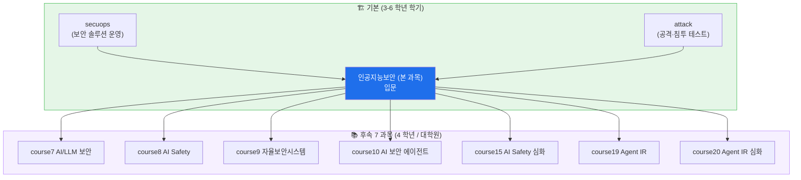
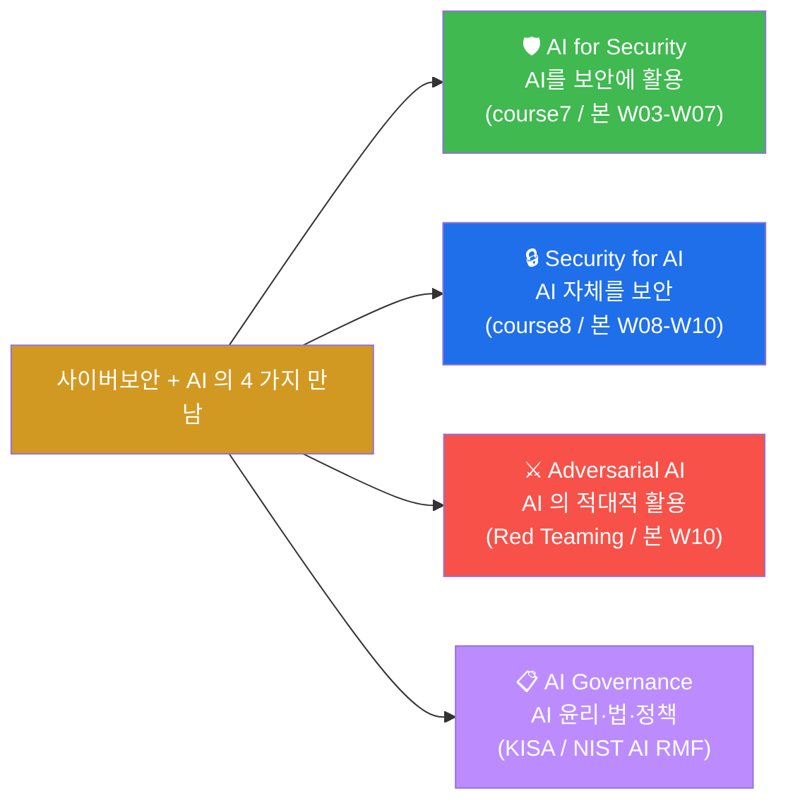
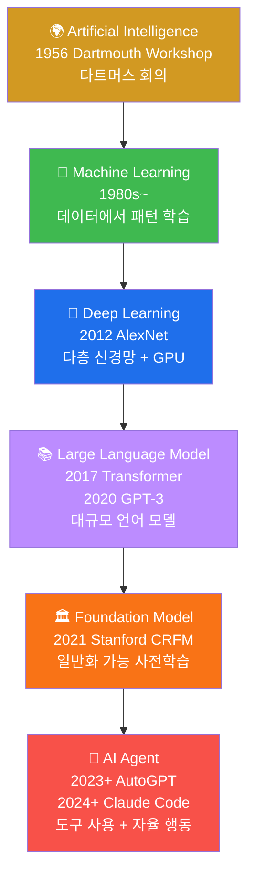
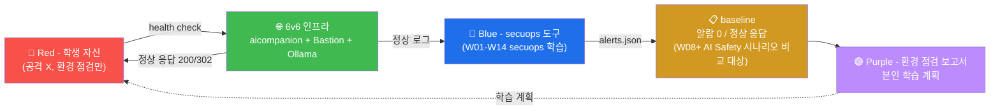

# Week 01 — AI 보안 리터러시 (오리엔테이션 + 인공지능 모델 + 실습환경)

> 본 과목 **인공지능보안** 은 CCC 의 7 후속 과목 (AI/LLM 보안 / AI Safety /
> Red Teaming / 자율보안시스템 / AI 보안 에이전트 / AI Safety 심화 / AI Agent
> 침해대응 심화) 의 **입문** 통합 과정이다. 본 W01 은 과목의 의도·범위·실습환경
> 정립 + AI 모델의 기초 개념 + 6v6 인프라의 AI 자원 가시화 + Ollama 로컬 모델
> 서빙의 첫 검증.

## 학습 목표

학생은 본 주차 종료 시 다음을 수행할 수 있어야 한다.

1. **본 과목의 의도·범위** + 후속 7 과목 와의 관계 파악
2. **AI 보안의 4 측면** (AI for Security / Security for AI / Adversarial AI /
   AI Governance) 의 차이 + 학습 매핑
3. **머신러닝 / 딥러닝 / LLM / Foundation Model / Agent** 의 5 개념 위계
4. **transformer + attention** 의 핵심 동작 (한 단어로 설명 가능 수준)
5. **6v6 인프라의 AI 자원** — aicompanion 컨테이너 + 외부 Ollama 서버 + Bastion API
6. **Ollama 명령어** + 첫 LLM 호출 + 응답 분석
7. **본 과목의 RoE** (윤리적 한계 + 외부 모델 무단 사용 금지)
8. **R/B/P 시나리오 모델** + 본 과목 15 주 매핑

## 강의 시간 배분 (3시간 — 3차시)

| 차시 | 시간 | 내용 | 유형 |
|------|------|------|------|
| 1차시 | 0:00–1:00 | **오리엔테이션** — 본 과목 범위 + RoE + 후속 7 과목 매핑 + R/B/P 모델 | 강의 |
| 휴식 | 1:00–1:10 | | |
| 2차시 | 1:10–2:10 | **인공지능 모델** — ML / DL / LLM / Foundation Model / Agent 5 위계 + transformer | 강의 |
| 휴식 | 2:10–2:20 | | |
| 3차시 | 2:20–3:00 | **실습환경 소개 + 구축** — Ollama 로컬 + 6v6 aicompanion + Bastion API + 첫 LLM 호출 | 실습 |

---

## 1차시 — 오리엔테이션

### 1.1 본 과목의 의도

```
"인공지능보안" 은 CCC 의 후속 7 과목 (AI/LLM 보안 / AI Safety / Red Teaming /
 자율보안시스템 / AI 보안 에이전트 / AI Safety 심화 / AI Agent 침해대응 심화) 의
 입문 통합 과정.

본 과목 = AI 보안의 모든 부야의 첫 입문
  → 다음 학기/년의 후속 7 과목 학습 전 단계.

학생의 학습 path:
  Week 1-7  : AI 기초 + LLM + 보안 활용 + Bastion 사용
  Week 8-10 : AI Safety 입문 (위협 + Red Teaming)
  Week 11-12: 자율 보안 입문 (RL + Blue/Red Agent)
  Week 13-15: 에이전트 침해대응 입문 (사례 5)
```

### 1.2 본 과목과 secuops / attack 의 관계



본 과목 학습 전 권장:
- **secuops 수료** (15 주) — 보안 솔루션 운영 기본기
- **attack 수료** (15 주) — 침투 테스트 기본기 + R/B/P 의 모든 주차 적용 경험

본 과목 수료 후 권장 path:
- AI 보안 운영자 → course7 + course8 + course10
- AI Red Team → course8 + course15
- 자율 보안 운영 → course9
- AI Agent IR → course19 + course20

### 1.3 AI 보안의 4 측면



| 측면 | 정의 | 본 과목 주차 |
|------|------|--------------|
| **AI for Security** | AI / LLM 으로 보안 작업 자동화 (로그 분석 / 룰 생성 / 모의해킹) | W03-W07 |
| **Security for AI** | AI 모델·시스템 자체의 보안 (프롬프트 인젝션 / 모델 탈취 / poisoning) | W08-W09 |
| **Adversarial AI** | AI 의 적대적 사용 (모델 의 vuln 공격 + Red Teaming) | W08-W10 |
| **AI Governance** | AI 의 윤리·법·정책 + 위험 관리 프레임워크 | W01 + W10 |

### 1.4 본 과목의 RoE (Rules of Engagement)

```
✅ 허용:
  - 6v6 환경의 aicompanion 컨테이너 활용
  - 학교 lab 의 Ollama 서버 (로컬 모델)
  - 학습 목적의 모델 파인튜닝 / 프롬프트 엔지니어링
  - 본인 환경의 Bastion 운영
  - 공개 데이터셋 / 공개 LLM 사용

❌ 금지:
  - 외부 회사 / 기관의 LLM 무단 사용 (OpenAI API key 도용 등)
  - 외부 시스템에 모델 탈옥 / 인젝션 시도
  - 본 과목 결과물 외부 공개 (특히 모델 탈옥 페이로드 SNS 공유)
  - 다른 학생의 환경 침투
  - 무허가 데이터 수집 / 개인정보 학습 데이터 사용

법적 영향:
  - 정보통신망법 + 개인정보보호법 + 저작권법 (학습 데이터)
  - AI 안전법 (2026 한국 신규 — KISA 가이드라인)
  - EU AI Act (글로벌 영향)
```

### 1.5 본 과목 R/B/P 모델 + 15 주 매핑

```mermaid
graph LR
    subgraph RED["🔴 Red - 공격 시점"]
        R1["프롬프트 인젝션"]
        R2["모델 탈옥"]
        R3["적대적 입력"]
        R4["Poisoning"]
        R5["에이전트 침해"]
    end

    subgraph BLUE["🔵 Blue - 방어 시점"]
        B1["AI for Security<br/>(W03-W07)"]
        B2["Safety Filter"]
        B3["RAG + KG 보호"]
        B4["에이전트 모니터링"]
    end

    subgraph PURPLE["🟣 Purple - 통합"]
        P1["Red Teaming 프레임워크<br/>(W10)"]
        P2["자율 Blue/Red<br/>(W11-W12)"]
        P3["AAR 보고서<br/>(W13-W15)"]
    end

    RED --> BLUE
    BLUE --> PURPLE

    style RED fill:#f8514922,stroke:#f85149
    style BLUE fill:#1f6feb22,stroke:#1f6feb
    style PURPLE fill:#bc8cff22,stroke:#bc8cff
```



**15 주 R/B/P 매핑**:

| Week | Red | Blue | Purple |
|------|-----|------|--------|
| W01 | (Orient) | (Orient) | 환경 점검 baseline |
| W02 | (학습) | LLM 로컬 서빙 + RAG | 모델 거버넌스 |
| W03-W04 | (학습) | AI 로 보안 자동화 | SOC 효율 측정 |
| W05-W07 | (학습) | Bastion 운영 | 운영 정착도 |
| W08 | 악성 모델 / 프롬프트 인젝션 | Safety Filter | 위협 매트릭스 |
| W09 | 탈옥 + 적대적 + Poisoning | RAG/KG 보호 | Coverage |
| W10 | LLM Red Teaming | Safety 평가 | Red Teaming 표준화 |
| W11-W12 | 자율 Red | 자율 Blue | RL Steering |
| W13-W15 | 에이전트 침해 (5 사례) | 에이전트 IR | AAR + Lessons Learned |

---

## 2차시 — 인공지능 모델 (개념 위계)

### 2.1 5 개념 위계



### 2.2 ML (Machine Learning, 1980s~)

```
정의: 명시적 프로그래밍 없이 데이터에서 패턴을 학습
3 카테고리:
  - Supervised (label 있음): SVM / Random Forest / Logistic Regression
  - Unsupervised (label 없음): K-Means / DBSCAN / PCA
  - Reinforcement (보상 기반): Q-Learning / DQN / PPO

보안 활용 (W03 학습):
  - 악성코드 분류 (Random Forest)
  - 비정상 트래픽 탐지 (Isolation Forest)
  - 비밀번호 강도 분류 (Logistic Regression)
```

### 2.3 DL (Deep Learning, 2012~)

```
정의: 다층 신경망 (Hidden layer 2+) + GPU 가속 + 대량 데이터

주요 아키텍처:
  - CNN (Convolutional NN) — 이미지
  - RNN / LSTM / GRU — 시계열 (이전 LLM)
  - Transformer (2017) — 모던 LLM 의 기반
  - Diffusion (2020+) — 이미지 생성

보안 활용:
  - 악성코드 binary 분류 (CNN on opcode)
  - 비정상 로그 sequence (LSTM)
  - 페이로드 분석 (transformer encoder)
```

### 2.4 LLM (Large Language Model, 2020+)

#### 2.4.1 정의

```
LLM = 대규모 (1B+ parameter) 의 transformer 기반 언어 모델
       대량 텍스트 (TB-PB) 로 사전학습
       다양한 task 의 zero-shot / few-shot 수행

대표 LLM:
  GPT-3 (175B, 2020)
  GPT-4 (예상 1T+, 2023)
  GPT-5 (2025+)
  Claude 3.5 Sonnet (Anthropic, 2024)
  Claude 4 (Anthropic, 2025+) / Opus 4.7
  Llama 3 (Meta, 2024 — open weight)
  Gemini 1.5 (Google, 2024)
  Mistral / Mixtral (open weight)
  Qwen / DeepSeek (중국 — open weight)
  gpt-oss:120b (Bastion 의 기본 모델 — Apache 2.0)
```

#### 2.4.2 Transformer 아키텍처 (한 단어 설명)

```
Transformer = "Attention is All You Need" (2017 Vaswani et al.)

핵심: Self-Attention
  - "단어 X 의 다음 단어를 예측할 때, X 와 가장 관련 있는 이전 단어 N 개 가
     누구인지 학습"
  - 예: "고양이가 사과를 ___ 먹었다"
    → "고양이" + "사과" 이 가장 attention 높음 → "맛있게" 예측

구조:
  Input → Embedding → N × Transformer Block → Output
                       │
                       ├─ Multi-Head Attention
                       ├─ Feed-Forward Network
                       └─ Layer Normalization

규모:
  GPT-3:       96 layer × 96 head × ~12K hidden
  Llama 3 70B: 80 layer × 64 head × 8192 hidden
```

#### 2.4.3 LLM 의 핵심 개념

| 개념 | 정의 |
|------|------|
| **Token** | LLM 의 처리 단위 (단어보다 작음, 보통 1 token ≈ 0.75 단어) |
| **Tokenizer** | text → token sequence 변환 (BPE / SentencePiece 등) |
| **Context Window** | LLM 이 한 번에 볼 수 있는 token 수 (4K ~ 1M+) |
| **Temperature** | 응답의 randomness (0 = greedy, 1 = creative) |
| **Top-p / Top-k** | 다음 token 선택 의 sampling 방식 |
| **System Prompt** | 모델 의 역할·규칙 정의 |
| **Few-shot** | 예시 N 개를 prompt 에 포함 |
| **Chain of Thought** | "step-by-step 추론" 유도 |
| **Function Calling** | LLM 이 외부 도구 호출 |
| **Streaming** | token-by-token 응답 전송 |

### 2.5 Foundation Model (2021+)

```
정의: "한 모델 + 다양한 task 의 zero-shot"
      Stanford CRFM (Center for Research on Foundation Models) 의 용어

특징:
  - 대규모 사전학습 (PB+ 데이터)
  - 다양한 task 의 fine-tune 또는 prompt
  - General-purpose

예: GPT / Claude / Gemini / Llama / Mistral

vs LLM:
  LLM = Foundation Model 의 한 종류 (Language Model)
  Foundation Model = Vision / Audio / Multi-modal 도 포함
```

### 2.6 AI Agent (2023+)

```
정의: LLM + 도구 사용 + 자율 의사결정 + 다단계 작업

핵심 구성:
  1. LLM (의사결정 brain)
  2. Tools (API / shell / file system 접근)
  3. Memory (장단기 — RAG / KG)
  4. Planning (다단계 작업 분해)
  5. Action loop (시도 → 관찰 → 수정)

대표 Agent:
  - AutoGPT (2023)
  - Claude Code (2024+) — 본 과목의 W05 학습
  - Bastion (CCC 자체 — W06-W07 학습)
  - LangChain / LlamaIndex / CrewAI (framework)
  - Cursor / Devin (IDE 통합)
```

### 2.7 모델 위계 vs 보안

```
| 단계 | 보안 시점 | 본 과목 주차 |
| ML | 정상 input 외의 adversarial input | W03 |
| DL | model evasion (adversarial example) | W09 |
| LLM | prompt injection / 탈옥 | W08-W09 |
| Foundation Model | 모델 자체 도용 / poisoning | W08-W09 |
| AI Agent | 도구 권한 남용 / 에이전트 침해 | W10 / W13-W15 |
```

---

## 3차시 — 실습환경 소개 + 구축

### 3.1 6v6 인프라의 AI 자원

본 과목은 secuops / attack 과 같은 6v6 환경 기반.

```
ext (10.20.30.0/24)
  ├─ bastion .201        ← 본 과목의 핵심 (W06-W07 의 Bastion API)
  └─ attacker .202       ← Red Team 실습 (W08-W09)

fw .1 / .1 (ext/pipe)
ips .2 / .1 (pipe/dmz)

dmz (10.20.32.0/24)
  ├─ web .80
  └─ siem .100           ← Wazuh manager (W03-W04 의 log 분석 대상)

int (10.20.40.0/24)
  ├─ juiceshop / dvwa / neobank / govportal / mediforum / admin
  └─ aicompanion .87     ← 본 과목의 핵심 AI 자원 (LLM 백엔드)
```

### 3.2 aicompanion 컨테이너

```
역할: 학생용 LLM 백엔드 시뮬
포트: int 의 3005
기본 LLM: Ollama 기반 (외부 또는 내장)
취약점: prompt injection / RAG poisoning 의도된 vuln
용도: W08-W09 의 AI Safety 실습 대상
```

#### 응답 확인

```bash
# attacker 컨테이너에서 (W01 secuops 의 ProxyJump 활용)
ssh 6v6-attacker '
echo "=== aicompanion 응답 ==="
curl -s -o /dev/null -w "%{http_code}\n" \
    -H "Host: ai.6v6.lab" \
    http://10.20.30.1/

echo ""
echo "=== aicompanion API 의 endpoint ==="
curl -s -H "Host: ai.6v6.lab" http://10.20.30.1/ | head -20
'
```

### 3.3 Ollama 의 정의

```
역사:    2023 출시 (Ollama, Inc.)
라이선스: MIT
용도:    로컬 LLM 서빙 (download + run)
홈페이지: https://ollama.com

설치:
  curl -fsSL https://ollama.com/install.sh | sh

모델 다운로드:
  ollama pull llama3.2:3b       # Meta Llama 3 3B
  ollama pull gemma3:4b          # Google Gemma 3 4B
  ollama pull qwen2.5:7b         # Alibaba Qwen 2.5 7B
  ollama pull deepseek-r1:8b     # DeepSeek R1 8B
  ollama pull gpt-oss:120b       # OpenAI gpt-oss (Apache 2.0) — Bastion 기본

실행:
  ollama run gemma3:4b
  # Interactive prompt → "안녕하세요" 입력 → 응답

API (REST):
  curl http://localhost:11434/api/generate -d '{
    "model": "gemma3:4b",
    "prompt": "안녕하세요",
    "stream": false
  }'
```

### 3.4 6v6 환경의 Ollama 가용성

```
본 6v6 환경: 학생 PC 의 VMware Bridge VM (8GB RAM 권장)
LLM 모델 크기:
  3B (3 billion params) → 약 2GB
  7B → 약 4GB
  70B → 약 40GB (학습 환경 어려움)

학생 PC 의 GPU 권장:
  - 없음: CPU 만 (느림, 4B 까지 가능)
  - NVIDIA 8GB VRAM: 7B 가능
  - NVIDIA 24GB+: 30B+ 가능
  - DGX-Spark / H100: 120B+ (Bastion 의 production)

본 과목 학습 환경: 4B 가량의 작은 모델 (gemma3:4b 또는 qwen2.5:3b) 권장
```

### 3.5 학생 PC 의 Ollama 설치 (옵션)

```bash
# Linux / WSL 에서
curl -fsSL https://ollama.com/install.sh | sh

# 시작
ollama serve &     # systemd 또는 background

# 모델 다운로드 (4B 모델 — 2GB)
ollama pull gemma3:4b

# 첫 호출
curl -s http://localhost:11434/api/generate -d '{
  "model": "gemma3:4b",
  "prompt": "사이버보안에서 LLM 의 활용 사례 3가지를 한국어로 알려줘",
  "stream": false
}' | jq -r .response
```

### 3.6 Bastion 의 정의

본 과목 W06-W07 의 핵심 — CCC 자체의 AI 에이전트.

```
출처: CCC paper-draft.md (Bastion v0.4)
정의: 단일 GPU 폐쇄망에서 장기 운영 가능한 지식그래프-히스토리 가드형
       사이버보안 LLM 에이전트
라이선스: (CCC 자체)
기본 모델: gpt-oss:120b (Apache 2.0)
배포: bastion 컨테이너 (10.20.30.201)
API: http://localhost:9100 (X-API-Key: ccc-api-key-2026)
```

#### Bastion 의 4 핵심 기여

1. **단일 GPU 폐쇄망 종단 운영성** — 외부 클라우드 의존 0
2. **운영 신뢰성·안정성** — 결정적 상태 기계 + KG 기반 reuse/adapt/new
3. **장기 컨텍스트 보존** — (Playbook + Experience + History) + Knowledge Graph
4. **다양한 실증** — Bastion-Bench (590 task) + 6 외부 벤치마크 + 30 일 운영 시험

자세한 학습: W06-W07 + paper-draft.md 통독 권장.

### 3.7 Bastion API 헬스체크

```bash
ssh 6v6-bastion '
echo "=== Bastion API health ==="
curl -s -H "X-API-Key: ccc-api-key-2026" \
    http://localhost:9100/health | jq

echo ""
echo "=== Bastion 의 KG 상태 ==="
curl -s -H "X-API-Key: ccc-api-key-2026" \
    http://localhost:9100/kg/health | jq

echo ""
echo "=== Bastion 의 etc/skills 카탈로그 ==="
curl -s -H "X-API-Key: ccc-api-key-2026" \
    http://localhost:9100/skills | jq -r ".skills | length"
'
```

응답:
- `status: ok` + `kg.all_modules_loaded: true` → Bastion 정상
- `skills count: 33` → 6 카테고리 33 종 skill 카탈로그 가동

---

## 3.8 실습 1~5

### 실습 1 — 6v6 환경의 AI 자원 가시화

```bash
# Bastion + aicompanion 두 LLM 자원 응답
ssh 6v6-attacker '
echo "=== Bastion API (W06-W07 학습 대상) ==="
curl -s -H "Host: bastion.6v6.lab" \
     -H "X-API-Key: ccc-api-key-2026" \
     http://10.20.30.1/health | jq

echo ""
echo "=== aicompanion (W08-W09 의 AI Safety 학습 대상) ==="
curl -s -o /dev/null -w "ai.6v6.lab: %{http_code}\n" \
    -H "Host: ai.6v6.lab" \
    http://10.20.30.1/
'
```

### 실습 2 — Ollama 의 LLM 호출 (학생 PC 또는 6v6 외부 LLM)

```bash
# 학생 PC 에 Ollama 설치 되어 있다면
ollama pull gemma3:4b

# 첫 호출 — 사이버보안 도메인의 질문
curl -s http://localhost:11434/api/generate -d '{
  "model": "gemma3:4b",
  "prompt": "다음 보안 로그를 분석해줘: [2026-05-12 14:32:18] sshd[1234]: Failed password for ccc from 1.2.3.4 port 22",
  "stream": false
}' | jq -r .response
```

LLM 응답 예 (실제 응답은 가변):
```
이 로그는 SSH 인증 실패를 보여줍니다.
세부 분석:
1. 시각: 2026-05-12 14:32:18
2. 사용자: ccc (시도)
3. 출발지: 1.2.3.4 (외부 IP — 의심)
4. 포트: 22 (SSH 표준)

권장 조치:
1. 1.2.3.4 의 추가 시도 모니터링
2. fail2ban / Wazuh 의 rate limit
3. SSH 의 key-based auth 적용
4. MFA 도입
```

### 실습 3 — Bastion API 의 첫 chat

```bash
ssh 6v6-bastion '
echo "=== Bastion API /chat 호출 ==="
curl -s -X POST \
    -H "X-API-Key: ccc-api-key-2026" \
    -H "Content-Type: application/json" \
    -d "{\"message\": \"안녕하세요. 본인은 사이버보안 학습자입니다. Bastion 에 대해 간단히 소개해주세요.\", \"agent\": \"master\"}" \
    http://localhost:9100/chat 2>&1 | head -50
'
```

### 실습 4 — paper-draft.md 통독 (15 분)

```bash
# paper 의 abstract + intro + 결론
less /home/opsclaw/ccc/contents/papers/bastion/paper-draft.md
# 또는 head / tail 로 핵심 부분 review
```

읽기 우선순위:
1. Abstract (1 페이지)
2. §1 Introduction
3. §3 Bastion Architecture
4. §6 Evaluation
5. §8 Limitations + Future Work

### 실습 5 — 본인 학습 계획 + R/B/P 자가 분석

```markdown
# 본인 학습 계획 (예시 양식)

## 1. 본인 강점
- secuops / attack 수료 완료
- Python 능숙 / Linux 명령
- (자유 기록)

## 2. 본인 약점
- LLM 의 transformer 내부 동작 미숙
- 파인튜닝 경험 없음
- RAG / KG 의 운영 경험 없음

## 3. 본 과목의 R/B/P 자가 분석
| 시점 | 현재 능력 | 목표 | 학습 plan |
| Red (Adversarial AI) | (없음) | 프롬프트 인젝션 + 탈옥 | W08-W10 정독 + 실습 |
| Blue (AI for Security) | (기본) | Bastion 활용 보안 운영 | W03-W07 |
| Purple (AI Governance + IR) | (없음) | AAR 작성 + Coverage | W10 + W13-W15 |

## 4. 학기 목표
- 단기 (W08 중간 평가): 본 과목의 R/B/P 보고서 1+ 작성
- 중기 (W15 기말): Bastion 활용 1 시뮬 침해 대응 시나리오
- 장기 (수료 후): 후속 7 과목 중 1+ 진입

## 5. 일정
- 매주 lecture 1시간 + lab 2시간 + 본인 추가 1시간
- 매 토요일 R/B/P 보고서 1 페이지
- 월 1회 본인 LLM 실험 (파인튜닝 또는 RAG)
```

---

## 4. 한국 사례 + 표준 매핑

### 4.1 KISA 의 AI 보안 가이드라인

```
- KISA "AI 보안 가이드라인" (2024)
- KISA "AI Safety 가이드라인" (2025 예정)
- KISA AI 안전 인증 (2026+ 예상)
```

### 4.2 NIST AI RMF (Risk Management Framework)

```
NIST AI RMF 1.0 (2023):
  - GOVERN — AI 거버넌스
  - MAP — 위험 식별
  - MEASURE — 위험 측정
  - MANAGE — 위험 대응
```

### 4.3 EU AI Act (2024 발효)

```
4 카테고리 위험:
  - Unacceptable risk (금지) — social scoring 등
  - High risk (엄격 규제) — 의료 / 채용 / 신용 평가
  - Limited risk (투명성) — chatbot
  - Minimal risk (자유) — 게임 AI
```

### 4.4 한국 AI 안전법 (2026 신규)

```
2025 한국 정부 발의 → 2026 시행 예정
KISA + 과기부 의 AI 안전 인증
주요 요구:
  - AI 모델의 안전 평가
  - 데이터 출처 + 학습 데이터 공개
  - 알고리즘 공개 (high-risk)
  - 사고 보고 절차
```

---

## 5. R/B/P 시나리오 — W01 (환경 점검 baseline)



**해석**:
- W01 의 Red 행위 = 환경 헬스체크만
- Blue 측은 alert 0 (baseline)
- Purple 측은 본인 학습 계획 + 후속 주차의 비교 baseline

---

## 6. 과제

### A. 환경 점검 보고서 (필수, 40점)

다음 모두 포함:
1. 6v6 환경 의 16 컨테이너 모두 Up 검증 (W01 secuops 와 동일)
2. aicompanion + Bastion API + (있다면) Ollama 응답 확인
3. paper-draft.md 의 abstract + intro 통독 + 본인 요약 1 페이지
4. 본인 발견 비정상 1건 또는 "정상" + 근거

### B. AI 모델 위계 매핑 (심화, 30점)

ML / DL / LLM / Foundation Model / AI Agent 5 위계 의 정의 + 보안 시점 + 본 과목
주차 매핑 표 (각 row 의 근거 1줄 + 한국 사례 1건).

### C. 본인 학습 계획 (정성, 30점)

§3.8 실습 5 의 양식대로 본인 학습 계획 작성. 추가로:
- 본인 강점 3개 + 약점 3개
- 본인 R/B/P 자가 분석
- 단기/중기/장기 목표 (후속 과목 / 자격증 / 대학원 진학 등)
- 주차별 학습 시간 + 보고서 작성 plan

---

## 6.5. 본 주차 hands-on (lab yaml 매핑)

본 주차 의 lab (`contents/standalone/lab/aisec/week01.yaml`) 의 5 step 의 안내:

1. **16 컨테이너 + aicompanion 가시화** — `ssh 6v6-bastion 'docker ps'` 의 16 컨테이너 확인 + aicompanion vhost (`ai.6v6.lab`) 의 응답 검증. (위 평가 기준 A 의 환경 점검 보고서 의 base)

2. **Bastion API 의 /health + /kg/health** — `curl http://192.168.0.103:8003/health` + `/kg/health` 의 응답 분석. KG 의 module loaded 상태 + skills count + graph nodes 등 의 가시화.

3. **Bastion API 의 /chat 의 첫 LLM 호출** — `curl POST /chat` 의 "본인은 사이버보안 학습자입니다. Bastion 의 4 핵심 기여를 한국어로 알려주세요." 의 호출 + 응답 분석. (응답 의 5-10 분 의 정상)

4. **paper-draft.md 의 §1 introduction 통독** — `contents/papers/bastion/paper-draft.md` 의 abstract + §1 통독 후 4 핵심 기여를 본인 말로 1 줄 씩 요약. (위 평가 기준 B 의 base)

5. **본인 학습 계획 + R/B/P 자가 분석 1 페이지** — 위 평가 기준 C 의 양식.

---

## 7. 평가 기준 (W01)

| 항목 | 비중 | 평가 방법 |
|------|------|----------|
| 환경 점검 보고서 (A) | 40% | 4 항목 + 출력 첨부 + paper 요약 |
| AI 모델 위계 (B) | 30% | 5 위계 × 보안 시점 + 주차 + 한국 사례 |
| 본인 학습 계획 (C) | 30% | 양식 충족 + 본인 R/B/P |

총 100점. 60점 미만 재제출.

---

## 8. 핵심 정리 (10 줄)

1. **본 과목 = AI 보안 입문 통합** — 후속 7 과목 의 입문
2. **AI 보안 4 측면** — AI for Security / Security for AI / Adversarial AI / Governance
3. **모델 위계 5** — ML / DL / LLM / Foundation Model / AI Agent
4. **Transformer (2017)** — "Attention is All You Need" — 모던 LLM 의 기반
5. **6v6 환경** — aicompanion + Bastion API + (선택) Ollama
6. **Ollama** = 로컬 LLM 서빙 (MIT, 2023)
7. **Bastion** = CCC 의 단일 GPU 폐쇄망 사이버보안 LLM 에이전트 (W06-W07 학습)
8. **본 과목 RoE** — 6v6 + 학습 환경 한정, 외부 시스템 / API 무단 사용 금지
9. **W01 R/B/P** — Red baseline (공격 X) → Blue secuops 정상 → Purple 학습 계획
10. **W02 (LLM)** 다음 주차 — Ollama 본격 + 파인튜닝 + RAG + KG
