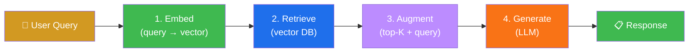
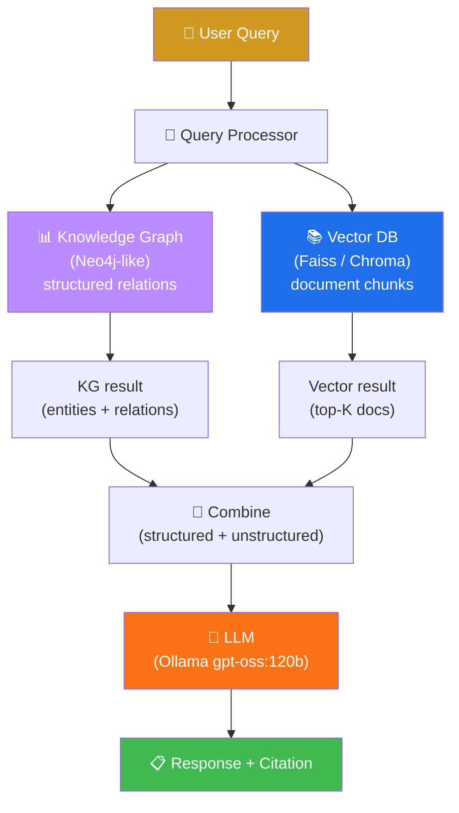
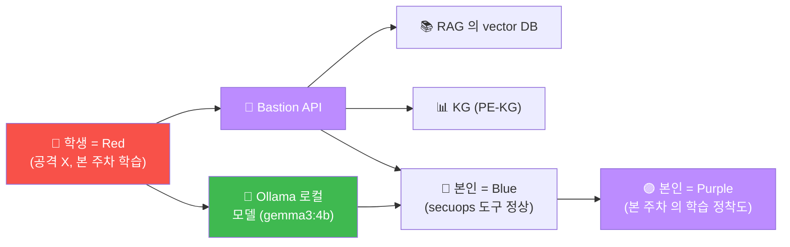

# Week 02 — LLM (Ollama 로컬 / 파인튜닝 / RAG + 지식그래프)

> W01 의 AI 모델 위계 위에, LLM 의 **운영** 학습. 로컬 모델 서빙 (Ollama) + 파인튜닝
> (QLoRA) + RAG (Retrieval Augmented Generation) + 지식그래프 (Knowledge Graph) 4
> 핵심 기술의 입문. 본 과목 W06-W07 의 Bastion 의 KG 통합 + W08-W09 의 RAG 보안의
> 기반.

## 학습 목표

학생은 본 주차 종료 시 다음을 수행할 수 있어야 한다.

1. **Ollama 의 동작 원리** + 모델 다운로드 + serve + API
2. **로컬 모델 vs 클라우드 모델** 의 4 차원 비교 (성능 / 비용 / 보안 / 운영)
3. **모델 파인튜닝 의 3 종** (Full / LoRA / QLoRA) + 차이
4. **RAG 의 4 단계** (Index / Retrieve / Augment / Generate)
5. **vector DB** + embedding model + similarity search
6. **지식그래프 (KG)** + RDF + Cypher (Neo4j)
7. **RAG vs KG vs RAG+KG** 의 비교 + 운영 시나리오
8. W02 R/B/P 1 사이클

## 강의 시간 배분 (3시간 — 3 차시)

| 차시 | 시간 | 내용 | 유형 |
|------|------|------|------|
| 1차시 | 0:00–1:00 | **Ollama 로컬 모델 서빙** — 설치 + 모델 다운로드 + API + Modelfile | 강의 |
| 휴식 | 1:00–1:10 | | |
| 2차시 | 1:10–2:10 | **모델 파인튜닝** — Full / LoRA / QLoRA + 데이터셋 + 평가 | 강의 |
| 휴식 | 2:10–2:20 | | |
| 3차시 | 2:20–3:00 | **RAG + 지식그래프** — vector DB + embedding + KG (Neo4j / Cypher) | 실습 |

---

## 1차시 — Ollama 로컬 모델 서빙

### 1.0 자판기에 비유하기 — LLM의 직관

본 차시의 학습을 시작하면서 일상의 풍경에 빗대어 본다.

학교 자판기를 떠올려 보자. 학생이 자판기를 쓰는 과정은 4단계로 나뉜다.

- **Step 1: 입력 (동전 투입).** 학생이 동전을 자판기에 넣는다.
- **Step 2: 선택 (버튼 누름).** 학생이 음료를 고른다.
- **Step 3: 처리 (자판기 내부).** 자판기 내부에서 음료가 준비된다.
- **Step 4: 출력 (음료 배출).** 학생이 음료를 받는다.

이 4단계는 LLM 동작과 정확히 매핑된다.

| 자판기 | LLM |
|--------|-----|
| 동전 투입 | API 인증 (X-API-Key) |
| 버튼 선택 | prompt 입력 |
| 자판기 내부 처리 | transformer inference |
| 음료 배출 | text 출력 |

자판기에서 음료를 사는 데 드는 동전이 LLM에서는 token 비용에 해당한다. 자판기에 여러 종류의 음료가 있는 것처럼 LLM도 다양한 모델 (gemma3, llama3, gpt-oss 등) 을 고를 수 있다.

학생이 본인 host에 Ollama를 설치하는 것은 결국 본인만의 자판기를 운영하는 것과 같다.

본 차시 학습은 이 자판기를 보안 도메인에 응용하는 것이다. 본인의 자판기를 직접 운영하기, 외부 자판기를 호출하기, 다양한 음료를 골라 보기, 운영 비용을 절약하기 — 이 네 가지가 학습 흐름이다.

### 1.1 Ollama 의 정의

```
출시: 2023 Ollama, Inc.
라이선스: MIT
용도: 로컬 LLM 의 download + 실행 + API
홈페이지: https://ollama.com
GitHub: https://github.com/ollama/ollama
다운로드 수: 100M+ (2024 누적)
```

### 1.2 왜 로컬 LLM 인가?

```
클라우드 LLM (OpenAI GPT / Claude / Gemini):
  장점: 최고 성능 + 즉시 사용
  단점:
    - 비용 (token 당 / 월 정액)
    - 데이터 외부 전송 (개인정보 / 영업 비밀)
    - 의존성 (벤더 lock-in)
    - 지연 (API 호출 latency)
    - 폐쇄망 사용 불가 (CCC 의 Bastion 의 motivation)

로컬 LLM (Ollama / vLLM / LMStudio / ...):
  장점:
    - 비용 0 (전기 + 하드웨어 만)
    - 데이터 내부 보호
    - 폐쇄망 친화 (CCC Bastion 의 핵심)
    - 응답 latency 낮음
    - 모델 fine-tune 자유
  단점:
    - 성능 (모델 크기 / 양자화 의 trade-off)
    - 운영 비용 (GPU / 전기 / 운영 시간)
    - 초기 학습 곡선
```

### 1.3 Ollama 아키텍처

```
ollama serve (background daemon)
  │
  ├─ port 11434 (HTTP API)
  │
  ├─ ~/.ollama/models/ (모델 저장)
  │   - manifests (모델 메타 + tag)
  │   - blobs (GGUF binary)
  │
  └─ backend:
      - llama.cpp (CPU + GGUF)
      - CUDA (NVIDIA GPU)
      - Metal (Apple Silicon)
      - ROCm (AMD GPU)
```

### 1.4 GGUF 형식

```
GGUF = GGML (Georgi Gerganov ML) Universal Format
       모던 LLM 의 표준 quantization 형식
       다양한 정밀도 (Q4_0 / Q4_K / Q5_K / Q8_0 등) 지원

quantization 의 효과:
  Full precision (FP32): 4 bytes / param
    예: Llama 3 70B = 280 GB (운영 불가)

  Half precision (FP16): 2 bytes / param
    예: Llama 3 70B = 140 GB

  INT8 (Q8_0): 1 byte / param + 약간의 overhead
    예: Llama 3 70B = 75 GB

  INT4 (Q4_K_M): 0.5 bytes / param
    예: Llama 3 70B = 40 GB (단일 GPU 가능)
    Bastion 의 gpt-oss:120b 도 Q4 / Q5 활용
```

### 1.5 핵심 명령

```bash
# 설치
curl -fsSL https://ollama.com/install.sh | sh

# 시작
ollama serve &     # background

# 모델 다운로드
ollama pull llama3.2:3b           # 3B (2GB)
ollama pull gemma3:4b              # 4B (2.5GB)
ollama pull qwen2.5:7b             # 7B (4GB)
ollama pull mistral:7b             # 7B
ollama pull deepseek-r1:8b         # 8B (5GB, reasoning model)
ollama pull gpt-oss:120b           # 120B (75GB+ Q4) — Bastion 기본

# 다운로드 모델 list
ollama list

# interactive shell
ollama run gemma3:4b

# API 호출
curl http://localhost:11434/api/generate -d '{
  "model": "gemma3:4b",
  "prompt": "...",
  "stream": false,
  "options": {
    "temperature": 0.7,
    "top_p": 0.9,
    "num_ctx": 4096
  }
}'

# 모델 삭제
ollama rm llama3.2:3b

# 모델 정보
ollama show gemma3:4b
```

### 1.6 Modelfile — 사용자 정의 모델

```bash
# Modelfile.security
FROM gemma3:4b

# System prompt
SYSTEM """
당신은 사이버보안 전문 AI 어시스턴트입니다.
한국어로 응답하며, 답변은 정확하고 간결합니다.
"""

# Hyperparameters
PARAMETER temperature 0.3        # 낮은 temperature (사실 위주)
PARAMETER top_p 0.9
PARAMETER num_ctx 8192

# 사용자 정의 모델 생성
ollama create ccc-secsec:4b -f Modelfile.security

# 호출
ollama run ccc-secsec:4b
```

CCC 의 `ccc-vulnerable:4b` / `ccc-unsafe:2b` 가 이 방식.

### 1.7 OpenAI API 호환 endpoint

```bash
# Ollama 가 OpenAI API 호환 모드 지원
curl http://localhost:11434/v1/chat/completions \
  -H "Content-Type: application/json" \
  -d '{
    "model": "gemma3:4b",
    "messages": [
      {"role": "system", "content": "당신은 사이버보안 전문가"},
      {"role": "user", "content": "SQLi 의 방어 표준 3 가지"}
    ]
  }'

# OpenAI Python SDK 와 직접 호환
import openai
client = openai.OpenAI(
    base_url="http://localhost:11434/v1",
    api_key="ollama"   # 의미 없음
)
response = client.chat.completions.create(
    model="gemma3:4b",
    messages=[{"role": "user", "content": "안녕"}]
)
```

이로써 OpenAI 기반 코드를 그대로 Ollama 로 전환 가능.

---

## 2차시 — 모델 파인튜닝

### 2.1 파인튜닝의 정의

```
Fine-Tuning = 사전학습 (pre-trained) 모델을 특정 domain / task 의 데이터로 추가 학습

목적:
  1. 특정 domain 의 응답 quality 향상 (예: 의료 / 법률 / 사이버보안)
  2. 회사 의 style / tone / format 적용
  3. 특정 task 의 zero-shot 성능 향상
  4. 안전성 강화 (또는 우회 — W08 학습)
  5. 한국어 등 특정 언어의 능력 향상
```

### 2.2 3 종 파인튜닝

| 종류 | parameter 업데이트 | 자원 | 효과 |
|------|--------------------|------|------|
| **Full Fine-Tuning** | 모든 weight | 매우 큰 GPU (8x H100+) | 최고 quality, 비용 폭증 |
| **LoRA** (Low-Rank Adaptation) | 추가 small matrix 만 | 중간 (1x A100) | 90% 효과, 5% 비용 |
| **QLoRA** (Quantized LoRA) | small matrix + 4bit base | 작음 (1x RTX 4090) | 80-90% 효과, 1% 비용 |

### 2.3 LoRA 의 동작 원리

```
원본 모델 weight: W (예: 4096 x 4096)
LoRA:           W + B × A   (B: 4096 x r, A: r x 4096, r 작음 예: 8)

학습:
  - W 는 freeze (변경 X)
  - B + A 만 학습 (r * 2 * 4096 = 65536 params, vs 원본 16M params)

추론:
  - W + B × A 결합 또는 별도 계산
  - 가벼움 + 빠름
```

장점:
- 메모리 1/10
- 학습 시간 1/3
- multi-adapter (한 base model + 여러 LoRA = 여러 task)

### 2.4 QLoRA — 2023 Tim Dettmers

```
QLoRA = Quantized LoRA
       Base model 을 4bit 로 양자화 + LoRA 추가
       단일 GPU 에서 65B 모델까지 파인튜닝 가능

표준 도구:
  - Hugging Face PEFT (Parameter-Efficient Fine-Tuning)
  - bitsandbytes (4-bit quantization)
  - Transformers Trainer
```

### 2.5 파인튜닝 데이터셋

```
형식 1: Instruction format (Alpaca)
  {"instruction": "SQLi 의 정의를 알려줘", "output": "SQL Injection 은 ..."}

형식 2: Chat format (ChatML / Llama)
  {"messages": [
    {"role": "system", "content": "사이버보안 전문가"},
    {"role": "user", "content": "..."},
    {"role": "assistant", "content": "..."}
  ]}

형식 3: DPO (Direct Preference Optimization)
  {"prompt": "...", "chosen": "good answer", "rejected": "bad answer"}
  RLHF (Reinforcement Learning from Human Feedback) 의 simpler 대안

크기:
  - 가볍게: 100-1000 examples
  - 중간: 1K-10K
  - 강력: 10K-100K
  - 대규모: 100K+ (별 GPU 필요)
```

### 2.6 데이터셋 생성 패턴

```
1. Manual annotation: 사람이 정답 작성 (가장 정확, 가장 비싸)
2. Public dataset: Hugging Face Hub 의 5만+ 데이터셋
3. Synthetic data: 큰 LLM (GPT-4) 으로 데이터 생성 → 작은 모델 fine-tune
4. RAG-augmented: RAG 의 검색 결과를 응답에 포함하여 fine-tune
5. Self-instruct: 모델 자체 가 새 instruction 생성 (Stanford Alpaca)
```

### 2.7 본 과목의 파인튜닝 예 (W08 학습)

```
CCC 의 ccc-safety-qlora:4b 모델:
  - Base: gemma3:4b
  - 데이터셋: 한국어 보안 Q&A 500-1000 example
  - Method: QLoRA (rank=8, 4bit)
  - 학습 시간: 단일 RTX 4090 에서 1-2 시간
  - 효과: 한국어 보안 응답 quality 향상

CCC 의 ccc-vulnerable:4b:
  - Base: gemma3:4b
  - 변경: System prompt 변경만 (Modelfile)
  - 효과: 안전 제약 일부 제거 (학습용 — W08 실습)
```

### 2.8 평가 (evaluation)

```
방법 1: LLM-as-Judge (GPT-4 가 평가)
  - 정답 / 잘못된 응답 / 모호 의 3 카테고리
  - bias 위험 (judge LLM 의 편향)

방법 2: Benchmark (정량 평가)
  - MMLU (Multi-task Language Understanding)
  - GSM8K (수학)
  - HumanEval (코드)
  - 사이버보안: Cybench / Bastion-Bench

방법 3: A/B testing
  - 사람 평가자 2 응답 비교
  - Elo rating (Chatbot Arena 등)

방법 4: 도메인 특화 평가
  - 본 과목 의 보안 task 별 pass rate
  - Bastion-Bench 의 590 task
```

---

## 3차시 — RAG + 지식그래프 (KG)

### 3.1 RAG 의 정의

```
RAG = Retrieval Augmented Generation
       LLM 의 응답에 외부 지식 (문서 / DB) 검색 결과 를 augment

문제 해결:
  - LLM 의 hallucination (사실 외 답변)
  - 최신 정보 부족 (모델 학습 cutoff 후 변경)
  - domain 특화 지식 (회사 내부 문서)
  - 출처 추적 (compliance)
```

### 3.2 RAG 4 단계



각 단계 상세:

#### 1. Embed

```
text → vector (보통 384 ~ 1536 차원)

embedding model:
  - all-MiniLM-L6-v2 (384 dim, 22M params, 빠름)
  - mxbai-embed-large (1024 dim, MTEB top)
  - text-embedding-3-small (OpenAI, 1536 dim)
  - bge-large-zh (한국어 지원)

목적: 의미적으로 비슷한 text 의 vector 가 가까이
```

#### 2. Retrieve

```
query vector 와 가까운 문서 vector top-K 추출

vector DB 종류:
  - Faiss (Facebook, 빠른 library)
  - Chroma (open source, 가벼움)
  - Qdrant (Rust, fast + production)
  - Weaviate (open source, graph + vector)
  - Pinecone (cloud, scale)
  - Milvus (CNCF, enterprise)

similarity metric:
  - Cosine (가장 흔함)
  - Dot product
  - Euclidean (L2)
```

#### 3. Augment

```
top-K 문서 + 원본 query 를 LLM prompt 로 조합

prompt template 예:
  """
  다음 정보를 참고하여 질문에 답해주세요.

  [참고 정보]
  {context}

  [질문]
  {query}
  """
```

#### 4. Generate

```
LLM 의 응답 생성. 응답에 reference / citation 포함 (출처 추적)
```

### 3.3 RAG 의 장점·단점

| 측면 | 장점 | 단점 |
|------|------|------|
| 정확성 | Hallucination 감소 | retrieve 의 quality 의존 |
| 최신성 | 문서 업데이트 시 즉시 | embedding 갱신 부담 |
| 운영 비용 | 파인튜닝 비교 낮음 | vector DB + storage |
| 출처 추적 | citation 가능 | 사람의 review |

### 3.4 지식그래프 (Knowledge Graph)

```
KG = entity (node) + relationship (edge) 의 그래프
     RDF (Resource Description Framework) 또는 property graph 형식

예:
  (APT29) -[uses]-> (Malware: Cozy Bear)
  (Malware: Cozy Bear) -[targets]-> (Industry: Finance)
  (CVE-2024-1234) -[exploits]-> (Software: Apache 2.4)

도구:
  - Neo4j (Cypher query language, 가장 흔함)
  - ArangoDB (multi-model)
  - OrientDB
  - Amazon Neptune (cloud)
  - Apache TinkerPop (Gremlin)
```

### 3.5 Cypher 의 syntax (Neo4j)

```cypher
-- node 생성
CREATE (a:ThreatActor {name: 'APT29'})
CREATE (m:Malware {name: 'Cozy Bear'})

-- relationship
CREATE (a)-[:USES]->(m)

-- query
MATCH (ta:ThreatActor)-[:USES]->(m:Malware)
WHERE ta.name = 'APT29'
RETURN m.name

-- 다단계 path
MATCH path = (ta:ThreatActor)-[:USES]->(m:Malware)-[:TARGETS]->(ind:Industry)
WHERE ind.name = 'Finance'
RETURN ta.name, m.name

-- aggregation
MATCH (ta:ThreatActor)-[:USES]->(m:Malware)
RETURN ta.name, count(m) AS malware_count
ORDER BY malware_count DESC
```

### 3.6 RAG vs KG 비교

| 측면 | RAG | KG |
|------|-----|-----|
| 표현 | document chunk + vector | entity + relationship |
| 검색 | similarity search | graph traversal |
| 강점 | unstructured text | structured relations |
| 약점 | relation 추적 어려움 | unstructured 어려움 |
| LLM 통합 | prompt 에 context append | Cypher / SPARQL query |

### 3.7 RAG + KG 결합 (Bastion 의 모델)



Bastion 의 PE-KG (Playbook-Experience Knowledge Graph):
- Playbook: 사전 정의된 작업 절차
- Experience: 본인 실행 의 결과 (audit log)
- 두 source 가 KG 로 통합 → reuse/adapt/new 결정

### 3.8 본 과목의 W06-W07 학습

```
W06: Bastion 의 KG 통합 + Bastion 의 context engineering
W07: Bastion 활용 보안 운영 (실 시뮬)
```

---

## 4. ATT&CK + 표준 매핑

### 4.1 RAG / KG 의 보안 측면

- LLM 의 hallucination 감소 → 정확한 정보 + 출처
- RAG poisoning (W09 학습) — RAG 의 source 를 변조하여 LLM 오답 유도
- KG poisoning — KG 의 entity / relationship 변조

### 4.2 NIST AI RMF + ISMS-P

- AI RMF GOVERN: RAG / KG 의 데이터 거버넌스
- ISMS-P 2.6: 데이터 보호 + RAG 의 source 의 보안

---

## 5. R/B/P 시나리오 — LLM 운영 baseline



W02 는 학습 위주 — 공격 / 방어 의 본격 시뮬은 W08+ 부터.

---

## 6. 실습 1~5

### 실습 1 — Ollama 의 모델 가시화

```bash
ssh 6v6-bastion '
echo "=== 본인 환경의 Ollama 설치 검증 ==="
which ollama 2>/dev/null
ollama --version 2>/dev/null || echo "Ollama 미설치 — 학생 PC 에 설치 권장"

echo ""
echo "=== 6v6 의 외부 Ollama (있다면) ==="
# 6v6 의 LLM_BASE_URL 환경 변수 확인
env | grep -i LLM || echo "LLM_BASE_URL 미설정"

# Bastion 의 config 의 LLM 설정
sudo grep -r "LLM_BASE_URL\|ollama" /opt/bastion-api/ 2>/dev/null | head -3
'
```

### 실습 2 — Ollama 호출 (학생 PC, 옵션)

```bash
# 학생 PC 의 Ollama
ollama pull gemma3:4b   # 첫 다운로드 (2GB)

# 사이버보안 도메인 prompt
curl -s http://localhost:11434/api/generate -d '{
  "model": "gemma3:4b",
  "prompt": "다음 보안 로그를 한국어로 분석해줘:\n[2026-05-12 14:32:18] sshd[1234]: Failed password for ccc from 1.2.3.4 port 22\n[2026-05-12 14:32:25] sshd[1235]: Failed password for ccc from 1.2.3.4 port 22\n[2026-05-12 14:32:32] sshd[1236]: Failed password for ccc from 1.2.3.4 port 22",
  "stream": false,
  "options": {
    "temperature": 0.3,
    "num_ctx": 4096
  }
}' | jq -r .response
```

### 실습 3 — Modelfile 작성 + 사용자 정의 모델

```bash
# 학생 PC 또는 6v6-bastion 의 Ollama
cat > /tmp/Modelfile.secsec <<'EOF'
FROM gemma3:4b

SYSTEM """
당신은 사이버보안 전문 AI 어시스턴트입니다.
한국어로 응답합니다.
응답은:
1. 사실 위주 (hallucination 회피)
2. 출처 명시 (있을 때)
3. 운영 권장 포함
4. ISMS-P / NIST CSF 매핑 (관련 시)
"""

PARAMETER temperature 0.3
PARAMETER top_p 0.9
PARAMETER num_ctx 8192
EOF

ollama create ccc-secsec:4b -f /tmp/Modelfile.secsec
ollama run ccc-secsec:4b "본 환경 의 정상 SSH 시도 와 brute force 시도 의 차이"
```

### 실습 4 — Bastion 의 KG 활용 / 검색

```bash
ssh 6v6-bastion '
echo "=== Bastion KG 의 entity count ==="
curl -s -H "X-API-Key: ccc-api-key-2026" http://localhost:9100/kg/metrics 2>&1 | jq | head -10

echo ""
echo "=== Bastion 의 최근 KG anchor ==="
curl -s -H "X-API-Key: ccc-api-key-2026" \
    "http://localhost:9100/kg/anchors/recent?kind=task_outcome&limit=5" \
    2>&1 | jq | head -30
'
```

### 실습 5 — RAG 의 미니 예 (Python)

```bash
# 학생 PC 에서 (Python + sentence-transformers + Faiss)
cat > /tmp/rag_demo.py <<'EOF'
"""
RAG 의 미니 예 — 4 단계 시뮬
"""

# 1. 사전 준비 (실 환경에서는 사전학습된 embedding model)
documents = [
    "SQL Injection 은 OWASP A03 의 대표 web vuln 이다.",
    "XSS (Cross-Site Scripting) 은 사용자 브라우저에서 임의 JS 실행을 가능하게 한다.",
    "CSRF 는 사용자가 의도하지 않은 요청을 발생시킨다.",
    "Wazuh 는 오픈소스 SIEM 이며 4.10 버전이 최신이다.",
    "Suricata 는 IDS / IPS 로 동작하며 ETOpen 룰셋이 표준이다.",
]

# 2. 사용자 query (가정)
query = "SQLi 의 정의"

# 3. similarity (실 환경에서는 embedding model 의 vector 비교)
# 본 예에서는 단순 keyword matching
def simple_similarity(doc, query):
    q_words = set(query.lower().split())
    d_words = set(doc.lower().split())
    overlap = q_words & d_words
    return len(overlap) / (len(q_words) + 1)

scores = [(doc, simple_similarity(doc, query)) for doc in documents]
scores.sort(key=lambda x: -x[1])
top_k = scores[:2]

# 4. Augment + Generate (LLM 호출 대신 단순 출력)
print(f"Query: {query}\n")
print("Retrieved Top-K:")
for doc, score in top_k:
    print(f"  {score:.2f} | {doc}")
print()
print("Augmented prompt (LLM 에 전송 될 형식):")
print(f"""
다음 정보를 참고하여 답해주세요.

[참고 정보]
{top_k[0][0]}
{top_k[1][0]}

[질문]
{query}
""")
EOF

python3 /tmp/rag_demo.py
```

---

## 7. 한국 사례 + 표준

### 7.1 KISA 의 AI 모델 가이드라인

```
2024 KISA AI 보안 가이드라인:
  - 모델 보호 (탈취 방지)
  - 학습 데이터 보호 (개인정보)
  - 모델 검증 (Adversarial)
  - 운영 모니터링
```

### 7.2 한국 학습 데이터 의 법적 이슈

```
2024-2025 한국 의 LLM 학습 데이터 의 저작권 분쟁:
  - 네이버 / 카카오 의 모델 학습 출처
  - 한국 신문 의 무단 학습 항의
  - 정부 가이드라인 의 학습 데이터 출처 공개

본 과목 학습 환경:
  - 공개 데이터셋 사용 권장 (Hugging Face 의 cc-by 4.0)
  - 본인이 만든 데이터 (저작권 본인 소유)
```

---

## 8. 과제

### A. Ollama 의 모델 비교 (필수, 40점)

다음 모두 포함:
1. 3 모델 (gemma3:4b / llama3.2:3b / qwen2.5:7b) 의 같은 prompt 응답 비교
2. 응답 quality + 응답 시간 + 모델 크기 매트릭스
3. 본 과목 의 어느 모델 권장 + 이유

### B. RAG vs KG 비교 (심화, 30점)

본 과목 의 시나리오 5건 (예: 사이버보안 log 분석 / 취약점 검색 / IR 사례) 별로
RAG 가 적합 vs KG 가 적합 vs 결합 의 표.

### C. 본인 학습 plan 의 update (정성, 30점)

W01 의 학습 계획 + 본 주차 학습 결과 반영. 본 과목 W02-W07 의 학습 시간 + 본인 Ollama
실험 plan.

---

## 8.5. 본 주차 hands-on (lab yaml 매핑)

본 주차 lab (`contents/standalone/lab/aisec/week02.yaml`) 의 5 step을 다음과 같이 안내한다.

1. **Ollama 설치 + gemma3:4b list** — 본인 PC 또는 6v6 ollama 호스트 (192.168.0.109) 에서 `ollama list` 를 실행해 30개 이상의 모델 목록을 가시화한다.

2. **Ollama /api/generate 첫 호출** — `curl http://192.168.0.109:11434/api/generate` 로 SSH brute force 로그 분석 prompt 를 보낸다. 응답에 약 3초 걸리는 것은 gemma3:4b에서 정상이다.

3. **Modelfile 사용자 정의 모델** — `ccc-secsec:4b` 의 SYSTEM prompt + PARAMETER 를 설정하고 `ollama create` 로 등록한 뒤 호출한다.

4. **Bastion API의 KG + chat** — `/kg/metrics` 의 counter 와 `/chat` 으로 보낸 "PE-KG 의 의의" 응답을 확인한다. (평가 기준 A의 base)

5. **RAG 미니 Python 예** — Embed → Retrieve → Augment → Generate 4단계를 단순 keyword similarity로 시뮬레이션하는 Python demo. (평가 기준 B의 base)

---

## 9. 평가 기준

| 항목 | 비중 |
|------|------|
| 모델 비교 (A) | 40% |
| RAG vs KG (B) | 30% |
| 학습 plan update (C) | 30% |

---

## 10. 핵심 정리 (10 줄)

1. **Ollama 2023** + MIT — 로컬 LLM 의 표준
2. **로컬 vs 클라우드 LLM** — 4 차원 (성능 / 비용 / 보안 / 운영) 균형
3. **GGUF + quantization** — Q4 / Q5 / Q8 의 trade-off
4. **Modelfile** — System prompt + parameter 으로 사용자 정의 모델
5. **3 종 파인튜닝** — Full / LoRA / QLoRA (자원 vs 효과 trade-off)
6. **QLoRA 2023** — 단일 GPU 에서 65B 모델 파인튜닝 가능
7. **RAG 4 단계** — Embed / Retrieve / Augment / Generate
8. **KG (Knowledge Graph)** + Cypher (Neo4j) — structured relations
9. **RAG + KG 결합** = Bastion 의 PE-KG (Playbook + Experience)
10. **W03 (AI for Security 1)** 다음 주차 — ML/DL + 보안 로그 + 프롬프트 엔지니어링
