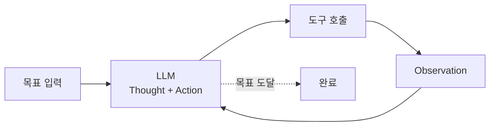
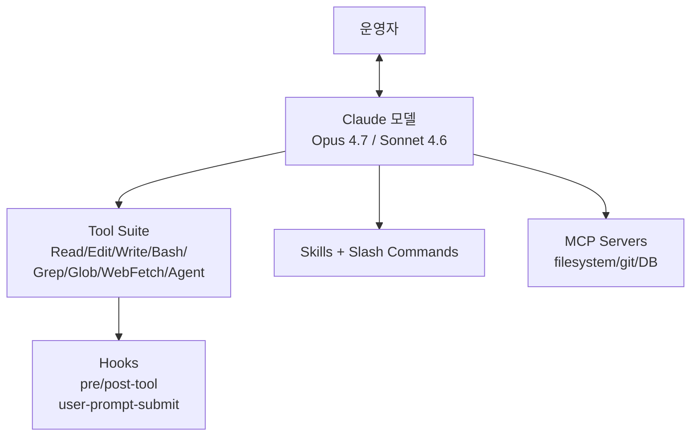
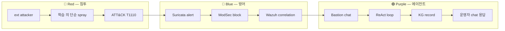

# W05 — AI 에이전트 (1): 에이전트 / Claude Code / 하네스 엔지니어링

> 본 주차는 **인공지능보안 (입문)** 의 5 주차이며, AI 에이전트 의 세 주차 시리즈 중 1 주차이다.
> W02-W04 에서 학습한 LLM 의 단발성 호출 → 본 주차부터 **장기 task 의 자율 수행 (Agent)** 으로 도약한다.

---

## 본 주차 의도

지금까지 학생은 LLM 을 "한 번 prompt → 한 번 응답" 의 도구로 사용했다. 그러나 **실 보안 운영** 은 단발 응답으로 끝나지 않는다.

- 새로 들어온 alert 의 분석 → 추가 정보 검색 (CTI, asset DB) → 가설 도출 → 검증 (실 명령 실행) → 결론 도출 → 보고서 작성. 이 모든 step 의 **이어짐** 이 필요하다.
- 학생이 동일 task 를 LLM 의 단발 호출 5-10 회를 수동 chain 하면 부담이며 실 수 발생. 운영자가 한 가지 high-level 의 의도 ("이 alert 의 위험도 분석") 만 주면 LLM 이 **스스로 step 의 계획·수행·검증·반성·재시도·완료** 의 자율 cycle 을 도는 시스템 — 이를 **AI 에이전트** 라 한다.

본 주차의 학습 목표:

1. **AI 에이전트** 의 개념 — single-shot LLM 과의 차이, ReAct·Plan-Execute 등 의 패러다임, 멀티 에이전트 구조.
2. **Claude Code** — Anthropic 의 공식 코딩 에이전트 의 architecture 와 사용 패턴. CCC 자체가 Claude Code 와 Bastion 의 협업으로 운영된다.
3. **하네스 엔지니어링 (Harness Engineering)** — LLM 의 자율 cycle 의 안전·검증·추적 framework. ReAct loop / verifier / tracer 의 운영 핵심.

후속 W06 (컨텍스트·KG·로컬 Bastion) → W07 (Bastion 의 실 보안 운영) 의 기반이 되는 주차이다. 본 주차 후 학생은 CCC 의 Bastion 이 실 ReAct + KG + harness 의 구현체임을 이해해야 한다.

---

## 1 차시 — AI 에이전트

### 1-1. 단발성 LLM 의 한계

W02-W04 의 실습에서 학생은 다음 패턴 을 사용했다:

```
[사람] curl /api/generate -d 'prompt: "이 alert 분석"' → [LLM] 응답 → [사람] 다음 작업
```

이 단발성 패턴 의 한계:

| 한계 | 설명 | 보안 운영 영향 |
|------|------|----------------|
| **상태 부재** | 매 호출 이 독립 → 이전 호출 의 결과 를 다음 호출 이 모름 | alert chain 의 인과 추적 불가 |
| **외부 도구 사용 불가** | LLM 은 텍스트 만 생성 → curl / grep / nmap 등 의 실 도구 호출 불가 | 가설 만 제시 / 검증 안 됨 |
| **자기 검증 부재** | 응답 의 옳고 그름 을 LLM 스스로 평가 안 함 | 환각 (hallucination) 의 영향 큼 |
| **장기 task 처리 부재** | 1 응답 의 길이 가 제한 (예: 4K-200K token) | 복잡한 incident response 의 전체 step 처리 불가 |
| **추적 부재** | LLM 의 내부 reasoning 이 운영자에게 불투명 | 사고 후 분석 (forensic) 시 reasoning trail 없음 |

이 5 한계 를 극복하려면 LLM 의 **위 (어떤 task 인가, 어떤 도구 가 가능한가)** 와 **아래 (각 step 의 결과 와 다음 step 의 입력)** 를 묶는 **시스템 (= 에이전트)** 이 필요하다.

### 1-2. AI 에이전트 의 정의

본 강의 의 정의 (실용 정의):

> **AI 에이전트 = LLM (Brain) + 도구 (Hands) + 컨텍스트·기억 (Memory) + 자율 cycle (Loop) + 안전·검증 (Harness) 의 통합 시스템.**

다섯 구성요소:

1. **Brain (LLM)** — 의도 이해 / 계획 / 추론 / 결과 해석. 일반적으로 GPT-4o / Claude 3.5 Sonnet / gpt-oss 등.
2. **Hands (Tools)** — 외부 시스템 호출. 예: bash 실행, HTTP API, 파일 시스템, DB 쿼리, web 검색.
3. **Memory (Context)** — 단기 메모리 (대화 history) + 장기 메모리 (vector DB / KG / file system).
4. **Loop (Cycle)** — ReAct / Plan-Execute / Reflexion 등. 에이전트 가 task 완료 까지 step 의 반복.
5. **Harness** — 안전 가드 / 검증기 (verifier) / 추적기 (tracer) / 종료 조건 / 회복 (recovery).

### 1-3. 에이전트 의 두 핵심 패러다임

#### (a) **ReAct** (Reasoning + Acting, Yao et al. 2022)

각 step 에서 LLM 이 다음 두 출력 을 동시 생성:

```
Thought: [현재 상태 + 다음 step 계획]
Action: [도구 호출 (도구명 + 인자)]
```

도구 호출 의 결과 가 **Observation** 으로 LLM 에 다시 입력되고, 다음 step 의 Thought/Action 을 생성. 이 반복 이 **ReAct loop**.



장점: 추론 과정 의 가시화 / 실 도구 사용 / 단발 LLM 의 환각 감소.
단점: step 수 가 늘면 token 비용 + 누적 오류.

#### (b) **Plan-and-Execute** (Wang et al. 2023)

step 별 호출 전, LLM 이 먼저 **전체 plan** 을 생성:

```
Plan:
1. /var/log/auth.log 의 최근 100 줄 추출
2. failed login 의 srcip 빈도 분석
3. 상위 3 srcip 의 GeoIP / CTI 확인
4. 종합 위험도 보고서
```

이후 각 step 을 순차 실행하며, 필요 시 **re-plan** (변경). 장점: 전체 task 의 가시화 + 운영자 가 plan 만 검토 후 자동 실행 가능. 단점: 초기 plan 의 정확도 가 결과 quality 의 상한.

### 1-4. 에이전트 의 다른 패러다임

| 패러다임 | 핵심 idea | 활용 |
|---------|-----------|------|
| **Reflexion** (Shinn 2023) | 실패 후 자기 비판 (self-reflection) 으로 다음 시도 개선 | 복잡 task 의 누적 학습 |
| **Tree of Thought** (Yao 2023) | 여러 분기 의 동시 탐색 → best path 선택 | 추론 의 다양성 |
| **Skill / Playbook** (CCC Bastion) | 운영 자주 사용 task 의 reusable script (Markdown) | 표준화 + 재사용 |
| **Hierarchical** (Multi-Agent) | 상위 의 Master / Manager + 하위 의 SubAgent | 대규모 task 분할 |
| **Voyager** (Wang 2023) | 평생 학습 + skill library 증식 | open-world game / robotics |
| **Agentic RAG** | RAG + 자율 retrieval re-plan | knowledge-intensive task |

### 1-5. 멀티 에이전트 의 구조

복잡한 운영 의 경우 단일 에이전트 의 reasoning 한계 가 명확. → 여러 에이전트 의 협업.

CCC 의 **3-layer Agent Architecture** (memory 의 기록):

| 계층 | 모델 | 역할 |
|------|------|------|
| **Master** | Claude Code (Anthropic) | 콘텐츠 제작 / 코드 작성 / 큰 그림 reasoning |
| **Manager** | gpt-oss:120b | 운영 의사결정 / 상황 진단 / 룰 생성 |
| **SubAgent** | gemma3:4b | 경량 검증 / log 분석 / 알람 triage |

각 계층 의 분담:

- **Master** 는 운영자 (사람) 와 직접 대화, 큰 의도 수신.
- **Master** 가 **Manager** 에게 운영 task 위임.
- **Manager** 가 다수 **SubAgent** 에게 작은 task 분배 + 결과 종합.

이 구조 의 장점: 비용 최적화 (대규모 LLM 은 큰 reasoning 에 만 사용) + 확장성 + 운영 의 GPU 자원 효율.

### 1-6. 에이전트 의 표준 protocol

산업 표준화 흐름:

| 표준 | 출시 | 핵심 |
|------|------|------|
| **OpenAI Function Calling** | 2023 | 함수 schema → LLM 의 JSON 호출 |
| **Anthropic Tool Use** | 2024 | XML 기반 tool 호출 / Computer Use (브라우저/OS) |
| **MCP (Model Context Protocol)** | 2024 (Anthropic) | 외부 도구 의 표준 server (filesystem / git / DB 등) |
| **AutoGen (MS)** | 2023 | 멀티 에이전트 conversation framework |
| **LangGraph** | 2024 | graph-based 에이전트 workflow |
| **CrewAI** | 2024 | role-based 에이전트 협업 |

MCP 의 의의 — 운영자 가 LLM 마다 별도 의 tool integration 을 짜지 않고, **표준 server** 만 구축하면 어떤 LLM 도 그 도구를 사용 가능. CCC 의 Bastion 은 자체 ReAct 구현이지만, MCP 통합 의 가능성 도 검토 중 (memory).

### 1-7. 에이전트 의 보안 위험 미리보기

이는 W08-W14 에서 상세 다루지만 본 주차 도입 차원:

- **Prompt injection** — 외부 텍스트 가 LLM 의 의도 를 탈취.
- **Tool 오남용** — LLM 이 의도 하지 않은 위험 도구 호출.
- **Data exfiltration** — 에이전트 가 민감 데이터 를 외부 전송.
- **무한 loop / 비용 폭발** — harness 의 종료 조건 부재 시.
- **공급망 공격** — MCP server / skill 의 변조.

본 주차 에서 본 항목 의 인식 만 — 상세 는 W08-W10 (AI Safety) 와 W13-W15 (에이전트 IR) 에서.

---

## 2 차시 — Claude Code

### 2-1. Claude Code 의 정의

> **Claude Code** 는 Anthropic 의 공식 CLI 의 코딩 에이전트. 사용자 와 대화 + 파일 읽기/쓰기 + bash 실행 + 외부 도구 호출 의 통합 환경.

출시: 2024-02 (research preview) → 2024-10 GA → 2025-2026 의 활발한 업데이트.

CCC 의 모든 콘텐츠 제작 (본 강의 의 lecture / lab / paper 포함) 은 Claude Code 에 의해 작성. 본 주차 강의 자체 도 Claude Code 가 작성 중. 즉, **학생 이 학습 하는 도구 가 곧 학생 의 학습 콘텐츠 의 저자** — 메타 적 의의 가 있다.

### 2-2. Claude Code 의 architecture (high-level)



핵심 구성:

| 구성 | 역할 |
|------|------|
| **Tools** | Read / Edit / Write / Bash / Grep / Glob / WebFetch / WebSearch / Agent (sub-agent) / TaskCreate 등 |
| **Hooks** | pre/post-tool / user-prompt-submit / session-start 등 — 외부 shell 명령 실행 |
| **Skills** | Markdown 파일 의 사용자 정의 명령 — `~/.claude/skills/` |
| **Slash commands** | `/help` `/clear` `/fast` `/loop` 등 |
| **MCP** | 외부 표준 도구 server |
| **Memory** | `~/.claude/projects/.../memory/` 의 자동 메모리 |
| **CLAUDE.md** | 프로젝트 의 instruction (현 ccc/CLAUDE.md 의 KG 규칙 등) |

### 2-3. Claude Code 의 사용 패턴

(a) **단발 task** — "이 함수 의 bug 를 찾아줘"

(b) **대화형 design** — "이 module 의 architecture 를 어떻게 잡을까?"

(c) **장기 cycle** — `/loop` 의 자동 반복 (예: 정기 모니터링)

(d) **하위 에이전트 위임** — `Agent` tool 로 sub-agent 호출 (병렬 / 격리)

(e) **워크트리 격리** — `isolation: worktree` 로 임시 git worktree 의 격리 작업

### 2-4. Claude Code 와 Bastion 의 협업

CCC 의 운영 모델 — Claude Code (Master) + Bastion (Manager):

- **Claude Code (외부, 인터넷 사용)** — 본인 콘텐츠 제작, 코드 작성, 큰 그림.
- **Bastion (내부, 폐쇄망, gpt-oss:120b)** — 6v6 인프라 의 운영, 보안 분석, 검증.

분담 의 이유:

- 운영 의 알람 / 데이터 는 폐쇄망 의 Bastion 만 접근.
- 큰 그림 / 콘텐츠 제작 / 코드 작성 은 외부 LLM (Claude Code) 가 효율.
- 폐쇄망 의 사고 가 외부 누출 안 되도록 격리.

Bastion 의 architecture 는 W06-W07 에서 상세.

### 2-5. Claude Code 의 핵심 tool 의 학습

학생 이 본인 PC 에 Claude Code 를 설치 (옵션 — 본 강의 진행 에 필수 아님) 한 경우 다음 명령 으로 사용:

```bash
# 설치 (선택 — 비용 발생)
npm install -g @anthropic-ai/claude-code

# 시작
claude
```

본 강의 의 실습 은 **Bastion 의 chat API** 로 진행 (폐쇄망 의 오픈소스 모델). Claude Code 는 외부 의 SaaS 이므로 학생 의 본인 책임 의 가입 후 사용 만.

각 tool 의 사용 예 (Claude Code 의 내부 동작):

```
User: "src/main.py 의 100 번째 줄 의 함수 를 보여줘"
→ Claude 가 Read tool 호출 (file_path=/.../src/main.py, offset=100, limit=20)
→ tool result 가 Claude 에 반환
→ Claude 가 운영자 에게 결과 설명
```

### 2-6. Claude Code 의 hook 시스템

hook 의 핵심 — 운영자 가 정의 한 shell 명령 이 특정 event 의 발생 시 자동 실행.

예: 모든 file edit 후 자동 lint:

```json
{
  "hooks": {
    "post-tool": [
      {"matcher": "Edit|Write", "command": "python -m black /path/to/file"}
    ]
  }
}
```

본 강의 의 운영 — CCC 자체 의 cron · sync · push · KG 통합 일부 가 hook 으로 구현.

### 2-7. Claude Code 의 skill (slash command)

skill = Markdown 파일 + frontmatter (allowed-tools, description). 사용자 가 `/<skill-name>` 으로 호출.

예: `~/.claude/skills/audit.md`:

```markdown
---
description: 현 branch 의 보안 audit
allowed-tools: Bash, Read, Grep
---

# audit skill

1. git status / diff 확인
2. 변경된 파일 의 dangerous pattern 검색
3. 결과 요약
```

호출: 운영자 가 `/audit` 입력 → Claude 가 skill 본문 의 지시 대로 동작.

### 2-8. Claude Code 의 MCP server

MCP server 의 예 (Anthropic 의 공식):

- `@modelcontextprotocol/server-filesystem` — 특정 디렉토리 의 안전 file access
- `@modelcontextprotocol/server-git` — git 의 표준 명령
- `@modelcontextprotocol/server-postgres` — DB 의 SQL 호출
- `@modelcontextprotocol/server-puppeteer` — browser automation

CCC 의 가능 한 통합 — Bastion 의 KG / chat API 를 MCP server 로 expose 하면 Claude Code 에서 직접 호출 가능 (현재 검토 중).

### 2-9. Claude Code 의 운영 안전

- **/permissions** — tool 의 자동 허용 / 거부 의 세부 제어.
- **/clear** — context 의 비움 — 민감 정보 의 누출 방지.
- **/exit-plan-mode** — Plan mode 의 종료 후 실행.
- **CLAUDE.md** — 프로젝트 의 instruction (예: "절대 X 하지 마") — 강력 한 system prompt.
- **memory** — 영구 기록 (`~/.claude/projects/.../memory/`) — 다음 세션 의 컨텍스트.

본 강의 의 메모리 가 그 한 예 — 본 강의 의 시작 전 의 사용자 의 의도 / 작업 원칙 이 모두 memory 의 기록.

---

## 3 차시 — 하네스 엔지니어링

### 3-1. 하네스 (Harness) 의 정의

> **하네스 = AI 에이전트 의 자율 동작 의 안전 / 검증 / 추적 / 회복 의 통합 framework.**

ML 의 학습 의 harness 와 다름 — 에이전트 의 운영 시 의 한계 강제 / 행위 기록 / 실패 회복 의 총칭.

핵심 구성요소:

| 구성 | 역할 |
|------|------|
| **Guardrail** | 입출력 의 안전 검사 (위험 명령 / PII / 외부 도메인) |
| **Verifier** | 각 step 의 결과 검증 (LLM-as-judge / heuristic / regex) |
| **Tracer** | 모든 step 의 thought / action / observation 기록 |
| **Limiter** | token / time / step / cost 의 상한 |
| **Recoverer** | 실패 시 fallback / retry / human-in-loop |
| **Terminator** | 종료 조건 (성공 / 한계 도달 / 사용자 중단) |

### 3-2. Guardrail

목적 — LLM 의 위험 한 행위 를 사전 차단.

종류:

- **입력 guardrail** — 사용자 의 prompt 의 검사. 예: prompt injection 패턴 / PII / 외부 system instruction.
- **출력 guardrail** — LLM 의 응답 의 검사. 예: 위험 한 명령 / 외부 URL / 비밀 키.
- **도구 호출 guardrail** — Tool 의 인자 의 검사. 예: rm -rf / / 외부 IP 의 nmap.

오픈소스:

- **NeMo Guardrails** (NVIDIA, 2023) — Colang 기반 의 dialog 안전 규칙.
- **guardrails-ai** (Python, 2023) — LLM 출력 의 schema 검증 + 재시도.
- **LangChain Constitutional AI** — Anthropic 의 self-critique 통합.
- **AWS Bedrock Guardrails** — managed service.

CCC 의 Bastion 의 guardrail (memory 의 KG 통합 + 야매 금지 원칙):

- alerts.json 의 외부 IP 의 도구 호출 차단.
- 학생 환경 외부 의 명령 거부.
- 모든 chat 의 kg_status 가 응답 에 포함 — 운영자 가 즉시 확인.

### 3-3. Verifier

LLM 의 응답 / 행위 의 옳고 그름 의 판정. 두 접근:

(a) **LLM-as-judge** — 다른 LLM 의 평가. 예: gemma3:4b 의 응답 을 gpt-oss:120b 가 grading.

(b) **Heuristic / Rule-based** — regex / schema / contains 의 자동 검증.

CCC 의 lab 의 verify 의 구조 (학생 의 lab yaml 의 형식):

```yaml
verify:
  type: output_contains   # heuristic
  expect: "특정 키워드"
  semantic:                # LLM-as-judge
    intent: "intent 의 한 줄 설명"
    success_criteria: [...]
    acceptable_methods: [...]
```

운영 의 의의 — 학생 의 답안 의 다양성 의 인정 + 명확 한 합격 기준.

### 3-4. Tracer

모든 step 의 기록 — Thought / Action / Observation / 의사결정.

기록 의 의의:

- **사후 분석** — 사고 후 의 reasoning 의 trail 의 확인.
- **개선** — 성공 / 실패 패턴 의 학습.
- **법적 / 규정 준수** — AI 의 결정 의 의의 의 책임 의 추적.

오픈소스:

- **OpenTelemetry GenAI** — 표준 span attribute (gen_ai.system / gen_ai.request.model / gen_ai.usage.input_tokens 등).
- **LangSmith** (LangChain) — managed tracing.
- **Arize Phoenix** — 오픈소스 LLM observability.
- **Helicone** — proxy 기반 tracing.

CCC 의 Bastion 의 tracing — `/kg/audit?limit=N` 으로 최근 chat 의 KG 흔적 확인. 매 ReAct cycle 의 종료 시 task_outcome anchor 의 기록.

### 3-5. Limiter

상한 의 강제:

- **token** — input + output 의 token 의 상한 (모델 의 context window 의 보호 + 비용).
- **time** — step 별 / 전체 의 시간 의 상한.
- **step** — ReAct loop 의 step 수 의 상한 (무한 loop 방지).
- **cost** — 비용 의 상한.
- **API call** — rate limit 의 준수.

CCC 의 Bastion 의 한계 (memory 의 GPU 단일 — 모든 chat 호출 직렬 원칙):

- 동시 호출 의 강제 직렬화 — 진단 curl 도 driver 가동 중 동시 금지.
- 51 case 손실 사고 의 학습 (2026-05-09).

### 3-6. Recoverer

실패 시:

- **retry** — 동일 step 의 재시도 (보통 exponential backoff).
- **fallback** — 대안 step 의 시도 (예: gpt-oss:120b 실패 → gemma3:4b).
- **human-in-loop** — 자동 처리 불가 시 운영자 에게 escalation.
- **rollback** — 변경 의 취소 (예: git revert / DB transaction rollback).

CCC 의 Bastion 의 회복 — KG 호출 실패 시 stderr `[KG-WARN]` print + 운영자 즉시 인지.

### 3-7. Terminator

종료 조건 의 명시:

- **성공 종료** — verify 의 통과 / goal 의 충족.
- **한계 종료** — step / time / token 의 상한 도달.
- **거부 종료** — guardrail 의 위반.
- **사용자 중단** — interrupt / cancel.

종료 조건 의 부재 의 위험:

- 무한 loop → 비용 폭발.
- 의도 하지 않은 행위 의 계속.
- 운영자 의 가시화 의 상실.

### 3-8. R/B/P (Red / Blue / Purple) — 본 주차 의 시나리오



본 시나리오 의 의의 — 학생 이 본 주차 에 학습 한 에이전트 / Claude Code / 하네스 의 통합 동작 을 6v6 의 실 환경 에서 확인.

### 3-9. 하네스 의 운영 의 KPI

운영자 가 점검 해야 할 지표:

| 지표 | 의의 |
|------|------|
| **task 성공률** | (성공 / 시도) × 100 |
| **평균 step 수** | task 별 의 ReAct step 의 평균 |
| **token 사용량** | input + output token 의 합 |
| **비용** | token × price |
| **시간** | task 별 의 latency |
| **guardrail 차단률** | (차단 / 전체) × 100 |
| **재시도율** | (재시도 / 시도) × 100 |
| **human escalation 률** | (escalation / 시도) × 100 |

본 강의 의 다음 주차 (W06-W07) 에서 Bastion 의 위 KPI 의 실 측정.

---

## 본 주차 의 hands-on

본 주차 의 lab 의 5 step (lab yaml 참조):

1. **Bastion 의 chat 의 ReAct trace 의 가시화** — chat 의 thought / action 의 응답 의 분석.
2. **Bastion 의 skill 카탈로그 의 가시화** — /skills 의 33 종 의 확인.
3. **Bastion 의 KG audit 의 가시화** — /kg/audit 의 최근 chat 의 KG 흔적.
4. **Claude Code 의 tool 의 sequential 의 시뮬레이션** — Python script 의 ReAct loop 의 미니 demo.
5. **harness 의 5 의 verifier / limiter 의 미니 demo** — Python 의 simple guardrail + limiter 의 demo.

---

## 본 주차 의 정리

1. **AI 에이전트** = Brain + Hands + Memory + Loop + Harness 의 통합.
2. **ReAct** 의 패러다임 의 단순성 + 효과 — Thought / Action / Observation 의 cycle.
3. **Plan-Execute** 의 가시화 + 운영자 의 검토 의 효과.
4. **멀티 에이전트** 의 비용 / 확장 의 효과 — CCC 의 3-layer 의 학습.
5. **Claude Code** 의 architecture — Tool / Hook / Skill / MCP / Memory.
6. **하네스** 의 6 구성 — Guardrail / Verifier / Tracer / Limiter / Recoverer / Terminator.
7. CCC 의 Bastion 은 ReAct + KG + Harness 의 실 구현체 — W06-W07 에서 상세 학습.

---

## 자기 점검 (반드시 본인 의 학습 의 답 으로)

- ReAct 의 3 구성 (Thought / Action / Observation) 을 한 문장 으로 정의 가능?
- Claude Code 의 tool 의 5 이상 의 이름 의 즉시 응답 가능?
- 하네스 의 6 구성 의 각 의 1 의 예 의 응답 가능?
- 본인 의 사용 의 시 의 가장 우려 의 보안 위험 1 의 응답 가능?

답 의 어려운 부분 은 다음 주차 의 시작 전 의 본인 의 보강.

---

## 다음 주차

**W06 — AI 에이전트 (2): 컨텍스트 / KG·위키 / 로컬 Bastion**

- 컨텍스트 의 종류 (단기 / 장기 / 외부)
- KG 의 구조 (RDF / Cypher) 와 CCC 의 PE-KG
- 위키 (markdown 기반 의 문서 기억)
- 로컬 Bastion 의 architecture 의 깊이

본 강의 의 후속 W07 (Bastion 활용 보안 운영) 의 전 단계.
