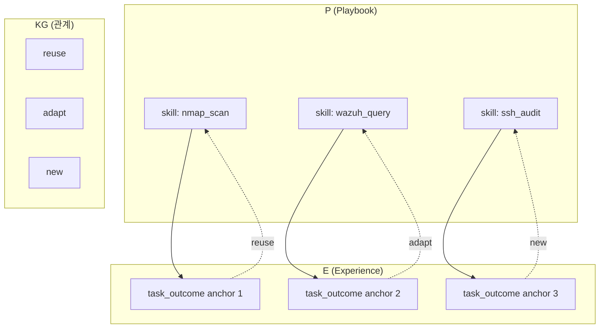
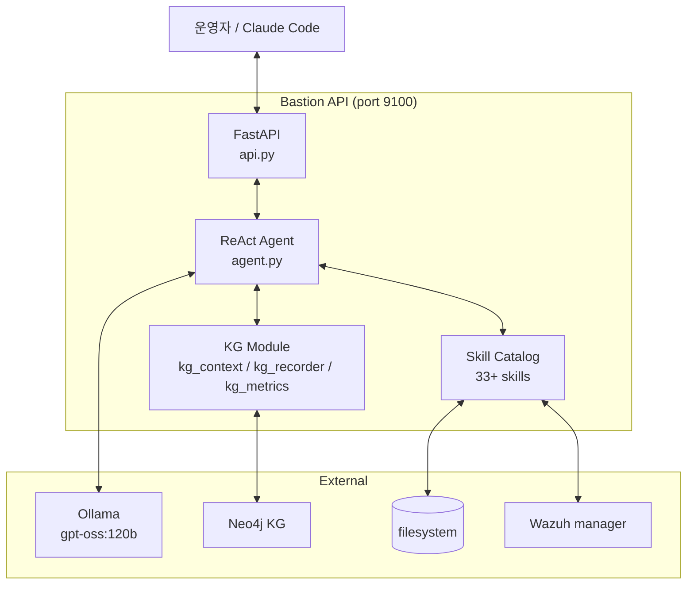

# W06 — AI 에이전트 (2): 컨텍스트 / KG·위키 / 로컬 Bastion

> 본 주차는 **인공지능보안 (입문)** 의 6 주차이며, AI 에이전트 시리즈 의 2 주차이다.
> W05 에서 학습한 ReAct / Claude Code / 하네스 의 6 구성 을 기반으로, 본 주차는 에이전트 의
> **기억** (컨텍스트 / KG / 위키) 의 깊이 와, CCC 의 **로컬 Bastion** 의 실 architecture 를 학습한다.

---

## 본 주차 의도

W05 에서 학생은 에이전트 = Brain + Hands + Memory + Loop + Harness 임을 배웠다. 그러나 **Memory** 의 깊이 는 충분히 다루지 못했다.

운영 의 현실:

- 단일 LLM 호출 의 응답 의 quality 의 80% 는 **prompt 의 context** 가 좌우.
- 동일 의 모델 에 동일 의 질문 — context 가 빈약 하면 환각 / 풍부 하면 정확 / 오염 되면 위험.
- 따라서 운영자 의 시간 의 가장 큰 투자처 는 **context engineering** 이라는 견해 가 산업 의 흐름.

본 주차 학습 목표:

1. **컨텍스트** 의 종류 (단기 / 장기 / 외부) 와 운영 의 의의.
2. **KG (Knowledge Graph)** 의 구조 (RDF / Cypher / property graph) 와 CCC 의 PE-KG (Playbook + Experience + Knowledge Graph) 의 의의.
3. **위키 (Wiki / Markdown-based memory)** — 단순 file system 기반 의 영구 기억 의 유효성.
4. **로컬 Bastion** 의 실 architecture — agent.py / kg_context.py / kg_recorder.py / api.py 등.

후속 W07 (Bastion 활용 보안 운영) 의 직접 전 단계.

---

## 1 차시 — 컨텍스트 의 깊이

### 1-1. 컨텍스트 의 정의

> **컨텍스트** = LLM 호출 의 prompt 에 포함 된 모든 텍스트. system message + user message + 이전 turn 의 history + 외부 retrieved chunk + tool 의 결과 등 의 총합.

LLM 의 매 호출 은 stateless — 모델 은 매 호출 의 입력 텍스트 만 본다. 따라서 운영자 는 **무엇 을 넣을 지** 의 의사결정 의 모든 책임 을 가진다.

### 1-2. 컨텍스트 의 종류

#### (a) **단기 컨텍스트** (Short-term / Working Memory)

- 현재 대화 의 turn 의 누적.
- 보통 마지막 N turn (예: 10 turn) 의 history.
- 모델 의 context window 의 제약 의 영향.

```
turn 1: 사용자 "이 alert 위험도?"
turn 1: assistant "위험도 high — 5W..."
turn 2: 사용자 "그 srcip 의 GeoIP?"
turn 2: assistant ...
```

운영 의 문제:

- context window 의 한계 (예: gpt-oss:120b 의 32K-128K, gemma3:4b 의 8K).
- 누적 시 비용 + 응답 시간 증가.
- 오래 된 turn 의 정보 의 staleness.

해결:

- **summarization** — 오래 된 turn 의 요약.
- **truncation** — 가장 최근 N turn 만.
- **selective retention** — 중요 한 turn 만 유지.

#### (b) **장기 컨텍스트** (Long-term Memory)

- 세션 의 종료 후 도 유지 의 기억.
- 보통 외부 storage (file system / vector DB / KG / SQL).

종류:

| 종류 | 저장 | 검색 |
|------|------|------|
| **Episodic** | 과거 의 한 event 의 기록 | 시간 / event id |
| **Semantic** | 사실 / 개념 의 추상 화 | 유사 의미 |
| **Procedural** | how-to 절차 | task 의 유사성 |

CCC 의 Bastion 의 KG 의 일부 = episodic (task_outcome anchor) + semantic (Playbook 의 skill catalog).

Claude Code 의 memory 의 일부 = episodic (`feedback_*.md`) + semantic (`project_*.md`).

#### (c) **외부 컨텍스트** (Retrieved / Tool Output)

- RAG 의 retrieved chunk.
- tool 의 호출 결과 (예: curl / grep / db query).
- web search 결과.
- file 의 내용.

특징:

- 매 호출 의 동적 의 입력.
- 신뢰도 의 변동.
- 오염 (poisoning) 의 위험 (W09 에서 상세).

### 1-3. Context Window 의 한계

| 모델 | context window | 비고 |
|------|----------------|------|
| gemma3:4b | 8K | 경량 |
| llama3.1:8b | 128K | 중급 |
| Claude 3.5 Sonnet | 200K | 상급 |
| Claude Opus 4.7 (1M) | 1M | 본 강의 의 저자 |
| gpt-oss:120b | 32K-128K | Bastion 의 default |
| Gemini 2.0 Pro | 2M | Google |

**1M context 의 의의** — 책 한 권 의 통째 입력 가능 → RAG 의 일부 의 대체 가능. 그러나 비용 / latency / lost-in-the-middle 의 문제 잔존.

### 1-4. Lost in the Middle

Liu et al. (2023) — LLM 의 긴 context 의 중간 부분 의 정보 의 회상 률 의 저하. U-shaped curve — 시작 / 끝 의 정보 의 회상 이 중간 보다 우수.

대응:

- **핵심 정보 의 시작 / 끝** 의 배치.
- **요약 의 사전 추출**.
- **chunking + reranker** 의 사용.

### 1-5. Prompt Engineering 의 context 측면

W03 에서 학습 한 6 기법 의 context 측면 의 재 학습:

| 기법 | context 의 특징 |
|------|-----------------|
| Zero-shot | 최소 context |
| Few-shot | 예시 의 context 추가 |
| CoT | reasoning step 의 context 의 명시 적 분리 |
| RAG | 외부 chunk 의 context 의 동적 주입 |
| ReAct | Thought / Observation 의 누적 의 context |
| Reflexion | 이전 시도 의 reflection 의 context |

### 1-6. 컨텍스트 의 운영 의 best practice

- **system message 의 명확** — 역할 / 거부 / format 의 사전 정의.
- **role separation** — system / user / assistant 의 엄격 한 구분.
- **PII / 비밀 의 redaction** — context 의 외부 누출 방지.
- **versioning** — system prompt / template 의 버전 관리.
- **A/B testing** — context 변경 의 quality 의 측정.
- **observability** — prompt + response + cost 의 기록.

---

## 2 차시 — KG 와 위키

### 2-1. KG (Knowledge Graph) 의 정의

> **KG** = 개체 (entity) + 관계 (relation) + 속성 (property) 의 그래프 구조 의 지식 저장.

전통 적 의 KG — DBpedia (Wikipedia 의 RDF), Wikidata, Google Knowledge Graph.

CCC 의 KG — 사이버보안 운영 의 task / playbook / experience 의 그래프.

### 2-2. KG 의 표현 의 두 형식

#### (a) **RDF (Resource Description Framework)**

W3C 표준 (1999 ~). triple = (subject, predicate, object) 의 단위.

```ttl
@prefix ccc: <https://ccc.example/> .
@prefix sec: <https://sec.example/> .

ccc:playbook_sshd_brute  sec:detects  sec:attack_T1110_001 .
ccc:playbook_sshd_brute  sec:uses     sec:tool_wazuh .
ccc:playbook_sshd_brute  sec:trigger  sec:rule_5710 .
```

쿼리 — **SPARQL**:

```sparql
PREFIX sec: <https://sec.example/>
SELECT ?p WHERE {
  ?p sec:detects sec:attack_T1110_001 .
}
```

#### (b) **Property Graph** (Neo4j 의 표준)

node + edge 의 property 의 자유 추가.

```cypher
CREATE (p:Playbook {name:"sshd_brute", lang:"ko"})
CREATE (a:Attack {id:"T1110.001"})
CREATE (p)-[:DETECTS]->(a)
```

쿼리 — **Cypher**:

```cypher
MATCH (p:Playbook)-[:DETECTS]->(a:Attack {id:"T1110.001"})
RETURN p.name
```

### 2-3. KG 의 보안 의 활용

- **MITRE ATT&CK** 의 자체 가 graph (Tactic ← Technique ← Sub-technique ← Mitigation ← Group).
- **CVE / CWE / CAPEC** 의 연계.
- **MISP** 의 IoC 의 graph.
- **STIX 2** 의 cyber observable 의 graph.

### 2-4. CCC 의 PE-KG (Playbook + Experience + KG)

CCC 의 Bastion 의 KG (paper-draft.md §4 의 그림):



PE-KG 의 의의:

- **Playbook** = 운영 자주 사용 task 의 markdown 의 reusable skill (예: nmap_scan / wazuh_query / ssh_audit).
- **Experience** = 각 chat 의 ReAct cycle 의 종료 시 의 task_outcome anchor 의 기록.
- **KG** = Playbook ↔ Experience 의 관계 (reuse / adapt / new) 의 graph.

이 모델 의 의의:

1. **재사용** — 비슷 한 task 의 과거 의 성공 의 Playbook 의 자동 추천.
2. **적응** — 약간 다른 task 의 경우 Playbook 의 일부 수정 후 사용.
3. **신규** — 없는 경우 새 Playbook 의 자동 생성 후 KG 에 등록.

### 2-5. CCC 의 KG 의 운영 의 강제

CLAUDE.md 의 명시 (memory 의 기록 도 동일):

```
bastion agent 의 모든 LLM 호출은 KG (Knowledge Graph) 를 강제 사전 참조 + 결과
anchor 사후 기록 한다. 이 동작은 코드에 hard-coded 되어 있으며 운영 중 비활성화
하지 않는다.
```

이 강제 의 이유:

- 학습 의 누적 — 매 chat 의 학습 의 일부 가 KG 에 적층.
- 실험 의 통계 — paper 의 §7 의 데이터 source.
- 운영자 의 가시화 — kg_status 의 매 chat 의 응답 에 포함.

### 2-6. CCC 의 KG 의 audit / metrics

```bash
# 통합 health
curl http://192.168.0.103:8003/kg/health

# 최근 task_outcome anchor
curl 'http://192.168.0.103:8003/kg/anchors/recent?kind=task_outcome&limit=5'

# metrics snapshot
curl http://192.168.0.103:8003/kg/metrics
```

### 2-7. KG 의 대안 — 위키 (Wiki / Markdown)

KG 의 단점:

- graph DB (Neo4j) 의 운영 의 overhead.
- 스키마 의 사전 설계 의 필요.
- 단순 검색 (text grep) 의 효율 의 부족.

대안 — **markdown 기반 의 file system 위키**.

#### (a) **flat markdown wiki**

- `~/.claude/projects/.../memory/` 의 CCC 의 memory.
- 각 memory 의 단일 markdown.
- MEMORY.md 의 index (one-liner pointer).

장점: 단순 / 인간 가독 / git 의 친화.
단점: 그래프 의 관계 의 표현 의 한계.

#### (b) **Obsidian / Logseq** 의 [[backlink]] 기반

각 노트 의 [[다른 노트]] 의 링크 → 자동 graph.

#### (c) **CCC 의 cuRSor / Claude Code memory**

- frontmatter (type / name / description) 의 미니 schema.
- 본문 의 자유 markdown.
- 검색 의 grep / fzf 의 효율.

본 강의 의 저자 (Claude Code) 의 작업 의 모든 의 기록 — `~/.claude/projects/-home-opsclaw-ccc/memory/` 의 markdown 의 누적.

### 2-8. KG vs Wiki 의 선택 의 가이드

| 기준 | KG | Wiki |
|------|----|----|
| 관계 의 복잡성 | 높음 | 낮음 |
| 운영 의 부담 | 높음 | 낮음 |
| 검색 의 expressiveness | 높음 (Cypher) | 낮음 (grep) |
| 인간 의 가독 | 낮음 | 높음 |
| LLM 의 입력 의 친화 | 중간 (graph → text) | 높음 |
| 변경 의 빈도 | 낮음 (스키마) | 높음 |

CCC 의 선택 — **둘 다 운영**. PE-KG 는 graph DB (Neo4j) + memory 는 markdown 의 file system.

---

## 3 차시 — 로컬 Bastion 의 architecture

### 3-1. Bastion 의 정의

> **Bastion** = CCC 의 single-GPU / 폐쇄망 / cybersecurity LLM agent. CCC 의 6v6 의 안 의 인프라 의 운영 / 관리 / 학습 의 자동화 의 주체.

논문 — `ccc/contents/papers/bastion/paper-draft.md` (v0.4).

특징:

- **single-GPU** — 1 의 GPU (예: RTX 4090) 의 환경 의 운영 가정.
- **closed-network** — 외부 인터넷 의 차단 의 폐쇄망.
- **cybersecurity-focused** — 일반 코딩 LLM 이 아닌, 보안 운영 의 특화.
- **agentic** — ReAct + KG + harness 의 통합.

### 3-2. Bastion 의 architecture (high-level)



### 3-3. Bastion 의 module 의 분담

| module | 위치 | 역할 |
|--------|------|------|
| `agent.py` | packages/bastion | ReAct loop + LLM 호출 + tool 실행 |
| `kg_context.py` | packages/bastion | LLM 호출 전 KG 검색 → system prompt 주입 |
| `kg_recorder.py` | packages/bastion | ReAct 종료 시 task_outcome anchor 기록 |
| `kg_metrics.py` | packages/bastion | KG 사용 counter / histogram |
| `skills.py` | packages/bastion | skill 카탈로그 의 로드 + 호출 |
| `api.py` | apps/bastion | FastAPI 의 endpoint |

### 3-4. Bastion 의 ReAct loop 의 구현

`agent.py` 의 high-level pseudocode:

```python
def react_loop(message, goal):
    # 1. KG context injection
    kg_ctx = kg_context.fetch(goal)
    system_prompt = build_system_prompt(kg_ctx)

    history = []
    for step in range(MAX_STEPS):
        # 2. LLM 호출 — Thought + Action
        resp = llm.call(system_prompt, message, history)
        thought, action = parse(resp)

        if action.name == "done":
            break

        # 3. tool 실행 (skill catalog)
        skill = skills.get(action.name)
        obs = skill.run(action.args)

        # 4. history append
        history.append({"thought": thought, "action": action, "obs": obs})

    # 5. KG anchor 기록
    kg_recorder.record(goal, history, outcome)

    return final_response(history)
```

### 3-5. Bastion 의 API endpoint

`api.py` 의 주요 endpoint:

| endpoint | 메서드 | 역할 |
|----------|--------|------|
| `/health` | GET | 통합 health + KG 상태 포함 |
| `/kg/health` | GET | KG 통합 전용 health |
| `/kg/audit` | GET | 최근 chat 의 KG 흔적 |
| `/kg/metrics` | GET | counter snapshot |
| `/kg/anchors/recent` | GET | 최근 anchor |
| `/chat` | POST | 사용자 의 chat 호출 |
| `/chats` | GET | chat history |
| `/skills` | GET | skill 카탈로그 |

### 3-6. Bastion 의 운영 의 banner 와 가시화

bastion 시작 시 stderr 에 KG banner — 모든 module + DB 통과 확인 후 만 `ENABLED`, 한쪽 이라도 실패 시 `★DEGRADED`.

운영자 의 검증:

```bash
# 통합 health
curl http://192.168.0.103:8003/kg/health

# 최근 anchor
curl 'http://192.168.0.103:8003/kg/anchors/recent?kind=task_outcome&limit=5'

# metrics
curl http://192.168.0.103:8003/kg/metrics

# 39 tests
set -a && . ./.env && set +a && python3 -m pytest tests/bastion/
```

### 3-7. Bastion 의 운영 의 원칙 (memory 의 강제)

- **모든 chat 응답에 kg_status event 포함** — 호출자 매 chat KG 사용·기록 verify 가능.
- **KG 호출 실패 시 stderr `[KG-WARN]` print** (silent 금지) — 운영자 즉시 인지.
- **bastion 시작 시 KG banner** — 모든 module + DB 통과 후 만 ENABLED.
- **`/health` 응답 의 kg.all_modules_loaded == false → 즉시 조사**.
- **임의 의 KG hook 제거 / silent disable → 사전 동의 없이 변경 금지**.

### 3-8. Bastion 의 GPU 단일 의 직렬화 의 제약

memory 의 강제 (project_gpu_sequential.md):

```
driver 가동 중 진단 curl 1개 도 동시 금지. 2026-05-09 51 case 손실 사고.
```

이 제약 의 의의:

- GPU 의 단일 → 동시 호출 의 queue 의 폭주 의 위험.
- driver (자동 검증) 의 운영 중 추가 호출 의 의도 하지 않은 영향.
- 실 운영 의 사고 의 기록 (2026-05-09 51 case 손실).

운영 의 표준 — 모든 LLM 호출 의 직렬 / 사전 검토 / 사후 검증.

### 3-9. Bastion 과 Claude Code 의 분담 의 재 학습

| 측면 | Claude Code | Bastion |
|------|-------------|---------|
| **위치** | 외부 SaaS (Anthropic) | 폐쇄망 의 로컬 |
| **모델** | Claude Opus 4.7 / Sonnet 4.6 | gpt-oss:120b |
| **인터넷** | 사용 가능 | 차단 |
| **자료 접근** | 운영 의 비밀 의 접근 의 제한 | 폐쇄망 의 모든 자료 |
| **비용** | API 의 token 비용 | self-host 의 고정 비용 |
| **속도** | 빠름 (cloud) | 보통 (single GPU) |
| **역할** | 콘텐츠 제작 / 코드 작성 / 큰 그림 | 운영 / 보안 분석 / 검증 |

### 3-10. R/B/P — 본 주차 의 시나리오

```mermaid
flowchart LR
    subgraph Red [🔴 Red — 침투]
        R1[Web SQLi 시도]
    end

    subgraph Blue [🔵 Blue — 방어]
        B1[ModSec 941100 차단]
        B2[Wazuh 5710 alert]
    end

    subgraph Purple [🟣 Purple — 에이전트]
        P1[/chat 호출]
        P2[KG context 검색]
        P3[ReAct loop]
        P4[task_outcome anchor 기록]
        P5[운영자 응답]
    end

    R1 --> B1 --> B2 --> P1 --> P2 --> P3 --> P4 --> P5
```

### 3-11. 본 주차 의 hands-on

본 주차 의 lab 의 5 step (lab yaml 참조):

1. **context window** 의 비교 — Ollama 의 num_ctx option 의 응답 의 변화.
2. **KG /audit + /metrics + /health** 의 통합 가시화.
3. **memory 의 markdown 의 학습** — `~/.claude/projects/.../memory/` 의 구조 의 가시화.
4. **paper-draft.md §4 KG 섹션** 의 정독 + 1 단락 의 요약.
5. **Bastion 의 통합 검증** — pytest 의 실행 (가능 시) 또는 /health + /kg/health 의 비교.

---

## 본 주차 의 정리

1. **컨텍스트** 의 3 종 — 단기 / 장기 / 외부.
2. **Context window** 의 한계 와 **Lost in the Middle** 의 패턴.
3. **KG** 의 2 형식 — RDF + property graph.
4. **CCC 의 PE-KG** — Playbook + Experience + KG 의 통합.
5. **위키** 의 markdown 의 단순성 + git 의 친화 + 인간 가독.
6. **Bastion** 의 architecture — agent / kg_context / kg_recorder / kg_metrics / skills / api.
7. **운영 의 강제** — kg_status / banner / 직렬화 / hook 의 보존.

---

## 자기 점검

- 컨텍스트 의 3 종 의 한 줄 의 정의 가능?
- KG 의 RDF triple 의 예시 1 의 응답 가능?
- CCC 의 PE-KG 의 reuse / adapt / new 의 의의 의 응답 가능?
- Bastion 의 5 module 의 역할 의 응답 가능?

---

## 다음 주차

**W07 — AI 에이전트 (3): Bastion 활용 보안 운영 / 취약점 / 모의해킹**

- Bastion 의 실 운영 의 case study.
- 취약점 분석 의 Bastion 의 워크플로우.
- 모의해킹 보조 의 Bastion 의 ATT&CK 매핑.

본 주차 (W05-W06) 의 학습 의 운영 의 적용.
