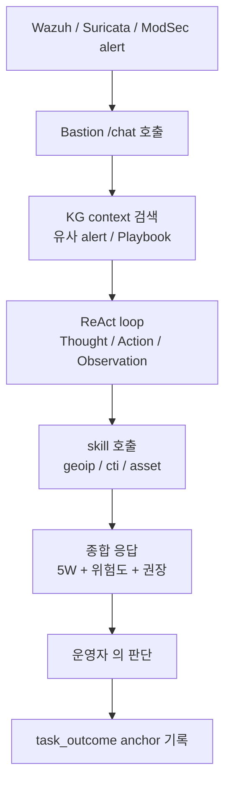
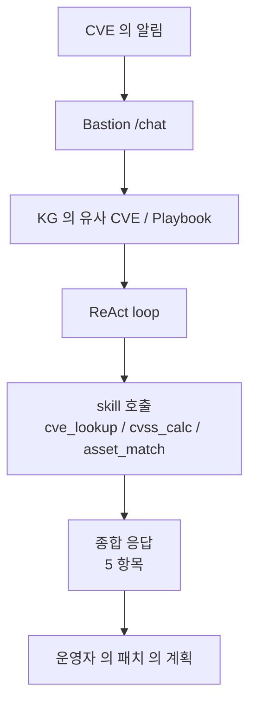
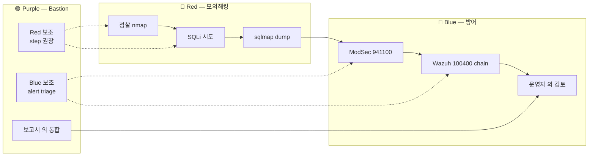

# W07 — AI 에이전트 (3): Bastion 활용 보안 운영 / 취약점 / 모의해킹

> 본 주차는 **인공지능보안 (입문)** 의 7 주차이며, AI 에이전트 시리즈 의 마지막 주차이다.
> W05 (에이전트 / Claude Code / 하네스) + W06 (컨텍스트 / KG / Bastion architecture) 의 학습 위에,
> **Bastion 의 실 운영** 의 3 case (보안 운영 / 취약점 분석 / 모의해킹 보조) 의 통합 실습.

---

## 본 주차 의도

W05-W06 의 학습 은 **이론 / 개념 / architecture** 에 집중. 본 주차 는 **실 운영 / 실 명령 / 실 응답** 의 hands-on.

운영 의 의의 — 학생 이 본 주차 의 종료 후 다음 3 task 의 본인 실 수행 가능 해야 함:

1. **보안 운영** — Bastion 의 chat 으로 alert triage / correlation / 보고서 작성.
2. **취약점 분석** — Bastion 의 chat 으로 CVE / 환경 / 권장 패치 의 통합 분석.
3. **모의해킹 보조** — Bastion 의 chat 으로 학습 환경 의 침투 step 의 권장 + ATT&CK 매핑.

본 주차 의 한계 — Bastion 의 운영 의 **자율 수준 의 100% 의 신뢰 는 아직** 의 점 의 명확 한 인식. AI Safety (W08-W10) 의 학습 이 필수.

---

## 1 차시 — Bastion 의 활용 보안 운영

### 1-0. 응급실 전공 의사에 비유하기

본 차시 학습을 시작하면서 일상의 풍경에 빗대어 본다.

대학 병원 응급실을 떠올려 보자. 응급실에는 매일 100명 이상의 환자가 들어오고, 환자 처리는 3단계로 이루어진다.

**환자 처리 3단계.**

- **Step 1: 접수 + 활력 측정.** 간호사가 첫 분류를 한다 — 응급, 긴급, 일반의 3가지로 나눈다.
- **Step 2: 전공 의사 진단.** 전공 의사가 환자를 진찰하고 검사 결과를 종합해 진단한다.
- **Step 3: 처치 의사결정.** 전공 의사가 처치 방향을 결정한다 — 즉시 수술, 입원, 외래.

이 3단계가 보안 SOC 와 그대로 대응된다.

| 응급실 | 보안 SOC |
|--------|----------|
| Step 1: 간호사 분류 | rule-based alert 자동 분류 (Wazuh / Suricata) |
| Step 2: 전공 의사 진단 | LLM (Bastion) 의 alert 분석 (5W + 위험도) |
| Step 3: 처치 의사결정 | 인간 SOC 분석가의 최종 의사결정 |

**전공 의사가 지켜야 할 4가지 책임.**

- 정확한 진단 — 환자 증상을 정확하게 평가한다.
- 빠른 응답 — 응급 환자를 즉시 처치한다.
- 책임 유지 — 진단 결과에 대한 책임을 의사가 진다.
- 학습 누적 — 환자 한 명을 진료한 경험을 다음 환자 진료의 base 로 쌓는다.

이 4가지 책임이 Bastion 이 보안 SOC 에서 수행하는 역할과 동일하다. 본 차시에서는 Bastion 을 전공 의사 역할로 응용하는 방법을 학습한다.

### 1-1. 운영 의 시나리오 의 분류

| 시나리오 | task | Bastion 의 역할 |
|----------|------|-----------------|
| **alert triage** | 새 alert 의 위험도 / 5W / 권장 | 즉시 분석 + 운영자 의 판단 보조 |
| **alert correlation** | 여러 alert 의 인과 / chain | KG 의 PE 의 reuse + ATT&CK 매핑 |
| **enrichment** | srcip 의 GeoIP / CTI / asset 의 결합 | 외부 (가능 시) + 내부 의 통합 |
| **reporting** | shift / weekly / incident 의 보고서 | 형식 의 자동 + 사실 의 확인 |
| **proactive hunting** | 가설 의 KQL / SPL / Sigma 의 자동 생성 | 운영자 의 가설 의 form 화 |
| **post-incident** | 사고 의 timeline / root cause / lesson | KG 의 anchor + 의 회상 |

### 1-2. alert triage 의 표준 워크플로우

Bastion 의 운영 의 alert triage 의 표준 step:



운영자 의 prompt 의 표준 template:

```
다음 alert 의 분석:
- timestamp: ...
- rule.id: ...
- rule.level: ...
- agent: ...
- srcip: ...
- raw log: ...

응답 형식:
1. 5W (when / where / who / what / why)
2. 위험도 (low / medium / high / critical)
3. 권장 (즉시 차단 / 모니터링 / 무시)
4. ATT&CK 매핑 (있는 경우)
5. 추가 정보 의 필요 (있는 경우)
```

### 1-3. 실 운영 의 case 1 — Wazuh alert 5710 (sshd brute)

```bash
ssh 6v6-bastion '
curl -s -X POST \
    -H "X-API-Key: ccc-api-key-2026" \
    -H "Content-Type: application/json" \
    -d "{\"message\":\"다음 Wazuh alert 의 5W + 위험도 + 권장 분석:\n{\\\"rule\\\":{\\\"id\\\":\\\"5710\\\",\\\"level\\\":5,\\\"description\\\":\\\"Attempt to login using a non-existent user\\\"},\\\"agent\\\":{\\\"name\\\":\\\"web\\\"},\\\"data\\\":{\\\"srcip\\\":\\\"192.168.0.112\\\",\\\"srcuser\\\":\\\"admin\\\"},\\\"timestamp\\\":\\\"2026-05-12T14:30:00\\\"}\", \"agent\":\"master\"}" \
    http://localhost:9100/chat
'
```

기대 응답 의 형태:

```
1. 5W
   - When: 2026-05-12 14:30 KST
   - Where: agent=web (학습 환경 의 web VM)
   - Who: srcip=192.168.0.112 (학습 환경 의 attacker VM)
   - What: 비존재 사용자 admin 의 로그인 시도
   - Why: brute force 의 정찰 단계 의 가능성

2. 위험도: medium
   (rule.level=5 의 권장 / 학습 환경 의 attacker VM 이므로 실 환경 의 critical 대비)

3. 권장
   - 모니터링: 5 분 의 동일 srcip 의 추가 시도 확인
   - rule 100400 (chain) 의 trigger 시 level 12 의 의의

4. ATT&CK
   - T1110.001 (Brute Force: Password Guessing)

5. 추가
   - srcip 의 asset DB (있는 경우) 의 확인
   - CTI feed 의 IoC 매칭 (가능 시)
```

### 1-4. 실 운영 의 case 2 — alert correlation

여러 alert 의 chain 의 분석:

```
운영자: 다음 5 alert 의 인과 / chain 의 분석:
- t0: Suricata ET WEB_SPECIFIC_APPS Joomla SQLi
- t0+1m: ModSec 941100 (XSS / SQLi)
- t0+2m: Wazuh 5710 (sshd Failed)
- t0+5m: Wazuh 92053 (ssh Accepted Root)
- t0+10m: auditd execve /tmp/x

Bastion 의 응답:
가설: SQLi 의 익스플로잇 → web 의 webshell → sshd brute → root 의 ssh 의 성공 →
임의 명령 의 execve 의 chain. ATT&CK kill chain — Initial Access (T1190) →
Persistence (T1505.003) → Credential Access (T1110.001) → Lateral Movement →
Execution (T1059).
```

### 1-5. enrichment 의 운영 의 예

학습 환경 외부 (가능 시) 또는 내부 의 정보 의 결합:

```
운영자: srcip=192.168.0.112 의 enrichment:
1. asset DB 의 hostname / 소유자
2. GeoIP (가능 시)
3. 과거 의 동일 srcip 의 alert history
4. CTI feed 의 IoC 매칭

Bastion 의 응답:
1. hostname=black, owner=학습 환경 의 attacker VM, ccc/1 의 standard creds
2. private IP (RFC1918) → GeoIP 의 의의 없음
3. KG 의 query — 과거 의 4 alert (rule.id 5710 의 5 회 / 941100 의 3 회)
4. CTI 의 의의 없음 (학습 환경)
```

### 1-6. reporting 의 운영 의 예

```
운영자: shift report (4 시간) 의 작성. 지표 + top alerts + 권장.

Bastion 의 응답:
=== Shift Report (2026-05-12 10:00 - 14:00 KST) ===

지표
- 총 alerts: 142
- high+: 8
- agent transition: 모두 OK

Top 3 alerts
1. rule 5710 (sshd Failed) x 25 from 192.168.0.112
2. rule 941100 (ModSec XSS/SQLi) x 12 from 192.168.0.112
3. rule 5712 (sshd brute level 10) x 3 from 192.168.0.112

권장
- 192.168.0.112 의 학습 환경 attacker VM 의 정상 패턴 확인
- rule 100400 의 chain rule 의 trigger 확인 필요
- 야간 의 monitoring 강화
```

### 1-6a. Bastion 실 chat 응답 비교 — gpt-oss:120b vs gemma3:4b

학습 환경에서 Bastion 이 서로 다른 모델로 응답할 때 차이를 비교하는 학습이다.

**상황.** 동일한 alert (sshd brute force, srcip=192.168.0.112) 를 두 모델에 보냈을 때의 응답을 비교한다.

**모델 1: gpt-oss:120b (Bastion default).**

- 응답 시간: 약 8초.
- 응답 quality:
  - 5W 가 완전히 응답된다.
  - ATT&CK 매핑이 정확하다 (T1110.001).
  - 학습 환경의 attacker VM 임을 정확히 인식한다.
  - 권장 mitigation 이 학습 환경 맥락과 잘 맞는다.

**모델 2: gemma3:4b (경량 SubAgent).**

- 응답 시간: 약 1초.
- 응답 quality:
  - 5W 일부가 빠진다 (When / Where 가 없음).
  - ATT&CK 매핑이 누락된다.
  - 학습 환경 인식이 부족하다.
  - 권장 mitigation 이 일반론에 그친다.

**의의.**

- 큰 모델은 깊은 분석과 정확한 환경 context 인식이 강점이다.
- 작은 모델은 응답이 빠르지만 분석이 표면적이다.
- CCC 3-layer Agent Architecture (Master / Manager / SubAgent) 가 그대로 응용된다 — 깊은 분석은 Manager (gpt-oss:120b), 빠른 분류는 SubAgent (gemma3:4b) 가 담당한다.

학생은 이 두 모델 응답 비교를 lab step 1 의 일부에서 직접 측정한다.

### 1-7. 운영 의 한계 와 운영자 의 책임

Bastion 의 한계:

- **환각** — 가짜 의 IoC / CVE / hostname 의 응답 의 가능성.
- **편향** — 학습 데이터 의 편향 의 응답 의 편향.
- **컨텍스트 의 누락** — 운영자 의 prompt 의 누락 의 영향.
- **신뢰도 의 미보장** — confidence 의 명시 의 부재.

운영자 의 책임:

- **모든 응답 의 검증** — 사실 / IoC / CVE 의 외부 출처 의 확인.
- **결정 의 책임** — Bastion 의 응답 은 보조 의 의의, 결정 의 주체 는 운영자.
- **사후 의 학습** — task_outcome anchor 의 분석 + Playbook 의 업데이트.
- **사고 의 escalation** — 자동 처리 불가 의 사고 의 인간 의 escalation.

---

## 2 차시 — Bastion 의 활용 취약점 분석

### 2-0. 자동차 정비소 점검에 비유하기

본 차시 학습을 시작하면서 일상의 풍경에 빗대어 본다.

자동차 정기 점검을 떠올려 보자. 정비소에서는 보통 5단계로 점검을 진행한다.

- **Step 1: 차량 진단 — OBD scanner 자동 스캔.** 자동차 전체 시스템의 error code 를 자동으로 추출한다.
- **Step 2: 정비사 진단 — error code 분석.** 정비사가 error code 의 의미를 해석한다.
- **Step 3: 차량 영향 평가.** 안전 영향 (브레이크 등 위험) vs 편의 영향 (에어컨 등 불량) 으로 구분한다.
- **Step 4: 수리 우선순위.** 즉시 수리 (브레이크) vs 일반 수리 (에어컨) 로 나눈다.
- **Step 5: 수리 적용 + 확인.** 수리한 뒤 재 점검한다.

이 5단계가 보안의 CVE 분석과 그대로 대응된다.

| 자동차 정비 | CVE 분석 |
|-------------|----------|
| OBD scanner | NVD 자동 sync |
| 정비사 분석 | Bastion 의 CVE 분석 |
| 안전 vs 편의 영향 | critical vs medium 영향 |
| 수리 우선순위 | 패치 P0~P3 분류 |
| 수리 + 재 점검 | 패치 적용 + 검증 |

본 차시에서는 자동차 정비를 보안 도메인에 응용한다.

### 2-1. 취약점 분석 의 task 의 분류

| task | Bastion 의 역할 |
|------|-----------------|
| **CVE 분석** | description / CVSS / CWE / EPSS / 영향 의 통합 |
| **환경 의 영향 의 평가** | 6v6 의 어떤 자산 의 영향 |
| **패치 의 우선순위** | CVSS + EPSS + 자산 의 중요도 |
| **mitigation 의 권장** | 패치 / 차단 / 우회 의 단계 |
| **PoC 의 분석** | 가능 한 exploit 의 학습 환경 의 시뮬 |

### 2-2. CVE 분석 의 표준 워크플로우



### 2-3. 실 case — CVE 분석

```
운영자: CVE-2024-1234 의 분석:
description: Apache HTTP Server 2.4.x 의 mod_rewrite 의 buffer overflow → RCE.
CVSS: 9.8 (Critical)
attack vector: Network / no auth required.

Bastion 의 응답:
1. 핵심
   buffer overflow → RCE. CWE-120 (Buffer Copy without Checking Size).

2. CVSS 의 의의
   9.8 = Critical. attack vector network / no auth / no UI → 원격 의 무인증 의 익스플로잇.

3. 영향 의 범위
   6v6 의 web VM 의 Apache 2.4.x 의 가용. 패치 우선순위 critical.

4. PoC 의 가용성
   CVE-2024-1234 는 가상 의 예시. 실 운영 의 경우 exploit-db / GitHub / metasploit 의
   검색 의 필요.

5. 권장 패치
   - 즉시: WAF (ModSec) 의 mod_rewrite 의 anomaly 의 차단 룰
   - 1 시간 내: vendor advisory 의 확인 + 패치 적용
   - 사후: 동일 모듈 의 추가 vuln 의 가능성 의 monitoring
```

### 2-4. CVE 의 운영 의 가시화 의 도구

- **NVD API** — https://nvd.nist.gov/developers (외부, 가능 시).
- **CVE5 schema** — JSON 의 표준.
- **EPSS** — https://www.first.org/epss/ (Exploit Prediction Scoring System).
- **MITRE CWE** — Common Weakness Enumeration.
- **vendor advisory** — Apache / Nginx / MS / Cisco 등.

CCC 의 폐쇄망 의 한계 — 외부 API 의 직접 호출 불가. 대안 — 사전 sync 의 mirror DB (CVE local cache).

### 2-5. 환경 의 매칭 의 운영

CCC 의 6v6 의 자산 list:

```yaml
6v6_assets:
  - hostname: web
    ip: 192.168.0.103
    services: [Apache 2.4, PHP 8, MariaDB]
    role: external_web

  - hostname: dmz
    ip: 192.168.0.108
    services: [Nginx 1.24, Node.js 20]
    role: dmz_proxy

  - hostname: int
    ip: 192.168.0.111
    services: [PostgreSQL 16]
    role: internal_db

  # ... etc
```

CVE 의 도착 시 — Bastion 의 위 list 의 매칭 + 영향 의 즉시 응답.

### 2-6. 패치 의 우선순위 의 알고리즘

```
score = CVSS × EPSS_factor × asset_critical_factor

- CVSS = 0-10
- EPSS_factor = exploit 의 1 개월 의 가능성 (0-1)
- asset_critical_factor = 1.0 (internal critical) / 0.5 (dmz) / 0.3 (external 일반)

score > 5 → 즉시 (24h)
score > 3 → 단기 (7d)
score > 1 → 일반 (30d)
score < 1 → 검토 (next maintenance window)
```

### 2-6a. EPSS 직관 — 자동차 사고 확률에 비유하기

EPSS (Exploit Prediction Scoring System) 의 직관을 일상의 풍경에 빗대어 본다.

본인의 자동차 보험을 떠올려 보자. 보험 회사가 가격을 결정할 때 보는 요소는 크게 2가지다.

- **CVSS 직관 — 사고 심각도.** 사고가 났을 때의 손해 크기. 단순 fender bender 100만원 vs total loss 1억원.
- **EPSS 직관 — 사고 확률.** 1년 안에 사고가 날 가능성. 운전 습관, 차량 type, 거주 지역 통계로 정해진다.

이 2가지 요소를 결합해 보험 가격이 결정된다.

| 자동차 보험 | CVE 패치 우선순위 |
|-------------|-------------------|
| 사고 심각도 (CVSS) | vuln 심각도 (CVSS) |
| 1년 사고 확률 (보험 통계) | 1개월 exploit 확률 (EPSS) |
| 차량 가치 (asset critical) | 자산 critical 도 |
| 보험 가격 결정 | 패치 우선순위 결정 |

EPSS 의 의의 — CVSS 점수가 높더라도 exploit 가능성이 낮으면 우선순위를 낮출 수 있다. 운영 효율이 크게 올라간다.

### 2-7. mitigation 의 단계 의 학습

| 단계 | 의의 | 예 |
|------|------|----|
| **즉시 차단** | WAF / IPS / firewall 의 rule | ModSec 의 anomaly rule |
| **임시 우회** | 서비스 의 비활성 / 포트 의 차단 | mod_rewrite 의 disable |
| **공식 패치** | vendor 가 배포한 패치 적용 | apt update + apache restart |
| **장기 강화** | 동일 vuln class 의 monitoring | CWE-120 의 monitoring rule |

---

## 3 차시 — Bastion 의 활용 모의해킹 보조

### 3-0. 자물쇠 수리공 점검에 비유하기

본 차시 학습을 시작하면서 W12 학습 내용을 사전 review 한다는 의미로 일상의 풍경에 빗대어 본다.

본인 집 자물쇠 안전 점검을 떠올려 보자. 자물쇠 수리공이 합법적으로 점검하려면 다음 4가지 조건을 지켜야 한다.

- **조건 1: 본인 자산만 점검.** 본인 집 자물쇠만 시도한다. 이웃 집 자물쇠는 안 된다.
- **조건 2: 사전 인가.** 학생이 사전에 자물쇠 수리공에게 의뢰한다. 일방적 시도는 안 된다.
- **조건 3: 사후 기록 + 강화.** 발견된 약점을 기록하고 자물쇠를 교체해 강화한다.
- **조건 4: 도구 안전.** 수리공의 도구는 그 점검 외 다른 외부 시스템에 쓰지 않는다.

이 4가지 조건이 모의해킹과 그대로 대응된다.

| 자물쇠 점검 | 모의해킹 |
|-------------|----------|
| 본인 자산만 점검 | 학습 환경 (6v6, Juice Shop) 한정 |
| 사전 인가 | RoE (Rules of Engagement) |
| 사후 기록 + 강화 | report + remediation |
| 도구 안전 | Bastion 의 SAFE_TARGETS 강제 |

이 4가지 조건을 위반하면 법적 처벌을 받을 수 있다. 정보통신망법에 따라 형사 처벌 대상이다.

본 차시에서는 자물쇠 점검의 합법 4조건을 보안 도메인에 응용한다.

### 3-0a. 모의해킹의 한국 법적 의의

본 차시 학습을 시작하기 전에 한국 법적 의의를 명시한다.

**정보통신망 이용 촉진 및 정보보호 등에 관한 법률 (정보통신망법).**

- 제 48조 — 정보통신망 침해 금지.
- 제 71조 — 침해 처벌. 5년 이하 징역 또는 5천만원 이하 벌금.

**적용 범위.**

- 본인의 학습 환경 안에서만 시도하는 것은 합법이다.
- 외부 시스템 (회사 운영망, 정부 시스템, 타인의 web) 에 인가 없이 시도하면 형사 처벌 대상이다.
- 학습 목적이라는 이유로 위법성을 면제받을 수 없다.

**합법적인 학습 방법.**

- 본인의 학습 환경 (CCC 6v6, 본인 노트북 VM 등).
- CTF 참가 (Codegate, ZeroCTF, AhnLab CTF).
- 회사 인가를 받은 bug bounty (HackerOne, Bugcrowd).
- 회사 정식 모의해킹 — 인가를 받은 후 수행.

본 강의에서 배운 내용을 학습 환경에 한정해 사용하는 것은 학생의 평생 의무다.

### 3-1. 모의해킹 의 정의 와 윤리

> **모의해킹 (penetration testing)** = 합의 된 범위 / 시간 / 도구 의 인가 의 실 침투 시도.

본 강의 의 학습 환경 — CCC 의 6v6 + attacker VM (192.168.0.112) + JuiceShop (192.168.0.100). **학습 환경 외부 의 시스템 의 침투 시도 의 절대 금지**.

윤리:

- **인가** — 사전 의 서면 동의.
- **범위** — 사전 의 RoE (Rules of Engagement) 의 명시.
- **목적** — 방어 강화. 공격을 목적으로 하지 않는다.
- **공개** — 사후 의 보고서 의 stakeholder 의 공유.

### 3-2. 모의해킹 의 PTES (Penetration Testing Execution Standard)

7 단계:

| 단계 | 의의 |
|------|------|
| 1. **Pre-engagement** | RoE 의 합의 |
| 2. **Intelligence Gathering** | 정찰 (passive + active) |
| 3. **Threat Modeling** | 위협 의 가설 |
| 4. **Vulnerability Analysis** | vuln 의 식별 |
| 5. **Exploitation** | 실 익스플로잇 |
| 6. **Post-Exploitation** | 데이터 / lateral / persistence |
| 7. **Reporting** | 결과 의 보고 |

Bastion 의 역할 — 각 단계 의 LLM 의 보조 (즉시 의 step 권장 + ATT&CK 매핑).

### 3-3. 정찰 의 Bastion 의 보조

```
운영자: 학습 환경 의 web (192.168.0.103) 의 passive recon 의 첫 step 의 권장 + 명령.

Bastion 의 응답:
1. nmap -sV -p- 192.168.0.103 — full TCP scan + service 의 확인
2. whatweb http://192.168.0.103 — web framework / CMS 의 식별
3. nikto -h http://192.168.0.103 — web 의 vuln 의 스캔
4. dirb http://192.168.0.103 — 디렉토리 의 brute

ATT&CK 매핑:
- T1595 Active Scanning
- T1593 Search Open Websites/Domains
```

### 3-4. 익스플로잇 의 Bastion 의 보조

```
운영자: JuiceShop 의 SQLi vuln 의 익스플로잇 의 step 의 권장.

Bastion 의 응답:
1. /api/Users 의 POST 의 email 의 ' OR '1'='1 의 시도
2. sqlmap -u "http://juice.6v6.lab/api/Users" --batch --dbs

ATT&CK 매핑: T1190 (Exploit Public-Facing Application)
CWE 매핑: CWE-89 (SQL Injection)
OWASP 매핑: A03:2021 (Injection)

주의: 본 권장 의 학습 환경 만, 외부 시스템 의 적용 의 금지.
```

### 3-5. 모의해킹 의 LLM 보조 의 안전

위험:

- LLM 이 의도 하지 않게 외부 시스템 의 공격 step 의 응답.
- LLM 이 가짜 의 payload 의 응답 (환각).
- LLM 이 RoE 의 외부 의 target 의 응답.

대응:

- **system prompt** 의 명시 — "학습 환경 만, 외부 의 거부".
- **target 의 사전 인가** — 운영자 의 사전 confirm.
- **출력 의 검증** — 응답 의 IoC / payload 의 검증.
- **사용 의 logging** — 모든 prompt + 응답 의 기록.

CCC 의 Bastion 의 학습 환경 의 한정:

```python
# packages/bastion/agent.py (예 pseudocode)
SAFE_TARGETS = ["192.168.0.0/24", "juice.6v6.lab", "*.6v6.lab"]

def guard_target(target):
    if not is_in_subnet(target, SAFE_TARGETS):
        raise SafetyError(f"Target {target} 의 학습 환경 외부 — 거부")
```

### 3-6. 모의해킹 의 보고서

LLM 의 보조 의 강점 — 형식 의 자동 + step 의 timeline 의 종합 + 권장 의 일관성.

```
운영자: 본 침투 의 보고서 의 작성:
- 정찰: nmap 의 22/80/443
- vuln: JuiceShop 의 /api/Users 의 SQLi
- 익스플로잇: sqlmap 의 dump
- impact: 사용자 DB 의 전체 dump

Bastion 의 응답:
=== Penetration Test Report — 2026-05-12 ===

target: JuiceShop (juice.6v6.lab) 학습 환경
RoE: 학습 환경 만, exploit 의 한정

Executive Summary
JuiceShop 의 /api/Users endpoint 의 SQLi vuln 의 익스플로잇 의 성공. 사용자 DB
의 전체 dump 의 가능. severity critical.

Detailed Findings
1. nmap 의 22/80/443 의 open
2. /api/Users 의 SQLi (CWE-89 / A03 / T1190)
3. sqlmap 의 dump 의 성공

Remediation
1. /api/Users 의 prepared statement
2. ModSec 의 SQLi rule 의 추가
3. WAF 의 monitoring

ATT&CK Coverage
Initial Access (T1190) ← 본 시뮬 의 단계.
```

### 3-7. R/B/P — 본 주차 의 시나리오



### 3-7a. CVE 분석 손 계산 — CVE-2024-1234 패치 우선순위

학습 환경에서 CVE 분석을 손 계산하는 깊은 예시다.

**CVE 정보.**

- CVE-2024-1234 (가상): Apache HTTP Server 2.4.x 의 mod_rewrite RCE.
- CVSS = 9.8 (Critical).
- EPSS = 0.6 (1개월 안에 exploit 될 가능성 60%).

**학습 환경 자산.**

- web VM (192.168.0.103) — Apache 2.4 가동. critical 자산.
- dmz VM (192.168.0.108) — Nginx 가동. Apache 미사용.
- int VM (192.168.0.111) — PostgreSQL 가동. Apache 미사용.

**손 계산.**

- web VM: score = 9.8 × 0.6 × 1.0 (critical) = 5.88 → **P0 즉시 (24h)**.
- dmz VM: 영향 없음 (Apache 미사용) → N/A.
- int VM: 영향 없음 → N/A.

**의사결정.**

- 즉시 (24h 내): web VM 의 Apache 에 패치 적용.
- 단기 (7d 내): WAF (ModSec) 에 anomaly rule 을 추가해 모니터링 강화.
- 사후 학습: 동일 vuln class (CWE-120 Buffer Overflow) 에 대한 monitoring 추가.

이 손 계산이 lab step 3 에서 그대로 적용된다.

### 3-8. 본 주차 hands-on — lab 5 step

본 주차 lab yaml 과 lecture 절을 매핑한다.

| step | 매핑되는 lecture 절 |
|------|---------------------|
| 1 | 1-3 의 alert triage 를 Bastion 으로 실 호출 + 응답 분석 |
| 2 | 1-4 의 alert correlation 을 Bastion 으로 실 호출 + ATT&CK 매핑 |
| 3 | 2-3 + 3-7a 의 CVE 분석 5 항목 응답 + 패치 우선순위 손 계산 |
| 4 | 3-3 의 모의해킹 정찰 step 권장을 Bastion 응답으로 확인 |
| 5 | 3-6 의 보고서 LLM 보조 마무리 |

### 3-9. Bastion 의 졸업 후 응용 시나리오

졸업 후 회사에서 본 강의 학습을 응용하는 3가지 시나리오를 narrative 로 제시한다.

**시나리오 1: 신입 SOC 분석가.**

졸업 후 보안 회사의 SOC Tier 1 으로 입사한 학생. 매일 100건 이상의 alert 를 분류하는 부담이 있다.

- 본 강의 W07 학습을 직접 응용한다.
- 본인 회사의 LLM 플랫폼 (Bastion 과 유사한 도입) 으로 매 alert 의 5W + 위험도를 자동 응답받아 활용한다.
- SOC 분석가가 최종 결정 책임을 유지한다.
- 매 alert 처리 시간이 5분에서 1분으로 단축된다.

**시나리오 2: 보안 컨설턴트.**

졸업 후 보안 컨설팅 회사에 입사한 학생. 다양한 고객의 CVE 분석 부담이 있다.

- 본 강의 W07 학습을 직접 응용한다.
- LLM 으로 CVE 5 항목을 자동 분석한다.
- 고객 자산 매칭과 패치 우선순위를 자동 계산한다.
- 컨설턴트의 최종 권장 작성 시간이 1시간에서 15분으로 단축된다.

**시나리오 3: 보안 엔지니어.**

졸업 후 보안 엔지니어로 입사한 학생. 회사 web app 의 정기 모의해킹 부담이 있다.

- 본 강의 W07 학습을 직접 응용한다.
- LLM 이 PTES 7 단계 각 step 을 권장한다.
- 인간 엔지니어가 실 시도 여부를 결정한다.
- 모의해킹 소요 시간이 1주에서 2일로 단축된다.

이 3가지 시나리오가 졸업 후 본 강의 학습을 평생 자산으로 응용하는 직접 사례다.

---

## 본 주차 정리

1. Bastion 의 **운영 6 task** — triage / correlation / enrichment / reporting / hunting / post-incident.
2. **alert triage** 표준 workflow — KG → ReAct → skill → 5W + 위험도 + 권장 + ATT&CK.
3. **CVE 분석** 5 항목 — 핵심 / CVSS / 영향 / PoC / 패치.
4. **모의해킹 보조** PTES 7 단계 각각의 LLM 역할.
5. **안전** — 학습 환경 한정, 외부 거부, 출력 검증, logging.
6. **운영자 책임** — 모든 응답 검증, 결정 주체 유지, 사후 학습, escalation.

---

## 자기 점검

- alert triage 응답의 5 항목을 답할 수 있는가?
- CVE 분석 5 항목을 답할 수 있는가?
- PTES 7 단계를 답할 수 있는가?
- 모의해킹 LLM 보조의 4가지 안전 원칙을 답할 수 있는가?

---

## 다음 주차

**W08 — AI Safety (1): 개론 / 악성 파인튜닝 / 프롬프트 인젝션·Poisoning**

- AI Safety 의 정의 와 표준 (MITRE ATLAS / OWASP LLM Top 10 / NIST AI RMF).
- 악성 파인튜닝 의 위협.
- 프롬프트 인젝션 의 패턴.
- 데이터 / 모델 poisoning.

본 주차 까지 의 운영 의 신뢰 의 위협 의 본격 학습 의 시작.
