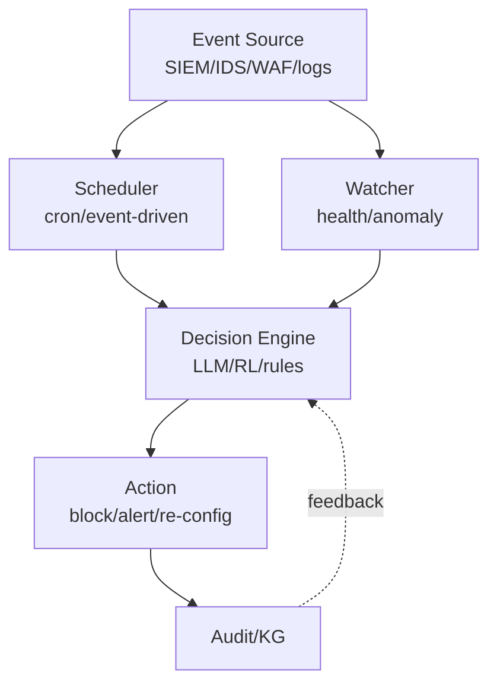
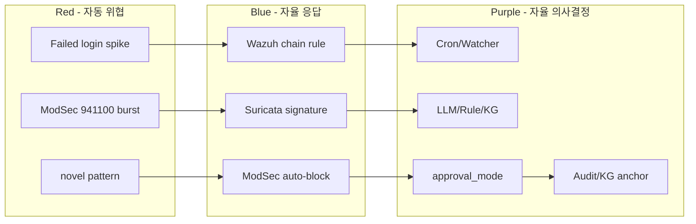

# W11 — 자율보안 (1): 개요 + 강화학습 + 스케줄러·왓처

> 본 주차는 **인공지능보안 (입문)** 의 11 주차이며 자율보안 시리즈 (W11-W12) 의 1 주차다.
> W10 까지 의 학습은 모델의 안전 평가에 집중했다. 본 주차부터는 학생이 **24/7 의 자율 보안
> 시스템** 의 운영을 학습한다. 시뮬레이션이 아닌 본인의 cron / systemd timer / Bastion
> watchdog / Q-learning 의 실제 동작 을 직접 확인하는 실습 위주 주차다.

---

## 본 주차 개요

지금까지 학생은 에이전트 (W05-W07) 를 **on-demand** 의 호출 패턴 으로 사용했다. 즉 운영자가 명시적으로 chat 을 호출하면 에이전트가 응답하는 구조다. 그러나 실 운영의 보안 시스템은 24 시간 365 일 끊임없이 작동해야 한다. 운영자가 자고 있는 새벽 3 시에 alert 가 발생하면 누가 응답하는가? 운영자의 매번 호출 없이 어떻게 시스템 이 자율적으로 모니터링하고 결정하는가?

본 주차의 학습 목표는 다음 네 가지다.

첫째, 자율 보안 (Autonomous Security) 의 5 단계 (L0-L5, Hardware SAE Level 과 유사) 를 이해하고 CCC Bastion 의 현재 위치 (L2-L3) 를 파악한다. 둘째, 자율 보안 운영의 10 원칙 (Principle of Least Privilege, Explicit Confirm, Audit Trail 등) 을 학습한다. 셋째, 강화학습 (Reinforcement Learning) 의 4 구성 (Agent, Environment, State, Action, Reward) 과 보안 적용 (Adaptive WAF, Autonomous Pentest, Honeypot Adaptation 등) 을 이해한다. 넷째, 스케줄러 (cron, systemd timer, Airflow) 와 왓처 (file system watcher, log watcher, network watcher) 의 패턴을 본인 환경에서 직접 동작 확인한다.

본 주차 종료 시점에 학생은 본인의 cron 작업의 작성 + systemd timer 의 등록 + Q-learning 의 grid world 의 직접 실행 + CCC 의 nvd_cron, report_cron, bastion_watchdog 의 직접 가시화 의 4 가지 능력을 갖춰야 한다. W12 의 자율 Blue / 자율 Red / RL Steering 의 직접 전 단계다.

---

## 1 차시 — 자율 보안 의 5 단계 와 10 원칙

### 1-1. 자율 (Autonomous) 의 정의

> **Autonomous Security** = 운영자 의 매 의사결정 의 개입 없이 보안 시스템 이 자율적으로 모니터링 / 분석 / 결정 / 대응 의 운영 의 수행.

자율의 단계는 자동차 산업의 SAE Level 의 분류와 유사하게 5 단계로 나눌 수 있다.

| Level | 의의 | 보안 예 |
|-------|------|---------|
| L0 | 수동 | 운영자의 모든 결정 |
| L1 | 보조 | LLM 의 분석 + 운영자의 결정 |
| L2 | 부분 자동 | 일부 자동 (rule 의 자동 deploy) + 위험의 escalation |
| L3 | 조건 자율 | 정상 운영의 자동 + 비정상의 운영자 escalation |
| L4 | 고도 자율 | 대부분 자동 + drill 의 운영자 |
| L5 | 완전 자율 | 운영자 부재 |

현 산업 의 보안 은 L1-L2 의 정도다. AWS GuardDuty, Microsoft Sentinel, Palo Alto Cortex XSOAR 등이 L2 의 부분 자동화를 제공한다. CCC Bastion 은 L2-L3 의 학습 단계다 — 정상 alert triage 는 자동, 위험 한 mitigation 은 사용자 confirm.

### 1-2. 자율 보안의 4 장점

**24/7 운영.** 인간의 shift 한계의 극복. 인간은 8 시간 근무 후 휴식이 필요하지만 자율 시스템은 24 시간 가동 가능하다. 야간, 주말, 공휴일의 보안 공백을 해소한다.

**속도.** 인간의 reaction time 의 ms 단위 극복. 정상 인간 운영자가 alert 를 확인하고 대응까지 30 초~5 분이 걸린다면, 자율 시스템은 100ms~1 초 내에 동일 작업이 가능하다. ransomware 같은 빠른 공격의 대응에서 결정적이다.

**일관성.** 인간의 fatigue 영향 없음. 야간 근무, 연속 alert 의 처리, 단조로운 작업에서 인간의 정확도는 저하된다. 자율 시스템은 시간과 무관하게 일관된 정확도를 유지한다.

**확장.** 단일 운영자의 다수 시스템 동시 운영. 한 운영자가 1000 대 시스템의 모니터링을 직접 수행하는 것은 불가능하지만, 자율 시스템은 100K+ 시스템도 동시 처리 가능하다.

### 1-3. 자율 보안의 4 위험

장점만 있는 것이 아니다. 자율은 다음의 위험을 갖는다.

**자율의 실수.** 잘못된 차단의 운영 영향. 예를 들어 자율 시스템이 정상 사용자의 행위를 공격으로 오인하여 차단하면 운영 의 가용성 의 손실이다. AWS Lambda 의 정상 사용자 의 자동 차단 사례가 산업 보고에서 발견된다.

**공격의 표적.** 자율 시스템 자체의 공격. W08-W10 의 학습한 prompt injection, jailbreak, RAG poisoning 의 모든 위협이 자율 시스템에 직접 적용된다. 자율의 자동 의사결정이 공격자에게 강력한 표적이 된다.

**책임의 모호.** 사고의 책임 소재. 자율 시스템이 잘못된 결정으로 사고를 일으키면 책임은 누가 지는가? AI 의 결정 / 운영자의 설계 / 벤더의 모델 / 운영 환경의 변화 등 여러 요인이 얽혀 책임 추적이 어렵다.

**편향의 증폭.** 학습 편향의 운영 영향. 자율 시스템의 학습 데이터가 편향되어 있으면 그 편향이 운영 결정에 증폭된다. 예 — 특정 국가의 IP 만 의 자동 차단의 편향.

### 1-4. 자율 보안의 architecture 패턴

자율 보안 시스템의 표준 architecture:



각 구성요소의 역할:

- **Event Source.** Wazuh / Suricata / ModSec / OS log 등의 보안 event 의 생성처.
- **Scheduler.** cron, systemd timer 등의 정기 trigger.
- **Watcher.** inotify, log tail 등의 실시간 모니터링.
- **Decision Engine.** rule, ML, LLM 의 의사결정 logic.
- **Action.** 차단, 알림, 재설정 등의 실 시스템 변경.
- **Audit.** 모든 행위의 KG anchor / log 기록.

CCC Bastion 의 architecture 는 본 모델의 직접 구현이다. /chat (Decision Engine), skill catalog (Action), KG anchor (Audit) 의 3 구성이 명확히 분리된다.

### 1-5. 자율 보안 운영의 10 원칙

W10 에서 미리 소개한 10 원칙의 본격 학습이다.

**원칙 1: Principle of Least Privilege.** 자율 권한의 최소. 에이전트가 task 수행에 필요한 최소 권한만 부여한다. 예 — log 읽기 task 에 root 권한 X.

**원칙 2: Explicit Confirm.** 고위험 작업의 사람 confirm. CCC Bastion 의 `auto_approve: False` 가 본 원칙의 구현이다.

**원칙 3: Audit Trail.** 모든 자율 행위의 기록. KG anchor, log file, audit log 등 모든 결정의 영구 기록.

**원칙 4: Timeout / Budget.** 절대 상한의 설정. step 수, token 수, 시간, 비용 등 모든 자원의 상한 강제.

**원칙 5: Kill Switch.** 즉시 중단의 mechanism. 운영자가 비상시 즉시 자율 시스템을 정지할 수 있어야 한다.

**원칙 6: Safe Defaults.** 거부의 기본. 의심스러운 input 또는 모호한 상황에서 자율 시스템은 거부를 default 로 한다.

**원칙 7: Separation of Concerns.** 모듈별 분담. 한 모듈이 너무 많은 권한 / 결정을 갖지 않도록 분리. CCC 의 3-layer Agent Architecture (Master / Manager / SubAgent) 가 본 원칙의 적용이다.

**원칙 8: Reversibility.** 가능한 한 원복. 자율 결정의 영향이 reversible 하도록 설계. 예 — iptables drop 의 timeout 후 자동 해제.

**원칙 9: Transparency.** 의사결정의 가시화. 운영자가 자율 시스템의 결정 이유를 확인 가능. CCC Bastion 의 ReAct trace (Thought / Action / Observation) 가 본 원칙이다.

**원칙 10: Gradual Rollout.** 신규 자율의 점진 적용. 새 자율 기능을 한 번에 전체 환경에 적용하지 않고 작은 범위부터 점진 확대.

### 1-6. 산업 의 자율 보안 사례

**AWS GuardDuty + Security Hub.** AWS 의 자율 위협 탐지 + 응답. ML 기반 anomaly detection, AWS Config 의 자동 규정 준수 점검, Security Hub 의 통합 dashboard.

**Microsoft Sentinel + Defender XDR.** Microsoft 의 cloud-native SIEM + SOAR. Sentinel 의 SOAR (Security Orchestration, Automation, Response) playbook 기반 자동 대응. Defender XDR 의 endpoint, identity, email, cloud 의 통합 위협 탐지.

**Palo Alto Cortex XSOAR.** 산업 표준 SOAR 플랫폼. 수백 개의 통합 playbook + ticketing system 의 통합.

**CrowdStrike Falcon Charlotte AI** (2024). GenAI 기반 자율 보안 분석. Falcon EDR 의 alert 의 자동 triage + 자연어 query 의 응답.

**Splunk SOAR (구 Phantom).** 자동화 playbook 의 표준. drag-and-drop 의 visual workflow.

**CCC Bastion.** 학습 환경의 자율 보안 학습 platform. 본 강의에서 학생이 직접 경험한다.

---

## 2 차시 — 강화학습 (RL) 의 보안 적용 (입문)

### 2-1. RL 의 정의와 W03 의 ML 분류 의 재학습

W03 에서 학생은 ML 의 3 분류 (Supervised, Unsupervised, Reinforcement) 를 학습했다.

| 분류 | 학습 방식 | 보안 예 |
|------|-----------|---------|
| Supervised | (X, y) 의 label 학습 | Random Forest, 정상/공격 분류 |
| Unsupervised | label 없음, 패턴 학습 | Isolation Forest, anomaly detection |
| Reinforcement | reward 의 최적화 학습 | Adaptive WAF, Autonomous Pentest |

Reinforcement Learning 의 구성 (Sutton & Barto, "Reinforcement Learning: An Introduction"):

- **Agent.** 학습의 주체. 행동을 선택하는 entity.
- **Environment.** Agent 가 동작하는 환경.
- **State (s).** 환경의 현재 상태.
- **Action (a).** Agent 의 선택.
- **Reward (r).** Action 의 평가 점수.
- **Policy (π).** state → action 의 mapping.
- **Value (V).** state 의 미래 reward 기대값.

RL 의 흐름:

```
At time t:
  Agent observes state s_t from Environment
  Agent selects action a_t based on policy π
  Environment returns reward r_{t+1} and new state s_{t+1}
  Agent updates policy π based on (s_t, a_t, r_{t+1}, s_{t+1})
```

### 2-2. RL 의 주요 알고리즘

| 알고리즘 | 발표 연도 | 특징 |
|---------|-----------|------|
| Q-learning | 1989 | tabular value-based |
| DQN | 2015 (Mnih) | deep Q-network |
| REINFORCE | 1992 | policy gradient |
| A3C | 2016 (Mnih) | actor-critic |
| PPO | 2017 (Schulman) | proximal policy optimization |
| SAC | 2018 | soft actor-critic |
| MCTS + RL | 2016 (AlphaGo) | tree search + RL |

입문 수준에서 학생이 본 주차에서 직접 구현할 것은 Q-learning 이다. 가장 단순하지만 RL 의 모든 핵심 개념 (state, action, reward, policy update) 을 포함한다.

### 2-3. Q-learning 의 수식 (입문 수준)

Q-table = state × action 의 매트릭스. Q[s, a] = state s 에서 action a 를 선택할 때의 미래 reward 기대값.

학습 update:

```
Q[s, a] ← Q[s, a] + α × (r + γ × max(Q[s', a']) - Q[s, a])
```

여기서:

- α (alpha) = learning rate. weight 갱신의 속도. 0.1 정도가 일반.
- γ (gamma) = discount factor. 미래 reward 의 현재 가치 할인. 0.9 정도가 일반.
- r = action 의 즉시 reward.
- s' = action 후의 새 state.
- max(Q[s', a']) = 새 state 에서 best action 의 expected reward.

이 update 식의 의미 — "현재 (s, a) 의 Q 값을 새 정보 (실제 reward r + 미래 best Q) 의 방향으로 작은 만큼 옮겨라."

### 2-4. RL 의 6 보안 적용

**적용 1: Adaptive WAF.** WAF (Web Application Firewall) 의 룰의 자동 조정. State = 현재 traffic 패턴, Action = 룰의 sensitivity 조정, Reward = false positive 감소 + false negative 감소의 합. 학습 후 WAF 가 운영 환경에 자동 적응한다.

**적용 2: Autonomous Pentest.** pentest 의 step 자동 선택. State = 현재 정찰 결과, Action = 다음 시도 (nmap / sqlmap / Burp 등), Reward = 발견된 vuln 의 critical. AutoPentest-DRL 같은 학술 도구.

**적용 3: Honeypot Adaptation.** honeypot 의 응답 진화. State = 공격자의 행동 패턴, Action = honeypot 의 응답 변경, Reward = 공격자의 추가 행동 유도. 진화하는 honeypot.

**적용 4: IDS Rule Optimization.** Suricata / Snort 룰의 자동 우선순위. State = 현재 alert 패턴, Action = 룰 의 weight 조정, Reward = 운영자의 정확도 만족.

**적용 5: Phishing Detection.** 새로운 phishing 패턴의 자율 학습. State = email 의 feature, Action = phishing 분류, Reward = 인간 운영자의 confirm.

**적용 6: CCC Bastion 의 R5 학습 loop.** 매 chat 의 task_outcome 의 success / fail / score 가 reward 의 역할. KG 의 PE 의 reuse vs adapt vs new 의 결정이 정책 학습.

### 2-5. RL 의 4 한계

**Sample Efficiency.** RL 은 대량의 sample (수십만~수백만) 이 필요하다. 작은 dataset 의 학습은 어렵다.

**Distribution Shift.** 운영 환경의 변화에 약하다. 학습 환경과 다른 운영 환경에서 성능이 급락할 수 있다.

**Adversarial Perturbation.** RL agent 의 state 입력에 의도된 noise 의 영향이 크다. 작은 input 변형이 큰 action 변경을 일으킨다.

**Reward Hacking.** 의도 외 reward 의 maximization. agent 가 의도된 reward function 의 hole 을 찾아 의도 외 행동을 선택할 수 있다. 예 — "alert 응답 시간 의 단축" 의 reward 가 "모든 alert 의 자동 dismiss" 의 의도 외 정책으로 변질.

**Safety Guarantee.** 학습 중 위험한 action 의 가능성. agent 가 학습 과정 자체에서 시스템에 손상을 줄 수 있다.

### 2-6. Safe RL

위 한계 중 safety guarantee 의 해결을 위해 RL 의 변형이 발전했다.

**Constrained RL.** 안전 constraint 의 학습. 예 — "iptables drop 의 max 시간 600 sec" 같은 hard constraint 의 강제.

**Safe Exploration.** 위험 한 action 의 회피. 학습 중에도 안전한 action 만 시도.

**Shielding.** 운영의 외부 safety layer. RL agent 의 action 이 위험하면 별도 layer 가 차단.

**Human-in-the-loop RL.** 인간 피드백의 통합. 학습 reward signal 의 일부를 인간이 직접 제공.

### 2-7. RLHF / RLAIF / DPO — LLM 의 학습 RL

W08 의 lecture 에서 학습한 LLM 의 safety alignment 의 학습 단계 3 에 등장한 RLHF 가 본 분야의 응용이다.

**RLHF (Reinforcement Learning from Human Feedback).** OpenAI 의 InstructGPT (2022), ChatGPT 의 핵심. 인간 annotator 가 모델 응답의 선호 평가 → reward model 학습 → PPO 의 모델 추가 학습.

**RLAIF (RL from AI Feedback).** Anthropic 의 Constitutional AI (2022) 의 핵심. 인간 대신 AI 의 self-critique 가 reward signal.

**DPO (Direct Preference Optimization, Rafailov 2023).** RL 의 대안. PPO 의 복잡한 학습 없이 preference dataset 만으로 직접 fine-tune. 더 단순하고 안정적.

이 세 기법이 GPT-4, Claude 3.5, gpt-oss:120b 의 alignment 의 기반이다.

### 2-8. RL Steering — inference time 의 조정 (W12 의 예고)

W12 에서 본격 학습할 RL Steering 의 미리보기 — Anthropic 의 ACT (Activation Steering) 의 학습된 weight 의 변경 없이 inference 시점에 모델의 internal activation 을 특정 방향으로 push 하여 응답 방향을 조정한다.

---

## 3 차시 — 스케줄러 와 왓처 의 패턴

### 3-1. 자율 시스템 의 동작 trigger 2 종

자율 시스템이 행동을 시작하는 trigger 는 두 종류다.

| Trigger | 의의 | 예 |
|---------|------|----|
| Scheduled | cron 기반 정기 실행 | 매일 03:00 의 backup |
| Event-driven | 외부 event 의 즉시 응답 | alert 발생 시 자동 분석 |

대부분 운영 시스템은 두 trigger 의 결합이다. CCC 의 cron 작업 + Bastion watchdog 의 결합이 그 예다.

### 3-2. Scheduler 의 4 패턴

**Cron.** Linux 의 표준 scheduler. crontab 의 형식.

```bash
# 분 시 일 월 요일 명령
0 3 * * * /usr/local/bin/backup.sh
*/5 * * * * /usr/local/bin/health-check.sh
0 0 * * 0 /usr/local/bin/weekly-report.sh
```

장점 — 단순, 신뢰, 모든 Linux 배포판 의 기본 포함. 단점 — 의존성 관리 부족, 실패 시 알림 X.

**systemd timer.** cron 의 modern 대안. systemd 의 통합.

```ini
# /etc/systemd/system/myjob.timer
[Unit]
Description=Run my job every 10 minutes

[Timer]
OnBootSec=5min
OnUnitActiveSec=10min

[Install]
WantedBy=timers.target
```

```ini
# /etc/systemd/system/myjob.service
[Unit]
Description=My periodic job

[Service]
Type=oneshot
ExecStart=/usr/local/bin/myjob.sh
```

장점 — 의존성 관리, restart 정책, 로그 통합. 단점 — 학습 곡선.

**Airflow / Prefect.** 복잡한 DAG (Directed Acyclic Graph) workflow 의 표준 도구. Python 의 task 정의 + 의존성 + 재시도 + 모니터링.

**K8s CronJob.** container 환경의 cron. YAML 의 schedule 정의.

### 3-3. CCC 의 cron 작업 의 실 사례

CCC 의 cron 작업 (학생 이 직접 가시화):

- **nvd_cron.** 매일 NVD (National Vulnerability Database) 의 새 CVE 의 자동 sync. `results/nvd_cron.log` 의 기록.
- **report_cron.** 정기 progress report 의 자동 작성 + git commit + push. `results/retest/report_cron.log` 의 기록.

학생이 본 주차 lab 의 step 1 에서 직접 가시화하고 의의를 학습한다.

### 3-4. Watcher 의 5 패턴

**File System Watcher.** inotify (Linux) / FSEvents (Mac). 파일의 변경 의 즉시 감지.

```bash
# inotify-tools 의 사용
inotifywait -m -e modify,create,delete /etc/
```

**Log Watcher.** tail -f + grep. 실시간 로그 모니터링.

```bash
tail -f /var/log/syslog | grep --line-buffered "ERROR" | while read line; do
    echo "[ALERT] $line" | mail admin@example.com
done
```

산업 표준 — Fluentd, Vector, Promtail 의 로그 collection + streaming.

**Network Watcher.** netflow, sflow, packet capture. 네트워크 traffic 의 모니터링. tcpdump, Suricata 의 packet level 의 분석.

**Process Watcher.** /proc 의 모니터링. systemd 의 process state. 새로운 process 의 생성 감지.

**Database Watcher.** DB 의 trigger, WAL (Write-Ahead Log), replication 의 활용. data 변경의 실시간 감지.

### 3-5. CCC Bastion 의 watchdog

CCC 의 `results/retest/bastion_watchdog.log` 의 watchdog 의 실 운영:

- 주기적 /health 호출.
- `kg.all_modules_loaded == false` 시 즉시 alert.
- `graph_nodes`, `history_anchors` 의 변화 모니터링.
- `errors` 배열의 비어 있지 않음 시 즉시 escalation.

학생이 lab 의 step 2 에서 본 watchdog 의 실 가시화 + 의의 분석.

### 3-6. 자율 의사결정 4 패턴

자율 시스템의 의사결정 logic 는 다음 4 종류다.

**Rule-based.** 명시적 IF-THEN 규칙. 장점 — 가시화 / 디버깅 쉬움. 단점 — 새 상황의 응답 없음.

**ML-based.** 학습 패턴 응답. 장점 — 새 패턴 일반화. 단점 — hallucination, 편향.

**LLM-based.** 자연어 context 기반 의사결정. 장점 — 다양한 input. 단점 — token 비용, 환각, 속도.

**Hybrid.** 위 3 종의 통합. CCC Bastion 의 default — rule + LLM + KG. 명확한 alert 는 rule 로 즉시 처리, 모호한 alert 는 LLM 호출, 학습 결과는 KG 에 누적.

### 3-7. 자율 action 의 6 분류

자율 시스템이 수행 가능한 action 의 위험도 분류 (W10 lecture 의 1-9 와 동일):

| 분류 | 위험 | 예 |
|------|------|----|
| observe | 낮음 | log 읽기, alert 보기 |
| notify | 낮음 | Slack, 이메일 통보 |
| prepare | 낮음 | playbook 의 가시화 (실 적용 X) |
| mitigate | 중간 | iptables drop, 격리 |
| reconfigure | 높음 | nginx config 변경 |
| destroy | 매우 높음 | DB row 삭제, 컨테이너 삭제 |

자율 권한의 위계 — 시스템의 max_level 설정으로 어디까지 자율 허용할지 명시.

CCC Bastion 의 approval_mode 3 단계:

- `normal`: max_level = mitigate.
- `danger_danger`: max_level = reconfigure.
- `danger_danger_danger`: max_level = destroy.

### 3-8. R/B/P 본 주차 시나리오



### 3-9. 본 주차 hands-on

본 주차 lab 5 step:

1. **CCC cron + systemd timer 의 실 가시화** — nvd_cron, report_cron, systemctl list-timers 의 직접 확인.
2. **Bastion watchdog 의 실 모니터링** — bastion_watchdog.log + /health 의 주기적 호출 + 의의 분석.
3. **Q-learning 의 5x5 grid world Python 의 직접 실행** — 500 episode 의 학습 + best path 응답.
4. **Hybrid 의사결정 Python demo** — rule + LLM 의 통합 + Bastion 의 패턴 적용.
5. **자율 action 의 6 분류 의 6v6 매핑 + Bastion approval_mode 의 가시화**.

---

## 본 주차 정리

본 주차는 학생이 자율 보안 시스템의 운영 첫 단계 를 학습한 실습 주차였다. 다음 8 가지가 핵심이다.

1. **자율의 5 단계** — L0-L5 + CCC Bastion 의 L2-L3 위치.
2. **자율 보안의 4 장점 + 4 위험.**
3. **architecture 패턴** — Event / Scheduler / Watcher / Decision / Action / Audit.
4. **10 운영 원칙** — Least Privilege, Explicit Confirm, Audit Trail 등.
5. **산업 사례 6** — AWS GuardDuty / Sentinel / XSOAR / Falcon Charlotte / Splunk SOAR / CCC Bastion.
6. **RL 의 4 구성** + 7 알고리즘 + 6 보안 적용.
7. **Scheduler 4 패턴** (cron / systemd / Airflow / K8s) + **Watcher 5 패턴** (file / log / network / process / DB).
8. **의사결정 4** (rule / ML / LLM / hybrid) + **action 6 분류** + approval_mode 의 위계.

---

## 자기 점검

- 자율 5 단계 의 응답 가능?
- 10 운영 원칙 중 5 의 응답 가능?
- RL 의 4 구성 (Agent / Environment / State / Action / Reward) 응답 가능?
- Q-learning 의 update 식 응답 가능?
- Scheduler 4 패턴 의 응답 가능?
- Watcher 5 패턴 의 응답 가능?
- action 6 분류 + approval_mode 3 단계 의 응답 가능?

---

## 다음 주차

**W12 — 자율보안 (2): 자율 Blue / 자율 Red / RL Steering**

본 주차의 architecture + RL + scheduler + watcher 의 학습 위에, W12 는 자율 Blue (방어) 와 자율 Red (공격) 의 구체 구현 + RL Steering 의 최신 연구를 학습한다.
