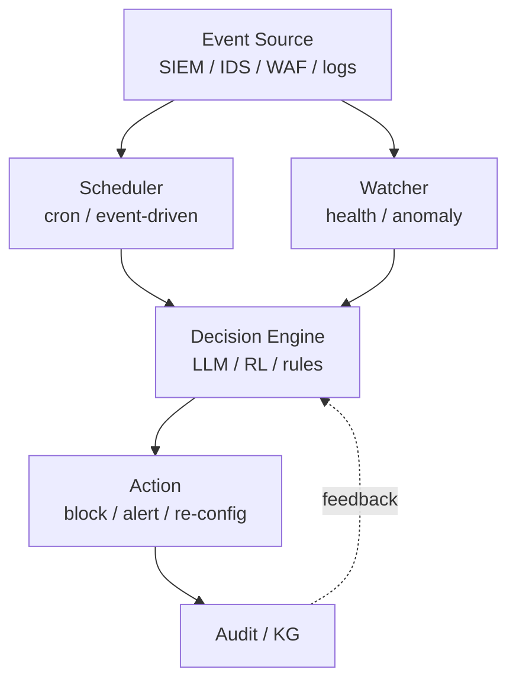
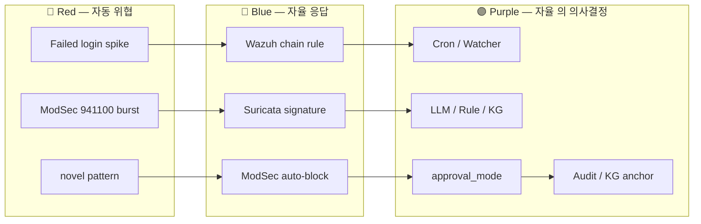

# W11 — 자율보안 (1): 개요 / 강화학습 / 스케줄러·왓처

> 본 주차는 **인공지능보안 (입문)** 의 11 주차이며, 자율보안 시리즈 (W11-W12) 의 1 주차이다.
> W05-W07 의 에이전트 의 학습 + W08-W10 의 AI Safety 의 학습 위에, 본 주차 는 에이전트 의
> **자율 운영** 의 본격 학습 의 시작.

---

## 본 주차 의도

지금까지 학생 은 에이전트 의 **on-demand** 의 호출 (사용자 의 요청 의 응답) 의 학습.

본 주차 부터 는 **자율 적** 의 동작 — 사용자 의 매번 호출 없이 의 24/7 의 모니터링 / 결정 / 행위.

학습 목표:

1. **자율보안** 의 정의 / 운영 의 의의 / 위험.
2. **강화학습 (RL)** 의 보안 의 적용.
3. **스케줄러 / 왓처** 의 자율 패턴.

후속 W12 (자율 Blue / 자율 Red / RL Steering) 의 전 단계.

---

## 1 차시 — 자율보안 의 개요

### 1-1. 자율 (Autonomous) 의 정의

> **Autonomous Security** = 운영자 의 **매 의사결정 의 개입 없이** 의 보안 시스템 의 자율 의 모니터링 / 분석 / 결정 / 대응 의 운영.

자율 의 단계 (Hardware 의 SAE Level 의 유사):

| Level | 의의 | 보안 의 예 |
|-------|------|----------|
| L0 | 수동 | 운영자 의 모든 결정 |
| L1 | 보조 | LLM 의 분석 + 운영자 의 결정 |
| L2 | 부분 자동 | 일부 자동 (예: rule 의 자동 deploy) + 위험 의 escalation |
| L3 | 조건 자율 | 정상 운영 의 자동 / 비정상 의 운영자 |
| L4 | 고도 자율 | 대부분 자동 / drill 의 운영자 |
| L5 | 완전 자율 | 운영자 부재 |

현 산업 의 보안 — L1-L2 의 정도. CCC 의 Bastion 은 L2-L3 의 학습.

### 1-2. 자율보안 의 의의

#### 장점

- **24/7** — 인간 의 shift 의 한계 의 극복.
- **속도** — 인간 의 reaction time 의 ms 의 극복.
- **일관성** — 인간 의 fatigue 의 영향 없음.
- **확장** — 단일 운영자 의 다수 시스템 의 동시 운영.

#### 단점 / 위험

- **자율 의 실수** — 잘못 된 차단 의 운영 영향.
- **공격 의 표적** — 자율 시스템 의 자체 의 공격.
- **책임 의 모호** — 사고 의 책임 소재.
- **편향 의 증폭** — 학습 의 편향 의 운영 의 영향.

### 1-3. 자율보안 의 architecture 패턴

### 1-4. 자율 의 운영 의 원칙

W10 의 7 원칙 의 재 학습 + 자율 의 추가:

1. **principle of least privilege** — 자율 의 권한 의 최소.
2. **explicit confirm** — 고위험 의 사람 confirm.
3. **audit trail** — 모든 자율 행위 의 기록.
4. **timeout / budget** — 의 절대 의 상한.
5. **kill switch** — 즉시 중단.
6. **safe defaults** — 거부 의 기본.
7. **separation of concerns** — 모듈 별 의 분담.
8. **reversibility** — 자율 의 행위 의 의 가능 한 한 의 원복.
9. **transparency** — 의사결정 의 가시화.
10. **gradual rollout** — 신규 자율 의 점진 적용.

### 1-5. 자율보안 의 산업 사례

#### (a) **AWS GuardDuty** + **Security Hub**

- AWS 의 자율 의 위협 탐지 / 응답.
- ML 기반 의 anomaly detection.

#### (b) **Microsoft Sentinel** + **Defender XDR**

- Sentinel 의 SOAR (Security Orchestration, Automation, Response).
- playbook 기반 의 자동 대응.

#### (c) **Palo Alto Cortex XSOAR**

- 산업 의 SOAR 의 표준.

#### (d) **CrowdStrike Falcon Charlotte AI** (2024)

- GenAI 기반 의 자율 의 보안 분석.

#### (e) **Splunk SOAR** (구 Phantom)

- 자동화 playbook 의 표준.

#### (f) **CCC 의 Bastion**

- 학습 환경 의 자율 보안 의 학습 의 platform.

---

## 2 차시 — 강화학습 (RL) 의 보안 의 적용

### 2-1. RL 의 정의

W03 의 ML 의 분류 의 재 학습:

| 분류 | 의의 |
|------|------|
| Supervised | (X, y) 의 label 의 학습 |
| Unsupervised | label 없음, 패턴 학습 |
| **Reinforcement** | reward 의 의 의 최적 의 학습 |

RL 의 구성 (Sutton & Barto):

- **Agent** — 학습 의 주체.
- **Environment** — agent 의 의 동작 의 환경.
- **State (s)** — 환경 의 상태.
- **Action (a)** — agent 의 선택.
- **Reward (r)** — action 의 의 평가.
- **Policy (π)** — state → action 의 mapping.
- **Value (V)** — state 의 의 미래 reward 의 기대.

### 2-2. RL 의 주요 알고리즘

| 알고리즘 | 특징 |
|---------|------|
| **Q-learning** | tabular value-based |
| **DQN** (Mnih 2015) | deep Q-network |
| **REINFORCE** | policy gradient |
| **A3C** (Mnih 2016) | actor-critic |
| **PPO** (Schulman 2017) | proximal policy optimization |
| **SAC** | soft actor-critic |
| **MCTS + RL** | AlphaGo / AlphaZero |

### 2-3. RL 의 보안 의 적용

#### (a) **Adaptive WAF**

- WAF 의 룰 의 자동 조정 — false positive / false negative 의 reward.

#### (b) **Autonomous Pentest**

- pentest 의 step 의 자동 선택.
- 사례: Deep Exploit / Network Pentest using RL.

#### (c) **Honeypot Adaptation**

- honeypot 의 응답 의 의 학습 의 진화.

#### (d) **IDS Rule Optimization**

- Suricata / Snort 의 룰 의 자동 우선순위.

#### (e) **Phishing Detection**

- 새로운 phishing 패턴 의 자율 학습.

#### (f) **Bastion 의 R5 학습 loop**

- 매 chat 의 task_outcome 의 reward 로 환산.
- KG 의 PE-KG 의 reuse vs adapt vs new 의 의 의 학습.

### 2-4. RL 의 보안 의 한계

- **sample efficiency** — 학습 의 sample 의 대량 필요.
- **distribution shift** — 운영 환경 의 변화 의 영향.
- **adversarial perturbation** — RL 의 의 의 적대 공격.
- **reward hacking** — 의도 하지 않은 reward 의 maximization.
- **safety guarantee** — 학습 중 의 위험 한 action 의 가능성.

### 2-5. Safe RL

학습 중 의 위험 의 회피 의 RL 의 변형:

- **constrained RL** — 안전 의 constraint 의 학습.
- **safe exploration** — 위험 한 action 의 회피.
- **shielding** — 운영 의 외부 의 safety layer.
- **human-in-the-loop RL** — 인간 의 피드백 의 통합.

### 2-6. RLHF / RLAIF

LLM 의 학습 의 RL:

- **RLHF** (Reinforcement Learning from Human Feedback) — InstructGPT 의 핵심.
- **RLAIF** (RL from AI Feedback) — Constitutional AI 의 핵심.
- **DPO** (Direct Preference Optimization) — RL 의 대안.

이 모두 의 LLM 의 alignment 의 핵심 도구.

### 2-7. RL Steering (W12 의 학습)

W12 에서 학습 — RL 의 직접 학습 대신, 사전 학습 의 LLM 의 의 의 RL 의 의도 의 조정. Anthropic 의 ACT 의 연구.

---

## 3 차시 — 스케줄러 / 왓처

### 3-1. 자율 시스템 의 동작 의 trigger

자율 시스템 의 동작 의 시작 의 2 종:

| trigger | 의의 |
|---------|------|
| **scheduled** | cron 기반 의 정기 실행 |
| **event-driven** | 외부 event 의 응답 의 즉시 실행 |

### 3-2. 스케줄러 의 패턴

#### (a) **Cron**

- Linux 의 cron / systemd timer.
- 정해진 시간 / 주기 의 실행.
- 단순 / 신뢰.

#### (b) **systemd timer**

- cron 의 modern 대안.
- 의존성 / restart / 로그 의 통합.

#### (c) **Airflow / Prefect**

- 복잡 한 DAG 의 워크플로우.

#### (d) **K8s CronJob**

- container 환경 의 cron.

#### (e) **CCC 의 cron**

`results/retest/report_cron.log` / `nvd_cron.log` 등 의 정기 실행:

- NVD CVE 의 sync.
- retest 의 progress report.
- 진행 의 자동 커밋.

### 3-3. 왓처 (Watcher) 의 패턴

#### (a) **File system watcher**

- inotify (Linux) / FSEvents (Mac).
- 파일 의 변경 의 즉시 감지.

#### (b) **Log watcher**

- tail -f + grep.
- fluentd / vector / promtail.

#### (c) **Network watcher**

- netflow / sflow.
- packet capture (tcpdump / suricata).

#### (d) **Process watcher**

- /proc 의 모니터링.
- systemd 의 process state.

#### (e) **Database watcher**

- DB 의 trigger / WAL / replication.

#### (f) **CCC 의 Bastion 의 watcher**

- `results/retest/bastion_watchdog.log` 의 health check.
- /health 의 kg.all_modules_loaded == false 시 즉시 escalation.

### 3-4. 자율 의 의사결정 의 패턴

#### (a) **Rule-based**

- 명시 적 IF-THEN 의 규칙.
- 가시화 / 디버깅 의 쉬움.
- 한계 — 새로운 상황 의 응답 없음.

#### (b) **ML-based**

- 학습 의 패턴 의 응답.
- 강점 — 새 패턴 의 일반화.
- 한계 — 환각 / 편향.

#### (c) **LLM-based**

- 자연어 의 context 의 의사결정.
- 강점 — 다양 한 input 의 처리.
- 한계 — token 비용 / 환각 / 속도.

#### (d) **Hybrid**

- 위 의 3 의 의 통합.
- CCC 의 Bastion — rule + LLM + KG (RL 미래).

### 3-5. 자율 의 actions 의 분류

| 분류 | 의의 | 위험 |
|------|------|------|
| **observe** | log / alert 의 기록 | 낮음 |
| **notify** | 운영자 의 통보 | 낮음 |
| **prepare** | playbook 의 가시화 | 낮음 |
| **mitigate** | 차단 / 격리 의 실행 | 중간 |
| **reconfigure** | 시스템 의 의 의 변경 | 높음 |
| **destroy** | 데이터 의 의 의 삭제 | 매우 높음 |

자율 의 권한 의 의 의 분류:

- **observe / notify** — 자유 허용.
- **prepare** — 가시화 의 의 의 만.
- **mitigate** — 사람 confirm 필요 (위험 의 의 의 의 큰 경우).
- **reconfigure** — 명시 적 다중 confirm.
- **destroy** — 항상 사람 의 명시 적 confirm.

### 3-6. R/B/P — 본 주차 의 시나리오

### 3-7. 본 주차 의 hands-on

본 주차 의 lab 의 5 step (lab yaml 참조):

1. **cron + systemd timer** 의 가시화 + CCC 의 nvd_cron 의 학습.
2. **Bastion 의 watchdog log** 의 확인 + 의의 의 분석.
3. **Q-learning 의 미니 Python demo** — 5x5 grid world 의 학습.
4. **Hybrid 의사결정 의 demo** — rule + LLM 의 통합 의 시뮬.
5. **action 의 분류** 의 7 의 실 6v6 environment 의 매핑.

---

## 본 주차 의 정리

1. **자율보안** 의 5 단계 (L0-L5) + CCC 의 L2-L3 의 학습.
2. **architecture** — Event / Scheduler / Watcher / Decision / Action / Audit.
3. **10 운영 원칙** — least privilege / confirm / audit / 등.
4. **산업 사례** — AWS GuardDuty / Sentinel / XSOAR / Falcon / Splunk SOAR / Bastion.
5. **RL** 의 정의 + 알고리즘 + 보안 의 적용.
6. **Safe RL** + **RLHF / RLAIF** + **RL Steering**.
7. **Scheduler** (cron / systemd / Airflow / K8s) + **Watcher** (file / log / network / process / DB).
8. **의사결정** — rule / ML / LLM / hybrid.
9. **action 분류** 의 6 + 권한 의 위계.

---

## 자기 점검

- 자율 의 5 단계 + CCC 의 학습 의 응답 가능?
- 10 운영 원칙 의 응답 가능?
- RL 의 4 구성 + 알고리즘 3 의 응답 가능?
- Scheduler / Watcher 의 차이 의 응답 가능?
- action 의 6 분류 + 권한 위계 의 응답 가능?

---

## 다음 주차

**W12 — 자율보안 (2): 자율 Blue / 자율 Red / RL Steering**

- 자율 Blue 의 운영 의 implementation.
- 자율 Red — automated red teaming.
- RL Steering — LLM 의 학습 의 의 의 의 조정.

본 주차 의 학습 의 직접 적용 의 마무리.
