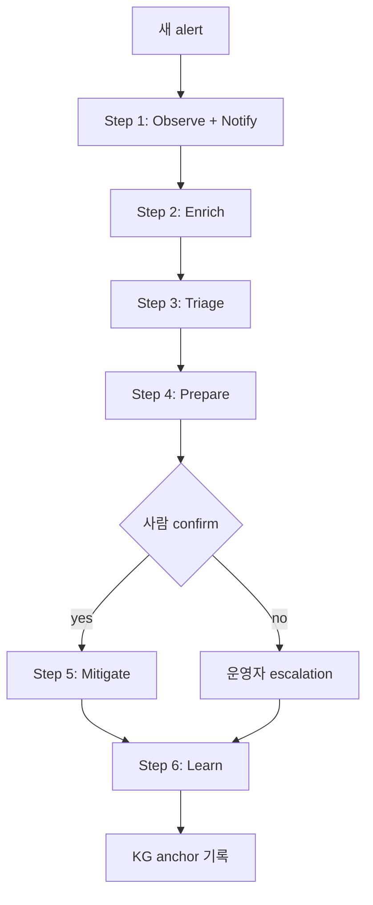
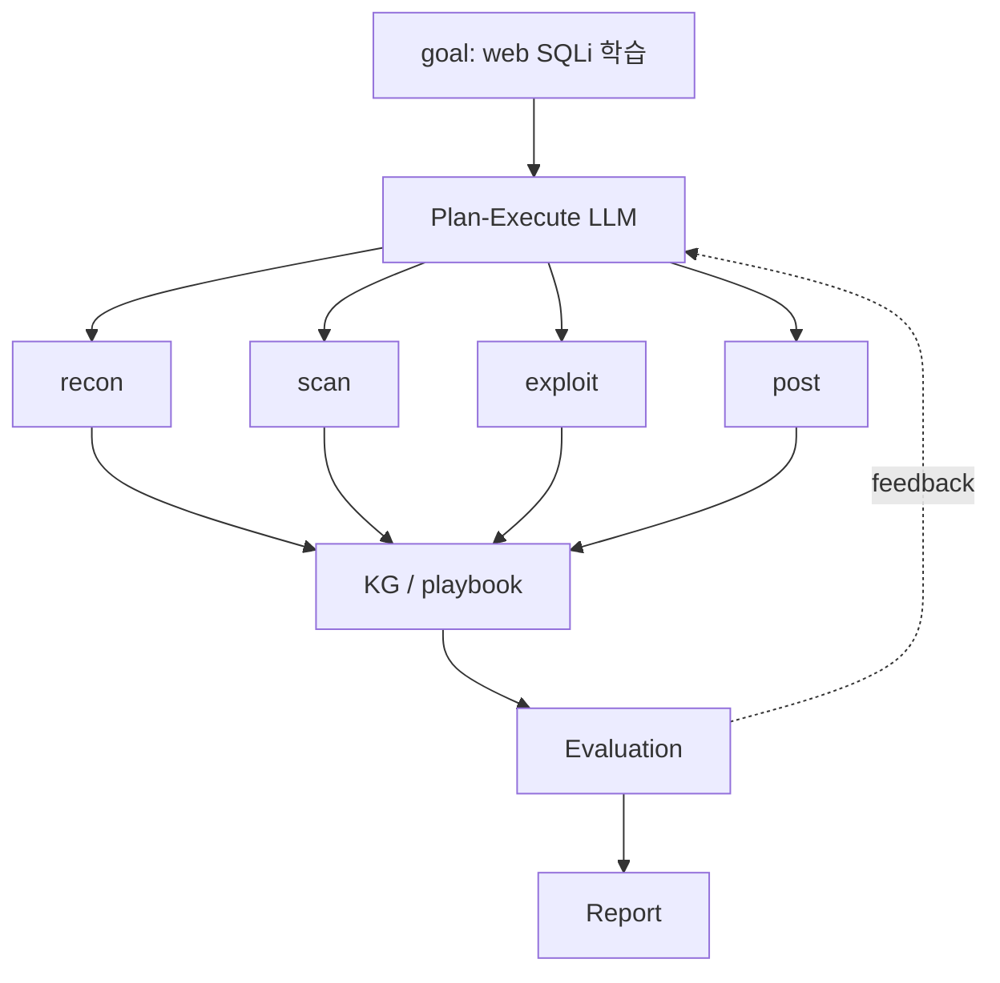
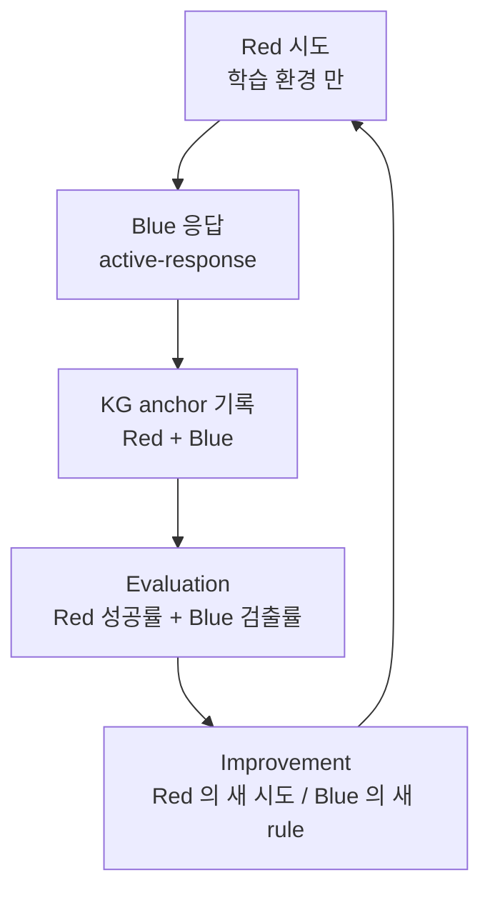
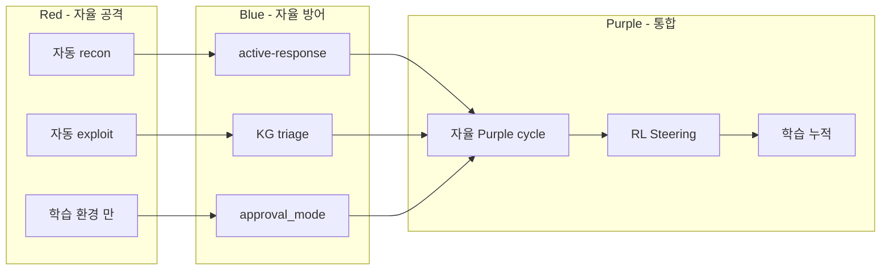

# W12 — 자율보안 (2): 자율 Blue + 자율 Red + RL Steering

> 본 주차는 **인공지능보안 (입문)** 의 12 주차이며 자율보안 시리즈 (W11-W12) 의 마지막 주차다.
> W11 의 자율 architecture + RL + scheduler / watcher 의 학습 위에, 본 주차는 **자율 Blue
> (방어 자동화) + 자율 Red (공격 자동화) + RL Steering (최신 연구)** 의 구체 구현을 학생이
> 직접 경험한다.

---

## 본 주차 개요

W11 의 학습에서 학생은 자율 시스템의 개념 / architecture / 10 운영 원칙 / RL 기초 / scheduler / watcher 를 학습했다. 그러나 학생은 다음 질문을 가진다.

- 실제로 본인 환경에서 어떻게 자율 Blue (방어 자동화) 를 구축하는가?
- 자율 Red (공격 자동화) 의 윤리적 boundary 는 어디까지인가?
- 자율 Blue + 자율 Red 의 통합 인 자율 Purple cycle 은 가능한가?
- RL Steering 은 최근 Anthropic / OpenAI 의 어떤 연구인가? 본인이 이해할 수 있는 수준인가?

본 주차의 학습 목표는 다음 네 가지다.

첫째, **자율 Blue 의 6 단계 워크플로우** (Observe / Enrich / Triage / Prepare / Mitigate / Learn) 를 이해하고 Wazuh active-response 의 실 구현으로 직접 가시화한다. 둘째, **자율 Red 의 PTES 단계별 자동화** 를 이해하고 윤리적 boundary (학습 환경 만, RoE, 외부 거부, 법적 검토) 를 명확히 한다. 셋째, **자율 Purple cycle** (Red 시도 + Blue 응답 + KG 학습 의 자동 반복) 을 본인 환경에서 1 cycle 시뮬한다. 넷째, **RL Steering** 의 입문 수준 이해 — Anthropic Activation Steering, OpenAI Critic Models, Process Reward Models, Self-Reflection 의 4 연구의 개념 파악.

본 주차 종료 시점에 학생은 본인의 학습 환경에서 자율 Blue 의 첫 6 단계 워크플로우를 직접 설계 + 시뮬 가능해야 한다. 또한 RL Steering 의 4 연구를 본인의 후속 학습 (AI Safety 심화) 의 base 로 인식해야 한다.

---

## 1 차시 — 자율 Blue 의 6 단계 워크플로우

### 1-1. 자율 Blue 의 정의

> **Autonomous Blue** = 보안 방어 작업 의 자율 적 수행 시스템. 운영자 의 매 확인 없이 alert triage / enrichment / correlation / mitigation / reporting 의 자동 처리.

W11 의 architecture 의 구체 구현 단계다. 6v6 학습 환경의 24/7 자율 운영을 학생이 본 주차에서 시뮬한다.

### 1-2. 자율 Blue 의 7 task

| Task | 의의 | 자동화 정도 |
|------|------|-------------|
| Alert Triage | 신규 alert 의 자동 분류 / 위험도 | 완전 자동 |
| Enrichment | srcip / asset / CVE 의 자동 결합 | 완전 자동 |
| Correlation | 여러 alert 의 chain 의 자동 검출 | 완전 자동 |
| Mitigation | 사람 confirm 후 차단 | 반자동 (confirm) |
| Runbook | playbook 의 자동 실행 | 반자동 (confirm) |
| Reporting | shift report 의 자동 생성 | 완전 자동 |
| Learning | 새 패턴의 KG 학습 | 완전 자동 |

### 1-3. 자율 Blue 의 6 단계 워크플로우



각 단계의 의의:

**Step 1: Observe + Notify (자유 적용).** Wazuh / Suricata / ModSec 의 alert 의 SIEM 통합. 자동 notification — Slack / 이메일 / SMS. 운영자 가 즉시 인지. 위험도 분류 전이므로 본 단계는 거의 모든 alert 에 적용된다.

**Step 2: Enrich (자유 적용).** alert 의 srcip 의 GeoIP / asset DB / CTI 의 자동 결합. 추가 context 가 다음 단계 의 판단에 유리. 외부 API 호출이 필요한 경우 (CTI feed) 폐쇄망에서는 사전 sync 된 mirror 사용.

**Step 3: Triage (자유 적용).** LLM 의 자동 5W + 위험도. KG 의 PE 의 reuse 검색 — 과거의 유사 alert 의 처리 이력 확인. CCC Bastion 의 master agent 가 본 단계의 구현.

**Step 4: Prepare (가시화 만).** playbook 의 자동 가시화 — 다음 단계 권장. 운영자 가 검토 후 confirm. dry-run 의 결과 의 사전 가시화.

**Step 5: Mitigate (사람 confirm).** 사람 confirm 후 의 자동 차단. iptables drop, ModSec block, Wazuh active-response, container 격리 등. timeout 의 명시 (자동 rollback).

**Step 6: Learn (자동).** task_outcome anchor 의 KG 자동 기록. 다음 chat 의 context 강화. 시스템의 지속적 개선.

### 1-4. 자율 Blue 의 실 사례 — Wazuh Active Response

Wazuh 의 `<active-response>` 의 XML 설정으로 자동 차단을 구현한다.

```xml
<!-- /var/ossec/etc/ossec.conf 의 일부 -->
<active-response>
  <command>firewall-drop</command>
  <location>local</location>
  <rules_id>5712</rules_id>
  <timeout>600</timeout>
</active-response>

<command>
  <name>firewall-drop</name>
  <executable>firewall-drop</executable>
  <timeout_allowed>yes</timeout_allowed>
</command>
```

이 설정의 의미 — Wazuh rule 5712 (sshd brute force, level 10+) 가 trigger 되면 자동으로 `iptables -A INPUT -s SRC -j DROP` 명령을 600 초 동안 적용한다. 600 초 후 자동으로 rule 제거 (rollback).

본 주차 lab 의 step 1 에서 학생이 본 active-response 의 6 단계 매핑을 직접 분석한다.

### 1-5. 자율 Blue 의 다른 실 사례

**Suricata IPS Mode.** Suricata 의 `drop` action 으로 자동 패킷 차단. inline mode 의 IPS 의 구현.

```
drop tcp $EXTERNAL_NET any -> $HOME_NET 22 (msg:"Auto-drop SSH brute"; threshold:type both, track by_src, count 5, seconds 60; sid:1000001;)
```

**ModSec CRS (Core Rule Set).** OWASP CRS 의 anomaly score 기반 자동 차단. SecAction 의 phase 5 의 자동 차단.

**CCC Bastion 의 자체 구현.** `results/retest/bastion_watchdog.log` 의 자동 health check + alert triage + KG 학습.

### 1-6. 자율 Blue 의 4 위험 회피

**위험 1: False Positive 차단.** 정상 사용자의 차단으로 운영 가용성 손실. 대응 — 차단 전 threshold 의 명시, 사람 confirm 의 강제, allowlist 의 정확한 정의.

**위험 2: Kill Switch 부재.** 비상시 즉시 중단 불가. 대응 — systemctl stop, kill -9, manual override 의 마련.

**위험 3: Rollback 부재.** 차단의 영구화. 대응 — timeout 의 명시, 자동 해제 logic, manual 의 rollback 명령.

**위험 4: Observability 부재.** 자율 action 의 가시화 부족. 대응 — 모든 action 의 audit log + KG anchor 기록.

---

## 2 차시 — 자율 Red 의 윤리 + 도구

### 2-1. 자율 Red 의 정의

> **Autonomous Red** = 보안 공격 / 평가의 자율 적 수행 시스템. W10 의 LLM Red Teaming 의 자동 화의 확장.

자율 Blue 가 운영 환경의 방어 자동화라면, 자율 Red 는 학습 / 평가 환경의 공격 자동화다. 두 시스템의 결합이 자율 Purple cycle 이다.

### 2-2. 자율 Red 의 6 task

| Task | 의의 | 자동화 도구 |
|------|------|-------------|
| Reconnaissance | nmap / whatweb / nikto 의 자동 | AutoRecon, ReconFTW |
| Scanning | OWASP ZAP / sqlmap 의 자동 | OWASP ZAP API, sqlmap |
| Exploitation | 학습 환경 의 자동 익스플로잇 | Metasploit Pro, PentestGPT |
| Post-Exploitation | lateral / persistence 시뮬 | Empire, Cobalt Strike (학습) |
| Reporting | findings 의 자동 정리 | Dradis, Faraday |
| Adaptation | 다음 시도 의 학습 | AutoPentest-DRL, MITRE Caldera |

### 2-3. 자율 Red 의 운영 윤리 6 필수

자율 Red 는 강력한 도구이므로 강력한 윤리 적 boundary 가 필수다.

**필수 1: 인가 된 환경.** 학습 환경 / CTF / 합의 인가의 환경 만. 본 강의의 학습 환경은 6v6 / JuiceShop / attacker VM (192.168.0.112) 다.

**필수 2: Scope 명시.** RoE (Rules of Engagement) 의 사전 정의. 어떤 target, 어떤 도구, 어떤 시간 의 범위.

**필수 3: 반복 가능 한 records.** 모든 시도의 logging. 사후 audit 가능.

**필수 4: Safe Target.** 학습 / CTF 환경만. 운영 시스템, 외부 시스템, 실 기업 자산의 시도 절대 금지.

**필수 5: 외부 거부.** 본인의 검증. 모든 명령의 target 의 확인. 외부 시스템 의 의도 외 시도 의 방지.

**필수 6: 법적 검토.** 변호사 / compliance 의 사전 검토. 정보통신망법, 개인정보보호법, 부정경쟁방지법 등의 준수.

본 강의의 학습 환경 만 — 6v6 / JuiceShop / attacker VM (192.168.0.112) 의 학습 환경 한정.

### 2-4. 자율 Red 의 실 도구

**Metasploit Pro.** Rapid7 의 commercial penetration testing platform. 자동 모듈 호출, session 자동 관리, 보고서 자동 생성. 학습용 community edition 도 가용.

**PentestGPT** (오픈소스). LLM 기반 자동 모의해킹 보조. ChatGPT-4 의 API 의 활용. 학생이 본인의 학습 환경에서 시도 가능.

**AutoPentest-DRL** (학술). DRL (Deep Reinforcement Learning) 기반 pentest 의 자동 학습. State = 정찰 결과, Action = 다음 시도, Reward = vuln 발견 의 critical.

**MITRE Caldera.** ATT&CK 기반 자율 adversary emulation. ATT&CK Technique 의 atomic test 의 자동 실행.

**Atomic Red Team.** ATT&CK Technique 의 atomic test library. 각 Technique 의 PowerShell / bash 의 명령.

**CCC 12 attack courses.** CCC 의 자체 — attack-ai / battle-ai / web-vuln-ai / agent-ir-ai 등의 자율 학습 platform.

### 2-5. 자율 Red 의 architecture



각 구성요소:

- **Goal.** 학습 목표 (예: web 의 SQLi 의 학습).
- **Plan-Execute LLM.** W05 의 Plan-Execute 의 적용. 전체 plan + 각 step 의 실행.
- **S1-S4.** 정찰, 스캔, 익스플로잇, post-exploitation 의 단계.
- **KG / playbook.** 각 step 의 결과 누적 + 재사용.
- **Evaluation.** 성공 / 실패 / score 의 측정.
- **Report.** 학생 / 강사 / 운영자 의 가시화.

### 2-6. 자율 Red 의 4 KPI

**Coverage.** ATT&CK Technique 의 시도 비율. 전체 Technique 중 자율 Red 의 실행 비율.

**Success Rate.** 시도의 성공 률. 시도 중 의도 한 결과 의 비율.

**Mean Time to Exploit.** recon → exploit 시간. 빠른 exploit 의 효율 측정.

**Stealth.** Blue 의 검출 회피. Blue 시스템 이 자율 Red 의 시도 의 탐지 률.

### 2-7. 자율 Purple — Blue + Red 의 통합

자율 Blue + 자율 Red 의 결합이 자율 Purple cycle 이다. 단일 운영자 의 학습 / 검증 / 개선 의 자동화.



본 cycle 의 의의:

- Red 의 시도 가 자동.
- Blue 의 응답 이 자동.
- 매 cycle 의 학습이 자동.
- 본인 환경 의 보안 의 지속 강화.

CCC Bastion 의 R5 learning loop 가 본 cycle 의 구현. 12 attack courses 의 자동 학습 + KG anchor 의 누적이 paper §7 의 source.

본 주차 lab 의 step 3 에서 학생이 본 cycle 의 1 cycle 의 미니 시뮬 + KG anchor 의 가시화.

---

## 3 차시 — RL Steering 의 입문

### 3-1. RL Steering 의 정의

> **RL Steering** = LLM 의 reasoning 의 inference time 의 조정. 학습된 weight 의 변경 없이 모델의 출력 방향을 제어.

전통 RLHF 와 Steering 의 비교:

| 측면 | RLHF | Steering |
|------|------|----------|
| 변경 시점 | 학습 단계 | inference 단계 |
| weight 변경 | yes | no |
| 비용 | 학습 비용 큼 | 추가 비용 작음 |
| 적응 | 정적 | 동적 |
| 효과 | 영구적 | 일시적 |

### 3-2. Anthropic Activation Steering (ACT)

Anthropic 의 2023 ~ 2024 연구. Claude 의 internal residual stream 의 specific direction 을 식별한 후 inference 시 그 direction 을 강제 활성화 / 비활성화한다.

원리:

1. 모델의 transformer layer 의 activation (residual stream) 의 학습 분석.
2. "helpful", "harmless", "honest" 같은 특정 개념의 direction vector 의 식별 (PCA 또는 mean difference).
3. inference 시 본 direction vector 를 hidden state 에 더하기 / 빼기 (다양한 magnitude).
4. 결과 — 모델의 응답 방향이 그 direction 으로 의도적 변경.

예시 응용:

- "helpful" direction 의 +0.5 push → 더 도움이 되는 응답.
- "harmless" direction 의 +1.0 push → 거부 의 강화.
- "honest" direction 의 +0.5 push → 사실 응답 의 강화.

본 기법의 의의는 RLHF 같은 학습 비용 없이 inference 시점 의 안전 강화가 가능하다는 점이다.

### 3-3. OpenAI Critic Models — Weak-to-Strong (2024)

OpenAI 의 2024 년 발표 — weak 한 모델 (예: GPT-2 의 작은 변형) 이 강력 한 모델 (GPT-4) 을 supervise 할 수 있는가의 연구. Weak supervisor → Strong student 의 학습.

연구 결과:

- weak model 의 평가가 strong model 의 alignment 의 일부 회복.
- 그러나 weak model 의 한계 의 영향이 있음.
- 미래 의 ASI (Artificial Super-Intelligence) 의 alignment 의 base 연구.

본 강의 입문 학생은 본 연구의 존재만 인식한다.

### 3-4. Process Reward Models (PRM)

기존 RLHF 는 final response 의 reward 만 학습한다. PRM 은 reasoning 의 각 중간 step 의 reward 를 학습한다.

예시 — 수학 문제 풀이:

```
Question: 2 + 3 * 4 = ?

Step 1: Calculate 3 * 4 = 12  [PRM reward: +1]
Step 2: Calculate 2 + 12 = 14 [PRM reward: +1]
Final: 14                      [PRM reward: +1]
```

PRM 의 응용:

- Chain of Thought 의 각 step 의 검증.
- inference 시 의 step 별 self-correction.
- 학습 중 의 reasoning 의 quality 의 강화.

OpenAI 의 o1 모델 (2024) 이 본 기법의 산업 적용 사례.

### 3-5. Self-Reflection / Reflexion (W05 의 재학습)

W05 에서 학습한 Reflexion 의 RL Steering 관점 재해석.

- 응답 생성 후 self-critique 의 reward signal 의 응답 quality 의 직접 평가.
- 다음 응답 의 self-critique 결과의 반영.
- inference 시점의 dynamic self-improvement.

### 3-6. RL Steering 의 보안 적용

**적용 1: Inference-time Safety.** 위험 한 입력 의 의해 safety vector 의 push 의 강화. prompt injection 의 응답 의 정정.

**적용 2: Dynamic Guardrail.** 입력 의 risk 평가 → 응답 의 strict guard 의 활성. 정상 의 free response, 의심 의 strict.

**적용 3: Persona Enforcement.** system prompt 의 persona 의 activation 의 강제. "당신은 학습 환경 의 보안 AI" 의 vector 의 강제 활성.

### 3-7. CCC 의 RL Steering 의 학습

CCC 의 운영 의 RL Steering 의 학습 (현재 + 미래):

- Bastion 의 system prompt 의 학습 환경 의 강제 (현재).
- approval_mode 의 escalation 의 inference 조정 (현재).
- KG 의 context injection 의 response steering (현재).
- 미래 — internal activation 의 직접 학습 환경의 dominance.

### 3-8. R/B/P 본 주차 시나리오



### 3-9. 본 주차 hands-on

본 주차 lab 5 step:

1. **Wazuh active-response 의 6 단계 매핑 + 실 XML 설정 정독.**
2. **자율 Red 의 Python plan-execute 미니 demo (dry-run, 학습 환경 만).**
3. **자율 Purple cycle 의 1 cycle 시뮬 (Red 시도 + Blue 응답 + KG anchor 기록).**
4. **3 persona steering 의 응답 차이 실 측정 (system prompt 의 변형).**
5. **CCC R5 의 reuse vs new 비율 + KG 누적 의 가시화.**

---

## 본 주차 정리

본 주차는 자율 보안 시스템의 구체 구현 (자율 Blue / Red / Purple) 과 RL Steering 의 입문을 학생이 직접 경험한 마지막 자율보안 주차다. 다음 8 가지가 핵심이다.

1. **자율 Blue 의 7 task + 6 단계 워크플로우** + Wazuh active-response 실 구현.
2. **4 위험 회피** — False Positive, Kill Switch, Rollback, Observability.
3. **자율 Red 의 6 task + 6 윤리 필수** — 인가 / scope / records / safe target / 외부거부 / 법적검토.
4. **자율 Red 의 6 도구** — Metasploit Pro, PentestGPT, AutoPentest-DRL, Caldera, Atomic, CCC.
5. **자율 Purple cycle** — Red + Blue + KG 의 자동 통합.
6. **RL Steering 의 4 연구** — Anthropic ACT, OpenAI Critic, PRM, Self-Reflection.
7. **보안 적용 3** — Inference-time Safety, Dynamic Guardrail, Persona Enforcement.
8. **CCC 의 RL Steering 학습** — system prompt, approval_mode, KG context.

---

## 자기 점검

- 자율 Blue 의 6 단계 응답 가능?
- 자율 Red 의 6 윤리 필수 응답 가능?
- 자율 Purple cycle 의 4 구성 응답 가능?
- RL Steering 의 4 연구 응답 가능?
- ACT (Anthropic) 의 의의 응답 가능?

---

## 다음 주차

**W13 — 에이전트 IR (1): 침해 개론 / 공격자 / 방어**

자율 보안 시리즈 (W11-W12) 의 학습 → 에이전트 의 침해사고 의 응답. 본 주차의 자율 Blue / Red / Purple 이 IR 의 자동화 의 기반이 된다.
