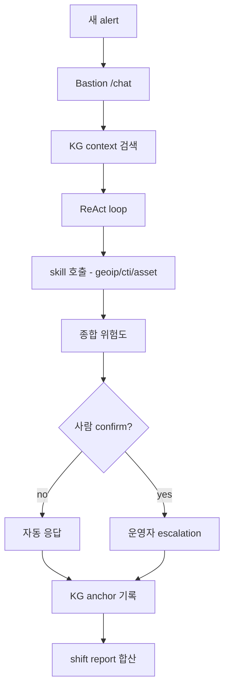
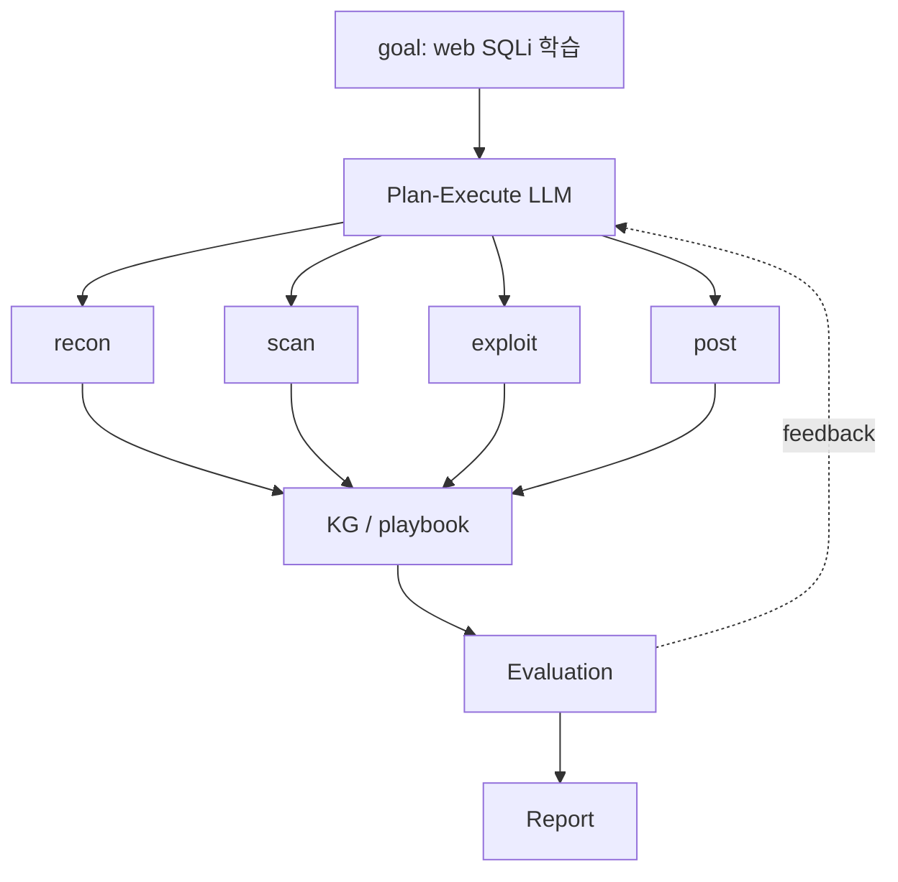
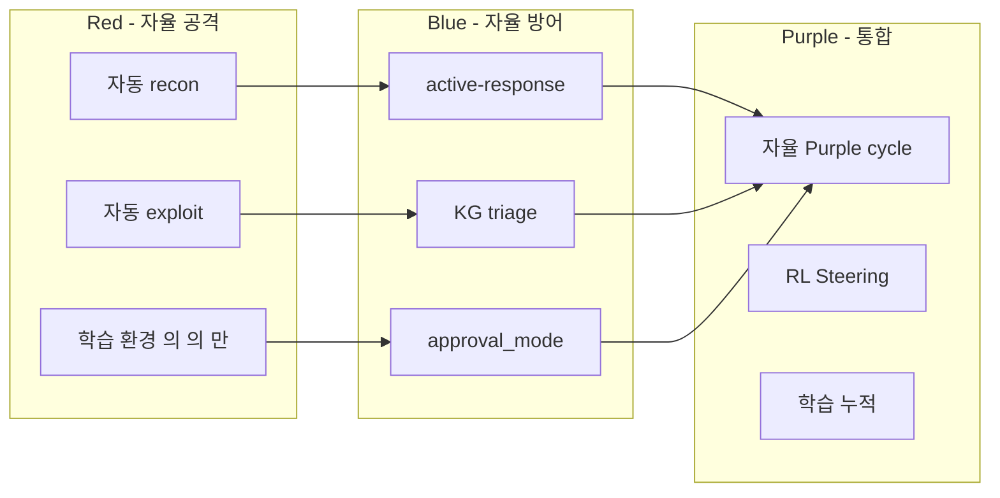

# W12 — 자율보안 (2): 자율 Blue / 자율 Red / RL Steering

> 본 주차는 **인공지능보안 (입문)** 의 12 주차이며, 자율보안 시리즈 (W11-W12) 의 마지막 주차이다.
> W11 의 자율 의 개념 / RL / 스케줄러·왓처 의 학습 위에, 본 주차 는 **자율 Blue** / **자율 Red** /
> **RL Steering** 의 구체 구현 의 학습.

---

## 본 주차 의도

W11 학생 의 학습 의 결과 — 자율 의 개념 이해. 본 주차 는:

1. **자율 Blue** 의 실 운영 구현 의 단계 별 학습.
2. **자율 Red** 의 학습 환경 의 자동 공격 시뮬 의 학습.
3. **RL Steering** — Anthropic / OpenAI 의 최근 연구 의 학습.

본 주차 후 학생 은 본인 의 학습 환경 의 자율 Blue + Red 의 통합 의 첫 단계 의 구축 가능.

---

## 1 차시 — 자율 Blue

### 1-1. 자율 Blue 의 정의

> **자율 Blue (Autonomous Blue)** = 보안 의 방어 작업 의 자율 수행 시스템.

W11 의 architecture 의 구체 구현 — 6v6 학습 환경 의 24/7 자율 운영.

### 1-2. 자율 Blue 의 task

| task | 자동 |
|------|------|
| alert triage | 신규 alert 의 자동 분류 / 위험도 |
| enrichment | srcip / asset / CVE 의 자동 결합 |
| correlation | 여러 alert 의 chain 의 자동 검출 |
| mitigation | 사람 confirm 후 차단 |
| runbook | playbook 의 자동 실행 |
| reporting | shift report 의 자동 생성 |
| learning | 새 패턴 의 KG 학습 |

### 1-3. 자율 Blue 의 운영 flow



### 1-4. 자율 Blue 의 실 사례

#### (a) Wazuh Active Response

```xml
<active-response>
  <command>firewall-drop</command>
  <location>local</location>
  <rules_id>5712</rules_id>
  <timeout>600</timeout>
</active-response>
```

→ rule 5712 (sshd brute) trigger 시 자동 iptables 차단 600 sec.

#### (b) Suricata IPS Mode

Suricata 의 `drop` action — 자동 패킷 차단.

#### (c) ModSec CRS

OWASP Core Rule Set 의 anomaly score → threshold 초과 시 자동 차단.

#### (d) CCC Bastion + Wazuh

`results/retest/bastion_watchdog.log` 의 자동 health check + alert triage + KG 학습.

### 1-5. 자율 Blue 구현 의 단계

| Step | 의의 | 적용 |
|------|------|------|
| 1. Observe + Notify | 자유 적용 | Slack/이메일 통보 |
| 2. Enrich | 자유 적용 | GeoIP/asset/CTI 자동 결합 |
| 3. Triage | 자유 적용 | LLM 5W + KG reuse |
| 4. Prepare | 가시화 만 | playbook 의 의 시각화 |
| 5. Mitigate | 사람 confirm | iptables drop / ModSec block |
| 6. Learn | 자동 | KG anchor 기록 |

### 1-6. 자율 Blue 의 위험 회피

- false positive 의 차단 — 정상 의 차단 의 운영 영향
- kill switch — 즉시 disable
- rollback — 차단 의 자동 해제 (timeout)
- observability — 모든 자율 action 의 가시화

---

## 2 차시 — 자율 Red

### 2-1. 자율 Red 의 정의

> **자율 Red (Autonomous Red)** = 보안 의 공격 / 평가 의 자율 수행 시스템.

W10 의 LLM Red Teaming 의 자동 화 의 확장 — 단발 평가 의 자율 반복.

### 2-2. 자율 Red 의 task

| task | 자동 |
|------|------|
| reconnaissance | nmap / whatweb / nikto |
| scanning | OWASP ZAP / sqlmap |
| exploitation | 학습 환경 의 자동 익스플로잇 |
| post-exploitation | lateral / persistence 시뮬 |
| reporting | findings 자동 정리 |
| adaptation | 다음 시도 의 학습 |

### 2-3. 자율 Red 의 운영 윤리 (필수)

1. **인가 된 환경** 만 — 학습 환경 / CTF / 합의 의 인가.
2. **scope 의 명시** — RoE 사전.
3. **반복 가능 records** — 모든 시도 logging.
4. **safe target** — 학습 / CTF 환경 만.
5. **외부 의 거부** — 본인 의 검증.
6. **법적 검토** — 변호사 / compliance 사전.

본 강의 학습 환경 — 6v6 / JuiceShop / attacker VM (192.168.0.112).

### 2-4. 자율 Red 의 실 도구

| 도구 | 특징 |
|------|------|
| Metasploit Pro | 자동 모듈 호출 / session 관리 |
| PentestGPT | LLM 기반 자동 모의해킹 |
| AutoPentest-DRL | DRL 기반 pentest 학습 |
| MITRE Caldera | ATT&CK 기반 자율 emulation |
| Atomic Red Team | ATT&CK Technique atomic test |
| CCC 12 attack courses | attack-ai / battle-ai / web-vuln-ai |

### 2-5. 자율 Red 의 architecture



### 2-6. 자율 Red 의 KPI

- **coverage** — ATT&CK Technique 시도 비율.
- **success rate** — 시도 의 성공.
- **mean time to exploit** — recon → exploit 시간.
- **stealth** — Blue 의 검출 회피.

### 2-7. CCC 자체 자율 Red 의 학습

memory 의 기록 (project_lab_multitask_rewrite.md):

- 12 attack courses 의 240 multi_task.
- attack-ai / web-vuln-ai / agent-ir-ai 의 자율 학습.
- R5 main 의 676 case 자동.

### 2-8. Purple Teaming — Blue + Red 통합

자율 Purple = 자율 Red + 자율 Blue 의 통합 운영.

- Red 의 시도 자동.
- Blue 의 응답 자동.
- 매 cycle 의 학습 자동.

→ 본인 환경 의 보안 의 지속 강화.

---

## 3 차시 — RL Steering

### 3-1. RL Steering 의 정의

> **RL Steering** = LLM 의 reasoning 의 inference time 의 조정. 학습 weight 의 변경 없이 모델 의 출력 방향 의 control.

전통 RLHF vs Steering:

| 측면 | RLHF | Steering |
|------|------|----------|
| 변경 시점 | 학습 단계 | inference 단계 |
| weight 변경 | yes | no |
| 비용 | 학습 비용 큼 | 추가 비용 작음 |
| 적응 | 정적 | 동적 |

### 3-2. 주요 연구

#### (a) Anthropic Activation Steering (ACT)

- internal activation 의 specific direction 의 push.
- 예: helpful / harmless / honest 의 vector 의 활성.
- 추론 시 의 안전 강화 의 도구.

#### (b) OpenAI Critic Models

- weak 의 검토 모델 의 강력 모델 의 supervise.
- WeakToStrong (2024) 의 핵심.

#### (c) Process Reward Models (PRM)

- reasoning 의 step 별 reward 의 학습.
- 다음 step 의 selection 의 보조.

#### (d) Self-Reflection / Reflexion

- 응답 의 의 self-critique loop.
- W05 의 Reflexion 의 학습 의 재 학습.

### 3-3. RL Steering 의 보안 적용

#### (a) Inference-time Safety

- 위험 한 입력 의 의 의 safety vector 의 push.
- prompt injection 의 응답 의 정정.

#### (b) Dynamic Guardrail

- 입력 의 risk 의 평가 → 응답 의 의 strict guard 의 활성.
- 정상 의 의 의 free response.

#### (c) Persona Enforcement

- system prompt 의 의 persona 의 의 의 activation 의 강제.
- "당신 은 학습 환경 의 보안 AI" 의 의 의 의 vector.

### 3-4. RL Steering 의 한계

- model interpretability 의 의 의 의존.
- 의 의 layer 의 의 vector 의 의 검색 의 비용.
- 의 의 unintended 의 side effect.

### 3-5. CCC 의 RL Steering 의 학습

CCC 의 운영 의 RL Steering 의 학습:

- Bastion 의 system prompt 의 의 학습 환경 의 강제.
- approval_mode 의 의 의 escalation 의 의 inference 조정.
- KG 의 context injection 의 의 의 response 의 의 의 steering.

미래 의 연구 — internal activation 의 의 직접 의 학습 환경 의 의 dominance.

### 3-6. R/B/P — 본 주차 의 시나리오



### 3-7. 본 주차 의 hands-on

본 주차 의 lab 의 5 step (lab yaml 참조):

1. **자율 Blue 의 active-response 시뮬** — Wazuh 의 자동 차단 의 단계 별 확인.
2. **자율 Red 의 미니 plan-execute** — Python 의 의 미니 자율 recon 의 시뮬.
3. **Purple cycle** — Red 의 시도 + Blue 의 응답 의 1 cycle 의 가시화.
4. **RL Steering 의 system prompt persona** — gemma3:4b 의 persona 강제 의 효과.
5. **CCC R5 의 학습 누적** — anchor 의 reuse vs new 의 비율 의 가시화.

---

## 본 주차 의 정리

1. **자율 Blue** 의 6 task — triage / enrichment / correlation / mitigation / runbook / reporting / learning.
2. 운영 의 6 단계 — Observe / Enrich / Triage / Prepare / Mitigate / Learn.
3. 실 사례 — Wazuh active-response / Suricata IPS / ModSec CRS / CCC Bastion.
4. **자율 Red** 의 6 task — recon / scan / exploit / post / report / adaptation.
5. 윤리 의 6 필수 — 인가 / scope / records / safe target / 외부거부 / 법적검토.
6. 도구 — Metasploit Pro / PentestGPT / AutoPentest-DRL / Caldera / Atomic / CCC.
7. **자율 Purple** — Red + Blue 통합 의 자동 cycle.
8. **RL Steering** — ACT / Critic / PRM / Reflexion.
9. CCC 의 RL Steering — system prompt / approval_mode / KG context.

---

## 자기 점검

- 자율 Blue 의 6 단계 의 응답 가능?
- 자율 Red 의 6 윤리 의 응답 가능?
- 자율 Purple 의 cycle 의 응답 가능?
- RL Steering 의 4 연구 의 응답 가능?
- ACT 의 의의 의 응답 가능?

---

## 다음 주차

**W13 — 에이전트 IR (1): 침해 개론 / 공격자 / 방어**

- 에이전트 의 침해사고 의 개론.
- 공격자 의 에이전트 의 의도.
- 방어자 의 에이전트 의 대응.

자율 의 학습 의 적용 의 IR 의 본격 학습 의 시작.
