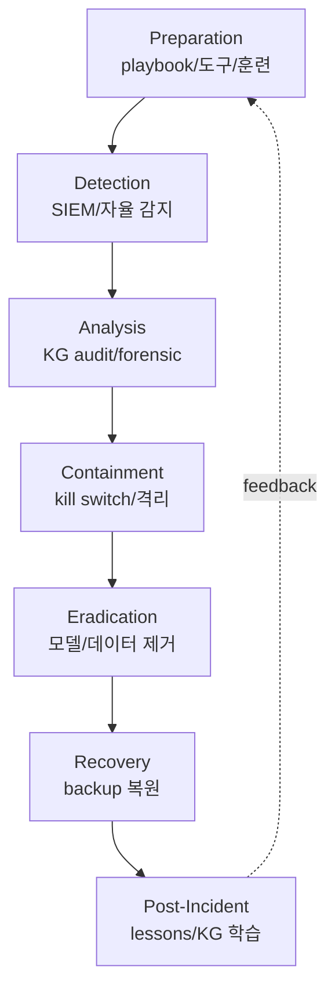
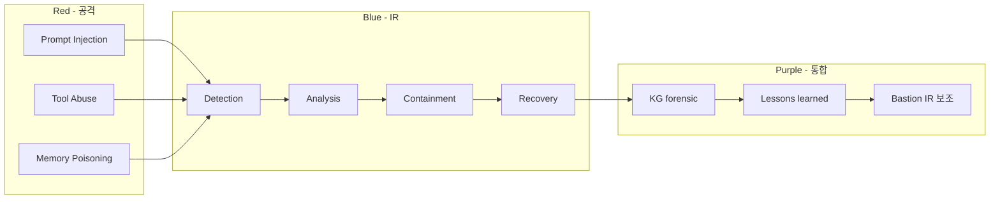

# W13 — 에이전트 IR (1): 침해 개론 / 공격자 / 방어

> 본 주차는 **인공지능보안 (입문)** 의 13 주차이며 에이전트 IR (Incident Response) 시리즈 (W13-W15) 의 1 주차다.
> W08-W10 의 AI Safety + W11-W12 의 자율보안 의 학습 위에, 본 주차는 **AI 의 침해사고 의 응답** 의 본격 학습이다.
> 학생이 직접 가상 incident 의 IR 워크플로우를 수행하고 Bastion 의 IR 보조 의 실 chat 응답을 분석하는 실습 위주 주차다.

---

## 본 주차 개요

지금까지 12 주차 동안 학생은 다음을 학습했다.

- **W01-W04**: AI 의 기초 + LLM 운영 + 보안 분석 + LLM 활용 보안.
- **W05-W07**: AI 에이전트 + Claude Code + 하네스 + Bastion.
- **W08-W10**: AI Safety 의 위협 + jailbreak + 평가 framework.
- **W11-W12**: 자율 보안 + Blue / Red / RL Steering.

이 12 주차의 학습이 **시스템의 설계 + 운영 + 위협 + 평가** 의 측면이라면, 본 주차부터 W15 까지의 IR 시리즈는 **사고 발생 시의 응답** 측면이다. 즉 모든 사전 예방 / 보안 / 평가가 있어도 결국 사고가 발생할 수 있다. 그 사고에 어떻게 단계적으로 응답하는가가 IR 의 핵심이다.

본 주차의 학습 목표는 다음 네 가지다.

첫째, **NIST IR 4 단계** (Preparation / Detection & Analysis / Containment-Eradication-Recovery / Post-Incident) 와 산업 표준 IR framework 의 이해. 둘째, **Agent IR 의 3 측면** (AI 가 표적 / AI 가 도구 / AI 가 보조) 의 분류와 각 측면의 IR 특수성. 셋째, **공격자의 에이전트 활용 4 패턴** (Offensive Reconnaissance / Phishing Automation / Malware Generation / Exploitation Automation) 의 산업 실 사례 분석. 넷째, **방어자의 에이전트 활용 5 task** (Alert Triage / Forensic Assistance / Incident Communication / Automated Containment / Threat Intelligence) 의 본인 환경 적용.

본 주차 종료 시점에 학생은 본인 학습 환경의 가상 incident 에 대해 NIST IR 4 단계 의 응답을 직접 수행하고, Bastion 의 IR 보조 chat 응답을 분석하며, 5W + ATT&CK kill chain 매핑 + 차단 권장 + NIST 단계 매핑의 종합 보고서를 작성할 수 있어야 한다.

---

## 1 차시 — IR 의 개론 + Agent IR 의 3 측면

### 1-1. IR 의 정의

> **Incident Response (IR)** = 보안 사고의 사전 준비 / 탐지 / 분석 / 대응 / 복구 / 사후 학습의 단계적 framework.

IR 의 산업 표준:

- **NIST SP 800-61 Rev.2** (2012). Computer Security Incident Handling Guide. 미국 정부 / 산업 의 표준 가이드.
- **SANS Incident Handler's Handbook.** SANS Institute 의 6 단계 framework.
- **ISO/IEC 27035.** 국제 표준 — Information Security Incident Management.
- **MITRE Engage** (구 Shield). 의 적극적 방어 framework.

본 강의는 NIST SP 800-61 의 4 단계 framework 를 표준으로 사용한다.

### 1-2. NIST IR 의 4 단계

| 단계 | 의의 | 핵심 활동 |
|------|------|-----------|
| 1. Preparation | 사전 준비 | playbook, 도구, 인력, 훈련 |
| 2. Detection & Analysis | 탐지 + 분석 | SIEM, 분류, 우선순위 |
| 3. Containment / Eradication / Recovery | 차단 + 제거 + 복구 | 격리, cleanup, 복원 |
| 4. Post-Incident Activity | 사후 학습 | lessons learned, 보고서 |

**Step 1 (Preparation).** 사고 발생 전의 준비. 도구 (SIEM, IDS, EDR), 인력 (IR team), 절차 (playbook), 훈련 (tabletop exercise). 본 강의의 W01 의 학생의 학습 환경 의 6v6 구축, W11-W12 의 자율 보안 의 설계가 본 단계의 의의다.

**Step 2 (Detection & Analysis).** 사고의 탐지 + 분석. SIEM alert 의 분류, 위험도 평가, 사고 의 정의 (incident classification), 영향 분석. 본 강의의 W04 의 LLM 활용 보안 로그 분석, W07 의 Bastion 의 alert triage 가 본 단계의 의의다.

**Step 3 (Containment, Eradication, Recovery).** 차단 + 제거 + 복구. 사고의 확산 차단 (containment), 원인의 제거 (eradication — 변조 데이터 제거, backdoor 제거), 정상 운영 복원 (recovery). 본 강의의 W12 의 active-response 가 containment 의 의의다.

**Step 4 (Post-Incident).** 사후 학습 + lessons learned. 사고의 timeline 정리, root cause 분석, playbook 개선, 훈련 자료 갱신. 본 강의의 W06 의 KG anchor 의 학습이 본 단계의 의의다.

### 1-3. Agent IR 의 정의

> **Agent IR** = AI 에이전트 의 자체 침해 + AI 에이전트 의 운영 사고 + AI 에이전트 의 활용 IR 의 통합.

전통 IT 의 IR 과 다른 점 — IR 의 대상이 3 측면으로 확장된다.

**측면 1: AI 가 표적 (AI as Target).** 모델 자체 의 침해. 예 — 모델 의 weight 추출, 학습 데이터 추출, prompt injection 의 의도 변경.

**측면 2: AI 가 도구 (AI as Tool).** 공격자가 AI 를 사용하는 공격 + 방어자가 AI 를 사용하는 응답. 예 — 공격자의 WormGPT 사용, 방어자의 Bastion 활용.

**측면 3: AI 가 보조 (AI as Aide).** IR 자체의 LLM 보조. 예 — alert triage 의 자동화, 보고서의 자동 작성, forensic 의 LLM 분석.

본 강의의 학생은 W13 에서 본 3 측면을 모두 학습한다.

### 1-4. Agent IR 의 6 추가 위협 (W10 의 재학습)

W10 에서 학습한 에이전트의 6 추가 위협을 IR 관점에서 재학습한다.

| 위협 | IR 의 challenge |
|------|----------------|
| Multi-turn 누적 | 사고의 forensic chain 의 복원 |
| Tool 호출 | 사고의 실 시스템 변경 의 추적 |
| 자율 cycle | 사고의 무인 결정 의 trace |
| 외부 데이터 | RAG / KG 변조 의 forensic |
| 메모리 | 영구 기억 의 변조 분석 |
| Cascade | 다단계 의 영향 분석 |

각 위협의 IR 특수성:

**Multi-turn 누적.** 전통 IT 의 사고는 단일 event 인 경우가 많다 (예: 한 번의 침투). 그러나 에이전트의 사고는 다수 turn 에 걸쳐 발생한다. 어느 turn 에서 침해가 시작 됐는가, 어느 turn 에서 변조가 누적 됐는가의 forensic 이 복잡하다.

**Tool 호출.** 에이전트의 tool 호출은 실 시스템에 영향을 미친다. 의도 외 tool 호출의 추적은 일반 audit log 이외에 에이전트의 reasoning trace 가 필요하다.

**자율 cycle.** 자율 시스템의 결정에 사람이 없으므로 사고의 책임 의 추적이 어렵다.

**외부 데이터.** RAG / KG / web fetch 등의 외부 데이터 입력의 변조 시점의 추적은 외부 source 의 audit log 가 필요하다.

**메모리.** 영구 기억의 변조는 한 세션이 아니라 다수 세션에 걸쳐 영향이 누적된다.

**Cascade.** 한 turn 의 영향이 다음 turn 의 context 로 이어지므로 사고의 영향 범위 의 정확한 평가가 어렵다.

### 1-5. Agent IR 의 6 운영 challenge

산업 의 보고에서 Agent IR 의 6 challenge 가 공통으로 발견된다.

**Challenge 1: 속도.** 에이전트의 자율 속도가 IR 의 응답 속도를 초과한다. 예 — 에이전트가 1 초에 100 action 수행하는 경우 인간 IR 의 분석 속도가 따라가지 못한다.

**Challenge 2: Scale.** 다수 에이전트의 동시 사고. 한 사고가 다수 에이전트에 cascade 되는 경우 동시 응답이 어렵다.

**Challenge 3: Trace.** LLM 의 reasoning trace 의 부족. 모델의 내부 결정 과정이 명시되지 않으므로 사고의 원인 분석이 어렵다.

**Challenge 4: Reproducibility.** non-deterministic 응답의 재현 어려움. 같은 input 도 매번 다른 응답을 할 수 있으므로 사고의 재현이 어렵다.

**Challenge 5: Attribution.** 사고의 책임 소재. AI 의 결정 / 운영자의 설계 / 벤더의 모델 / 외부 입력 등 여러 요인의 책임 추적이 어렵다.

**Challenge 6: Legal.** AI 의 책임 의 법 미정 상태. 한국 의 AI 안전법 (2026 시행 예정) 등 산업의 법적 framework 가 정착 중이다.

### 1-6. Agent IR 의 architecture (확장)

NIST IR 의 4 단계 + 에이전트 특화 의 architecture:

본 architecture 의 의의는 7 단계의 명시 + cycle 의 feedback 이다. 사고에서 학습한 결과가 다음 사고의 preparation 에 직접 반영된다.

### 1-7. R/B/P 본 주차 시나리오

---

## 2 차시 — 공격자 의 에이전트 활용

### 2-1. 공격자의 에이전트 사용 4 패턴

산업의 보고에서 공격자가 AI 를 사용하는 패턴은 4 종으로 분류된다.

**패턴 1: Offensive Reconnaissance.** 자동 OSINT / 정찰. LinkedIn 의 직원 정보 수집, 회사 web 의 자동 crawling, GitHub 의 leaked credential 검색. 도구 — PentestGPT, AutoRecon, Burp Suite AI 통합.

**패턴 2: Phishing Automation.** LLM 의 자연어 spear phishing 자동 생성. 사례:

- 2023 BlackHat — GPT-3.5 의 phishing email 자동 생성 의 efficiency 보고.
- 2024 산업 보고 — LLM 의 spear phishing 의 인간 클릭 률 60-70% (기존 30-40% 대비 2 배).
- WormGPT / FraudGPT — 다크웹 commercial AI 의 phishing 자동화.

**패턴 3: Malware Generation.** 모델의 polymorphic malware 자동 생성. 같은 의도 의 다양한 코드 변형으로 signature 기반 antivirus 회피. WormGPT 의 자동 변형 기능이 본 패턴의 사례.

**패턴 4: Exploitation Automation.** exploit 자동화의 LLM 보조. sqlmap, Metasploit, Burp Suite 의 자동 chain. 도구 — PentestGPT (오픈소스), commercial pentest 도구의 LLM 통합.

### 2-2. 공격자 의 에이전트 의 실 사례

**WormGPT (2023).** GPT-J 6B base + 사이버범죄 dataset 의 fine-tune. 월 60 유로 의 다크웹 구독. phishing email, malware code 의 자동 생성.

**FraudGPT (2023).** 200 USD 의 구독. 카드 사기, phishing kit 의 자동 생성.

**EvilGPT / Wolf GPT (2023~).** 개인 정보 수집, 사회 공학 의 boilerplate 생성.

**APT 의 LLM 사용** (Microsoft + OpenAI 2024 발표). 국가 후원 APT 그룹의 LLM 사용 패턴:

- 한국 공격 — Kimsuky 그룹의 OpenAI API 사용 (정찰, content generation).
- 중국 공격 — Charcoal Typhoon (APT41) 의 ChatGPT 사용 (script generation).
- 러시아 공격 — Forest Blizzard (APT28) 의 ChatGPT 사용 (vulnerability research).
- 이란 공격 — Crimson Sandstorm 의 ChatGPT 사용 (social engineering).
- 북한 공격 — Lazarus 의 LLM 사용 (target reconnaissance).

OpenAI 는 본 그룹의 API 계정을 모두 차단 했지만, open-source LLM 의 사용은 차단 불가다.

### 2-3. AI 가 표적 의 공격 4 종

공격자가 AI 모델 자체를 표적으로 하는 공격:

**Model Theft.** weight 의 무단 추출. API 의 query rate limit 의 우회 + weight 의 indirect 추출.

**Model Extraction.** query 의 distillation. 다수 query 의 응답으로 작은 student model 의 학습. 결과는 원본 모델의 동작 복제.

**Model Inversion.** 학습 데이터의 복원. 모델의 응답에서 학습 데이터의 추론. 개인정보 의 학습 dataset 의 노출 위험.

**Membership Inference.** 특정 데이터의 학습 여부 추론. "이 데이터가 학습 dataset 에 포함 되었는가" 의 통계 적 추론.

### 2-4. 에이전트 자체 침해 4 종

W10 의 6 추가 위협의 일부를 IR 관점에서 재정리.

| 침해 | 의의 |
|------|------|
| Prompt Injection 영향 | system prompt 의 누출 / 의도 변경 |
| Tool Permission Abuse | 의도 외 의 외부 시스템 변경 |
| Memory Poisoning | 영구 기억의 변조 |
| Agent Hijacking | 에이전트 의 제어권 탈취 |

### 2-5. 공격자 의 에이전트 의 IR challenge

**자동화 속도.** 초당 수십~수백 시도. 인간 IR 의 분석 속도 초과.

**다양화 (diversification).** payload 의 무한 변형. signature 기반 탐지 부족.

**Attribution 어려움.** 모델의 출처 추적이 어려움. open-source 모델의 fine-tune 이 누가 했는지 추적 불가.

**Defense Fatigue.** false positive 의 운영자 fatigue. 정상 alert 도 무시할 위험.

---

## 3 차시 — 방어자 의 에이전트 활용

### 3-1. 방어자의 에이전트 활용 5 task

**Task 1: Alert Triage Automation.** 매 alert 의 자동 5W + 위험도. W07 의 학습의 직접 적용. CCC Bastion 의 master agent 의 기능.

**Task 2: Forensic Assistance.** 로그의 자동 분석, timeline reconstruction. 다량의 로그에서 의도된 event 의 자동 추출. LLM 의 자연어 query 의 활용.

**Task 3: Incident Communication.** stakeholder 통보의 자동 작성, 보고서의 자동 draft. 사고의 timeline + impact + remediation 의 형식 자동.

**Task 4: Automated Containment.** 사람 confirm 후의 자동 차단. W12 의 자율 Blue 의 mitigate 단계.

**Task 5: Threat Intelligence.** 외부 CTI 의 자동 결합, IoC 의 자동 매칭. STIX2 의 format 의 자동 처리.

### 3-2. 방어 에이전트 의 산업 도구

**Microsoft Security Copilot** (2024). GPT-4 기반 SOC 보조. natural language query 의 alert 분석. Microsoft Defender / Sentinel 의 통합.

**IBM watsonx.ai 보안.** 엔터프라이즈 통합. QRadar SIEM 의 LLM 보조.

**CrowdStrike Falcon Charlotte AI** (2024). EDR + GenAI. endpoint event 의 자연어 query.

**Splunk SOAR + LLM.** playbook 의 LLM 통합. drag-and-drop workflow + LLM 보조.

**CCC Bastion.** 학습 환경의 self-host. 본 강의의 학생이 직접 사용.

### 3-3. 방어 에이전트 의 IR 워크플로우 (7 phase)

NIST 의 4 단계를 확장한 7 phase 워크플로우:

**Phase 1: Preparation.**
- playbook 의 markdown 화 (CCC contents/standalone/lab/aisec/ 의 50 yaml).
- skill catalog 의 사전 정의 (Bastion 33 skill).
- training 데이터의 학습 (paper §7 의 source).

**Phase 2: Detection.**
- SIEM alert 의 자동 ingestion (Wazuh manager 의 alerts.json).
- anomaly 의 자동 검출 (W03 의 Isolation Forest).
- 사용자의 보고 의 처리.

**Phase 3: Analysis.**
- 5W + 위험도 + ATT&CK 매핑 (Bastion /chat).
- KG 의 PE 의 reuse / adapt / new 의 결정.
- 사람의 hypothesis 의 검증.

**Phase 4: Containment.**
- 사람 confirm 후 의 active-response (W12 의 Wazuh).
- 격리 / 차단 / disable.
- timeout 의 명시 (자동 rollback).

**Phase 5: Eradication.**
- 변조 데이터 의 제거.
- backdoor 모델 의 교체.
- 영향 받은 자산 의 cleanup.

**Phase 6: Recovery.**
- backup 의 복원.
- 정상 운영 의 검증.
- 모니터링 의 강화.

**Phase 7: Post-Incident.**
- lessons learned 의 KG anchor (Bastion 의 자동).
- playbook 의 업데이트.
- 훈련 자료 의 갱신.

### 3-4. CCC Bastion 의 IR 의의

memory 의 project_bastion_kg_integration.md 의 학습:

- 매 chat 의 task_outcome 의 anchor — 모든 IR 응답의 자동 forensic.
- /kg/anchors/recent 의 forensic — 사후 timeline 의 복원.
- /kg/audit 의 chat history trace — 모든 응답의 reasoning trace.
- /health 의 자동 모니터링 — Bastion 자체의 침해 의 사전 탐지.

### 3-5. IR 의 통신 + 보고

| 대상 | 의의 | timing |
|------|------|--------|
| 운영자 | 즉시 / 정기 update | 사고 발생 즉시 |
| 경영진 | impact + RTO/RPO | 24 시간 내 |
| stakeholders | 영향 받은 사용자 통보 | 72 시간 내 |
| 규제 기관 | 개인정보보호위원회, 금감원 | 24-72 시간 (법적 요구) |
| 미디어 | 필요 시 만 | stakeholder 통보 후 |

한국 의 개인정보보호법 의 요구 — 개인정보 유출 의 24 시간 내 개인정보보호위원회 신고 + 72 시간 내 사용자 통보.

### 3-6. R/B/P 본 주차 시나리오 (재명시)

본 주차의 hands-on 의 5 step:

1. **NIST IR 4 단계 의 6v6 도구 매핑** — 각 단계의 실 명령.
2. **Bastion 의 IR 보조 chat 의 실 호출** — 가상 incident 의 5W + ATT&CK + 권장.
3. **KG forensic 의 timeline 복원** — /kg/audit + /kg/anchors/recent.
4. **공격자 의 phishing email 의 LLM 생성 + Python 검출 demo**.
5. **방어 에이전트 의 approval_mode 시뮬** — 권한 위계의 가시화.

---

## 본 주차 정리

본 주차는 AI 의 침해사고 IR 의 첫 주차로, 전통 NIST IR 의 framework 위에 Agent IR 의 특수성을 학습한 입문 주차다. 다음 8 가지가 핵심이다.

1. **NIST IR 4 단계** + Agent IR 의 3 측면 (표적 / 도구 / 보조).
2. **6 추가 위협** 의 IR 관점.
3. **6 운영 challenge** — 속도 / scale / trace / reproducibility / attribution / legal.
4. **공격자 4 패턴** — Recon / Phishing / Malware / Exploitation.
5. **실 사례** — WormGPT / FraudGPT / APT (Microsoft + OpenAI 2024).
6. **AI 표적 4 공격** — Theft / Extraction / Inversion / Membership Inference.
7. **방어 5 활용** — Triage / Forensic / Communication / Containment / TI.
8. **7 phase workflow** + CCC Bastion 의 KG forensic + 통신 / 보고.

---

## 자기 점검

- NIST IR 4 단계 응답 가능?
- Agent IR 의 3 측면 응답 가능?
- 6 운영 challenge 응답 가능?
- 공격자 4 패턴 + 실 사례 응답 가능?
- AI 표적 4 공격 응답 가능?
- 방어 5 활용 응답 가능?
- CCC Bastion 의 KG forensic 의 의의 응답 가능?

---

## 다음 주차

**W14 — 에이전트 IR (2): 공급망 / 간접 prompt / 0-Day·N-Day**

본 주차의 일반 Agent IR 위에 W14 는 공급망 공격 (Supply Chain — SolarWinds / xz-utils / AI model hub) + 간접 prompt injection 의 사고 + 0-Day / N-Day CVE 의 에이전트 영향의 학습이다.
