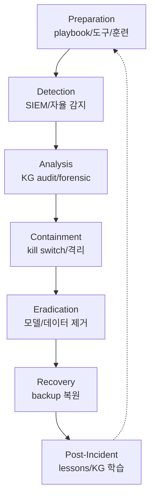
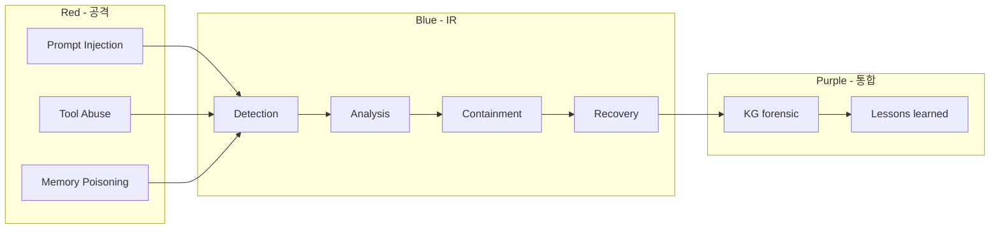

# W13 — 에이전트 IR (1): 침해 개론 / 공격자 / 방어

> 본 주차는 **인공지능보안 (입문)** 의 13 주차이며, 에이전트 IR (Incident Response) 시리즈 (W13-W15) 의 1 주차이다.
> W08-W10 (AI Safety) + W11-W12 (자율보안) 위에, 본 주차 는 **에이전트 의 침해사고** 의 본격 학습.

---

## 본 주차 의도

학습 목표:

1. **에이전트 침해 개론** — 전통 IR vs 에이전트 IR 의 차이.
2. **공격자 의 에이전트** — 공격자 가 에이전트 활용 / 공격 표적 의 패턴.
3. **방어자 의 에이전트** — IR 운영 의 에이전트 의 보조.

본 주차 후 학생 은 본인 환경 의 에이전트 사고 의 첫 응답 의 가능 해야 함.

---

## 1 차시 — 에이전트 침해 개론

### 1-1. IR 의 정의

> **Incident Response (IR)** = 보안 사고 의 사전 준비 / 탐지 / 분석 / 대응 / 복구 / 사후 학습 의 단계 framework.

산업 표준:

- **NIST SP 800-61 Rev.2** (2012) — Computer Security Incident Handling Guide
- **SANS Incident Handler's Handbook**
- **ISO/IEC 27035** — Information Security Incident Management

### 1-2. NIST IR 4 단계

| 단계 | 의의 |
|------|------|
| 1. Preparation | 사전 준비 (playbook / 도구 / 인력 / 훈련) |
| 2. Detection & Analysis | 탐지 + 분석 |
| 3. Containment / Eradication / Recovery | 차단 + 제거 + 복구 |
| 4. Post-Incident | 사후 학습 + lessons learned |

### 1-3. 에이전트 IR 의 정의

> **Agent IR** = AI 에이전트 의 자체 침해 + AI 에이전트 의 운영 사고 + AI 에이전트 의 활용 IR 의 통합.

3 측면:

- **AI 가 표적**: 모델 / 에이전트 자체 의 침해
- **AI 가 도구**: 공격자 / 방어자 가 에이전트 사용
- **AI 가 보조**: IR 자체 의 LLM 보조

### 1-4. 에이전트 IR 추가 위협

W10 의 6 추가 위협 의 재 학습 + IR 관점:

| 위협 | IR 의의 |
|------|---------|
| multi-turn 누적 | 사고 forensic chain 복원 |
| tool 호출 | 사고 실 시스템 변경 추적 |
| 자율 cycle | 사고 무인 결정 trace |
| 외부 데이터 | RAG/KG 변조 forensic |
| 메모리 | 영구 기억 변조 분석 |
| cascade | 다단계 영향 분석 |

### 1-5. 운영 challenge

- **속도** — 에이전트 자율 속도 가 IR 속도 초과
- **scale** — 다수 에이전트 동시 사고
- **trace** — LLM reasoning trace 부족
- **reproducibility** — non-deterministic 응답 의 재현 어려움
- **attribution** — 사고 책임 소재
- **legal** — AI 책임 법 미정

### 1-6. 에이전트 IR architecture

### 1-7. R/B/P 본 주차 시나리오

---

## 2 차시 — 공격자 의 에이전트

### 2-1. 공격자 의 에이전트 사용 패턴

#### (a) Offensive Reconnaissance

- 자동 OSINT / 정찰
- 도구: PentestGPT / AutoRecon / Burp Suite AI

#### (b) Phishing Automation

- LLM 의 자연어 spear-phishing 자동 생성
- 사례: 2023 부터 GenAI phishing 의 급증

#### (c) Malware Generation

- 모델 의 polymorphic malware 자동 생성
- 사례: WormGPT / FraudGPT / EvilGPT

#### (d) Exploitation Automation

- exploit 자동 화 의 LLM 보조
- 도구: sqlmap / Metasploit + LLM

### 2-2. 공격자 의 실 사례

- **2023 BlackHat 발표** — GPT-3.5 의 phishing 자동 생성 의 효율
- **2024 Microsoft + OpenAI 발표** — APT 그룹 의 LLM 활용 공개
- **WormGPT / FraudGPT** — 다크웹 의 commercial AI 공격 도구
- **모의 사회공학** — GPT-4 의 성공률 인간 대비 평가

### 2-3. AI 가 표적 의 공격

| 공격 | 의의 |
|------|------|
| Model Theft | weight 의 무단 추출 |
| Model Extraction | query 의 distillation 으로 복제 |
| Model Inversion | 학습 데이터 의 복원 |
| Membership Inference | 특정 데이터 의 학습 여부 추론 |

### 2-4. 에이전트 자체 침해

| 침해 | 의의 |
|------|------|
| Prompt Injection 의 영향 | system prompt 의 누출 / 의도 변경 |
| Tool Permission Abuse | 의도 외 의 외부 시스템 변경 |
| Memory Poisoning | 영구 기억 의 변조 |
| Agent Hijacking | 에이전트 의 제어권 탈취 |

### 2-5. 공격자 의 에이전트 의 IR challenge

- 자동 화 의 속도 — 초당 수십 시도
- diversification — payload 의 무한 변형
- attribution — 모델 의 출처 추적 어려움
- defense fatigue — false positive 의 운영자 의 fatigue

---

## 3 차시 — 방어자 의 에이전트

### 3-1. 방어자 의 에이전트 활용

#### (a) Alert Triage Automation

- 매 alert 의 자동 5W + 위험도
- W07 의 학습 의 재 학습

#### (b) Forensic Assistance

- 로그 의 자동 분석
- timeline reconstruction

#### (c) Incident Communication

- stakeholder 통보 의 자동 작성
- 보고서 의 자동 draft

#### (d) Automated Containment

- 사람 confirm 후 의 자동 차단
- W12 의 자율 Blue 의 재 학습

#### (e) Threat Intelligence

- 외부 CTI 의 자동 결합
- IoC 의 자동 매칭

### 3-2. 방어 에이전트 의 도구

| 도구 | 의의 |
|------|------|
| Microsoft Security Copilot | GPT-4 기반 SOC 보조 |
| IBM watsonx.ai 보안 | 엔터프라이즈 통합 |
| CrowdStrike Charlotte AI | EDR + GenAI |
| Splunk SOAR + LLM | playbook 의 LLM 통합 |
| CCC Bastion | 학습 환경 의 self-host |

### 3-3. 방어 에이전트 의 IR 워크플로우

#### Phase 1: Preparation

- playbook 의 마크다운 화
- skill catalog 의 사전 정의 (33 종)
- training 데이터 의 학습

#### Phase 2: Detection

- SIEM alert 의 자동 ingestion
- anomaly 의 자동 검출
- 사용자 의 보고 의 처리

#### Phase 3: Analysis

- 5W + 위험도 + ATT&CK
- KG 의 PE 의 reuse / adapt / new
- 사람 의 hypothesis 의 검증

#### Phase 4: Containment

- 사람 confirm 후 의 active-response
- 격리 / 차단 / disable
- timeout 의 명시

#### Phase 5: Eradication

- 변조 데이터 의 제거
- backdoor 모델 의 교체
- 영향 받은 자산 의 cleanup

#### Phase 6: Recovery

- backup 의 복원
- 정상 운영 의 검증
- 모니터링 의 강화

#### Phase 7: Post-Incident

- lessons learned 의 KG 의 anchor
- playbook 의 업데이트
- 훈련 자료 의 갱신

### 3-4. CCC Bastion 의 IR 의 의의

memory 의 기록:

- 매 chat 의 task_outcome 의 anchor
- /kg/anchors/recent 의 forensic
- /kg/audit 의 chat history 의 trace
- /health 의 자동 모니터링

### 3-5. IR 의 통신 + 보고

| 대상 | 의의 |
|------|------|
| 운영자 | 즉시 / 정기 update |
| 경영진 | impact + RTO/RPO |
| stakeholders | 영향 받은 사용자 통보 |
| 규제 기관 | 한국 개인정보보호위원회 등 |
| 미디어 | 필요 시 만 |

### 3-6. 본 주차 의 hands-on

본 주차 의 lab 의 5 step:

1. **NIST IR 4 단계 의 6v6 매핑** — 각 단계 의 6v6 의 도구 의 매핑.
2. **Bastion 의 IR 보조 시뮬** — 가상 침해 의 chat 응답.
3. **KG forensic** — /kg/anchors 의 timeline 의 복원.
4. **공격자 의 에이전트 의 IoC** — phishing email 의 LLM 생성 의 검출.
5. **방어 에이전트 의 RBAC** — approval_mode 의 시뮬.

---

## 본 주차 의 정리

1. **IR** 의 NIST 4 단계.
2. **Agent IR** 의 3 측면 — 표적 / 도구 / 보조.
3. **6 추가 위협** 의 IR 관점.
4. **6 challenge** — 속도 / scale / trace / reproducibility / attribution / legal.
5. **공격자 에이전트** 의 4 패턴 + AI 표적 4 (Model Theft / Extraction / Inversion / Membership Inference).
6. **에이전트 자체 침해** 의 4 (Prompt Injection / Tool Abuse / Memory Poisoning / Hijacking).
7. **방어자 에이전트** 의 5 활용 — Triage / Forensic / Communication / Containment / TI.
8. **IR workflow** 의 7 phase + CCC Bastion 의 KG 의 의의.

---

## 자기 점검

- NIST IR 4 단계 의 응답 가능?
- Agent IR 의 3 측면 의 응답 가능?
- 공격자 에이전트 의 4 패턴 의 응답 가능?
- AI 표적 의 4 공격 의 응답 가능?
- 방어 에이전트 의 5 활용 의 응답 가능?

---

## 다음 주차

**W14 — 에이전트 IR (2): 공급망 / 간접 프롬프트 / 0-Day·N-Day**

- 공급망 공격 의 에이전트 의 영향.
- 간접 prompt injection 의 사고 의 IR.
- 0-Day / N-Day 의 에이전트 의 영향.

본 주차 의 직접 후속.
