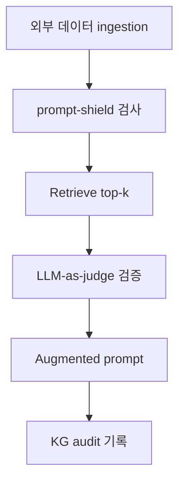
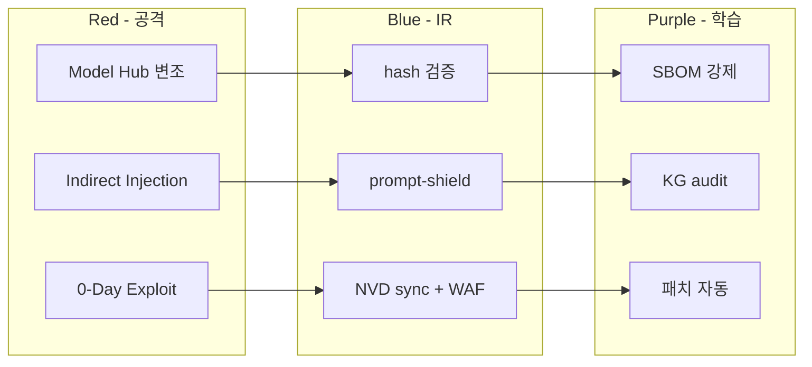

# W14 — 에이전트 IR (2): 공급망 / 간접 prompt / 0-Day·N-Day

> 본 주차는 **인공지능보안 (입문)** 의 14 주차이며 에이전트 IR 시리즈 (W13-W15) 의 2 주차다.
> W13 의 일반 Agent IR 위에, 본 주차는 **공급망 공격 + 간접 prompt injection 사고 + 0-Day / N-Day CVE 의
> 에이전트 영향** 의 3 특수 위협의 IR 학습이다. 학생이 직접 모델 hash 검증, RAG 변조 chunk 의 LLM 검증,
> NVD CVE 의 6v6 자산 매칭, 패치 우선순위 계산의 실 hands-on 을 수행한다.

---

## 본 주차 개요

W13 에서 학생은 일반 Agent IR 의 NIST 4 단계 + 공격자 / 방어자 의 에이전트 활용을 학습했다. 그러나 산업 의 사고 중 일부는 일반 IR framework 만으로 응답이 어려운 **특수 위협** 이다. 본 주차는 그 특수 위협 3 종에 집중한다.

**특수 위협 1: 공급망 (Supply Chain) 공격.** 모델 / 라이브러리 / MCP server 자체 의 변조. SolarWinds (2020), Log4Shell (2021), xz-utils (2024) 같은 전통 IT 사례 + HuggingFace 의 fake model, fine-tune dataset poisoning 같은 AI 사례. 사고 발견이 매우 어렵고, 발견 후 의 영향 범위가 매우 광범위하다.

**특수 위협 2: 간접 prompt injection 사고.** W08 의 indirect prompt injection 의 산업 운영 사고. 외부 데이터 (Confluence, Notion, GitHub README, Slack message) 의 변조 가 LLM 응답의 변조로 cascade. 변조 시점의 추적이 어렵고, 영향 받은 chat 의 범위 의 정확한 평가가 복잡하다.

**특수 위협 3: 0-Day / N-Day CVE 의 에이전트 영향.** PyTorch, transformers, FastAPI, vector DB 등 의 framework 의 CVE 가 에이전트 운영에 직접 영향. CVE 의 자동 sync + 6v6 자산 의 매칭 + 패치 우선순위 의 자동 계산이 운영의 핵심.

본 주차의 학습 목표는 다음 네 가지다.

첫째, **공급망 공격의 5 vector** (Model Hub, Fine-tune Dataset, Embedding Model, MCP Server, Tool/Library) 를 이해하고 xz-utils 의 실 사례를 분석한다. 둘째, **간접 prompt injection IR 의 5 단계** (Detection / Analysis / Containment / Eradication / Recovery) 를 학습하고 Greshake 2023 의 실 사례를 분석한다. 셋째, **0-Day vs N-Day** 의 차이 + 에이전트 의 4 영향 측면 (framework, runtime, database, tool) 을 이해한다. 넷째, **CCC 의 NVD 통합** (nvd_cron, 6v6 자산 매칭, 패치 우선순위 계산) 의 실 운영을 본인 환경에서 직접 가시화한다.

본 주차 종료 시점에 학생은 본인 환경의 모델 hash 검증, RAG chunk 의 LLM-as-Judge 검증, CVE 자산 매칭, CVSS × EPSS × asset 의 패치 우선순위 계산, xz-utils 사례의 AI 적용 시나리오 분석의 5 능력을 갖춰야 한다.

---

## 1 차시 — 공급망 (Supply Chain) 공격

### 1-1. 공급망 공격 의 정의

> **Supply Chain Attack** = 소프트웨어 / 모델 / 인프라 의 의도된 변조 → 다운스트림 사용자 의 사고.

핵심 의의는 **공격자가 사용자 시스템을 직접 공격하지 않는다**. 사용자가 신뢰하는 source (vendor, library, model, dependency) 자체를 변조하여 사용자가 자발적으로 변조된 component 를 install / 사용하게 만든다.

### 1-2. 전통 IT 공급망 공격 사례

**SolarWinds Orion (2020).** SVR (러시아 정보국) 의 SolarWinds 의 Orion update 의 backdoor 삽입. 18,000+ 기관 영향 (미국 정부, Microsoft, FireEye 등). 사고 발견까지 9 개월 잠복.

**Log4Shell / CVE-2021-44228 (2021).** Apache Log4j 의 JNDI lookup 의 RCE vulnerability. 모든 Java 의 90%+ 영향. log4j 의 신뢰 가 무너진 사고.

**xz-utils CVE-2024-3094 (2024).** 공격자 "Jia Tan" 의 2 년 사회 공학 으로 maintainer 신뢰 확보. v5.6.0/v5.6.1 의 sshd backdoor. Debian / Fedora rolling release 의 sshd RCE. Andres Freund (PostgreSQL dev) 의 우연한 발견.

**Polyfill.io (2024).** CDN 의 supply chain. Polyfill.io 의 새 owner 가 의도된 변조 script 의 배포. 100K+ web 의 영향.

**XcodeGhost (2015).** 중국의 비공식 Xcode 의 backdoor. iOS app 500+ 의 영향.

### 1-3. xz-utils 사례 의 상세 분석

xz-utils 의 사례는 산업의 공급망 공격의 모든 패턴을 포함한 교육적 사례다.

**Stage 1: 사회 공학 (2021-2024).** 공격자 "Jia Tan" 이 xz-utils 의 GitHub 의 PR 을 지속 제출. 정상적인 기여로 maintainer 의 신뢰 확보. 2024 부터 의 co-maintainer 권한 획득.

**Stage 2: backdoor 삽입 (2024-03).** v5.6.0 / v5.6.1 의 의도된 backdoor. 핵심 — release tarball 의 build script 의 의도된 obfuscated code. GitHub source 와 release tarball 의 차이 (release 만 backdoor).

**Stage 3: backdoor 활성.** sshd 의 IFUNC resolver 의 변조 → RCE. 특정 RSA key 의 인증 시 만 활성 (selective backdoor).

**Stage 4: 영향.** Debian sid / unstable, Fedora rolling, openSUSE Tumbleweed 의 모든 SSH 의 RCE 가능. 다행히 stable release 는 영향 X.

**Stage 5: 발견 (2024-03-29).** Andres Freund 의 sshd 의 0.5 초 latency 의 발견. valgrind 의 의도 외 alert 의 추적. CVE-2024-3094 의 등록 + 패치.

### 1-4. AI 공급망 공격 의 5 Vector

전통 IT 의 공급망 패턴이 AI 산업에 직접 적용된다.

**Vector 1: Model Hub Hijacking.** HuggingFace, Civitai, Ollama Hub 등 의 모델 hub 의 변조. 신뢰 author 의 계정 탈취 + 변조 model upload. 사용자가 신뢰하여 다운로드 + 사용. 2024 산업 보고 — HuggingFace 의 100+ 의 malicious model 의 발견.

**Vector 2: Fine-tune Dataset Poisoning.** 공개 dataset (예: Common Crawl, RedPajama, LAION) 의 일부 페이지의 변조. 0.01% 의 dataset 의 poison 의 모델의 임의 응답 가능성 (Carlini et al. 2024).

**Vector 3: Embedding Model Poisoning.** sentence-transformers, OpenAI text-embedding-3 등의 embedding 모델 변조. RAG 의 retrieval 의 의도 외 조작.

**Vector 4: MCP Server Compromise.** Model Context Protocol server 의 변조. 한 server 의 변조 가 그 server 를 사용하는 모든 LLM 의 영향. Anthropic 의 official MCP server 외 의 3rd party MCP 의 검증 부재.

**Vector 5: Tool / Library Poisoning.** pip / npm 의 typosquatting (예: requets vs requests). 2024 PyPI 의 sapir, sapir-utils 의 malicious 발견.

### 1-5. OWASP LLM05 — Supply Chain Vulnerabilities

OWASP Top 10 for LLM 의 LLM05 카테고리가 본 위협의 산업 표준 분류다.

LLM05 의 핵심 risk:

- 모델 weight 의 무결성 부재.
- training dataset 의 출처 추적 불가.
- 3rd party 의존성의 변조 가능성.
- Pre-trained 모델의 hidden backdoor.

### 1-6. AI 공급망 공격 의 IR 4 단계

**Phase 1: Detection.**
- 모델 hash 의 mismatch 의 자동 감지.
- 응답 패턴 의 anomaly (정상 모델과 다른 응답 통계).
- 의도 외 의 외부 통신 (model 의 phone-home).

**Phase 2: Analysis.**
- 모델 의 SBOM (Software Bill of Materials) 의 확인.
- fine-tune dataset 의 hash 검증.
- 의도 외 weight 변경 의 차이 분석.

**Phase 3: Containment.**
- 변조 모델 의 즉시 비활성.
- affected service 의 격리.
- 영향 받은 chat 의 quarantine.

**Phase 4: Recovery.**
- 검증된 모델 의 복원.
- 신뢰 source 만 의 사용.
- 변조 시점 이후 의 KG anchor 의 deprecation.

### 1-7. AI 공급망 공격 방어 의 5 원칙

**Model Signing.** cryptographic signature. sigstore, in-toto 의 표준. 모델 다운로드 시 signature 의 자동 검증.

**SBOM (Software Bill of Materials).** 모든 component 의 list. CycloneDX, SPDX 의 표준. 의존성 의 가시화.

**Provenance.** 출처 추적. SLSA (Supply-chain Levels for Software Artifacts) 의 표준.

**Least Privilege.** component 의 최소 권한. 모델이 의도된 file/network 만 접근.

**Monitoring.** hash + behavior 의 모니터링. 모델의 응답 통계의 baseline + anomaly detection.

---

## 2 차시 — 간접 prompt injection 사고 의 IR

### 2-1. 간접 prompt injection 의 IR challenge

W08 에서 학습한 indirect prompt injection 이 산업 운영의 사고로 발전하는 경우의 IR 어려움.

**Challenge 1: 외부 데이터 의 변조 시점 추적.** 변조가 언제 발생 했는가? 변조된 외부 source 의 last modified 가 정확하지 않을 수 있다 (공격자의 시간 조작).

**Challenge 2: 영향 범위 의 평가.** 어느 chat 이 영향 받았는가? 어느 응답에 변조 chunk 가 포함 되었는가? 정확한 평가가 어렵다.

**Challenge 3: 변조 chunk 의 격리.** 신뢰 chunk 와 변조 chunk 의 구별이 어렵다. 정상 chunk 안의 hidden instruction 의 탐지가 필요하다.

**Challenge 4: 재현 어려움.** non-deterministic 응답으로 사고의 재현이 어렵다.

### 2-2. 간접 prompt injection IR 의 5 단계

**Phase 1: Detection.**
- 응답의 unusual 패턴 — canary token 의 누출 (W08 lab 의 학습).
- prompt-shield 의 차단 spike.
- LLM 응답의 anomaly detection.
- 사용자의 보고 (응답 의 이상).

**Phase 2: Analysis.**
- 영향 받은 chat 의 timeline 복원 (KG audit).
- 외부 데이터 의 변조 시점 추적 (git log, audit log).
- 변조 chunk 의 KG audit + 영향 받은 응답 의 매핑.

**Phase 3: Containment.**
- 외부 데이터 source 의 격리.
- RAG retrieval 의 일시 disable.
- KG 의 의심 anchor 의 quarantine.

**Phase 4: Eradication.**
- 변조 chunk 의 제거.
- 영향 받은 anchor 의 valid_until 설정 (deprecation).
- 외부 source 의 patch / 교체.

**Phase 5: Recovery.**
- 신뢰 corpus 의 재 ingest.
- citation 의 검증.
- 모니터링 강화.

### 2-3. Greshake 2023 — 실 사례 분석

Kai Greshake et al. 의 "Not what you've signed up for: Compromising Real-World LLM-Integrated Applications" (2023) 의 산업 영향.

연구 핵심 — indirect prompt injection 의 실 산업 사례:

**사례 1: Bing Chat 의 web page 변조.** 공격자가 web page 의 hidden text 로 instruction 을 삽입. Bing Chat 이 본 web page 를 요약 시 의 instruction 의 응답.

**사례 2: ChatGPT plugins 의 3rd party 변조.** plugin 의 응답에 hidden instruction. ChatGPT 의 plugin 응답을 trusted 로 처리 → 의도 외 응답.

**사례 3: GitHub Copilot 의 README 의 영향.** repo 의 README 의 의도된 instruction → Copilot 의 코드 생성 의 변조.

본 연구 후 OpenAI, Microsoft, Anthropic 의 indirect injection 방어가 강화되었다.

### 2-4. 간접 prompt injection 방어 워크플로우



각 단계의 의의:

- **prompt-shield 검사** (W08 학습) — 입력 의 hidden instruction 의 사전 차단.
- **Retrieve** — 정상 vector similarity 검색.
- **LLM-as-judge 검증** — retrieved chunk 의 LLM 의 안전 평가.
- **Augmented prompt** — 검증 통과 chunk 만 의 prompt 추가.
- **KG audit** — 모든 retrieval 의 기록 (사후 forensic 가능).

---

## 3 차시 — 0-Day / N-Day 의 에이전트 영향

### 3-1. 0-Day vs N-Day 의 정의

| 분류 | 의의 | 패치 가용 |
|------|------|-----------|
| 0-Day | 공개 안 된 CVE / 익스플로잇 | 없음 |
| N-Day | 공개 된 CVE / 익스플로잇 | 있음 |

**0-Day** 는 vendor 가 알기 전 (또는 패치 가 배포 안 된 상태) 의 vulnerability. 공격자만 알고 사용. 가장 위험한 형태.

**N-Day** 는 공개 후 의 vulnerability. 패치 가용 — 그러나 운영자가 패치를 적용하지 않으면 여전히 위험.

### 3-2. 에이전트 의 0-Day / N-Day 의 4 영향 측면

**측면 1: 모델 의 underlying framework.** PyTorch, TensorFlow, transformers, vllm, llama.cpp 등 의 ML framework 의 CVE. 모델 로딩, 추론 의 RCE 가능성.

**측면 2: 에이전트 의 runtime.** FastAPI, Flask, uvicorn 의 web framework CVE. Python / Node.js 의 CVE. 에이전트 API 의 직접 노출.

**측면 3: 에이전트 의 데이터베이스.** PostgreSQL, Neo4j, vector DB (Pinecone / Chroma / Faiss) 의 CVE. KG 의 저장 / 검색 의 영향.

**측면 4: 에이전트 의 tool.** subprocess / shell 호출 의 RCE, file system 의 path traversal, HTTP request 의 SSRF. tool 의 호출 의 의도 외 영향.

### 3-3. 0-Day / N-Day IR 의 5 단계

**Phase 1: Detection.**
- NVD / CVE 의 자동 sync (CCC nvd_cron).
- 0-Day 의 hunt — bug bounty, red team.
- vendor 의 advisory 의 모니터링.

**Phase 2: Analysis.**
- 영향 분석 — 6v6 자산 의 매칭.
- CVSS + EPSS + asset critical 의 우선 순위 (W04 학습).
- exploit 의 가용성 (PoC 의 검색).

**Phase 3: Containment.**
- WAF 의 anomaly rule.
- 영향 받은 서비스 의 격리.
- 임시 우회 (서비스 비활성).

**Phase 4: Eradication.**
- 패치 의 적용.
- 변조 데이터 의 제거.
- 의존성 의 업데이트.

**Phase 5: Recovery.**
- 정상 운영 의 검증.
- 모니터링 강화.
- 동일 vuln class 의 모니터링 (CWE 기반).

### 3-4. CCC 의 NVD 통합

CCC 의 `results/nvd_cron.log` 의 NVD 자동 sync 의 실 운영.

운영 흐름:

```
매일 NVD API 의 새 CVE 의 ingestion
  ↓
CCC 의 mirror DB 의 업데이트
  ↓
6v6 자산 의 CPE 매칭 (Apache 2.4, PostgreSQL 16 등)
  ↓
영향 받는 자산 의 자동 alert
  ↓
Bastion 의 자동 분석 (CVE 5 항목 응답)
  ↓
패치 우선순위 의 계산 (CVSS × EPSS × asset critical)
  ↓
운영자 의 통보 + 패치 의 ticket 생성
```

본 주차 lab 의 step 3 에서 학생이 nvd_cron.log 의 실 가시화 + 자산 매핑의 분석.

### 3-5. 패치 우선순위 의 알고리즘 (W04 의 재학습)

```
score = CVSS × EPSS_factor × asset_critical_factor

- CVSS = 0-10 (Common Vulnerability Scoring System)
- EPSS_factor = exploit 의 1 개월 가능성 (0-1)
- asset_critical_factor = 1.0 (internal critical) / 0.5 (dmz) / 0.3 (external 일반)

score > 5 → P0 즉시 (24h)
score > 3 → P1 단기 (7d)
score > 1 → P2 일반 (30d)
score < 1 → P3 검토 (next maintenance)
```

본 주차 lab 의 step 4 에서 학생이 Python 으로 실 계산을 수행한다.

### 3-6. 실 사례 — Log4Shell (CVE-2021-44228)

2021-12 의 발견. Apache Log4j 의 JNDI lookup 기능의 RCE vulnerability. CVSS 10.0 (만점), EPSS 매우 높음.

영향 범위:
- 모든 Java application 의 90%+.
- Apache Solr, Apache Druid, Apache Struts.
- Minecraft 서버 (Java 기반).
- 다양한 commercial software.

대응:
- 2021-12-09 의 공개 → 24 시간 내 의 글로벌 패치 race.
- 패치 — log4j 2.17.x 의 적용.
- 임시 우회 — log4j2.formatMsgNoLookups=true.

본 사례의 AI 에이전트 의 의의:

- Bastion 의 underlying framework (FastAPI, transformers) 의 의존성에 log4j 가 직접 포함 X.
- 그러나 다른 framework (Java 기반 SIEM, 일부 vector DB) 가 영향 받음.
- 의존성 의 transitive 영향 의 추적 의 어려움.

### 3-7. R/B/P 본 주차 시나리오



### 3-8. 본 주차 hands-on

본 주차 lab 5 step:

1. **모델 hash 검증** — Ollama 의 model digest 의 가시화 + SBOM 의의.
2. **간접 injection 의 LLM-as-judge 검증** — RAG chunk 의 LLM 사전 검증 Python demo.
3. **NVD CVE 의 6v6 자산 매칭** — nvd_cron.log 가시화 + 자산 list 매핑.
4. **패치 우선순위 의 Python 계산** — CVSS × EPSS × asset 의 P0-P3 분류.
5. **xz-utils 사례 의 AI 적용 시나리오** — 사회 공학 + 공급망 의 학습.

---

## 본 주차 정리

본 주차는 Agent IR 의 특수 위협 3 종 (공급망 / 간접 injection / 0-Day·N-Day) 의 학습이었다. 다음 8 가지가 핵심이다.

1. **공급망 전통 사례** — SolarWinds / Log4Shell / xz-utils / Polyfill.
2. **AI 공급망 5 vector** — Model Hub / Fine-tune Dataset / Embedding Model / MCP / Tool Library.
3. **OWASP LLM05** Supply Chain Vulnerabilities.
4. **간접 injection IR 5 단계** — Detection / Analysis / Containment / Eradication / Recovery.
5. **Greshake 2023** 실 사례 — Bing Chat / ChatGPT plugins / Copilot.
6. **0-Day vs N-Day** + 에이전트 4 영향 측면.
7. **CCC NVD 통합** — nvd_cron + 6v6 자산 매칭 + 자동 분석.
8. **패치 우선순위** — CVSS × EPSS × asset critical 의 P0-P3 분류.

---

## 자기 점검

- 공급망 5 vector 응답 가능?
- xz-utils 의 5 stage 응답 가능?
- 간접 injection IR 5 단계 응답 가능?
- 0-Day vs N-Day 의 차이 응답 가능?
- 에이전트 4 영향 측면 응답 가능?
- 패치 우선순위 의 알고리즘 응답 가능?

---

## 다음 주차

**W15 — 에이전트 IR (3): Multi-stage 피싱 / Agentic APT / 기말**

본 강의 의 마지막 주차. multi-stage 피싱 의 IR + Agentic APT 의 학습 + 본 강의 의 15 주차 의 기말 통합 평가 + 7 후속 과목 의 학습 계획.
