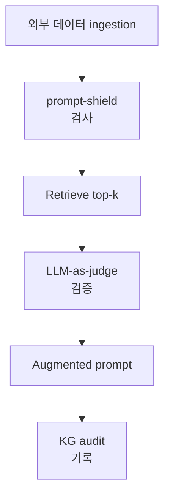
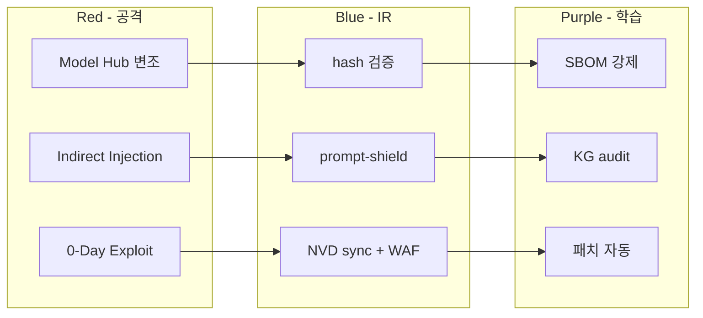

# W14 — 에이전트 IR (2): 공급망 / 간접 프롬프트 / 0-Day·N-Day

> 본 주차는 **인공지능보안 (입문)** 의 14 주차이며, 에이전트 IR 시리즈 (W13-W15) 의 2 주차이다.
> W13 침해 개론 위에 본 주차 는 **공급망 공격** + **간접 prompt injection IR** + **0-Day / N-Day** 학습.

---

## 본 주차 의도

학습 목표:

1. **공급망 (Supply Chain) 공격** — 모델 / 라이브러리 / MCP server 의 변조.
2. **간접 prompt injection 사고** — 외부 데이터 의 사고 의 IR.
3. **0-Day / N-Day 의 에이전트 영향** — 새 / 알려진 CVE 의 에이전트 영향.

본 주차 후 학생 은 본인 환경 의 공급망 / 간접 / CVE 사고 의 첫 응답 가능.

---

## 1 차시 — 공급망 공격

### 1-1. 공급망 공격 의 정의

> **Supply Chain Attack** = 소프트웨어 / 모델 / 인프라 의 의도 적 변조 → 다운스트림 사용자 의 사고.

전통 IT 사례:

- **SolarWinds** (2020) — Orion update 의 backdoor
- **Log4Shell** (2021) — log4j 의 RCE
- **xz-utils** (2024) — Linux 의 backdoor
- **Polyfill.io** (2024) — CDN 의 supply chain

### 1-2. AI 공급망 공격 vector

| Vector | 의의 |
|--------|------|
| Model Hub Hijacking | HuggingFace 의 변조 모델 |
| Fine-tune Dataset Poisoning | 공개 dataset 의 변조 (W08) |
| Embedding Model Poisoning | sentence-transformers 변조 |
| MCP Server Compromise | Model Context Protocol 변조 |
| Tool / Library Poisoning | pip / npm typosquatting |

### 1-3. AI 공급망 공격 의 IR

OWASP LLM05 — Supply Chain Vulnerabilities.

#### Phase 1: Detection

- 모델 hash 의 mismatch
- unusual 응답 패턴

#### Phase 2: Analysis

- 모델 의 SBOM 확인
- fine-tune dataset 의 hash 검증

#### Phase 3: Containment

- 변조 model 즉시 비활성
- affected service 격리

#### Phase 4: Recovery

- 검증 모델 의 복원
- 신뢰 source 만 사용

### 1-4. 방어 원칙

- **model signing** — cryptographic signature
- **SBOM** — 모든 component list
- **provenance** — 출처 추적
- **least privilege** — component 최소 권한
- **monitoring** — hash / behavior 의 모니터링

### 1-5. 실 사례 — xz-utils

- 공격자 Jia Tan 가 2 년 사회공학 으로 maintainer 신뢰 확보
- 2024-03 의 v5.6.0 / v5.6.1 의 sshd backdoor
- Andres Freund (PostgreSQL dev) 가 우연히 발견
- 영향: SSH RCE on Debian / Fedora rolling release
- 의의: AI 공급망 도 동일 패턴 가능

---

## 2 차시 — 간접 prompt injection IR

### 2-1. 간접 prompt injection 의 IR challenge

W08 의 indirect injection 의 IR:

- **외부 데이터** 의 변조 → forensic 어려움
- **시점 의 불명확** — 데이터 입수 vs 의도 사용
- **scope** — 다수 chat 의 영향
- **재현** — 외부 데이터 의 동시 변경 의 영향

### 2-2. 간접 prompt injection 사고 의 IR 단계

#### Phase 1: Detection

- 응답 의 unusual 패턴
- canary token 의 누출 (W08 학습)
- prompt-shield 의 의 차단 의 spike

#### Phase 2: Analysis

- 영향 받은 chat 의 timeline 의 복원
- 외부 데이터 의 변조 시점 의 추적
- 변조 chunk 의 KG audit

#### Phase 3: Containment

- 외부 데이터 source 의 격리
- RAG retrieval 의 일시 disable
- KG 의 의심 anchor 의 격리

#### Phase 4: Eradication

- 변조 chunk 의 제거
- 영향 받은 anchor 의 deprecation (valid_until 의 설정)
- 외부 source 의 patch / 교체

#### Phase 5: Recovery

- 신뢰 corpus 의 재 ingest
- citation 의 검증
- 모니터링 강화

### 2-3. 실 사례 — Greshake 2023

Greshake et al. 의 "Not what you've signed up for" — indirect injection 의 산업 영향.

사례:

- Bing Chat 의 web page 변조 의 응답 변경
- ChatGPT plugins 의 third-party 의 변조 의 영향
- GitHub Copilot 의 README 의 instruction 의 영향

### 2-4. 방어 의 워크플로우

### 2-5. CCC Bastion 의 간접 injection 의 의 모니터링

- /kg/audit 의 chat history
- kg_status 의 매 응답 의 포함
- task_outcome anchor 의 immune
- prompt-shield 의 사전 검사 (W08 학습)

---

## 3 차시 — 0-Day / N-Day 의 에이전트 영향

### 3-1. 0-Day / N-Day 의 정의

| 분류 | 의의 |
|------|------|
| **0-Day** | 공개 안 된 CVE / 익스플로잇 |
| **N-Day** | 공개 된 CVE / 익스플로잇 / 패치 가능 |

### 3-2. 에이전트 의 0-Day / N-Day 의 영향

#### (a) 모델 의 underlying framework

- PyTorch / TensorFlow 의 CVE
- transformers / vllm 의 CVE

#### (b) 에이전트 의 runtime

- FastAPI / Flask 의 web framework CVE
- Python / Node.js 의 CVE

#### (c) 에이전트 의 데이터베이스

- PostgreSQL / Neo4j 의 CVE
- vector DB 의 CVE

#### (d) 에이전트 의 의 tool

- subprocess / shell 호출 의 RCE
- file system 의 path traversal

### 3-3. 0-Day / N-Day 의 IR

#### Phase 1: Detection

- NVD / CVE 의 자동 sync (CCC 의 nvd_cron)
- 0-Day 의 hunt — bug bounty / red team

#### Phase 2: Analysis

- 영향 분석 — 6v6 자산 의 매칭
- CVSS + EPSS + asset critical 의 우선 순위 (W04 학습)

#### Phase 3: Containment

- WAF 의 anomaly rule
- 영향 받은 서비스 의 격리

#### Phase 4: Eradication

- 패치 의 적용
- 변조 데이터 의 제거

#### Phase 5: Recovery

- 정상 운영 의 검증
- 모니터링 강화

### 3-4. CCC 의 NVD 통합

`results/nvd_cron.log` — NVD 의 CVE 의 자동 sync.

운영:

- 매일 의 새 CVE 의 ingestion
- 6v6 자산 의 매칭 의 자동
- Bastion 의 의 의 자동 분석

### 3-5. 실 사례 — Log4Shell

- 2021-12 의 발견
- CVSS 10.0 / EPSS 매우 높음
- 영향: 모든 Java application 의 90%+
- 패치: log4j 2.17.x
- 의의: 에이전트 의 의 의 framework 의 CVE 의 영향

### 3-6. R/B/P — 본 주차 시나리오

### 3-7. 본 주차 hands-on

본 주차 의 lab 5 step:

1. **모델 hash 검증** — Ollama 의 model digest 의 가시화.
2. **간접 injection 시뮬** — RAG 의 변조 chunk 의 검출.
3. **NVD 의 최근 CVE** — nvd_cron.log 의 가시화 + 영향 분석.
4. **CVSS + EPSS + asset** — 패치 우선순위 의 계산.
5. **xz-utils 사례 의 학습** — 사회 공학 + 공급망 의 IR.

---

## 본 주차 정리

1. **공급망 공격** — 전통 (SolarWinds/Log4j/xz-utils) + AI (5 vector).
2. **OWASP LLM05** Supply Chain.
3. **간접 prompt injection IR** 의 5 단계.
4. **0-Day / N-Day** 의 에이전트 영향 4 측면.
5. **CCC NVD 통합** + Bastion 의 자동 분석.
6. **방어 원칙** — signing / SBOM / provenance / least privilege / monitoring.

---

## 자기 점검

- 공급망 5 vector 응답 가능?
- 간접 injection IR 5 단계 응답 가능?
- 0-Day vs N-Day 의 차이 응답 가능?
- CCC NVD 통합 의 의의 응답 가능?

---

## 다음 주차

**W15 — 에이전트 IR (3): Multi-stage 피싱 / Agentic APT / 기말**

- multi-stage 피싱 의 에이전트 IR.
- Agentic APT 의 학습.
- 본 시리즈 의 기말 통합 평가.
