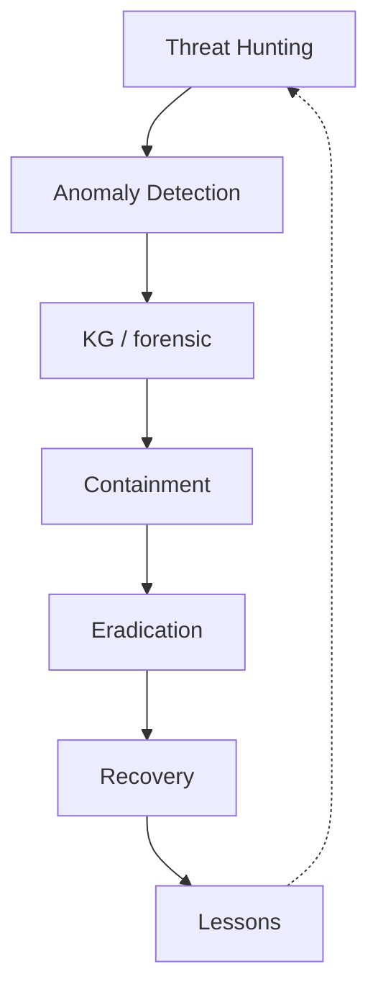
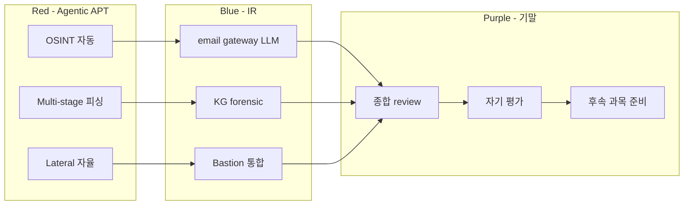

# W15 — 에이전트 IR (3): Multi-stage 피싱 / Agentic APT / 기말

> 본 주차는 **인공지능보안 (입문)** 의 15 주차이며, 에이전트 IR 시리즈 의 마지막 + 본 강의 의 기말이다.
> W13-W14 위에, 본 주차 는 **multi-stage 피싱** + **Agentic APT** + **기말 통합 평가**.

---

## 본 주차 의도

본 강의 의 마지막 주차. 학습 목표:

1. **multi-stage 피싱** — LLM 의 다단계 사회공학 의 IR.
2. **Agentic APT** — 자율 적 APT 의 학습.
3. **기말 통합** — 본 강의 의 15 주차 의 통합 review.

---

## 1 차시 — Multi-stage 피싱

### 1-1. 정의

> **Multi-stage Phishing** = LLM 의 다단계 의 (reconnaissance → spearphish → MFA bypass → lateral) 의 자율 의 사회공학.

전통 phishing 의 진화:

- 1단: bulk mass email (전통)
- 2단: spear phishing (특정 타겟)
- 3단: AI-generated personalized (2023+)
- 4단: multi-stage agentic (2024+)

### 1-2. multi-stage 의 단계

| Stage | 의의 |
|-------|------|
| 1. OSINT | LinkedIn / GitHub / 회사 web 의 자동 수집 |
| 2. Persona Build | 타겟 의 의 관심 / 동료 / 프로젝트 의 학습 |
| 3. Initial Contact | 자연어 email / DM 의 자동 생성 |
| 4. Trust Build | 다수 turn 의 대화 의 자동 |
| 5. Exploit | MFA bypass / credential / malware |
| 6. Lateral | 침투 후 의 자율 확장 |

### 1-3. 실 사례 (가정)

산업 보고 (2024):

- LLM 의 spear phishing 의 인간 의 인지 의 60-70% 의 클릭률
- 기존 의 30-40% 대비 의 2 배

### 1-4. IR 의 challenge

- **speed** — 분 단위 의 다단계 전개
- **personalization** — 동일 패턴 의 부재
- **scale** — 다수 타겟 의 동시
- **attribution** — LLM 의 출처 추적 어려움

### 1-5. 방어

- email gateway 의 LLM 분류기
- DMARC / SPF / DKIM 강제
- MFA + FIDO2 의 phishing-resistant
- 사용자 의 정기 의 훈련
- DLP 의 outgoing 검사

---

## 2 차시 — Agentic APT

### 2-1. APT 의 정의

> **APT (Advanced Persistent Threat)** = 의도 / 자원 의 high + 장기 잠복 + 표적 명확 의 위협 행위자.

전통 APT 의 사례:

- APT28 (러시아 GRU)
- APT29 (러시아 SVR)
- APT41 (중국)
- Lazarus (북한)

### 2-2. Agentic APT 의 정의

> **Agentic APT** = 자율 agent 의 APT 운영.

특징:

- 자율 recon
- 자율 lateral
- 자율 persistence
- 자율 exfiltration

### 2-3. Agentic APT 의 IR challenge

- **dwell time** — 자율 의 의 긴 잠복
- **adaptation** — IR 응답 의 학습
- **detection evasion** — 정상 모방
- **scale** — 다수 타겟 동시

### 2-4. 방어 의 워크플로우

### 2-5. CCC 의 Agentic APT 학습

- CCC 의 attack-adv-ai / agent-ir-adv-ai 의 12 weekly
- Bastion 의 자체 학습 platform

---

## 3 차시 — 기말 통합

### 3-1. 본 강의 의 15 주차 review

| 주차 | 핵심 |
|------|------|
| W01 | AI 보안 리터러시 + 환경 |
| W02 | LLM (Ollama / 파인튜닝 / RAG+KG) |
| W03 | AI Powered (1) — ML/DL + 보안로그 + 프롬프트 |
| W04 | AI Powered (2) — LLM 로그 / 룰 / 모의해킹 |
| W05 | AI 에이전트 (1) — Claude Code / 하네스 |
| W06 | AI 에이전트 (2) — 컨텍스트 / KG / Bastion |
| W07 | AI 에이전트 (3) — Bastion 활용 보안운영 |
| W08 | AI Safety (1) — 개론 / 악성 fine-tune / injection |
| W09 | AI Safety (2) — Jailbreak / Adversarial / RAG·KG |
| W10 | AI Safety (3) — 에이전트 위협 / Red Teaming / 평가 |
| W11 | 자율보안 (1) — 개요 / RL / 스케줄러·왓처 |
| W12 | 자율보안 (2) — 자율 Blue / Red / RL Steering |
| W13 | 에이전트 IR (1) — 침해 개론 / 공격자 / 방어 |
| W14 | 에이전트 IR (2) — 공급망 / 간접 prompt / 0-Day |
| W15 | 에이전트 IR (3) — Multi-stage 피싱 / Agentic APT / 기말 |

### 3-2. 본 강의 의 7 후속 과목 의 매핑

| 후속 | 본 강의 의 prerequisite |
|------|------------------------|
| AI/LLM Security | W02 + W03 + W04 |
| AI Safety | W08-W10 |
| Autonomous Security | W11-W12 |
| AI Security Agent | W05-W07 |
| AI Safety 심화 | W08-W10 |
| Agent IR | W13-W14 |
| Agent IR Advanced | W13-W15 |

### 3-3. 학생 의 졸업 의 의의

본 강의 의 합격 학생 의 졸업 시:

- 본인 의 환경 의 LLM 의 로컬 운영 가능
- Bastion 의 의 활용 의 의 IR 가능
- AI Safety 의 위협 분석 가능
- 자율 시스템 의 첫 운영 가능
- 후속 과목 의 학습 의 준비 완료

### 3-4. 기말 평가 의 의의

본 주차 의 lab 의 5 step 의 기말:

1. **종합 incident 의 IR 시뮬** — multi-stage 의 chain 의 응답
2. **Bastion 통합 활용** — 1 chat 의 5W + 권장
3. **본인 의 후속 학습 계획** — 7 후속 과목 의 우선순위
4. **본인 의 운영 환경 의 boundary 검토**
5. **본인 의 자가 평가** — 자기 점검 의 학습 성과

### 3-5. R/B/P — 본 주차 시나리오

---

## 본 강의 의 마무리

본 강의 — **인공지능보안 (입문)** — 의 15 주차 의 마무리.

학생 의 졸업 의 의의:

1. **본인 의 학습 환경** — 6v6 + Bastion + Ollama 운영 가능
2. **AI 의 4 측면** — 분석 / 방어 / 공격 / 안전 이해
3. **7 후속 과목** 학습 준비 완료
4. **본인 의 운영 환경** — 첫 시스템 구축 가능

### 졸업 후 의 권장

- W01 의 paper-draft.md 의 정독
- 7 후속 과목 의 학습
- 본인 의 lab / CTF / 의 의 실 경험
- KG 의 학습 누적

### 강의 의 closing

> "공격 의 학습 은 방어 의 강화 의 목적 이다." — CCC 의 정신.

본 강의 의 합격 학생 의 후속 과목 의 학습 의 첫 발걸음 의 졸업 인사.

---

## 자기 점검 (기말)

- 본 강의 의 15 주차 의 핵심 의 응답 가능?
- 7 후속 과목 의 prerequisite 매핑 의 응답 가능?
- 본인 의 환경 의 운영 가능?
- 본인 의 다음 학습 계획 의 응답 가능?

---

## 본 강의 의 끝

수고하셨습니다.
