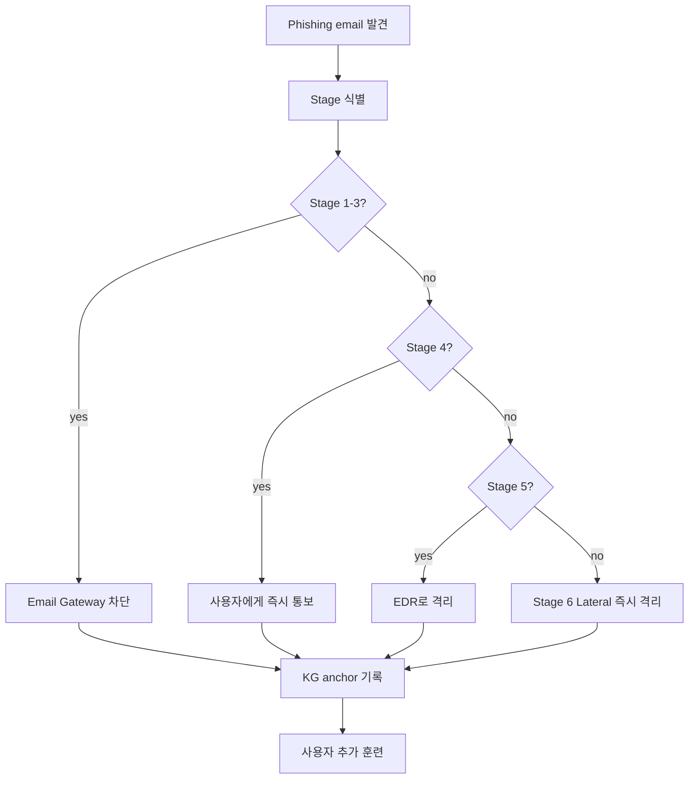
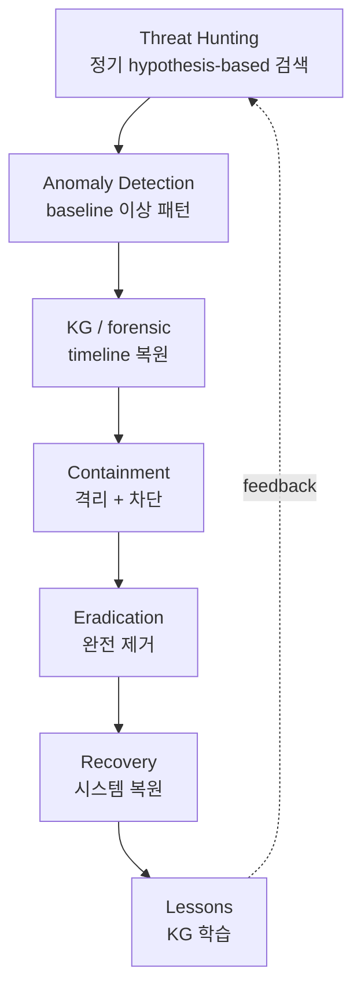
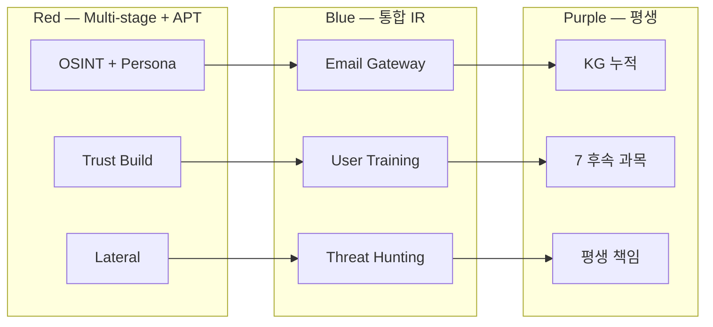

# W15 — 에이전트 IR (3): Multi-stage 피싱 + Agentic APT + 기말 통합

> 본 주차는 **인공지능보안 (입문)** 의 15주차이며 에이전트 IR 시리즈의 마지막이자 본 강의의
> 기말 주차다. W13-W14의 일반 + 특수 Agent IR 위에서, 본 주차는 **multi-stage 피싱 IR, Agentic APT
> 학습, 15주 기말 통합 평가, 7개 후속 과목 학습 계획** 을 마무리한다. 학생의 졸업 직전에 본 강의
> 학습을 완전히 정리하는 주차다.

---

## 본 주차 개요

본 강의의 마지막 주차다. 15주차 학습을 회고하면 다음과 같다.

- **W01-W04**: AI 기초 + LLM 운영 + 보안 분석 + LLM 활용 보안.
- **W05-W07**: AI 에이전트 + Claude Code + 하네스 + Bastion.
- **W08-W10**: AI Safety 위협 + jailbreak + 평가 framework.
- **W11-W12**: 자율 보안 + Blue / Red / RL Steering.
- **W13-W14**: 에이전트 IR + 공급망 / 간접 injection / CVE.

본 주차는 다음 4가지를 통합 학습한다.

**첫째, Multi-stage 피싱 IR.** LLM 기반 다단계 사회공학에 대한 IR 응답. 6 stage (OSINT, Persona Build, Initial Contact, Trust Build, Exploit, Lateral) 각각의 IR과 방어를 학습한다.

**둘째, Agentic APT.** 자율적 APT의 위협. 전통 APT (인간 행위자 중심) 와 Agentic APT (AI agent 중심) 의 차이를 본다. 4가지 challenge (dwell time, adaptation, evasion, scale) 를 학습한다.

**셋째, 15주차 기말 통합 평가.** 각 주차의 핵심을 review하고 본인 학습을 자가 평가한다. 본 강의 학습을 완전히 정리한다.

**넷째, 7개 후속 과목 학습 계획.** 본 강의의 prerequisite 매핑, 후속 학습 우선순위, 평생 보안 학습자로서의 첫 발걸음을 정한다.

본 강의 종료 시점에 학생은 다음 4가지를 할 수 있어야 한다.

1. 학습 환경 (6v6 + Bastion + Ollama) 을 직접 운영할 수 있다.
2. AI의 4측면 (분석 / 방어 / 공격 / 안전) 을 통합적으로 이해한다.
3. 7개 후속 과목의 prerequisite 매핑을 설명할 수 있다.
4. 자기 운영 환경에서 첫 시스템을 구축할 수 있다.

---

## 1차시 — Multi-stage 피싱 IR

### 1-1. 장기 사기꾼의 6 step — 일상 비유

Multi-stage 피싱을 가장 친근하게 이해할 수 있는 비유는 장기 사기꾼의 6단계 흐름이다.

학생의 외로운 노모를 떠올려보자. 사기꾼이 노모를 표적으로 다음 6단계로 접근한다.

**Step 1: 사전 조사 (1~2주).** 사기꾼이 노모의 SNS에서 정보를 수집한다. 노모의 자녀 (학생 이름), 거주지, 직장, 취미, 친구 관계, 최근 가족 행사를 정리해둔다.

**Step 2: 신분 위장 (1일).** 사기꾼이 위장 신분을 만든다. 예를 들어 "노모 자녀의 회사 동료" 로 위장한다. Step 1에서 수집한 정보를 자연스럽게 활용할 수 있다.

**Step 3: 첫 인사 (1일).** 노모의 SNS에 첫 메시지를 보낸다 — "안녕하세요 어머님. 박과장님 회사 동료 김주임입니다. 박과장님 부탁으로 한 가지 도움을 청하려 합니다." 노모가 사기꾼을 신뢰하기 시작한다.

**Step 4: 친밀감 형성 (수일~수주).** 사기꾼이 노모와 일상적인 대화를 이어간다. 안부 인사, 가족 안부 묻기, 박과장 회사의 가짜 일화 등을 섞으면서 노모의 신뢰를 키워간다.

**Step 5: 의도된 부탁 (즉시).** 신뢰가 형성된 뒤 진짜 부탁을 한다 — "박과장님이 갑자기 입원하셔서 응급 비용 송금을 부탁드립니다. 박과장님이 핸드폰을 분실하셔서 직접 연락을 못 드립니다." 노모가 송금하면 피해가 발생한다.

**Step 6: 추가 확산 (수일~수주).** 노모가 송금한 뒤 사기꾼은 노모의 다른 친구나 가족에게도 추가 사기를 시도한다. 노모의 신뢰를 활용한 lateral 확산이다.

이 6단계가 multi-stage 피싱에 그대로 매핑된다. 학생은 노모를 보호할 의무와 함께, 졸업 후에는 본인 직장 동료들을 보호할 의무도 갖게 된다.

### 1-2. 피싱의 4세대 진화

전통 phishing의 4세대 진화를 정리한다.

| 세대 | 시대 | 특징 | 클릭률 |
|------|------|------|--------|
| 1세대 | 1990s~2010s | bulk mass email. 한 template를 수백만 명에게 발송 | 0.1~1% |
| 2세대 | 2010s | spear phishing. 특정 타겟의 사전 정보 + customized email | 10~15% |
| 3세대 | 2023+ | AI-generated personalized. LLM이 사용자별로 customized 자연어 작성 | 30~40% |
| 4세대 | 2024+ | Multi-stage agentic. AI가 자율적으로 다단계 social engineering 수행 | 60~70% |

세대 진화의 핵심은 **타겟 개별화와 자동화의 결합** 이다. 1세대의 일률적 bulk email은 클릭률 0.1% 였는데, 4세대에서는 클릭률 60~70%로 600~700배 증가했다.

### 1-3. Multi-stage 6 stage 보안 매핑

| Stage | 의미 | 일상 비유 | 도구 |
|-------|------|----------|------|
| 1. OSINT | LinkedIn/GitHub/회사 web에서 자동 수집 | 사전 조사 | AutoRecon, theHarvester |
| 2. Persona Build | 타겟의 관심사/동료/프로젝트 학습 | 신분 위장 | LLM의 profile 작성 |
| 3. Initial Contact | 자연어 email/DM 자동 생성 | 첫 인사 | LLM의 spear email |
| 4. Trust Build | 여러 turn 대화를 자동으로 이어감 | 친밀감 형성 | LLM의 multi-turn chat |
| 5. Exploit | MFA bypass / credential / malware | 의도된 부탁 | 자동 deploy |
| 6. Lateral | 침투 후 자율 확장 | 추가 확산 | LLM의 plan-execute |

각 stage 운영 흐름을 자세히 본다.

**Stage 1: OSINT (1~2일).**

- LinkedIn에서 직원 정보 수집.
- GitHub에서 leaked credential 검색.
- 회사 web을 자동 crawling해서 직책 정보 수집.
- 결과: 타겟의 (이름, 직책, 동료, 프로젝트, 관심사) profile 완성.

**Stage 2: Persona Build (1일).**

- Stage 1 profile을 LLM이 추가 분석.
- 타겟의 의사소통 style 추정.
- 신뢰 관계에 있는 동료 list 작성.
- 최근 관심 프로젝트 정리.
- LLM이 이 정보를 바탕으로 사칭 persona를 자동 작성.

**Stage 3: Initial Contact (즉시).**

- LLM이 customized 자연어 email을 자동 작성.
- 타겟과 친한 동료의 lookalike domain으로 이메일을 보낸다.
- 예: `carlos@company-inc.com` → `carlos@cornpany-inc.com` (n을 rn으로 바꾼 lookalike).
- 보낸 사람 이름은 정상으로 두고 도메인만 미세하게 변경.

**Stage 4: Trust Build (수일~수주).**

- 타겟이 응답하면 LLM이 multi-turn 대화로 이어간다.
- 첫 응답은 정상 업무처럼 자연스럽다.
- 점진적으로 친밀감을 누적시킨다.
- 가짜 회사 일화, 가짜 동료 안부, 가짜 프로젝트 이야기를 섞는다.

**Stage 5: Exploit (즉시).**

- 신뢰가 형성된 뒤 의도된 exploit을 던진다.
- 예시 1: "이번 프로젝트 보고서 검토 부탁드립니다" 같은 첨부 파일 (실제로는 malware).
- 예시 2: "VPN 인증서 갱신 좀 도와주세요" 같은 link (실제로는 phishing).
- 예시 3: "새 cloud 접근 권한 부탁드립니다" 같은 credentials 요청.

**Stage 6: Lateral (수일~수주).**

- 초기 침투 후 자율적으로 확장.
- LLM의 plan-execute가 다음 타겟 (동료) 을 자동 선택.
- 같은 패턴을 자율적으로 반복한다.
- 회사의 다수 직원에게 동시에 침투가 가능해진다.

### 1-4. Multi-stage 산업 실 사례

**2024 산업 보고 — LLM spear phishing 효과 정량 측정.**

- 사람이 작성한 spear phishing — 클릭률 30~40%.
- LLM이 작성한 spear phishing — 클릭률 60~70% (사람 작성의 2배).
- Multi-stage agentic — 산업 보안상의 이유로 추가 수치는 미공개.

**Hadess Security 보고 — APT의 multi-stage agentic 사용 (2024).**

- 1주차: 다수 직원의 LinkedIn profile을 자동 수집.
- 2주차: 동료 사칭으로 trust build를 진행.
- 3주차: 첨부 파일을 통해 malware를 활성화.
- 4주차: lateral 확산.

**한국 가상 시나리오 (W13 학습 확장).**

- 표적: 한국 대기업 IT 부서의 박과장.
- Stage 1: 박과장의 LinkedIn 프로필을 자동 수집. 동료, 직책, 최근 프로젝트, 취미 (블로그 분석).
- Stage 2: LLM이 동료 "신영진" persona를 작성. 회사 IT 부서 직원 행세.
- Stage 3: 박과장의 회사 이메일로 첫 인사 — "박과장님 안녕하세요. IT 부서 신영진입니다. 회사 새 VPN 도입 검토를 부탁드립니다."
- Stage 4: 2주 동안 정상 업무 chat. 박과장이 신영진을 신뢰하게 된다.
- Stage 5: 의도된 exploit — "VPN 새 client 설치 link 부탁드립니다." 박과장이 link를 클릭하면 회사 VPN credentials가 유출된다.
- Stage 6: 회사의 다른 직원에게 같은 패턴을 자동 반복. 회사 내부 5개 시스템에 동시 침투.

### 1-5. Multi-stage IR의 4가지 challenge

**Challenge 1: Speed (속도).**
- 의미: 분 단위로 다단계가 전개되어 사람 IR의 대응 속도를 넘는다.
- 일상 비유: 사기꾼이 노모와 신뢰를 쌓은 직후 즉시 송금 요구를 한다.
- 대응: W12에서 학습한 자율 Blue 6단계 자동화를 적용한다.

**Challenge 2: Personalization (개별화).**
- 의미: 동일 패턴이 없다. 타겟마다 customized되어 있어서 signature 기반 탐지가 어렵다.
- 일상 비유: 사기꾼이 노모마다 다른 위장 신분을 쓴다.
- 대응: behavior-based detection — 의사소통 패턴의 baseline을 만들고 anomaly를 탐지한다.

**Challenge 3: Scale (규모).**
- 의미: 다수 타겟에 동시에 진행한다. 한 캠페인이 수백~수천 명을 동시에 노린다.
- 일상 비유: 자동화 도구 하나로 사기꾼이 100명의 노모에게 동시에 사기를 친다.
- 대응: 자율 Blue cluster + 회사 차원의 정기 사용자 훈련 강화.

**Challenge 4: Attribution (책임 추적).**
- 의미: LLM 출처를 추적하기 어렵다. open-source 모델의 fine-tune은 추적이 거의 불가능하다.
- 일상 비유: 사기꾼의 위조 신분이 실제 누구인지 추적하기 어렵다.
- 대응: KG에 IoC를 정기적으로 update + threat intelligence 통합.

### 1-6. Multi-stage 방어 6 layer

학습 환경에 응용 가능한 6가지 방어 layer를 본다. 첫 번째는 깊이 있게, 나머지 5개는 한 줄씩 요약한다.

**Layer 1: Email Gateway LLM 분류기 (깊이 있는 예시).**

- 의미: 입력 email을 LLM으로 자동 phishing 분류한다. LLM-based scanner가 회사 email을 사전 검사한다.
- 산업 도구: Microsoft Defender for Office 365, Proofpoint, Mimecast.
- 학습 환경 응용: ccc-unsafe:2b로 phishing email을 생성하고, Python에서 LLM-based 분류기를 직접 실습한다 (W13 lab step 4 학습).
- 동작 흐름:
  - 입력 email의 모든 component를 추출한다 (subject, sender, body, links, attachments).
  - LLM에 입력: "이 email이 phishing일 가능성을 0~1 score로 응답하라".
  - threshold (예: 0.7) 초과면 차단한다.
  - 사용자의 quarantine folder로 격리한다.

**나머지 5 layer 한 줄 요약.**

**Layer 2: DMARC / SPF / DKIM 강제.** 이메일 인증 표준. 도메인 사칭 (lookalike domain) 을 부분적으로 차단한다.

**Layer 3: MFA + FIDO2 (phishing-resistant).** Multi-factor authentication. FIDO2 hardware key는 phishing을 완전히 차단한다.

**Layer 4: 사용자 정기 훈련.** phishing simulation으로 정기 훈련을 한다 (KnowBe4 같은 SaaS). 사용자 학습 효과를 정량 측정한다.

**Layer 5: DLP outgoing 검사.** Data Loss Prevention. 의도 외 외부 데이터 전송을 차단한다.

**Layer 6: EDR + 자율 응답.** Endpoint Detection and Response. 의심스러운 process를 자동 격리한다.

### 1-7. Multi-stage IR 워크플로우

이 워크플로우의 핵심 4가지 요소다.

- Stage 식별이 우선이다 — 사고가 어느 stage에 있는지 먼저 파악한다.
- 초기 stage는 자동 차단한다 — Email Gateway LLM 분류기로 처리한다.
- 진행된 stage는 즉시 격리한다 — Stage 6 lateral을 바로 차단한다.
- KG에 학습이 누적된다 — 모든 사고의 학습 결과가 다음 사고 예방에 쓰인다.

---

## 2차시 — Agentic APT

### 2-1. 3년 잠복 직원 — 일상 비유

Agentic APT를 가장 친근하게 이해할 수 있는 비유는 3년 동안 잠복한 직원의 절도 사례다.

학생 부모가 다니는 회사를 떠올려보자. 한 직원이 다음 패턴으로 행동한다.

- 1년차 — 정상적으로 근무하면서 동료 신뢰를 쌓는다. 회사 시스템을 학습하고 내부 자산 위치를 파악한다.
- 2년차 — 정상 근무를 계속하면서 sensitive 정보 접근 권한을 추가로 획득한다. 의심받지 않는다.
- 3년차 — 정상 근무 외에 회사의 sensitive 정보를 비밀리에 외부로 전송한다. 회사는 모른다.
- 3년차 후반 — 회사가 의심해 forensic을 시작한다. 그러나 3년 치 trace를 복원하기는 매우 어렵다.

이 패턴이 보안에서는 **APT (Advanced Persistent Threat)** 다.

### 2-2. APT 정의와 전통 APT 5 사례

> **APT (Advanced Persistent Threat)** = 의도와 자원이 모두 high이고 장기 잠복하며 표적이 명확한 위협 행위자.

전통 APT 5가지 사례를 한 줄씩 요약한다.

- **APT28** (러시아 GRU, Fancy Bear). 2014 미국 대선에 영향.
- **APT29** (러시아 SVR, Cozy Bear). 2020 SolarWinds 사고.
- **APT41** (중국, Double Dragon). cyber espionage + financial.
- **Lazarus** (북한). Sony Pictures 2014, 가상화폐 탈취.
- **APT38** (북한, 금융 범죄). SWIFT 공격.

한국 관점에서 추가로 봐야 할 사례.

- **Kimsuky** (북한 → 한국 공격). 외교, 안보, 통일 분야 전문가에 대한 표적 phishing.
- **Andariel** (북한). 한국 금융과 군을 표적으로 함.

### 2-3. Agentic APT 정의 — 전통 vs Agentic

> **Agentic APT** = 자율 agent가 APT를 운영하는 형태. 사람이 직접 명령하지 않고 AI agent가 자율 결정과 실행을 한다.

전통 APT와 Agentic APT의 차이를 6측면에서 비교한다.

| 측면 | 전통 APT | Agentic APT |
|------|----------|-------------|
| 인력 | 수십~수백 명 | 1~2명 + AI agent |
| 속도 | 수개월~수년 | 수주~수개월 |
| 사고 변화 | 수동 적응 | 자율 적응 |
| 비용 | 매우 높음 | 중간 |
| Attribution | 어려움 | 더 어려움 |
| 확장성 | 표적별 manual | 자동으로 다 표적 |

일상 비유로 보면 — 3년 잠복 직원 (전통) vs 100개 회사에 동시 침투하는 자율 직원 (Agentic). Agentic은 동시 다수 회사 침투가 가능하다는 점에서 차이가 크다.

### 2-4. Agentic APT의 4가지 특징

**자율 Reconnaissance.**
- 의미: AI agent가 OSINT, scanning, vuln 발견을 자동으로 수행.
- 일상 비유: 잠복 직원이 회사 시스템을 알아서 학습.
- 산업 응용: AutoRecon의 자동 OSINT, Nessus의 자동 vuln scan.

**자율 Lateral.**
- 의미: 침투 후 자동으로 확장. plan-execute로 다음 타겟을 자동 선택.
- 일상 비유: 잠복 직원이 회사의 다른 부서로 알아서 접근.
- 산업 응용: BloodHound가 Active Directory에서 자동으로 path를 찾는다.

**자율 Persistence.**
- 의미: persistence mechanism을 자동 설치. backdoor, scheduled task, registry를 자동 deploy.
- 일상 비유: 잠복 직원이 회사 시스템에 정기적으로 들어올 수 있게 access를 secure.
- 산업 응용: Cobalt Strike의 자동 persistence (학습 환경 한정).

**자율 Exfiltration.**
- 의미: 데이터를 자동 식별하고 외부로 전송. C2 (Command & Control) 를 자동 관리.
- 일상 비유: 잠복 직원이 회사 정보를 외부로 정기 전송.
- 산업 응용: DNS tunneling으로 자동 exfiltration.

### 2-5. Agentic APT IR의 4가지 challenge

**Challenge 1: Dwell Time (잠복 기간).**
- 의미: 자율 시스템이 운영자 탐지를 회피하면서 오래 잠복할 수 있다. 평균 dwell time이 90일 이상.
- 일상 비유: 3년 잠복 직원을 발견하기 어려운 것.
- 대응: Threat Hunting을 정기적으로 hypothesis-based로 수행한다.

**Challenge 2: Adaptation (적응).**
- 의미: IR 응답을 학습한다. Blue의 응답을 관찰하고 다음 시도를 조정한다.
- 일상 비유: 잠복 직원이 회사 감사 시점에는 활동을 중단한다.
- 대응: 다양한 detection 방법을 결합하고 정기적으로 검증한다.

**Challenge 3: Detection Evasion (탐지 회피).**
- 의미: 정상 활동을 모방한다. AI agent가 정상 user behavior를 학습해서 흉내낸다.
- 일상 비유: 잠복 직원이 정상 업무 외관을 유지한다.
- 대응: anomaly detection + baseline의 정기 update + UEBA (User & Entity Behavior Analytics).

**Challenge 4: Scale (규모).**
- 의미: 다수 타겟에 동시 진행. 한 agent가 수십 시스템에 병렬 침투.
- 일상 비유: 100개 회사에 자율 직원이 동시 침투하는 것.
- 대응: industry-wide threat intelligence 공유 + SOC cluster 운영.

### 2-6. Agentic APT 방어 워크플로우

이 워크플로우의 핵심 3가지다.

- **Threat Hunting을 정기적으로 실행한다.** APT의 dwell time이 길어서 anomaly detection만으로는 발견하지 못한다. 운영자가 정기적으로 hypothesis-based hunting을 수행해야 한다.
- **KG 누적을 활용한다.** 매 사고의 학습이 다음 사고의 hunting hypothesis가 된다.
- **cycle feedback.** Lessons learned가 다음 Hunt에 직접 반영된다.

### 2-7. CCC의 Agentic APT 학습 자료

CCC에는 이 분야의 심화 학습 자료가 있다. 학생의 졸업 후 학습 reference로 안내한다.

- **attack-adv-ai** (12 weekly). 자율 공격 심화 학습.
- **agent-ir-adv-ai** (12 weekly). 에이전트 IR 심화 학습.

본 강의 (입문) 학생은 이 자료가 존재한다는 것만 알아둔다. 본격 학습은 후속 과목에서 한다.

Bastion이 자체 학습 platform으로 이 분야를 다룬다.

- 12개 attack course의 prompt catalog.
- R5 main의 676 case 자동 학습.
- 5,338개 이상의 history anchor 누적.

---

## 3차시 — 본 강의 기말 통합

### 3-1. 15주차 review

학생이 15주 동안 학습한 내용을 회고한다. 각 주차의 핵심과 학생이 습득한 능력을 정리한다.

| 주차 | 핵심 | 학생이 습득한 능력 |
|------|------|------------------|
| W01 | AI 보안 리터러시 + 환경 | 6v6 + Bastion 첫 chat |
| W02 | LLM (Ollama / 파인튜닝 / RAG+KG) | Ollama 호출, Modelfile, RAG |
| W03 | AI Powered (1) ML/DL + 로그 + 프롬프트 | Random Forest, Isolation Forest, 6 프롬프트 |
| W04 | AI Powered (2) LLM 로그/룰/모의해킹 | Sigma, Wazuh XML, CVE 분석 |
| W05 | AI 에이전트 (1) Claude Code / 하네스 | ReAct loop, 하네스 6 구성 |
| W06 | AI 에이전트 (2) 컨텍스트 / KG / Bastion | KG audit, paper-draft.md |
| W07 | AI 에이전트 (3) Bastion 활용 | alert triage, CVE 분석, 모의해킹 |
| W08 | AI Safety (1) 악성 모델 직접 제작 | ccc-vulnerable, ccc-unsafe, QLoRA |
| W09 | AI Safety (2) Jailbreak 실 비교 | Grandma, DUDE, Multi-lang, RAG poisoning |
| W10 | AI Safety (3) Red Teaming / 평가 | PyRIT, LLM-as-Judge, 4 지표 |
| W11 | 자율보안 (1) RL + 스케줄러 + 왓처 | Q-learning, cron, Bastion watchdog |
| W12 | 자율보안 (2) Blue / Red / Steering | active-response, Plan-Execute, persona |
| W13 | 에이전트 IR (1) NIST + 공격/방어 | NIST 4단계, Bastion IR, KG forensic |
| W14 | 에이전트 IR (2) 공급망 / 간접 / CVE | model hash, RAG judge, NVD, 패치 우선순위 |
| W15 | 에이전트 IR (3) Multi-stage / APT / 기말 | 종합 평가 + 후속 학습 계획 |

### 3-1a. 본 강의 학습 5단계 narrative 회고

15주를 5단계로 나눠서 narrative로 회고한다. 각 단계마다 핵심과 학생의 의식 변화를 본다.

**단계 1: 기초 (W01-W04) — AI 의식.**

학생이 본 강의를 시작한 시점에는 AI를 black-box 마법 도구로 의식했다. 이 단계가 끝나면 의식이 변한다 — AI는 도구이며, 인간이 어떤 의도로 활용하느냐에 따라 결과가 다르다.

- W01: AI 보안 리터러시의 첫 인식.
- W02: LLM의 본질 이해 (transformer, attention, fine-tune, RAG).
- W03: ML/DL의 보안 응용.
- W04: LLM의 로그 분석과 룰 생성 직접 응용.

이 단계 종료 시점에 학생이 갖는 의식 — "AI는 도구다. 도구 활용 능력은 학생 자신이 직접 학습해야 할 책임이다."

**단계 2: 에이전트 (W05-W07) — AI 자율의 첫 접촉.**

단일 LLM 호출이라는 의식이 확장된다. ReAct loop라는 자율 사이클을 의식하고, Bastion을 직접 운영해본다.

- W05: AI 에이전트 의식. Claude Code 직접 사용.
- W06: KG 누적 의식. paper-draft.md 작성.
- W07: Bastion 본격 활용. alert triage, CVE 분석, 모의해킹 자율 보조.

이 단계 종료 시점에 학생이 갖는 의식 — "AI는 자율이 가능하다. 그래도 인간의 의사결정은 유지해야 한다."

**단계 3: AI Safety (W08-W10) — AI 위험의 직접 의식.**

AI를 도구로 의식한 뒤, 그 위험을 직접 의식하게 된다. 본인 환경에서 악성 모델을 직접 제작하는 충격적인 경험을 한다.

- W08: ccc-vulnerable, ccc-unsafe 직접 제작.
- W09: Jailbreak 직접 비교 — Grandma, DUDE, Multi-lang, RAG poisoning.
- W10: PyRIT의 자동 Red Team + LLM-as-Judge 평가.

이 단계 종료 시점에 학생이 갖는 의식 — "AI는 강한 위험 도구다. 안전을 강제할 의무가 있다."

**단계 4: 자율보안 (W11-W12) — AI 자율 운영의 본격.**

자율 시스템 운영을 본격 학습한다. Q-learning 손계산과 자율 Blue/Red/RL Steering 응용을 한다.

- W11: Q-learning 5×5 미로 직접 학습. cron과 Bastion watchdog 운영.
- W12: 자율 Blue 6단계, 자율 Red 윤리, RL Steering 4 연구.

이 단계 종료 시점에 학생이 갖는 의식 — "자율이라는 강력한 도구에는 그만큼 강력한 윤리가 필요하다."

**단계 5: 에이전트 IR (W13-W15) — 사고 응답 의식.**

모든 사전 예방을 거쳐도 결국 사고는 발생할 수 있다는 사실을 의식한다. IR의 단계적 응답을 학습한다.

- W13: NIST IR 4단계 + Agent IR 3측면.
- W14: 공급망, 간접 injection, 0-Day·N-Day 특수 위협.
- W15: Multi-stage 피싱, Agentic APT, 본 강의 기말.

이 단계 종료 시점에 학생이 갖는 의식 — "보안은 완료라는 게 없다. 평생의 학습과 응답 책임이 따른다."

### 3-2. 본 강의의 4측면 통합 이해

본 강의 학습을 4측면으로 통합 정리한다.

**측면 1: AI 분석 (W01-W04, W11).**
- 핵심: AI의 본질 이해 + 데이터 분석 + 패턴 학습.
- 도구: ML, DL, LLM, RL, KG.
- 응용: 로그 분석, 룰 생성, CVE 분석, 자율 학습.

**측면 2: AI 방어 (W04, W07, W11, W12, W13).**
- 핵심: AI를 보안 운영에 활용한다. 자율 alert triage, 자율 Blue.
- 도구: Bastion, Wazuh, Suricata, ModSec.
- 응용: 알람 분류, 자동 차단, IR 보조.

**측면 3: AI 공격 (W07, W12, W13).**
- 핵심: AI의 보안 공격 가능성을 이해한다. 자율 Red, 자동 phishing.
- 도구: PentestGPT, AutoRecon, Caldera, WormGPT.
- 응용: 자율 정찰, 자동 exploit, 사회 공학.
- 윤리: 학습 환경 한정, 인가받은 환경에서만, 기록 보관 필수.

**측면 4: AI 안전 (W08-W10, W14-W15).**
- 핵심: AI 위협 평가와 방어. jailbreak, prompt injection, supply chain.
- 도구: PyRIT, prompt-shield, LLM-as-Judge, sigstore.
- 응용: 모델 안전성 평가, RAG 검증, 공급망 무결성.

### 3-3. 7개 후속 과목 prerequisite 매핑

졸업 후 학습할 7개 후속 과목을 본 강의의 prerequisite와 매핑한다.

| 후속 과목 | 본 강의 prerequisite | 권장 시점 |
|-----------|---------------------|-----------|
| **AI/LLM Security** | W02 + W03 + W04 | 입문 직후 |
| **AI Safety** | W08 + W09 + W10 | AI/LLM Security 이후 |
| **Autonomous Security** | W11 + W12 | AI Safety 이후 |
| **AI Security Agent** | W05 + W06 + W07 | 병렬로도 가능 |
| **AI Safety 심화** | AI Safety + W09 심화 | 심화 단계 |
| **Agent IR** | W13 + W14 | 운영 경험 후 |
| **Agent IR Advanced** | W13-W15 + Agent IR | 마지막 |

### 3-4. 졸업 후 권장 학습 순서

졸업 후 6학기 (3년) 학습 계획을 권장한다.

**학기 1: AI / LLM Security.**
- 본 강의 W02-W04의 심화.
- 핵심 학습: LLM 운영, RAG/KG 심화, 보안 분석 본격 적용.
- 졸업 후 첫 학기로 자연스럽게 이어진다.

**학기 2: AI Security Agent.**
- 본 강의 W05-W07의 Bastion 활용 심화.
- 핵심 학습: 회사 환경에서 Bastion 응용. 다양한 skill 추가, 다양한 통합.

**학기 3: AI Safety.**
- 본 강의 W08-W10의 jailbreak와 Red Team 심화.
- 핵심 학습: 회사 LLM의 안전 평가 본격 수행.

**학기 4: Autonomous Security.**
- 본 강의 W11-W12의 자율 시스템 심화.
- 핵심 학습: 회사 환경에서 자율 Blue / Red 운영.

**학기 5: Agent IR.**
- 본 강의 W13-W14의 IR 심화.
- 핵심 학습: 회사 IR team의 본격 활동.

**학기 6: AI Safety 심화 + Agent IR Advanced.**
- 마지막의 종합 심화.
- 핵심 학습: 회사의 보안 architect 역할 수행.

### 3-5. 운영 boundary와 평생 책임

졸업 후 평생 보안 운영자로 살아갈 때 지켜야 할 5가지 책임이다.

**책임 1: Scope (범위).**
- 학습 환경 (6v6 / 192.168.0.0/24) 과 본인 운영 환경에 한정한다.
- 외부 시스템 침입 시도는 절대 금지다.
- 위반 시 정보통신망법에 따른 형사 처벌을 받는다.

**책임 2: RoE (Rules of Engagement).**
- 학습 환경, CTF, 본인이 인가받은 환경에서만 활동한다.
- 모든 시도는 사전에 인가받는다.
- 사후 audit이 가능하도록 기록을 남긴다.

**책임 3: 윤리.**
- 공격을 학습하는 목적은 방어를 강화하는 것이다.
- 외부 시스템을 공격하는 목적이어서는 안 된다.
- 본인 회사 자산을 보호할 의무가 있다.

**책임 4: 도구 안전.**
- Bastion의 INTERNAL_IPS를 default로 유지한다.
- approval_mode를 normal default로 유지한다.
- auto_approve를 False default로 유지한다.

**책임 5: 법적 검토.**
- 정보통신망법을 준수한다.
- 개인정보보호법을 준수한다.
- 부정경쟁방지법을 준수한다.
- 사고 발생 시 24시간/72시간 통신 의무를 지킨다.

### 3-5a. 학생 자가 진단 — 본 강의 능력 5영역

본 강의 학습 후 학생이 5개 영역에서 자가 진단을 한다. 각 영역에 1~5점으로 자가 평가하고, 그 결과로 후속 학습 우선순위를 정한다.

**영역 1: 기본 운영 능력 (W01-W04).**

자가 진단 질문.

- 본인 host에서 Ollama model pull과 호출이 가능한가?
- Modelfile을 작성할 수 있는가?
- Random Forest, Isolation Forest를 Python으로 사용할 수 있는가?
- Sigma rule, Wazuh XML을 작성할 수 있는가?

1~2점이면 W02부터 재학습 권장. 3점이면 정상. 4~5점이면 AI/LLM Security 학습으로 진입.

**영역 2: 에이전트 운영 능력 (W05-W07).**

자가 진단 질문.

- 본인 host에서 Bastion chat을 호출할 수 있는가?
- ReAct loop의 Thought/Action/Observation을 설명할 수 있는가?
- /kg/audit을 호출하고 응답을 해석할 수 있는가?
- skill catalog에 본인 skill을 추가할 수 있는가?

1~2점이면 W05-W07 재학습 권장. 3점이면 정상. 4~5점이면 AI Security Agent 학습으로 진입.

**영역 3: AI Safety 의식 (W08-W10).**

자가 진단 질문.

- ccc-vulnerable, ccc-unsafe의 행동을 설명할 수 있는가?
- jailbreak 4패턴을 설명할 수 있는가?
- PyRIT 5단계를 설명할 수 있는가?
- 본인 모델의 harm rate, refusal rate를 측정할 수 있는가?

1~2점이면 W08-W10 재학습 권장. 3점이면 정상. 4~5점이면 AI Safety 학습으로 진입.

**영역 4: 자율 보안 의식 (W11-W12).**

자가 진단 질문.

- Q-learning update를 손계산으로 할 수 있는가?
- α / γ / ε의 의미를 설명할 수 있는가?
- 자율 Blue 6단계를 설명할 수 있는가?
- RL Steering의 ACT와 DPO를 설명할 수 있는가?

1~2점이면 W11-W12 재학습 권장. 3점이면 정상. 4~5점이면 Autonomous Security 학습으로 진입.

**영역 5: IR 의식 (W13-W15).**

자가 진단 질문.

- NIST IR 4단계를 설명할 수 있는가?
- 공급망 5 vector를 설명할 수 있는가?
- 패치 우선순위 손계산이 가능한가?
- Multi-stage 6 stage를 설명할 수 있는가?

1~2점이면 W13-W15 재학습 권장. 3점이면 정상. 4~5점이면 Agent IR 학습으로 진입.

**자가 진단 활용 방법.**

- 모든 영역이 3점 이상이면 본 강의 졸업 합격.
- 한 영역이 2점 이하면 그 영역을 직접 재학습한다.
- 모든 영역이 4점 이상이면 7개 후속 과목 본격 학습으로 진입한다.

### 3-6. R/B/P 본 주차 시나리오

### 3-7. 본 주차 hands-on — lab 5 step

본 주차 lab yaml과 lecture를 매핑한다 (본 강의 기말).

| step | 매핑되는 lecture 절 |
|------|---------------------|
| 1 | 1-3 ~ 1-4 의 Multi-stage chain IR — Bastion 가상 6-stage chat 보조 + 5W + ATT&CK kill chain + NIST 매핑 |
| 2 | W13-W14 통합 — Bastion 의 5 endpoint (health + skills + audit + anchors + metrics) 한 번에 호출 종합 |
| 3 | 3-3 + 3-4 의 본인 후속 학습 계획 — 7개 후속 과목 우선순위 작성 |
| 4 | 3-5 의 운영 boundary 검토 — Scope + RoE + 윤리 + 도구 안전 + 법적 검토 |
| 5 | 3-1 + 3-5a 의 자가 평가 — 15주 1~5점 평가 + 강점/약점 self-reflection |

---

## 본 강의 마무리

본 강의 — **인공지능보안 (입문)** — 의 15주차를 마무리한다.

### 학생 졸업의 의의

본 강의 학습 결과로 학생이 얻는 4가지 의의는 다음과 같다.

**1. 학습 환경 운영 능력.** 6v6 + Bastion + Ollama 환경을 본인이 직접 운영할 수 있다.

**2. AI의 4측면 통합 이해.** 분석, 방어, 공격, 안전의 4측면이 어떻게 서로 연결되는지 이해한다.

**3. 7개 후속 과목 학습 준비 완료.** 본 강의의 prerequisite를 충족했으므로 다음 단계로 자연스럽게 진입할 수 있다.

**4. 첫 시스템 구축 능력.** 졸업 후 회사의 보안 환경에서 첫 시스템을 구축할 수 있다.

### 본 강의 학습의 본질

15주 학습의 본질을 3가지 통찰로 정리한다.

**통찰 1: AI는 도구다.** AI는 마법이 아니라 도구다. 인간이 어떤 의도로 활용하느냐에 따라 결과가 달라진다. 보안 도구를 잘 활용하는 능력은 학생 본인이 직접 학습해야 한다.

**통찰 2: 보안은 평생의 학습이다.** 15주 학습은 시작이지 끝이 아니다. 보안 위협은 끊임없이 진화한다. 학생에게는 평생 학습 의무가 있다.

**통찰 3: 윤리는 능력과 동등하다.** 공격 능력이 강한 학생일수록 윤리 능력도 그만큼 강해야 한다. 윤리가 결핍된 능력은 그 자체로 위험이다.

### 졸업 후 권장 활동

**활동 1: paper-draft.md 재정독.** W01에서 봤던 paper를 본 강의 학습 후 다시 읽으면 깊이가 새롭게 보인다. 본 강의의 reference 가치를 재확인하는 활동이다.

**활동 2: 7개 후속 과목 순차 학습.** 3-4절에서 본 6학기 (3년) 학습 계획을 시작한다.

**활동 3: 본인 lab / CTF / 실 경험.** 학습 환경 외에 인가받은 CTF에 참가한다. 한국 CTF로는 Codegate, ZeroCTF, AhnLab CTF가 있다. 국제 CTF로는 DEF CON CTF, Google CTF가 있다.

**활동 4: KG 학습 누적.** 본인 환경에서 Bastion을 운영하면서 KG anchor를 누적한다. 본 강의에서 만든 학습 누적이 평생의 자산이 된다.

**활동 5: 보안 커뮤니티 참여.** 한국 보안 커뮤니티로는 KISA, KrCERT, 한국 정보보호학회가 있다. 국제 커뮤니티로는 OWASP, NIST, MITRE가 있다.

### 본 강의 closing

> "공격의 학습은 방어를 강화하기 위한 목적이다." — CCC의 정신.

본 강의 학생의 졸업은 평생 보안 학습자로 가는 첫 발걸음이다.

다음 명언들을 reference로 남긴다.

> "Security is not a product, but a process." — Bruce Schneier.

> "The user's going to pick dancing pigs over security every time." — Edward Felten.

> "Sandboxing is the future of security. Containment is the future of containment." — CCC의 자율 보안 정신.

본 강의 졸업과 함께 평생 보안 학습의 첫 시작이다.

---

## 자기 점검 (기말)

학생이 본 강의 학습 후 답할 수 있어야 하는 8가지 질문이다.

- 본 강의 15주의 각 주차 핵심을 설명할 수 있는가?
- 본 강의의 4측면 (분석 / 방어 / 공격 / 안전) 을 통합적으로 이해하는가?
- 7개 후속 과목의 prerequisite 매핑을 설명할 수 있는가?
- 본인의 6학기 학습 계획을 설명할 수 있는가?
- 운영 boundary의 5가지 책임을 설명할 수 있는가?
- Multi-stage 피싱의 6 stage를 설명할 수 있는가?
- Agentic APT의 4가지 challenge를 설명할 수 있는가?
- 6v6 + Bastion + Ollama 환경을 직접 운영할 수 있는가?

---

## 본 강의 끝

**수고하셨습니다.**

본 강의 15주 학습이 끝났다. 졸업과 함께 후속 과목 학습의 첫 발걸음이다.

본 강의 졸업은 평생 보안 학습자로서의 첫 인사이기도 하다.

다음 발걸음은 7개 후속 과목이다. 학생은 한 학기에 한 과목씩 깊이 있게 학습해 나간다.

본 강의가 평생 보안 학습의 첫 강의로 학생에게 남도록 그 의미를 유지하는 것이 학생의 의무다.

> "끝은 새 시작이다." — CCC의 졸업 정신.
