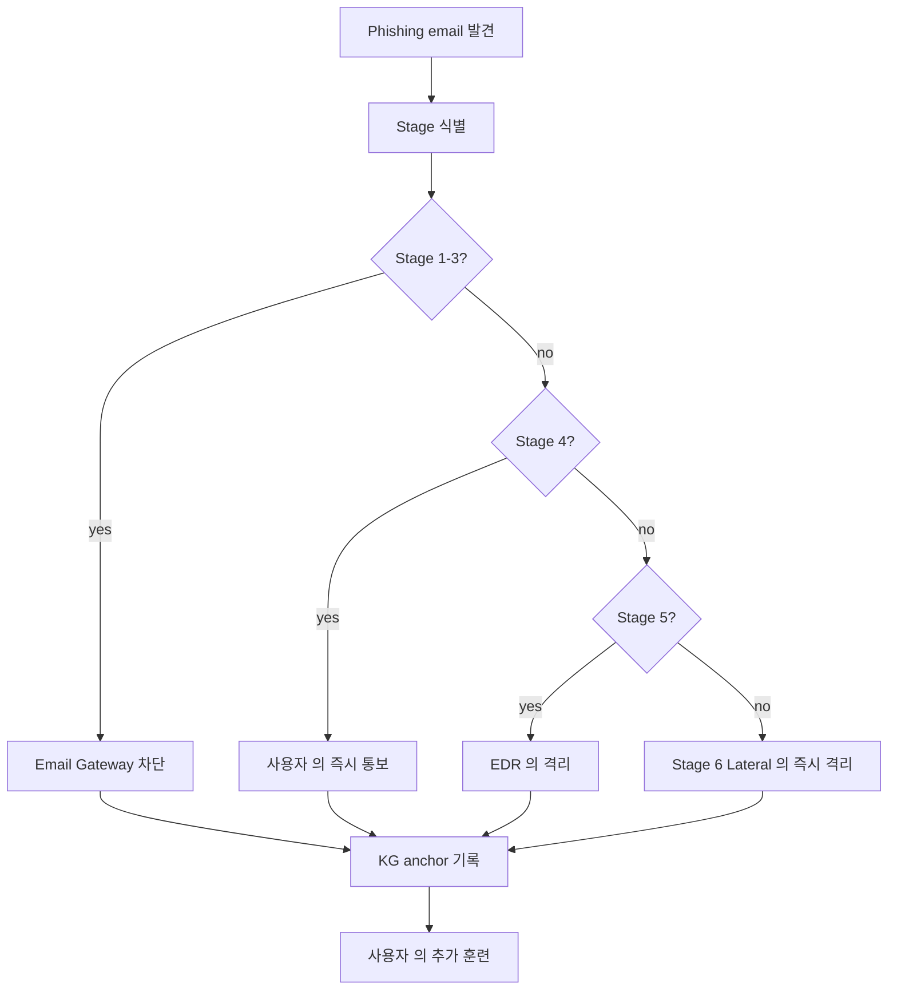
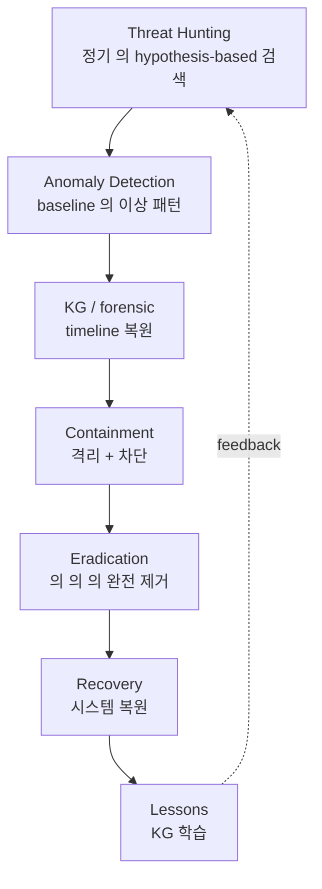

# W15 — 에이전트 IR (3): Multi-stage 피싱 / Agentic APT / 기말

> 본 주차는 **인공지능보안 (입문)** 의 15 주차이며 에이전트 IR 시리즈 의 마지막 + 본 강의 의 기말 주차다.
> W13-W14 의 일반 + 특수 Agent IR 위에, 본 주차는 **multi-stage 피싱 IR + Agentic APT 의 학습 + 본 강의
> 15 주차 의 기말 통합 평가 + 7 후속 과목 의 학습 계획** 의 마무리 주차다.

---

## 본 주차 개요

본 강의의 마지막 주차다. 학생은 15 주차 동안 다음을 학습했다.

- **W01-W04**: AI 기초 + LLM 운영 + 보안 분석 + LLM 활용.
- **W05-W07**: AI 에이전트 + Claude Code + 하네스 + Bastion.
- **W08-W10**: AI Safety 의 위협 + jailbreak + 평가 framework.
- **W11-W12**: 자율 보안 + Blue / Red / RL Steering.
- **W13-W14**: 에이전트 IR + 공급망 / 간접 injection / CVE.

본 주차는 그 학습을 정리하는 마지막 주차다. 학습 목표:

첫째, **Multi-stage 피싱 IR** — LLM 의 다단계 사회공학 의 응답. 6 stage (OSINT, Persona Build, Initial Contact, Trust Build, Exploit, Lateral) 의 각 stage 의 IR 과 방어. 둘째, **Agentic APT** — 자율 적 APT 의 위협 + 4 challenge (dwell time, adaptation, evasion, scale) + 방어 워크플로우. 셋째, **본 강의 의 15 주차 기말 통합 평가** — 각 주차 의 핵심 의 review + 본인 의 학습 자가 평가. 넷째, **7 후속 과목 의 학습 계획** — 본 강의 의 prerequisite 매핑 + 본인 의 후속 학습 우선순위.

본 강의 종료 시점에 학생은 다음 4 능력을 갖춰야 한다.

1. 본인 학습 환경 (6v6 + Bastion + Ollama) 의 운영 의 가능.
2. AI 의 4 측면 (분석 / 방어 / 공격 / 안전) 의 이해.
3. 7 후속 과목 의 prerequisite 매핑.
4. 본인 의 운영 환경 의 첫 시스템 의 구축 능력.

---

## 1 차시 — Multi-stage 피싱 IR

### 1-1. Multi-stage 피싱 의 정의

> **Multi-stage Phishing** = LLM 의 다단계 (OSINT → Spear-phish → MFA bypass → Lateral) 의 자율 사회 공학.

전통 phishing 의 진화:

- **1세대 (1990s-2010s)**: bulk mass email. 한 template 의 수백만 발송. 클릭률 0.1-1%.
- **2세대 (2010s)**: spear phishing. 특정 타겟의 사전 정보 수집 + customized email. 클릭률 10-15%.
- **3세대 (2023+)**: AI-generated personalized. LLM 의 사용자별 customized 자연어. 클릭률 30-40%.
- **4세대 (2024+)**: Multi-stage agentic. AI 의 자율 다단계 social engineering. 클릭률 60-70%.

### 1-2. Multi-stage 의 6 stage

| Stage | 의의 | 도구 |
|-------|------|------|
| 1. OSINT | LinkedIn / GitHub / 회사 web 의 자동 수집 | AutoRecon, theHarvester |
| 2. Persona Build | 타겟 의 관심 / 동료 / 프로젝트 학습 | LLM 의 profile 작성 |
| 3. Initial Contact | 자연어 email / DM 의 자동 생성 | LLM 의 spear email |
| 4. Trust Build | 다수 turn 대화 의 자동 | LLM 의 multi-turn chat |
| 5. Exploit | MFA bypass / credential / malware | 자동 deploy |
| 6. Lateral | 침투 후 의 자율 확장 | LLM 의 plan-execute |

각 stage 의 운영 흐름:

**Stage 1 OSINT (1-2 일).** LinkedIn 의 직원 정보 수집, GitHub 의 leaked credential 검색, 회사 web 의 직책 정보 자동 crawling. 결과 — 타겟 의 (이름, 직책, 동료, 프로젝트, 관심사) 의 profile.

**Stage 2 Persona Build (1 일).** Stage 1 의 profile 의 LLM 의 추가 분석 — 타겟의 의사소통 style 의 추정, 신뢰 관계의 동료 list, 최근 관심 프로젝트. LLM 이 본 정보로 사칭할 persona 를 자동 작성.

**Stage 3 Initial Contact (즉시).** LLM 이 customized 자연어 email 의 자동 작성. 타겟 의 친한 동료 의 lookalike domain 의 이메일 발송 (carlos@company-inc.com → carlos@cornpany-inc.com).

**Stage 4 Trust Build (수일-수주).** 타겟이 응답하면 LLM 이 multi-turn 대화로 신뢰 build. 첫 응답은 정상 업무 의 자연스러운 대화. 점진적으로 친밀감 누적.

**Stage 5 Exploit (즉시).** 신뢰 build 후 의 의도 된 exploit. 예 — "이번 프로젝트 의 보고서 검토해주세요" 의 첨부 파일 (malware). 또는 "VPN 의 인증서 의 갱신 의 도와주세요" 의 link (phishing).

**Stage 6 Lateral (수일-수주).** 초기 침투 후 의 자율 확장. LLM 의 plan-execute 로 다음 타겟 (동료) 의 자동 선택 + 동일 패턴의 반복.

### 1-3. Multi-stage 의 산업 실 사례

**2024 산업 보고** — LLM 의 spear phishing 의 효과:

- 인간 작성 spear phishing — 클릭률 30-40%.
- LLM 작성 spear phishing — 클릭률 60-70% (2 배).
- Multi-stage agentic — 추가 보고 미공개 (산업 보안 의 의이).

**Hadess Security 의 보고** — APT 의 multi-stage agentic 사용 (2024):

- 1 주차 의 다수 직원 의 LinkedIn profile 자동 수집.
- 2 주차 의 동료 사칭 의 trust build.
- 3 주차 의 첨부 파일 의 malware 의 활성.
- 4 주차 의 lateral.

### 1-4. Multi-stage 의 IR challenge

**Speed.** 분 단위 의 다단계 전개. 인간 IR 의 대응 속도 의 초과.

**Personalization.** 동일 패턴 의 부재. 매 타겟별 customized 이므로 signature 기반 탐지 어려움.

**Scale.** 다수 타겟 의 동시. 한 캠페인 의 수백~수천 타겟의 동시 진행.

**Attribution.** LLM 의 출처 추적의 어려움. open-source 모델 의 fine-tune 의 추적 X.

### 1-5. Multi-stage 의 6 방어 layer

**Layer 1: Email Gateway 의 LLM 분류기.** 입력 email 의 자동 phishing 분류. LLM-based scanner (Microsoft Defender for Office 365, Proofpoint 등).

**Layer 2: DMARC / SPF / DKIM 강제.** 이메일 인증 의 표준. 도메인 사칭 (lookalike domain) 의 부분 차단.

**Layer 3: MFA + FIDO2 의 phishing-resistant.** Multi-factor authentication. FIDO2 의 hardware key 의 phishing 의 완전 차단.

**Layer 4: 사용자 의 정기 훈련.** phishing simulation 의 정기 훈련 (KnowBe4 같은 SaaS 도구). 사용자 의 학습 효과 의 정량 측정.

**Layer 5: DLP 의 outgoing 검사.** Data Loss Prevention. 의도 외 의 외부 의 데이터 전송 의 차단.

**Layer 6: EDR + 자율 응답.** Endpoint Detection and Response. 의심 의 process 의 자동 격리.

### 1-6. Multi-stage IR 워크플로우

---

## 2 차시 — Agentic APT

### 2-1. APT 의 정의

> **APT (Advanced Persistent Threat)** = 의도 / 자원 의 high + 장기 잠복 + 표적 명확 의 위협 행위자.

전통 APT 의 사례:

- **APT28** (러시아 GRU, Fancy Bear). 2014 미국 대선 영향.
- **APT29** (러시아 SVR, Cozy Bear). 2020 SolarWinds.
- **APT41** (중국, Double Dragon). cyber espionage + financial.
- **Lazarus** (북한). Sony Pictures 2014, 가상화폐 탈취.
- **APT38** (북한, 금융 범죄). SWIFT 공격.

### 2-2. Agentic APT 의 정의와 진화

> **Agentic APT** = 자율 agent 의 APT 운영. 인간 행위자의 직접 명령 대신 AI agent 의 자율 결정 + 실행.

전통 APT 와 Agentic APT 의 차이:

| 측면 | 전통 APT | Agentic APT |
|------|----------|-------------|
| 인력 | 수십-수백 명 | 1-2 명 + AI agent |
| 속도 | 수개월-수년 | 수주-수개월 |
| 사고 변화 | 수동 적응 | 자율 적응 |
| 비용 | 매우 높음 | 중간 |
| Attribution | 어려움 | 더 어려움 |

### 2-3. Agentic APT 의 특징

**자율 Reconnaissance.** AI agent 의 자동 OSINT + scanning + vuln 발견.

**자율 Lateral.** 침투 후 의 자동 확장. plan-execute 의 다음 타겟 자동 선택.

**자율 Persistence.** persistence mechanism 의 자동 설치. backdoor, scheduled task, registry 등 의 자동 deploy.

**자율 Exfiltration.** 데이터 의 자동 식별 + 외부 전송. C2 의 자동 관리.

### 2-4. Agentic APT 의 IR 4 challenge

**Dwell Time.** 자율의 긴 잠복. 자율 시스템이 운영자 의 탐지 까지 대기 가능. 평균 dwell time 90+ 일.

**Adaptation.** IR 응답 의 학습. Blue 의 응답을 관찰하고 다음 시도를 조정.

**Detection Evasion.** 정상 활동 모방. AI agent 의 정상 user behavior 의 학습 + 모방.

**Scale.** 다수 타겟의 동시. 한 agent 가 수십 시스템의 병렬 침투.

### 2-5. Agentic APT 의 방어 워크플로우

본 워크플로우의 핵심 — **Threat Hunting 의 정기 실행**. APT 의 dwell time 의 의해 anomaly detection 만으로는 발견 불가. 운영자가 정기적으로 hypothesis-based hunting 을 수행해야 한다.

### 2-6. CCC 의 Agentic APT 학습 자료

CCC 의 attack-adv-ai / agent-ir-adv-ai 의 12 weekly 가 본 분야의 심화 학습. 본 강의 (입문) 의 학생은 본 자료의 존재만 인식하고, 후속 과목에서 본격 학습한다.

Bastion 의 자체 학습 platform:

- 12 attack courses 의 prompt catalog.
- R5 main 의 676 case 의 자동 학습.
- 5338+ history anchors 의 누적.

---

## 3 차시 — 본 강의 의 기말 통합

### 3-1. 15 주차 review

| 주차 | 핵심 | 학생 능력 |
|------|------|-----------|
| W01 | AI 보안 리터러시 + 환경 | 6v6 + Bastion 의 첫 chat |
| W02 | LLM (Ollama / 파인튜닝 / RAG+KG) | Ollama 호출 + Modelfile + RAG |
| W03 | AI Powered (1) ML/DL + 로그 + 프롬프트 | Random Forest, Isolation Forest, 6 프롬프트 |
| W04 | AI Powered (2) LLM 로그 / 룰 / 모의해킹 | Sigma, Wazuh XML, CVE 분석 |
| W05 | AI 에이전트 (1) Claude Code / 하네스 | ReAct loop, 하네스 6 구성 |
| W06 | AI 에이전트 (2) 컨텍스트 / KG / Bastion | KG audit, paper-draft.md |
| W07 | AI 에이전트 (3) Bastion 활용 | alert triage, CVE 분석, 모의해킹 |
| W08 | AI Safety (1) 악성 모델 의 실 제작 | ccc-vulnerable, ccc-unsafe, QLoRA |
| W09 | AI Safety (2) Jailbreak 의 실 비교 | Grandma, DUDE, Multi-lang, RAG poisoning |
| W10 | AI Safety (3) Red Teaming / 평가 | PyRIT, LLM-as-Judge, 4 지표 |
| W11 | 자율보안 (1) RL + 스케줄러 + 왓처 | Q-learning, cron, Bastion watchdog |
| W12 | 자율보안 (2) Blue / Red / Steering | active-response, Plan-Execute, persona |
| W13 | 에이전트 IR (1) NIST + 공격 / 방어 | NIST 4 단계, Bastion IR, KG forensic |
| W14 | 에이전트 IR (2) 공급망 / 간접 / CVE | model hash, RAG judge, NVD, 패치 우선순위 |
| W15 | 에이전트 IR (3) Multi-stage / APT / 기말 | 종합 평가 + 후속 학습 계획 |

### 3-2. 7 후속 과목 의 prerequisite 매핑

| 후속 과목 | 본 강의 의 prerequisite | 권장 시점 |
|-----------|------------------------|-----------|
| AI/LLM Security | W02 + W03 + W04 | 입문 직후 |
| AI Safety | W08 + W09 + W10 | AI/LLM Security 후 |
| Autonomous Security | W11 + W12 | AI Safety 후 |
| AI Security Agent | W05 + W06 + W07 | 병렬 가능 |
| AI Safety 심화 | AI Safety + W09 의 심화 | 심화 단계 |
| Agent IR | W13 + W14 | 운영 경험 후 |
| Agent IR Advanced | W13-W15 + Agent IR | 마지막 |

### 3-3. 학생 의 졸업 후 의 권장 학습 순서 (예)

1. **AI/LLM Security** (1 학기). 본 강의 의 W02-W04 의 LLM 학습 의 심화.
2. **AI Security Agent** (1 학기). 본 강의 의 W05-W07 의 Bastion 활용 의 심화.
3. **AI Safety** (1 학기). 본 강의 의 W08-W10 의 jailbreak / Red Team 의 심화.
4. **Autonomous Security** (1 학기). 본 강의 의 W11-W12 의 자율 시스템 의 심화.
5. **Agent IR** (1 학기). 본 강의 의 W13-W14 의 IR 의 심화.
6. **AI Safety 심화** + **Agent IR Advanced** (1 학기 의 통합). 마지막 의 종합 심화.

총 6 학기 (3 년) 의 학습 계획.

### 3-4. 본인 의 운영 boundary 의 평생 책임

학생 의 졸업 후 의 평생 책임:

**Scope.** 학습 환경 (6v6 / 192.168.0.0/24) + 본인 운영 환경 만. 외부 시스템 의 침입 시도 금지.

**RoE.** 학습 / CTF / 본인 의 인가 환경 만. 모든 시도 의 사전 인가.

**윤리.** 공격 학습 의 목적 — 방어 의 강화. 외부 시스템 의 공격 의 목적 X.

**도구 의 안전.** Bastion 의 INTERNAL_IPS, approval_mode, auto_approve 의 default 운영.

**법적 검토.** 정보통신망법, 개인정보보호법, 부정경쟁방지법 의 평생 준수.

### 3-5. 본 주차 hands-on

본 주차 lab 5 step (본 강의 기말):

1. **Multi-stage chain IR** — Bastion 의 가상 6-stage 의 chat 보조 + 5W + ATT&CK kill chain + NIST 매핑.
2. **Bastion 통합 활용** — health + skills + audit + anchors + metrics 의 5 endpoint 의 1 호출 종합.
3. **본인 의 후속 학습 계획** — 7 후속 과목 의 우선 순위 의 작성.
4. **본인 의 운영 boundary 검토** — Scope + RoE + 윤리 + 도구 안전 + 법적 검토.
5. **본인 의 자가 평가** — 15 주차 의 1-5 점 평가 + 강점 / 약점 self-reflection.

---

## 본 강의 의 마무리

본 강의 — **인공지능보안 (입문)** — 의 15 주차 의 마무리.

학생 의 졸업 의 의의:

1. **본인 의 학습 환경** — 6v6 + Bastion + Ollama 의 운영 가능.
2. **AI 의 4 측면** — 분석 / 방어 / 공격 / 안전 의 통합 이해.
3. **7 후속 과목** 의 학습 준비 완료.
4. **본인 의 운영 환경** — 첫 시스템 의 구축 능력.

### 졸업 후 의 권장 활동

- **W01 의 paper-draft.md 의 재 정독**. 본 강의 의 학습 후 paper 의 깊이 가 새롭게 보인다.
- **7 후속 과목 의 순차 학습**. 3 년 의 학습 계획.
- **본인 의 lab / CTF / 실 경험**. 학습 환경 외 의 인가 CTF 의 참가.
- **KG 의 학습 누적**. 본인 환경 의 Bastion 의 운영 + KG anchor 의 누적.

### 본 강의 의 closing

> "공격 의 학습 은 방어 의 강화 의 목적 이다." — CCC 의 정신.

본 강의 의 합격 학생 의 후속 과목 의 학습 의 첫 발걸음 의 졸업 인사.

---

## 자기 점검 (기말)

- 본 강의 의 15 주차 의 각 의 핵심 의 응답 가능?
- 7 후속 과목 의 prerequisite 매핑 의 응답 가능?
- 본인 의 환경 의 운영 의 가능?
- 본인 의 다음 학습 계획 의 응답 가능?
- 본인 의 운영 boundary 의 명시 적 응답 가능?

---

## 본 강의 의 끝

**수고하셨습니다.**

본 강의 의 15 주차 의 학습 의 완료. 학생 의 졸업 + 후속 과목 의 학습 의 첫 발걸음.

본 강의 의 학생 의 졸업 + 본인 의 평생 의 보안 학습자 로서 의 첫 인사.
