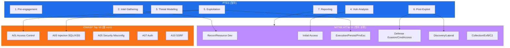
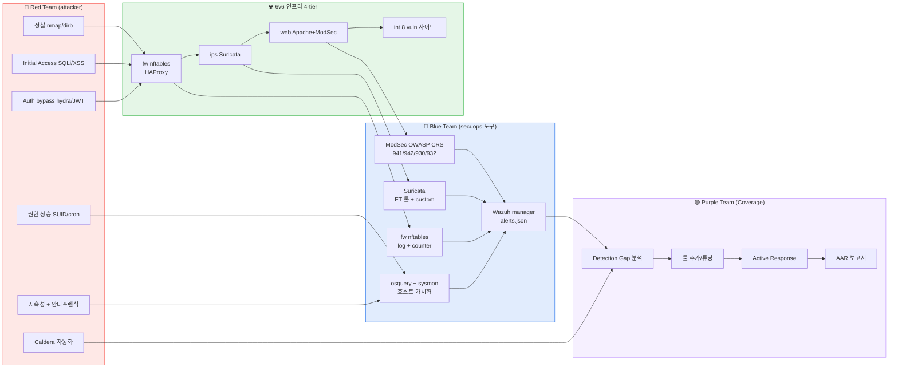
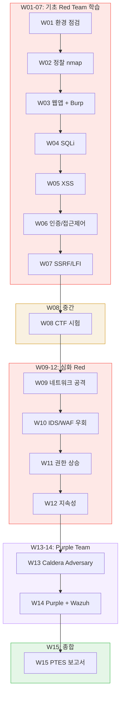
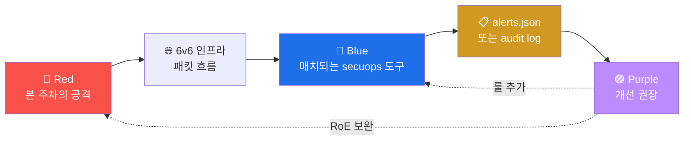
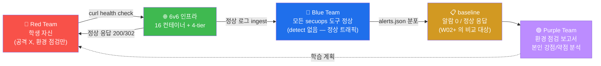

# Week 01 — 보안 개론 + 6v6 실습 환경 + 침투 테스트 표준

> 본 과목은 사이버 공격·침투 테스트 (Offensive Security) 의 합법적·교육적 학습이다.
> 모든 실습은 6v6 환경 (`6v6-attacker` 컨테이너 → fw / web 의 8 vuln 사이트) 안에서만
> 진행한다. 외부 시스템 공격은 RoE (Rules of Engagement) 위반이며 정통망법 / 개인정보
> 보호법 / 형법 위반으로 법적 책임이 발생한다.
>
> 본 주차는 침투 테스트의 정의·표준·도구·환경의 4 축을 전부 다룬다. 단순 도구 사용
> 매뉴얼이 아니라 "공격자의 사고 방식과 절차" 를 학생이 체득하도록 설계되었다.

## 학습 목표

학생은 본 주차 종료 시 다음을 수행할 수 있어야 한다.

1. **침투 테스트의 정의** + 유사 활동 (bug bounty / red team / vuln research) 와의
   차이를 설명한다.
2. **합법 범위 + RoE** + 한국 법적 근거 3 개 (정통망법 48조 / 개인정보보호법 71조 /
   형법 314조) 를 구분한다.
3. **PTES 7 단계** + **MITRE ATT&CK 14 Tactic** + **OWASP Top 10** 의 관계를 매핑한다.
4. **6v6 환경의 16 컨테이너 + 13 공격 도구 + 8 vuln 사이트** 의 토폴로지·역할을
   화이트보드에 그릴 수 있다.
5. **R/B/P 시나리오 모델** — 본 과목의 모든 실습이 이 구조 위에 동작한다는 사실 +
   각 주차의 R/B/P 매핑을 인지한다.
6. attacker 컨테이너 진입 + 8 vuln 사이트 헬스체크 + bastion API 응답 확인 1 사이클
   수행.

## 강의 시간 배분 (3시간 40분)

| 시간      | 내용                                                                   | 유형     |
|-----------|------------------------------------------------------------------------|----------|
| 0:00–0:25 | 이론 — 침투 테스트의 정의·유사 활동·합법 범위                          | 강의     |
| 0:25–0:55 | 이론 — PTES 7 단계 + MITRE ATT&CK 14 Tactic + OWASP Top 10           | 강의     |
| 0:55–1:05 | 휴식                                                                    | —        |
| 1:05–1:30 | R/B/P 시나리오 모델 + 본 과목 15주 R/B/P 다이어그램                    | 강의/토론|
| 1:30–2:00 | 6v6 환경 토폴로지 + 13 도구 카테고리 + 8 vuln 사이트 매핑             | 강의     |
| 2:00–2:30 | 실습 1, 2 — attacker 진입 + 13 도구 점검                              | 실습     |
| 2:30–2:40 | 휴식                                                                    | —        |
| 2:40–3:10 | 실습 3, 4 — 8 vhost 응답 + bastion API 호출                          | 실습     |
| 3:10–3:30 | 실습 5 — 본인 학습 계획 + R/B/P 자가 분석                              | 실습     |
| 3:30–3:40 | 정리 + W02 (정찰) 예고                                                 | 정리     |

---

## 1. 침투 테스트란 무엇인가?

### 1.1 정의

**Penetration Testing** = "권한을 가진 보안 전문가가 시스템의 취약점을 의도적으로
공격하여 발견·증명하는 행위". 핵심 키워드 3 개:

- **권한 (Authorization)** : 시스템 소유자의 명시적 서면 동의가 있어야 한다. 무허가
  접근은 침투 테스트가 아니라 **범죄** 다.
- **취약점 발견·증명 (Find & Demonstrate)** : 단순 보고가 아닌 "이 취약점을 통해
  실제로 무엇을 할 수 있는가" 를 시연한다.
- **방어 측 개선 (Defensive Improvement)** : 결과는 항상 방어 측 개선으로 이어진다.
  공격 자체가 목적이 아니다.

### 1.2 유사 활동 5 가지와의 차이

| 활동 | 범위 | 권한 | 결과물 | 본 과목과의 관계 |
|------|------|------|--------|------------------|
| **Penetration Testing** | 사전 정의된 scope | 서면 계약 | 보고서 + 권장 | 본 과목 (W15 PTES 보고서) |
| **Red Team Engagement** | 광범위 (사회공학 포함) | 서면 계약 | 침투 시나리오 + AAR | W13-14 Caldera + Purple Team |
| **Bug Bounty** | 플랫폼 정책 (HackerOne 등) | 플랫폼 약관 동의 | 단일 vuln 보고 | 자율 학습 권장 |
| **Vulnerability Research** | 0-day 발굴 | (없음, 본인 환경) | CVE 등록 + Advisory | 본 과목 외 (course13 attack-advanced) |
| **CTF (Capture The Flag)** | 가상 환경 한정 | 대회 규정 | flag 제출 | W08 중간고사 (CTF 형식) |
| **Unauthorized Hacking** | 무제한 | **없음** | (법적 처벌) | **금지** |

### 1.3 침투 테스트가 필요한 이유 — 4 가지

1. **방어 측의 검증** — 보안 솔루션 (방화벽 / IDS / WAF / SIEM) 이 실제로 작동하는지
   "공격자 시점" 으로 확인. secuops 의 W08 / W15 가 동일 주제.
2. **컴플라이언스 충족** — PCI DSS 11.3, ISMS-P 2.10.7, K-ISMS 2.10 등이 정기
   침투 테스트를 의무화.
3. **사고 대응 훈련** — Blue Team 의 detection 속도 + 대응 절차를 실측 (W14 Purple
   Team).
4. **비즈니스 위험 정량화** — "취약점 → 실제 피해 가능성 → 금전 환산" 의 정밀 분석.

### 1.4 한국 법적 근거 — 합법 vs 불법의 경계

| 법령 | 조항 | 내용 | 처벌 |
|------|------|------|------|
| **정보통신망법** | 48조 (정보통신망 침해행위) | 정당한 접근권한 없이 정보통신망 침입 / 침해 / 교란 | 5년 이하 / 5천만원 이하 |
| **정보통신망법** | 49조 (비밀 등의 보호) | 정보통신망 비밀 침해·도용·누설 | 5년 이하 / 5천만원 이하 |
| **개인정보보호법** | 71조 (벌칙) | 정보주체 동의 없는 처리 / 부정한 방법으로 개인정보 취득 | 5년 이하 / 5천만원 이하 |
| **형법** | 314조 (업무방해) | 컴퓨터 등 정보처리장치 손괴 / 정보 변경 / 부정한 명령 입력 | 5년 이하 / 1.5천만원 이하 |
| **형법** | 347조의2 (컴퓨터등사용사기) | 컴퓨터 등 정보처리장치에 허위·부정한 정보 입력하여 재산상 이익 취득 | 10년 이하 / 2천만원 이하 |
| **저작권법** | 104조의2 (기술적 보호조치 무력화) | DRM / DMCA 우회 | 5년 이하 |

**6v6 환경 = 합법**: 학교가 소유한 학습 환경 + 명시적 RoE.

**다른 학생의 환경 = 불법**: 같은 lab 안이라도 다른 학생의 학습 환경에 무허가 침입은
정통망법 48조 위반.

**외부 인터넷 = 불법**: 본 과목 도구를 외부 시스템에 사용 = 즉시 학사 처벌 + 형사 고소.

### 1.5 RoE (Rules of Engagement) — 본 과목의 RoE

침투 테스트 시작 전 의뢰자와 합의하는 **계약서**.

본 과목의 RoE (모든 학생 동일):

```
1. Scope (범위):
   - 허용 대상: 6v6 환경의 16 컨테이너 + 8 vuln 사이트
   - 금지 대상: 다른 학생의 환경, 외부 인터넷, 학교 내부 운영망

2. Methods (수단):
   - 허용 도구: attacker 컨테이너의 13 도구 (W01-W14 학습 도구)
   - 금지 행위: DoS / 데이터 무단 유출 / cryptominer 설치 / ransomware 시뮬

3. Schedule (일정):
   - 강의 시간: 매 주차 lecture + lab
   - 자율 학습: 24시간 가능
   - 보고: 매 주차 lab 결과 + W15 종합 PTES 보고서

4. Communication (연락):
   - 강사 비상 연락: <강사 email>
   - 시스템 다운 시: 즉시 정지 + 강사 통보

5. Deliverables (산출물):
   - 매 주차: 명령어 + 출력 + 분석 (1 페이지)
   - 중간고사 (W08): CTF flag 3 개
   - 기말 (W15): PTES 7 섹션 보고서 (10+ 페이지)

6. Confidentiality (비밀유지):
   - 다른 학생과 답안 공유 금지
   - 외부 공개 금지 (특히 SNS / 블로그)
```

본 RoE 위반 시 즉시 학사 처벌 + 학점 무효.

---

## 2. 침투 테스트의 표준 — PTES + MITRE ATT&CK + OWASP

### 2.1 PTES (Penetration Testing Execution Standard)

**PTES** 는 2009년 SecureState 의 보안 전문가들이 만든 침투 테스트 표준. 7 단계로
구성.

```
1. Pre-engagement Interactions   (사전 협의 — RoE 합의)
   │
   ▼
2. Intelligence Gathering        (정찰 — OSINT + Active scan)
   │
   ▼
3. Threat Modeling               (위협 모델링 — STRIDE / 자산-위협 매핑)
   │
   ▼
4. Vulnerability Analysis        (취약점 분석 — 자동·수동 스캔)
   │
   ▼
5. Exploitation                  (공격 — 발견 취약점 실제 이용)
   │
   ▼
6. Post Exploitation             (사후 — 권한 상승 / 측면 이동 / 지속성)
   │
   ▼
7. Reporting                     (보고 — 결과 + 권장 조치)
```

각 단계의 본 과목 매핑:

| PTES | 본 과목 주차 | 목표 |
|------|--------------|------|
| 1. Pre-engagement | W01 | RoE 합의 + 학습 계획 |
| 2. Intelligence Gathering | W02 | nmap / nikto / dirb 정찰 |
| 3. Threat Modeling | W03 | JuiceShop / DVWA 구조 분석 |
| 4. Vulnerability Analysis | W03-04 | sqlmap / Burp / ffuf |
| 5. Exploitation | W04-10 | SQLi / XSS / 인증 우회 / 파일 업로드 / 우회 |
| 6. Post Exploitation | W11-12 | 권한 상승 / 지속성 / 안티포렌식 |
| 7. Reporting | W15 | PTES 7 섹션 보고서 |

### 2.2 MITRE ATT&CK — 공격 매트릭스의 표준

**MITRE ATT&CK** (2013~) 는 실제 공격 그룹의 행동을 **14 Tactic × 200+ Technique**
으로 분류한 매트릭스.

#### 14 Tactic — 공격의 "왜" (목적)

| Tactic ID | 이름 | 의미 | 본 과목 주차 |
|-----------|------|------|--------------|
| TA0043 | Reconnaissance | 외부 정찰 (OSINT, 스캔) | W02 |
| TA0042 | Resource Development | 공격 자원 구축 (C2 인프라, payload) | (W13 Caldera) |
| TA0001 | Initial Access | 첫 진입 (피싱, 공개 application 익스플로잇) | W04-07 |
| TA0002 | Execution | 명령 실행 (shell, PowerShell) | W11 |
| TA0003 | Persistence | 지속성 (cron, systemd, SSH key) | W12 |
| TA0004 | Privilege Escalation | 권한 상승 (SUID, sudo, kernel exploit) | W11 |
| TA0005 | Defense Evasion | 방어 우회 (안티포렌식, IDS 우회) | W10, W12 |
| TA0006 | Credential Access | 자격증명 (brute, dump, key logging) | W06 |
| TA0007 | Discovery | 내부 정찰 (호스트, 네트워크 자산 파악) | W09, W11 |
| TA0008 | Lateral Movement | 측면 이동 (다른 호스트로 진입) | W09 |
| TA0009 | Collection | 수집 (데이터 마이닝) | W12 |
| TA0011 | Command and Control | C2 (외부 통신) | W13 |
| TA0010 | Exfiltration | 유출 (데이터 외부 전송) | W12 |
| TA0040 | Impact | 영향 (파괴, ransomware, 가용성 침해) | (본 과목 X — 윤리) |

#### Technique — 공격의 "어떻게" (방법)

각 Tactic 아래 10~30 Technique. 예:

- **TA0001 Initial Access** 아래:
  - T1190 Exploit Public-Facing Application (W04-07)
  - T1078 Valid Accounts (W06 brute)
  - T1566 Phishing (사회공학 — 본 과목 외)
  - T1133 External Remote Services (W06 SSH brute)

- **TA0006 Credential Access** 아래:
  - T1110.001 Password Guessing (W06 hydra)
  - T1110.003 Password Spraying (W06)
  - T1212 Exploitation for Credential Access (W06 JWT none)

### 2.3 OWASP Top 10 — 웹 응용 보안의 표준

**OWASP** (Open Web Application Security Project) 의 Top 10 — 가장 빈번한 웹
취약점 10 종.

| 순위 | 카테고리 | 본 과목 주차 |
|------|----------|--------------|
| A01 | Broken Access Control | W06 (IDOR) |
| A02 | Cryptographic Failures | (별 과정 course4) |
| A03 | Injection (SQLi / XSS) | W04 SQLi, W05 XSS |
| A04 | Insecure Design | (지속 학습) |
| A05 | Security Misconfiguration | W07 |
| A06 | Vulnerable and Outdated Components | (Vuln scan 도구) |
| A07 | Identification and Authentication Failures | W06 (hydra / JWT) |
| A08 | Software and Data Integrity Failures | (CI/CD 보안) |
| A09 | Security Logging and Monitoring Failures | (secuops 측) |
| A10 | Server-Side Request Forgery (SSRF) | W07 |

### 2.4 3 표준의 관계



**해석**:
- PTES = **언제·어떤 순서로** 하는가 (절차)
- ATT&CK = **무엇을** 하는가 (행위 분류)
- OWASP = **어떤 vuln** 을 찾는가 (대상)

3 표준은 보완 관계 → 보고서에 모두 매핑.

---

## 3. R/B/P 시나리오 모델 — 본 과목의 핵심

본 과목의 **모든 실습은 Red/Blue/Purple Team 의 3 시점에서 동일 사건을 분석** 한다.

### 3.1 R/B/P 의 정의

| 팀 | 색상 | 역할 |
|----|------|------|
| **Red** | 빨강 | 공격자 — 6v6 의 vuln 발견·이용 |
| **Blue** | 파랑 | 방어자 — secuops 의 5 종 솔루션 (fw / ips / web / siem / host) 으로 detect |
| **Purple** | 보라 | 통합 — Red 의 행위가 Blue 의 어느 도구에 잡혔는가 분석 + 룰 개선 |

### 3.2 R/B/P 통합 다이어그램 — 본 과목 전체



### 3.3 본 과목 15주의 R/B/P 매핑



### 3.4 매 주차 R/B/P 시나리오의 구조

각 주차 lecture 의 후반부에 R/B/P 시나리오 다이어그램이 들어간다. 구조:



학생은 매 주차 lab 후에 본인 R/B/P 분석을 1 페이지 작성한다.

---

## 4. 6v6 환경 — 학생 PC 단일 VM 인프라

### 4.1 16 컨테이너 토폴로지 (재학습)

W01 secuops 와 동일. attack 시점에서 본 환경:

| Tier | 컨테이너 | IP | attack 측 활용 |
|------|----------|-----|----------------|
| ext | bastion .201 | 점프 호스트 | 6v6-* SSH 진입점 |
| ext | **attacker .202** | **공격 도구 host** | **본 과목 메인** |
| fw | fw .1 / pipe .1 | 라우터 + HAProxy + ModSec 우회 backend | W02 nmap 첫 target |
| ips | ips .2 / dmz .1 | Suricata sniff | W04-10 의 alert source (Blue 시점) |
| dmz | web .80 / int .80 | Apache + ModSec + reverse proxy | W04-07 의 핵심 target |
| dmz | siem .100 | Wazuh manager | Blue 시점의 통합 dashboard |
| int | juiceshop .81 | Juice Shop | W03-07 메인 vuln 사이트 |
| int | dvwa .82 | DVWA | W04-05 |
| int | neobank .83 | NeoBank (가상 은행) | W06 인증 / IDOR |
| int | govportal .84 | GovPortal (가상 정부) | W07 LFI |
| int | mediforum .85 | MediForum (가상 의료) | W05 Stored XSS |
| int | adminconsole .86 | AdminConsole | W07 RCE / XXE |
| int | aicompanion .87 | AICompanion (LLM 백엔드) | (별 과정) |

### 4.2 패킷 흐름 — 공격자 시점

공격자가 보내는 packet 의 4-hop:

```
attacker (10.20.30.202)
    │  src=10.20.30.202, dst=10.20.30.1 dport=80
    ▼
fw (10.20.30.1)
    │  HAProxy 가 Host header 보고 backend 결정
    │  학생 트래픽 (juice.6v6.lab 등) → waf backend
    │  운영 트래픽 (siem.6v6.lab) → dashboard backend
    │  forward chain 통과
    ▼
ips (10.20.31.2)
    │  Suricata 가 모든 packet sniff (eth0 + eth1)
    │  af-packet promiscuous 모드 → alert event 생성
    ▼
web (10.20.32.80)
    │  Apache + ModSecurity v2
    │  SecRuleEngine On + OWASP CRS 31 룰 파일
    │  XSS / SQLi / LFI 페이로드 → 403 차단
    │  통과 시 ProxyPass 로 int 백엔드
    ▼
juiceshop (10.20.40.81)
    │  실제 vuln 사이트
    │  응답 → 역방향 routing (이미 stateful) → attacker
```

각 hop 에서 **Blue 측 detect**:
- fw: nftables counter / log prefix
- ips: Suricata eve.json (`event_type=alert` 또는 `flow`)
- web: ModSec audit log (`/var/log/apache2/modsec_audit.log` JSON)
- → Wazuh agent → manager 의 `/var/ossec/logs/alerts/alerts.json`

### 4.3 외부 노출 5 포트

```
호스트 80   → fw:80         HTTP frontend (HAProxy)
호스트 443  → fw:443        HTTPS frontend
호스트 2202 → attacker:22   attacker 직접 진입 (본 과목 주 진입점)
호스트 2204 → bastion:22    bastion 점프 호스트
호스트 9100 → fw:9100       Bastion API HAProxy
```

---

## 5. 13 공격 도구 — 카테고리·도구 상세

본 과목에서 사용하는 도구 13 개. 각 도구의 **역사·작성자·라이선스·동작 원리·주요
사용법·한계** 를 짧게 다룬다.

### 5.1 정찰·스캐닝 (W02, W09)

#### Nmap (Network Mapper)

```
역사: 1997 Gordon "Fyodor" Lyon 가 Phrack #51 에 발표. 25+ 년 표준 도구.
라이선스: GPL (NPSL — Nmap Public Source License)
동작 원리: TCP/IP stack 의 패킷을 직접 작성 (raw socket).
            target 호스트의 응답 패턴으로 OS / 서비스 / 포트 상태 식별.
구성:
  - 핵심 binary: nmap
  - 부가 도구: nping (packet 작성), ncat (netcat 대체), ndiff (스캔 결과 diff)
  - NSE: 700+ Lua 스크립트 (HTTP enum, vuln detect, brute force, malware)
주요 사용법 6:
  1. nmap -sT <host>       : TCP connect (3-way handshake)
  2. sudo nmap -sS <host>   : SYN stealth (half-open, 빠르고 stealth)
  3. nmap -sV <host>        : 서비스 버전 (banner grabbing)
  4. sudo nmap -O <host>    : OS detection (TCP/IP fingerprint)
  5. sudo nmap -sU <host>   : UDP scan (느림, 부정확)
  6. nmap --script vuln <host> : NSE 의 vuln 검사 스크립트
한계:
  - TLS 내부 페이로드 보지 못함
  - IDS 우회 옵션 (-T0/-D/-f) 사용 시 detection 가능
  - IPv6 지원 일부 옵션 미완
공격자 vs 방어자:
  - 공격자: 자산 발견 (recon 첫 단계)
  - 방어자: 본인 자산 인벤토리 + 정기 ASM (Attack Surface Management)
```

#### nikto

```
역사: 2001 Chris Sullo 시작, 2014~ Open Web Security project.
라이선스: GPLv2
동작 원리: 6700+ 알려진 web vuln 시그니처 + 1250 outdated server + 270 backdoor
            패턴 list 를 순차 GET/HEAD 요청 → 응답 매칭.
주요 사용법:
  - nikto -h <URL>                : 기본 스캔
  - nikto -h <URL> -port 8080     : 포트 지정
  - nikto -h <URL> -host vhost.com -ssl  : vhost + HTTPS
  - nikto -h <URL> -Tuning 9      : SQL injection 카테고리만
  - nikto -h <URL> -Format html -output report.html : 보고서
한계:
  - 시그니처 기반 → 0-day / 변형 vuln 놓침
  - WAF (ModSec) 에서 다수 차단 → false-positive 폭증
  - 노이즈 큼 → 정확도보다 우선 빠른 overview 용
공격자 vs 방어자:
  - 공격자: 빠른 첫 스캔, 다른 도구로 검증
  - 방어자: nikto 자체로 정기 자가 검사 (red team alternative)
```

#### dirb / gobuster / dirsearch / ffuf

```
역사:
  - dirb 2003~ The Dark Raver (Perl) — 가장 오래
  - gobuster 2014~ OJ Reeves (Go) — 빠른 대안
  - dirsearch 2014~ Mauro Soria (Python)
  - ffuf 2018~ Joohoi (Go) — 모던 표준
공통 동작: wordlist 의 단어를 path 로 GET 요청, 200/302/401/403 응답 = 발견.
ffuf 주요 사용법:
  1. ffuf -u http://target/FUZZ -w wordlist.txt          : path fuzz
  2. ffuf -u http://target/?id=FUZZ -w num.txt            : parameter fuzz
  3. ffuf -u http://target -H "Cookie: PHPSESSID=FUZZ" -w sess.txt  : header fuzz
  4. ffuf -u http://target/FUZZ -w paths.txt -e .php,.bak  : 확장자 추가
  5. ffuf -u http://target/FUZZ -w paths.txt -mc 200,302 -fc 403  : filter
  6. ffuf -u http://target/FUZZ -w paths.txt -recursion -recursion-depth 2  : 재귀
한계: wordlist 의 품질이 결과 결정 (SecLists 통일 권장).
```

### 5.2 웹 공격 (W03-W07)

#### Burp Suite

```
역사: 2003 Dafydd Stuttard (PortSwigger) 시작. 현재 웹 침투의 de facto 표준.
구성: Community (무료, 제한적) / Professional / Enterprise (CI/CD)
핵심 도구 7:
  1. Proxy        : 트래픽 intercept + modify
  2. Repeater     : 같은 요청 반복 (payload 변형)
  3. Intruder     : 자동 fuzzing (Sniper / Battering ram / Pitchfork / Cluster bomb 4 모드)
  4. Decoder      : base64 / URL / HTML / hex 변환
  5. Comparer     : 두 응답 diff
  6. Sequencer    : 토큰의 무작위성 분석 (session ID 약점 검출)
  7. Scanner (Pro): 자동 vuln 스캔
사용법: 학생 PC 의 브라우저 proxy 를 127.0.0.1:8080 → Burp 가 모든 트래픽 capture.
공격자 vs 방어자:
  - 공격자: 모든 web vuln 의 manual exploitation 표준
  - 방어자: 본인 application 의 첫 자가 검사 도구
```

#### sqlmap

```
역사: 2006 Bernardo Damele + Miroslav Stampar. 현재 SQLi 자동화 표준.
라이선스: GPLv2
동작 원리:
  1. URL 또는 form 의 parameter 식별
  2. 5 SQLi 타입 (boolean / error / UNION / blind / stacked) 시도
  3. DBMS 식별 (MySQL / PostgreSQL / Oracle / MSSQL / SQLite ...)
  4. 발견 시 점진적 데이터 추출 (DB → table → row)
주요 사용법 6:
  1. sqlmap -u "http://target/?id=1" --batch              : 기본 자동
  2. sqlmap -u "http://target" --data "user=&pass="       : POST
  3. sqlmap -u "..." --cookie "PHPSESSID=..." --level 3   : 인증 + 깊이
  4. sqlmap -u "..." --dbs / --tables / --dump            : 데이터 추출
  5. sqlmap -u "..." --tamper=space2comment,randomcase    : WAF 우회
  6. sqlmap -u "..." --proxy=http://127.0.0.1:8080        : Burp 통합
한계: WAF (ModSec) 의 942 룰셋이 매우 강력 → 우회 안 되면 false-negative.
```

### 5.3 인증 공격 (W06)

#### hydra

```
역사: 2000 van Hauser / THC (The Hacker's Choice).
라이선스: AGPL
지원 50+ protocol: SSH / FTP / HTTP / HTTPS / SMB / MySQL / PostgreSQL / RDP / VNC / ...
주요 사용법:
  1. hydra -L users -P pass -t 4 host ssh             : SSH brute
  2. hydra -l admin -P pass host http-post-form "/login:user=^USER^&pass=^PASS^:Invalid"
  3. hydra -L users -P pass -e nsr host service       : empty/same/reverse 자동
  4. hydra -L users -P pass -f host service           : 첫 성공 시 stop
  5. hydra -L users -P pass -V host service           : verbose
대안: medusa (병렬 빠름) / patator (Python 확장 친화) / ncrack (Nmap 의 brute)
한계: 빠른 brute → 즉시 detect. 운영 시 fail2ban / Wazuh AR 대응.
```

#### john the Ripper / hashcat

```
john (1996 Solar Designer):
  - CPU 기반, 다양한 hash 지원 (Unix crypt / NTLM / Kerberos / ...)
  - john --format=md5 hash.txt --wordlist=rockyou.txt
hashcat (2009 Atom):
  - GPU 가속 (CUDA / OpenCL), 압도적 속도
  - hashcat -m 0 hash.txt rockyou.txt    (mode 0 = MD5)
  - hashcat -m 16500 jwt.txt rockyou.txt (mode 16500 = JWT HS256)
주요 mode:
  -m 0   MD5
  -m 100 SHA1
  -m 1400 SHA256
  -m 1800 SHA512crypt (Linux shadow)
  -m 1000 NTLM
  -m 5500 NetNTLMv1
  -m 5600 NetNTLMv2
  -m 16500 JWT HS256
대안: rainbow table (사전 계산) — 약한 hash 만 효과적.
```

### 5.4 익스플로잇 프레임워크 (W11)

#### Metasploit Framework

```
역사: 2003 HD Moore. 2009 Rapid7 인수.
라이선스: BSD (Framework), 상용 (Pro)
구성:
  - 2300+ exploit 모듈
  - 1300+ auxiliary 모듈 (scanner / brute / fuzzer)
  - 1000+ payload (reverse_shell / meterpreter / staged / stageless)
  - 400+ post-exploitation 모듈
주요 명령 (msfconsole):
  search <keyword>           : 모듈 검색
  use exploit/...            : 모듈 선택
  set RHOSTS / LHOST / ...   : 옵션 설정
  show options               : 현재 설정
  run / exploit              : 실행
  sessions -i <N>            : 활성 세션 진입
공격자 vs 방어자:
  - 공격자: 알려진 CVE 의 익스플로잇 자동화
  - 방어자: msfvenom 으로 payload 생성 후 EDR 우회 시험 (purple team)
```

### 5.5 패킷 분석 (W09)

#### tcpdump

```
역사: 1988 LBL (Lawrence Berkeley Lab) — UNIX 표준 패킷 캡처.
라이선스: BSD
주요 사용법:
  1. sudo tcpdump -i eth0                 : 기본
  2. sudo tcpdump -i eth0 host 10.20.30.1 : 호스트 filter
  3. sudo tcpdump -i eth0 port 80         : 포트 filter
  4. sudo tcpdump -i eth0 -A "tcp port 80"  : ASCII payload
  5. sudo tcpdump -i eth0 -X "tcp port 80"  : hex+ASCII
  6. sudo tcpdump -i eth0 -w cap.pcap     : pcap 저장 (Wireshark 분석)
BPF (Berkeley Packet Filter): syntax
  host / net <CIDR> / port / portrange / proto / src / dst
  and / or / not 조합
```

#### scapy

```
역사: 2003 Philippe Biondi (Python).
라이선스: GPL
강점: Python 으로 모든 layer 패킷을 작성 + 송신 + 수신 + 분석.
기본 객체:
  IP(src=, dst=), TCP(sport=, dport=, flags=), UDP, ICMP, ARP, DNS, ...
주요 함수:
  send(pkt)         : L3 송신
  sendp(pkt)        : L2 송신 (raw)
  sr1(pkt, timeout=): 송신 + 첫 응답
  sr(pkt)           : 송신 + 모든 응답
  sniff(filter=, count=, prn=): 캡처
예시:
  >>> r = sr1(IP(dst="10.20.30.1")/TCP(dport=80, flags="S"), timeout=2)
  >>> r.summary()
  IP / TCP 10.20.30.1:http > <attacker>:xxxx SA / Padding
```

### 5.6 권한 상승 (W11)

#### LinPEAS / WinPEAS / linpostexp

```
역사: 2019 Carlos Polop. PEASS-ng 프로젝트.
라이선스: MIT
동작: bash script (Linux) / PowerShell (Windows). 5 카테고리 + 100+ 점검 자동 실행.
검사 카테고리:
  1. System Information (kernel / OS / mount / network)
  2. User Information (sudo / SUID / capabilities)
  3. Process Information (cron / systemd / pwned)
  4. Software (vulnerable versions)
  5. Files (writable / interesting / passwords)
사용법:
  curl -L https://github.com/peass-ng/PEASS-ng/releases/latest/download/linpeas.sh -o linpeas.sh
  chmod +x linpeas.sh
  ./linpeas.sh -a > linpeas-output.txt
  ./linpeas.sh -a -p 8080 (HTTP server 로 결과 전송)
대안: LinEnum / linux-smart-enumeration (lse.sh).
```

### 5.7 Adversary Emulation (W13-14)

#### MITRE Caldera

```
역사: 2018 MITRE (ATT&CK 의 자동화 플랫폼).
라이선스: Apache 2.0
구성:
  - Server: Python aiohttp (web UI 8888)
  - Agent: sandcat (Go), manx (Python), ragdoll (PowerShell)
  - Ability: yaml 형식, ATT&CK Technique 1:1 매핑
  - Adversary: ability 묶음 (atomic_ordering 으로 순차 실행)
  - Operation: agent 가 adversary 의 ability 자동 실행
사용법 (server):
  cd caldera && python server.py --insecure
  # admin / admin → http://localhost:8888
사용법 (agent):
  ./sandcat-linux -server http://caldera:8888 -group blue
주요 plugin:
  stockpile: 기본 ability + adversary (200+ )
  training: 학습용 lab
  fieldmanual: 문서
  manx: 인터랙티브 shell
```

---

## 6. 8 vuln 사이트 — 카테고리·도전 과제

### 6.1 OWASP Juice Shop

```
역사: 2014 Björn Kimminich (OWASP 공식 프로젝트).
라이선스: MIT
기술: Angular SPA + Node.js backend
challenge 카테고리 (80+):
  - Broken Authentication (10+)
  - Injection (SQL / XSS / NoSQL — 15+)
  - Sensitive Data Exposure (10+)
  - Broken Access Control (10+)
  - Security Misconfiguration (5+)
  - Cryptographic Issues (5+)
  - XSS (Reflected / Stored / DOM — 5+)
  - Improper Input Validation (10+)
  - API Security (5+)
score-board: /#/score-board (hidden URL — 첫 challenge)
```

### 6.2 DVWA (Damn Vulnerable Web Application)

```
역사: 2010 Ryan Dewhurst.
기술: PHP + MySQL
특징: security level 3 단계 (low / medium / high) — 동일 vuln 의 점진 강화
default credential: admin / password
URL: dvwa.6v6.lab
주요 카테고리:
  - SQL Injection (boolean / UNION / blind)
  - XSS (Reflected / Stored / DOM)
  - File Inclusion (LFI / RFI)
  - File Upload
  - CSRF
  - Command Injection
  - Authentication Bypass
```

### 6.3 NeoBank (가상 은행)

```
6v6 자체 제작 vuln. Flask 기반.
시뮬 시나리오:
  - 가상 은행 — 로그인 / 잔액 / 이체
  - 30+ 취약점: IDOR / SQLi / JWT / CSRF / business logic
URL: neobank.6v6.lab
default: 자체 회원가입 또는 미리 정의된 user
```

### 6.4 GovPortal (가상 정부 포털)

```
6v6 자체 제작. Flask.
시뮬: 가상 정부 서비스 — 민원 / 신청서
25+ 취약점: LFI / Path Traversal / 인증 우회 / file upload
URL: govportal.6v6.lab
```

### 6.5 MediForum (가상 의료 포털)

```
6v6 자체 제작. Flask.
시뮬: 의료 forum — 댓글 / 검색
취약점 핵심: Stored XSS / SQLi / 개인정보 노출
URL: mediforum.6v6.lab
```

### 6.6 AdminConsole

```
6v6 자체 제작. RCE + XXE 중심.
시뮬: 관리자 패널
취약점: Command Injection / XXE / 인증 우회 / SSRF
URL: admin.6v6.lab
```

### 6.7 AICompanion (LLM 보안)

```
6v6 자체 제작. LLM prompt injection 대상.
취약점: prompt injection / data leak / hallucination
URL: ai.6v6.lab
본 과목 외 — course7 ai-security / course8 ai-safety 에서 다룸.
```

### 6.8 6v6.lab (랜딩 페이지)

```
정상 사이트 — baseline 비교용.
공격 시도 → 정상 응답 (200) → 페이로드 무력
취약점 거의 없음 (의도된 baseline).
```

---

## 7. 본 주차 R/B/P 시나리오 — 환경 점검

W01 의 R/B/P 는 **공격 없음 + 환경 검증만**. 본 과목의 첫 시뮬.



**해석**:
- W01 의 Red 행위 = 환경 헬스체크만 (정상 트래픽)
- Blue 측은 alert 0 (정상)
- Purple 측은 baseline 측정 → W02+ 의 공격 시 변화 비교의 기준

---

## 8. 실습 1~5

### 실습 1 — attacker 컨테이너 진입

```bash
# 방법 A: 직접 진입 (호스트 2202 → attacker:22)
#   장점: 단순. bastion 거치지 않음
#   단점: 학생 PC ↔ VM 라우팅 필요
ssh ccc@<VM_IP> -p 2202
# 비밀번호: ccc

# 방법 B: bastion 경유 (호스트 2204 → bastion:22 → attacker:22)
#   장점: 학생 PC 의 ssh_config 통합 관리
#   단점: 2-hop (약간 느림)
# 학생 PC ~/.ssh/config 에 아래 추가:
#   Host 6v6-bastion
#       HostName <VM_IP>
#       Port 2204
#       User ccc
#   Host 6v6-attacker
#       HostName 10.20.30.202
#       User ccc
#       ProxyJump 6v6-bastion
ssh 6v6-attacker
# 비밀번호: ccc

# 진입 후 자신 검증 — 3 명령
id                              # uid=1000(ccc) gid=1000(ccc) groups=...
ip -4 addr show eth0 | grep inet  # 10.20.30.202/24
hostname                        # attacker
uname -a                        # Linux attacker 6.x.x ... Ubuntu
```

**예상 출력 분석**:
- `uid=1000(ccc)` : 일반 사용자. SUID / sudo 로 권한 상승 필요 (W11)
- `10.20.30.202/24` : ext bridge 의 attacker 자리
- `attacker` : container hostname (Docker 가 설정)
- `Linux 6.x` : 커널 6.x → 최근 CVE 가 적은 편

### 실습 2 — 13 도구 점검

```bash
# 카테고리별 도구 위치 확인
# which 의 결과 = PATH 의 binary 절대 경로 (없으면 빈 출력)

echo "=== 1. 정찰 ==="
which nmap nikto dirb gobuster dirsearch ffuf

echo "=== 2. 웹 공격 ==="
which sqlmap curl wget burpsuite     # burpsuite 는 attacker 에 없음 (GUI)

echo "=== 3. 인증 공격 ==="
which hydra john hashcat medusa

echo "=== 4. 익스플로잇 ==="
which msfconsole searchsploit msfvenom

echo "=== 5. 패킷 분석 ==="
which tcpdump tshark scapy

echo "=== 6. 권한 상승 ==="
ls /opt/linpeas.sh 2>/dev/null || \
    echo "linpeas: 다운로드 필요 (W11)"

echo "=== 7. Caldera (W13) ==="
which python3
# Caldera 자체는 별 컨테이너 또는 다운로드
```

**도구별 version 확인**:

```bash
nmap --version | head -1         # Nmap version 7.94 ...
sqlmap --version 2>&1 | head -1  # 1.7.x ...
hydra -h 2>&1 | head -1          # Hydra v9.x ...
msfconsole --version 2>&1 | head -1  # Framework: 6.x.x
john --version 2>&1 | head -1    # John the Ripper 1.9.0
hashcat --version 2>&1 | head -1 # 6.x.x
```

### 실습 3 — 8 vuln 사이트 헬스체크

```bash
# 8 vhost 응답 코드 일괄 점검
# 각 응답 코드의 의미:
#   200 = 정상 응답 (web 의 reverse proxy + int 백엔드 모두 정상)
#   302 = redirect (login 페이지로 등 — JuiceShop / DVWA 의 표준 동작)
#   403 = ModSec 차단 (정상 트래픽 시 발생 안 함)
#   404 = path 없음 (root 가 정의 안 되었거나 백엔드 fail)
#   502 = bad gateway (web 의 proxy backend 도달 실패)
#   503 = service unavailable (backend down 또는 ModSec 차단)
#   000 = timeout (네트워크 / 라우팅 실패)
echo "=== 8 vuln 사이트 baseline ==="
for h in juice dvwa neobank govportal mediforum admin ai 6v6; do
    code=$(curl -s -o /dev/null -w "%{http_code}" \
        -H "Host: $h.6v6.lab" \
        --max-time 5 \
        http://10.20.30.1/)
    echo "$h.6v6.lab: $code"
done
```

**예상 출력**:
```
juice.6v6.lab: 200
dvwa.6v6.lab: 302       (login 으로 redirect)
neobank.6v6.lab: 200
govportal.6v6.lab: 200
mediforum.6v6.lab: 200
admin.6v6.lab: 200
ai.6v6.lab: 200
6v6.lab: 200            (랜딩 페이지)
```

**비정상 시 조치**:
- `502/503` → web container 점검 (`docker ps | grep 6v6-web`)
- `000` → fw HAProxy 점검 + `bash 6v6.sh smoke`
- `403` → ModSec 가 정상 트래픽 차단 (false-positive — 강사 통보)

### 실습 4 — bastion API + 운영 트래픽 응답

```bash
# Bastion API health 호출
#   -H "Host: bastion.6v6.lab": HAProxy 의 use_backend bastion 매칭
#   -H "X-API-Key: ccc-api-key-2026": Bastion API 의 인증 헤더
#   응답: {"status":"ok","kg":{"all_modules_loaded":true,...},"db":"ok"}
echo "=== Bastion API health ==="
curl -s -H "Host: bastion.6v6.lab" \
     -H "X-API-Key: ccc-api-key-2026" \
     http://10.20.30.1/health | head -5
# kg.all_modules_loaded=true → 방어 측 KG 통합 정상 (W12-14 CTI 통합)

# 운영 트래픽 — siem.6v6.lab (Wazuh dashboard)
#   HAProxy 가 dashboard backend 라우팅 → web 의 ModSec 우회 (운영 정책)
echo "=== Wazuh dashboard ==="
curl -k -s -o /dev/null -w "siem.6v6.lab: %{http_code}\n" \
    -H "Host: siem.6v6.lab" \
    http://10.20.30.1/
# 302 → /app/login 으로 redirect (정상)

# 운영 트래픽 — portal.6v6.lab
echo "=== 운영 portal ==="
curl -s -o /dev/null -w "portal.6v6.lab: %{http_code}\n" \
    -H "Host: portal.6v6.lab" \
    http://10.20.30.1/
```

**Red Team 인사이트**:
- `kg.all_modules_loaded=true` → 방어 측이 CTI 통합 활성 → 본 공격 시 IOC 매칭 가능성
- `siem.6v6.lab` 의 302 → Wazuh dashboard 가 정상 운영 → 모든 alert 가 dashboard 에 노출
- 공격자 입장에서 운영 측 가시화 도구 인지 = 회피 전략 수립의 첫 단계

### 실습 5 — 본인 학습 계획 + R/B/P 자가 분석

```markdown
# 본인 학습 계획 (예시 양식)

## 1. 본인 강점
- Linux 명령어 (W11 권한 상승 자신감)
- Python 능숙 (W09 scapy 활용 가능)
- 정규식 (W04-05 페이로드 변형)

## 2. 본인 약점
- Burp Suite 사용 경험 부재 (W03 학습 부담)
- ModSec / Suricata 룰 작성 미숙 (Blue 시점 이해 필요)
- JWT / OAuth 인증 메커니즘 (W06 사전 학습)

## 3. R/B/P 자가 분석
| 시점 | 현재 능력 | 목표 | 학습 plan |
|------|----------|------|----------|
| Red  | nmap / curl 기본 | sqlmap / Burp / Caldera 활용 | W02-W14 정독 + 실습 100% |
| Blue | (없음) | Wazuh / Suricata 로그 분석 | secuops W04-W10 참고 학습 |
| Purple | (없음) | Coverage Matrix 작성 | W14 집중 학습 + 본인 룰 작성 |

## 4. 학기 목표
- 단기 (W08 중간): CTF 70점+ (B 등급)
- 중기 (W15 기말): PTES 보고서 80점+ (B+ 등급)
- 장기 (수료 후): HackerOne / Bugcrowd 의 정식 bug bounty 1건 시도

## 5. 일정
- 매주 lecture 1시간 + lab 2시간 + 본인 추가 1시간
- 매 토요일 본인 R/B/P 보고서 1페이지 작성
- 월 1회 PTES 모의 시험
```

---

## 9. 한국 사례 + 표준 매핑

### 9.1 KISA 보호나라 2024 침해사고 대응 보고서 분석

본 과목 학습 후 본인이 분석할 수 있어야 할 사례 :

**사례 1 — A사 e커머스 SQLi → 회원 정보 1700만 건 유출 (2024)**
- Tactic: TA0001 Initial Access (T1190 Exploit Public-Facing)
- 본 과목 매핑: W04 SQLi
- Blue Team 측: WAF (ModSec) 의 942 룰셋 + Wazuh CDB list 매칭으로 사전 차단 가능

**사례 2 — B 학교 학사관리 시스템 SQLi → 학생 PII 유출 (2024)**
- 동일 패턴 + 권한 상승 (T1190 + T1078 Valid Account)
- 본 과목 매핑: W04 + W06

**사례 3 — C 의료기관 ransomware → 진료 마비 (2024)**
- TA0001 (phishing) + TA0040 Impact
- 본 과목 매핑: W12 지속성 (학습 환경 시뮬만)

### 9.2 ISMS-P 통제 매핑

| ISMS-P 통제 | 본 과목 매핑 |
|-------------|--------------|
| 2.10.7 보안위협 대응 | W04-07 (실제 공격 시뮬) |
| 2.6.4 네트워크 침입탐지 | W02 (정찰), W10 (우회) |
| 2.10.3 보안 모니터링 | W14 Purple Team |
| 2.12 보안위반 사고 대응 | W15 PTES 보고서 |

### 9.3 NIST CSF 매핑

- **Identify**: W02 정찰 + 자산 발견
- **Protect**: W04-07 시뮬으로 보안 통제의 효과 검증
- **Detect**: W14 Purple Team 의 Coverage Matrix
- **Respond**: secuops W10 Active Response 연계
- **Recover**: W15 사후 분석 + 권장

---

## 9.5 공격 표면이 늘었다 — Windows 사용자 PC (W03 secuops 위빙)

본 6v6 인프라에 **Windows 11 사용자 PC** 가 별도 `user` 구역(10.20.33.60)으로 분리되어 들어오면서
Red Team 의 공격 표면이 한 호스트 늘었다. 다른 dmz 서버들과 자리는 분리됐지만, 외부에서 도달하려면
여전히 `attacker(ext) → fw → ips → user` 경로를 거친다. Windows 는 다음 측면에서 특별하다.

| 측면 | 의미 (공격자 시각) |
|------|------------------|
| 사용자 PC | **사람의 우발 행동** 이 침투 경로 (피싱·매크로·다운로드) |
| RDP/SMB/WinRM | 네트워크 표면 (3389/445/5985) — fw 의 차단 정책 우회 시 직접 노출 |
| LOLBAS | OS 정상 도구 (mshta/rundll32/regsvr32/...) 로 페이로드 실행 — 안티바이러스 회피 |
| PowerShell | 강력한 스크립팅 — base64 인코딩으로 정적 분석 어렵게 |
| Registry / 서비스 | 지속성 (Persistence) 의 표준 무대 |

> 본 강의의 Red Team 시각은 Linux 서버(JuiceShop/DVWA) 공격 + **Windows 사용자 PC 공격** 의 1+1
> 구조다. 매 주차의 기법이 Linux 측인지 Windows 측인지 (또는 둘 다 인지) 의식하며 학습하자.
> Blue Team (W14 Purple / SOC 과목) 도 같은 호스트를 본다 — 두 팀이 같은 데이터를 다른 시각으로.

---

## 10. 과제

### A. 환경 점검 보고서 (필수, 40점)

다음 모두 포함:

1. attacker 컨테이너 진입 검증 (id / IP / hostname / uname 4 출력)
2. 13 도구 모두 동작 확인 (which 결과 + 각 도구의 --version)
3. 8 vuln 사이트 응답 코드 표 (실습 3 결과)
4. Bastion API + siem + portal 응답 (실습 4)
5. 본인 발견 비정상 1건 또는 "정상" + 근거

### B. PTES 7 단계 매핑 (심화, 30점)

본 과목 15주차가 PTES 7 단계 + MITRE ATT&CK 14 Tactic + OWASP Top 10 각각 어디에
매핑되는지 표 작성 (50+ row).

### C. 본인 학습 계획 + R/B/P 자가 분석 (정성, 30점)

실습 5 의 양식대로 본인 학습 계획 작성. 추가로:
- 본인 강점 3개 + 약점 3개
- 단기/중기/장기 목표 (자격증 / CTF / bug bounty 등)
- 주차별 학습 시간 + 본인 R/B/P 보고서 작성 계획

---

## 11. 평가 기준 (W01)

| 항목 | 비중 | 평가 방법 |
|------|------|----------|
| 환경 점검 보고서 (A) | 40% | 5 항목 모두 + 출력 첨부 |
| PTES 매핑 (B) | 30% | 7 단계 × 도구 매핑 + 매핑 근거 |
| 본인 학습 계획 (C) | 30% | 양식 충족 + 1 구체 목표 |

총 100점. 60점 미만 재제출.

---

## 12. 핵심 정리 (10 줄)

1. **침투 테스트는 권한이 핵심** — 무허가 = 범죄.
2. **PTES 7 단계** 가 침투 테스트의 절차 표준.
3. **MITRE ATT&CK** 가 공격 행위의 분류 표준 (14 Tactic).
4. **OWASP Top 10** 이 웹 응용 vuln 의 카테고리 표준.
5. **R/B/P 모델** — 본 과목의 모든 실습은 Red / Blue / Purple 3 시점에서 분석.
6. **6v6 환경** — 16 컨테이너 + 13 attack 도구 + 8 vuln 사이트가 학습장.
7. **13 도구** 는 정찰 (nmap/nikto/dirb) → 웹공격 (sqlmap/Burp) → 인증 (hydra/john) →
   익스플로잇 (Metasploit) → 권한상승 (LinPEAS) → adversary emulation (Caldera).
8. **본 과목 의 R/B/P 다이어그램** 이 매 주차 끝에 포함 — 본 주차 끝 §7 참조.
9. **한국 법** (정통망법 48조 등) 위반 시 5년 / 5천만원 형사 처벌.
10. **W15 기말 PTES 보고서** 가 본 과목의 최종 산출물 — 1 학기 학습의 종합.

다음 주 (W02) 부터 본격 Red Team 학습. nmap / nikto / dirb 로 6v6 환경 자산 정찰.
