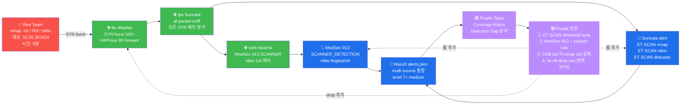

# Week 02 — 정찰 (Reconnaissance) — nmap / nikto / dirb / ffuf

> **PTES 의 2단계 Intelligence Gathering**. 침투 테스트의 첫 actual phase. 대상의
> 자산·서비스·기술 스택·취약점 잠재성을 식별한다. 본 주차는 6v6 환경에서 attacker
> 컨테이너가 fw / web 의 외부 노출을 정찰하는 R/B/P 1 사이클을 학습한다.

## 학습 목표

학생은 본 주차 종료 시 다음을 수행할 수 있어야 한다.

1. **Active vs Passive 정찰** 의 차이 + 각각의 윤리·법적 한계
2. **OSINT (Open Source Intelligence)** 의 5 카테고리 + 한국 환경 활용
3. **nmap 6 핵심 스캔 모드** + NSE (Nmap Scripting Engine) 의 활용
4. **nikto / dirb / gobuster / ffuf** 의 차이 + 적절한 사용처
5. **recon-ng / theHarvester** 의 OSINT 모듈 운영
6. 6v6 환경 정찰 1 사이클 → R/B/P 분석 작성
7. **Suricata + ModSec 의 detection** — 자신의 정찰 흔적이 Blue 측에 어떻게 노출되는가

## 강의 시간 배분 (3시간 40분)

| 시간      | 내용                                                                  | 유형     |
|-----------|-----------------------------------------------------------------------|----------|
| 0:00–0:25 | 이론 — Recon 의 정의 + Active vs Passive + OSINT 5 카테고리          | 강의     |
| 0:25–1:00 | nmap 6 스캔 모드 + NSE + timing template + 출력 형식                  | 강의     |
| 1:00–1:10 | 휴식                                                                   | —        |
| 1:10–1:30 | nikto / dirb / gobuster / ffuf 비교 + 적용 시나리오                    | 강의     |
| 1:30–2:00 | 실습 1, 2 — nmap 5 스캔 (-sT/-sS/-sV/-O/-sU)                          | 실습     |
| 2:00–2:30 | 실습 3, 4 — NSE + nikto                                              | 실습     |
| 2:30–2:40 | 휴식                                                                   | —        |
| 2:40–3:10 | 실습 5, 6 — ffuf 경로 + parameter fuzzing                            | 실습     |
| 3:10–3:30 | 실습 7 — R/B/P 보고서 작성 (정찰 흔적 분석)                          | 실습     |
| 3:30–3:40 | 정리 + W03 (웹 앱 구조 + Burp) 예고                                   | 정리     |

---

## 1. 정찰 (Reconnaissance) 의 정의

### 1.1 무엇인가?

**Reconnaissance** = "공격 대상에 대한 정보 수집". 군사 용어 (정찰병 / 정찰기) 에서
유래. 사이버 공격에서 70% 의 시간이 정찰에 쓰인다는 통설.

**왜 70% ?**
- 잘못된 정찰 → 무의미한 익스플로잇 시도 → 시간 낭비 + detect
- 정확한 정찰 → 정확한 익스플로잇 1 회 → 짧은 시간 + 낮은 detect

침투 테스트의 격언: **"공격은 1 분, 정찰은 1 시간."**

### 1.2 Active vs Passive

| 구분 | 정의 | 6v6 예 | 위험 |
|------|------|--------|------|
| **Passive** | 대상에 직접 패킷 발송 안 함 | DNS 조회 / whois / SHODAN 검색 | 거의 0 (외부 정보만 사용) |
| **Active** | 대상에 직접 패킷 | nmap port scan / nikto / dirb | high (IDS 즉시 detect) |

**운영 패턴**:
1. Passive 먼저 (탐지 안 됨)
2. Passive 결과로 가능성 좁히기
3. Active 마지막 (필요 최소한)

### 1.3 OSINT (Open Source Intelligence)

**OSINT** = 공개된 정보만으로 정보 수집. CIA 정의 "공개 출처에서 얻을 수 있는 정보를
수집·분석·평가". **법적으로 모두 합법** (정보가 이미 공개되어 있음).

5 카테고리:

| 카테고리 | 출처 | 도구 |
|----------|------|------|
| **Network** | whois / DNS / BGP / SHODAN | whois, dig, recon-ng, shodan-cli |
| **People** | LinkedIn / 회사 홈페이지 / Facebook | theHarvester, sherlock, hunter.io |
| **Code** | GitHub / GitLab / Stack Overflow | github-dork.py, gitleaks |
| **Documents** | 회사 PDF 의 metadata, sitemap.xml | exiftool, foca, metagoofil |
| **Dark Web** | Tor, breach DB | h8mail, holehe (별 학습) |

### 1.4 한국 환경의 OSINT 사례

- **공공기관**: 정보공개포털 (www.open.go.kr) → 시스템 발주 정보 (벤더, 버전)
- **상장사**: DART 전자공시 → IT 인프라 투자 보고서
- **개인**: 카카오톡 ID / 네이버 블로그 → 사회공학 (본 과목 RoE 외 — 금지)
- **취업 사이트**: 사람인 / 잡코리아 → 회사의 기술 스택 (Apache 2.4 / PostgreSQL 14 등)

### 1.5 윤리적 제한

본 과목 RoE 에 명시:
- 6v6 환경의 OSINT 만 (whois `10.20.30.x` 등은 의미 없으나 시뮬)
- 외부 회사 / 정부 사이트 OSINT = 본 과목 RoE 위반
- 실 OSINT 학습은 본인 환경 또는 공식 HackerOne 프로그램

---

## 2. nmap — 네트워크 스캐닝의 표준

### 2.1 역사 + 라이선스

- **1997** : Gordon "Fyodor" Lyon 가 Phrack #51 에 발표
- **2003** : NSE (Nmap Scripting Engine) 추가
- **2010** : Zenmap (GUI) + Nping + Ndiff 통합
- **2024** : 25+ 년 침투 테스트의 첫 도구. 거의 모든 보안 인증 (OSCP / CEH / PenTest+)
  에서 필수.
- 라이선스: GPL + NPSL (Nmap Public Source License)

### 2.2 동작 원리

```
공격자 호스트
    │
    │ raw socket 으로 TCP/UDP/ICMP 패킷 작성
    │ (TCP/IP stack 우회 — root 권한 필요)
    │
    ▼
target 호스트
    │
    │ kernel 의 TCP/IP stack 이 응답
    │ (RFC 791 / 793 에 정의된 표준 동작)
    │
    ▼
공격자 호스트가 응답 분석
    - SYN/ACK → port open
    - RST → port closed
    - 응답 없음 → filtered (방화벽 drop)
```

### 2.3 6 핵심 스캔 모드

#### 2.3.1 `-sT` TCP Connect Scan

```bash
nmap -sT -p 22,80,443 10.20.30.1
```

**동작**: 3-way handshake 완료 (SYN → SYN/ACK → ACK).
**권한**: 일반 사용자 OK (raw socket 미사용).
**장점**: 권한 불필요, 안정.
**단점**: 완전한 conn → Suricata / Wazuh 즉시 detect.
**언제 사용**: root 권한 없을 때 / 학습 환경.

#### 2.3.2 `-sS` TCP SYN Stealth

```bash
sudo nmap -sS -p- 10.20.30.1
```

**동작**: SYN 만 보내고 SYN/ACK 받으면 RST (half-open).
**권한**: root 필요 (raw socket).
**장점**: 빠르고 stealth (conn 완료 안 함).
**단점**: 모던 IDS 는 detect (반복 SYN/RST 패턴).
**언제 사용**: 표준 침투 테스트의 default.

#### 2.3.3 `-sV` Service Version Detection

```bash
nmap -sV -p 80 10.20.30.1
```

**동작**: open port 에 추가 프로빙 → 응답의 banner / response pattern 으로 daemon
이름 + 버전 식별.
**DB**: nmap-service-probes (10000+ signature).
**예상 출력**:
```
80/tcp open http HAProxy 2.4.x
```
**한계**: 버전 fake 가능 (사용자 정의 header).

#### 2.3.4 `-O` OS Detection

```bash
sudo nmap -O 10.20.30.1
```

**동작**: TCP/IP stack 의 미세 차이 (window size / TTL / TCP option 순서) 로 OS 식별.
**DB**: nmap-os-db (3500+ fingerprint).
**예상 출력**:
```
OS details: Linux 5.x - 6.x kernel
```
**한계**: 단일 호스트 detect 만 정확. NAT 뒤에서는 부정확.

#### 2.3.5 `-sU` UDP Scan

```bash
sudo nmap -sU -p 53,123,161 10.20.30.1
```

**동작**: UDP packet → ICMP unreachable 받으면 closed, 응답 받으면 open.
**한계**: UDP 는 stateless → open / filtered 구분 어려움 + 느림 (대부분 host 가
ICMP rate-limit).
**언제 사용**: DNS (53) / NTP (123) / SNMP (161) 확인 시.

#### 2.3.6 NSE (Nmap Scripting Engine)

```bash
nmap --script http-enum 10.20.30.1                 # HTTP enumeration
nmap --script vuln 10.20.30.1                       # 알려진 vuln 검사
nmap --script ssh-brute --script-args userdb=users.txt,passdb=pass.txt 10.20.30.1
```

**700+ Lua 스크립트** 가 `/usr/share/nmap/scripts/` 에 설치.

카테고리:
- `default` : 기본 스캔에 포함 (-sC 옵션)
- `auth` : 인증 우회 / brute force
- `vuln` : 알려진 CVE 검사
- `exploit` : 익스플로잇 (조심!)
- `intrusive` : detect 가능성 높음
- `safe` : 안전 (스캔만)
- `discovery` : 자산 발견

### 2.4 Timing Template (-T0 ~ -T5)

```
-T0 paranoid    : 5분 간격 (IDS 우회용, 매우 느림)
-T1 sneaky      : 15초 간격
-T2 polite      : 0.4초 간격
-T3 normal      : default
-T4 aggressive  : 빠름 (권장)
-T5 insane      : 매우 빠름 (놓침 가능)
```

**운영 권장**: `-T3` 또는 `-T4`. `-T0/-T1` 은 IDS 우회 의도 있을 때만.

### 2.5 출력 형식

```bash
nmap -oN scan.nmap host    # normal (사람 친화)
nmap -oX scan.xml host     # XML (자동화 친화)
nmap -oG scan.gnmap host   # grep-able (한 줄 = 한 host)
nmap -oA scan host         # 세 가지 동시 (scan.nmap / scan.xml / scan.gnmap)
```

XML 의 활용:
```bash
nmap -oX scan.xml -sV target
# 다른 도구로 import (Metasploit / DefectDojo / faraday)
db_import scan.xml    # msfconsole 명령
```

### 2.6 IDS 우회 옵션

```bash
nmap -f host                    # IP fragment (작은 chunks)
nmap -D RND:10 target           # decoy (가짜 source IP 10개 추가)
nmap --source-port 53 target    # source port 위장 (DNS 응답인 척)
nmap --data-length 50 target    # payload 추가 (signature 회피)
nmap --scan-delay 5s target     # 패킷 간 지연
```

**주의**: 본 과목 RoE 내에서만 사용 (외부 시스템 우회 시도 = 위법).

---

## 3. nikto — 웹 vuln 시그니처 스캐너

### 3.1 역사 + 라이선스

- **2001** : Chris Sullo 가 시작
- **2014~** : Open Web Security project (OWASP 연관)
- 라이선스: GPLv2
- 언어: Perl
- DB: 6700+ 알려진 web vuln + 1250 outdated server + 270 backdoor

### 3.2 동작 원리

```
1. target URL 의 robots.txt / sitemap.xml / favicon.ico → 첫 정보
2. 6700+ path 의 GET / HEAD 시도
3. 각 응답의 status / size / header 매칭
4. outdated server header (예: "Server: Apache/2.2.0") detect
5. 결과 출력 (text / XML / HTML / CSV)
```

### 3.3 주요 사용법

```bash
# 기본 스캔
nikto -h http://10.20.30.1 -port 80 -host juice.6v6.lab

# Tuning (특정 vuln 카테고리만)
nikto -h target -Tuning 9     # SQLi 만
nikto -h target -Tuning 4     # XSS 만
nikto -h target -Tuning x     # 전체

# 출력 형식
nikto -h target -Format html -output report.html
nikto -h target -Format xml -output report.xml

# 인증 (Basic / cookie)
nikto -h target -id admin:password
nikto -h target -Cookie "PHPSESSID=abc123"

# SSL
nikto -h https://target -ssl
```

### 3.4 nikto 의 한계

- **시그니처 기반** → 0-day / 변형 vuln 놓침
- **WAF 가 있으면 false-positive 폭증** (ModSec 의 403 응답을 vuln 으로 오해)
- **소음 큼** (Wazuh / Suricata 가 즉시 alert)

**언제 사용**: 빠른 첫 overview. 다른 도구로 검증.

---

## 4. 디렉토리·path 발견 — dirb / gobuster / dirsearch / ffuf

### 4.1 4 도구 비교

| 도구 | 언어 | 첫 출시 | 속도 | 특징 |
|------|------|---------|------|------|
| **dirb** | Perl | 2003 | 느림 | 가장 오래 + wordlist 통합 |
| **gobuster** | Go | 2014 | 빠름 | 작고 단순 |
| **dirsearch** | Python | 2014 | 보통 | 풍부한 옵션 + 한국어 wordlist |
| **ffuf** | Go | 2018 | 매우 빠름 | 모던 표준 + 다양한 fuzzing 모드 |

**운영 권장**: 2024 년에는 **ffuf 가 표준**.

### 4.2 ffuf 상세

**ffuf** (Fuzz Faster U Fool) — Joohoi 가 2018 출시. CLI 의 fuzzing 표준.

#### 4.2.1 기본 사용법

```bash
# 1. path fuzz (디렉토리 발견)
ffuf -u http://target/FUZZ -w wordlist.txt

# 2. parameter fuzz (URL parameter 값)
ffuf -u 'http://target/?id=FUZZ' -w num.txt

# 3. header fuzz (User-Agent / Cookie 등)
ffuf -u http://target -H "User-Agent: FUZZ" -w ua.txt

# 4. POST body fuzz
ffuf -u http://target/login -X POST -d "user=admin&pass=FUZZ" -w pass.txt

# 5. 다중 wordlist (-w wordlist.txt:KEYWORD)
ffuf -u http://target/FUZZ1/FUZZ2 -w paths.txt:FUZZ1 -w files.txt:FUZZ2 -mode pitchfork
```

#### 4.2.2 응답 필터

```bash
# status code 매칭
ffuf -u http://target/FUZZ -w wordlist -mc 200,302   # 200 또는 302 만
ffuf -u http://target/FUZZ -w wordlist -fc 403,404   # 403/404 제외

# 응답 크기 필터
ffuf -u http://target/FUZZ -w wordlist -fs 1234      # size 1234 제외

# regex 매칭
ffuf -u http://target/FUZZ -w wordlist -mr "Welcome"  # body 에 Welcome 있는 응답만

# 응답 시간 필터 (느린 응답 = SQLi blind 후보)
ffuf -u http://target/?q=FUZZ -w sql_payloads -mt ">3000"
```

#### 4.2.3 속도·동시성

```bash
ffuf -u http://target/FUZZ -w wordlist -t 100        # thread 100 (default 40)
ffuf -u http://target/FUZZ -w wordlist -rate 50      # 초당 50 요청 (rate limit)
ffuf -u http://target/FUZZ -w wordlist -p 0.5        # 요청 간 0.5초 delay
```

#### 4.2.4 wordlist 추천

- **SecLists** (https://github.com/danielmiessler/SecLists) — 표준 list 통합
  - `Discovery/Web-Content/common.txt` (4500 단어)
  - `Discovery/Web-Content/big.txt` (20K 단어)
  - `Discovery/Web-Content/raft-medium-directories.txt`
  - `Discovery/DNS/subdomains-top1million-5000.txt`
- **rockyou.txt** — 비밀번호 brute (W06)

---

## 5. OSINT 도구 — recon-ng / theHarvester

### 5.1 recon-ng

```
역사: 2014 Tim Tomes. Metasploit 식의 modular OSINT framework.
라이선스: GPL
모듈 100+ : 도메인 / 호스트 / 이메일 / 사용자 / 회사 정보
DB 통합: 결과를 자동 SQLite 저장
```

기본 사용법:

```bash
recon-ng                                    # 진입
> marketplace install hackertarget          # 모듈 설치
> modules load recon/domains-hosts/hackertarget
> options set SOURCE example.com
> run
```

본 과목에서는 **외부 도메인 정찰 = RoE 위반**. 시연 + 패턴 학습만.

### 5.2 theHarvester

```
역사: 2011 Christian Martorella (edge-security).
라이선스: GPLv3
용도: 이메일 / subdomain / IP / 회사 직원 정보 수집
```

기본 사용법:

```bash
theHarvester -d example.com -b google,bing      # Google + Bing 검색
theHarvester -d example.com -b linkedin         # LinkedIn
theHarvester -d example.com -b all              # 모든 소스
```

본 과목 외부 사용 금지 (RoE).

---

## 6. ATT&CK Reconnaissance Tactic 매핑

| Technique ID | 이름 | 본 과목 도구 |
|--------------|------|--------------|
| T1595.001 | Active Scanning - IP Block | nmap -sT/-sS |
| T1595.002 | Active Scanning - Vuln Scan | nmap -sV/--script vuln, nikto |
| T1595.003 | Active Scanning - Wordlist Scan | dirb / ffuf |
| T1592.001 | Gather Victim Host - Hardware | nmap -O |
| T1592.002 | Gather Victim Host - Software | nmap -sV |
| T1594 | Search Victim-Owned Websites | nikto, dirb |
| T1589.001 | Gather Victim Identity - Credentials | (별 학습) |
| T1589.002 | Gather Victim Identity - Email Addresses | theHarvester |
| T1590.005 | Gather Victim Network - IP Addresses | nmap |

---

## 7. R/B/P 시나리오 — 정찰 1 사이클



**해석**:
- Red 의 5분 정찰 → fw / ips / web 의 3 hop 통과
- Blue 측 3 도구 (Suricata / ModSec / Wazuh) 모두 alert
- Purple 측 Coverage Matrix + 4 권장 룰

**본인 정찰 시 예상 Blue alert**:
| Red 행위 | Blue 측 alert |
|----------|---------------|
| `nmap -sS -p- 10.20.30.1` | Suricata: ET SCAN Possible Nmap |
| `nikto -h ...` | ModSec 913xxx + Suricata ET SCAN Nikto |
| `ffuf -u .../FUZZ -w common.txt` | Wazuh 의 Apache 404 burst (rule 31151) |
| `dirb http://...` | ET SCAN dirbuster |

---

## 8. 실습 1~7

### 실습 1 — nmap 기본 5 스캔 (5 모드 비교)

```bash
# 5 모드 순차 실행 + 비교 분석
ssh 6v6-attacker '
echo "=== -sT TCP Connect ==="
nmap -sT -p 22,80,443 10.20.30.1 2>&1 | tail -10

echo "=== -sS SYN Stealth (root 필요) ==="
sudo nmap -sS -p 22,80,443 10.20.30.1 2>&1 | tail -10

echo "=== -sV Service Version ==="
sudo nmap -sV -p 80 10.20.30.1 2>&1 | tail -10

echo "=== -O OS Detection ==="
sudo nmap -O 10.20.30.1 2>&1 | head -20

echo "=== -sU UDP (느림 — 3 port 만) ==="
sudo nmap -sU -p 53,123,161 10.20.30.1 2>&1 | tail -10
'
```

**예상 출력 분석**:
```
80/tcp   open    http
443/tcp  open    https
22/tcp   filtered ssh    (fw input chain 의 22 미허용 → filtered)

-sV: 80/tcp open http HAProxy 2.4.x
-O:  OS: Linux 5.x - 6.x

-sU 53: closed   (fw 의 DNS 미운영)
-sU 123: closed
-sU 161: closed
```

**해석**:
- 22 가 `filtered` (RST 응답 안 옴) → fw 의 nftables input chain 이 drop (W02 secuops 참조)
- `-sV` 가 HAProxy 식별 → 외부 진입 = HAProxy → W03 의 vhost 라우팅 학습 필요
- `-O` 가 Linux 6.x → 최근 커널 → kernel exploit 가능성 낮음

### 실습 2 — 전체 IP block 스캔 (ping sweep)

```bash
# -sn = ping sweep = port scan 안 함, 살아 있는 host 만
# /24 = 254 host (네트워크/브로드캐스트 제외) → 10~30초 소요
ssh 6v6-attacker '
echo "=== ext bridge 의 활성 host (10.20.30.0/24) ==="
nmap -sn 10.20.30.0/24 2>&1 | grep "Nmap scan report" | head
'
```

**예상 출력**:
```
Nmap scan report for 10.20.30.1     (fw)
Nmap scan report for 10.20.30.201   (bastion)
Nmap scan report for 10.20.30.202   (attacker — 자신)
```

**해석**:
- 3 host 만 active → ext bridge 에 attacker + bastion + fw 만 있음
- dmz / int 의 host (10.20.32.x / 10.20.40.x) 는 직접 접근 불가 (fw 가 라우터)

### 실습 3 — NSE 스크립트 (http-enum + vuln)

```bash
ssh 6v6-attacker '
echo "=== http-enum (디렉토리 enumeration) ==="
nmap --script http-enum -p 80 10.20.30.1 \
    --script-args http-enum.basepath=/,http.host=juice.6v6.lab 2>&1 | tail -20

echo "=== vuln (알려진 CVE 검사) ==="
nmap --script vuln -p 80 10.20.30.1 \
    --script-args http.host=juice.6v6.lab 2>&1 | tail -20

echo "=== http-headers ==="
nmap --script http-headers -p 80 10.20.30.1 \
    --script-args http.host=juice.6v6.lab 2>&1 | tail -10
'
```

**예상 발견**:
- `/admin/` 등 잠재 path
- HTTP headers (Server / X-Frame-Options / CSP 등)
- vuln 카테고리 → 모던 환경에서는 false-positive 다수

### 실습 4 — nikto (웹 시그니처 스캐너)

```bash
ssh 6v6-attacker '
echo "=== nikto 빠른 스캔 ==="
nikto -h http://10.20.30.1 -port 80 -host juice.6v6.lab \
    -maxtime 60 2>&1 | tail -30 || true
'
```

**예상 발견 패턴**:
```
+ Server: HAProxy
+ /admin: 발견 (status code 200/403)
+ X-Frame-Options header is not set
+ Cookie 의 Secure 미설정
+ Apache/2.4.x: outdated 가능
```

**한계 인지**:
- nikto 의 6700 시그니처 대부분 ModSec 차단 → false-positive
- 실 vuln 1-2 개 발견 가능 (header 누락 등)

### 실습 5 — ffuf path fuzzing

```bash
ssh 6v6-attacker '
echo "=== ffuf 경로 fuzz (common.txt 4500 word) ==="
timeout 60 ffuf \
    -u "http://10.20.30.1/FUZZ" \
    -H "Host: juice.6v6.lab" \
    -w /usr/share/dirb/wordlists/common.txt \
    -mc 200,302 \
    -fc 403 \
    -t 50 2>&1 | tail -30 || true
'
```

**옵션 해석**:
- `-u .../FUZZ`: FUZZ 위치에 wordlist 단어 대체
- `-H "Host: ..."`: HAProxy vhost 라우팅
- `-w wordlist`: 사용할 wordlist 경로
- `-mc 200,302`: matched code (200 또는 302 만 출력)
- `-fc 403`: 403 응답 filter (ModSec 차단 무시)
- `-t 50`: 50 thread 동시 (속도)

**예상 출력 (juice.6v6.lab)**:
```
/api    [Status: 200, Size: ...]
/admin  [Status: 200, Size: ...]
/assets [Status: 200, Size: ...]
```

### 실습 6 — ffuf parameter fuzzing (Advanced)

```bash
ssh 6v6-attacker '
echo "=== ffuf parameter fuzz (다양한 parameter 시도) ==="
# 알려진 parameter list (id / page / file / debug / ...) 시도
cat <<EOF > /tmp/params.txt
id
page
file
debug
admin
test
include
path
search
q
EOF

timeout 60 ffuf \
    -u "http://10.20.30.1/?FUZZ=1" \
    -H "Host: juice.6v6.lab" \
    -w /tmp/params.txt \
    -mc 200,302 \
    -fc 404 2>&1 | tail -20 || true
'
```

**활용**: 발견된 parameter 는 W04 SQLi / W07 LFI 에서 직접 공격 대상.

### 실습 7 — R/B/P 보고서 작성

본인의 정찰 행위가 Blue 측에 어떻게 노출되었는지 분석.

```bash
# Red 시점 — 본인이 실행한 모든 명령 history
history | tail -30 > /tmp/red_log.txt

# Blue 시점 — Suricata 의 alert
ssh 6v6-ips '
echo "=== Suricata 의 ET SCAN alert (최근 10분) ==="
sudo tail -200 /var/log/suricata/eve.json | \
    jq "select(.event_type==\"alert\" and (.alert.signature | tostring | contains(\"SCAN\")))" 2>/dev/null | head -20
'

# Blue 시점 — Wazuh manager alerts.json
ssh 6v6-siem '
echo "=== Wazuh 의 web/ips agent alert (최근 10분) ==="
sudo tail -100 /var/ossec/logs/alerts/alerts.json | \
    jq "{rule_id:.rule.id, desc:.rule.description, agent:.agent.name}" 2>/dev/null | head -20
'

# Blue 시점 — ModSec audit log (web)
ssh 6v6-web '
echo "=== ModSec 913 SCANNER_DETECTION alerts ==="
sudo tail -10 /var/log/apache2/modsec_audit.log | head -1 | \
    jq ".transaction.messages[] | select(.id | startswith(\"913\"))" 2>/dev/null
'
```

**R/B/P 보고서 양식** (1 페이지):

```markdown
# W02 R/B/P 보고서 — 정찰

## Red 시점
- 실행 명령: nmap / nikto / ffuf 5 회
- 소요 시간: 30 분
- 대상: 10.20.30.0/24 + juice.6v6.lab

## Blue 시점
| 도구 | alert 수 | 대표 룰 |
| Suricata | N | ET SCAN Nmap, ET SCAN Nikto |
| ModSec | M | 913100 SCANNER_DETECTION |
| Wazuh | K | rule 31151 (404 burst), 86xxx (Suricata bridge) |

## Purple 시점
- Coverage Matrix:
  | Tactic | Red 실행 | Blue 탐지 | Coverage |
  | TA0043 Recon | ✓ | ✓ (3 source) | 100% |

- Detection Gap: (없음 — 모두 탐지)

- 권장:
  1. Suricata threshold (60초 5건 → 1 alert) — alert flood 방지
  2. ModSec paranoia level 2 단계 상승 → false-negative 감소
  3. CDB list 의 known scanner UA 자동 차단

## 학습 인사이트
- 정찰의 70% 가 OSINT (passive) 라면 active 시 detect 노출
- 운영 환경 침투 시 정찰 시 detect 최소화 필수
```

---

## 9. 한국 사례 + 표준 매핑

### 9.1 KISA 침해사고 보고서 — 정찰 단계 분석

대부분 KISA 의 침해사고 보고서가 **정찰 단계의 흔적이 있다** 고 보고:
- 사고 전 1-2주에 비정상 nmap 패턴 검출 (있다면)
- WAF / IDS 의 정찰 alert 가 분석가 손에 안 가서 사고 발생
- 운영 시 정찰 alert 도 우선순위 부여 (level 7+)

### 9.2 ISMS-P 2.10.7 (보안위협 대응)

본 주차의 정찰 시뮬 + R/B/P 분석 = 본 통제의 입증 자료.

### 9.3 OWASP 의 WSTG (Web Security Testing Guide)

OWASP-WSTG-INFO 카테고리 = 본 주차의 표준:
- WSTG-INFO-01: 검색 엔진 발견
- WSTG-INFO-02: 웹서버 fingerprint
- WSTG-INFO-04: enumeration of applications
- WSTG-INFO-05: 페이지 comment + metadata
- WSTG-INFO-07: application 진입점 매핑
- WSTG-INFO-08: web application framework
- WSTG-INFO-09: web application 식별
- WSTG-INFO-10: application 아키텍처 매핑

---

## 9.5 Windows 호스트 정찰 — 포트와 서비스 (W03 secuops 위빙)

본 주차의 정찰 도구(nmap/nikto/dirb/ffuf) 는 웹 위주다. Windows 사용자 PC (user 구역 10.20.33.60)
정찰은 다른 포트 셋을 살펴야 한다.

### Windows 정찰 — 핵심 포트 + 서비스

| 포트 | 서비스 | 의미 |
|------|--------|------|
| 22 | OpenSSH (Win32) | 우리 6v6 의 Windows 는 OpenSSH 가 켜져 있음 (관리 목적) |
| 135 | RPC Endpoint Mapper | DCOM/RPC 의 진입점 |
| 139 / 445 | SMB | 공유·세션·null-session |
| 3389 | RDP | 원격 데스크톱 (W03 win-s05 의 표적) |
| 5985 / 5986 | WinRM | PowerShell remoting (http/https) |
| 49152+ | RPC 동적 포트 | 매우 다양 |

### nmap 명령 — Windows 호스트 정찰

```
nmap -p 22,135,139,445,3389,5985 -sV --script=smb-os-discovery,smb-enum-shares 10.20.33.60
```

> 본 인프라의 fw 정책에 의해 일부 포트는 외부에서 닫혀 있을 수 있다 (W03 의 다층 방어). 정찰
> 결과 — fw 가 차단하는지, 호스트가 닫고 있는지 — 의 구분은 다음 주차의 BurpSuite 와 다음 학기
> 의 IDS 우회(W10) 에서 다룬다.

### 윤리 — 정찰의 범위

> 본 강의의 모든 정찰은 6v6 내부 호스트에 한정한다. **외부 호스트(인터넷 IP) 에 대한 nmap 도
> 명시적 허락 없이는 금지**. 한국 정보통신망법 위반 가능. 동의받은 환경에서만 학습한다.

---

## 10. 과제

### A. 정찰 보고서 (필수, 40점)

다음 모두 포함:
1. 6v6 환경의 모든 살아 있는 host + port + service 표
2. nmap -sV / -O 의 결과 분석
3. ffuf 의 발견 path 5+ + 각 path 의 추정 용도
4. ATT&CK Technique 매핑 (각 도구 → T1595.x)

### B. R/B/P 보고서 (심화, 30점)

실습 7 의 양식대로 R/B/P 분석 + Coverage Matrix + 권장 룰 3+.

### C. OSINT 모의 실습 (정성, 30점)

본인이 가상의 회사 (이름 자유 — 예: "k-univ.example") 의 OSINT 5 카테고리를 어떻게
수행할지 plan 작성. **실제 외부 사이트 OSINT 금지**. 패턴 / 도구 / 한계 분석만.

---

## 11. 평가 기준

| 항목 | 비중 |
|------|------|
| 정찰 보고서 (A) | 40% |
| R/B/P 보고서 (B) | 30% |
| OSINT 모의 (C) | 30% |

---

## 12. 핵심 정리 (10 줄)

1. **Reconnaissance = 침투 테스트의 첫 actual phase**, 70% 시간 소요.
2. **Active vs Passive** — passive (OSINT) 먼저, active (스캔) 마지막.
3. **OSINT 5 카테고리** (Network / People / Code / Documents / Dark Web).
4. **nmap 6 모드** — -sT / -sS / -sV / -O / -sU / NSE.
5. **nikto** = 시그니처 기반 빠른 overview, **ffuf** = 모던 fuzzing 표준.
6. **timing template -T0~-T5** 로 detect 회피 가능 (RoE 내).
7. **ATT&CK Recon Tactic** (T1595 / T1592 / T1594) 매핑.
8. **R/B/P** — Red 의 정찰이 Blue 의 Suricata / ModSec / Wazuh 3 도구 모두에 detect.
9. **본인 RoE** — 외부 시스템 정찰 금지, 6v6 환경 + 학습 OSINT 만.
10. **W03 (웹 앱 구조 + Burp)** 다음 주차 예고.
