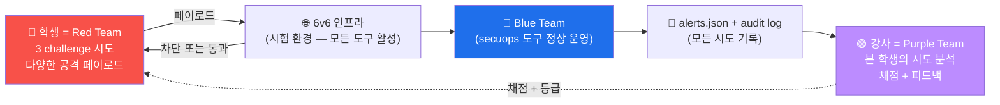

# Week 08 — 중간고사 — CTF (Capture The Flag) 형식 (90분)

> 본 주차는 attack W01-W07 의 종합 평가. **CTF (Capture The Flag) 형식** 으로 진행.
> 8 vuln 사이트 중 3 challenge 무작위 제공. 각 challenge 의 flag 추출 + 풀이 과정
> 제출. 시험 종료 후 1주 안에 결과 + 등급 + 피드백.

## 1. CTF 의 정의 + 형식

### 1.1 CTF 란?

```
CTF = Capture The Flag
      가상 환경의 vuln 을 해결하여 hidden "flag" (string) 를 발견·제출
      해커 / 보안 연구자 / 학생의 종합 시험 형식
역사: 1996 DEF CON 4 첫 CTF
유명 CTF: DEF CON / Pwn2Own / Google CTF / HackTheBox / TryHackMe / 한국 KISA CTF
```

### 1.2 본 시험의 형식

| 항목 | 내용 |
|------|------|
| 시간 | 90분 (정시 종료, 5분 전 카운트다운) |
| 문제 수 | 3 challenge (각 30점 + 보너스 10점) |
| 도구 | 모든 도구 사용 가능 (Burp / sqlmap / nmap / curl / ffuf / hydra) |
| 인터넷 | 검색 허용 (단, 다른 학생 / AI 어시스턴트 communication 금지) |
| 답안 | flag string + 풀이 과정 (명령어 + 출력) 1 페이지 |
| 정리 | 시험 후 30분 안에 본인 환경 cleanup (룰 / 파일 / cookie 등) |

### 1.3 시험 규칙

```
✅ 허용:
  - 강의 자료 (W01-W07 lecture md + lab yaml)
  - 모든 공격 도구 (attacker 컨테이너의 13 도구)
  - 인터넷 검색 (Google / Stack Overflow / OWASP)
  - 본인 메모

❌ 금지:
  - 다른 학생과 communication
  - AI 어시스턴트 (ChatGPT / Claude / Copilot)
  - 다른 학생의 환경 침투
  - 시험 종료 후 환경 미정리
  - 외부 시스템 공격 (정통망법 위반)
```

---

## 2. 3 Challenge 상세

### 2.1 Challenge 1 (30점) — Reflected XSS bypass

#### 문제

> juice.6v6.lab 의 search field 에 ModSec 941 룰을 우회하는 XSS payload 를 보내고
> `alert(1)` 이 실행 되도록 한다.

#### 평가

```
- 5점: paranoia 1 우회 가능한 페이로드 시도 (최소 3 변형)
- 10점: ModSec 응답 의 audit log 의 941 룰 매치 ID 추출
- 10점: 통과한 페이로드 1+ (200 응답 + 페이로드 그대로 반사)
- 5점: 보고서 (페이로드 + 우회 원리 + 권장 강화)
```

#### Hint

- W05 의 12 변형 페이로드 중 nested / encoding / event handler 시도
- paranoia 1 의 약점 ([OWASP CRS](https://coreruleset.org) 의 known bypass 검색)
- libinjection 의 fingerprint 회피

#### flag 형식

```
flag = SHA256("xss-bypass:" + 본인의 통과 페이로드)
```

### 2.2 Challenge 2 (30점) — SQLi data exfil

#### 문제

> dvwa.6v6.lab 의 SQLi (low 수준) 에서 `users` 테이블의 모든 컬럼 + row 추출.
> flag = admin 사용자의 password hash.

#### 평가

```
- 5점: SQLi 가능 확인 (boolean / UNION 시도)
- 10점: 컬럼 수 추정 + UNION SELECT 페이로드
- 10점: information_schema 활용 → users 테이블 + 컬럼명 식별
- 5점: admin user 의 password hash 추출
```

#### Hint

- W04 의 UNION SELECT 4 단계
- ORDER BY N 으로 컬럼 수 추정
- DVWA 의 default credential 변경되지 않은 경우 (admin/password) 의 hash

#### flag 형식

```
flag = admin 사용자의 password 의 hash 값 (MD5 또는 SHA256)
```

### 2.3 Challenge 3 (30점) — IDOR + JWT 변조

#### 문제

> JuiceShop 의 `/api/Users/N` (N=1~5) 접근 시도. 다른 사용자의 데이터 발견 +
> JWT 변조로 admin 권한 획득. flag = admin@juice-sh.op 의 wallet balance.

#### 평가

```
- 10점: IDOR 시도 + 5 user 의 응답 코드 + 정보 노출 분석
- 10점: JWT 디코드 + 변조 시도 (alg=none 또는 다른 방법)
- 10점: admin 권한으로 wallet balance API 호출 성공
```

#### Hint

- W06 의 JWT 변조 (alg=none / weak secret)
- `/rest/wallet/balance` 또는 유사 endpoint
- 일부 endpoint 가 인증 없이 노출 (IDOR challenge 의 핵심)

#### flag 형식

```
flag = admin 사용자의 wallet balance 정수 값
```

### 2.4 시간 보너스 (10점)

```
45분 안에 3 challenge 모두 해결 → +10점
60분 안에 → +5점
90분 끝까지 → +0점 (시간 보너스 없음)
```

---

## 3. 시험 진행 절차

### 3.1 시험 시작 전 (5분)

```
1. 본인 PC 에서 attacker 컨테이너 진입
   ssh ccc@<VM_IP> -p 2202   (또는 6v6-attacker)

2. 본인 환경 점검
   - 13 도구 모두 동작
   - 8 vuln 사이트 응답
   - bastion API 응답

3. 본인 메모 / 강의 자료 준비

4. 답안 파일 생성
   touch /tmp/midterm_<본인 학번>.md
```

### 3.2 시험 중 (90분)

```
1. 강사가 무작위 3 challenge 배포 (위 §2 중 일부 + 변형)
2. 각 challenge 별 :
   a. 문제 읽기 (1분)
   b. 정찰 (5분 — endpoint / 응답 분석)
   c. 공격 시도 (15-25분 — 다양한 페이로드)
   d. flag 추출 + 풀이 정리 (5분)
3. 본인 풀이 답안 파일에 기록 (명령어 + 출력 + flag)
```

### 3.3 답안 양식 (1 페이지)

```markdown
# 중간고사 답안 — <학번 / 이름>
# 제출 시간: <2026-MM-DD HH:MM>

## Challenge 1 — XSS Bypass
flag: <SHA256 값>
풀이:
  1. 시도 페이로드: <list>
  2. 통과 페이로드: <string>
  3. 우회 원리: <설명>
  4. ModSec 매치 룰 ID: <리스트>

## Challenge 2 — SQLi Exfil
flag: <password hash>
풀이:
  1. SQLi 가능 확인: <명령 + 출력>
  2. 컬럼 수 추정: <ORDER BY 결과>
  3. UNION SELECT: <페이로드>
  4. admin hash 추출: <SQL + 결과>

## Challenge 3 — IDOR + JWT
flag: <balance 정수>
풀이:
  1. IDOR 시도: <user 1-5 응답>
  2. JWT 변조: <method + 결과>
  3. admin 권한 호출: <endpoint + 응답>

## 자기 평가
시간 소요: <분>
어려웠던 점: <설명>
배운 점: <설명>
```

### 3.4 시험 후 (30분)

```
1. 답안 파일 강사에게 제출 (LMS 또는 email)
2. 본인 환경 cleanup
   - 본인이 추가한 ModSec / Wazuh 룰 제거
   - 임시 파일 (/tmp/) 정리
   - history clear (필요 시)
   - 변조된 cookie / JWT 정리
3. 다른 학생에 영향 있는 변경 (CDB list 등) 즉시 복구
```

---

## 4. 평가 매트릭스

| 점수 | 등급 | 의미 |
|------|------|------|
| 90+ | **A** | W09 부터 advanced track 자격 |
| 80-89 | **B+** | 정상 진행 |
| 70-79 | **B** | 정상 진행 |
| 60-69 | **C+** | 부분 재시험 (W01-W07 중 약점 1~2 주차) |
| 50-59 | **C** | 부분 재시험 (W01-W07 중 약점 3+ 주차) |
| 0-49 | **F** | 재수강 (다음 학기) |

총 100점 (3 challenge 90 + 시간 보너스 10).

---

## 5. CTF 학습 방법 + 시험 대비

### 5.1 CTF 학습 플랫폼 (시험 전 권장)

- **HackTheBox** (https://hackthebox.com) — 가장 표준
- **TryHackMe** (https://tryhackme.com) — 초중급 친화
- **PicoCTF** (https://picoctf.org) — Carnegie Mellon, 무료
- **OverTheWire** (https://overthewire.org) — Bandit / Natas (Linux + web)
- **PortSwigger Web Security Academy** (https://portswigger.net/web-security) — 무료, Burp 공식

### 5.2 한국 CTF

- **KISA CTF** : 매년 KISA 가 개최
- **HackTheon** : 사이버보안인재 양성을 위한 대회
- **DEFCON 한국팀** : 매년 DEFCON CTF 진출
- **K-Shield** : 정부 주관

### 5.3 시험 직전 1주 학습 plan

```
일요일: W01-W03 review (개념 + 환경)
월: W04 SQLi — sqlmap + DVWA 1 시간 + 다양한 페이로드
화: W05 XSS — 12 변형 + CSP 우회
수: W06 인증 — hydra + JWT alg=none
목: W07 SSRF + 파일 업로드 + Path
금: PortSwigger Academy 의 free lab 5 개 풀기
토: 모의 시험 (3 challenge 90 분)
일: 약점 보강
```

---

## 6. R/B/P 시나리오 — 시험 중 발생 상황



**핵심**: 시험 중에도 secuops 의 모든 도구가 정상 운영 → 학생의 시도 자체가 audit log 에
기록 → 강사가 채점 시 본인 시도 분석.

---

## 7. 시험 환경 (학생용 안내)

### 7.1 학생 PC 준비

```
1. SSH client (terminal)
2. 브라우저 (Chrome / Firefox)
3. Burp Suite Community (선택 — XSS challenge 도움)
4. 학생 PC 의 /etc/hosts (또는 Windows 의 hosts) 에 6v6 vhost 매핑:
   <VM_IP> juice.6v6.lab dvwa.6v6.lab admin.6v6.lab ...

5. ssh_config 의 6v6-bastion + 6v6-attacker entry (W01)
```

### 7.2 시험 환경 의 limit

```
- 시험 30분 안에 cleanup 미완 → -10점
- 다른 학생 환경 침투 (정통망법 위반) → 즉시 0점 + 학사 처벌
- 답안에 다른 학생 풀이 가져온 흔적 → 0점
- 외부 시스템 공격 흔적 (외부 IP 의 nmap 등) → 0점 + 학사 처벌
```

---

## 8. 시험 후 일정

```
시험 종료 + 30분: cleanup 검증 (강사)
시험 종료 + 1일: 답안 채점 (1차)
시험 종료 + 3일: 학생 피드백 제공
시험 종료 + 1주일: 등급 공지
시험 종료 + 2주일: 재시험 (C+ 이하 학생)
```

---

## 9. 시험 후 학습 권장

### 9.1 모든 학생 (등급 무관)

- 본인 답안 review + 강사 피드백 검토
- 못 푼 challenge 의 정답 분석 (강사 release 후)
- W09-W14 의 advanced 학습 준비

### 9.2 A 등급 (advanced track)

- HackTheBox / TryHackMe 의 Medium-Hard machine 1+ 풀기
- bug bounty 입문 (HackerOne)
- W13-W14 Caldera 자동화 심화

### 9.3 C 이하 (재시험)

- W01-W07 의 약점 주차 lecture 재독
- PortSwigger Academy 의 free lab 10+ 풀기
- 강사 office hour 활용

---

## 9.5 보너스 챌린지 — Windows 직원 PC 우회 다운로드 (W03 secuops 위빙)

본 중간고사에 보너스 챌린지 1건 — Windows victim PC 시각 — 을 추가한다 (10점, 시험 시간 内 선택).

### 보너스 챌린지 — "Windows Endpoint Initial Foothold"

> 시나리오: 직원 PC (10.20.33.60) 에서 다음을 달성하라.
>
> (a) iwr 또는 curl 로 외부에 호스팅된 의심 URL 에 1회 요청을 보내고 (도달 여부 무관),
>     그 행위가 Sysmon EID 3 의 카운트로 1 이상 증가했음을 증명하라.
> (b) PowerShell `-EncodedCommand` 한 번 실행하고, 그 행위가 Sysmon Message 에서 `EncodedCommand`
>     키워드로 매칭됨을 증명하라.
> (c) 위 (a)(b) 가 SOC 분석가 시각에서 어느 ATT&CK Technique (서브 포함) 에 매핑되는지 1줄.

### 평가 항목 (10점)

```
3점: (a) 의 명령 + Sysmon EID 3 카운트 증명
3점: (b) 의 명령 + Sysmon Message EncodedCommand 매칭 증명
2점: (c) 의 매핑 정확성 (T1071/T1059.001 등)
2점: 분석가가 이걸 어떻게 잡는지 1문장 설명 (Wazuh KQL 또는 SIEM Discover)
```

> 본 보너스는 W03 의 R/B/P 실습 경험 그대로 시험에 적용. 학생은 공격자 시각과 분석가 시각을 한
> 답안에서 모두 보여야 한다 (Red Team 의 자기 인식).

---

## 10. ATT&CK 시험 매핑

본 시험의 3 challenge 가 다음 ATT&CK Technique 평가:

| Challenge | ATT&CK Technique |
|-----------|------------------|
| XSS Bypass | T1059.007 + T1190 + T1185 |
| SQLi Exfil | T1190 + T1213 + T1505.003 |
| IDOR + JWT | T1078 + T1550 + T1190 |

---

## 11. 핵심 정리 (시험 직전 review)

1. **W01** : RoE + PTES + ATT&CK + 13 도구 + 8 vuln 사이트
2. **W02** : nmap 5 mode / nikto / ffuf / OSINT
3. **W03** : HTTP 9 method / 40 status / 15 header / JWT decode / Burp 7 도구
4. **W04** : 4 SQLi 타입 / sqlmap / DVWA 4 수준 / 942 + libinjection
5. **W05** : 3 XSS 타입 / 12 변형 / CSP 우회 5 / 941 + libinjection-XSS
6. **W06** : 4 인증 방식 / hydra / JWT 5 약점 / IDOR 5 / OAuth
7. **W07** : SSRF / 파일 업로드 / Path Traversal / RCE / XXE / 930+932+921

**시험 시간 90분 — 시간 관리가 핵심**. 한 challenge 에 30 분 이상 막히면 다른 challenge
로 이동 + 마지막에 돌아오기.

---

## 12. 다음 주차 (W09) 예고

W09 부터 심화 Red Team — 네트워크 공격 + 패킷 분석 (tcpdump / scapy).
ARP spoofing / DNS poisoning / TCP RST injection.
