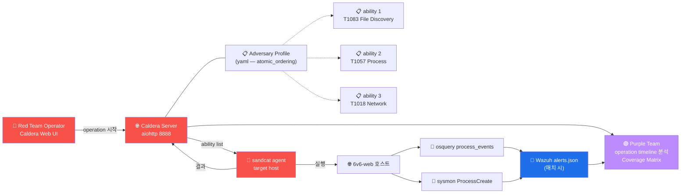

# Week 13 — MITRE Caldera (1) — Adversary Emulation 자동화

> **MITRE Caldera** = 2018 MITRE 의 오픈소스 **adversary emulation platform**. ATT&CK
> 의 Technique 을 yaml ability 로 정의 + adversary profile 로 묶어 + agent 가
> 자동 실행. Red Team 의 자동화 표준. 본 주차 (W13) + W14 의 2 주에 걸쳐 학습.

## 학습 목표

학생은 본 주차 종료 시 다음을 수행할 수 있어야 한다.

1. **Caldera 의 정의·역사·라이선스**
2. **아키텍처** (Server + Agent + Ability + Adversary + Operation + Plugin)
3. **ability yaml 작성** (ATT&CK Technique 매핑 + platform / command / parser)
4. **adversary profile** (atomic_ordering / 여러 ability 묶음)
5. **sandcat / manx / ragdoll** agent 3 종 차이
6. **plugin 6+** (stockpile / training / fieldmanual / manx / atomic / response)
7. **Atomic Red Team** vs Caldera 의 차이
8. **운영 시나리오** — Red Team consultant / Purple Team / compliance audit

## 강의 시간 배분 (3시간 40분)

| 시간      | 내용                                                                | 유형 |
|-----------|---------------------------------------------------------------------|------|
| 0:00–0:30 | 이론 — Caldera 의 정의·역사·운영 가치                                 | 강의 |
| 0:30–1:00 | 이론 — 아키텍처 + 5 핵심 객체                                        | 강의 |
| 1:00–1:10 | 휴식                                                                 | —    |
| 1:10–1:40 | 이론 — ability yaml + adversary profile                              | 강의 |
| 1:40–2:00 | 이론 — agent 3 종 + plugin 6+                                        | 강의 |
| 2:00–2:30 | 실습 1, 2 — ability yaml 작성 + Atomic Red Team 비교                | 실습 |
| 2:30–2:40 | 휴식                                                                 | —    |
| 2:40–3:10 | 실습 3, 4 — adversary profile + operation 시뮬                       | 실습 |
| 3:10–3:30 | 실습 5 — R/B/P 시뮬                                                  | 실습 |
| 3:30–3:40 | 정리 + W14 (Purple Team) 예고                                        | 정리 |

---

## 1. Caldera 의 정의

### 1.1 정의 + 역사

```
역사:    2018 MITRE 의 ATT&CK 의 자동화 platform
라이선스: Apache 2.0
언어:    Server: Python (aiohttp 비동기) + Agent: Go (sandcat) / Python (manx) / PowerShell (ragdoll)
크기:    Server + 6 default plugin
최신:    5.x (2024)
홈페이지: https://caldera.mitre.org
GitHub:  https://github.com/mitre/caldera
```

### 1.2 왜 Caldera 가 필요한가?

```
Red Team engagement 의 문제:
  1. 매번 manual 실행 (반복 작업)
  2. 표준화 부재 (각 Red Teamer 가 다른 명령)
  3. ATT&CK 매핑 명시적 X
  4. Blue Team 과 협업 어려움 (Red 가 무엇 했는지 정확히 알기 어려움)

Caldera 의 답:
  1. yaml 의 ability 로 자동화 + 표준화
  2. ATT&CK Technique 와 1:1 매핑
  3. operation 의 모든 단계 timeline + log
  4. Blue Team 과 같은 yaml 로 협업 (Purple Team)
```

### 1.3 운영 시나리오 4

| 시나리오 | 사용자 | 결과물 |
|----------|--------|--------|
| Red Team consultant | 외부 침투 테스터 | adversary 캠페인 결과 보고서 |
| Purple Team | 내부 보안팀 | Coverage Matrix + Gap 분석 |
| Compliance audit | CISO / 감사인 | ATT&CK 의 detection 능력 입증 |
| Training | 학습자 | ATT&CK Technique 의 실습 |

---

## 2. Caldera 아키텍처

### 2.1 5 핵심 객체

```
┌───────────────────────────────────────────────┐
│                  Server                        │
│              (Python aiohttp)                  │
│                                                │
│  ┌──────────┐  ┌──────────┐  ┌──────────┐    │
│  │ Ability  │  │ Adversary│  │ Operation│    │
│  │  (yaml)  │  │  (yaml)  │  │ (run-time)│    │
│  └──────────┘  └──────────┘  └──────────┘    │
│                                                │
└─────────────┬─────────────────────────────────┘
              │ REST API + WebSocket
              ▼
┌─────────────┴─────────────┐
│   Agent (Linux/Win/Mac)    │
│   sandcat / manx / ragdoll │
│                            │
│   - Server poll (5초)       │
│   - Ability 받기            │
│   - 실행 + 결과 전송         │
└────────────────────────────┘
```

### 2.2 객체 5

#### 2.2.1 Ability

```
정의: 하나의 ATT&CK Technique 의 자동 실행 단위
형식: yaml
포함: ATT&CK ID + tactic + platform 별 command + parser (output 분석)
```

#### 2.2.2 Adversary

```
정의: 여러 ability 의 묶음 (adversary profile)
형식: yaml
포함: atomic_ordering (순서) 또는 objectives (목표 기반)
의미: 특정 APT 그룹 (예: APT29 / Conti) 의 행동 시뮬
```

#### 2.2.3 Operation

```
정의: 실 시간의 adversary 실행
포함: adversary + agent group + 시작 시간 + 진행 상태
모드: atomic (순차) / batch (병렬) / use_learning_parsers (적응)
결과: timeline + 각 ability 의 결과 + collected facts
```

#### 2.2.4 Agent

```
정의: target host 의 실행 binary
역할: Server 와 poll → ability 받기 → 실행 → 결과 전송
종류: sandcat (Go, default), manx (Python), ragdoll (PowerShell)
```

#### 2.2.5 Plugin

```
정의: Server 의 확장 모듈
default 6+:
  - stockpile: 기본 ability/adversary 200+
  - training: 학습용 lab
  - fieldmanual: 문서
  - manx: 인터랙티브 shell agent
  - atomic: Atomic Red Team 연동
  - response: 자동 대응 (Blue Team plugin)
```

---

## 3. Ability yaml 상세

### 3.1 기본 형식

```yaml
- id: 12345678-1234-1234-1234-123456789012
  name: List local users
  description: List users on the local system
  tactic: discovery
  technique:
    attack_id: T1087.001
    name: Local Account
  platforms:
    linux:
      sh:
        command: |
          cat /etc/passwd
        cleanup: |
          # 후속 cleanup 명령 (필요 시)
    darwin:
      sh:
        command: |
          dscl . list /Users
    windows:
      psh:
        command: |
          Get-LocalUser
```

### 3.2 핵심 field 분석

| field | 의미 |
|-------|------|
| `id` | UUID (전역 고유) |
| `name` | 사람 친화 이름 |
| `description` | 설명 |
| `tactic` | ATT&CK Tactic (lowercase, dash 분리) |
| `technique.attack_id` | ATT&CK Technique ID (T1xxx[.sub]) |
| `technique.name` | Technique 이름 |
| `platforms` | OS 별 명령 dictionary |
| `platforms.<os>.<executor>` | sh / psh / cmd / pwsh |
| `command` | 실행 명령 (multiline 가능) |
| `cleanup` | 후속 cleanup 명령 |
| `parsers` | output 분석 → fact 추출 |
| `requirements` | 다른 fact 의존성 |

### 3.3 Parser 와 Fact

```yaml
- id: ...
  name: Find SUID binaries
  tactic: privilege-escalation
  technique:
    attack_id: T1548.001
  platforms:
    linux:
      sh:
        command: |
          find / -perm -4000 -type f 2>/dev/null
        parsers:
          - module: plugins.stockpile.app.parsers.suid_files
            parserconfigs:
              - source: host.suid.files
```

```
parser 가 명령의 output 을 분석 → fact 로 저장
fact 가 다른 ability 의 input 으로 사용
예: SUID list → 다음 ability 가 specific SUID 활용
```

### 3.4 Requirements (의존성)

```yaml
- id: ...
  name: Exploit SUID
  requirements:
    - plugins.stockpile.app.requirements.basic:
        - source: host.suid.files
          edge: has_suid

  platforms:
    linux:
      sh:
        command: |
          # SUID binary 활용
          {{ host.suid.files }}
```

이전 ability 의 fact (`host.suid.files`) 가 있어야 본 ability 실행.

### 3.5 Obfuscator

```
Caldera 의 obfuscator — command 의 자동 변조
  plain-text   : 변조 없음
  base64       : command 를 base64 encoding
  caesar cipher: ROT13 등
  custom       : 사용자 정의

용도: AV / EDR 우회 시도
```

---

## 4. Adversary Profile

### 4.1 기본 형식

```yaml
- id: 7c5cc1fd-7e88-4b3f-9a86-1234567890ab
  name: 6v6 Linux Recon Adversary
  description: 6v6 학습용 정찰 적
  objective: f0c5e3b6-d7d4-4b3a-95a8-abcdefabcdef
  atomic_ordering:
    - 12345678-1234-1234-1234-123456789012   # ability 1
    - 23456789-2345-2345-2345-23456789012a   # ability 2
    - 3456789a-3456-3456-3456-3456789012ab   # ability 3
```

### 4.2 atomic_ordering vs objective

- **atomic_ordering** : 명시적 순서로 ability 실행
- **objective** : 목표 기반 + planner 가 동적 선택 (더 advanced)

본 lab 은 atomic_ordering 사용.

### 4.3 유명 adversary profile (stockpile plugin)

```
- nightmare-from-hell        : APT scenario
- super spy                  : recon + exfiltration
- check-it-out               : basic discovery
- you-shall-not-pass         : credential access
- thief                      : data exfiltration
- enumerator                 : 모든 enumeration ability
```

### 4.4 본 lab 의 6v6 환경 adversary

```yaml
- id: 6v6-recon-adversary
  name: 6v6 Recon Adversary
  description: 6v6 환경의 attacker → web 침투 시뮬
  atomic_ordering:
    # Discovery (TA0007)
    - 6v6-001-file-discovery    # T1083 find /etc/*.conf
    - 6v6-002-process-discovery # T1057 ps -ef
    - 6v6-003-network-discovery # T1018 ss -tnp
    - 6v6-004-user-discovery    # T1087 cat /etc/passwd

    # Privilege Escalation (TA0004)
    - 6v6-005-suid-discovery    # T1548.001 find SUID

    # Credential Access (TA0006)
    - 6v6-006-cred-discovery    # T1003 cat /etc/shadow (가능 시)

    # Collection (TA0009)
    - 6v6-007-data-stage        # T1074 /tmp 에 archive
```

---

## 5. Agent 3 종

### 5.1 sandcat (default, Go)

```
언어: Go (cross-compile easy)
크기: ~5 MB (compiled)
실행: standalone binary (별 dependency 없음)
plugin: GoCat plugin 시스템
```

```bash
# Caldera server 에서 다운로드 (Linux x86_64)
curl -sk -X POST http://caldera:8888/file/download \
    -H "platform: linux" \
    -H "file: sandcat.go" \
    -OJ

# 또는 web UI 에서 다운로드
chmod +x sandcat-linux
./sandcat-linux -server http://caldera:8888 -group blue -v
```

### 5.2 manx (Python — 인터랙티브)

```
언어: Python
크기: 더 큼 (Python interpreter 필요)
용도: 인터랙티브 reverse shell + Caldera 통합
```

```bash
# manx agent
python3 manx.py -server http://caldera:8888
```

### 5.3 ragdoll (PowerShell — Windows)

```
언어: PowerShell
용도: Windows target 용 (본 lab 은 Linux 만 — 미사용)
```

### 5.4 Agent 의 운영

```
agent 가 server 와 poll:
  - 5초 주기 (configurable)
  - heartbeat + 새 ability 받기
  - 결과 전송 + log
  - cleanup 명령 받기

agent group:
  - 'red'    : 침해 시뮬 (default Red Team)
  - 'blue'   : 방어 측 시뮬 (Purple Team 의 Blue)
  - 'green'  : 학습 환경
```

---

## 6. Plugin 6+ 상세

### 6.1 stockpile

```
기본 ability + adversary + planner
ability 200+ (모든 ATT&CK Tactic 의 default)
adversary 30+ (APT scenario)
planner: atomic (순차) / batch / use_learning_parsers
```

### 6.2 training

```
학습용 lab + 시뮬레이션
실 호스트 영향 없음
```

### 6.3 fieldmanual

```
문서 plugin
caldera/fieldmanual 의 markdown 문서들
```

### 6.4 manx

```
인터랙티브 shell agent
adversary 의 사이 사이에 manual 명령 가능
```

### 6.5 atomic (Atomic Red Team 연동)

```
Red Canary 의 Atomic Red Team (https://github.com/redcanaryco/atomic-red-team)
을 Caldera 에서 실행
800+ 추가 ability
```

### 6.6 response (Blue Team plugin)

```
Wazuh / OSSEC 등 의 alert 를 받아 Caldera 의 ability 자동 실행
예: Wazuh 의 5712 (SSH brute) → response 의 ability "fw drop 5분" 실행
```

---

## 7. Atomic Red Team vs Caldera

```
Atomic Red Team:
  - 2017 Red Canary
  - YAML + PowerShell/bash script
  - manual 실행 (Invoke-AtomicTest)
  - 800+ test (ATT&CK Technique 별)
  - GUI 없음

Caldera:
  - 2018 MITRE
  - YAML 만 (실 execute 는 Server 가 자동)
  - 자동 + Operation timeline
  - 200+ default ability + atomic plugin 연동
  - Web UI

운영 권장: 둘 다 사용 (Caldera 자동 + Atomic manual 보완)
```

---

## 8. ATT&CK 매핑

본 주차의 ability 작성 = 모든 ATT&CK Tactic 의 자동화 가능.

```
TA0001 Initial Access     : T1190 (W04-W07 web)
TA0002 Execution          : T1059 (다양한 shell)
TA0003 Persistence        : T1053.003 cron / T1547.006 LD_PRELOAD
TA0004 Privilege Esc      : T1548.001 SUID / T1543.002 systemd
TA0005 Defense Evasion    : T1070.002 log clear / T1070.004 file delete
TA0006 Credential Access  : T1003 OS credential dumping
TA0007 Discovery          : T1083 file / T1057 process / T1087 user
TA0008 Lateral Movement   : T1021 remote services
TA0009 Collection         : T1074 staging
TA0010 Exfiltration       : T1041 over C2
TA0011 C2                 : T1071.001 HTTP / T1573 encrypted
TA0040 Impact             : T1485 data destruction (본 lab X)
```

---

## 9. R/B/P 시나리오 — Caldera Operation 1 사이클



---

## 10. 실습 1~5 (Caldera 미설치 — 시뮬·yaml 작성 중심)

### 실습 1 — 6v6 환경의 3 ability yaml 작성

```bash
ssh 6v6-attacker '
cat > /tmp/abilities.yml <<EOF
# 6v6 Discovery Abilities (3)

- id: 6v6-001-file-discovery
  name: 6v6 File Discovery (T1083)
  description: 6v6-web 의 conf 파일 enumeration
  tactic: discovery
  technique:
    attack_id: T1083
    name: File and Directory Discovery
  platforms:
    linux:
      sh:
        command: |
          find /etc -name "*.conf" -type f 2>/dev/null | head -10

- id: 6v6-002-process-discovery
  name: 6v6 Process Discovery (T1057)
  description: 6v6-web 의 모든 process
  tactic: discovery
  technique:
    attack_id: T1057
    name: Process Discovery
  platforms:
    linux:
      sh:
        command: |
          ps -ef | head -20

- id: 6v6-003-network-discovery
  name: 6v6 Network Discovery (T1018)
  description: 6v6-web 의 listening port
  tactic: discovery
  technique:
    attack_id: T1018
    name: Remote System Discovery
  platforms:
    linux:
      sh:
        command: |
          ss -tnp 2>/dev/null | head -10
EOF
cat /tmp/abilities.yml
'
```

### 실습 2 — adversary profile + 시뮬 실행

```bash
ssh 6v6-attacker '
cat > /tmp/adversary.yml <<EOF
- id: 6v6-recon-adversary
  name: 6v6 Recon Adversary
  description: 6v6 학습용 정찰 적 (3 ability)
  atomic_ordering:
    - 6v6-001-file-discovery
    - 6v6-002-process-discovery
    - 6v6-003-network-discovery
EOF
cat /tmp/adversary.yml

# 시뮬 실행 (Caldera 없이 — 수동 실행으로 효과 확인)
echo ""
echo "=== 시뮬 — 3 ability 수동 실행 ==="
echo "--- ability 1 (file discovery) ---"
find /etc -name "*.conf" -type f 2>/dev/null | head -5
echo ""
echo "--- ability 2 (process discovery) ---"
ps -ef | head -10
echo ""
echo "--- ability 3 (network discovery) ---"
ss -tnp 2>/dev/null | head -5
'
```

### 실습 3 — Atomic Red Team 비교

```bash
ssh 6v6-attacker '
echo "=== Atomic Red Team 의 같은 Technique (T1083) ==="
echo ""
echo "Atomic ID: T1083"
echo "Title: File and Directory Discovery"
echo "Linux test:"
echo "  Command: find /etc -name *.conf 2>/dev/null"
echo "  Cleanup: (없음)"
echo ""
echo "Caldera vs Atomic Red Team 비교:"
echo "  Caldera: yaml + 자동 server-driven"
echo "  Atomic:  yaml + manual Invoke-AtomicTest"
echo "  둘 다 같은 ATT&CK Technique 의 다른 표현"
'
```

### 실습 4 — operation 시뮬

```bash
# Caldera 의 Operation 은 GUI / API 에서 시작
# 본 lab 은 시뮬만 — 명령으로 같은 효과
ssh 6v6-attacker '
echo "=== Operation 시뮬 — 6v6 Recon Adversary ==="
echo "operation_id: op-$(date +%s)"
echo "adversary: 6v6-recon-adversary"
echo "target: web (10.20.32.80)"
echo "obfuscator: plain-text"
echo "start: $(date -Iseconds)"
echo ""

# 각 ability 의 timeline
for ab in "file-discovery" "process-discovery" "network-discovery"; do
    echo "--- $ab @ $(date +%H:%M:%S) ---"
    case $ab in
        file-discovery)
            find /etc -name "*.conf" -type f 2>/dev/null | head -3
            ;;
        process-discovery)
            ps -ef | head -5
            ;;
        network-discovery)
            ss -tnp 2>/dev/null | head -3
            ;;
    esac
    sleep 2
done

echo ""
echo "=== Operation 종료 — facts collected ==="
echo "host.file.conf: 10+ entries"
echo "host.process.list: 50+ entries"
echo "host.network.port: 5 entries"
'
```

### 실습 5 — R/B/P 시뮬

```bash
ssh 6v6-web '
echo "=== Blue 측 — 시뮬 operation 의 detection ==="

# osquery 측 — 최근 process 의 find/ps/ss 실행 흔적
sudo osqueryi --json "SELECT name, cmdline, start_time FROM processes WHERE name IN (\"find\", \"ps\", \"ss\") ORDER BY start_time DESC LIMIT 5;" 2>&1 | head

# Wazuh 측 — 정상 명령은 alert 없음 (단순 find 명령)
echo ""
echo "=== Wazuh — 시뮬 operation 의 alert ==="
ssh 6v6-siem "sudo tail -50 /var/ossec/logs/alerts/alerts.json | jq \"select(.rule.id != null)\" 2>/dev/null | tail" 2>&1 | head
'
```

**R/B/P 시뮬 보고서**:

```markdown
# W13 R/B/P 보고서 — Caldera Operation 시뮬

## Red 측
- 3 ability 작성 (T1083 / T1057 / T1018)
- adversary profile 작성 (6v6-recon-adversary)
- 시뮬 operation 실행 (Caldera 없이 수동)
- 결과: facts 3 카테고리 수집

## Blue 측 Coverage
| ability | osquery | sysmon | Wazuh |
| T1083 file | process_events | ProcessCreate | (정상 명령) |
| T1057 process | processes | ProcessCreate | (정상 명령) |
| T1018 network | listening_ports | NetworkConnect | (정상 명령) |

총 Coverage: 33% (단순 명령은 alert 발생 안 함 — 정상 행위)

## Purple 측 권장
1. Caldera 실 설치 (별 컨테이너 — 별 lab)
2. 더 의심스러운 ability (T1003 credential dumping 등) → alert 발생 확인
3. Wazuh rule 100700: 짧은 시간 내 find / ps / ss burst → alert
4. sysmon ProcessCreate 의 ParentImage 분석 (caldera agent → /bin/sh)

## 학습 인사이트
- Caldera 가 Red Team 의 표준 = 표준화된 ATT&CK 매핑
- 단순 정찰 명령은 alert 없음 → Blue 의 detection gap
- Purple Team (W14) 의 가치 = 어떤 ability 가 detect 안 되는지 식별
```

---

## 10.5 Caldera + Windows agent (sandcat) — 본 6v6 의 추가 표면 (W03 secuops 위빙)

Caldera 의 agent (sandcat) 는 Linux/macOS 외에 **Windows 도 지원** (PowerShell 다운로드 가능).
본 6v6 의 Windows 사용자 PC (10.20.32.60) 에 sandcat 을 깔면 — Caldera 가 Windows 측 ability
(PowerShell, mshta, registry 조작 등) 를 자동 emulate 한다.

### Windows ability 의 카탈로그 (예)

| Tactic | Technique | Caldera ability 예 |
|--------|-----------|------------------|
| Execution | T1059.001 | PowerShell -EncodedCommand |
| Defense Evasion | T1218.005 | mshta http URL |
| Credential Access | T1003.001 | LSASS dump (시뮬레이션) |
| Discovery | T1082 | systeminfo / Get-ComputerInfo |
| Persistence | T1547.001 | Run key 추가 |
| C2 | T1071.001 | HTTPS callback |

### 본 강의의 적용 — 안전한 시뮬레이션

> **본 강의의 sandcat 사용은 6v6 학습 한정**. 6v6 외부에 sandcat 을 배포하는 것은 회사 IT 정책
> 및 정보통신망법 위반 가능 — 명시적 권한 없이 금지.

---

## 11. ATT&CK 매핑

위 §8 참조 + 본 ability 작성으로 모든 Tactic 자동화 가능.

---

## 12. 과제

A. **3 ability 작성** (필수, 40점) — 본인 선택 3 Technique 의 yaml 작성 + 매핑
B. **adversary profile** (심화, 30점) — 5+ ability 묶음 + 가상 APT 시나리오
C. **detection 권장** (정성, 30점) — Caldera 의 adversary 가 detect 되도록 Blue Team
   강화 권장

---

## 13. 핵심 정리 (10 줄)

1. **Caldera 2018 MITRE** + ATT&CK 의 자동화 platform
2. **5 핵심 객체** — Ability / Adversary / Operation / Agent / Plugin
3. **Ability yaml** — ATT&CK Technique + platform / command / parser
4. **Adversary** — atomic_ordering 으로 여러 ability 묶음
5. **Agent 3 종** — sandcat (Go) / manx (Python) / ragdoll (PS)
6. **Plugin 6+** — stockpile / training / atomic / response 등
7. **Atomic Red Team** = 같은 ATT&CK 의 manual 대안
8. **운영 시나리오 4** — Red Team / Purple / Compliance / Training
9. **W13 R/B/P** — Caldera operation 시뮬 → Blue Coverage 33%
10. **W14 (Purple Team)** 다음 주차 — Red + Blue 협업 + AAR
