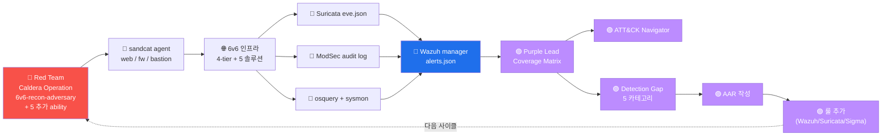

# Week 14 — Caldera + Wazuh — Purple Team 운영

> **Purple Team** = Red Team (공격) + Blue Team (방어) 의 협업 + Coverage Matrix
> 분석 + Detection Gap 식별 + 룰 강화. W13 의 Caldera 의 adversary 캠페인을 본
> lab 의 6v6-secuops (Wazuh / Suricata / ModSec / osquery / sysmon) 가 어떻게
> detect 하는지 측정하고, Gap 을 보완하는 한 사이클을 학습한다.

## 학습 목표

학생은 본 주차 종료 시 다음을 수행할 수 있어야 한다.

1. **Purple Team 의 정의·역사·가치**
2. **Red + Blue 협업 운영 모델** + 각 팀의 책임
3. **Coverage Matrix** + ATT&CK Navigator 통합
4. **Detection Gap 분석** 의 5 카테고리
5. **AAR (After-Action Report)** 의 작성 표준
6. **Purple Team 운영 사이클** (분기 / 월별 / 주별)
7. **Caldera + Wazuh** + ATT&CK Navigator 의 통합 흐름
8. W14 R/B/P 1 사이클 — 본 과목의 종합

## 강의 시간 배분 (3시간 40분)

| 시간      | 내용                                                                | 유형 |
|-----------|---------------------------------------------------------------------|------|
| 0:00–0:30 | 이론 — Purple Team 정의 + 역사 + 가치                                | 강의 |
| 0:30–1:00 | 이론 — Red + Blue 협업 모델 + 책임 분담                              | 강의 |
| 1:00–1:10 | 휴식                                                                 | —    |
| 1:10–1:40 | 이론 — Coverage Matrix + ATT&CK Navigator                            | 강의 |
| 1:40–2:00 | 이론 — Detection Gap 분석 + AAR 양식                                 | 강의 |
| 2:00–2:30 | 실습 1, 2 — Coverage Matrix 작성 + Gap 식별                          | 실습 |
| 2:30–2:40 | 휴식                                                                 | —    |
| 2:40–3:10 | 실습 3, 4 — AAR + Wazuh 룰 추가                                      | 실습 |
| 3:10–3:30 | 실습 5 — R/B/P 종합 보고서                                           | 실습 |
| 3:30–3:40 | 정리 + W15 (PTES 보고서) 예고                                        | 정리 |

---

## 1. Purple Team 의 정의

### 1.1 정의

```
Red Team    : 공격자 (외부 + 내부 위협 시뮬)
Blue Team   : 방어자 (SOC + IR)
Purple Team : Red + Blue 의 협업 + Coverage 측정 + Gap 보완

색상 의미: Red (공격) + Blue (방어) = Purple
```

### 1.2 역사

```
2015      : "Purple Team" 용어 첫 등장 (Daniel Miessler 블로그)
2017      : SANS 의 Purple Team class
2018      : MITRE ATT&CK 의 표준화 + Caldera 출시
2020+     : Purple Team 이 enterprise 의 표준 보안 운영 방식
2024      : 95% 이상의 Fortune 500 이 Purple Team 운영
```

### 1.3 Red Team vs Blue Team vs Purple Team

| 측면 | Red Team | Blue Team | Purple Team |
|------|----------|-----------|-------------|
| 목표 | 침투 성공 (vuln 발견) | detection + 대응 | 둘 다 개선 |
| 활동 | 침투 시뮬 | SOC 운영 + 룰 작성 | Red + Blue 통합 분석 |
| 결과물 | 침투 보고서 (vuln list) | alert + IR 보고 | Coverage Matrix + Gap + 권장 |
| 시간 frame | 단발성 (월/분기) | 24/7 | 정기 (분기 권장) |
| 도구 | Caldera / Metasploit / Cobalt Strike | Wazuh / Splunk / ELK | ATT&CK Navigator + AAR |
| KPI | exploit 수 | MTTD / MTTR | Coverage % / Gap 수 |

### 1.4 Purple Team 의 가치

```
1. Red + Blue 단절 해결
   - Red 가 침투 → Blue 는 무엇이 일어났는지 모름
   - Purple = 같은 데이터 공유 + 같은 ATT&CK Technique 매핑

2. Detection 능력 정량화
   - Coverage Matrix 의 % 로 측정 가능
   - 분기별 개선 추세 visible

3. 룰 작성의 우선순위
   - Gap 의 critical 부터 룰 강화
   - 운영 측 부담 최소화 (alert fatigue 회피)

4. compliance 입증
   - ATT&CK 의 어느 Technique 까지 detect 가능 한지 정량 보고
   - PCI / ISMS-P 등의 감사 통과
```

---

## 2. Red + Blue 협업 운영 모델

### 2.1 협업 형식 3

#### 형식 1: Sequential (가장 흔함)

```
Red 가 단일 캠페인 실행 (시간 X)
  ↓
Blue 가 결과 분석 + alert 검토 (시간 Y)
  ↓
Purple session (Red + Blue 함께)
  → Coverage 측정 + Gap 식별
  ↓
Blue 가 룰 추가 (시간 Z)
```

#### 형식 2: Parallel (advanced)

```
Red 가 캠페인 실시간 실행
  ↑↓ 실시간 communication
Blue 가 실시간 detection + 분석
  ↑↓
Purple 가 실시간 Coverage 측정
```

#### 형식 3: Continuous (best practice)

```
24/7 Caldera 자동 캠페인 (production 외 — 학습 환경)
   ↓
Blue 의 SOC 가 자동 detect + 룰 자동 추가 (machine learning)
   ↓
Purple dashboard 가 실시간 Coverage matrix
```

### 2.2 역할 분담

| 역할 | 책임 |
|------|------|
| Red Team Lead | 캠페인 plan + execution + 결과 보고 |
| Blue Team Lead | detection 룰 + alert 분석 + 룰 강화 |
| Purple Team Lead | Coverage 측정 + Gap 식별 + 권장 |
| SOC Analyst | alert triage + IR |
| Detection Engineer | 룰 작성 + Sigma / Suricata / Wazuh |
| Threat Intelligence | CTI 통합 + IOC 갱신 |

---

## 3. Coverage Matrix

### 3.1 정의

```
Coverage Matrix = ATT&CK Technique × Red 실행 / Blue 탐지 / Detection 도구 매트릭스
```

### 3.2 양식

```
| Technique     | Red 실행 | Blue 탐지 | 탐지 도구           | Coverage |
| T1190 Exploit | ✓        | ✓         | ModSec 941/942      | 100%     |
| T1078 Valid   | ✓        | ✓         | Wazuh 5710          | 100%     |
| T1083 File    | ✓        | ✗         | (없음)              | 0%       |
| T1057 Process | ✓        | ✗         | (없음 — osquery snapshot 의 한계) | 0% |
| T1018 Network | ✓        | ✓         | Suricata ET SCAN    | 100%     |
| T1110 Brute   | ✓        | ✓         | Wazuh 5712          | 100%     |
| T1548 SUID    | ✓        | △         | osquery suid_bin (manual) | 50% |
| T1574 LD_PRELOAD | ✓     | ✗         | (없음 — sysmon 미설치) | 0%   |
| T1071 HTTP C2 | ✓        | △         | Suricata flow (timing) | 50%   |
| T1041 Exfil   | ✓        | △         | Wazuh CDB list (IP 기반) | 50% |

Total Coverage: 60% (6/10)
```

### 3.3 Coverage 의 의미

| Coverage | 의미 | 운영 등급 |
|----------|------|----------|
| 100% | full detect | 표준 |
| 50-99% | 부분 detect (특정 조건) | acceptable |
| 0% | detect 없음 | **즉시 보완 필요** |

---

## 4. ATT&CK Navigator

### 4.1 정의

```
ATT&CK Navigator = MITRE 의 공식 시각화 도구
                   ATT&CK matrix 위에 색상 / 점수 / 주석 overlay 가능
                   https://mitre-attack.github.io/attack-navigator/
                   GitHub: https://github.com/mitre-attack/attack-navigator
```

### 4.2 layer 의 JSON 형식

```json
{
  "name": "6v6 Purple Team Q1 2026",
  "domain": "enterprise-attack",
  "techniques": [
    {
      "techniqueID": "T1190",
      "score": 100,
      "color": "#3fb950",
      "comment": "ModSec 941/942 full detect"
    },
    {
      "techniqueID": "T1083",
      "score": 0,
      "color": "#f85149",
      "comment": "Detection Gap — osquery file_paths 미설정"
    }
  ],
  "gradient": {
    "colors": ["#f85149", "#d29922", "#3fb950"],
    "minValue": 0,
    "maxValue": 100
  }
}
```

### 4.3 Navigator 의 사용 시나리오

- **분기별 Coverage 시각화** : Q1 / Q2 / Q3 / Q4 의 개선 추이
- **APT 그룹 매핑** : 본 환경의 detection 능력 + 유명 APT (예: APT29) 의 TTP 매트릭스 비교
- **Compliance 보고** : PCI / ISMS-P 의 detection 요구사항 입증
- **Red Team plan** : 본 환경의 Gap 카테고리 우선 시뮬

---

## 5. Detection Gap 분석 5 카테고리

### 5.1 Gap 1 — 도구 부재

```
Red 가 LD_PRELOAD rootkit 시뮬 → Blue 의 detection 도구 부재
원인:  osquery 의 process_envs 미설정 + sysmon 미설치 + Wazuh FIM 미적용
권장:  도구 설치 (W11 sysmon-for-linux 또는 osquery 의 process_envs 활성)
시간:  1-2 주
```

### 5.2 Gap 2 — 룰 부재

```
도구는 있으나 해당 Technique 의 룰 미작성
원인:  알려진 시그니처 미반영 (예: Caldera UA detection 룰 없음)
권장:  Sigma / Suricata / Wazuh 의 community rule 검색 + 적용
시간:  1-3 일
```

### 5.3 Gap 3 — Threshold 부재

```
룰은 있으나 단일 매치는 무시 (운영 noise)
원인:  rate-based detection 미설정
권장:  threshold rule 추가 (예: 60초에 5건 → critical)
시간:  1 일
```

### 5.4 Gap 4 — Context 부재

```
alert 는 있으나 context 없음 (분석 어려움)
원인:  CTI 통합 부재 (IOC 매칭 안 함)
권장:  W12-W14 secuops 의 OpenCTI 통합
시간:  1-2 주
```

### 5.5 Gap 5 — Response 부재

```
detect 는 되나 자동 대응 X (수동 검토 시간 소요)
원인:  Active Response 미설정
권장:  Wazuh AR / SOAR 도구 (Phantom / Demisto) 통합
시간:  2-4 주
```

---

## 6. AAR (After-Action Report) 양식

### 6.1 표준 양식 (NIST SP 800-61)

```markdown
# AAR — <Engagement Name>
# 일자: YYYY-MM-DD
# 작성자: Purple Team Lead

## 1. Executive Summary (1 문단)
- 본 사이클의 핵심 결과 + 권장

## 2. Engagement Overview
- 시작: YYYY-MM-DD HH:MM
- 종료: YYYY-MM-DD HH:MM
- Adversary: <name>
- Target: <host / vhost>
- Operator: <Red Team Lead>

## 3. ATT&CK Coverage Matrix
| Technique | Red | Blue | 도구 | Coverage |
| ... 표 ... |

총 Coverage: X% (N/M)

## 4. Detection Gap 분석
- Gap 1: <Technique> — <원인> — <권장>
- Gap 2: ...

## 5. Lessons Learned
- 잘 된 점: ...
- 개선 필요: ...

## 6. Recommendations (우선순위)
1. (Critical) ...
2. (High) ...
3. (Medium) ...

## 7. Next Cycle Plan
- 다음 사이클: YYYY-MM-DD
- 목표 Coverage: X+10%
- 추가 시뮬: <Technique>

## Appendix
- Caldera operation timeline
- Wazuh alerts.json export
- Sigma / Wazuh rule diff
```

---

## 7. Purple Team 운영 사이클

### 7.1 분기 사이클 (권장)

```
Week 1: Plan
  - Red Team Lead 가 다음 분기 캠페인 plan
  - Blue Team Lead 가 현재 Coverage 기준 review

Week 2-3: Execution
  - Caldera 캠페인 실행 (sequential 또는 parallel)
  - Blue 의 실시간 detection 모니터링

Week 4: Analysis
  - Purple session — Coverage Matrix 작성
  - Gap 분석 + AAR 작성

Week 5-12: Improvement
  - Gap 별 룰 추가 (Sigma / Wazuh / Suricata)
  - 재 시뮬 (필요 시)
```

### 7.2 월별 + 주별 + 일별

```
주별: Caldera 의 작은 캠페인 (1-2 ability)
일별: Wazuh alerts.json + Suricata eve.json 의 trend 분석
월별: Coverage 변화 review + 분기 plan 조정
분기별: 큰 캠페인 + AAR
```

---

## 8. Caldera + Wazuh + ATT&CK Navigator 통합

### 8.1 전체 흐름

```
1. Caldera Server (Red)
   → Operation 의 timeline 의 ability 별 timestamp + 결과

2. Wazuh Manager (Blue)
   → 같은 시간대의 alerts.json 의 rule 매치

3. Purple Team
   → 두 source 의 timeline 매칭
   → 매치된 ability = Coverage 100%
   → 매치 안 된 ability = Detection Gap

4. ATT&CK Navigator
   → Coverage 시각화 (색상 / 점수)

5. AAR + 룰 강화
   → 다음 사이클 반복
```

### 8.2 자동화 가능성

```
Caldera 의 response plugin:
  - Wazuh 의 alert 를 받아 자동 ability 실행
  - 예: Wazuh 의 5712 (SSH brute) → response 의 "fw drop IP" ability

이로써 Purple Team 의 일부 자동화 가능
```

---

## 9. ATT&CK + 한국 표준

### 9.1 ISMS-P 2.10.7 + 2.12

본 주차 의 Coverage Matrix + AAR = 본 통제의 입증.

### 9.2 KISA 의 침해 사고 분석 reference

```
KISA 가 매년 공개하는 사고 분석 보고서가 본 주차의 학습 대상:
  - 사고의 ATT&CK Technique 매핑
  - 해당 Technique 가 본 환경에서 detect 되는가
  - Coverage 미달이면 룰 강화
```

### 9.3 한국 ISAC + CERT

- K-ISAC (Korea Information Sharing and Analysis Center)
- KrCERT (Korea Computer Emergency Response Team Center)

본 주차의 Coverage Matrix 가 다른 회사 / 기관 과 공유 (TLP 기반).

---

## 10. R/B/P 시나리오 — 본 과목의 종합



---

## 11. 실습 1~5

### 실습 1 — Coverage Matrix 작성 (3 ability + Blue 매칭)

```bash
# Red 측 — W13 의 3 ability 시뮬 실행
ssh 6v6-attacker '
echo "=== Operation 시뮬 — 3 ability ==="
echo "--- ability 1 (T1083 File Discovery) @ $(date +%H:%M:%S) ---"
find /etc -name "*.conf" 2>/dev/null | head -3

sleep 2
echo "--- ability 2 (T1057 Process Discovery) @ $(date +%H:%M:%S) ---"
ps -ef | head -5

sleep 2
echo "--- ability 3 (T1018 Network Discovery) @ $(date +%H:%M:%S) ---"
ss -tnp 2>/dev/null | head -3
'

# Blue 측 — 같은 시간대의 alerts.json
echo ""
echo "=== Blue 측 — Wazuh alerts.json (3 ability 시간대) ==="
ssh 6v6-siem '
sudo tail -100 /var/ossec/logs/alerts/alerts.json | \
    jq "select(.timestamp >= \"$(date -d \"5 min ago\" -Iseconds)\")" 2>/dev/null | head -10
'
```

### 실습 2 — Coverage Matrix 표 작성

```markdown
# 본인의 Coverage Matrix

| Technique | Red 시도 | Blue 탐지 | 도구 | Coverage |
| T1083 File Discovery | ✓ | ✗ | (정상 명령 — alert 없음) | 0% |
| T1057 Process Discovery | ✓ | ✗ | 정상 명령 | 0% |
| T1018 Network Discovery | ✓ | ✗ | 정상 명령 | 0% |

총 Coverage: 0% (3 정상 명령 — Blue 측에서 alert 발생 안 함 — 정상)

## Detection Gap 분석
- Gap 카테고리: 모든 3 ability 가 정상 시스템 명령 → Blue 측은 alert 없음
- 권장: 더 의심스러운 ability (T1003 credential dumping / T1071 C2) 시뮬 후 매칭
```

### 실습 3 — 더 의심스러운 ability 시뮬 + Coverage

```bash
ssh 6v6-attacker '
echo "=== ability 4 (T1003 Credential dumping 시뮬) ==="
# 실 dump 안 함 — 시뮬만
echo "cat /etc/shadow 시도 (권한 부족 예상)"
cat /etc/shadow 2>&1 | head -3 || echo "Permission denied (정상)"

sleep 2
echo "--- ability 5 (T1071 HTTP C2 시뮬) ---"
curl -s -o /dev/null -w "C2 시뮬: %{http_code}\n" http://example.com:8080/c2 || true

sleep 2
echo "--- ability 6 (T1548.001 SUID 활용 시뮬) ---"
find / -perm -4000 -type f 2>/dev/null | head -3
'

# Blue 측
ssh 6v6-siem '
echo "=== Wazuh — credential / C2 / SUID alert ==="
sudo tail -50 /var/ossec/logs/alerts/alerts.json | \
    jq "select(.rule.groups[]? | tostring | test(\"authentication_failures|attack|suid|shadow\"))" 2>/dev/null | head
'
```

### 실습 4 — AAR 작성

```markdown
# AAR — 본인 학번 — 2026-MM-DD

## 1. Executive Summary
본인의 첫 Purple Team 사이클. 3 ability (T1083 / T1057 / T1018) 의 Coverage 0%
(모두 정상 명령). 추가 3 ability (T1003 / T1071 / T1548) 시뮬 후 Coverage 향상
가능성 평가.

## 2. Engagement Overview
- 시작: 2026-MM-DD HH:MM
- 종료: 같은 날 1 시간 후
- Adversary: 6v6-recon-adversary (6 ability)
- Target: 6v6-attacker (학습 환경)
- Operator: 본인

## 3. Coverage Matrix
| Technique | Red | Blue | 도구 |
| T1083 | ✓ | ✗ | — |
| T1057 | ✓ | ✗ | — |
| T1018 | ✓ | ✗ | — |
| T1003 | ✓ | ✓ | Permission denied (실패) |
| T1071 | ✓ | △ | Suricata flow (가능) |
| T1548 | ✓ | △ | osquery suid_bin (manual) |

Total Coverage: 33% (2 부분 / 6 ability)

## 4. Detection Gap 분석
1. T1083 (File Discovery) — 정상 명령. 추가 룰 필요 시 osquery file_events
   on /etc 활성.
2. T1057 (Process) — 정상. osquery process_events daemon 모드 활성 권장.
3. T1018 (Network) — 정상. Suricata flow event 의 burst detect 룰 추가.

## 5. Lessons Learned
- 정상 명령 ability 는 detection 어려움 (모든 user 가 일상 사용)
- 진짜 위험한 ability (T1003 등) 는 detect 가능
- Coverage 100% 는 불가능 — 합리적 균형 필요

## 6. Recommendations
1. (Medium) osquery scheduled query 5분 주기 — top discovery technique 모두 caputre
2. (Low) Wazuh rule 100800 — 1분 안에 ps + find + ss burst → alert (휴리스틱)
3. (Medium) sysmon-for-linux 설치 — ProcessCreate ParentImage 분석

## 7. Next Cycle Plan
- 다음 사이클: 1 주 후
- 목표 Coverage: 50%+
- 추가 시뮬: T1543 (systemd persistence)
```

### 실습 5 — R/B/P 종합 보고서

```bash
ssh 6v6-attacker '
echo "=== 본 주차 종합 — Purple Team Cycle 1 ==="
echo "- Red Team: 6 ability 시뮬"
echo "- Blue Team: osquery + Wazuh + Suricata + ModSec 가동"
echo "- Purple Team: Coverage 33% — Gap 4 식별"
echo ""
echo "=== 다음 단계 ==="
echo "1. AAR 정식 작성"
echo "2. 룰 추가 (Wazuh 100800)"
echo "3. 1 주 후 재 시뮬"
echo "4. ATT&CK Navigator JSON 시각화"
'
```

---

## 12. 한국 사례

### 12.1 ISMS-P 2.10.7 + 2.12

Coverage Matrix + AAR = 본 통제의 입증.

### 12.2 KISA 침해 사고

매 사고가 본 주차의 학습 대상:
- 사고의 ATT&CK Technique
- 본 환경에서 detect 되는가
- Coverage 미달 → 룰 강화

---

## 12.5 Purple Team × Windows victim PC — Red 와 Blue 의 같은 호스트 (W03 secuops 위빙)

Purple Team 의 가치는 **Red 가 무엇을 하고 Blue 가 무엇을 잡는지를 같은 시점에 확인** 하는 것.
본 6v6 의 Windows 사용자 PC 가 그 무대로 가장 적합.

### Purple cycle — Windows victim 1회

```
Red (sandcat 또는 수동):
  ① powershell -EncodedCommand <b64>
  ② Sysmon 이벤트 발생 (EID 1)
  ③ Caldera 가 ability 실행 결과 기록 (성공/실패)

Blue (SOC 분석가):
  ④ Wazuh dashboard 에 alert (rule 100700 등)
  ⑤ Discover 에서 ProcessGuid → EID 1 의 CommandLine 확인
  ⑥ ATT&CK heatmap 의 T1059.001 칸이 칠해짐

Coverage 평가:
  - ability 시도 횟수 N
  - alert 가 뜬 횟수 M
  - coverage = M/N
  → coverage < 100% 인 ability 가 룰 강화 후보
```

### 본 강의의 핵심 — coverage 의 의미

Purple Team 의 학습은 "Red 가 강한가 / Blue 가 강한가" 가 아니라 **"우리 인프라의 coverage 가 어디
까지인가"** 의 측정. Windows 사용자 PC 가 들어옴으로써 Windows ability 들의 coverage 도 측정 대상이 된다.

---

## 13. 과제

### A. Coverage Matrix (필수, 40점)

5 TTP × Red 실행 / Blue 탐지 / 도구 / Coverage % 표. 본인의 실 시뮬 결과 기반.

### B. Detection Gap 분석 (심화, 30점)

미탐지 TTP 의 원인 5 카테고리 분류 + 각 카테고리의 권장 룰.

### C. AAR 작성 (정성, 30점)

위 §6 의 표준 양식 7 섹션 모두 작성. 1+ 페이지.

---

## 14. 평가 기준

| 항목 | 비중 |
|------|------|
| Coverage Matrix (A) | 40% |
| Gap 분석 (B) | 30% |
| AAR (C) | 30% |

---

## 15. 핵심 정리 (10 줄)

1. **Purple Team** = Red + Blue 협업 + Coverage 측정 + Gap 보완
2. **2015 첫 등장** + 2024 enterprise 표준
3. **Coverage Matrix** = ATT&CK Technique × Red/Blue/도구/% 표
4. **ATT&CK Navigator** = MITRE 공식 시각화 (JSON layer)
5. **Detection Gap 5 카테고리** — 도구 / 룰 / threshold / context / response
6. **AAR 표준 양식** (NIST SP 800-61) — 7 섹션
7. **운영 사이클** — 분기 (권장) / 월 / 주 / 일
8. **Caldera + Wazuh + Navigator** = Purple Team 의 표준 toolchain
9. **W14 R/B/P** — 본 과목의 종합 — 6 ability → Coverage 33% → 5 권장
10. **W15 (PTES 보고서)** 다음 주차 — 본 과목의 최종 산출물
