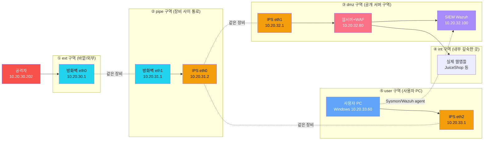
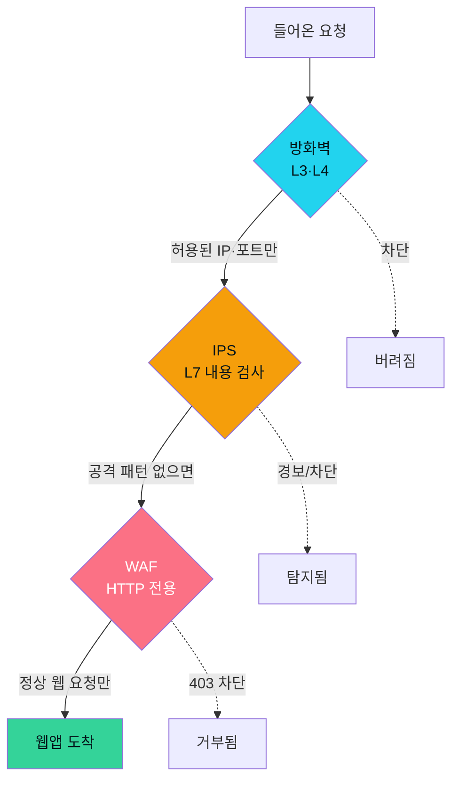
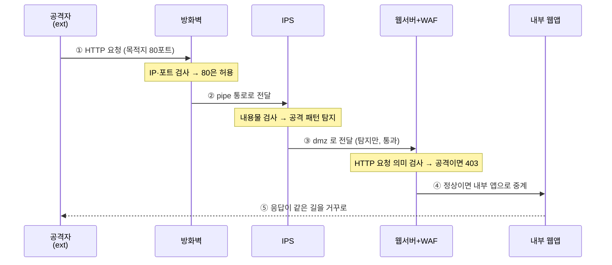
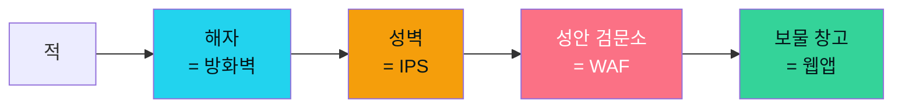

# Week 01 — 전체 토폴로지: 보안장비는 어디에, 왜 있는가

> **이번 주 한 줄 요약**
>
> 우리가 다룰 6v6 실습망이 **어떻게 생겼는지**, 그 안에서 **방화벽 · IPS · WAF** 세 보안장비가
> **어디에 놓여 무슨 일을 하는지**, 그리고 공격 트래픽 한 줄기가 들어올 때 **어떤 길을 따라
> 어떤 장비를 차례로 지나는지** 를 그림으로 이해한다. 이번 주는 명령어를 외우는 시간이 아니라
> "**전체 지도**" 를 머릿속에 그리는 시간이다.

---

## 이 특강은 무엇인가요?

보안시스템을 처음 다루는 학생을 위한 입문 특강입니다. 우리는 6주 동안 세 가지 대표 보안장비를
**직접 만져 봅니다.**

| 주차 | 장비 | 한 줄 설명 |
|------|------|-----------|
| W1 | (전체 지도) | 세 장비가 어디에 있고 왜 있는지 그림으로 이해 |
| W2 | **방화벽 (nftables)** | IP·포트로 트래픽을 허용/차단하는 가장 바깥 관문 |
| W3~W4 | **IPS (Suricata)** | 통과한 트래픽의 *내용* 을 검사해 공격 패턴을 탐지 |
| W5~W6 | **WAF (ModSecurity)** | 웹(HTTP) 요청을 이해하고 웹 공격을 막는 방패 |

**가장 중요한 약속이 하나 있습니다.** 이 특강에서는 모든 장비를 **웹 화면(GUI)** 으로 다룹니다.
화면에서 버튼을 누르고 값을 입력하면, 그 동작이 만들어내는 **진짜 명령** (예: `nft` 명령,
Suricata 룰, ModSecurity SecRule) 을 화면이 그대로 보여 주고, 그다음 실제로 적용합니다.

> 즉 우리는 "버튼을 누르는 법" 이 아니라 **"버튼이 만들어내는 명령"** 을 배웁니다.
> 그래서 나중에 화면이 없는 환경에서도 같은 일을 할 수 있게 됩니다.

---

## 학습 목표

이번 주가 끝나면 여러분은 다음을 할 수 있어야 합니다.

1. 6v6 실습망의 **4개 구역**(ext → pipe → dmz → int) 을 그림으로 그릴 수 있다.
2. 방화벽 · IPS · WAF 가 **각각 어느 구역에** 있고 **무엇을 검사하는지** 한 문장으로 설명한다.
3. 외부에서 들어온 요청 한 개가 **어떤 순서로 어떤 장비를 거쳐** 웹 서버에 닿는지 따라간다.
4. "왜 보안장비를 한 개가 아니라 세 개나 두는가" (= **심층 방어**) 를 비유로 설명한다.
5. 세 개의 교육용 콘솔(`fw-gui` / `ips-gui` / `waf-gui`)에 접속해 첫 화면을 연다.

---

## 1. 먼저 알아둘 용어 (딱 10개)

처음 보는 용어가 많아도 괜찮습니다. 아래 10개만 알면 이번 주 내용은 충분히 따라옵니다.

| 용어 | 영어 | 쉽게 말하면 | 일상 비유 |
|------|------|------------|-----------|
| 방화벽 | Firewall | "누가, 어디로" 가는지(IP·포트) 보고 통과/차단 | 건물 정문 출입 통제 |
| IPS/IDS | Intrusion Prevention/Detection System | 통과한 트래픽의 *내용물* 을 뜯어보고 공격이면 경보/차단 | 가방을 여는 보안 검색대 |
| WAF | Web Application Firewall | *웹(HTTP)* 요청만 전문으로 검사하는 방패 | 웹 사이트 전용 금속탐지기 |
| 패킷 | Packet | 네트워크에서 오가는 데이터 한 조각 | 편지 한 통 |
| IP 주소 | IP address | 네트워크에서 컴퓨터의 "주소" | 건물 호수(101호) |
| 포트 | Port | 한 컴퓨터 안의 "창구 번호"(80=웹, 22=SSH) | 은행 창구 번호 |
| 구역(존) | network zone | 보안 등급이 같은 컴퓨터들을 묶은 망 | 건물의 층/구역 |
| 게이트웨이 | gateway | 두 구역을 잇는 "문" 역할의 장비 | 층과 층 사이 출입문 |
| 심층 방어 | Defense in Depth | 한 겹이 뚫려도 다음 겹이 막도록 여러 겹 쌓기 | 성벽 + 해자 + 검문소 |
| 프록시 | reverse proxy | 외부 요청을 대신 받아 내부 서버로 전달하는 중계자 | 호텔 안내데스크 |

---

## 2. 6v6 실습망의 전체 그림

먼저 전체 지도를 봅시다. 우리 실습망은 보안 등급과 용도가 다른 **5개의 구역** 으로 나뉩니다.
바깥에서 안으로 갈수록 더 중요한 곳이고, 사용자 PC 는 별도 구역으로 분리되어 있습니다.

**이 그림에서 꼭 기억할 점 5가지:**

1. **공격자(빨강)** 는 가장 바깥 `ext` 구역에 있습니다. 안으로 들어오려면 반드시 장비들을 거쳐야 합니다.
2. **방화벽은 NIC 2개, IPS 는 NIC 3개** 를 가집니다. 한 발은 바깥 구역, 한 발은 안쪽 구역에
   걸치고 있어서 "문" 역할을 합니다. IPS 는 추가로 user 구역에도 한 발을 걸쳐, 사용자 PC 의
   트래픽까지 모두 봅니다. (그림의 점선 `-.같은 장비.-` 이 한 장비의 여러 다리입니다.)
3. 가장 안쪽 `int` 에는 진짜 웹 애플리케이션이 있습니다. 여기까지 도달하려면 **방화벽 → IPS →
   WAF** 를 모두 통과해야 합니다.
4. **사용자 PC(파랑, Windows)** 는 별도 `user` 구역에 있습니다. 회사망의 직원 책상과 같습니다.
   PC 가 웹 사이트에 접속하든, 외부에서 PC 를 공격하든, 모든 트래픽은 **IPS** 를 거칩니다.
   (실제 회사망에서도 사용자 영역은 공개 서버(DMZ)와 분리하는 것이 정석입니다.)
5. 그러나 IPS 는 **네트워크 트래픽** 만 봅니다. PC 안에서 일어나는 일(프로세스 실행·파일 변경·
   레지스트리 조작)은 못 봅니다. 그 안쪽은 **Sysmon + Wazuh 에이전트(EDR)** 가 보고, 같은 SIEM
   으로 보냅니다. 그래서 네트워크 장비와 엔드포인트 EDR 이 서로의 빈틈을 메웁니다.

---

## 3. 네 구역을 하나씩 — 무엇이 있고, 왜 나눴나

구역을 나누는 이유는 간단합니다. **보안 등급이 다른 컴퓨터를 섞어 두면 위험하기 때문**입니다.
바깥 손님이 드나드는 로비와, 금고가 있는 방을 같은 공간에 두지 않는 것과 같습니다.

### ① ext (외부 구역) — `10.20.30.0/24`
- 가장 바깥, 신뢰할 수 없는 구역입니다. **공격자(10.20.30.202)** 가 여기 있습니다.
- 방화벽의 바깥쪽 다리(`eth0`, 10.20.30.1)가 이 구역을 향합니다. 외부에서 오는 모든 트래픽은
  먼저 이 다리로 들어옵니다.
- **보안 관점:** "여기는 위험하다" 고 가정합니다. 그래서 바로 뒤에 방화벽이 버티고 있습니다.

### ② pipe (통로 구역) — `10.20.31.0/24`
- 방화벽과 IPS 를 잇는 **좁은 통로** 입니다. 방화벽 안쪽 다리(`eth1`, 10.20.31.1)와 IPS 바깥쪽
  다리(`eth0`, 10.20.31.2)만 이 통로에 있습니다.
- **보안 관점:** 방화벽을 통과한 트래픽은 무조건 이 통로를 지나 IPS 로 갑니다. 우회로가 없으므로
  IPS 는 "지나가는 모든 것" 을 볼 수 있습니다.

### ③ dmz (공개 서버 구역) — `10.20.32.0/24`
- 외부에 서비스를 제공해야 하는 **서버들** 이 모인 곳입니다 (사용자 PC 는 여기 없습니다).
  - **웹서버 + WAF** (10.20.32.80) — 우리가 보호할 대상이자 WAF 가 동작하는 곳
  - **SIEM (Wazuh)** (10.20.32.100) — 모든 장비의 로그를 모아 보는 관제실
- IPS 의 dmz 쪽 다리(`eth1`, 10.20.32.1)가 이 구역을 향합니다.
- **보안 관점:** "DMZ" 는 군사용어로 비무장지대입니다. 외부에 노출되지만 내부망과는 분리해서,
  여기가 뚫려도 더 깊은 곳은 지키도록 합니다.

### ④ int (내부 구역) — `10.20.40.0/24`
- 가장 깊은 곳. 실제 웹 애플리케이션(JuiceShop 등)이 돌아갑니다.
- 웹서버는 dmz(10.20.32.80)와 int(10.20.40.80) 양쪽에 다리를 걸치고, 외부 요청을 받아 내부 앱으로
  중계합니다(= 리버스 프록시).
- **보안 관점:** 외부에서 여기로 **직접** 올 수 있는 길은 없습니다. 반드시 앞단 서버를 거쳐야 합니다.

### ⑤ user (사용자 PC 구역) — `10.20.33.0/24`
- 실제 직원이 쓰는 **윈도우 사용자 PC** 가 사는 곳입니다.
  - **사용자 PC (Windows 11)** (10.20.33.60) — 직원 책상의 PC. 사내 웹에 접속하고, 공격자의
    **최종 표적**이 되며, **Sysmon + Wazuh 에이전트(EDR)** 가 PC 내부의 행위까지 SIEM 에 보냅니다.
- IPS 의 user 쪽 다리(`eth2`, 10.20.33.1)가 이 구역의 **게이트웨이** 입니다. 사용자 PC 의 모든
  내·외 트래픽은 이 다리를 통해서만 다른 구역으로 나갑니다.
- **보안 관점:** 서버(dmz)와 사람의 PC(user)는 책임자도 다르고 위험도 다릅니다. 그래서 구역을
  나눠 둡니다. 직원 PC 가 감염되어도 그 영향이 공개 서버로 직접 퍼지지 않도록, 트래픽을 다시
  IPS 의 검사선 위에 올려놓는 것이 핵심입니다.

> **핵심:** 바깥(ext) → 통로(pipe) → 공개구역(dmz) → 내부(int) + 사용자 책상(user).
> 안으로 갈수록 신뢰도가 높고, 사용자 PC 의 트래픽도 IPS 의 검사선 위에 올라옵니다.
> 각 경계마다 보안장비가 문지기로 서 있고, **PC 안의 행위**는 엔드포인트 EDR 이 보충합니다.

---

## 4. 세 보안장비의 위치와 역할

이제 가장 중요한 부분입니다. 세 장비는 **검사하는 깊이가 다릅니다.**

| 장비 | 보는 것 | 보는 깊이 | 비유 |
|------|---------|-----------|------|
| **방화벽** (nftables) | 출발지/목적지 **IP**, **포트**, 연결 상태 | 봉투의 겉면 (주소·창구번호) | 정문에서 신분증·목적지 확인 |
| **IPS** (Suricata) | 패킷 **내용물** 속의 공격 패턴(문자열·정규식) | 봉투를 열어 편지 내용 검사 | 가방을 열어보는 검색대 |
| **WAF** (ModSecurity) | **HTTP 요청**의 주소·파라미터·헤더·본문 | 웹 언어를 이해하고 의미 검사 | 웹 전용 전문 검색관 |

**자주 하는 질문: "방화벽이 있으면 IPS·WAF 는 왜 필요한가요?"**

방화벽은 **봉투 겉면만** 봅니다. 즉 "80번 포트(웹)로 들어오는 정상 손님" 은 통과시킵니다.
그런데 그 손님이 **봉투 안에 공격 문서를 숨겨** 왔다면? 방화벽은 내용물을 안 보니 막지 못합니다.
그래서 다음 층의 IPS 가 내용물을 검사하고, 그다음 WAF 가 웹 요청의 의미까지 검사합니다.
**각 장비는 자기가 잘하는 깊이만 책임집니다.**

---

## 5. 요청 한 개가 지나가는 길 (hop by hop)

공격자가 웹 사이트에 접속하는 정상 요청을 보냈다고 합시다. 이 요청은 다음 순서로 흐릅니다.

이 다섯 단계가 눈 깜짝할 사이에 일어납니다. 하지만 **운영자(여러분)** 는 이 길을 정확히 알아야
침해가 일어났을 때 "어디서 막혔고, 어디는 통과했는지" 추적할 수 있습니다. 그래서 이번 주에 길을
머릿속에 새기는 것입니다.

> 참고: 우리 실습망에서 방화벽은 **HAProxy** 라는 중계자(리버스 프록시)도 함께 돌립니다.
> HAProxy 는 "어떤 주소(`Host:` 헤더)로 온 요청인지" 보고 알맞은 내부 서버로 길을 잡아 줍니다.
> 호텔 안내데스크가 "몇 호 가세요?" 묻고 안내하는 것과 같습니다. 자세한 건 W2 에서 다룹니다.

---

## 6. 왜 세 겹인가 — 심층 방어 (Defense in Depth)

옛날 성을 떠올려 봅시다. 성은 한 겹으로 막지 않았습니다.

- **해자(방화벽)** — 아예 다가오지 못하게 거른다.
- **성벽(IPS)** — 해자를 건너온 적의 무기를 탐지한다.
- **검문소(WAF)** — 성안에 들어온 자의 의도를 따진다.

한 겹이 완벽한 방어는 없습니다. 방화벽도, IPS 도, WAF 도 각자 약점이 있습니다. 하지만 **세 겹을
모두 뚫기는 훨씬 어렵습니다.** 또한 한 겹이 뚫려도 다음 겹의 **로그** 가 침해의 증거를 남깁니다.
이것이 심층 방어의 핵심입니다.

**그리고 한 가지 더:** 세 장비의 기록은 모두 **SIEM(Wazuh, 10.20.32.100)** 이라는 관제실로
모입니다. 운영자는 SIEM 한 곳에서 "방화벽이 무엇을 막았고, IPS 가 무엇을 탐지했고, WAF 가 무엇을
차단했는지" 시간순으로 볼 수 있습니다. 우리는 매주 각 장비를 SIEM 에 연동하는 것까지 배웁니다.

---

## 7. 같은 공격, 다른 층에서 막히는 모습

같은 공격이라도 어느 층에서 걸리느냐가 다릅니다. 예시 세 가지를 봅시다.

| 공격 | 어느 장비가 막나 | 왜 |
|------|----------------|----|
| "9999번 포트로 접속 시도" | **방화벽** | 포트 자체를 닫아두면 내용 검사도 필요 없음 |
| "정상 80포트로 들어오지만 패킷에 `sqlmap` 흔적" | **IPS** | 포트는 정상이라 방화벽은 통과, 내용에서 도구 흔적 탐지 |
| "정상 웹 요청처럼 보이지만 `?q=<script>` XSS" | **WAF** | HTTP 파라미터의 의미를 이해해야 잡힘 |

이렇게 **공격마다 가장 잘 막는 층이 다르기 때문에** 세 장비가 모두 필요합니다. W2~W6 에서 위 세
공격을 각각 직접 막아 봅니다.

---

## 8. 세 개의 교육용 콘솔 접속하기

이번 특강의 주인공인 세 GUI 콘솔은 모두 웹 브라우저로 접속합니다. 방화벽이 돌리는 HAProxy 가
아래 주소들을 알맞은 장비로 연결해 줍니다.

| 콘솔 | 주소 | 다루는 장비 | 배우는 주차 |
|------|------|------------|------------|
| 방화벽 콘솔 | `http://fw-gui.6v6.lab/` | nftables (6v6-fw) | W2 |
| IPS 콘솔 | `http://ips-gui.6v6.lab/` | Suricata (6v6-ips) | W3~W4 |
| WAF 콘솔 | `http://waf-gui.6v6.lab/` | ModSecurity (6v6-web) | W5~W6 |

각 콘솔의 첫 화면(**대시보드**)에는 그 장비의 상태가 한눈에 보입니다. 예를 들어 방화벽 콘솔은
인터페이스(eth0/eth1), 룰 개수, 활성 연결 수를 보여 주고, IPS 콘솔은 로딩된 탐지룰 수와
eve.json 로그 크기를, WAF 콘솔은 ModSecurity 엔진 모드와 CRS 버전을 보여 줍니다.

> 접속이 안 되면: 브라우저가 `*.6v6.lab` 주소를 찾도록 hosts 설정이 되어 있어야 합니다.
> (강사가 안내한 대로 `/etc/hosts` 또는 DNS 가 방화벽 IP 를 가리키게 되어 있는지 확인하세요.)

각 콘솔의 공통 철학을 다시 기억하세요. **무엇을 하든 화면이 "이런 명령이 만들어졌습니다" 를
먼저 보여 주고, 여러분이 "적용" 을 눌러야 실제로 반영됩니다.** 그래서 안전하게 연습할 수 있습니다.

---

## 9. 이번 주 정리

- 6v6 망은 **ext → pipe → dmz → int + user** 5구역으로, 사용자 PC 는 서버와 분리된 `user`
  구역(10.20.33.0/24)에 있다.
- **방화벽**(ext↔pipe 경계)은 IP·포트를, **IPS**(pipe↔dmz·user 세 다리)는 내용물을, **WAF**(dmz 의
  웹서버)는 HTTP 의미를 검사한다.
- 요청은 **방화벽 → IPS → WAF → 내부 앱** 순서로 흐르고, 응답은 거꾸로 돌아간다.
- **사용자 PC 의 트래픽도 IPS 를 거친다** (IPS 가 user 구역의 게이트웨이). 다만 PC 안의 행위는
  네트워크 장비가 못 본다 — 그 자리를 **Sysmon + Wazuh 에이전트(EDR)** 가 채운다.
- 세 겹 + EDR 로 쌓는 이유는 **심층 방어** — 한 겹이 뚫려도 다음 겹과 로그가 막고 기록한다.
- 모든 장비의 기록은 **SIEM(Wazuh)** 한 곳으로 모인다.
- 우리는 세 장비를 각각 `fw-gui` / `ips-gui` / `waf-gui` 콘솔로 다룬다.

## 다음 주 예고 (W2 — 방화벽)

다음 주에는 방화벽 콘솔(`fw-gui.6v6.lab`)을 열어, 실제로 룰을 만들어 봅니다. 악성 IP 를 차단하고,
NAT 로 내부 서비스를 공개하고, 연결 추적(stateful)을 눈으로 확인하고, 만든 룰을 SIEM 으로 보내는
것까지 — **모두 화면에서, 그리고 그 화면이 만들어내는 진짜 `nft` 명령을 함께** 익힙니다.

---

## 과제 (제출)

1. 6v6 4구역 토폴로지를 **손으로 그려** 제출하세요. 각 구역의 이름, 대역(IP), 그 구역에 있는
   장비/서버를 표시합니다.
2. 방화벽 · IPS · WAF 가 각각 "무엇을(어느 깊이를) 검사하는지" 를 **자기 말로 한 문장씩** 쓰세요.
3. 세 콘솔(`fw-gui` / `ips-gui` / `waf-gui`)에 접속해 **각 대시보드 첫 화면을 캡처** 하고, 거기서
   본 정보(예: 방화벽 룰 개수, IPS 로딩 룰 수, WAF 엔진 모드) 를 한 줄씩 적으세요.
4. (생각해 보기) "방화벽 하나만 있으면 충분하지 않을까?" 라는 질문에, 이번 주에 배운 내용을 근거로
   반박하는 글을 5문장 이내로 쓰세요.
