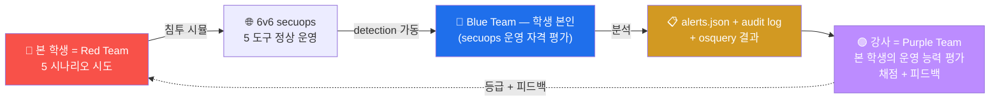

# Week 08 — 중간고사 — 보안 솔루션 + 호스트 가시화 종합 실기 (90분)

> W01-W07 secuops 의 종합 평가. 5종 보안 솔루션 (방화벽 nftables / IDS Suricata /
> WAF ModSec / SIEM Wazuh manager / 호스트 가시화 osquery) 운영 능력 평가. 90분
> 시험 + 5 시나리오 × 20점 = 100점. 본 시험 통과 시 W09 (Wazuh 본격) 진입.

## 1. 시험 개요

### 1.1 형식

```
시간: 90분 (5분 전 카운트다운)
시나리오: 5 (각 20점, 총 100점)
도구: 6v6 의 모든 secuops 도구 + 본인 PC + 인터넷 검색 허용
RoE: 6v6 환경만, AI 어시스턴트 금지, 다른 학생과 communication 금지
산출물: 1 페이지 PDF (명령 + 출력 + 분석)
```

### 1.2 시험 환경

```
대상: 6v6 환경의 4 호스트 (fw / ips / web / siem) + osquery 4 호스트
도구: bastion ProxyJump 통한 ssh 접근
시간: 본인 PC 에서 단독 진행 (시험관 monitoring)
```

### 1.3 시험 규칙

```
✅ 허용:
  - W01-W07 lecture md + lab yaml 자료
  - 인터넷 검색 (man page / OWASP / Wazuh 문서)
  - 본인 메모
  - 매 시나리오 별 변경 즉시 cleanup

❌ 금지:
  - 다른 학생과 communication
  - AI 어시스턴트 (ChatGPT / Claude / Copilot)
  - 다른 학생의 secuops 환경 변경
  - 시험 종료 후 cleanup 미완 (룰 / 파일 / agent 등)
```

---

## 2. 5 시나리오 상세

### 2.1 시나리오 1 (20점) — fw nftables 정책 (W02-W03 학습)

#### 문제

> 6v6-fw 의 inet six_filter input chain 의 가장 위 (position 0) 에 다음 룰을 추가:
> "attacker (10.20.30.202) 의 80/tcp 접근만 drop, 다른 src 는 정상 통과."
> 검증 후 룰 삭제 + 정상화.

#### 평가 항목

```
5점: 룰 추가 정확도 (정확한 inet six_filter input chain + position 0)
5점: 검증 출력 (attacker timeout 000 + 다른 host 200)
5점: counter packets > 0 + handle 식별
5점: 룰 삭제 + 정상화 검증 (attacker 200 복귀)
```

#### 실행 예

```bash
# 1. 룰 추가
ssh 6v6-fw 'sudo nft insert rule inet six_filter input \
    position 0 \
    ip saddr 10.20.30.202 tcp dport 80 \
    counter drop'

# 2. attacker 검증 (timeout 예상)
ssh 6v6-attacker 'timeout 4 curl -s -o /dev/null -w "%{http_code}\n" \
    -H "Host: juice.6v6.lab" http://10.20.30.1/'

# 3. 다른 host (web) 검증
ssh 6v6-web 'curl -s -o /dev/null -w "%{http_code}\n" \
    -H "Host: juice.6v6.lab" http://10.20.30.1/' || true

# 4. counter 검증
ssh 6v6-fw 'sudo nft list chain inet six_filter input | grep 10.20.30.202'

# 5. 룰 삭제 (handle 식별 후)
HANDLE=$(ssh 6v6-fw 'sudo nft -a list chain inet six_filter input | \
    grep "10.20.30.202" | grep -oE "handle [0-9]+" | head -1 | awk "{print \$2}"')
ssh 6v6-fw "sudo nft delete rule inet six_filter input handle $HANDLE"

# 6. 정상화 검증
ssh 6v6-attacker 'curl -s -o /dev/null -w "%{http_code}\n" \
    -H "Host: juice.6v6.lab" http://10.20.30.1/'
```

### 2.2 시나리오 2 (20점) — Suricata 룰 작성 (W04-W05 학습)

#### 문제

> 6v6-ips 의 local.rules 에 다음 alert 룰 추가:
> "HTTP URI 에 `' OR '1'='1` SQLi 패턴이 포함된 요청 매치. sid 9008001, classtype
> web-application-attack, threshold limit by_src 60초 1번."
> 트리거 + eve.json 검증.

#### 평가 항목

```
5점: 룰 syntax 정확 + reload-rules OK
5점: 트리거 성공 (alert 발생)
5점: 정확한 sid + classtype + threshold
5점: cleanup (룰 삭제 + 재 트리거 시 alert 미발생 검증)
```

#### 실행 예

```bash
# 1. 룰 추가
ssh 6v6-ips 'echo "alert http any any -> any any (msg:\"SQLi tautology\"; \
    http.uri; pcre:\"/'\''\\s*OR\\s*'\''1'\''='\''1/i\"; \
    threshold:type limit, track by_src, count 1, seconds 60; \
    classtype:web-application-attack; sid:9008001; rev:1;)" \
    | sudo tee -a /etc/suricata/rules/local.rules'

# 2. reload
ssh 6v6-ips 'sudo suricatasc -c reload-rules'

# 3. 트리거
sleep 2
ssh 6v6-attacker "curl -s -o /dev/null -H 'Host: juice.6v6.lab' \
    \"http://10.20.30.1/?q=1' OR '1'='1\""

sleep 4

# 4. alert 검증
ssh 6v6-ips 'sudo grep "sid.:9008001" /var/log/suricata/eve.json | \
    tail -1 | jq .alert'

# 5. cleanup
ssh 6v6-ips 'sudo sed -i "/sid:9008001/d" /etc/suricata/rules/local.rules'
ssh 6v6-ips 'sudo suricatasc -c reload-rules'
```

### 2.3 시나리오 3 (20점) — ModSecurity 공격 시뮬 (W06 학습)

#### 문제

> 6v6-attacker 에서 3 가지 공격 (XSS / SQLi / LFI) 페이로드 발송:
> - XSS: `<script>alert(1)</script>` to juice.6v6.lab
> - SQLi: `1' OR '1'='1` to dvwa.6v6.lab
> - LFI: `../../../etc/passwd` to govportal.6v6.lab
> 각 응답 코드 + audit log 의 매치 룰 ID 추출.

#### 평가 항목

```
5점: 3 페이로드 작성 정확
5점: 3 차단 모두 403
5점: 매치 룰 ID 정확 추출 (941xxx / 942xxx / 930xxx)
5점: audit log jq 분석 (transaction.messages[].id)
```

#### 실행 예

```bash
# 1. XSS
ssh 6v6-attacker "curl -s -o /dev/null -w 'XSS: %{http_code}\n' \
    -H 'Host: juice.6v6.lab' \
    'http://10.20.30.1/?q=<script>alert(1)</script>'"

# 2. SQLi
ssh 6v6-attacker "curl -s -o /dev/null -w 'SQLi: %{http_code}\n' \
    -H 'Host: dvwa.6v6.lab' \
    \"http://10.20.30.1/?q=1' OR '1'='1\""

# 3. LFI
ssh 6v6-attacker "curl -s -o /dev/null -w 'LFI: %{http_code}\n' \
    -H 'Host: govportal.6v6.lab' \
    'http://10.20.30.1/?file=../../../etc/passwd'"

sleep 2

# 4. audit log 매치 룰 추출
ssh 6v6-web 'sudo tail -3 /var/log/apache2/modsec_audit.log | head -1 | \
    jq -r ".transaction.messages[].id" | sort -u | head'

# 예상 출력:
#   941100  (XSS)
#   942100  (SQLi)
#   930100  (LFI)
#   949110  (anomaly threshold)
```

### 2.4 시나리오 4 (20점) — osquery 헌팅 (W07 학습)

#### 문제

> 6v6-web 에서 다음 4 헌팅 쿼리 SQL 작성 + 실행:
> 1. `on_disk = 0` 인 process
> 2. uid >= 1000 인 사용자
> 3. listening_ports + processes JOIN → 22/80/443 매핑
> 4. SUID binary 중 path 가 /usr/bin 이 아닌 것

#### 평가 항목

```
5점: 4 SQL syntax 정확
5점: 결과 정확 (baseline 매치)
5점: JOIN 쿼리 정확
5점: 분석 (정상 baseline vs 의심 판단)
```

#### 실행 예

```bash
# 1. on_disk = 0 (fileless malware 의심)
ssh 6v6-web 'sudo osqueryi --json \
    "SELECT pid, name, path FROM processes WHERE on_disk = 0;"'
# 정상 baseline: [] (빈 결과)

# 2. uid >= 1000 사용자
ssh 6v6-web 'sudo osqueryi --json \
    "SELECT username, uid, shell, directory FROM users WHERE uid >= 1000;"'
# 정상: ccc / 학습 환경의 사용자만

# 3. listening_ports + processes JOIN
ssh 6v6-web 'sudo osqueryi --json \
    "SELECT l.port, l.address, p.name, p.pid \
     FROM listening_ports l \
     JOIN processes p ON l.pid = p.pid \
     WHERE l.port IN (22, 80, 443);"'
# 정상: 22 sshd, 80 apache2, 443 apache2

# 4. SUID 비-표준
ssh 6v6-web "sudo osqueryi --json \
    \"SELECT path FROM suid_bin WHERE path NOT LIKE '/usr/bin/%';\""
# 정상: 비표준 SUID 가 있다면 의심
```

#### 분석 보고서

```markdown
## osquery 헌팅 분석

### 정상 baseline
- on_disk=0 process: 0 건 (정상)
- uid >= 1000 사용자: ccc 1 명 (학습 환경 정상)
- listening_ports: 22 (sshd), 80 (apache2), 443 (apache2)
- SUID 비-표준: 없음 (또는 /opt 등의 학습 환경 의도된 SUID)

### 의심 시 시나리오
- on_disk=0 process 발견 시 → fileless malware 가능성, 즉시 격리
- 알 수 없는 uid 1099 등 → backdoor account
- 비정상 listening port (예: 4444) → C2 channel
- /tmp/ 의 SUID → 권한 상승 도구
```

### 2.5 시나리오 5 (20점) — 통합 침해 분석 (전 주차 종합)

#### 문제

> 다음 침해 시나리오의 detection 도구 + 분석 순서 작성:
>
> "attacker (10.20.30.202) 에서 sqlmap (User-Agent: sqlmap) 으로 juice.6v6.lab 의
>  /search endpoint 에 UNION SELECT 페이로드 발송 → ModSec 차단 → 그래도 4번 추가
>  reconnaissance 시도 → Suricata 알람 → 운영자 인지"

#### 평가 항목

```
5점: fw / ips / web / Wazuh manager / **Windows 엔드포인트(W03)** 각 도구의 로그·alert 위치 정확
5점: 명령 syntax 정확 (jq / grep / sudo / Get-WinEvent 등)
5점: timeline 의 순서 (Suricata flow → http → alert / ModSec audit / Wazuh alert / **Sysmon EID 1+3**)
5점: 운영자 조치 권장 (rate-limit / IP block / 추가 모니터링 / **endpoint 격리**)
보너스 2점: Windows victim PC(10.20.32.60) 가 같은 의심 도메인에 접속한 흔적을 Sysmon EID 22 (DNS) 로 찾는 쿼리 1개 작성
```

#### 시뮬 실행 + 분석

```bash
# 1. 침해 시뮬 — sqlmap 4 시도
ssh 6v6-attacker '
for i in 1 2 3 4; do
    curl -s -o /dev/null \
        -A "sqlmap/1.5" \
        -H "Host: juice.6v6.lab" \
        "http://10.20.30.1/?q=1+UNION+SELECT+user,pass+FROM+users--"
    sleep 1
done'
sleep 3

# 2. fw 측 — HAProxy log
echo "=== fw HAProxy log ==="
ssh 6v6-fw 'sudo tail -10 /var/log/haproxy.log 2>/dev/null | grep "10.20.30.202" | head -3'

# 3. ips 측 — Suricata alert
echo ""
echo "=== ips Suricata alert ==="
ssh 6v6-ips 'sudo tail -100 /var/log/suricata/eve.json | \
    jq "select(.event_type==\"alert\" and (.alert.signature | tostring | test(\"SQL|sqlmap\")))" 2>/dev/null | head -3'

# 4. web 측 — ModSec audit
echo ""
echo "=== web ModSec audit ==="
ssh 6v6-web 'sudo tail -5 /var/log/apache2/modsec_audit.log | head -1 | \
    jq ".transaction.response.http_code, .transaction.messages[] | select(.id | startswith(\"942\")) | .msg" 2>/dev/null'

# 5. Wazuh manager 측 — 통합 alert
echo ""
echo "=== Wazuh manager alerts ==="
ssh 6v6-siem 'sudo grep -E "modsec|sqlmap" /var/ossec/logs/alerts/alerts.json 2>/dev/null | \
    tail -3 | head -1 | jq ".rule.id, .rule.description"'
```

#### 운영자 조치 권장

```markdown
## 침해 분석 timeline + 권장

### Timeline (10초 안에)
- T+0   : attacker 가 sqlmap UA + UNION SELECT 페이로드 발송
- T+0.05: fw HAProxy 가 backend (web) 로 forward
- T+0.10: ips Suricata 가 패킷 sniff + ET WEB_SERVER SQL alert
- T+0.10: web ModSec 가 942100 (libinjection) + 942110 매치 → 403 차단
- T+0.15: web Wazuh agent 가 modsec_audit.log 의 transaction 을 manager 에 ship
- T+0.20: manager 의 analysisd 가 룰 0245 (Apache modsec) 매치 → alerts.json 기록
- T+1-T+4: attacker 가 4 회 추가 시도 → 같은 패턴
- T+5: Wazuh dashboard 에서 sqlmap UA + ModSec 942 burst → SOC 알림

### 운영자 조치 권장
1. (즉시) Wazuh AR — attacker IP 의 fw drop 30 분
2. (즉시) Slack/email 알림 → 분석가
3. (1시간 안) ModSec paranoia 1 → 2 단계 상승 (sqlmap 우회 가능성 평가)
4. (1일 안) Suricata custom 룰 추가 — sqlmap UA detect
5. (1주 안) CDB list 에 known scanner UA 등록 (W13 secuops)
```

---

## 3. 평가 매트릭스

| 점수 | 등급 | 의미 |
|------|------|------|
| 90+ | **A** | W09 부터 advanced track 자격 |
| 80-89 | **B+** | 정상 진행 |
| 70-79 | **B** | 정상 진행 |
| 60-69 | **C+** | 부분 재시험 (W01-W07 중 약점 1-2 주차) |
| 50-59 | **C** | 부분 재시험 (W01-W07 중 약점 3+ 주차) |
| 0-49 | **F** | 재수강 |

---

## 4. 시험 진행 순서

### 4.1 시작 전 (5분)

```
1. bastion ProxyJump 확인 + 4 호스트 (fw / ips / web / siem) 접근 확인
2. 각 도구의 가동 상태 (osquery / wazuh / nft / suricata)
3. 답안 파일 생성: /tmp/midterm_secuops_<학번>.md
4. 시간 confirm
```

### 4.2 시험 중 (90분)

```
시나리오 1 (15분 + 5 분 정리): fw nftables
시나리오 2 (15분 + 5 분 정리): Suricata 룰
시나리오 3 (10분): ModSec 공격
시나리오 4 (15분): osquery 헌팅
시나리오 5 (20분): 통합 침해 분석

답안 파일 정리 (5분)
```

### 4.3 답안 양식 (1 페이지)

```markdown
# 중간고사 (secuops) — <학번 / 이름>
# 제출 시간: <2026-MM-DD HH:MM>

## 시나리오 1 — fw nftables
명령: <nft 명령 + handle>
검증: attacker timeout 000, web 200
counter: <packets>
cleanup: 룰 삭제 + 정상화 검증

## 시나리오 2 — Suricata 룰
sid 9008001 syntax: <pcre / threshold / classtype>
reload-rules: OK
트리거: SQLi 페이로드 → alert 발생 (jq output)
cleanup: 룰 삭제

## 시나리오 3 — ModSec 공격
XSS: 403 (rule 941100)
SQLi: 403 (rule 942100)
LFI: 403 (rule 930100)

## 시나리오 4 — osquery
1. on_disk=0: 0 건
2. uid>=1000: 1 (ccc)
3. listening_ports JOIN: sshd:22, apache2:80, apache2:443
4. SUID 비표준: 0 또는 ...

## 시나리오 5 — 통합 침해 분석
Timeline:
  T+0   sqlmap 발송
  T+0.05 fw forward
  T+0.10 Suricata + ModSec
  T+0.15 Wazuh ingest
  T+0.20 alerts.json + dashboard
권장:
  1. Wazuh AR
  2. paranoia 상승
  3. CDB list
```

### 4.4 시험 후 (30분)

```
1. 답안 파일 제출 (LMS 또는 강사 email)
2. 본인이 추가한 룰 / 파일 모두 cleanup
   - Suricata local.rules 의 sid 9008001 라인 삭제
   - nftables 의 추가 룰 삭제 (이미 시나리오 1에서)
   - reload-rules
3. 다른 학생 영향 없는지 확인
```

---

## 5. R/B/P 시나리오 — 본 시험의 종합



본 시험에서 학생은 **Blue Team 의 역할** (secuops 운영) — 5 도구의 동작 검증 + alert
분석 + 침해 추적.

---

## 5.5 R/B/P 공격 분석 케이스 확장 (본 주차 추가)

### 5.5.0 R/B/P 일상 비유 — 운전면허 도로주행 시험

본 절은 W08 의 종합 평가 의미를 운전면허 도로주행 시험에 비유로 시작한다.

운전면허 도로주행 시험을 떠올려보자. 학생은 차량 점검 (W01 의 5 도구 헬스체크), 일반 도로 주행 (W02 ~ W07 의 개별 도구 운영), 위급 상황 대처 (5 시나리오의 침해 분석) 의 세 단계를 한 시간 안에 모두 보여줘야 한다. 단순히 한 가지를 잘하는 것이 아니라, 차량 점검부터 위급 상황 대처까지의 흐름이 매끄러워야 합격이다.

| 일상 비유 | secuops 종합 평가 |
|-----------|-------------------|
| 차량 점검 | 5 도구 헬스체크 (W01) |
| 일반 도로 주행 | 5 시나리오의 개별 풀이 |
| 위급 상황 대처 | 시나리오 5 의 통합 침해 분석 |
| 시험관 채점표 | 평가 매트릭스 (§3) |
| 시험 후 사고 리뷰 | After Action Review (AAR) |

본 절은 시험 풀이 과정 자체를 R/B/P cycle 로 가시화하는 세 케이스를 다룬다.

- 케이스 1 — 시나리오 5 의 통합 침해 timeline 재구성. 학생이 5 도구의 로그를 어떻게 cross-correlate 하는지의 표준 절차.
- 케이스 2 — 시나리오 2 (Suricata) 와 시나리오 3 (ModSec) 의 같은 attacker IP 결합. 두 시스템이 한 사건을 어떻게 함께 잡는지.
- 케이스 3 — 시험 후 cleanup + AAR. 평가 종료 후 운영 baseline 복구와 자기 학습 보고서 작성.

원칙은 W01 ~ W07 과 같다. 재현 가능성, 도구 위주 분석, 신입생 친화, 학습 환경 한정.

### 5.5.1 케이스 1 — 통합 침해 timeline 재구성 (시나리오 5 의 풀이 절차)

**0. 일상 비유 — 형사가 CCTV 4 대 영상을 시간순으로 짜맞춤.**

은행 강도 사건 후 형사가 4 대의 CCTV 영상을 모두 모은다. 정문 CCTV, ATM CCTV, 금고 CCTV, 직원 출입구 CCTV 의 4 영상이다. 형사는 각 영상의 시각을 정확히 맞춰 시간순으로 한 줄로 정리한다. 단일 영상만 보면 도둑의 행위가 조각조각인데, 4 영상의 시간순 결합은 한 사건의 완전한 그림을 드러낸다.

이 비유를 통합 침해 분석에 옮긴다.

| 일상 비유 | 통합 침해 분석 |
|-----------|----------------|
| 정문 CCTV | fw 의 nft counter + dmesg |
| ATM CCTV | ips 의 Suricata eve.json |
| 금고 CCTV | web 의 modsec_audit.log |
| 직원 출입구 CCTV | osquery + Wazuh syscheck |
| 형사의 시간순 정리 | timeline reconstruction |
| 사건 보고서 | 시나리오 5 의 답안 |

**0a. 사용 도구 사전 안내.**

- **jq + --arg + select** — 각 로그 파일에서 attacker IP 와 일치하는 줄만 추출한다.
- **sort -k1** — timestamp 기준으로 정렬한다.
- **awk '{$1=$1}1'** — 공백 정리.

**1. Red — 시험관이 사전에 주입한 침해 시나리오.**

시험관이 시험 시작 전에 학습 환경의 6v6-attacker (10.20.30.202) 에서 다음 순서로 침해를 재현한다. 학생은 시작 후 본 흔적만 보고 추적한다.

```
T+0   : ICMP flood × 100 (W02 학습 연관)
T+30s : nmap port scan 22,80,443,3306 (W04 학습 연관)
T+60s : XSS payload 1건 + SQLi payload 1건 (W06 학습 연관)
T+90s : web 의 admin 계정으로 SSH 시도 5건 (W05 학습 연관)
T+120s: web 안에서 useradd backupz + cron backdoor (W07 학습 연관)
```

학생은 본 단계의 결과 로그만 갖고 시간순으로 재구성해야 한다.

**2. 발생하는 로그/아티팩트.**

다음 다섯 위치의 로그에 흔적이 흩어진다.

- `fw:/var/log/kern.log` 또는 `dmesg` — ICMP flood 의 log prefix.
- `ips:/var/log/suricata/eve.json` — nmap scan 의 alert event.
- `web:/var/log/apache2/modsec_audit.log` — XSS, SQLi 의 audit JSON.
- `web:/var/log/auth.log` — SSH 시도 5건의 Failed password.
- `web` 안의 `/etc/passwd` 와 `/etc/cron.d/` — useradd 와 cron 의 흔적.

같은 사건이 SIEM 으로 ingest 되면 Wazuh 의 alerts.json 에 통합 표현된다.

**3. Blue — 5 위치 로그의 timeline 한 줄 재구성.**

학생이 다음 5 줄을 순서대로 실행한다.

```bash
# 1. fw 의 ICMP flood 흔적
ssh 6v6-fw 'sudo dmesg --ctime | grep -i "ICMP-FLOOD\|RBPDROP" | tail -10'

# 2. ips 의 Suricata scan alert
ssh 6v6-ips 'sudo tail -200 /var/log/suricata/eve.json | jq -r "select(.event_type==\"alert\" and .src_ip==\"10.20.30.202\") | \"\(.timestamp) ips alert \(.alert.signature_id) \(.alert.signature)\""'

# 3. web 의 ModSec audit
ssh 6v6-web 'sudo tail -200 /var/log/apache2/modsec_audit.log | jq -r "select(.transaction.client_ip==\"10.20.30.202\") | \"\(.transaction.time_stamp) web modsec \(.transaction.request_uri)\""'

# 4. web 의 SSH 실패
ssh 6v6-web 'sudo tail -200 /var/log/auth.log | grep "10.20.30.202" | grep "Failed password"'

# 5. web 의 신규 사용자 + cron
ssh 6v6-web 'sudo grep -E "^[a-z]+:x:1[0-9]{3}:" /etc/passwd | tail -5; sudo ls -la /etc/cron.d/'
```

각 명령의 결과를 학생 노트북의 텍스트 파일 한 곳에 모은다.

다음으로 한 줄 awk 또는 sort 로 시간순 재구성을 한다.

```bash
cat /tmp/all_logs.txt | sort -k1
```

결과로 다음과 같은 timeline 이 드러난다.

```
14:30:00  fw    ICMP-FLOOD  packets=100 src=10.20.30.202
14:30:30  ips   alert 2010xxx ET SCAN nmap
14:31:00  web   modsec 941100 /search?q=<script>
14:31:30  web   sshd Failed password admin from 10.20.30.202
14:32:00  web   /etc/passwd 신규: backupz:x:1001
14:32:05  web   /etc/cron.d/ 신규: w07_backdoor
```

이 한 줄짜리 timeline 이 시나리오 5 답안의 핵심이다.

Wazuh Dashboard 의 Discover 에서도 같은 timeline 을 한 화면에서 본다.

1. 좌측 햄버거 메뉴 → `Discover` 선택.
2. Index pattern 을 `wazuh-alerts-*` 로 바꾼다.
3. Time picker `Last 30 minutes`.
4. Search bar 에 `data.srcip:10.20.30.202 OR srcip:10.20.30.202` 입력.
5. 좌측 `Available fields` 에서 `rule.description`, `agent.name`, `rule.groups` 를 columns 에 추가한다.

5분 안에 발생한 alert 가 시간순으로 한 화면에 나타난다.

**4. Blue — 운영자 조치 권장.**

학생이 답안에 다음 다섯 줄의 권장 행동을 적는다.

- **즉시 차단.** fw 의 dynamic blacklist set 에 10.20.30.202 timeout 30분 등록.
- **affected host 격리.** web VM 의 inbound 22, 80 port 를 임시 차단.
- **신규 사용자 잠금.** `usermod -L backupz` 실행. forensic 보존 후 삭제.
- **cron 파일 보존.** `/etc/cron.d/w07_backdoor` 의 hash 와 내용을 SIEM 으로 보존 후 제거.
- **5 도구 baseline 재검증.** nftables ruleset, Suricata 룰 reload, ModSec audit log retention, osquery scheduled_query, Wazuh agent 상태 5건 모두 확인.

**5. Purple — 자기 검증 + 시험관 채점 대비.**

학생이 답안 제출 전에 다음 세 가지를 자가 검증한다.

- **5 위치 로그 모두 확인.** 5개 중 하나라도 빠지면 시간순 timeline 이 불완전하다.
- **timestamp 정확성.** 각 시스템의 timezone 이 같은지 확인한다. fw 가 UTC 이고 web 이 KST 면 시간이 9시간 어긋난다.
- **권장 행동의 우선순위.** 즉시 차단 → 격리 → 보존 → 삭제 → 재검증의 순서가 표준이다. 순서가 뒤집히면 감점이다.

본 케이스 cycle 한 바퀴는 시험 본문의 약 30분 정도다.

### 5.5.2 케이스 2 — 한 attacker IP 의 두 시스템 alert 결합

**0. 일상 비유 — 같은 도둑이 두 다른 cctv 에 잡힘.**

도둑이 백화점 정문 cctv (Suricata) 와 1층 매장 cctv (ModSec) 양쪽에 동시각으로 잡혔다. 두 cctv 영상의 사람 외모는 같다. 형사가 두 영상의 src_ip 를 매칭하면 같은 사람이 두 행위를 동시에 했다는 결정적 증거가 된다. 단일 cctv 만으로는 의심이 약하지만, 두 영상의 결합은 강한 증거가 된다.

| 일상 비유 | 두 시스템 결합 |
|-----------|----------------|
| 정문 cctv | Suricata eve.json |
| 매장 cctv | ModSec modsec_audit.log |
| 동시각 매칭 | 같은 시간 + 같은 src_ip |
| 결합 증거 | 통합 alert 의 신뢰도 상승 |

**0a. 사용 도구 사전 안내.**

- **jq + select + 시간 필터** — 두 로그에서 같은 src_ip 의 같은 시각 alert 만 추출한다.
- **paste + diff** — 두 결과를 나란히 비교한다.
- **Wazuh Dashboard 의 Discover 단일 query** — 두 source 의 alert 를 한 query 로 통합 조회한다.

**1. Red — 시험관이 주입한 두 시스템 동시 trigger.**

시험관이 attacker VM 에서 다음 한 줄을 실행해 두 시스템이 같은 시각에 같은 src_ip 에서 trigger 되도록 한다.

```bash
# 시험관이 사전 실행 (학생은 흔적만 본다)
for payload in "?q=<script>alert(1)</script>" "?q=1' OR '1'='1"; do
    curl -s -o /dev/null -H "Host: juice.6v6.lab" "http://10.20.30.1/search$payload"
done
```

XSS 와 SQLi 두 페이로드가 짧은 시간에 같은 attacker IP 에서 발생한다. 두 시스템 모두 동일한 src_ip 의 alert 를 기록한다.

**2. 발생하는 로그/아티팩트.**

- ips 의 eve.json — Suricata 의 http alert 2건 (XSS, SQLi 의 별도 signature).
- web 의 modsec_audit.log — ModSec 의 audit JSON 2건 (941xxx, 942xxx 매칭).

같은 src_ip 와 같은 시각 범위의 매칭이 핵심이다.

**3. Blue — 두 로그의 같은 src_ip 매칭.**

먼저 ips 의 Suricata alert 를 추출한다.

```bash
ssh 6v6-ips 'sudo tail -200 /var/log/suricata/eve.json \
  | jq -r "select(.event_type==\"alert\" and .src_ip==\"10.20.30.202\") | \"\(.timestamp) ips \(.alert.signature_id) \(.alert.signature)\""'
```

다음으로 web 의 ModSec audit 을 추출한다.

```bash
ssh 6v6-web 'sudo tail -200 /var/log/apache2/modsec_audit.log \
  | jq -r "select(.transaction.client_ip==\"10.20.30.202\") | \"\(.transaction.time_stamp) web modsec uri=\(.request.uri)\""'
```

두 출력의 timestamp 가 1초 이내로 가깝다면 같은 사건의 두 시스템 흔적이다.

다음으로 Wazuh Dashboard 의 Discover 에서 한 query 로 본다.

1. 좌측 햄버거 메뉴 → `Discover` 선택.
2. Index pattern 을 `wazuh-alerts-*` 로 바꾼다.
3. Time picker `Last 15 minutes`.
4. Search bar 에 `data.srcip:10.20.30.202 AND (rule.groups:suricata OR rule.groups:modsecurity)` 입력.
5. 결과 한 줄을 펼쳐 두 시스템의 alert 가 모두 보이는지 확인한다.

핵심 분석은 다음이다.

- **두 시스템 모두 같은 src_ip.** 같은 공격자의 직접 증거.
- **두 시스템 모두 같은 시각 범위.** 한 사건의 두 측면.
- **두 alert 의 signature.** Suricata 는 보통 ET SCAN 또는 ET WEB_SPECIFIC 시리즈, ModSec 은 941xxx (XSS) 와 942xxx (SQLi).

**4. Blue — 결합 alert 의 우선순위 상향.**

학생이 다음 두 가지를 판단한다.

- **단일 시스템 alert.** Suricata 단독 또는 ModSec 단독 alert 는 false positive 가능성이 있다.
- **두 시스템 결합 alert.** 같은 src_ip 의 두 시스템 동시각 alert 는 false positive 가능성이 매우 낮다. 우선순위를 P1 (즉시) 로 상향한다.

**5. Purple — Wazuh correlation rule 작성.**

답안에 다음 한 줄짜리 통합 rule 을 추가한다.

```xml
<group name="local,correlation,">
  <rule id="100200" level="13" frequency="2" timeframe="60">
    <if_matched_sid>91531</if_matched_sid>
    <if_sid>5710</if_sid>
    <same_source_ip />
    <description>Local Correlation - Suricata + ModSec from same src</description>
  </rule>
</group>
```

(`if_matched_sid` 와 `if_sid` 의 정확한 값은 학습 환경의 Suricata + ModSec ingest rule id 에 맞게 조정.)

핵심은 다음 세 가지다.

- **same_source_ip** — 두 alert 의 src_ip 가 같을 때만 trigger.
- **frequency 2, timeframe 60** — 60초 안에 두 시스템에서 각각 alert 가 발생해야 한다.
- **level 13** — 두 시스템 결합은 신뢰도 높은 침해. level 을 상향한다.

### 5.5.3 케이스 3 — 시험 후 cleanup + AAR

**0. 일상 비유 — 운전면허 도로주행 후 차량 정비 + 자기 점검.**

도로주행 시험을 마친 학생이 시험 차량을 다음 학생에게 인계하기 전에 다음 두 가지를 한다. 차량 정비 (배기량, 브레이크, 청결 상태) 와 자기 점검 (어느 코너에서 실수했는지, 다음 주행에 무엇을 개선할지). 다음 학생이 새 차량으로 시험을 시작할 수 있도록 정비 상태가 baseline 이어야 하고, 본인은 자기 점검으로 다음 주행에서 더 성장한다.

| 일상 비유 | 시험 후 운영 |
|-----------|--------------|
| 차량 정비 | 시험 흔적 cleanup |
| 자기 점검 | After Action Review (AAR) |
| 인계 baseline | 학습 환경의 시험 전 baseline 복귀 |
| 다음 주행 개선 | 약점 주차의 재학습 plan |

**0a. 사용 도구 사전 안내.**

- **userdel + sed** — 신규 사용자와 추가 key 의 제거.
- **rm** — backdoor cron 파일 제거.
- **nft delete rule + nft monitor** — 시험 중 추가한 dynamic rule 의 제거 검증.
- **markdown 한 페이지** — AAR 표준 양식.

**1. Red — 시험 중 학생이 임시로 만든 흔적.**

학생이 시험 중 다음 흔적을 만들었다고 가정한다.

- fw 에 attacker IP 차단 rule 1개 임시 추가.
- ips 에 local.rules 의 신규 sid 3개 추가.
- web 의 ModSec 에 exception 1개 임시 추가.
- web 의 osquery 정상 baseline 외 임시 scheduled_query 등록.

본 흔적이 다음 학생의 시험에 영향을 미치면 안 된다.

**2. 발생하는 로그/아티팩트.**

본 단계 자체는 학생의 의도된 변경이므로 별도 alert 는 없다. 하지만 fw 의 ruleset, ips 의 local.rules, web 의 ModSec exception, osquery.conf 의 schedule 항목에 흔적이 남아 있다.

**3. Blue — cleanup 한 줄씩.**

학생이 답안 제출 전에 다음 다섯 줄을 순서대로 실행한다.

```bash
# 1. fw 의 임시 차단 rule 제거
ssh 6v6-fw 'HANDLE=$(sudo nft -a list chain inet six_filter input | grep "10.20.30.202" | grep -oE "handle [0-9]+" | head -1 | awk "{print \$2}"); [ -n "$HANDLE" ] && sudo nft delete rule inet six_filter input handle $HANDLE; sudo nft list set inet six_filter blacklist 2>/dev/null'

# 2. ips 의 임시 sid 3개 제거
ssh 6v6-ips 'sudo sed -i "/sid:90089[0-9]\{3\};/d" /etc/suricata/rules/local.rules; sudo suricatasc -c reload-rules'

# 3. web 의 ModSec 임시 exception 제거
ssh 6v6-web 'sudo sed -i "/W08-EXAM-EXCEPTION/d" /etc/modsecurity/modsec_custom_exceptions.conf; sudo apachectl configtest && sudo systemctl reload apache2'

# 4. web 의 osquery 임시 schedule 제거
ssh 6v6-web 'sudo sed -i "/w08_exam_query/d" /etc/osquery/osquery.conf; sudo systemctl reload osqueryd 2>/dev/null'

# 5. baseline 확인
ssh 6v6-fw 'sudo nft list ruleset | wc -l'
ssh 6v6-ips 'sudo wc -l /etc/suricata/rules/local.rules'
ssh 6v6-web 'sudo wc -l /etc/modsecurity/modsec_custom_exceptions.conf'
```

다섯 줄 모두 시험 전 baseline 과 일치하면 cleanup 완료다.

**4. Blue — AAR (After Action Review) 한 페이지 작성.**

학생이 시험 직후 다음 양식으로 AAR 한 페이지를 작성한다.

```markdown
# W08 secuops 종합 평가 AAR

## 1. 시험 진행 요약
- 시작: 14:30 / 종료: 16:00 / 90분 정시 제출
- 시나리오 1 (nftables): 17/20
- 시나리오 2 (Suricata): 18/20
- 시나리오 3 (ModSec): 15/20
- 시나리오 4 (osquery): 19/20
- 시나리오 5 (통합 침해): 16/20
- 총점: 85/100

## 2. 잘한 점
- 5 시나리오 모두 답안 제출.
- 시나리오 4 의 SQL JOIN 한 줄로 신규 사용자 + cron 동시 식별.
- cleanup 5 단계 모두 baseline 복귀 확인.

## 3. 못한 점
- 시나리오 3 의 paranoia level 의 anomaly score 계산 실수.
- 시나리오 5 의 timestamp timezone 정렬 실수 (UTC vs KST).

## 4. 다음 학습 plan
- W06 의 paranoia + anomaly score 누적 재학습.
- 모든 host 의 timezone baseline 통일 (UTC) 표준화.

## 5. 시험관 피드백 반영 plan
- (시험 후 피드백 받은 뒤 추가 작성)
```

본 AAR 은 시험 직후의 자기 학습 보고서로, W09 진입 전 약점 보강의 기준이 된다.

**5. Purple — 약점 주차 재학습 plan.**

학생이 약점으로 식별된 주차에 대해 다음 세 가지를 한다.

- **약점 주차의 lecture 재독.** 본 case 의 핵심 절만 다시 읽는다.
- **약점 주차의 실습 1개 재실행.** 처음과 같은 환경에서 흔적과 분석을 다시 거친다.
- **W09 진입 전 약점 보강 완료.** 다음 주차 학습이 본 약점 위에 쌓이지 않도록 한다.

### 5.5.4 본 절 정리

본 절은 W08 의 종합 평가를 실제 시험 풀이 절차와 시험 후 운영 cycle 에 연결했다. 학생이 다음 능력을 갖춘다.

- 5 도구의 흩어진 로그를 같은 src_ip + 시간순으로 timeline 한 줄에 재구성한다.
- 두 시스템 (Suricata + ModSec) 의 결합 alert 로 false positive 가능성을 줄이고 신뢰도를 올린다.
- 시험 후 5 단계 cleanup 으로 학습 환경 baseline 을 복귀시키고, 한 페이지 AAR 로 약점을 자기 식별한다.

다음 주차 W09 부터는 Wazuh manager 의 본격 운영을 같은 R/B/P cycle 로 학습한다.

---

## 6. 시험 대비 — W01-W07 review (시험 직전)

```
W01 : 5 종 보안 솔루션 + 6v6 4-tier + bastion ProxyJump
W02 : nftables — table / chain / rule / set, sudo nft list
W03 : nftables NAT — DNAT / SNAT / HAProxy 협업
W04 : Suricata 기초 — af-packet / eve.json / 룰 작성
W05 : Suricata 룰 심화 — pcre / fast_pattern / threshold / suppression
W06 : ModSec — CRS 941 / 942 / 930 / paranoia / libinjection
W07 : osquery — 5 테이블 / FIM / 헌팅 쿼리
```

각 주차의 핵심 명령 1~2개를 외워두면 시험 시간 단축.

---

## 7. 시험 후 학습 권장

### 7.1 모든 학생

- 본인 답안 review + 강사 피드백 검토
- 못 푼 시나리오의 정답 분석
- W09-W15 의 advanced 학습 준비

### 7.2 A 등급 (advanced track)

- W09-W14 의 심화 실습 (Wazuh + sysmon + OpenCTI)
- 본인 환경에 secuops 도구 설치 (HackTheBox / TryHackMe 형식)

### 7.3 C 이하 (재시험)

- 약점 주차의 lecture 재독
- W08 의 5 시나리오 다시 시도

---

## 8. 핵심 정리 (10 줄)

1. **secuops 의 본 시험** = 5 도구 운영 능력 평가 (90분 / 5 시나리오 / 100점)
2. **시나리오 1**: fw nftables (룰 추가/삭제/검증)
3. **시나리오 2**: Suricata 룰 (pcre + threshold + classtype)
4. **시나리오 3**: ModSec 공격 시뮬 (XSS/SQLi/LFI → 942/941/930)
5. **시나리오 4**: osquery 헌팅 (4 SQL)
6. **시나리오 5**: 통합 침해 분석 (4 도구 + **Windows 엔드포인트 EDR (W03)** = 5 시각 timeline + 권장)
7. **답안 양식** 1 페이지 — 명령 + 출력 + 분석
8. **시험 후 cleanup** 필수 (다른 학생 영향)
9. **본 시험 = Blue Team 의 역할** — secuops 운영 자격 평가
10. **W09 (Wazuh manager)** 다음 주차 — 본 시험 통과 후
