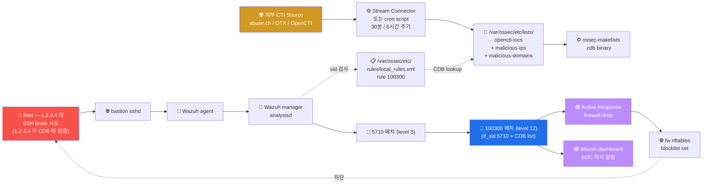

# Week 13 — OpenCTI (2) — IOC Feed → Wazuh CDB list 통합

> W12 의 STIX/TAXII 표준 위에, 실제 외부 IOC feed 를 **Wazuh 의 CDB list (Constant
> Database)** 에 자동 sync 하여 SIEM alert 의 level 을 자동 상승시키는 가장 단순
> 강력한 CTI ↔ SIEM 통합 패턴 학습. 본 주차는 W12 의 OpenCTI Stream Connector +
> Wazuh CDB list + Active Response 의 3 통합.

## 학습 목표

학생은 본 주차 종료 시 다음을 수행할 수 있어야 한다.

1. **Wazuh CDB list** 의 구조 + key-value lookup + .cdb binary index
2. **CDB list 등록** (ossec.conf 의 `<list>`) + 자동 rebuild
3. **rule 의 list lookup** (`<list field="..." lookup="...">...</list>`)
4. **lookup 모드 5** (address_match_key / match_key / match_key_value 등)
5. **IOC feed 자동 갱신** — cron + abuse.ch / OTX 의 download
6. **OpenCTI Stream Connector** — Python script 의 STIX → CDB 변환
7. **Active Response 통합** — CDB 매치 시 fw drop 자동
8. **운영 권장 + alert fatigue 방지**

## 강의 시간 배분 (3시간 40분)

| 시간      | 내용                                                                | 유형 |
|-----------|---------------------------------------------------------------------|------|
| 0:00–0:30 | 이론 — CDB list 구조 + lookup 모드 5                                | 강의 |
| 0:30–1:00 | 이론 — rule 의 list 매칭 + level 자동 상승                          | 강의 |
| 1:00–1:10 | 휴식                                                                 | —    |
| 1:10–1:40 | 이론 — IOC feed 자동 갱신 + cron                                    | 강의 |
| 1:40–2:00 | 이론 — OpenCTI Stream Connector + Active Response 통합               | 강의 |
| 2:00–2:30 | 실습 1, 2 — CDB list 작성 + ossec.conf 등록                          | 실습 |
| 2:30–2:40 | 휴식                                                                 | —    |
| 2:40–3:10 | 실습 3, 4 — rule 의 list lookup + 트리거                              | 실습 |
| 3:10–3:30 | 실습 5 — IOC 자동 갱신 cron + R/B/P                                 | 실습 |
| 3:30–3:40 | 정리 + W14 (Threat Hunting) 예고                                    | 정리 |

---

## 1. Wazuh CDB list 의 정의

### 1.1 CDB 란?

```
CDB = Constant Database (Dan Bernstein 의 데이터 형식)
      key-value 자료 구조
      읽기 매우 빠름 (O(1) lookup)
      파일 기반 (atomic update)

Wazuh 에서 사용:
  - text file (사람 읽기) → ossec-makelists → .cdb binary index
  - manager 가 alert 처리 시 lookup
```

### 1.2 CDB list 의 가치

```
1. Wazuh rule 안에서 빠른 IOC 매칭
2. text file 형식 → 외부 source (cron / Python script) 갱신 용이
3. 갯수 무관 (10K+ IOC 도 O(1) lookup)
4. .cdb 가 binary 라 lookup 매우 빠름 (10K row 도 1ms 미만)
```

### 1.3 사용 시나리오

```
1. Known malicious IP 차단
2. Known scanner UA 차단 (sqlmap / nmap / nikto)
3. Known phishing domain 차단
4. Compromised credential 매칭
5. Allowlist (정상 IP — false-positive 회피)
```

---

## 2. CDB list 의 형식

### 2.1 단순 텍스트 형식

```
# /var/ossec/etc/lists/malicious-ips
# 형식: key:value
# value 는 optional (단순 list 시 비움 가능)
1.2.3.4:c2_server
5.6.7.8:botnet
9.10.11.12:malware_distribution
185.156.73.31:abuse.ch
```

### 2.2 키 의 종류 5

```
1. IP address              : 1.2.3.4
2. CIDR (subnet)           : 1.2.3.0/24
3. domain                  : evil.com
4. hash (MD5/SHA256)        : abcdef0123...
5. arbitrary string        : sqlmap/1.5  (User-Agent)
```

### 2.3 .cdb binary 생성

```bash
# 변경 후 binary index 재 생성
sudo /var/ossec/bin/ossec-makelists

# 또는 wazuh-control reload 가 자동 호출
sudo /var/ossec/bin/wazuh-control reload
```

### 2.4 CDB list 의 위치

```
/var/ossec/etc/lists/      ← Wazuh 의 기본 CDB 디렉토리
  audit-keys
  amazon-account-roles
  ...
  malicious-ips             ← 사용자 정의
  malicious-hashes
  malicious-domains
  known-scanner-uas
```

---

## 3. ossec.conf 의 CDB list 등록

### 3.1 ruleset 섹션

```xml
<!-- /var/ossec/etc/ossec.conf -->
<ossec_config>
  <ruleset>
    <decoder_dir>ruleset/decoders</decoder_dir>
    <rule_dir>ruleset/rules</rule_dir>

    <!-- CDB list 등록 — 여러 개 가능 -->
    <list>etc/lists/malicious-ips</list>
    <list>etc/lists/malicious-hashes</list>
    <list>etc/lists/malicious-domains</list>
    <list>etc/lists/known-scanner-uas</list>
  </ruleset>
</ossec_config>
```

### 3.2 적용

```bash
# config 변경 후 reload
sudo /var/ossec/bin/wazuh-control reload

# 또는 restart (큰 변경 시)
sudo /var/ossec/bin/wazuh-control restart
```

### 3.3 검증

```bash
# binary index 가 생성 됐는지 확인
ls -la /var/ossec/etc/lists/*.cdb

# 예: malicious-ips.cdb
# size 가 0 이 아닌지
```

---

## 4. rule 의 list lookup

### 4.1 기본 syntax

```xml
<!-- /var/ossec/etc/rules/local_rules.xml -->
<group name="6v6,cti,custom,">

  <rule id="100300" level="12">
    <if_sid>5710</if_sid>   <!-- SSH failed login chain -->
    <list field="srcip" lookup="address_match_key">etc/lists/malicious-ips</list>
    <description>6v6 — SSH login from KNOWN malicious IP (CTI)</description>
  </rule>

</group>
```

### 4.2 lookup 모드 5

| lookup | 의미 | 사용 |
|--------|------|------|
| `match_key` | field 가 key 와 정확 일치 | 단순 매칭 |
| `match_key_value` | field 가 "key:value" 형식 매칭 | value 도 검사 |
| `not_match_key` | 매치 안 됨 | 화이트리스트 |
| `address_match_key` | IP / CIDR 매칭 (subnet 지원) | 본 주차의 핵심 |
| `address_match_key_value` | IP + value 매칭 | IP 의 label 도 검사 |

### 4.3 address_match_key 의 동작

```
CDB list:
  10.0.0.0/8:internal
  1.2.3.4:c2

rule 의 field=srcip 검사:
  srcip = 1.2.3.4 → match (CDB 의 1.2.3.4 매칭)
  srcip = 10.5.6.7 → match (CDB 의 10.0.0.0/8 subnet 매칭)
  srcip = 8.8.8.8 → no match
```

### 4.4 if_sid + list 결합

```xml
<rule id="100300" level="12">
  <if_sid>5710</if_sid>     <!-- 부모 rule (SSH failed login) -->
  <list field="srcip" lookup="address_match_key">etc/lists/malicious-ips</list>
  <description>SSH brute from malicious IP</description>
</rule>
```

해석:
1. parent rule (5710) 이 매치 (SSH failed login)
2. + CDB list 매칭 (srcip 이 malicious-ips 에 있음)
3. → level 12 alert

### 4.5 결과: alert level 자동 상승

```
원래:
  5710 SSH failed login (level 5)
  → alert.json 에 level 5 alert (medium)

CDB list 매치 후:
  100300 (level 12) 의 if_sid 5710 매치 + list 매치
  → alert.json 에 level 12 alert (critical)
  → dashboard 의 우선순위 자동 상승
  → SOC 분석가 즉시 알림
```

---

## 5. IOC Feed 자동 갱신

### 5.1 abuse.ch URLhaus

```bash
#!/bin/bash
# /usr/local/bin/wazuh-ioc-update-urlhaus.sh
set -e

URL="https://lists.blocklist.de/lists/all.txt"
OUT="/var/ossec/etc/lists/malicious-ips"
TMP="${OUT}.tmp"

# 1. 다운로드
curl -s "$URL" -o /tmp/ips_raw.txt

# 2. 정제 (주석 제외 + 빈 줄 제외 + 1000 개만)
grep -v "^#" /tmp/ips_raw.txt | grep -v "^$" | head -1000 | \
    awk '{print $1 ":blocklist.de"}' > "$TMP"

# 3. atomic move
mv "$TMP" "$OUT"

# 4. binary index 재 생성
/var/ossec/bin/ossec-makelists

# 5. Wazuh reload
/var/ossec/bin/wazuh-control reload

# 6. log
echo "$(date) — Updated malicious-ips: $(wc -l < $OUT) entries" >> /var/log/ioc-update.log
```

### 5.2 cron 자동화

```cron
# /etc/cron.d/wazuh-ioc-update
0 */6 * * * root /usr/local/bin/wazuh-ioc-update-urlhaus.sh
```

매 6 시간 갱신.

### 5.3 OTX AlienVault

```bash
#!/bin/bash
# OTX_API_KEY 환경 변수 설정 필요
curl -s -H "X-OTX-API-KEY: $OTX_API_KEY" \
    "https://otx.alienvault.com/api/v1/indicators/export?types=IPv4&modified_since=$(date -d 'yesterday' -Iseconds)" \
    -o /tmp/otx_ips.json

# JSON → CDB
jq -r '.results[] | select(.indicator_type=="IPv4") | "\(.indicator):otx"' /tmp/otx_ips.json \
    >> /var/ossec/etc/lists/malicious-ips

# rebuild + reload
/var/ossec/bin/ossec-makelists
/var/ossec/bin/wazuh-control reload
```

### 5.4 OpenCTI Stream Connector (W12 참조 — 본 주차 핵심)

```python
#!/usr/bin/env python3
# /opt/opencti-wazuh-stream/main.py
#
# OpenCTI 의 indicator → Wazuh CDB list 자동 sync

import os
import time
import pycti
from datetime import datetime, timedelta

config = {
    "opencti_url": "https://opencti.local:8080",
    "opencti_token": os.environ["OPENCTI_TOKEN"],
    "connector_id": "wazuh-stream-001",
    "connector_type": "STREAM",
    "interval": 1800,    # 30분
}

helper = pycti.OpenCTIConnectorHelper(config)


def sync_indicators_to_wazuh():
    """OpenCTI → Wazuh CDB list 1 사이클"""

    # 1. 최근 7일 + malicious-activity 라벨의 indicator 조회
    indicators = helper.api.indicator.list(
        filters=[
            {"key": "valid_from",
             "values": [(datetime.now() - timedelta(days=7)).isoformat()]},
            {"key": "indicator_types",
             "values": ["malicious-activity"]}
        ],
        first=10000
    )

    helper.log_info(f"Found {len(indicators)} indicators")

    # 2. STIX pattern → CDB 형식 변환
    cdb_lines = []
    for ind in indicators:
        pattern = ind.get("pattern", "")
        labels = ",".join(ind.get("labels", []))

        # IPv4 추출
        if "ipv4-addr:value" in pattern:
            # [ipv4-addr:value = '1.2.3.4']
            ip = pattern.split("'")[1] if "'" in pattern else None
            if ip:
                cdb_lines.append(f"{ip}:{labels}")

        # domain 추출 (별 CDB list 로)
        elif "domain-name:value" in pattern:
            domain = pattern.split("'")[1] if "'" in pattern else None
            if domain:
                # /var/ossec/etc/lists/malicious-domains 에 별도 작성
                pass

    # 3. 임시 파일에 작성 (atomic move)
    out = "/var/ossec/etc/lists/opencti-iocs"
    tmp = f"{out}.tmp"
    with open(tmp, "w") as f:
        f.write("\n".join(cdb_lines))
    os.rename(tmp, out)

    # 4. Wazuh rebuild + reload
    os.system("/var/ossec/bin/ossec-makelists")
    os.system("/var/ossec/bin/wazuh-control reload")

    helper.log_info(f"Synced {len(cdb_lines)} indicators to Wazuh CDB")


# 무한 polling loop
while True:
    try:
        sync_indicators_to_wazuh()
    except Exception as e:
        helper.log_error(f"Sync failed: {e}")
    time.sleep(config["interval"])
```

---

## 6. Active Response 통합

### 6.1 CDB list 매치 → 자동 차단

```xml
<!-- /var/ossec/etc/ossec.conf -->

<!-- 명령 정의 -->
<command>
  <name>firewall-drop</name>
  <executable>firewall-drop</executable>
  <timeout_allowed>yes</timeout_allowed>
</command>

<!-- Active Response 의 trigger 룰 -->
<active-response>
  <command>firewall-drop</command>
  <location>local</location>
  <rules_id>100300</rules_id>    <!-- 위 §4 의 rule id -->
  <timeout>1800</timeout>          <!-- 30분 차단 -->
</active-response>
```

### 6.2 firewall-drop 의 동작

```bash
# /var/ossec/active-response/bin/firewall-drop.sh
# Wazuh 가 자동 호출

#!/bin/bash
# args: $1 = add / delete
# args: $2 = source IP
# args: $3 = rule ID

ACTION=$1
SOURCE_IP=$2

case $ACTION in
  add)
    # nftables drop set 에 추가
    nft add element ip filter blocklist { $SOURCE_IP }
    logger "Wazuh AR: blocked $SOURCE_IP"
    ;;
  delete)
    # timeout 후 자동 삭제 (Wazuh 가 호출)
    nft delete element ip filter blocklist { $SOURCE_IP } 2>/dev/null
    logger "Wazuh AR: unblocked $SOURCE_IP"
    ;;
esac
```

### 6.3 alert → AR 의 전체 흐름

```
1. attacker (1.2.3.4) 가 SSH brute 시도
2. Wazuh 5710 (SSH failed login) 매치 + level 5
3. 본인 100300 매치: 5710 + CDB list 의 1.2.3.4 → level 12
4. ossec.conf 의 active-response 가 100300 매치 detect
5. firewall-drop 호출 → nft add element
6. attacker 의 후속 시도 즉시 fw drop (timeout 30분)
7. 30분 후 자동 unblock
```

---

## 7. 알람 매트릭스 — CTI 통합 의 효과

| event | rule_id | level (전) | level (후, IOC 매치) | AR |
|-------|---------|------------|---------------------|----|
| SSH failed login | 5710 | 5 (medium) | 12 (critical) | fw drop 30분 |
| HTTP 404 burst | 31151 | 4 (low) | 12 (critical) | fw drop 30분 |
| HTTP unknown UA | 31115 | 3 (low) | 10 (high) | log only |
| ModSec block | 30317 | 6 (medium) | 12 (critical) | fw drop 30분 |
| Suricata alert | 86601 | 6 | 12 | fw drop |

IOC 매치 1건 만으로 alert 우선순위 자동 상승 → SOC 효율 향상.

---

## 8. 운영 권장 + alert fatigue 방지

### 8.1 alert fatigue 의 문제

```
1000+ alert / 일 → SOC 분석가 burnout
중요한 alert 가 noise 에 묻힘
critical 매치 가 분석가 손에 가는 데 시간 지연
```

### 8.2 CTI 통합 의 효과

```
1. level 12 alert 만 즉시 분석 (1-2건 / 일)
2. level 7+ alert 는 자동 ticket (자동화)
3. level 6 이하는 batch (분기 review)
4. CDB list 의 신뢰도 평가 (false-positive 비율)
```

### 8.3 운영 사이클

```
일별: alerts.json 의 level 12 alert review (5분)
주별: CDB list 의 신뢰도 review (어떤 IOC 가 false-positive 인지)
월별: IOC feed source 추가 / 제거
분기별: Coverage Matrix 갱신 + AR 효과 평가
```

---

## 9. ATT&CK + 한국 표준

### 9.1 ATT&CK Detect 매핑

본 주차의 CDB list 매칭 = ATT&CK 의 거의 모든 Tactic 의 IOC detection.

### 9.2 ISMS-P 2.10.7 + 2.6.4

- 2.10.7 보안위협 대응 — CTI 통합으로 사전 차단
- 2.6.4 네트워크 침입탐지 — Suricata + Wazuh 통합

### 9.3 KISA 의 IOC 공유

```
KISA 보호나라가 매년 발표하는 침해 사고의 IOC → 본 CDB list 에 추가
한국 ISAC 의 산업별 IOC 공유 → 정기 sync
```

---

## 10. R/B/P 시나리오 — CTI Wazuh 통합 1 사이클



---

## 11. 실습 1~5

### 실습 1 — CDB list 3 파일 작성

```bash
ssh 6v6-siem '
# 1. malicious-ips
cat > /tmp/malicious-ips <<EOF
1.2.3.4:c2_server
5.6.7.8:botnet
9.10.11.12:malware_distribution
185.156.73.31:abuse.ch
10.0.0.0/8:internal_range
EOF
sudo cp /tmp/malicious-ips /var/ossec/etc/lists/malicious-ips
sudo chown ossec:ossec /var/ossec/etc/lists/malicious-ips

# 2. malicious-domains
cat > /tmp/malicious-domains <<EOF
evil.com:phishing
malware.net:c2
attacker.example:test
EOF
sudo cp /tmp/malicious-domains /var/ossec/etc/lists/malicious-domains
sudo chown ossec:ossec /var/ossec/etc/lists/malicious-domains

# 3. known-scanner-uas
cat > /tmp/known-scanner-uas <<EOF
sqlmap:scanner
nmap:scanner
nikto:scanner
masscan:scanner
EOF
sudo cp /tmp/known-scanner-uas /var/ossec/etc/lists/known-scanner-uas
sudo chown ossec:ossec /var/ossec/etc/lists/known-scanner-uas

# 4. cat 으로 검증
sudo cat /var/ossec/etc/lists/malicious-ips
'
```

### 실습 2 — ossec.conf 에 등록 + reload

```bash
ssh 6v6-siem '
echo "=== ossec.conf 의 ruleset 섹션에 list 등록 (이미 있으면 skip) ==="
sudo grep -q "malicious-ips" /var/ossec/etc/ossec.conf || \
    sudo sed -i "/<ruleset>/a\\    <list>etc/lists/malicious-ips</list>\\n    <list>etc/lists/malicious-domains</list>\\n    <list>etc/lists/known-scanner-uas</list>" \
    /var/ossec/etc/ossec.conf

sudo grep -A5 "<ruleset>" /var/ossec/etc/ossec.conf | head -10

echo ""
echo "=== ossec-makelists — binary index 생성 ==="
sudo /var/ossec/bin/ossec-makelists

echo ""
echo "=== .cdb 파일 검증 ==="
sudo ls -la /var/ossec/etc/lists/*.cdb

echo ""
echo "=== reload ==="
sudo /var/ossec/bin/wazuh-control reload
'
```

### 실습 3 — rule 100300 작성

```bash
ssh 6v6-siem '
cat > /tmp/local_rules.xml <<EOF
<group name="6v6,cti,custom,">

  <!-- SSH login from known malicious IP -->
  <rule id="100300" level="12">
    <if_sid>5710</if_sid>
    <list field="srcip" lookup="address_match_key">etc/lists/malicious-ips</list>
    <description>6v6 — SSH login from KNOWN malicious IP (CTI)</description>
  </rule>

  <!-- HTTP UA = known scanner -->
  <rule id="100301" level="10">
    <if_sid>31115</if_sid>
    <list field="srcuser" lookup="match_key">etc/lists/known-scanner-uas</list>
    <description>6v6 — HTTP from known scanner UA</description>
  </rule>

  <!-- DNS query to malicious domain -->
  <rule id="100302" level="12">
    <if_sid>62100</if_sid>
    <list field="query" lookup="match_key">etc/lists/malicious-domains</list>
    <description>6v6 — DNS query to KNOWN malicious domain</description>
  </rule>

</group>
EOF
sudo cp /tmp/local_rules.xml /var/ossec/etc/rules/local_rules.xml
sudo chown root:wazuh /var/ossec/etc/rules/local_rules.xml

echo "=== 룰 작성 완료 ==="
sudo cat /var/ossec/etc/rules/local_rules.xml | head -25

echo ""
echo "=== reload ==="
sudo /var/ossec/bin/wazuh-control reload
sleep 5

echo ""
echo "=== wazuh-logtest 로 사전 검증 (시뮬) ==="
# wazuh-logtest 가 가능하면 사용
sudo /var/ossec/bin/wazuh-logtest 2>&1 | head -5 || echo "wazuh-logtest 미사용 가능"
'
```

### 실습 4 — 트리거 + alert 검증

```bash
# 학습 시뮬 — 실 brute force 안 함, fake log line 만 manager 에 inject
ssh 6v6-siem '
echo "=== 시뮬 — manager 에 fake auth.log line inject ==="
# manager 의 logcollector 로 직접 보냄 (학습용)
echo "$(date +"%b %d %T") sshd[12345]: Failed password for invalid user admin from 1.2.3.4 port 22" | \
    sudo /var/ossec/bin/wazuh-logtest 2>&1 | head -15

# alerts.json 확인 (5초 후)
sleep 5
echo ""
echo "=== alerts.json 의 100300 매치 ==="
sudo grep "100300" /var/ossec/logs/alerts/alerts.json 2>/dev/null | tail -3 | head -1 | jq
'
```

### 실습 5 — IOC 자동 갱신 cron

```bash
ssh 6v6-siem '
# 1. 갱신 script 작성
cat > /tmp/wazuh-ioc-update.sh <<EOF
#!/bin/bash
URL="https://lists.blocklist.de/lists/all.txt"
OUT="/var/ossec/etc/lists/blocklist-de"
TMP="\${OUT}.tmp"

curl -s "\$URL" | grep -v "^#" | grep -v "^\$" | head -500 | \\
    awk "{print \\\$1 \":blocklist.de\"}" > "\$TMP"

mv "\$TMP" "\$OUT"
/var/ossec/bin/ossec-makelists
/var/ossec/bin/wazuh-control reload
echo "\$(date) — Updated blocklist-de" >> /var/log/ioc-update.log
EOF
sudo cp /tmp/wazuh-ioc-update.sh /usr/local/bin/wazuh-ioc-update.sh
sudo chmod +x /usr/local/bin/wazuh-ioc-update.sh

# 2. cron 등록 (예시 — 6시간 주기)
cat > /tmp/wazuh-ioc-cron <<EOF
# Wazuh IOC update — every 6 hours
0 */6 * * * root /usr/local/bin/wazuh-ioc-update.sh
EOF
sudo cp /tmp/wazuh-ioc-cron /etc/cron.d/wazuh-ioc-update

# 3. 시뮬 실행
sudo /usr/local/bin/wazuh-ioc-update.sh 2>&1 | head -5
ls -la /var/ossec/etc/lists/blocklist-de 2>&1 | head
wc -l /var/ossec/etc/lists/blocklist-de 2>&1
'
```

---

## 12. R/B/P 보고서

```markdown
# W13 R/B/P 보고서 — CTI ↔ Wazuh CDB list 통합

## Red 측 (시뮬)
- 가짜 SSH brute 시도 (1.2.3.4 가 CDB 에 있음)
- log injection 으로 manager 에 fake event

## Blue 측 Coverage
| Source | rule | level | AR |
| 5710 (SSH fail) | 부모 매치 | 5 | (없음) |
| 100300 (CDB match) | level 12 | critical | firewall-drop |

총 효과: alert level 5 → 12 자동 상승 + 30분 fw drop

## Purple 측 권장
1. blocklist.de + abuse.ch + OTX 의 3 source 통합
2. cron 6시간 주기 → SLA 의 균형 (실시간 vs 부하)
3. OpenCTI Stream Connector 별 lab (W12 도입 plan)
4. alert fatigue 의 평가 — false-positive 분기 review
5. Active Response 의 timeout 조정 (30분 → 1시간 검토)
```

---

## 12.5 R/B/P 공격 분석 케이스 확장 (본 주차 추가)

### 12.5.0 R/B/P 일상 비유 — 동네 안전 정보의 자동 우편 배달 + 자동 잠금

본 절은 OpenCTI Stream Connector + Wazuh CDB list + Active Response 의 3 통합을 동네 안전 정보의 자동 우편 배달 비유로 시작한다.

학생이 사는 동네의 안전 카페가 다음 한 시스템을 도입했다고 상상해보자.

- **자동 우편 배달.** 옆 동네에서 신고된 사기 phone 번호가 우리 동네 카페에 자동으로 도착한다 (Stream Connector).
- **자동 명단 갱신.** 카페가 도착한 정보를 보관함의 명단 (CDB list) 에 자동으로 추가한다.
- **자동 잠금.** 명단에 있는 번호가 우리 동네 가정의 전화로 걸려오면, 가정 출입문이 자동으로 5분간 잠긴다 (Active Response).

세 단계의 자동화가 결합되면 운영자의 손 없이도 외부 위협 정보가 본인 환경의 방어로 즉시 전환된다.

| 일상 비유 | 3 통합 |
|-----------|--------|
| 자동 우편 배달 | OpenCTI Stream Connector |
| 보관함 명단 갱신 | Wazuh CDB list 자동 update |
| 명단 매칭 시 알람 | rule 100xxx 의 list lookup |
| 자동 잠금 | Active Response (firewall-drop) |

본 절은 다음 세 케이스를 다룬다.

- 케이스 1 — 외부 IOC 가 CDB 로 자동 sync 된 직후 attacker VM 의 시도가 자동 alert 로 잡히고 즉시 차단되는 end-to-end cycle.
- 케이스 2 — Stream Connector 의 실패 시나리오 (network 단절, schema 변경) 와 운영자의 검증 절차.
- 케이스 3 — false positive 가 발견된 IOC 의 quarantine + Stream rollback.

원칙은 W01 ~ W12 와 같다. 재현 가능성, 도구 위주 분석, 신입생 친화, 학습 환경 한정.

### 12.5.1 케이스 1 — IOC 자동 sync → 자동 alert → 자동 차단 end-to-end

**0. 일상 비유 — 옆 동네 신고 → 우리 동네 명단 → 사기 전화 자동 차단.**

옆 동네에서 신고된 phone 번호 한 개가 우리 동네 카페에 30분 안에 자동 도착한다. 카페가 명단을 즉시 갱신한다. 한 시간 뒤 도둑이 그 번호로 우리 동네 한 가정에 전화를 건다. 가정의 자동 잠금 시스템이 명단을 즉시 조회해 출입문을 5분간 잠근다. 운영자가 손 댄 행위는 없지만 한 사건이 막혔다.

| 일상 비유 | 3 통합 cycle |
|-----------|--------------|
| 신고 도착 | Stream Connector 의 IOC ingest |
| 명단 갱신 | wazuh-makelists |
| 사기 전화 | attacker VM 의 시도 |
| 자동 조회 | rule 의 list lookup |
| 자동 잠금 5분 | Active Response timeout 300s |

**0a. 사용 도구 사전 안내.**

- **OpenCTI Stream Connector** — OpenCTI 의 indicator 변경을 실시간으로 외부 시스템 (Wazuh) 으로 push.
- **wazuh-makelists** — CDB list 의 binary index 생성. 자동화 가능.
- **firewall-drop** — Wazuh Active Response 의 표준 명령.

**1. Red — 공격 재현.**

먼저 OpenCTI 에 학습용 indicator 가 하나 등록되어 있다고 가정한다. W12 의 케이스 2 에서 작성한 attacker VM IP (`10.20.30.202`) 의 indicator 다.

Stream Connector 가 동작 중이면 본 indicator 가 자동으로 wazuh-siem 의 `/var/ossec/etc/lists/known_bad_ips` 에 한 줄 추가된다.

```
10.20.30.202:opencti_indicator,learning_only
```

다음으로 attacker VM 에서 web 의 SSH 에 시도를 보낸다.

```bash
ssh 6v6-attacker
# password: 1

# attacker VM 내부 (학습 환경 한정)
sshpass -p "wrong1" ssh -o ConnectTimeout=3 -o StrictHostKeyChecking=no \
    admin@10.20.32.80 'whoami' 2>/dev/null
```

**2. 발생하는 로그/아티팩트.**

- web 의 `/var/log/auth.log` — Failed password 한 줄.
- siem 의 alerts.json — rule 5710 (level 5) + list lookup 매칭으로 rule 100300 (level 12) 의 두 alert.
- web 의 `/var/ossec/logs/active-responses.log` — Active Response 발동 줄.
- web 의 iptables — `10.20.30.202` 의 DROP rule 한 줄 추가.

**3. Blue — 자동화 end-to-end 검증.**

학생이 다음 다섯 단계를 순서대로 확인한다.

**Step 1 — Stream Connector 가 IOC 를 CDB 에 sync 했는지 확인.**

```bash
ssh 6v6-siem
sudo grep "10.20.30.202" /var/ossec/etc/lists/known_bad_ips
```

한 줄이 보이면 sync 완료.

**Step 2 — wazuh-makelists 가 binary index 를 갱신했는지 확인.**

```bash
sudo ls -la /var/ossec/etc/lists/known_bad_ips.cdb
```

binary 파일의 mtime 이 최근 (예: 10분 이내) 이면 정상.

**Step 3 — alert 발생 확인.**

```bash
sudo tail -100 /var/ossec/logs/alerts/alerts.json \
  | jq -r 'select(.data.srcip=="10.20.30.202" and .rule.level>=12) | "\(.timestamp) rule=\(.rule.id) level=\(.rule.level) desc=\(.rule.description)"'
```

level 12 의 한 줄이 보이면 list lookup rule 정상 발동.

**Step 4 — Active Response 발동 확인.**

```bash
ssh 6v6-web
sudo tail -10 /var/ossec/logs/active-responses.log
```

`add 10.20.30.202` 의 한 줄이 보이면 자동 차단 발동.

**Step 5 — iptables drop rule 확인.**

```bash
sudo iptables -L INPUT -n --line-numbers | grep "10.20.30.202"
```

`DROP all -- 10.20.30.202` 의 한 줄이 보이면 차단 적용.

Wazuh Dashboard 에서도 한 query 로 통합 확인.

1. 좌측 햄버거 메뉴 → `Discover` 선택.
2. Index pattern `wazuh-alerts-*`.
3. Search bar 에 `data.srcip:10.20.30.202 AND (rule.level>=12 OR rule.groups:active_response)` 입력.
4. 결과의 timestamp 가 5초 이내 차이로 두 줄 (list lookup alert + active-response 발동) 이 보인다.

**4. Blue — 대응 의사결정.**

학생이 다음 세 가지를 판단한다.

- **end-to-end 시간 측정.** Red 시도 → list lookup alert → active-response → iptables 적용 까지의 시간 차. 5초 이내가 정상.
- **자동화의 부작용 risk.** 같은 IP 가 정상 운영자의 IP 였다면 운영자가 5분간 차단된다. case 3 에서 다룬다.
- **운영 가시화.** Active Response 의 발동 history 가 Dashboard 의 한 화면에서 보이는지 확인.

**5. Purple — 운영 baseline + 모니터링.**

다음 세 가지를 적용한다.

- **end-to-end latency 모니터링.** Stream ingest → CDB update → alert → AR 의 단계별 latency 를 측정해 baseline 정한다.
- **Active Response timeout 운영 정책.** 학습 환경 300s, 운영 환경 1800s. 반복 차단 시 점진 증가.
- **운영 dashboard 카드.** "오늘 자동 차단한 IP" + "각 IP 의 source (OpenCTI/Manual/Rule)" 한 화면 시각화.

본 케이스 cycle 한 바퀴는 약 25분 정도다.

### 12.5.2 케이스 2 — Stream Connector 실패 시나리오 + 운영자 검증

**0. 일상 비유 — 우편 배달 차량이 고장 나면 명단 갱신이 멈춤.**

자동 우편 배달 차량이 고장 나면 옆 동네 신고가 우리 동네 카페에 도착하지 못한다. 명단은 며칠 전 그대로 멈춘다. 그 사이에 새 사기 번호가 우리 동네로 전화를 걸어도 명단에 없어서 잠금이 발동되지 않는다. 운영자가 매일 차량 상태와 명단의 최신성을 점검해야 한다.

| 일상 비유 | Stream 실패 |
|-----------|-------------|
| 우편 차량 고장 | Stream Connector 의 process 종료 |
| 명단 정체 | CDB list 의 mtime 이 오래된 상태 |
| 새 사기 미차단 | 신규 IOC 가 CDB 에 없음 |
| 매일 점검 | Stream Connector health check + CDB freshness |

**0a. 사용 도구 사전 안내.**

- **Stream Connector 의 health endpoint** — OpenCTI 의 모든 connector 는 `/health` 와 같은 endpoint 제공.
- **CDB file 의 mtime** — `stat -c %y <file>`.
- **alert decoder** — Stream Connector 자체의 disconnect alert.

**1. Red — Stream Connector 실패 시뮬.**

학습 환경에서 Stream Connector container 를 일부러 멈춘다.

```bash
# OpenCTI 가 학습 환경에 설치되어 있다고 가정
sudo docker stop opencti-connector-stream-wazuh

# 또는 process 종료 시뮬
sudo systemctl stop opencti-stream-connector  # 학습 환경에 systemd 등록된 경우
```

연결이 끊긴 동안 OpenCTI 에 새 indicator 를 등록해도 CDB 에 sync 되지 않는다.

OpenCTI UI 에서 새 학습용 indicator 한 줄 추가.

```
indicator--{new-uuid}
pattern: [ipv4-addr:value = '10.20.30.203']
labels: learning-only, new-test
```

**2. 발생하는 로그/아티팩트.**

- OpenCTI 의 새 indicator 는 등록 완료. UI 에 보임.
- siem 의 CDB list (`known_bad_ips`) 에는 새 IP 가 없음.
- Stream Connector 의 process 가 종료된 상태.

**3. Blue — 5 단계 health check.**

**Step 1 — OpenCTI UI 에서 connector 상태 확인.**

OpenCTI UI 의 클릭 흐름.

1. 좌측 메뉴 → `Data` → `Ingestion` → `Connectors` 선택.
2. `Wazuh Stream Connector` 행을 찾는다.
3. `Last update` 컬럼의 시각이 1시간 이상 오래되었으면 비정상.
4. 우측의 `Status` 가 `inactive` 또는 `disconnected` 면 직접 증거.

**Step 2 — connector container 상태 확인.**

```bash
sudo docker ps -a | grep -i stream
```

`Exited` 상태면 연결 끊김.

**Step 3 — siem 의 CDB file mtime 확인.**

```bash
ssh 6v6-siem
stat -c '%y %n' /var/ossec/etc/lists/known_bad_ips
```

mtime 이 6시간 이상 정체면 비정상 가능성.

**Step 4 — Wazuh manager 의 connector disconnect alert 확인.**

```bash
sudo tail -200 /var/ossec/logs/alerts/alerts.json \
  | jq -r 'select(.rule.description? | tostring | contains("connector")) | "\(.timestamp) \(.rule.description)"'
```

connector disconnect 의 별도 rule 이 있으면 alert 가 한 줄 보인다.

**Step 5 — 자가 진단 dashboard.**

Wazuh Dashboard 의 클릭 흐름.

1. 좌측 햄버거 메뉴 → `Discover` 선택.
2. Index pattern `wazuh-alerts-*`.
3. Search bar 에 `rule.groups:cti AND rule.description:*disconnect*` 입력.
4. Time picker `Last 24 hours`.

**4. Blue — 대응 의사결정.**

학생이 다음 세 가지를 판단한다.

- **즉시 복구 vs 임시 수동 update.** Stream 복구가 가능하면 즉시 복구. 시간이 걸리면 수동으로 abuse.ch URLhaus 또는 OpenCTI CSV export 로 CDB list 한 번 update.
- **본인 환경의 노출 평가.** Stream 정체 동안 새로 등록된 외부 IOC 가 몇 개인지, 그 중 학습 환경에 매칭될 수 있는 패턴이 있는지 측정.
- **장애 history 의 root cause.** 이번 실패의 원인 (network, schema 변경, OOM 등) 을 식별해 다음 보강.

**5. Purple — Stream 안정성 운영 baseline.**

다음 세 가지를 적용한다.

- **Stream health monitor.** OpenCTI 의 connector 상태를 매 5분 cron 으로 polling 하고 disconnect 시 webhook alert.
- **CDB freshness monitor.** `known_bad_ips.cdb` 의 mtime 이 1시간 이상 정체되면 alert.
- **fallback 수동 update.** Stream 장애 시 abuse.ch URLhaus 의 CSV 를 매 시간 받아 CDB 에 merge 하는 보조 cron 운영.

### 12.5.3 케이스 3 — false positive IOC 의 quarantine + Stream rollback

**0. 일상 비유 — 옆 동네 신고가 잘못된 phone 번호로 우리 동네에 도착.**

옆 동네 신고자가 실수로 잘못된 phone 번호를 신고했다. 그 번호가 우리 동네에 자동 도착해 명단에 등록되었다. 그러나 그 번호는 사실 우리 동네 한 정상 입주민의 번호다. 다음 통화 시 자동 잠금이 발동되어 정상 입주민이 5분간 출입 못 한다. 카페 운영자가 즉시 그 번호를 명단에서 빼고, 옆 동네에 잘못 신고된 정정 알림을 보낸다.

| 일상 비유 | false positive IOC |
|-----------|---------------------|
| 잘못 신고된 번호 | confidence 가 낮은 IOC |
| 정상 입주민 차단 | 정상 운영 IP 의 false positive |
| 명단에서 빼기 | CDB 에서 해당 entry 제거 |
| 정정 알림 | OpenCTI 의 indicator revoke |
| 다른 동네 동기화 | Stream 의 update flow |

**0a. 사용 도구 사전 안내.**

- **OpenCTI indicator 의 `revoked: true` 필드** — false positive 의 표준 표현.
- **CDB list 의 entry 제거** — sed 한 줄로 가능.
- **active-response 의 manual rollback** — `firewall-drop.sh ... delete <ip>`.

**1. Red — false positive 시뮬.**

학습 환경에서 잘못 등록된 IOC 한 개를 가정한다. 학습 환경의 정상 운영 host (예: web VM 의 IP `10.20.32.80`) 가 잘못 known_bad_ips 에 등록되었다고 가정.

```bash
ssh 6v6-siem
echo "10.20.32.80:opencti_indicator,false_positive_test" \
  | sudo tee -a /var/ossec/etc/lists/known_bad_ips
sudo /var/ossec/bin/wazuh-makelists
```

다음 부터는 web VM 자신의 정상 SSH probe 가 web VM 자신을 차단하는 false positive 가 발생한다.

**2. 발생하는 로그/아티팩트.**

- 정상 운영 host 의 SSH probe 시도가 rule 100300 (list lookup) 으로 잡혀 level 12 alert.
- Active Response 가 web VM 자신을 5분간 iptables drop.
- 운영팀이 dashboard 에서 정상 운영의 갑작스러운 중단을 본다.

**3. Blue — false positive 식별 + 즉시 quarantine.**

**Step 1 — alert 의 src/dest 확인.**

```bash
ssh 6v6-siem
sudo tail -100 /var/ossec/logs/alerts/alerts.json \
  | jq -r 'select(.rule.id=="100300") | "\(.timestamp) src=\(.data.srcip) agent=\(.agent.name)"'
```

src 가 정상 운영 host 인지, agent 가 본인 host 인지 본다.

**Step 2 — IOC source 확인.**

```bash
sudo grep "10.20.32.80" /var/ossec/etc/lists/known_bad_ips
```

`opencti_indicator` source tag 가 보이면 OpenCTI 출처. `manual` 이면 운영자 등록.

**Step 3 — OpenCTI UI 에서 해당 indicator 의 revoke.**

OpenCTI UI 의 클릭 흐름.

1. 좌측 메뉴 → `Observations` → `Indicators` 선택.
2. Search bar 에 `10.20.32.80` 입력.
3. 결과의 indicator 한 줄을 클릭.
4. 상단의 `Edit` 또는 `Actions` 메뉴에서 `Mark as revoked` 선택.
5. confirm.

revoked 처리되면 Stream Connector 가 자동으로 CDB list 에서 해당 entry 를 제거한다.

**Step 4 — CDB list 의 entry 직접 제거 (긴급 시).**

Stream 의 reflection 이 지연되는 경우 운영자가 직접 sed 한 줄로 제거.

```bash
ssh 6v6-siem
sudo sed -i '/^10.20.32.80:/d' /var/ossec/etc/lists/known_bad_ips
sudo /var/ossec/bin/wazuh-makelists
```

**Step 5 — Active Response rollback.**

이미 차단된 iptables rule 을 즉시 풀어준다.

```bash
ssh 6v6-web
sudo /var/ossec/active-response/bin/firewall-drop.sh delete srcip=10.20.32.80
sudo iptables -L INPUT -n | grep "10.20.32.80" || echo "rollback complete"
```

**4. Blue — 대응 의사결정.**

학생이 다음 세 가지를 판단한다.

- **수동 quarantine 의 안전한 순서.** OpenCTI revoke (장기 보존) → CDB 제거 (즉시 효과) → iptables rollback (이미 차단된 entry) 의 순서.
- **공개 의 영향.** false positive 가 다른 환경에도 전파되었을 가능성. Stream 의 source 가 OpenCTI 이면 같은 OpenCTI 를 구독하는 다른 환경에도 같은 false positive 가 있을 수 있다.
- **재발 방지.** 운영자가 confidence 가 낮은 IOC 의 자동 ingest 를 막는 운영 정책을 정한다.

**5. Purple — confidence 기반 운영 정책.**

다음 세 가지를 적용한다.

- **confidence threshold.** Stream Connector 의 ingest 단계에서 confidence 70 이상의 indicator 만 자동 CDB ingest. 70 미만은 운영자 manual review 만 통과.
- **정상 운영 IP whitelist.** 6v6 lab 의 4 내부 subnet (`10.20.30.0/24` ext / `10.20.31.0/24` pipe / `10.20.32.0/24` dmz / `10.20.40.0/24` int) 는 Stream ingest 시 자동 제외.
- **false positive 분기 검토.** 분기마다 발생한 false positive 의 source / confidence / impact 를 집계해 운영 baseline 보강.

### 12.5.4 본 절 정리

본 절은 W13 의 CTI ↔ SIEM 통합 학습을 실제 공격 분석 cycle 에 연결했다. 학생이 다음 능력을 갖춘다.

- OpenCTI Stream Connector → CDB list 자동 sync → rule lookup → Active Response 의 end-to-end 5 단계 cycle 을 직접 검증한다.
- Stream Connector 실패 시나리오에서 5 단계 health check 와 fallback 수동 update 로 운영을 유지한다.
- false positive 발생 시 OpenCTI revoke → CDB 즉시 제거 → AR rollback 의 안전한 순서로 운영을 복귀시킨다.

다음 주차 W14 에서는 능동적 위협 헌팅 cycle 을 같은 R/B/P 패턴으로 학습한다.

---

## 12.5 Windows Sysmon 해시 ↔ CDB lookup ↔ Wazuh alert (W03 위빙)

본 주차의 IOC Feed → CDB list 통합 패턴은 **Windows 측에서도 똑같이 강력**하다. 흐름:

```
OpenCTI/MISP CTI feed
   ├─ SHA256 해시 N개 추출 → /var/ossec/etc/lists/malware-sha256.cdb (db build)
   └─ rule + decoder:
       <rule id="100610" level="12">
         <if_sid>61603</if_sid>     <!-- sysmon_event1 -->
         <list field="data.win.eventdata.hashes" lookup="match_key">
              etc/lists/malware-sha256
         </list>
         <description>Sysmon ProcessCreate hash matches CTI feed (Windows malware)</description>
       </rule>
```

운영 결과 — Windows victim PC 가 우발적으로 다운로드한 binary 가 **CTI feed 해시와 일치하면 즉시
high-severity alert** 가 운영자 화면에 뜬다. CTI 의 가치가 endpoint 까지 도달하는 한 cycle.

> **IP/도메인 feed** 는 Linux 측에도 동작하지만, **해시 feed** 는 Windows Sysmon 이 없으면
> 의미가 없다 — W03 의 ingest 가 본 주차 CDB lookup 의 적용 범위를 두 배로 키웠다.

---

## 13. 과제

### A. CDB list 작성 (필수, 40점)

3 카테고리 (malicious-ips / malicious-hashes / malicious-domains) 각각 10+ entry +
ossec.conf 등록 + binary index 생성 + reload.

### B. rule 작성 (심화, 30점)

3 CDB list 각각 매칭 rule + level 12 + Active Response 연결.

### C. 자동 갱신 (정성, 30점)

본인이 선택한 무료 feed (AbuseIPDB / OTX / blocklist.de 등) 의 갱신 스크립트 + cron
+ 운영 권장.

---

## 14. 평가 기준

| 항목 | 비중 |
|------|------|
| CDB list (A) | 40% |
| rule 작성 (B) | 30% |
| 자동 갱신 (C) | 30% |

---

## 15. 핵심 정리 (10 줄)

1. **CDB list** = Wazuh 의 key-value lookup (Dan Bernstein Constant Database)
2. **5 lookup 모드** — match_key / address_match_key / not_match_key 등
3. **list 등록** = ossec.conf 의 `<ruleset><list>...</list></ruleset>`
4. **rule 의 list lookup** = `<list field="srcip" lookup="address_match_key">...</list>`
5. **alert level 자동 상승** (5 → 12) → SOC 효율
6. **IOC feed 자동 갱신** — cron + abuse.ch / OTX / blocklist.de
7. **OpenCTI Stream Connector** — STIX → CDB 변환 (W12 design)
8. **Active Response** = level 12 매치 → firewall-drop 30분
9. **alert fatigue 방지** = CTI 통합으로 우선순위 자동화
10. **W14 (Threat Hunting)** 다음 주차 — Sighting + Report
